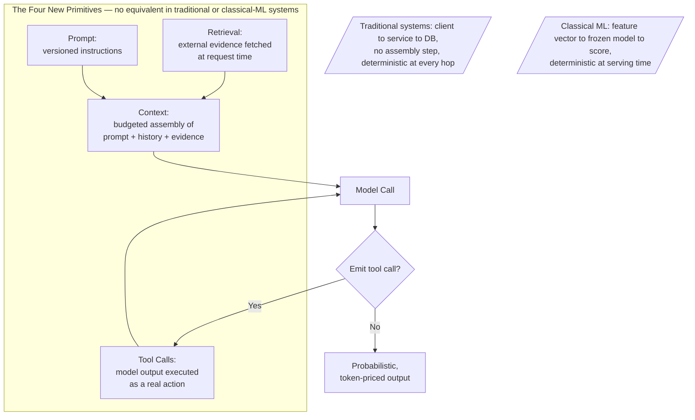
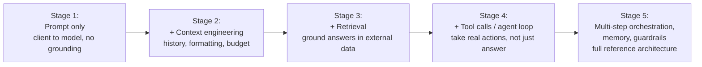
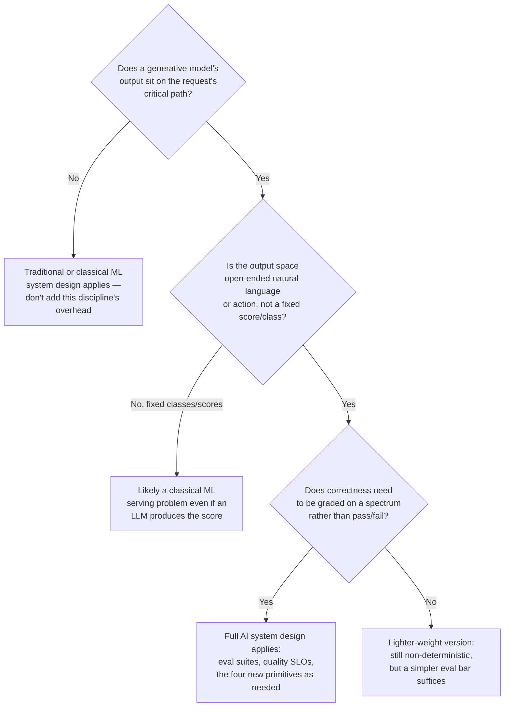

# Introduction to AI System Design

## Overview

AI System Design is the discipline of architecting production systems whose core unit of work is one or more calls to a generative model — and of accounting, everywhere in the architecture, for the fact that the model's output is probabilistic text or action rather than a deterministic computation. It borrows almost everything from traditional distributed-systems design and from classical ML system design, then adds a small number of genuinely new primitives and a reliability contract that no longer assumes "same input, same output." This chapter sets up the vocabulary, the comparison to what you already know, and the reading order the rest of these notes assumes.

## Definition

**AI System Design**, as used throughout these notes, is the practice of designing, scaling, and operating software systems in which a generative model call — typically an LLM, sometimes a multimodal model — sits on the critical path of the request, and in which the system's correctness, cost, and latency are all functions of that call's non-deterministic, token-priced, quality-graded output. This is distinct from two disciplines it sits on top of: **traditional distributed-systems design** (the study of services, queues, databases, and consensus, where a given input to a given code path produces the same output every time) and **classical ML system design** (the discipline Chip Huyen's *Designing Machine Learning Systems* covers well: training pipelines, feature stores, and a model artifact that, once frozen and deployed, is deterministic at inference time for a fixed version — a fraud score or a ranking is reproducible given the same input vector). AI system design keeps the first discipline's infrastructure concerns and the second discipline's "model as a component" framing, but removes the assumption both could previously make for free: that calling the same function twice gives you the same answer.

## Problem Statement

Every assumption a systems engineer carries from prior experience needs to be re-checked the moment a generative model call enters the request path, and several of them are simply false in this new setting:

- **"Retry gives you the same result"** is false. A retried request to an LLM with non-zero temperature can produce a materially different answer — different facts emphasized, different tool calls chosen, occasionally a different conclusion — not just different wording. Idempotency keys still protect side effects (don't send the email twice), but they do nothing to guarantee the *content* of a retried generation matches the first attempt.
- **"A passing test suite means the feature works"** is false. A handful of hand-picked example prompts passing in QA tells you almost nothing about the 1-in-200 input that triggers a hallucination, a refusal, or a wildly verbose answer that blows the cost budget — because the input space facing a generative model is effectively unbounded natural language, not a finite set of code paths.
- **"Fixed compute per request" is false.** A traditional API call's cost is roughly constant per request; an LLM call's cost and latency scale with how many tokens the model decides to emit, which is itself a function of the prompt, the model's mood (informally speaking), and the conversation length — making capacity planning a token-throughput problem, not a QPS problem (see [Capacity Planning Primer](04-capacity-planning-primer.md)).
- **"Quality is a property you ship once and keep"** is false. A model provider can silently update a model version behind a stable API name, a vendor's safety tuning can shift refusal behavior overnight, or a long-tail input distribution can drift — and your system's measured correctness can degrade with zero code changes on your side.
- **"Unit tests with exact assertions catch regressions"** is false. There is frequently no single correct string to assert equality against; correctness is graded on a spectrum (faithfulness, relevance, tone), which means the entire testing discipline has to be rebuilt around evaluation suites and judged outputs rather than `assertEqual` (see [LLM Evaluation Architecture](../19-evaluation/01-llm-evaluation-architecture.md)).

Teams that import distributed-systems instincts wholesale, without re-deriving which ones hold, build systems that pass every conventional health check while silently producing wrong answers, blowing budgets on pathological inputs, or regressing in ways no dashboard was built to catch.

## Why This Discipline Exists

Software systems acquired probabilistic components gradually, and each step changed less than the next one.

**Traditional distributed systems** (roughly: the last three decades of systems engineering) assumed determinism at the unit-of-work level. A service might be unreliable — networks partition, disks fail — but the *code* always did the same thing given the same input; reliability engineering was about handling infrastructure failure around a deterministic core, and the discipline (load balancing, replication, consensus) was built on that assumption holding.

**Classical ML systems** broke determinism at training time but, crucially, restored it at serving time for a fixed model version. A fraud-detection model or a recommendation ranker is trained on noisy, probabilistic gradient descent, but once frozen into a deployed artifact, scoring the same feature vector twice gives the same score. This is why classical MLOps could bolt mostly-conventional infrastructure thinking (CI/CD, canary deploys, A/B tests with fixed statistical tests) onto an ML core: the serving-time interface still behaved like a deterministic function, just one nobody could read the source code of.

**Generative AI systems** removed that restoration. An LLM's serving-time behavior is, by design, a sampling process over a probability distribution — the same prompt at temperature 0.7 can and will produce different completions across calls, and even temperature-0 decoding is not guaranteed bit-identical across hardware, batching configurations, or provider-side updates. The first thing most teams tried, understandably, was to treat the model call exactly like any other deterministic dependency: write a thin wrapper, treat the response like a typed RPC return value, test it with a few example assertions, and move on. This broke within the first few weeks of real traffic, for the three concrete reasons in the Problem Statement above — and the repair was not a patch to that approach, it was a different discipline: evaluation suites instead of unit tests, quality SLOs instead of pure uptime SLOs, and four genuinely new architectural primitives (below) that classical systems and classical ML systems never needed. AI System Design is the name for that repaired discipline, and the rest of this book is its curriculum, in the order a team typically needs to learn it.

## Core Concepts

- **Determinism vs. non-determinism** — whether the same input reliably produces the same output. Traditional systems and classical ML serving assume it; generative model calls do not, and every downstream design decision (retries, caching, testing) has to account for that directly rather than inherit an assumption that no longer holds.
- **Quality as a distribution, not a boolean** — correctness is measured as a graded score (faithfulness, relevance, helpfulness) sampled across many requests, not a pass/fail assertion on one. This is the conceptual replacement for "the test passed."
- **The four new primitives** — **prompts** (the instructions and framing sent to the model, now a versioned production artifact — see [Prompt Architecture](../03-prompt-architecture/index.md)), **context** (everything else placed in the model's input window alongside the prompt, and the budgeting discipline around it — see [Context Engineering](../04-context-engineering/index.md)), **retrieval** (fetching external, current, or proprietary information at request time so the model isn't limited to its training data — see [Retrieval Systems](../05-retrieval-systems/index.md) and [RAG](../06-rag/index.md)), and **tool calls** (the mechanism by which model output becomes a real, side-effecting action instead of just text — see [Tool Calling](../13-tool-calling/index.md)). Neither traditional distributed systems nor classical ML serving needed any of these four; a fraud model takes a feature vector and returns a score, with no analog to "what context should I assemble before I score this."
- **Eval as the new test suite** — a held-out, regularly-scored set of representative inputs (typically on the order of hundreds to a few thousand cases for a single product surface) used the way a unit-test suite is used in traditional software: as the release gate. See [LLM Evaluation Architecture](../19-evaluation/01-llm-evaluation-architecture.md).
- **The model as an external, semi-opaque dependency** — even a self-hosted model is a dependency whose exact behavior you cannot fully predict from its weights, and a third-party API model adds a release cycle, a rate limit, and a quality bar entirely outside your control. This reframes "is my dependency up" (traditional uptime) into "is my dependency up *and* behaving the way it did last week" (quality monitoring).
- **The cost/latency/quality triangle** — a recurring constraint, introduced briefly here and given full treatment in [Core Mental Models](02-core-mental-models.md), where improving one of the three at a fixed model and architecture generally costs you one of the other two. It recurs in nearly every later chapter under a different name.
- **Token economics** — the unit economics of an AI product: $ cost, latency, and quality are all functions of token count (input and output), in a way that has no equivalent unit in either traditional systems (where the unit is closer to "request") or classical ML systems (where the unit is closer to "inference call").

## Architecture

At the highest level, the three paradigms share a client and a backend, but generative AI systems insert a genuinely new layer between "the request arrives" and "the answer is computed" — the four primitives above, assembled before any model call happens.

```mermaid
flowchart TB
    subgraph Trad["Traditional Distributed System"]
        T1[Client] --> T2[API / Service Logic] --> T3[(Database)]
        T3 --> T2 --> T1
    end

    subgraph MLSys["Classical ML System"]
        M1[Client] --> M2[Feature Pipeline] --> M3[Frozen Model:\nscore = f(features)]
        M3 --> M4[Service Logic] --> M1
    end

    subgraph AISys["AI System"]
        A1[Client] --> A2[Prompt + Context\nAssembly]
        A3[Retrieval] --> A2
        A2 --> A4[Model Call:\nprobabilistic, token-priced]
        A4 --> A5{Tool Call\nneeded?}
        A5 -->|Yes| A6[Tool Execution] --> A4
        A5 -->|No| A1
    end
```

The detailed view shows what is genuinely new in the AI-system branch — the assembly step that has no analog in the other two paradigms, and the fact that "the model" is now one component among several rather than the entire backend. This is a deliberately compressed preview; the full layered reference architecture (gateway, guardrails, memory, observability, and the rest) is the subject of the next chapter, [Anatomy of an AI System](03-anatomy-of-an-ai-system.md), and is not duplicated here.



## Components

| Primitive | Responsibility | Does NOT own | First full treatment |
|---|---|---|---|
| Prompt | The instructions, role framing, and few-shot structure sent to the model; the part of the input a human authored deliberately | What else shares the context window with it (context's job) | [Prompt Architecture](../03-prompt-architecture/index.md) |
| Context | Deciding what occupies the model's input window — prompt, history, retrieved evidence, tool schemas — and at what token cost | Where retrieved evidence comes from, or how it's ranked (retrieval's job) | [Context Engineering](../04-context-engineering/index.md) |
| Retrieval | Fetching relevant, current, or proprietary information at request time so the model isn't limited to its training data | Generation itself; deciding *whether* a given request needs retrieval at all (an orchestration decision) | [RAG](../06-rag/01-rag-architecture.md) |
| Tool calls | Translating model-emitted structured output into a real, side-effecting action and feeding the result back in | The model's decision to call a tool in the first place; the tool's own internal logic | [Function Calling Architecture](../13-tool-calling/01-function-calling-architecture.md) |

None of these four rows exists in a classical ML system's serving path, and none of them exists in a traditional CRUD service either — a traditional service has request parsing and a database query, which look superficially similar to context and retrieval, but carry none of the token-budget, ranking-quality, or non-determinism concerns that make each of these primitives its own discipline here.

## Request Lifecycle

The clearest way to see non-determinism's practical consequence is to run the identical request twice and watch where the two runs diverge. Both runs share the same prompt, the same retrieved evidence, and the same tool — and still produce different output, because the divergence point is the model call itself, not anything upstream of it.

```mermaid
sequenceDiagram
    participant U as User
    participant CTX as Prompt + Context Assembly
    participant RET as Retrieval
    participant MOD as Model
    participant TOOL as Tool Layer

    U->>CTX: "What's our refund policy for orders over $500?"
    CTX->>RET: fetch policy docs (deterministic: same query, same top-k)
    RET-->>CTX: same ranked chunks, every time
    CTX->>CTX: assemble identical prompt + context (deterministic)
    CTX->>MOD: identical input, Run A
    MOD-->>CTX: "Orders over $500 qualify for a 30-day refund window with manager approval."
    Note over MOD: Run B, same exact input
    CTX->>MOD: identical input, Run B
    MOD-->>CTX: "For purchases above $500, refunds are available within 30 days; a supervisor must approve the request."
    Note over CTX,MOD: Same facts, different wording — usually harmless.\nThe risk case is when Run B drops a fact Run A included,\nor emits a tool call Run A did not.
```

Everything before the model call — retrieval's ranking, context assembly's budgeting — is itself deterministic software and behaves exactly like the traditional systems you already know how to reason about. The non-determinism is isolated to one hop, the model call, which is precisely why the architecture in [Anatomy of an AI System](03-anatomy-of-an-ai-system.md) treats that hop as a distinctly-monitored, distinctly-evaluated component rather than spreading uncertainty across the whole request — a system designed this way can pin down "where did this answer's variability come from" to one layer, instead of debugging the entire stack.

## Design Patterns

Production teams do not adopt all four new primitives at once; they accrete in a fairly consistent order as a product's requirements grow, and that order is also, not coincidentally, the order this book's curriculum is organized in (Prompt Architecture → Context Engineering → Retrieval/RAG → Tool Calling/Agents).



1. **Stage 1 — prompt only.** A direct client-to-model call with a well-written system prompt; sufficient for open-ended, non-factual, single-turn use cases. Most teams's first working demo lives here.
2. **Stage 2 — add context engineering.** Multi-turn conversation appears, and history needs explicit budgeting rather than unbounded concatenation; this is usually the first time a team has to think about token cost as a design constraint rather than an afterthought.
3. **Stage 3 — add retrieval.** The product needs to answer questions about facts the model wasn't trained on (internal docs, current data); this is the point at which "the model doesn't know our pricing page" forces a retrieval layer into the architecture.
4. **Stage 4 — add tool calls.** The product needs to *do* something, not just answer — send an email, query a live system, write a file — which requires a structured-output-to-action bridge and, usually soon after, an agent loop deciding when to call which tool.
5. **Stage 5 — the full reference architecture.** Memory, guardrails, and observability get added as the system matures past a single team's ability to manually eyeball every response; this is where [Anatomy of an AI System](03-anatomy-of-an-ai-system.md) picks up.

Skipping stages under deadline pressure — bolting on tool calls before context budgeting exists, for instance — is a common, expensive shortcut; each stage's primitive is usually a hard prerequisite for the next one to be reliable, not an independent feature you can add in any order.

## Tradeoffs

The first design decision in any new project is whether it needs AI system design discipline at all, or whether it's better served as a traditional or classical-ML system with no generative model on the critical path.



| Advantages of treating this as its own discipline | Disadvantages / costs of doing so |
|---|---|
| Catches the "retry gives a different answer" and "test passed but it still hallucinates" failure classes before they reach production | Requires building an eval suite and quality-monitoring infrastructure most teams don't already have |
| Token economics get modeled explicitly instead of discovered as a budget surprise | Adds genuine new primitives (retrieval, tool calls) that are real infrastructure, not configuration |
| Reliability targets get set honestly (a quality SLO, not just an uptime SLO) | Slower to a first demo than "just call the API," which is often indistinguishable from the full discipline at small scale |
| The four primitives compose with the rest of distributed-systems knowledge you already have, rather than replacing it | Easy to over-apply: not every feature with an LLM call needs the full retrieval+tools+agent stack |
| Vocabulary and patterns transfer across the rest of this book's curriculum | The discipline is younger and less standardized than either traditional or classical-ML systems — fewer battle-tested defaults to copy |

## Scalability

Scalability in an AI system has a dimension neither traditional nor classical-ML systems carry: **the eval surface has to scale with the input distribution, not just request volume.**

- **Traditional systems** scale by adding capacity (replicas, shards, caches) against a fixed, well-understood set of code paths; a load test against the known paths is sufficient confidence.
- **Classical ML systems** scale similarly for serving, with the added concern of feature-pipeline throughput, but the *model's behavior space* is still bounded by its fixed set of output classes or score range.
- **AI systems** face a request distribution that is effectively unbounded natural language; an eval suite of 500 cases that covered 95% of last quarter's traffic patterns can silently lose coverage as users discover new ways to phrase requests, and nobody gets paged when that happens — there's no error code for "the eval suite stopped representing production." Mature teams treat eval-set growth (mining new production cases into the suite, typically a continuous, not one-time, ~hundreds-of-cases-per-quarter activity) as a first-class scaling concern alongside infrastructure capacity.
- Each of the four new primitives also introduces its own classical scaling curve on top of this — retrieval scales with corpus size and query volume, tool calls scale with the rate limits of whatever external system they call — covered in depth in their respective chapters ([Retrieval Systems](../05-retrieval-systems/index.md), [Tool Calling](../13-tool-calling/index.md)).

## Reliability

The reliability contract changes in one specific, consequential way: **"available" stops being sufficient; "available and correct" becomes the target, and "correct" is now graded, not binary.**

| Paradigm | What "reliable" means | How it's measured |
|---|---|---|
| Traditional distributed system | Service responds within SLO, with correct output guaranteed by code correctness | Uptime, p50/p99 latency, error rate |
| Classical ML system | Service responds within SLO; model accuracy is a known, mostly-stable number measured offline pre-deploy | Uptime/latency plus a fixed offline accuracy/AUC number, rarely re-measured live |
| AI system | Service responds within SLO **and** output quality stays within a measured band, continuously, because quality can drift with no code change | Uptime/latency **plus** an ongoing quality signal (eval pass rate, LLM-as-judge score, thumbs-up rate) treated as its own SLO |

A concrete illustration: a support-bot eval suite scoring 91% "resolved correctly" against a 500-case regression set is a meaningless number on its own without a live monitoring signal showing that score hasn't quietly drifted to 84% after a silent provider-side model update — a failure mode with literally no equivalent in classical ML serving, where the deployed artifact's weights don't change underneath you between your deploys. [Reliability Engineering](../23-staff-level-architecture/09-reliability-engineering.md) covers the full SLO design for this; the point here is narrower: the *category* of thing you monitor for reliability has grown by one axis (quality), and that axis didn't exist in either paradigm this discipline is built on top of.

## Security

The four new primitives are also four new attack surfaces with no equivalent in the paradigms this discipline builds on — covered fully in [AI Security](../21-ai-security/index.md), but worth naming here because they trace directly back to this chapter's vocabulary:

- **Prompts and context** create a trust-boundary problem: content from retrieval or tool outputs enters the same channel as trusted instructions unless explicitly delimited, making **indirect prompt injection** possible in a way that has no analog in a traditional service, where user input and code are never the same channel.
- **Retrieval** introduces a new exfiltration surface: a corpus an attacker can write to (a wiki page, a support ticket) becomes a vector for injecting instructions that ride into the model's context the next time it's retrieved.
- **Tool calls** turn a successful prompt injection into a real-world action — sending data externally, modifying a record — which is a materially higher-severity outcome than a traditional injection attack confined to altering displayed text.

None of this is exotic; it's the direct consequence of adding primitives that traditional and classical-ML systems never had to secure.

## Cost Optimization

The unit economics are genuinely new. A traditional service's marginal cost per request is close to fixed (some CPU-seconds, a database round-trip); an AI system's marginal cost is a function of **token count**, which varies per request in a way that's hard to predict upfront:

- Frontier-tier models commonly price in the range of **$0.25-$15 per million input tokens and roughly $1-$15+ per million output tokens** as of mid-2025 — a 10-60x spread between "fast/small" and "frontier/large" tiers, meaning model selection is itself the single largest cost lever, before any other optimization.
- A request that adds retrieval (typically several thousand tokens of evidence) or a multi-step tool-calling loop (each iteration re-sending growing context) can easily cost **3-10x more** than the same user-facing feature implemented as a single direct model call — which is exactly why [Anatomy of an AI System](03-anatomy-of-an-ai-system.md) treats "does this request need retrieval/tools at all" as the single biggest cost-and-latency lever in the whole architecture.
- This is the first time most engineers encounter "cost per request" as a number that varies 10x+ across requests to the *same* endpoint depending on conversation length and output verbosity — a planning and budgeting problem [Core Mental Models](02-core-mental-models.md) and [Capacity Planning Primer](04-capacity-planning-primer.md) build the math for.

## Monitoring

Monitoring needs a new signal class layered on top of the conventional one, for the same reason reliability does:

- **Conventional signals carry over unchanged**: latency (p50/p95/p99), error rate, uptime — these still matter and still get monitored the same way as any service.
- **The new signal class is quality**: a continuously-sampled eval or judge score, a thumbs-up/down rate, a correction/escalation rate — without this, a model behaving differently after a silent provider update produces zero alerts on every conventional dashboard while users quietly get worse answers.
- **Token-level cost monitoring** becomes a first-class metric rather than a monthly invoice surprise, given how much marginal cost varies per request (see [Cost & Token Monitoring](../20-observability/03-cost-and-token-monitoring.md)).
- The practical takeaway for a team new to this discipline: if your dashboard only has the conventional three (latency, errors, uptime), you have a classical-systems dashboard bolted onto an AI system, and it will stay green through a real quality regression.

## Production Best Practices

- **Don't assume "it works" from a handful of manual tests** — build a representative eval set (even a first pass of 50-100 real or realistic cases) before scaling traffic, because the input space is too open-ended for spot-checking to substitute for systematic coverage.
- **Add the four primitives in order, as the product genuinely needs them** — prompt, then context budgeting, then retrieval, then tool calls — rather than reaching for an agent framework before a simple direct-generation version has been tried and measured (see [How Staff Engineers Think](../23-staff-level-architecture/01-how-staff-engineers-think.md) for the general version of this discipline).
- **Set a quality SLO alongside your uptime SLO from day one** — a system that's "up" 99.9% of the time but silently answering 15% of questions wrong has a reliability problem your dashboards won't show you without one.
- **Treat the model as a versioned, monitored external dependency**, even when it's your own self-hosted weights — pin versions deliberately, and alert on quality drift the same way you'd alert on a degraded upstream service.
- **Read this book in curriculum order on a first pass.** Each chapter assumes the vocabulary of the ones before it: [Core Mental Models](02-core-mental-models.md) next for the recurring constraints (cost/latency/quality, token economics), then [Anatomy of an AI System](03-anatomy-of-an-ai-system.md) for the full reference architecture every later chapter points back to, then [Capacity Planning Primer](04-capacity-planning-primer.md) for the back-of-envelope math. After Fundamentals, the curriculum follows the same Stage 1-5 adoption order from [Design Patterns](#design-patterns) above: LLM Architecture and Prompt Architecture, then Context Engineering and Retrieval/RAG, then Agents and Tool Calling, then Infrastructure/Serving, then Operations/Evaluation/Security, then Staff-Level Architecture and Interview Prep. If you're prepping for an interview specifically, start at [How AI System Design Interviews Work](../24-interview-prep/01-how-ai-system-design-interviews-work.md) instead and pull individual chapters in as needed.

## Real World Examples

These are illustrative, publicly observable patterns consistent with each product's known surface — not confirmed internal architecture.

- **ChatGPT**, serving on the order of hundreds of millions of weekly active users by 2025, makes the Stage 1→5 progression from this chapter visible as user-facing toggles: a base conversational mode (Stage 1-2), a "search/browse" mode (Stage 3, retrieval), and tool/plugin/action calling (Stage 4) — separately switchable rather than always-on, which is consistent with an architecture that engages each new primitive only when a request needs it.
- **GitHub Copilot**, an early and widely cited production LLM product (its founding engineers' published account is one of the source texts behind *Prompt Engineering for LLMs*), is a useful counter-example: its core completion surface deliberately stays close to Stage 1-2 (prompt plus tightly-budgeted file context, no retrieval or tool layer) to hold sub-second latency, illustrating that more primitives is not automatically "more mature" — the right stage is a function of the product's actual latency and correctness requirements, not a ladder everyone should climb to the top of.
- **Perplexity** sits almost entirely at Stage 3: nearly every answer is retrieval-grounded with inline citations, making retrieval the product's core value rather than an optional add-on — the clearest consumer-facing example of why retrieval became its own chapter ([RAG](../06-rag/index.md)) instead of a footnote under prompting.
- **Anthropic/Claude** has published guidance explicitly framing context as an engineered, budgeted resource (prompt and context caching, tool-use documentation) rather than something to maximize by raising the context-window ceiling — a public articulation of the context-engineering primitive this chapter introduces.

## Interview Questions

### Beginner

**Q: What is the single biggest difference between a traditional backend service and an AI system, as defined in this chapter?**
A traditional service is deterministic: the same input to the same code path always produces the same output. An AI system has a generative model call on its critical path, and that call is a probabilistic sampling process — the same input can produce different output across calls. Every other difference (new testing approach, new monitoring signals, new cost model) follows from that one property.

**Q: Name the four new architectural primitives this chapter introduces, and why none of them exist in a classical fraud-detection or recommendation model's serving path.**
Prompts, context, retrieval, and tool calls. A classical model takes a fixed feature vector and returns a score or class — there's no "what instructions do I phrase this with" (prompt), no "what else should share this input besides the features" (context), no "what current information should I fetch before scoring" (retrieval), and no "should this score's output cause some external action" (tool calls) built into that serving path the way they are for a generative model call.

### Intermediate

**Q: Why doesn't a passing test suite give you the same confidence in an AI system that it gives you in a traditional one?**
A traditional test suite asserts exact equality against a finite set of code paths, which is sufficient because the system is deterministic across that finite space. An AI system's effective input space is open-ended natural language, and correctness is graded on a spectrum (faithfulness, relevance) rather than boolean — a handful of passing example prompts says nothing about coverage of the long tail, and there's frequently no single "correct" string to assert against in the first place. This is why the discipline replaces unit tests with eval suites scored against a graded rubric, typically run continuously against hundreds to thousands of representative cases.

**Q: A classical ML system and an AI system both have a "model" component. Why does the AI system need a fundamentally different reliability strategy?**
A classical ML model is frozen at deploy time — given the same feature vector, it returns the same score until you deploy a new version, so "available" was already close to "correct." An AI system's model call can be non-deterministic even within the same deployed version (sampling), and a provider can change its behavior behind a stable API name with no deploy event on your side at all. Reliability for an AI system therefore needs an explicit, continuously-monitored quality SLO in addition to the uptime/latency SLO that was sufficient for the classical case.

### Senior

**Q: A team wants to add an LLM-based "smart summarize" feature to an existing product. Walk through which of the four new primitives it actually needs, and in what order you'd add them.**
Start by asking whether it needs more than Stage 1 (prompt only): if it's summarizing the current page's content, that content can likely be passed directly as part of the prompt with no retrieval needed — Stage 1-2 (prompt plus light context budgeting for the input length) may fully solve it. Only add retrieval if the summary needs to incorporate information beyond what's directly provided (e.g., related historical documents) — and only add tool calls if the feature needs to *do* something with the summary (file it, email it) rather than just display it. The mistake to avoid is reaching for a full retrieval-plus-agent architecture by default; each primitive is a real cost and complexity addition that should be justified by a concrete requirement, not added preemptively.

**Q: How would you explain to a engineering leader, who's used to classical ML system reliability numbers, why a 99.9% uptime AI system can still be failing users badly?**
Uptime measures whether the system responded, not whether the response was correct — and unlike a classical ML model (frozen, deterministic at serving time), a generative model's output quality can degrade through provider-side model updates, input distribution drift, or simply un-covered edge cases in the eval set, none of which trip an uptime or error-rate alert. The fix is showing them a quality metric (eval pass rate or sampled judge score) tracked over the same time window as uptime — the gap between "always up" and "still degrading" becomes visible only once that second axis is monitored.

### Staff

**Q: You're asked to set the reliability bar for a new AI product from scratch. What goes into that decision that wouldn't have gone into the equivalent decision for a classical ML system or a traditional service?**
Beyond the conventional latency/uptime SLOs, you need an explicit quality SLO with a stated measurement method (which eval set, what cadence, what threshold triggers a rollback) — and that SLO has to account for the fact that "correct" is graded, not binary, so the threshold is a calibration decision, not a hard pass/fail line. You also need to decide, per request type, which of the four new primitives are in scope, because each one (retrieval, tool calls) adds its own failure mode and its own degradation strategy (fall back to parametric-only generation, cap tool-loop iterations) that a classical ML system's reliability plan never had to specify. Finally, you need a plan for detecting silent model-provider changes — pinning versions where possible, and treating an un-pinned model dependency as a live monitoring obligation, not a one-time integration task.

**Q: Where does AI system design stop and classical ML system design start, for a feature that uses an LLM purely to produce a fixed-category classification (e.g., "is this support ticket urgent: yes/no")?**
This is the boundary case worth naming explicitly: if the LLM's output is constrained to a fixed, small set of classes and the input is a bounded feature-like representation, the system behaves much closer to classical ML serving — you can build a fairly conventional accuracy/precision-recall evaluation and treat the LLM as an unusually expensive, unusually flexible classifier. Full AI system design discipline (open-ended quality grading, context/retrieval primitives, token-cost variability) earns its complexity specifically when the output space is open-ended natural language or action, not a fixed label set — using the full discipline's overhead on a problem that's actually fixed-class classification is itself a design mistake, just in the opposite direction of under-applying it.

## Google-Level Follow-Ups

- "If you could make exactly one classical-ML-system assumption hold again for generative AI systems — pick determinism, fixed unit cost, or static quality — which would simplify this discipline the most, and what would still be hard even with it?" — probes whether the candidate sees that fixed unit cost would simplify capacity planning the most but leave correctness grading and context assembly fully unsolved, since those stem from the open-ended output space, not from cost variability.
- "A startup ships a generative-AI feature using zero of the four new primitives — no context budgeting, no retrieval, no tools, just a raw prompt-in-prompt-out call — and it works fine for a year. When does that stop being a reasonable architecture, and what's the first primitive that breaks first?" — probes for recognizing that context budgeting is usually the first forced addition (once multi-turn history exists), not retrieval or tools, and that "it worked for a year" is consistent with staying at Stage 1-2 deliberately rather than under-building.
- "How would you redesign the reliability contract in this chapter for a system where the model call is not user-facing — it scores internal documents overnight in a batch job?" — probes whether the candidate recognizes that latency SLOs mostly disappear, but the quality-drift problem (silent provider updates, distribution drift) is identical, testing whether they understand which properties of "AI system design" trace to non-determinism/quality grading (still apply) versus to real-time serving (don't).
- "Two teams disagree: one says every LLM-call feature needs a full eval suite before launch; the other says that's premature process for a low-stakes internal tool. Who's right, and what determines the answer?" — probes for a calibrated answer tied to blast radius and reversibility (echoing [How Staff Engineers Think](../23-staff-level-architecture/01-how-staff-engineers-think.md)) rather than a universal rule in either direction.

## Common Mistakes

- **Treating the model call like any other deterministic dependency** — writing a thin wrapper and testing it with a handful of fixed assertions, which silently fails the moment real, varied traffic arrives.
- **Adding all four new primitives before any of them is justified by a real requirement** — building retrieval and a tool-calling agent loop for a feature that a well-scoped prompt would have solved at a fraction of the cost and latency.
- **Porting classical ML's "frozen model, frozen accuracy number" mental model directly** — assuming a measured offline quality number stays true in production indefinitely, with no live quality monitoring to catch drift.
- **Skipping context budgeting and going straight to "just use a bigger context window"** — papering over an allocation problem with more room to hide unbounded growth in, rather than solving the underlying budgeting discipline (see [Context Engineering](../04-context-engineering/index.md)).
- **No quality SLO, only an uptime SLO** — shipping a dashboard that will stay green through a real, user-impacting quality regression because nothing on it measures correctness.
- **Assuming "it passed in testing" generalizes** — treating a handful of manually-checked example prompts as equivalent in rigor to the eval-suite discipline this field actually requires.

## Key Takeaways

- AI System Design sits on top of, and inherits most of, traditional distributed-systems design and classical ML system design — it does not replace either, it adds a discipline for the one assumption neither could keep: that a function call's output is deterministic.
- The single root cause behind almost every difference in this chapter is non-determinism at the model-call layer; testing, monitoring, reliability targets, and cost modeling all change as direct consequences of that one property.
- Four genuinely new architectural primitives — prompts, context, retrieval, and tool calls — have no equivalent in either prior paradigm, and production systems adopt them in a fairly fixed order (prompt → context → retrieval → tools) as requirements grow, matching this book's curriculum order.
- Quality must be measured as a continuous, graded signal and monitored as its own SLO, alongside (not instead of) conventional uptime and latency — a system can be "available" and simultaneously be failing its users in a way no conventional dashboard shows.
- Token economics replace fixed per-request cost as the unit-economics model, with a single model-tier choice routinely swinging marginal cost by 10-60x and retrieval/tool-call additions swinging it by another 3-10x on top of that.
- Not every LLM-powered feature needs the full discipline — a fixed-category classification task behaves closer to classical ML serving, and applying full AI-system-design overhead there is itself a mistake, just in the opposite direction of under-applying it elsewhere.
- The rest of this book follows the order this chapter sets up: [Core Mental Models](02-core-mental-models.md) for the recurring constraints, [Anatomy of an AI System](03-anatomy-of-an-ai-system.md) for the full reference architecture, and [Capacity Planning Primer](04-capacity-planning-primer.md) for the math — read in that order on a first pass.

---

*Part of [Fundamentals](index.md) in the [AI System Design Notes](../index.md). Tracked in [BACKLOG.md](https://github.com/GyanendraChaubey/AI-System-Design-Notes/blob/main/BACKLOG.md).*
