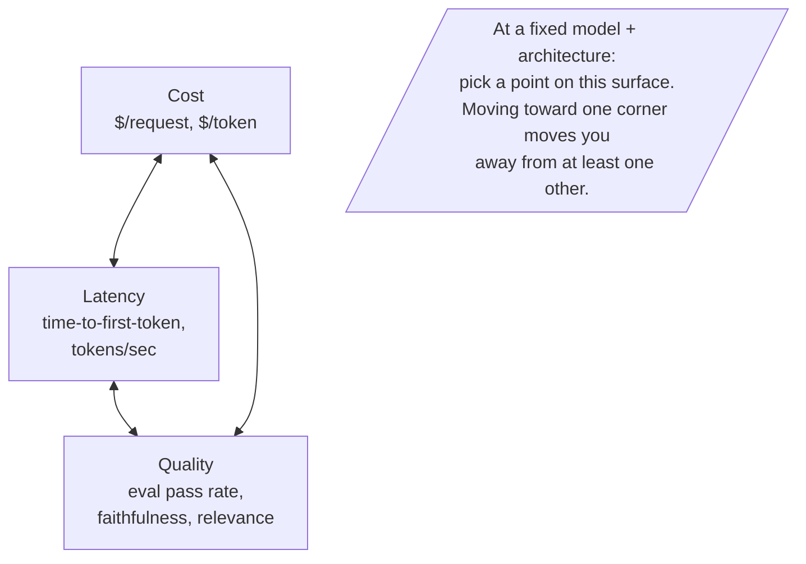
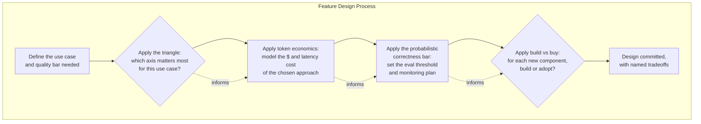
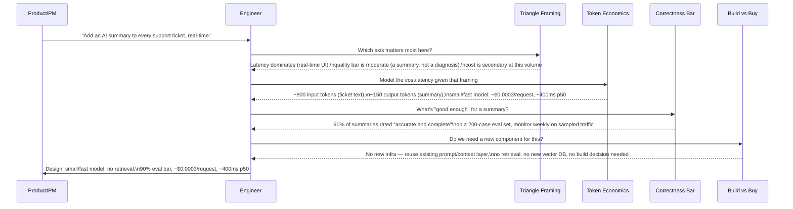
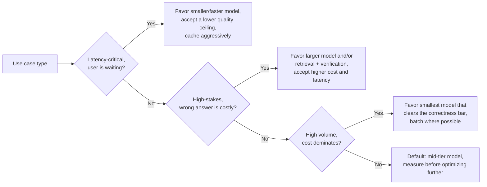
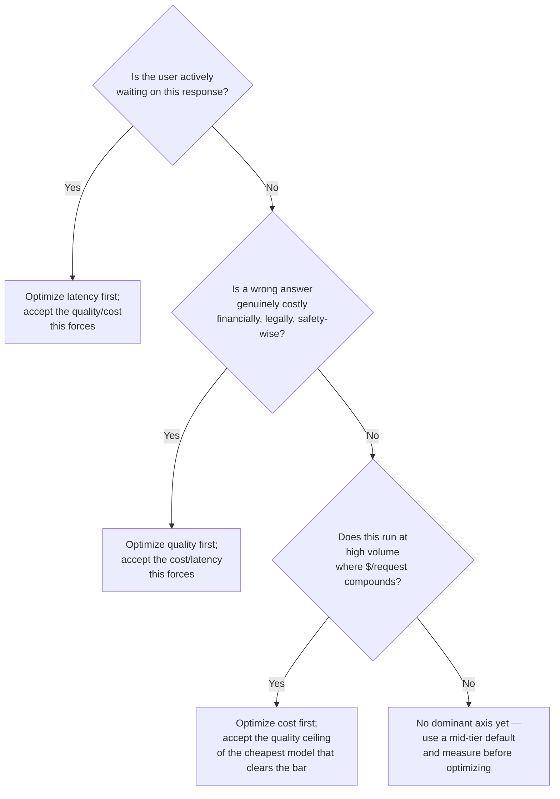

# Core Mental Models

## Overview

This chapter is a toolbox, not a system. It catalogs the handful of mental models — simplified, reusable frameworks for reasoning quickly about a recurring tradeoff — that show up, in some form, in nearly every later chapter of these notes: the cost/latency/quality triangle, token economics, the probabilistic correctness bar, and build vs. buy. None of these is new content on its own; what's new is naming them once, here, so every later chapter can invoke them by name instead of re-deriving them from scratch.

## Definition

A **mental model**, in the sense used here, is a deliberately simplified framework that lets you reason about a class of decisions fast and consistently, at the cost of precision you'd get from a full quantitative analysis — useful exactly because most decisions don't warrant that full analysis, and a shared, named model lets a team skip re-arguing first principles every time a similar decision comes up. The four covered in this chapter are not independent trivia; they compose. A single feature decision ("which model tier, and is RAG worth the added cost") typically invokes the triangle to frame the tradeoff, token economics to put a number on it, the probabilistic correctness bar to decide what "good enough" means, and build vs. buy to decide whether you're solving this with your own code or someone else's.

| Mental model | Answers the question | Does NOT answer | Full treatment |
|---|---|---|---|
| Cost/latency/quality triangle | Which axis am I trading away by optimizing this one? | What the actual $ or ms numbers are — that's a measurement, not a model | [Cost Engineering](../23-staff-level-architecture/07-cost-engineering.md), [Latency Engineering](../23-staff-level-architecture/08-latency-engineering.md) |
| Token economics | What drives this feature's real marginal cost and latency? | Whether the feature is *worth* that cost — a separate product decision | [Capacity Planning Primer](04-capacity-planning-primer.md), [Cost & Token Monitoring](../20-observability/03-cost-and-token-monitoring.md) |
| Probabilistic correctness bar | What does "good enough" mean for this feature, measured how? | How to build the eval harness itself | [LLM Evaluation Architecture](../19-evaluation/01-llm-evaluation-architecture.md) |
| Build vs. buy | Should I build this component or adopt an existing one? | The full multi-factor TCO comparison for a specific decision | [Build vs. Buy](../23-staff-level-architecture/02-build-vs-buy.md) |

Each model deliberately answers a narrow question fast; none of them is a substitute for the deeper chapter that does the full analysis — using a mental model past the point where the real numbers are cheap to get is itself one of this chapter's [Common Mistakes](#common-mistakes).

## Problem Statement

Without a shared vocabulary for these tradeoffs, teams re-litigate the same arguments from first principles on every project, and worse, they optimize the wrong axis without realizing it:

- An engineer caches aggressively to cut latency, not noticing the cache invalidation logic now risks serving stale answers — trading quality for latency without that tradeoff ever being named or approved.
- A team reports "$0.003 per request" as if it were a fixed unit cost, the way a traditional API call's cost is roughly fixed — and is blindsided when a feature's real-world token usage varies 5x by conversation length, because nobody modeled token economics as the actual cost driver.
- A team holds an LLM-based feature to "must be right" as a binary bar, the way a deterministic function is either correct or has a bug — and either ships something that technically can't meet that bar (no generative system is always right) or burns months chasing a guarantee the underlying technology doesn't offer.
- A team builds an in-house reranking service because building things is what the team is good at, without ever framing it as a build-vs-buy decision with a real total-cost-of-ownership comparison against a managed alternative.

Each of these is a failure to apply a mental model that, once named, takes minutes to apply correctly — which is the entire case for writing them down once rather than leaving every team to discover them independently, usually the expensive way.

## Why These Four Models

Each of these four models exists because an early, intuitive approach to the same problem broke in a specific, recurring way once real products and real traffic arrived.

**The triangle** exists because teams kept treating cost, latency, and quality as three independent dials to be each separately "optimized," and kept being surprised when turning one dial moved the other two. The triangle names the actual constraint: at a fixed model and architecture, you are choosing a point on a tradeoff surface, not independently maximizing three things.

**Token economics** exists because the first generation of LLM products inherited a "cost is roughly fixed per request" intuition from traditional APIs, and that intuition is false the moment output length, conversation history, and retrieval volume — all of which vary per request — are the actual cost drivers. A model that explicitly counts tokens, not requests, is what lets you predict a bill before you get it.

**The probabilistic correctness bar** exists because teams holding generative output to a deterministic "must always be correct" bar either ship something dishonest about its limits or stall indefinitely chasing a guarantee that doesn't exist for this technology — see [Introduction to AI System Design](01-introduction.md) for why non-determinism makes this unavoidable. The fix was reframing the target as a measured, monitored *rate* (a quality SLO), the same way reliability engineering reframed "the network is unreliable" into measured uptime targets instead of demanding the network never fail.

**Build vs. buy** exists, in this specific AI-systems form, because the build-it-yourself instinct that served well in traditional infrastructure (where commodity components were genuinely commodity, and differentiation came from your own code) stops being obviously correct once "build" might mean building and operating your own model-serving stack, your own eval harness, or your own vector database — each now a deep, fast-moving subfield in its own right, not a settled commodity.

## Mental Model 1: The Cost / Latency / Quality Triangle

The triangle is best understood not as three independent levers but as a single tradeoff surface: a model and architecture choice fixes the surface, and every subsequent decision (model size, retrieval depth, guardrail thoroughness) moves you to a different point on it — never off it.

**What the triangle tells you:** which axis you are implicitly trading away by optimizing the one you're focused on, and whether that trade was a conscious decision or an unexamined default.

**What it does not tell you:** what the actual $ or ms numbers are — those require measurement and token economics math (Model 2 below). The triangle frames the *direction* of a tradeoff; it does not quantify it.

**At scale:** token economics dominates more as volume grows. At low request volume, a 2x token-cost difference between model tiers is noise in a budget; at 10M+ requests/month, the same 2x difference is the line item finance asks about, which is why cost-dominant pattern adoption tracks volume growth, not just product type.

The design question is always: **which axis dominates for this specific use case?** — decided explicitly, not by default.

- **Latency-dominant** (chat UIs, autocomplete, inline suggestions): resolve toward latency first, accepting a real quality and capability ceiling.
- **Quality-dominant** (legal, medical, financial; anything where a wrong answer has real-world consequences): spend cost and latency freely to push quality.
- **Cost-dominant** (high-volume background classification, bulk summarization, anything run over a large corpus): push toward the smallest model that clears a measured correctness bar.
- **Not yet resolved**: most early-stage features haven't established which axis actually dominates — the correct move is a mid-tier model and real measurement before picking a corner.

## Mental Model 2: Token Economics

Token economics replaces "cost per request" with "cost per token," because token count — not request count — is what actually varies and drives both cost and latency in an AI system.

**The unit-cost model:**
- **Input tokens** are processed in parallel (the prefill phase) — comparatively fast and cheap per token.
- **Output tokens** are generated sequentially, one per forward pass — slower per token, and typically priced several times higher than input tokens.
- A request's cost is `(input_tokens × input_price) + (output_tokens × output_price)`, not a flat per-request fee.

**Concrete anchors (mid-2025 pricing):**
- Frontier-tier models: $0.25–$15 per million input tokens, $1–$15+ per million output tokens — a 10–60x spread between cheapest and most expensive tiers.
- Output-heavy pricing example: 1,000 input tokens + 300 output tokens at $1/M input and $5/M output → $0.001 + $0.0015 = $0.0025 total, with output cost exceeding input cost despite being less than a third of the token count.
- Prompt/context caching cuts 50–90% off the cost of the repeated, unchanged portion of a prompt (system instructions, few-shot examples) — a lever with no equivalent in a traditional request-costed system.
- A 2x cheaper model that still clears the correctness bar is a 2x cost win with zero quality cost — worth checking explicitly before assuming the largest available model is required.

**What token economics tells you:** what drives this feature's real marginal cost and latency, and what a realistic bill looks like before you incur it.

**What it does not tell you:** whether the feature is *worth* that cost — that's a separate product decision.

**At scale:** token cost differences that look like noise at low volume become the dominant budget line at 10M+ requests/month. A testing forecast built on average-case prompts systematically underestimates production cost once real long-tail usage patterns (longer conversations, more verbose outputs, heavier retrieval) show up. Re-derive from production token percentiles, not just the mean.

## Mental Model 3: The Probabilistic Correctness Bar

The target for a generative system is a measured *rate* — "correct or acceptable on X% of a representative eval set, monitored continuously" — not a boolean guarantee. This distinction matters more than it seems:

| | Deterministic system | AI system |
|---|---|---|
| What p50 latency tells you | Half of requests completed in under X ms, and (assuming no bug) all of them were correct | Half of requests completed in under X ms — says nothing about whether they were *right* |
| What "correct" means | Binary: matches the expected output, or a bug exists | Graded: a measured quality score, sampled across a distribution, monitored as its own percentile |
| The reliability target | Uptime + latency SLO is close to the whole story | Uptime + latency SLO **plus** a quality SLO (e.g., "p50 quality score ≥ 0.85, p10 ≥ 0.6, measured on rolling sampled traffic") |
| What breaks silently without the extra target | Nothing — a bug either shows up as an error or doesn't | Quality drift: every conventional dashboard stays green while users get worse answers |

A team that ports the deterministic-system habit of "p50 latency is good, ship it" without an accompanying quality percentile target has a classical-systems dashboard bolted onto an AI system, and it will stay green through a real quality regression.

**What the bar tells you:** what "good enough" means for this feature, expressed as a measurable, monitorable rate rather than an adjective.

**What it does not tell you:** how to build the eval harness that measures it — that's the subject of [LLM Evaluation Architecture](../19-evaluation/01-llm-evaluation-architecture.md).

**At scale:** the correctness bar gets harder to hold as the input distribution widens. An eval set that represented 95% of traffic at 1,000 requests/day can lose representativeness at 100,000 requests/day, once user populations and request phrasing diversify — the eval set itself needs to grow with traffic, not stay fixed.

## Mental Model 4: Build vs. Buy

Before designing any new component — a vector database, an eval harness, an orchestration layer — default to asking whether buying or adopting an existing solution is viable before assuming building is the answer. The full decision framework is developed in [Build vs. Buy](../23-staff-level-architecture/02-build-vs-buy.md); this chapter introduces only the lens, not the complete framework.

**The AI-specific case for this lens:** the build-it-yourself instinct that served well in traditional infrastructure stops being obviously correct once "build" might mean building and operating your own model-serving stack — a deep, fast-moving subfield with its own hiring market, its own on-call burden, and its own gap between "works in testing" and "runs at production load."

**Security implication:** buying shifts a real portion of your trust boundary to a vendor (their model weights, their data handling, their uptime) in exchange for not operating that component yourself — neither choice is more secure in the abstract, but they have different threat models, and the decision should name which one you're accepting, not default into it. An attacker who can trigger expensive generations without rate limiting also has a cost-based denial-of-service vector with no equivalent in a traditional fixed-cost-per-request service — see [AI Security](../21-ai-security/index.md) for the full treatment.

**What build vs. buy tells you:** for any new component, whether the default assumption should be "build" or "adopt" — shifting the burden of proof onto the less-common choice.

**What it does not tell you:** the full multi-factor TCO comparison for a specific decision at a specific scale — that's [Build vs. Buy](../23-staff-level-architecture/02-build-vs-buy.md).

**At scale:** build-vs-buy crossover points shift with volume. A managed vector database that's clearly the right buy decision at 100K documents can become a genuine build case at billions of vectors and extreme query rates, where a specialized, owned index pays for its operational cost — the decision is volume-dependent, not fixed for all time once made.

## How the Four Models Interact

The four models compose in a consistent order in practice — frame the tradeoff, price it, set the quality bar, then decide what infrastructure it requires. Reversing that order is a common source of wasted design cycles (e.g., picking a model before knowing which axis matters, or building infrastructure before the quality bar reveals you didn't need it).

**Worked example — "Add an AI summary to every support ticket, real-time":**

The walkthrough's real value is the order: the triangle identifies which axis matters (latency) *before* the team reaches for a model, which keeps them from speccing a quality-maximizing (expensive, slow) model for a latency-dominant task.

## Common Patterns

These models recur in a small number of recognizable usage patterns across very different feature types.

1. **Latency-dominant** (chat UIs, autocomplete, inline suggestions): the triangle is resolved toward latency first, accepting a real quality and capability ceiling — see [GitHub Copilot](../25-case-studies/06-github-copilot.md) staying close to a small, fast, context-only architecture deliberately rather than adding retrieval that would cost latency it can't spend.
2. **Quality-dominant** (legal, medical, financial outputs; anything with real-world consequence for being wrong): cost and latency are spent freely to push quality, often via a larger model plus retrieval plus a verification step, because the cost of a wrong answer dwarfs the cost of the extra tokens and milliseconds.
3. **Cost-dominant** (high-volume background classification, bulk summarization, anything run over a large corpus): token economics drives the decision toward the smallest model that clears a measured correctness bar, because at sufficient volume even a small per-token cost difference compounds into the dominant cost line.
4. **The default, unresolved pattern**: most early-stage features haven't established which axis actually dominates yet — the correct move is a mid-tier model and real measurement, not guessing which corner of the triangle to optimize toward before you have the data to know.

## Tradeoffs

The central question each new feature has to answer is which single axis of the triangle it should optimize for first — trying to optimize all three simultaneously, with no stated priority, is itself the most common failure mode.

| Advantages of naming these models explicitly | Disadvantages / costs |
|---|---|
| Forces an explicit, statable priority instead of an implicit, undebated one | A named "mental model" can be invoked lazily as a substitute for actually measuring the real numbers |
| Gives teams a shared vocabulary, cutting re-litigation of the same tradeoff from scratch each time | Oversimplifies — real tradeoffs sometimes genuinely require all three axes considered jointly, not picked one at a time |
| Makes the chosen tradeoff reviewable and revisitable later, since it's explicit instead of buried in code | Risk of dogmatic application — "the triangle says X" used to shut down a legitimate exception |
| Token economics catches cost surprises before they hit a monthly bill, not after | Models trained on rough, order-of-magnitude numbers can mislead if treated as precise |
| Build vs. buy as a default lens reduces reflexive over-building | Can bias toward buying even when building is genuinely the right call for a differentiating capability |

## Monitoring: A Dashboard Per Model

Each mental model has a corresponding dashboard signal a team should track continuously, not just analyze once:

- **Triangle**: cost, p50/p95 latency, and quality score tracked on the same dashboard, over the same time window — seeing all three together is what catches "we improved latency but quality silently dropped" before a user complaint does.
- **Token economics**: tokens (input/output, split) per request, and $ per request, trended over time — a creeping rise with no product change is the leading indicator of context bloat or a regression in response-length discipline.
- **Probabilistic correctness bar**: quality score percentiles (not just an average) on rolling sampled production traffic, compared against the offline eval set's score, to catch online/offline divergence early (see [Offline vs Online Evaluation](../19-evaluation/02-offline-vs-online-evaluation.md)).
- **Build vs. buy**: for bought components, vendor uptime and any contractual SLA against your own measured experience; for built components, the ongoing engineering cost (on-call load, feature backlog) against the original TCO estimate that justified building it.

## Production Best Practices

- **Name the dominant axis explicitly before designing**, in the feature spec itself — "this is a latency-dominant feature" or "this is quality-dominant" — so later optimization requests can be checked against a stated priority instead of re-argued from scratch.
- **Model token economics with real numbers before launch**, not after the first invoice — a rough back-of-envelope estimate (input tokens × input price + expected output tokens × output price × expected request volume) takes minutes and catches most surprises.
- **State the correctness bar as a number with a measurement method**, not an adjective — "good answers" is not a target; "≥90% rated acceptable on a 200-case eval set, monitored weekly on sampled production traffic" is.
- **Default to buy for anything that isn't your differentiation**, and revisit that default explicitly as volume or requirements change, rather than treating the original build-vs-buy call as permanent.
- **Re-derive, don't assume, which pattern applies as a feature matures** — a feature that started cost-dominant at low volume can become quality-dominant once it's trusted with higher-stakes use cases; the mental model's output is a function of current context, not a one-time classification.

## Real World Examples

These are illustrative, publicly observable patterns consistent with each product's known surface — not confirmed internal architecture or pricing strategy.

- **ChatGPT's** model picker, offering both fast and slower "reasoning" tiers, is a direct, user-facing exposure of the triangle: the product lets the user (or the system, via auto-routing) choose a different point on the cost/latency/quality surface per task rather than committing to one tradeoff for every request.
- **Anthropic/Claude's** published guidance on prompt caching is a token-economics lever made explicit and public — reusing the unchanged portion of a prompt across calls at a steep cached-token discount, rather than re-billing identical instructions on every request.
- **Perplexity** illustrates the cost-dominant and quality-dominant patterns coexisting in one product: cheaper/faster models are a plausible fit for query rewriting and routing, while the final synthesis step — the part users actually read and judge the product by — is the more plausible place to spend a larger model's cost and latency budget.
- **GitHub Copilot's** sub-second inline-completion latency target is the clearest public example of the latency-dominant pattern resolved all the way to one corner: the product accepts a real capability ceiling (no retrieval, no multi-step reasoning in the completion path) specifically to hold a latency bar that a richer architecture could not meet.

## Interview Questions

### Beginner

**Q: What does the cost/latency/quality triangle mean, and why can't you just optimize all three?**
At a fixed model and architecture, improving one of cost, latency, or quality generally trades away one of the other two — they're not three independent dials but three views of one tradeoff surface. You can choose where on that surface to sit (a faster, cheaper, slightly-lower-quality model, or a slower, pricier, higher-quality one), but you can't move toward one corner for free; the question to ask on any feature is which axis matters most for that specific use case.

**Q: Why doesn't "$0.003 per request" tell you what an AI feature will actually cost at scale?**
Because token count, not request count, is the real cost driver, and token count varies per request — by conversation length, retrieved context size, and how verbose the model's output happens to be. A single average obscures that variance; modeling cost as a function of input and output tokens, with a realistic range, gives a far more honest forecast than a single per-request number.

### Intermediate

**Q: Explain the difference between a "working p50" in a traditional system and a "working p50" in an AI system.**
In a traditional, deterministic system, a p50 latency target under some threshold with no errors is close to the whole reliability story — correctness is assumed (or caught by a bug report) for every request that completed. In an AI system, p50 latency says nothing about whether that response was actually correct; quality is graded on its own distribution and needs its own monitored percentile (a quality SLO) alongside the latency SLO, because a system can hit every latency target while its answer quality silently degrades with no error or slowdown to alert on.

**Q: A team wants to add retrieval to a chat feature to improve answer quality. Walk through how you'd use these mental models to evaluate that proposal.**
First, the triangle: retrieval typically costs latency (the retrieval round trip) and cost (more input tokens) to buy quality — confirm quality is actually the dominant axis for this feature before paying that cost. Second, token economics: estimate the added input tokens from retrieved chunks and the resulting $ and latency delta concretely, not abstractly. Third, the correctness bar: define what quality improvement you expect and how you'll measure it (an eval set comparing with/without retrieval), so the decision is evidence-based rather than assumed. Fourth, build vs. buy: check whether existing retrieval infrastructure can be reused before treating this as a new build.

### Senior

**Q: A feature's cost per request looks fine in testing but the monthly bill is 4x the forecast. Using token economics, where do you look first?**
Testing traffic rarely reflects production's tail: longer real conversations (more history tokens), more verbose real outputs, and higher retrieval volume per query than test cases exercised. Check the actual input/output token distribution in production against what was modeled — a forecast built on average-case test prompts systematically underestimates cost once real, long-tail usage patterns show up; the fix is re-deriving the estimate from production token percentiles, not just the mean.

**Q: How would you decide whether a feature is latency-dominant or quality-dominant when it's genuinely ambiguous — for example, an AI-assisted code review comment generator?**
Look at what failure actually costs the user: a slow comment is mildly annoying (latency-dominant penalty is small), but a wrong or misleading review comment costs reviewer trust and can ship a real bug past review (quality-dominant penalty is larger and compounds). When ambiguous, default toward quality-dominant for anything where a wrong answer creates downstream cost beyond the immediate interaction, and validate the choice with actual user behavior data (do users wait for or ignore slow-but-better suggestions) rather than guessing once and never revisiting it.

### Staff

**Q: How do you stop "the triangle" or "build vs. buy" from becoming a thought-terminating cliché that shuts down legitimate exceptions?**
Treat every mental model's output as a starting hypothesis that the real numbers (an actual cost model, an actual eval result, an actual TCO comparison) must confirm before a decision is finalized — the model tells you *what to go measure*, not what the answer is. The failure mode is citing "the triangle says quality costs latency" as a conversation-ending fact instead of a framing to test; the fix is requiring every mental-model-driven decision to cite the number it's based on, which makes lazy invocation visible and disagreeable on the actual data rather than the framing.

**Q: Design the cost/latency/quality posture for a single product that needs both a sub-second interactive mode and a slower, higher-quality "thorough" mode — what changes, and what stays the same?**
The mental models stay the same; the resolved point on the triangle differs by mode, and that has to be an explicit, designed choice rather than one mode accidentally inheriting the other's defaults. The interactive mode resolves toward the latency-dominant pattern (smaller/faster model, skip retrieval, accept a real quality ceiling); the thorough mode resolves toward the quality-dominant pattern (larger model, full retrieval, possibly multi-step verification, an accepted multi-second-to-multi-minute latency budget). Token economics and the correctness bar should be modeled and set independently per mode, since they're genuinely different products sharing one codebase, not one product with two latency settings — this is the same conclusion [Anatomy of an AI System](03-anatomy-of-an-ai-system.md#staff) reaches for chat-vs-deep-research, arrived at here from the cost/quality side rather than the architecture side.

## Google-Level Follow-Ups

- "If compute were free — zero cost, zero latency — would the triangle still constrain anything?" — probes whether the candidate sees that quality still has its own ceiling independent of cost/latency (a model's actual capability, an eval bar reflecting genuine task difficulty), so the triangle would collapse to a single quality axis, not disappear entirely.
- "Two teams used the same mental models and reached opposite conclusions on the same feature. How do you reconcile that without re-running the whole analysis?" — probes for recognizing this usually means the teams disagreed on which axis dominates (a product judgment) rather than misapplying the model itself, and that reconciliation means surfacing that disagreement directly.
- "At what point does 'buy' stop being the safe default and become the riskier choice?" — probes for understanding that vendor concentration, a capability that's becoming the product's core differentiator, or a vendor's own reliability becoming the binding constraint can flip the default — the lens is a default, not a permanent rule.
- "How would you adapt the probabilistic correctness bar for a system with no ground truth available at all — pure creative generation, for instance?" — probes whether the candidate recognizes the bar still applies but the measurement shifts to proxy signals (user engagement, explicit feedback, LLM-as-judge on softer criteria like coherence) rather than concluding no bar is possible.

## Common Mistakes

- **Treating a mental model as a substitute for measurement** — citing "the triangle" or "token economics" as the final answer instead of as a prompt to go get the real cost, latency, or quality number.
- **Optimizing all three triangle axes at once with no stated priority** — leads to incoherent decisions where one engineer trims latency while another adds quality-improving steps that quietly undo it, neither aware of the other's tradeoff.
- **Forecasting cost from average-case test prompts** — production's long-tail conversations and verbose outputs routinely make real cost several times the testing-derived estimate.
- **Holding a generative feature to a binary correctness bar** — either shipping something dishonest about its limits or stalling indefinitely chasing a guarantee the technology can't give.
- **Treating a build-vs-buy decision as permanent** — the right call at one volume or maturity level is not automatically the right call after 10x growth or a changed strategic priority.
- **Applying the latency-dominant pattern to a quality-dominant feature out of habit** — defaulting to "make it fast" because that's the familiar systems-engineering instinct, on a feature where a wrong answer costs far more than a slow one.

## Key Takeaways

- A mental model is a fast, named framework for a recurring tradeoff — useful for speed and shared vocabulary, not a substitute for the actual measurement it points you toward.
- The cost/latency/quality triangle means improving one axis at a fixed model and architecture generally costs you one of the other two; the design question is always which axis dominates for a given feature, decided explicitly, not by default.
- Token economics replaces "cost per request" with "cost per token," because token count — not request count — is what actually varies and drives cost and latency in an AI system; output tokens are typically the pricier half and the larger cost driver despite being fewer in number.
- A working p50 in an AI system tells you about latency, not correctness — quality needs its own measured, monitored percentile (a quality SLO) alongside the conventional latency and uptime targets, or real degradation passes through every dashboard unnoticed.
- Build vs. buy should be a default lens applied to every new component, not a one-time decision made once and never revisited as volume, requirements, or strategic differentiation shift.
- These four models compose in a consistent order in practice — frame the tradeoff (triangle), price it (tokens), set the bar (correctness target), then decide what infrastructure it requires (build vs. buy) — and reversing that order is a common source of wasted design cycles.
- The deeper, fully quantitative versions of each model are covered later in this book: [Cost Engineering](../23-staff-level-architecture/07-cost-engineering.md) and [Latency Engineering](../23-staff-level-architecture/08-latency-engineering.md) for the triangle, [Capacity Planning Primer](04-capacity-planning-primer.md) for token economics math, [LLM Evaluation Architecture](../19-evaluation/01-llm-evaluation-architecture.md) for the correctness bar, and [Build vs. Buy](../23-staff-level-architecture/02-build-vs-buy.md) for the full decision framework — this chapter is the shared vocabulary all of those assume.

---

*Part of [Fundamentals](index.md) in the [AI System Design Notes](../index.md). Tracked in [BACKLOG.md](https://github.com/GyanendraChaubey/AI-System-Design-Notes/blob/main/BACKLOG.md).*
