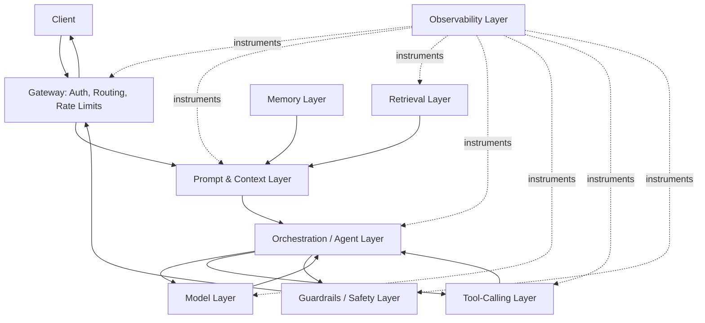
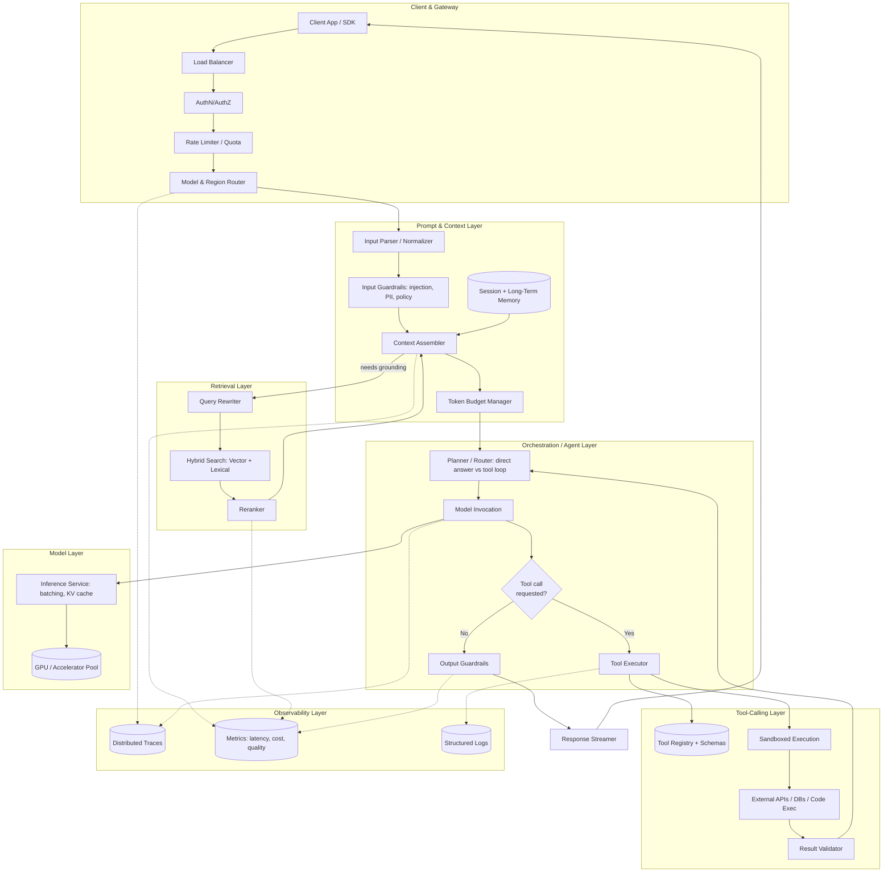
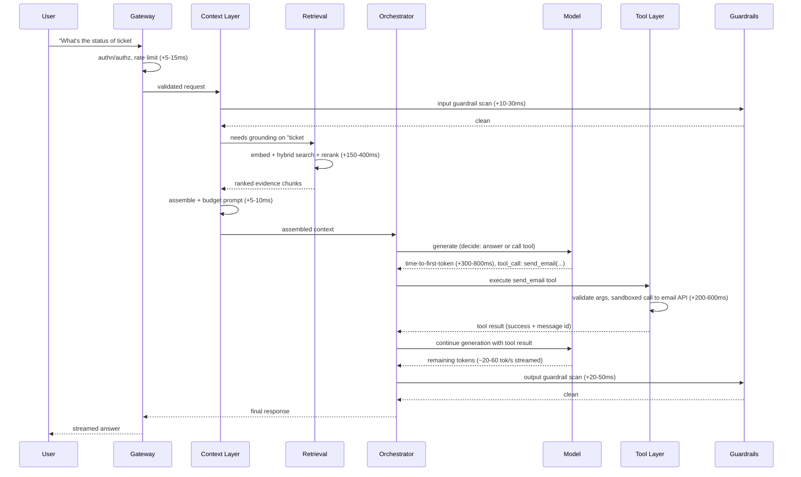
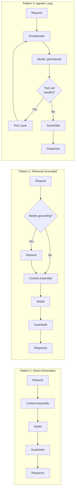
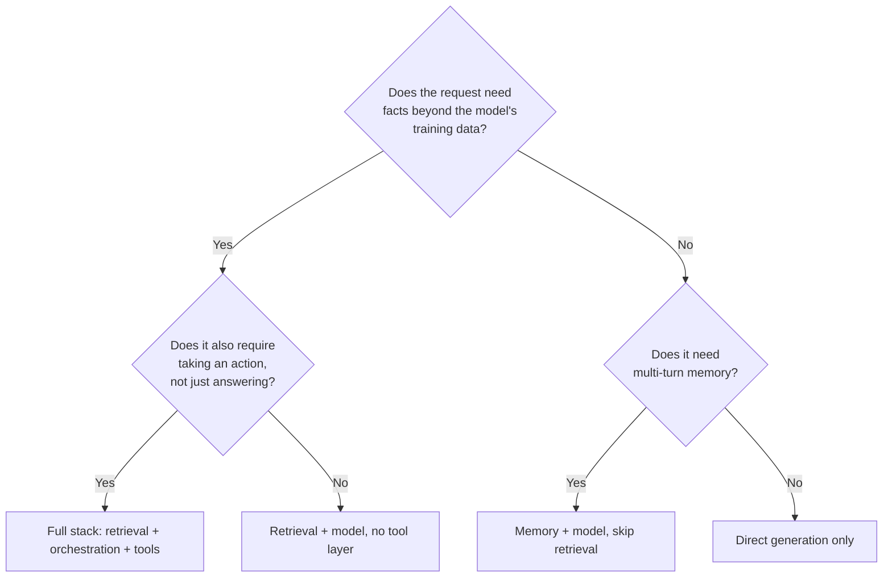

# Anatomy of an AI System

## Overview

Every production AI product — a chat assistant, a coding tool, an enterprise search bot, an autonomous agent — is built from the same small set of layers, assembled in the same order, for the same reasons. This chapter is the one diagram the rest of this handbook points back to: a 30,000-foot reference architecture showing how a client request becomes a grounded, tool-using, observable, safe model response, and which later chapter to read when you need to go deep on any single layer.

## Definition

An AI system, in the production sense used throughout this handbook, is a layered architecture that sits between a client and a model, composed of: a gateway (auth, routing, rate limiting), a prompt and context assembly layer, a retrieval layer, an orchestration/agent layer, the model layer itself, a tool-calling layer, a memory layer, a guardrails/safety layer, and an observability layer — each independently scalable, independently failing, and independently owned. The model is one component in this stack, not the stack itself; conflating "the model" with "the system" is the most common category error engineers new to this domain make.

## Problem Statement

A raw call to a model API is not a product. Without the surrounding layers:

- **No grounding** — the model only knows what it was trained on and what fits in the current message; it cannot look anything up.
- **No memory** — every request starts from zero; a ten-turn conversation either resends the entire history (cost and context-budget blowup) or the model forgets turn one by turn eight.
- **No action** — the model can only emit text; it cannot send an email, query a database, or call another service unless something outside the model parses its output and executes it.
- **No safety net** — nothing stops a user from extracting a system prompt, injecting instructions through retrieved content, or triggering an expensive infinite tool-calling loop.
- **No visibility** — when quality degrades or cost spikes, there is no per-stage signal to say which layer is responsible.

Each of these gaps is a different engineering problem with a different owner, a different failure mode, and a different scaling curve. Trying to solve all of them inside a single monolithic "prompt the model and hope" service is the architecture that production teams converge away from within the first two or three iterations — which is exactly why the layered version below is now the de facto standard.

## Why This Architecture Exists

Early LLM products were a single hop: client → model API → client. This worked for demos and broke immediately at production scale for three concrete reasons.

First, **each new capability has different scaling characteristics**. Retrieval scales with corpus size and query volume; the model layer scales with GPU/accelerator capacity and token throughput; tool-calling scales with the latency and reliability of whatever external systems are being called. Bolting all three into one service means the slowest, flakiest dependency drags down the whole request.

Second, **each capability fails differently and needs an independent blast radius**. A vector database outage should degrade retrieval, not take down chat. A tool timeout should fail that one tool call, not the conversation.

Third, **each capability is owned by a different team with a different release cadence** past a handful of engineers — a retrieval team iterates on chunking and reranking weekly; a platform team iterates on model routing and GPU capacity; a security team ships a new injection mitigation without waiting on a model upgrade train. Layering with clear interfaces is what makes that independent iteration possible.

The layered architecture here is the industry's convergent answer to those three pressures — less "one company's design" than the shape every team eventually arrives at, because the alternative does not survive contact with real traffic, real corpora, and real organizational structure.

## Core Concepts

- **Context engineering** — the discipline of deciding exactly what text (instructions, retrieved evidence, history, tool schemas) is placed in the model's context window for a given request, and in what order. See [Context Engineering](../04-context-engineering/index.md).
- **Retrieval** — fetching relevant external information at query time so the model can ground its answer in something more current or specific than its training data. See [Retrieval Systems](../05-retrieval-systems/index.md) and [RAG](../06-rag/index.md).
- **Orchestration** — the control flow that decides what happens next: call the model, call a tool, retrieve more evidence, ask a sub-agent, or return to the user. See [Agents](../09-agents/index.md).
- **Tool calling** — the mechanism by which a model's structured output is translated into a real side-effecting action (an API call, a database write, a code execution) and the result fed back in. See [Tool Calling](../13-tool-calling/index.md).
- **Memory** — state that persists across turns or sessions: conversation history, summarized facts about a user, or longer-term knowledge distinct from the retrieval corpus. See [Memory Systems](../12-memory-systems/index.md).
- **Guardrails** — checks applied to input, intermediate steps, or output that block, rewrite, or flag unsafe or out-of-policy content. See [AI Security](../21-ai-security/index.md).
- **Observability** — the metrics, traces, and logs that let an operator know which layer is responsible when quality, latency, or cost regresses. See [Observability](../20-observability/index.md).
- **The cost/latency/quality triangle** — a recurring constraint where improving one of cost, latency, or quality at a given layer generally costs you one of the other two; this shows up differently at every layer in this chapter (more on this in [Tradeoffs](#tradeoffs)).

## Architecture

The high-level view: a request enters through a gateway, gets assembled into context (with retrieval and memory feeding that assembly), is handed to an orchestration layer that may call the model directly or loop through tools, and every hop is checked by guardrails and recorded by observability.

The detailed view adds the internals each layer actually needs in production: caches, queues, fan-out to multiple tools, and the feedback path from guardrails back to the user instead of silently dropping a blocked request.

## Components

| Layer | Responsibility | Does NOT own |
|---|---|---|
| Gateway | AuthN/AuthZ, rate limiting, model/region routing, request validation | Prompt content, retrieval, generation |
| Prompt & context layer | Assemble instructions + history + retrieved evidence + tool schemas within a token budget | Where evidence comes from (retrieval), how it ranks |
| Retrieval layer | Turn a query into ranked, relevant evidence from an external corpus | Generation, deciding *whether* retrieval was needed (orchestration's job) |
| Orchestration/agent layer | Decide what happens next: answer directly, retrieve more, call a tool, hand off to a sub-agent | The tools' internal logic, the model's weights |
| Model layer | Run inference: tokenize, batch, generate, stream tokens | Tool execution, safety policy, retrieval |
| Tool-calling layer | Validate, execute, and sandbox side-effecting actions; return structured results | Deciding when to call a tool — that is orchestration |
| Memory layer | Persist and retrieve session state and longer-term user/agent knowledge | Source-of-truth corpus knowledge (that is retrieval's job) |
| Guardrails/safety layer | Screen input, intermediate, and output content against policy | Generation quality (a guardrail can block unsafe content, not fix mediocre content) |
| Observability layer | Capture traces, metrics, and logs at every other layer's boundary | Taking corrective action automatically (that is alerting → on-call, a human/automation decision) |

Each row in this table is a deliberate ownership boundary, not an implementation detail — the interface between rows is what lets these layers be built, scaled, and replaced independently. A team can swap the vector database behind retrieval, or switch model providers behind the model layer, without the other layers knowing anything changed, provided the interface contract (a ranked evidence list; a token stream) stays the same.

## Request Lifecycle

A single chat-style request, with a tool call in the middle, touches every layer. The latency budget below is illustrative and order-of-magnitude — actual numbers vary by provider, model size, corpus size, and infrastructure — but the *shape* (gateway is cheap, retrieval and the first model call dominate, tool round-trips are the wildcard) holds across most production systems.

Putting illustrative numbers on the budget for this two-hop (retrieval + one tool call) request:

| Hop | Typical range | Notes |
|---|---|---|
| Gateway (auth, routing, rate limit) | 5-15 ms | Should be near-fixed-cost regardless of request complexity |
| Input guardrail scan | 10-30 ms | Lightweight classifiers/regex; heavier checks run async where possible |
| Retrieval (embed → search → rerank) | 150-400 ms | Dominant cost when grounding is required; skippable for non-grounded requests |
| Context assembly | 5-10 ms | Pure string/token bookkeeping, rarely a bottleneck |
| First model call, time-to-first-token | 300-800 ms | Depends on model size, prompt length, and queueing/batching load |
| Tool round trip | 200-600 ms per call | The least predictable hop — bounded by the external system, not your stack |
| Second model call (post-tool) generation | streamed at ~20-60 tok/s | Throughput, not latency, dominates user-perceived time here |
| Output guardrail scan | 20-50 ms | Runs before the response is released to the client |

A simple, non-grounded, no-tool chat turn can land time-to-first-token around 0.5-1 second; the same request with retrieval and one tool call realistically lands in the 1.5-3 second range before streaming even starts — which is why orchestration logic that skips retrieval or tool calls when they are not needed is a latency optimization, not just a cost one.

## Design Patterns

Three patterns recur across how teams actually wire these layers together, in roughly the order organizations adopt them as requirements grow from "answer a question" to "act on the user's behalf."

1. **Direct generation** — gateway → context assembly (instructions + history only) → model → guardrails → response. No retrieval, no tools. Appropriate for open-ended creative or conversational requests with no factual grounding requirement.
2. **Retrieval-grounded generation** — orchestration first decides whether the request needs external evidence (a classifier, a heuristic, or simply "always retrieve for this product surface"), then routes through the retrieval layer before assembly. This is the pattern covered in depth in [RAG Architecture](../06-rag/index.md).
3. **Agentic loop** — orchestration treats the model call as one step in a loop: the model proposes an action (answer, retrieve, call a tool, delegate to a sub-agent), the orchestrator executes it, and the result feeds back into the next model call until a stopping condition (answer ready, max iterations, budget exhausted) is reached. This pattern, and its failure modes (infinite loops, runaway tool cost, error compounding across iterations), is the subject of [Agents](../09-agents/index.md).

Most mature production systems run all three patterns simultaneously, selecting per-request via the orchestrator — a simple greeting does not need retrieval or a tool loop, and forcing every request through the most expensive pattern is a common and costly mistake (see [Common Mistakes](#common-mistakes)).

## Tradeoffs

The central design decision at the system level is *how much of this layered architecture a given request actually needs* — every layer you add buys capability at the cost of latency, infrastructure surface, and new failure modes.

| Advantages of the full layered architecture | Disadvantages |
|---|---|
| Each layer scales, fails, and deploys independently | More hops than a direct model call — added latency at every layer traversed |
| Clear ownership boundaries let multiple teams iterate in parallel | More infrastructure surface: vector DB, tool sandboxes, guardrail services, trace pipelines |
| Failures degrade gracefully (lose retrieval, still answer from parametric knowledge) instead of total outage | Debugging spans more systems — a bad answer could originate in five different layers |
| Per-layer caching and optimization (semantic cache at retrieval, prompt cache at the model) | Cost is harder to attribute and optimize without good per-layer observability |
| Security and safety policy can be enforced and updated independently of model releases | Requires real engineering discipline (versioned interfaces, contracts) to avoid layers leaking into each other |

The cost/latency/quality triangle reappears at every layer with a different shape: at the **model layer**, trading a larger model for quality costs both latency and $/token; at the **retrieval layer**, trading more candidates and reranking for quality costs latency, not necessarily $; at the **tool layer**, trading parallel tool calls for latency costs reliability (more things that can fail per request); at the **guardrails layer**, trading thorough checks for safety costs latency on every single request, including the overwhelming majority that were never going to be unsafe.

## Scalability

- **Gateway**: easiest layer to scale — stateless, scales with replica count; the binding constraint is usually a downstream auth provider's QPS limit, not the gateway itself.
- **Context/retrieval**: scales with corpus size and query volume, independent of model traffic; the embedding service and reranker (see [RAG Architecture](../06-rag/index.md)) are the typical first bottlenecks, not the vector index.
- **Model layer**: bound by accelerator capacity and batching efficiency — queueing depth under load is what turns directly into time-to-first-token regressions (see [AI Infrastructure](../14-ai-infrastructure/index.md)).
- **Tool-calling layer**: scales with the rate limits of *external* systems, not your own infrastructure — a tool with a 100 req/s upstream cap bounds effective agent throughput no matter how much orchestration you add.
- **Memory layer**: session memory scales with concurrent sessions (bounded, predictable); long-term memory scales with total users and retention window, and at scale starts to resemble a retrieval problem (see [Memory Systems](../12-memory-systems/index.md)).
- **Observability**: trace volume scales linearly with request volume and layer count — at 200 req/s across 5 instrumented hops, that's on the order of 1,000 spans/second, enough that most teams move to tail-based or error-biased sampling rather than retaining every span at full fidelity.

## Reliability

| Layer | Failure mode | Degradation strategy |
|---|---|---|
| Gateway | Auth provider outage | Fail closed for writes; fail open (cached permissions) for reads, time-boxed |
| Context/retrieval | Vector DB or embedding service down | Fall back to parametric-only generation with a visible "answering without lookup" signal |
| Orchestration | Tool loop does not converge | Hard cap on iterations and cumulative tool-call budget; return best-effort partial answer at the cap |
| Model layer | Provider outage or elevated errors | Fail over to a secondary model/provider (see [Reliability Engineering](../23-staff-level-architecture/09-reliability-engineering.md)) |
| Tool-calling | Downstream API timeout/error | Retry with backoff for idempotent tools only; surface "action not completed" rather than dropping it silently |
| Guardrails | Guardrail service unavailable | Fail closed — block rather than ship unchecked content |
| Memory | Memory store unavailable | Degrade to stateless single-turn behavior rather than failing the request |

A well-layered system loses *a capability* (grounding, memory, one tool) under a single-layer failure; a poorly layered monolith loses *the entire request* under the same failure. Set SLOs per layer, not just end-to-end — an end-to-end p99 target gives no signal on which layer to fix when it's breached.

## Security

Each layer has a distinct threat model (see [AI Security](../21-ai-security/index.md) for the full treatment); three worth knowing by name here:

- **Indirect prompt injection at the retrieval/context boundary** — content a retrieval layer pulls in is attacker-reachable if the attacker can write to that source, and flows into the model's context as if it were trusted instruction text unless explicitly delimited as untrusted data.
- **Tool-calling as a privilege-escalation surface** — a model that can call tools transitively holds whatever permissions those tools carry; a tool layer that trusts model-emitted arguments without independent validation turns a successful injection into a real-world action.
- **Guardrail availability as a safety dependency** — since the safe failure mode is fail-closed, the guardrail service's own uptime becomes a hard dependency for the system being usable at all, and needs the same reliability investment as the model layer.

Permission enforcement (who can retrieve what, who can trigger which tool) must happen at the layer holding the access-control context — retrieval-time filtering for content, tool-layer scoping for actions — not as a single gateway check, since the gateway authenticates the user but doesn't know what that user is entitled to touch.

## Cost Optimization

- **Skip layers the request doesn't need** — routing simple requests through direct generation instead of forcing every request through retrieval and a tool-capable orchestrator "just in case" is the single biggest lever, and it's a latency win simultaneously.
- **Cache at each layer independently** — a context-layer prompt/prefix cache, a retrieval-layer semantic cache, and a model-layer KV cache reduce cost through different mechanisms and stack with each other.
- **Right-size the model per orchestration step** — a small model is often sufficient for the routing/planning decision ("does this need a tool?"), reserving the larger model call for the step that needs its quality; splitting these is often a 2-5x cost reduction on agentic workloads.
- **Bound tool-loop cost explicitly** — an orchestrator with no cap on iterations or cumulative spend has no upper bound on a single request's cost; a runaway loop on a small fraction of traffic can dominate a month's bill.
- **Sample observability data deliberately** — full-fidelity tracing on 100% of traffic at meaningful QPS is a real recurring cost; biasing toward errors and slow requests keeps debuggability while cutting ingestion cost substantially.

Illustrative shape for 1M requests/month with 30% requiring retrieval and 10% requiring a tool call: the model layer is typically still the dominant $ line item, but the *marginal* cost of running retrieval or tools on every request instead of only the subset that needs them is often the single largest avoidable cost — commonly a 30-50% reduction once routing is made conditional.

## Monitoring

- **Per-layer latency** (p50/p95/p99) at every hop in the [Request Lifecycle](#request-lifecycle) — without this, an end-to-end regression gives no signal on which layer caused it.
- **Layer-attributed cost** — $ per request broken down by gateway/retrieval/model/tools, not one aggregate number.
- **Tool-call success rate and iteration-count distribution** — a rising iteration count or falling success rate signals orchestration drift or a degrading downstream tool.
- **Guardrail trigger rate**, input and output side, tracked as a trend — spikes suggest either an attack pattern or a legitimate behavior shift worth investigating.
- **Retrieval answerable rate and freshness lag** — detailed in [RAG Architecture](../06-rag/index.md), but a useful system-level leading indicator.
- **End-to-end quality signal** (thumbs up/down, task success, LLM-as-judge sampling) correlated against the per-layer metrics above, so a quality dip traces back to a specific layer.

See [Observability](../20-observability/index.md) for the full instrumentation and alerting architecture this assumes.

## Production Best Practices

- Make every layer **optional per-request**, decided by orchestration, rather than a fixed pipeline every request traverses — the single highest-leverage latency and cost decision at the system level.
- Define **explicit interface contracts** between layers (a ranked-evidence shape, a tool-result schema) and version them, so a layer can be replaced without breaking its neighbors.
- Treat **guardrails as fail-closed and high-availability**, not a best-effort add-on — silently shipping unchecked output when the guardrail service is down is worse than briefly denying service.
- **Cap orchestration loops explicitly** (max iterations, max cumulative spend per request) from day one, not after the first runaway-cost incident.
- **Instrument before scaling, not after** — a system with no per-layer latency or cost breakdown cannot be debugged once traffic outgrows the size where someone can eyeball every request.

## Real World Examples

The following are illustrative, publicly observable patterns inferred from product behavior, public blog posts, and conference talks — not confirmed internal architecture details of any company.

- **ChatGPT**-style assistants expose several of these layers as user-facing affordances: a model selector (model layer), a "browse/search" toggle with citations (retrieval layer), and plugin/action calling (tool-calling layer) — consistent with an orchestrator that conditionally routes through retrieval and tools rather than always doing both.
- **Claude**-style assistants similarly expose extended/tool-use modes and citations as separately-toggleable capabilities, the product-level signature of an orchestration layer deciding per request which downstream layers to engage.
- **Perplexity** is the clearest consumer example of retrieval-grounded generation as the entire product: nearly every answer comes from a fresh retrieval pass with inline citations, making retrieval the primary value driver rather than a backend detail (see [RAG Architecture](../06-rag/index.md)).
- **Glean** exemplifies the enterprise variant: retrieval fans out across many connectors with permission-aware filtering enforced at the retrieval layer itself, since showing a document the requesting user cannot see is the defining failure mode of enterprise retrieval.
- **Cursor** layers a tool-calling and orchestration loop on top of code-aware retrieval: the model proposes edits or commands, a sandboxed tool layer executes them against the local filesystem/terminal, and results feed the next orchestration step — an agentic loop (see [Agents](../09-agents/index.md)) applied to a developer-tooling corpus.

## Interview Questions

### Beginner

**Q: What's wrong with calling a model API directly from your application, with no other layers?**
It works for a demo but has no grounding (the model can't look anything up), no memory (every request starts from zero), no action capability (it can only emit text), and no safety checks (nothing stops prompt extraction or unsafe output). Each of those gaps is solved by a distinct layer — retrieval, memory, tool-calling, and guardrails respectively — and bolting all of them into one undifferentiated service is what breaks first in production.

**Q: Name the layers a typical request passes through in a production AI system, in order.**
Gateway (auth/routing) → prompt and context assembly → retrieval (if grounding is needed) → orchestration (decides what happens next) → model layer (generates) → tool-calling layer (if an action is needed) → guardrails (checks input and output) → back through the gateway to the client, with memory and observability touching most of these layers rather than sitting strictly "in line."

### Intermediate

**Q: Why is retrieval a separate layer from the model, rather than something the model does itself?**
Because retrieval and generation have completely different scaling and failure characteristics: retrieval scales with corpus size and needs its own indexing, ranking, and freshness infrastructure, while the model layer scales with accelerator capacity and batching. Separating them lets you update the knowledge base in minutes (re-index) without touching the model, lets retrieval fail independently (degrade to parametric-only answers) without taking down generation, and lets a different team own and iterate on search relevance on its own release cadence.

**Q: Where would you add a cache to reduce cost in this architecture, and why there specifically?**
At multiple layers simultaneously, since each catches a different kind of repetition: a context-layer prompt/prefix cache for repeated system instructions and tool schemas, a retrieval-layer semantic cache for near-duplicate user queries, and a model-layer KV/prefix cache for shared prompt prefixes across requests. They are complementary, not redundant — skipping any one of them leaves a distinct, real source of repeated cost on the table.

### Senior

**Q: A request's end-to-end p99 latency has regressed by 800ms. How do you find which layer is responsible without guessing?**
You need per-layer latency instrumentation (p50/p95/p99 at every hop, per [Monitoring](#monitoring)) captured *before* the regression, so you can diff layer-by-layer instead of re-deriving a baseline after the fact. Without it, the fallback is selectively disabling layers on synthetic traffic or distributed tracing on a sample of real requests during the window — which is why instrumenting every layer boundary from day one is non-negotiable.

**Q: How do you decide whether a given request needs to go through the full stack (retrieval + tools) versus a cheap direct-generation path?**
This is an orchestration-layer routing decision, typically a lightweight classifier or small model call before the expensive path is engaged, checking signals like "does this reference something outside the conversation" (retrieval) or "does this ask for an action, not just information" (tools). That routing decision itself must be cheap relative to the paths it's choosing between, or the routing overhead eats the savings it was meant to capture.

### Staff

**Q: Design the layering for a system that must support both a low-latency chat surface (sub-second response expectation) and a slower, more thorough "deep research" mode in the same product. How do the layers differ between the two?**
Both modes share the same layer *types*, configured differently. Chat biases toward skipping retrieval/tools by default, capping or skipping reranking, and using a smaller/faster model to keep time-to-first-token low. Deep research runs the agentic-loop pattern with a much higher iteration cap, multi-query retrieval, a larger model, and streamed-progress UX, since multi-second-to-multi-minute latency is an accepted tradeoff for thoroughness. The insight a strong answer surfaces: this is one architecture with two orchestration configurations and budget profiles selected per request, with the cost/latency/quality triangle deliberately resolved in opposite directions for each.

**Q: A new "agentic" feature is causing unpredictable cost spikes. Where in this architecture do you look first, and what do you change?**
First, orchestration's loop-termination logic — an agent loop with no cap on iterations or cumulative spend has no upper bound, and a small fraction of pathological requests (stuck retrying a failing tool, oscillating between plans) can dominate total cost. Second, check whether tool calls fire unconditionally rather than only when the plan actually requires them. The fix is almost always an explicit, enforced budget at the orchestration layer plus tightening the decision step that triggers tool calls, verified against the per-layer cost attribution from [Monitoring](#monitoring) rather than assumed fixed.

## Google-Level Follow-Ups

- "Walk me through what changes in this architecture if average request volume goes from 10 requests/second to 10,000 requests/second." — probes whether different layers are understood to hit their scaling ceiling at different points (model layer and reranker typically first, gateway typically last) versus defaulting to "add more of everything."
- "Which layer would you delete first if you had to cut infrastructure cost by 50% in a week, and what breaks as a result?" — probes layer-by-layer value-versus-cost reasoning and honest articulation of the user-visible consequence, rather than treating the whole stack as equally essential.
- "Two layers both report healthy metrics individually, but end-to-end answer quality is degrading. How is that possible, and how do you find the cause?" — probes understanding of cross-layer interaction failures (e.g., retrieval recall and generation quality are both fine, but the context assembler truncates evidence in a way that drops the most relevant chunk) invisible to any single layer's own metrics.
- "How would you redesign this if tool calls had to be cryptographically auditable — every action provably traceable to the exact model output and context that triggered it?" — probes whether the candidate extends the tool layer's interface contract itself, not just its logging, to meet a stricter compliance bar.

## Common Mistakes

- **Forcing every request through every layer** regardless of whether it needs retrieval or tools — the most common and most expensive mistake, paid in both latency and cost on every single simple request.
- **Treating the model layer as the whole system** — leads to under-investing in retrieval, orchestration, guardrails, and observability until a production incident forces the issue.
- **No hard cap on agentic loop iterations or spend** — a single pathological request can have unbounded cost and latency with no architectural safeguard.
- **Letting guardrails fail open** — shipping unchecked content when the safety layer itself is unavailable, rather than fail-closed, which silently converts an infrastructure outage into a safety incident.
- **No per-layer observability**, only end-to-end metrics — makes every regression an undirected investigation instead of a targeted one.
- **Conflating authentication (gateway) with authorization for specific content or tools** — a user being logged in is not the same as that user being entitled to retrieve a given document or trigger a given tool; that check belongs at the layer that has the relevant access-control context.

## Key Takeaways

- A production AI system is a layered architecture — gateway, context, retrieval, orchestration, model, tools, memory, guardrails, observability — not a single call to a model API.
- Each layer exists because it has distinct scaling, failure, and ownership characteristics from its neighbors; that independence is the entire architectural justification for splitting them apart.
- Every layer should be conditionally engaged per request, not traversed unconditionally — this is simultaneously the biggest latency lever and the biggest cost lever at the system level.
- The cost/latency/quality triangle reappears at every layer in a different shape; there is no single global optimization, only per-layer tradeoffs that need to be made deliberately.
- Failures should degrade one capability (lose retrieval, lose a tool) rather than the entire request — that requires designing blast radius and fallback behavior into each layer up front, not after an incident.
- Guardrails and observability are cross-cutting, not optional add-ons bolted on afterward — fail-closed safety and per-layer instrumentation need to be in the architecture from day one.
- This chapter's diagrams are the map for the rest of the handbook: each later section ([Context Engineering](../04-context-engineering/index.md), [Retrieval Systems](../05-retrieval-systems/index.md), [RAG](../06-rag/index.md), [Agents](../09-agents/index.md), [Memory Systems](../12-memory-systems/index.md), [Tool Calling](../13-tool-calling/index.md), [AI Infrastructure](../14-ai-infrastructure/index.md), [Observability](../20-observability/index.md), [AI Security](../21-ai-security/index.md)) is a deep dive on exactly one layer of the architecture introduced here.
