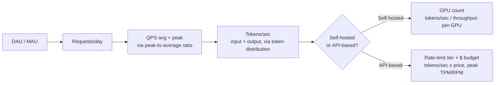
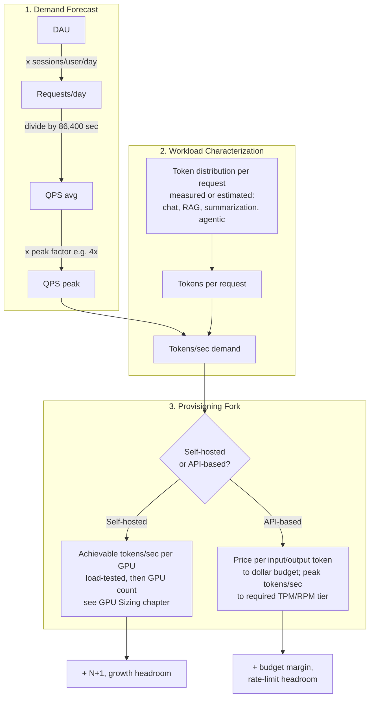
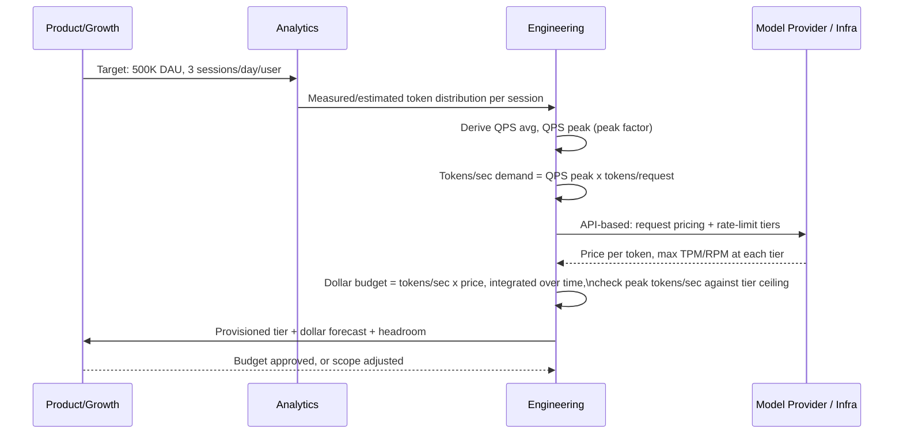
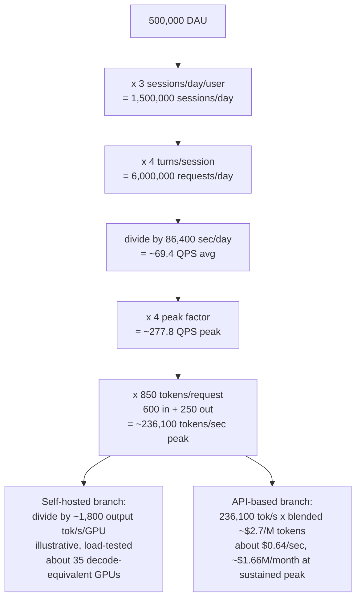
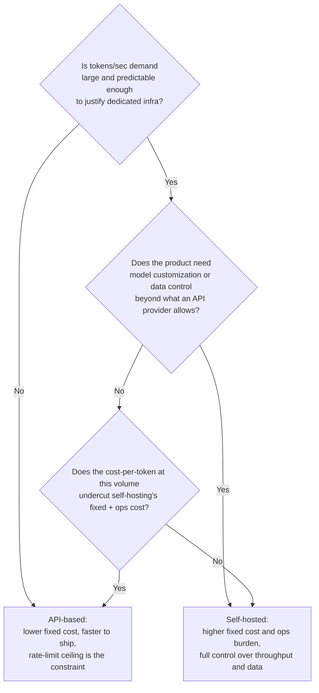

# Capacity Planning Primer

## Overview

Capacity planning for an AI system is a chain of back-of-envelope unit conversions — users to requests, requests to tokens, tokens to either GPUs or dollars — done explicitly enough that every number in the chain can be defended in a design review. This chapter is the toolkit: the same handful of conversions, reused with different inputs, whether you're self-hosting a model and sizing a GPU fleet or calling a third-party API and sizing a budget and a rate-limit ceiling. It is deliberately a primer — the GPU-specific depth lives in [GPU Sizing & Capacity Planning](../16-gpu-systems/02-gpu-sizing-and-capacity-planning.md); this chapter gives you the chain once, in the general form every later case study in these notes assumes you already know.

## Definition

**Capacity planning**, in an AI system, is the practice of converting a demand forecast (daily or monthly active users, sessions per user) into a provisioned resource target — accelerator count, API rate-limit tier, or both — by passing that forecast through an explicit intermediate unit, **tokens per second**, rather than reasoning directly from "users" to "servers" the way traditional web capacity planning often does. The chain has four links: **DAU/MAU → requests/sec (average and peak) → tokens/sec → provisioned capacity** (GPUs if self-hosted, a rate-limit tier and a $ budget if calling an API), and every later capacity number in these notes — a case study's fleet size, a feature's monthly cost forecast — is this same chain run with different inputs.

## Problem Statement

Skipping straight from a business metric to a resource number, without the tokens/sec intermediate step, produces estimates that are wrong by an order of magnitude in either direction, and the failure shows up identically whether you're sizing GPUs or an API budget:

- **Sizing on requests, not tokens, hides a 10-100x swing in real demand.** Two products with identical QPS — one a one-line chat assistant, one a long-document summarizer — have wildly different compute and cost demand, because the unit of work is the token, not the request, and a per-request estimate erases that difference entirely.
- **Sizing on average load guarantees under-capacity at the times that matter.** Average is mathematically exceeded roughly half the time by definition; a system or a rate-limit tier provisioned to the daily average is undersized for a large fraction of every single day, concentrated exactly at the moments (evenings, launches, regional peaks) when being undersized is most visible and most costly.
- **Treating "API-based" as "no capacity planning needed" is a specific, common version of this mistake.** Teams calling a third-party model API often skip this chain entirely, reasoning "the provider handles scaling" — true for raw compute, false for cost (a token-driven bill that wasn't forecast) and false for availability (a rate-limit ceiling that wasn't sized against real peak demand, which fails exactly like an under-provisioned GPU fleet, just with a 429 instead of a queued request).
- **An estimate with no written assumptions can't be debugged when it's wrong.** If a forecast is off by 3x, the only way to find out which input was wrong (token distribution, peak factor, per-unit throughput or price) is if each one was written down as a separate, named number in the first place.

## Why This Primer Exists

Traditional web capacity planning has a settled playbook: profile requests/sec, know your roughly-fixed per-request CPU/memory cost, multiply, add headroom. That playbook assumes the unit of work — the request — has a roughly constant cost. It does not survive contact with generative AI systems, for the same root reason covered in [Introduction to AI System Design](01-introduction.md): a request's real cost is a function of how many tokens get generated, and token count is itself variable, request to request, by an order of magnitude.

The industry's fix — inserting **tokens/sec** as an explicit intermediate unit between "business metric" and "provisioned resource" — emerged because teams that skipped it kept being wrong in the same two directions: under-provisioning (sized to a request count that didn't capture real token volume, then queuing or rate-limited at the actual peak) or over-provisioning (sized "to be safe" with no model behind the number, then sitting at a fraction of utilization while paying for idle capacity or an unnecessarily large rate-limit commitment). Naming the intermediate unit once, and reusing the same conversion chain regardless of whether the next step is "buy GPUs" or "budget an API bill," is what this primer formalizes — it is the same lesson [GPU Sizing & Capacity Planning](../16-gpu-systems/02-gpu-sizing-and-capacity-planning.md) teaches for the self-hosted case, generalized to apply before you've even decided whether you're self-hosting.

## Core Concepts

- **DAU / MAU** — daily/monthly active users, the top of the demand funnel; sourced from product analytics, not infrastructure, and the only input in this chain that comes from outside engineering.
- **Requests/day and QPS (average)** — DAU × sessions or messages per user per day, divided by seconds/day (86,400), assuming a roughly even distribution across the day — a simplification peak factor exists specifically to correct.
- **Peak-to-average ratio (peak factor)** — how much higher real traffic is at the busiest sustained moment than the daily average. Consumer chat-style traffic commonly runs **3-5x** average at peak (evening concentration, regional time-zone overlap, occasional viral spikes); internal enterprise tools often see a milder **1.5-2.5x**, because usage clusters into business hours but is spread across more time zones for a multinational user base. AI products tend to run burstier than typical web traffic for a second reason beyond time-of-day: a single popular feature launch or a viral social post can drive concentrated usage spikes that a flatter, more habitual traffic pattern (e.g., email) rarely produces.
- **Input/output token distribution** — the assumed number of input (prompt, history, retrieved context) and output (generated) tokens per request; this is workload-specific, must be measured from real traffic where possible, and is the single most product-specific number in the whole chain. A short chat turn might run 300-800 input tokens and 100-400 output tokens; a RAG-grounded answer adds several thousand tokens of retrieved context on the input side; a long-document summarization task can invert the ratio entirely (10,000+ input tokens, a few hundred output tokens); an agentic, multi-tool-call session can run input tokens into the tens of thousands within a single user-visible request, as context accumulates turn over turn (see the worked example below, and the deeper agentic treatment in [GPU Sizing & Capacity Planning](../16-gpu-systems/02-gpu-sizing-and-capacity-planning.md#staff)).
- **Tokens/sec (system-wide)** — the real unit of demand: (input + output tokens per request) × QPS. This is the number every later step in the chain consumes, regardless of whether the next step is GPU count or API cost.
- **Provisioned capacity, two forms** — if self-hosting, tokens/sec converts to **GPU count** via achievable tokens/sec per accelerator (full treatment: [GPU Sizing & Capacity Planning](../16-gpu-systems/02-gpu-sizing-and-capacity-planning.md)); if calling a third-party API, tokens/sec converts to **a rate-limit tier** (tokens-per-minute or requests-per-minute ceiling the provider must support at your peak) and **a $ budget** (tokens/sec × price-per-token, integrated over time).
- **Headroom** — capacity, budget, or rate-limit margin provisioned above the bare peak estimate, to absorb forecast error, redundancy, and growth — the same concept whether the resource being padded is a GPU fleet or a monthly API spend cap.

## The Capacity Chain

The chain is identical in its first three links regardless of how the system is served; it forks only at the last step, into a self-hosted branch and an API-based branch.

The detailed view shows where each conversion's assumption comes from, and makes explicit that the fork is a deliberate architectural decision (see [Build vs. Buy](../23-staff-level-architecture/02-build-vs-buy.md)), not an afterthought discovered once a sizing number is already in hand.

## Planning Inputs and Who Owns Them

| Component | Responsibility | Does NOT own |
|---|---|---|
| Demand forecast (product/data science) | DAU/MAU, sessions per user, growth trajectory | Token-level workload shape |
| Workload characterization (infra + product analytics) | Input/output token distribution per request type, measured from logs once available, estimated pre-launch | Pricing or hardware throughput numbers |
| Peak-factor model | Converts average QPS to peak QPS using measured or comparable-product traffic shape | Token distribution |
| Self-hosted branch ([GPU Sizing](../16-gpu-systems/02-gpu-sizing-and-capacity-planning.md)) | Tokens/sec → GPU count via load-tested per-GPU throughput | Pricing, demand forecasting |
| API-based branch | Tokens/sec → $ budget via provider pricing; peak tokens/sec → required rate-limit tier | Hardware, model serving internals |
| Headroom policy | Margin on top of the bare peak estimate — GPUs, budget, or rate-limit tier, whichever branch applies | Day-to-day autoscaling or runtime rate-limit handling (a separate, operational concern) |

## A Sizing Session End to End

Capacity planning isn't a runtime request, but it follows the same kind of staged handoff a request does — each step has a concrete, falsifiable artifact rather than a verbal estimate, the same discipline [GPU Sizing & Capacity Planning](../16-gpu-systems/02-gpu-sizing-and-capacity-planning.md#a-sizing-session-end-to-end) walks through for the self-hosted case.

## Worked Example and Recurring Patterns

The worked example below walks the chain top to bottom for a single, concrete product, deliberately smaller in scale than the flagship example in [GPU Sizing & Capacity Planning](../16-gpu-systems/02-gpu-sizing-and-capacity-planning.md#worked-example-and-sizing-patterns), and run through *both* branches of the fork so the same numbers can be compared side by side.

**Worked example: a 500K-DAU AI support assistant, 3 sessions/day, 4 turns/session, 600 input + 250 output tokens/turn, peak factor 4x.**

A few things worth noticing in this comparison: the *demand-side* math (links 1-4: DAU through tokens/sec) is completely identical regardless of which branch you take — only the last conversion changes. And the two branches answer genuinely different planning questions: the self-hosted branch tells you how many accelerators to provision; the API-based branch tells you whether your spend forecast is realistic and whether the provider's rate-limit tier (commonly negotiated in tokens-per-minute) actually covers your peak, not just your average — a product running ~236K tokens/sec at sustained peak needs roughly 14.2M tokens/minute of provider capacity, a tier many default API accounts do not start with and must request an increase for well before launch.

Three recurring patterns, in increasing sophistication, show up in practice:

1. **Static peak sizing** — compute peak QPS once, size for it with a fixed headroom percentage, re-run quarterly. The right starting point for any team without mature traffic telemetry, for either branch.
2. **Tiered sizing by workload shape** — separate the estimate by request type (chat, RAG-grounded, summarization, agentic) rather than one blended token-per-request average, since a single average hides the heaviest tier's real demand; the agentic case is the most extreme version of this and gets a full worked treatment in [GPU Sizing & Capacity Planning](../16-gpu-systems/02-gpu-sizing-and-capacity-planning.md#staff).
3. **Continuous re-forecasting** — re-measure real token distributions and real peak factors from production traffic on a rolling basis, rather than freezing the launch-time estimate; both sides of the chain (demand and the per-unit conversion, whether throughput or price) drift over a product's life.

## Sizing for Reasoning Workloads

The four-link chain assumes a roughly stable token-per-request distribution. **Extended reasoning models break this assumption** by introducing a thinking-token component that can vary 10–100× across requests to the same endpoint — even requests that look identical from the outside — depending on problem difficulty.

**Modifying the chain for reasoning workloads:**

The chain gains one new, measured input: **thinking-token distribution** (separate from response-token distribution). This must be measured from real traffic, not assumed from the API's maximum budget ceiling.

Worked example — extending the 500K-DAU support assistant from the earlier section, with 20% of requests routed to a reasoning model for complex queries:

- **Standard path (80%):** 277 QPS peak × 850 tokens/request = ~235K tokens/sec (same as before).
- **Reasoning path (20%):** 277 × 20% = 55 QPS peak. But average tokens/request is now 600 in + 4,200 thinking + 300 out = **5,100 tokens/request**.
- **Reasoning tokens/sec:** 55 × 5,100 = **280K tokens/sec from 20% of requests** — more than the entire standard path combined.

The takeaway: a 20% routing fraction to a reasoning model can dominate total token demand. Any sizing that blends standard and reasoning requests into one average produces a badly wrong number.

**Sizing disciplines for mixed workloads:**

1. **Separate the chains.** Size standard and reasoning request paths independently — separate token distributions, separate peak factors, separate provisioned capacity (different GPU pools or different API rate-limit tiers).
2. **Use p95 thinking tokens, not the mean.** Mean thinking-token count is pulled down by simple queries that use few thinking tokens. P95 drives KV cache and GPU saturation events.
3. **Account for rate-limit tier differences.** Reasoning model endpoints carry lower tokens-per-minute ceilings than standard endpoints. A tier that handles standard traffic comfortably can be undersized for a reasoning path running at the same apparent QPS.
4. **Model budget-capped vs uncapped thinking separately.** If you set `max_thinking_tokens`, cap your sizing at that ceiling. If you don't, use observed p95 as a conservative ceiling.

## Tradeoffs

The fork itself — self-hosted vs. API-based — is the single biggest capacity-planning decision a team makes, and it should be made deliberately, with this chain's numbers in hand, rather than defaulted into.

| Self-hosted (GPU count) | API-based (rate-limit + dollar budget) |
|---|---|
| Capacity is a sunk, provisioned ceiling you control directly | Capacity is whatever tier you've negotiated with the provider — a shared resource with its own ceiling |
| Cost is dominated by fixed infrastructure once provisioned, then marginal at the margin | Cost scales close to linearly with tokens consumed, with no large fixed step before the first request |
| Requires the full depth of [GPU Sizing & Capacity Planning](../16-gpu-systems/02-gpu-sizing-and-capacity-planning.md) — load testing, memory-fit checks, batching tuning | Requires negotiating rate-limit tiers ahead of peak demand and monitoring spend the way you'd monitor any other variable-cost line item |
| Scaling past provisioned capacity means a real, multi-week lead time (procurement, deployment) | Scaling past a rate-limit tier means a support request to the provider — faster, but outside your direct control |
| Headroom is GPUs sitting idle some of the time — a real, visible cost | Headroom is budget margin and a rate-limit ceiling above forecast peak — a real but less visible cost (until the bill arrives) |

## How the Chain Behaves at Scale

- **The chain's first three links don't care which branch you take, and that's the point** — a team can build the demand forecast and workload characterization before deciding self-hosted vs. API, and re-use the same tokens/sec number regardless of which way that decision goes, including if it changes later (a common path: launch on an API, move to self-hosted once volume justifies the fixed cost — see the decision tree above).
- **Peak factor accuracy degrades at the extremes of scale**, the same way it does in the self-hosted case: under roughly 100 QPS, a single large customer or an unexpected bot spike can dominate what "average" even means; at tens of thousands of QPS, small per-unit errors (a slightly wrong price, a slightly wrong per-GPU throughput) compound into seven- or eight-figure swings.
- **API rate limits typically scale in discrete tiers, not continuously** — providers commonly require advance notice or a sales conversation to move to the next tokens-per-minute tier, which means the API-based branch has its own lead-time constraint, structurally similar to GPU procurement lead time even though the mechanism (a support ticket vs. a hardware order) looks nothing alike.
- **Multi-region and multi-time-zone products see a rolling peak, not one peak**, in either branch — sizing every region (or every API key/account) for the global peak wastes capacity or budget everywhere else; see [GPU Sizing & Capacity Planning](../16-gpu-systems/02-gpu-sizing-and-capacity-planning.md#scalability) for the self-hosted version of this, which generalizes directly to API rate-limit planning per region or per account.

## Reliability

| Failure | Cause | Degradation strategy |
|---|---|---|
| Capacity (or rate limit) exhausted at real peak | Peak factor underestimated, or workload shifted heavier than the token-distribution assumption | Admission control / queuing with a visible "high demand" state rather than silent failure; pre-negotiated burst capacity (reserved GPU burst pool, or a pre-approved rate-limit increase) |
| Budget forecast blown mid-month | Token distribution drifted (longer conversations, more retrieved context) with no re-forecast | Track dollar spend and tokens/request as a rolling, first-class metric, not just at month-end invoice time; set a budget alert well below the hard cap |
| Provider-side rate-limit or capacity incident (API-based) | A dependency outside your infrastructure entirely | Multi-provider fallback or a degraded-mode response, sized into the plan ahead of time — see [Reliability Engineering](../23-staff-level-architecture/09-reliability-engineering.md) |
| Slow capacity creep | Average tokens/request silently drifts upward (longer system prompts, more history) with no re-forecast | Track p50/p95 tokens/request on a rolling basis in either branch, not just request volume |

The reliability framing is identical across both branches: a system can be "not yet overloaded" by a coarse metric (GPU utilization, or total monthly spend) while already past a finer-grained ceiling (sustained peak tokens/sec against a rate-limit tier, or peak-window GPU saturation) — track the peak-window number, not just the average, in either case.

## Financial and Credential Risks

- **Forecasts as sensitive data, in both branches.** A detailed DAU-by-region growth forecast or a dollar-spend-by-feature breakdown reveals real business performance and cost structure; treat capacity forecasts with the access discipline of financial data, not routine engineering documentation.
- **Denial-of-wallet is the API-based branch's sharpest version of the GPU branch's denial-of-service risk.** A system with no per-request or per-tenant token ceiling, sized only to an average-case forecast, can have its monthly budget consumed by a small number of pathological long-context or high-output-length requests well before the rate-limit ceiling is even reached — per-tenant quotas, sized against this chapter's chain rather than set arbitrarily, are the mitigating control in either branch.
- **Rate-limit credentials are a real secret.** An API key with a high negotiated tokens-per-minute tier is, functionally, a budget-sized blast radius if leaked — the access control around it should be commensurate with the dollar exposure the chain's math reveals, not treated as a routine config value.

## Cost Levers and Crossover Analysis

- **The fork decision itself is the largest cost lever, and it has a crossover volume.** Below a certain sustained tokens/sec, API pricing's lack of fixed cost wins outright; above it, self-hosting's marginal cost per token (once GPUs are bought or reserved) undercuts API pricing — the exact crossover point depends on your negotiated API price, your achievable per-GPU throughput, and your utilization, and is worth modeling explicitly with this chapter's numbers rather than assumed from someone else's blog post.
- **In the API-based branch, output tokens dominate cost more than input tokens do at typical chat ratios** — at the worked example's 600 input / 250 output split, with illustrative pricing around $1/M input and $5/M output tokens, output cost (250 × $5/M ≈ $0.00125/request) exceeds input cost (600 × $1/M ≈ $0.0006/request) despite being well under half the token count — the same point [Core Mental Models](02-core-mental-models.md#mental-model-2-token-economics) makes generally, now anchored to this chapter's worked numbers.
- **Reserved/committed pricing applies in both branches** — committed-use API pricing or pre-purchased token blocks function the same way reserved GPU capacity does: cheaper per-unit in exchange for committing to the *baseline* (the sustained floor your chain's math establishes), with on-demand pricing covering the peak-minus-baseline delta.
- **Headroom has a real, quantifiable cost in either branch** — idle GPUs and unused rate-limit margin both cost something (capital/depreciation in one case, occasionally a minimum-commitment fee in the other); size headroom against an explicit risk tolerance, not a round-number habit like "add 50% just in case."

## Monitoring

- **Realized tokens/sec, in production, compared against the forecast that fed the plan** — the single most important drift signal in either branch, since this is the number every downstream conversion (GPU count, dollar budget) is built on.
- **p50/p95/p99 tokens per request, by workload tier if more than one exists** — catches drift (longer conversations, more retrieved context, more tool-calling rounds) before it becomes an unexplained capacity or budget shortfall.
- **Peak-to-average ratio, measured from real traffic, recomputed periodically** — a product's actual peak factor shifts as its user base grows or internationalizes; the planning-time assumption is a starting point, not a permanent constant.
- **API-based: dollar spend per day, tracked against the forecast, with an alert threshold well below the hard budget cap** — the direct analog of GPU-fleet-utilization monitoring in the self-hosted branch.
- **API-based: realized peak tokens/minute (or requests/minute) against the negotiated rate-limit tier** — the leading indicator that a tier upgrade conversation needs to start, ideally weeks before the ceiling is actually hit given typical provider lead times.

## Production Best Practices

- **Build the demand forecast and workload characterization (links 1-3 of the chain) before deciding self-hosted vs. API** — this lets the fork decision itself be made from real numbers rather than from a default instinct.
- **Write every assumption down as a named, falsifiable number** — peak factor, token distribution, price-per-token or throughput-per-GPU — so a 3x-off estimate can be debugged by checking each link individually instead of re-deriving the whole chain from scratch.
- **Size for peak, not average, in either branch** — a rate-limit tier or a GPU fleet sized to average daily load is under capacity for a meaningful fraction of every day, by construction.
- **Tier the workload the moment more than one meaningfully different request shape exists** — a single blended tokens-per-request average reliably under-sizes for whichever tier is actually heaviest.
- **Re-forecast on a cadence, not just at launch** — both branches' inputs (real traffic shape, and either per-GPU throughput or provider pricing/tiers) drift continuously over a product's life.
- **Treat the API-based branch's rate-limit tier with the same planning seriousness as a GPU procurement order** — the lead time is shorter, but skipping it produces the identical failure mode (capacity exhausted at real peak), just with a 429 response instead of a queue.

## Real World Examples

These are illustrative, order-of-magnitude reasoning patterns, not confirmed internal numbers from any company.

- **A consumer chat assistant** scaling from a few hundred thousand to tens of millions of DAU is the canonical case this chain was built for — see [GPU Sizing & Capacity Planning](../16-gpu-systems/02-gpu-sizing-and-capacity-planning.md#real-world-examples) for the self-hosted, ChatGPT-scale version of this exact chain run with larger inputs.
- **An early-stage startup building on a third-party model API** is the canonical case for the API-based branch: capacity planning here looks less like procurement and more like requesting a rate-limit tier increase ahead of a product launch or marketing push, and forecasting the resulting monthly bill with the same DAU-to-tokens/sec chain — a step many early teams skip entirely until an unexpectedly large bill or an unexpected 429 error forces the conversation retroactively.
- **An enterprise RAG platform** (see [Enterprise RAG Platform](../25-case-studies/08-enterprise-rag-platform.md)) illustrates the token-distribution step's product-specificity directly: retrieved context routinely adds several thousand input tokens per query beyond the user's literal question, meaning a sizing model that uses a generic chat product's token distribution as a stand-in will under-forecast both cost and required throughput substantially.

## Tools and Ecosystem

| Category | Tools | When to prefer |
|---|---|---|
| **Token counting and cost modelling** | `tiktoken`, LiteLLM cost tracking (`litellm.completion_cost()`), Helicone cost dashboard | tiktoken: pre-flight token counts before sending; LiteLLM cost tracking: multi-provider spend aggregation; Helicone: per-request cost attribution in production |
| **Load testing / throughput benchmarking** | `vllm/benchmarks/benchmark_serving.py`, k6, Locust | vLLM benchmark: measures tokens/sec at varying concurrencies with your actual model; k6/Locust: simulates multi-user request patterns including peak bursts |
| **Cloud GPU cost calculators** | AWS Pricing Calculator, GCP Pricing Calculator, CoreWeave pricing, Lambda Labs pricing | Use to model the self-hosted vs API cost crossover at your token volume — spreadsheet first, real load test to validate |
| **API spend monitoring** | Helicone, Langfuse, OpenAI usage dashboard, Anthropic usage dashboard | Real-time token-per-request tracking; set budget alerts before the monthly invoice arrives |
| **Rate-limit management** | LiteLLM (automatic retry + fallback), Portkey, custom token-bucket rate limiters | LiteLLM handles 429 retries and provider fallback automatically; critical for products approaching rate-limit ceilings |

## Interview Questions

### Beginner

**Q: Why can't you size an AI system's capacity directly from "number of users," the way you might rough out a traditional web service?**
Because the real unit of compute and cost demand is tokens, not requests or users, and tokens-per-request varies by an order of magnitude across products and even across request types within one product (a quick chat reply vs. a long document summary). Two products with identical user counts and request rates can have wildly different real demand; you have to pass through tokens/sec as an explicit intermediate step to capture that.

**Q: What is a peak-to-average ratio, and why does consumer AI traffic often have a higher one than typical enterprise traffic?**
It's the ratio between the busiest sustained period's traffic and the daily average — commonly 3-5x for consumer chat products. Consumer traffic concentrates more (evening hours, a single time zone's overlap, occasional viral spikes), while enterprise tools spread usage across more time zones for a global workforce, producing a milder, flatter peak by comparison.

### Intermediate

**Q: Walk through converting 200 average QPS into tokens/sec, given a workload averaging 600 input and 250 output tokens per request, and explain why you'd compute this before deciding GPU count or API budget.**
Tokens/sec = 200 QPS × (600 + 250) tokens/request = 200 × 850 = 170,000 tokens/sec. This number is computed before the GPU-vs-API decision because it's identical inputs to both branches — the demand-side math (requests to tokens) doesn't depend on how you plan to serve that demand; only the final conversion (tokens/sec ÷ per-GPU throughput, or tokens/sec × price) differs.

**Q: A team is calling a third-party model API and says "we don't need to do capacity planning, the provider scales for us." What's wrong with that reasoning?**
The provider scaling raw compute doesn't mean your cost or your availability are automatically handled. Cost still scales with your token volume and needs forecasting the same way a self-hosted fleet's cost does — an unforecast token distribution produces an unexpectedly large bill. Availability is bounded by your negotiated rate-limit tier (tokens or requests per minute); if real peak demand exceeds that tier, you get throttled exactly the way an under-provisioned GPU fleet gets overloaded, just with a different error code.

### Senior

**Q: A product is currently API-based and growing fast. What signal from this chapter's chain tells you it's time to seriously evaluate self-hosting?**
Track realized tokens/sec at sustained peak against your negotiated API price; the moment your modeled self-hosted marginal cost per token (achievable tokens/sec per GPU, amortized hardware/ops cost) drops meaningfully below your blended API price at your real volume, the crossover has been reached. The earlier signal worth watching before the cost crossover is rate-limit friction — repeatedly needing tier increases, or hitting throttling during real peaks — since that's a capacity-ceiling problem the API-based branch structurally can't fully solve on your timeline, independent of whether the cost crossover has happened yet.

**Q: Your forecast assumed a 4x peak factor and a 600/250 input/output token split. Three months post-launch, real data shows a 6x peak factor concentrated in a 90-minute window, and the real split is closer to 600/450 because users are asking for longer, more detailed answers than expected. Quantify the impact and explain what you'd change.**
Tokens/sec at peak was modeled as QPS_avg × 4 × 850; with the real numbers it's QPS_avg × 6 × 1,050 — roughly a 6×1,050 ÷ (4×850) ≈ 1.85x increase in real peak tokens/sec versus the original forecast, meaning whichever branch you're on (GPU fleet or API rate-limit tier and budget) is undersized by close to double during that 90-minute window even though daily-average metrics might look fine. The fix: re-run the chain with the measured peak factor and token split, and because the peak is concentrated in a narrow window rather than spread across the day, evaluate whether output-length controls (capping or guiding response verbosity, since output tokens are the more expensive half and the part that grew) close part of the gap before defaulting straight to "provision 1.85x more."

### Staff

**Q: Design the capacity-planning process for a product launching simultaneously on a self-hosted model for its core feature and a third-party API for a secondary, lower-volume feature. What's shared, and what has to be modeled separately?**
The demand forecast and workload characterization steps (links 1-3: DAU through tokens/sec) should be modeled separately per feature from the start, since they're almost certainly different workload shapes with different token distributions and possibly different peak factors (a core feature used constantly vs. a secondary feature used occasionally) — blending them into one average would misrepresent both. From there, each feature's tokens/sec demand feeds its own branch of the fork: the self-hosted core feature goes through the full [GPU Sizing & Capacity Planning](../16-gpu-systems/02-gpu-sizing-and-capacity-planning.md) treatment, while the API-based secondary feature gets its own rate-limit tier and budget line. What's genuinely shared is the planning *discipline* — written assumptions, peak-factor modeling, re-forecast cadence — not the numbers themselves, and a common mistake at this design point is reusing one feature's token distribution or peak factor for the other out of expedience.

**Q: A finance stakeholder asks you to justify, in one sentence, why a 20% forecast error in this chain's peak factor or token distribution can mean a budget or fleet-size error far larger than 20%.**
Because the chain multiplies several independently-uncertain inputs together (sessions/user, peak factor, tokens/request, and then price-per-token or throughput-per-GPU), a 20% error on two or three of those inputs compounds multiplicatively rather than additively — two independent 20% overestimates compound to roughly 44% (1.2 × 1.2 ≈ 1.44), and three compound to roughly 73% — which is why every link in the chain needs its own measured, falsifiable number rather than a single blended "we'll pad it by 20% to be safe" adjustment applied once at the end.

## Google-Level Follow-Ups

- "Your company is deciding whether to launch a new AI feature on a third-party API or wait three months to finish self-hosting. Walk through how this chapter's chain informs that timing decision." — probes whether the candidate recognizes the chain answers "how much capacity/cost" independent of timing, but the *decision* also needs a lead-time comparison (API: days; self-hosted: weeks-to-months of procurement and validation) layered on top of the cost crossover analysis.
- "If you could only measure one number in this chain accurately, and had to guess at all the others, which would you pick, and why?" — probes for recognizing that the token distribution (input/output split, by workload tier) is usually the most product-specific and hardest-to-guess-correctly input, versus peak factor and pricing, which are more comparable across similar products and easier to sanity-check against public benchmarks or vendor numbers.
- "How does this chain change for a feature with no predictable DAU pattern at all — a one-time batch migration processing a fixed corpus, rather than ongoing user traffic?" — probes whether the candidate can adapt the chain's structure (total tokens to process divided by time budget equals required tokens/sec, then the same fork into GPU count or API budget) rather than assuming the DAU-based version is the only valid entry point.
- "Two products with the identical 850-token-per-request average and identical QPS get very different real-world capacity outcomes. What's the most likely reason, given everything in this chapter?" — probes for recognizing that an identical *average* can mask very different *distributions* (a tight, predictable split vs. a long-tailed one with rare, enormous outlier requests) and very different peak factors, both of which the chain accounts for only if measured per-product rather than assumed generic.

## Common Mistakes

- **Skipping the tokens/sec intermediate step and reasoning directly from users to GPUs or budget** — hides the single largest source of estimate error in this entire chain.
- **Treating "we use a third-party API" as a reason to skip capacity planning entirely** — cost and rate-limit ceilings still need forecasting; the provider only removes the hardware-procurement half of the problem, not the demand-modeling half.
- **Using one blended average token-per-request figure across genuinely different workload types** — chat, RAG, summarization, and agentic workloads have different enough token profiles that a single average reliably misrepresents the heaviest tier.
- **Sizing to average load instead of peak load**, in either branch — guarantees under-capacity for a real, recurring fraction of every day.
- **Treating headroom as an informal, unwritten buffer** rather than a named policy — informal buffers are the first thing cut under budget pressure, precisely because nobody can point to what they were protecting against.
- **Never re-forecasting after launch** — both the demand side (real traffic shape) and the conversion side (pricing changes, achievable throughput changes) drift continuously, and a frozen launch-time estimate is reliably stale within a quarter for any growing product.

## Key Takeaways

- Capacity planning for an AI system is a four-link chain — DAU/MAU to requests/sec to tokens/sec to provisioned capacity — and the first three links are identical whether you're self-hosting or calling an API; only the last conversion differs.
- Tokens/sec, not requests or users, is the real unit of demand, because token count per request varies by an order of magnitude across products and workload types, in a way request count alone hides completely.
- Size for peak, not average — commonly 3-5x average for consumer-facing chat traffic — in either branch; a system or rate-limit tier sized to average is under capacity for a meaningful fraction of every day by construction.
- "API-based" does not mean "no capacity planning" — it means the same demand-forecasting chain feeds a dollar budget and a rate-limit ceiling instead of a GPU count, and skipping it produces the identical failure mode (capacity exhausted at real peak) under a different name.
- The self-hosted vs. API fork is itself the largest capacity decision in this chapter and should be made from this chain's numbers — a modeled cost crossover and a lead-time comparison — rather than defaulted into.
- Errors in this chain compound multiplicatively across its independently-uncertain inputs (peak factor, token distribution, price or throughput), which is why a 20% error in two or three inputs can mean a 40-70%+ error in the final number — every link needs its own named, falsifiable assumption.
- This primer is the general form; [GPU Sizing & Capacity Planning](../16-gpu-systems/02-gpu-sizing-and-capacity-planning.md) is the deep, self-hosted-specific version of the same chain, and the case studies throughout these notes reuse this exact method with different inputs.

---

*Part of [Fundamentals](index.md) in the [AI System Design Notes](../index.md). Tracked in [BACKLOG.md](https://github.com/GyanendraChaubey/AI-System-Design-Notes/blob/main/BACKLOG.md).*
