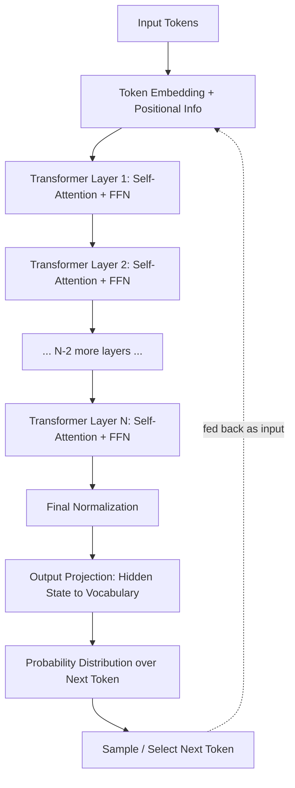
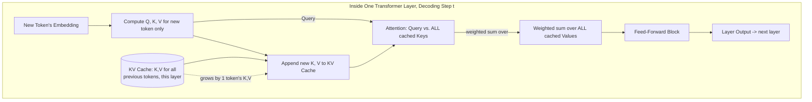
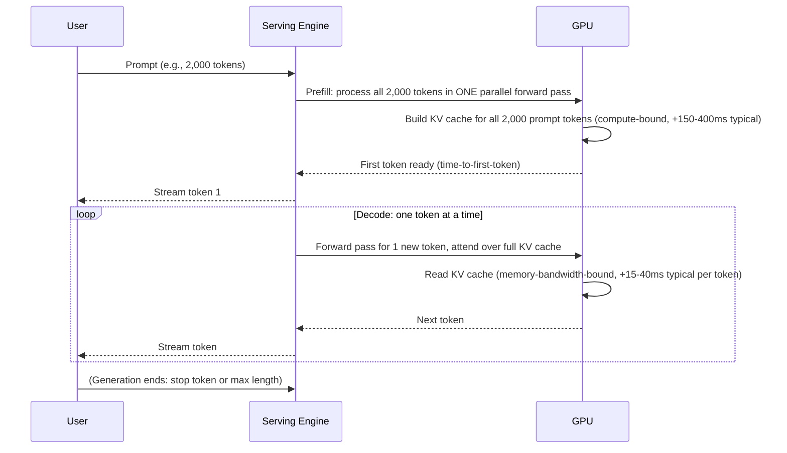
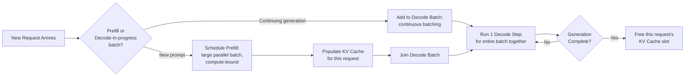
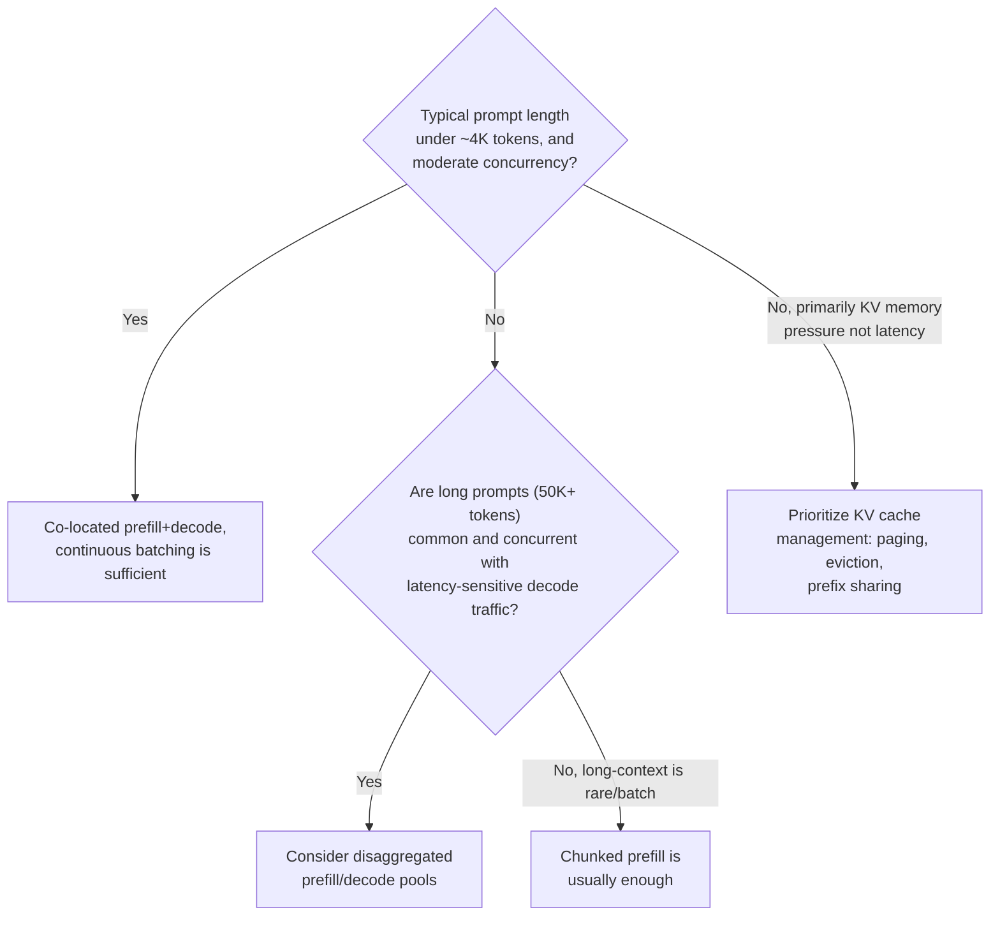

# Transformer Internals for Systems Engineers

## Overview

A decoder-only transformer is the architecture behind every major production LLM (GPT, Claude, Gemini, Llama). It is a stack of identical layers that repeatedly let every token "look at" every other token before predicting the next one. You do not need to derive how attention is trained — you need to understand the two computational shapes it produces, because those shapes are the reason LLM serving has its own latency model, its own memory bottleneck, and its own hardware economics.

## Definition

A transformer is a neural network composed of stacked layers, each containing a self-attention block (mixes information across token positions) and a feed-forward block (transforms each position's representation independently), operating on a sequence of token embeddings. Decoder-only transformers — the variant behind nearly all production LLMs — generate text autoregressively: each token is predicted from all previous tokens, one at a time, and immediately fed back in as input for the next step.

## Problem Statement

Every cost, latency, and capacity question in LLM systems work traces back to facts about transformer internals invisible from the API surface:

- **Why does latency scale non-linearly with prompt length?** Self-attention is quadratic in sequence length.
- **Why does one long-context request quietly consume gigabytes of GPU memory the parameter count never predicted?** The KV cache scales with sequence length and batch size, not model size alone.
- **Why doesn't doubling GPU compute double generation throughput?** Token-by-token generation is bottlenecked on memory bandwidth, not FLOPs.
- **Why do two models with the same parameter count cost wildly different amounts to serve?** Parameter count, FLOPs, and active memory footprint are three numbers that move independently once Mixture-of-Experts enters the picture.

Without this mental model, capacity planning and serving-architecture decisions become guesswork dressed up as benchmarking.

## Why This Architecture Exists

Before transformers (2017, Vaswani et al., "Attention Is All You Need"), sequence models were recurrent (RNNs, LSTMs): they processed tokens one at a time, carrying a hidden state forward, so training was inherently sequential — step 500 couldn't start until steps 1-499 finished. That made it impractical to train on the data volumes today's models require.

Self-attention replaced that sequential dependency with a mechanism that compares every token to every other token directly, in parallel, via matrix multiplication — exactly what GPUs are built for. This unlocked training parallelism at the cost of a different scaling problem: comparing every token to every other token is quadratic in sequence length. The industry traded an O(n) sequential bottleneck for an O(n²) parallel one — a good trade for training throughput, but the root cause of essentially every long-context serving problem covered here and in [Context Windows & Positional Encoding](03-context-windows-and-positional-encoding.md).

## Core Concepts

- **Token embedding** — each input token (a subword unit; see [Tokenization & Vocabulary](02-tokenization-and-vocabulary.md)) maps to a dense vector, typically 2,048-8,192 dimensions ("hidden size") in current production models.
- **Self-attention** — for each token, a weighted combination of *every other token's* representation, where weights ("attention scores") reflect relevance. This is what lets a token at position 5,000 directly use information from position 3, with no bottleneck from passing through 4,997 intermediate steps.
- **Query, Key, Value (Q/K/V)** — each token produces a Query (what it's looking for), a Key (what it offers), and a Value (what it contributes). Attention score is a function of one token's Query against another's Key; output is a weighted sum of Values.
- **Multi-head attention** — attention runs in parallel across multiple smaller "heads" (commonly 32-128 in current models), each potentially specializing in different relationship types, then concatenated back together.
- **Feed-forward block (FFN/MLP)** — after attention mixes information *across* positions, the FFN transforms each position *independently* (project-up, nonlinearity, project-down). In dense models, the FFN holds most parameters and FLOPs, not attention.
- **Layer / depth** — one attention block plus one FFN block, with residual connections and normalization. Frontier models stack roughly 32-120 layers.
- **Autoregressive decoding** — one token generated per forward pass through the full stack, appended to the input before the next pass.
- **Causal masking** — during generation, a token can only attend to itself and earlier tokens, never future ones.

## Architecture

At the model level, a decoder-only transformer is a straight stack: embed the input, run it through N identical layers, project the final layer's output to a probability distribution over the vocabulary.

The detail that matters operationally lives inside a single layer's attention step: the KV cache. Without it, generating token *t* would recompute Key/Value vectors for all *t-1* previous tokens at every step — redundant work, repeated every step. The KV cache stores each token's K/V vectors the first time they're computed, so each new decode step only computes Q/K/V for the *one new token* and reuses everything cached for the rest.

The cost signature: attention at step *t* still touches all *t* cached entries (cost per step grows with sequence length), but it reads them rather than recomputing them. That read is a memory-bandwidth operation, not a compute one — the seed of the prefill/decode distinction below.

## Components

| Component | Responsibility | Does NOT own |
|---|---|---|
| Tokenizer/embedding layer | Convert raw text to token IDs, then to dense vectors | Sequence-level reasoning |
| Self-attention block | Mix information across token positions within a layer | Per-position transformation (the FFN) |
| Feed-forward block (FFN) | Transform each position independently; holds most parameters in dense models | Cross-token information flow |
| KV cache | Store per-token K/V vectors per layer so decode avoids recomputing the prefix | Model weights (it's request-scoped runtime state, not a trained parameter) |
| Output/unembedding head | Project final hidden state to a vocabulary distribution | Sampling strategy (temperature, top-p — see [Decoding & Inference Strategies](04-decoding-and-inference-strategies.md)) |
| Positional encoding | Inject sequence-order information, since attention alone is order-agnostic | Long-range information mixing (attention does that) |

## Request Lifecycle

A generation request passes through two phases with fundamentally different performance profiles: **prefill** (process the entire prompt) and **decode** (generate output tokens one at a time). This split is the single most important latency fact in LLM serving.

Prefill processes all prompt tokens in parallel in a single pass — **compute-bound**: GPU FLOPs are the limiting resource, and matrix-multiply units stay close to fully utilized. Decode generates one token per pass, and that pass must read the entire growing KV cache to compute attention while doing comparatively little new computation — **memory-bandwidth-bound and sequential**: token *t+1* cannot start until token *t*'s output exists. This is why time-to-first-token and per-token decode latency are tracked as separate SLOs, and why serving engines increasingly separate prefill and decode onto different hardware pools — see [Disaggregated Prefill/Decode](../17-distributed-inference/02-disaggregated-prefill-decode.md).

## Design Patterns

Every serving engine (vLLM, TensorRT-LLM, SGLang, and proprietary equivalents) implements some version of: batch prefill and decode for GPU efficiency, but schedule them as distinct classes so a long prefill doesn't stall in-flight decodes.

Pattern families seen in production:

1. **Naive sequential serving** — one request fully prefilled and decoded before the next starts. GPU sits idle during every request's sequential decode phase; unacceptable utilization at any real traffic volume.
2. **Continuous batching** — decode steps for many concurrent requests batch together at every step, since many requests' single-token forward passes can share one batched matrix multiply (see [Batching & Continuous Batching](../15-model-serving/02-batching-and-continuous-batching.md)).
3. **Chunked prefill** — split a very long prompt's prefill into chunks interleaved with ongoing decode steps for other requests, so one 50,000-token prompt doesn't freeze every other user's stream.
4. **Disaggregated prefill/decode** — run prefill and decode on separate GPU pools tuned to each phase's bottleneck, transferring the KV cache between them over a fast interconnect.
5. **Prefix/prompt caching** — when requests share a common prefix (system prompt, few-shot template), cache and reuse its KV entries instead of recomputing per request — see [KV Cache Management](../15-model-serving/03-kv-cache-management.md).

## Tradeoffs

The recurring architectural question: as required context length grows, at what point does a serving stack outgrow simple, co-located prefill+decode serving?

| Advantages of attention-based architecture | Disadvantages |
|---|---|
| Every token directly accesses every other token — no long-range information bottleneck | O(n²) compute and O(n) growing memory in sequence length |
| Fully parallelizable training across positions (unlike RNNs) | Decode is inherently sequential per request |
| Uniform, hardware-friendly operation (matrix multiplies) at every layer | KV cache memory frequently exceeds model-weight memory at long context and concurrency |
| Same architecture scales from small to frontier model sizes | Cost and latency degrade non-linearly with context length |

## Scalability

- **Sequence length is the primary axis that breaks naive serving.** Attention cost per layer grows roughly with the square of sequence length (doubling context roughly quadruples attention compute within that layer; FFN cost only doubles, so blended slowdown is sub-quadratic but still worse than linear). Under ~2K tokens, FFN cost dominates; past tens of thousands, attention and KV cache dominate.
- **KV cache memory scales linearly per token, with a large constant.** Approximate size per token: `2 (K and V) × num_layers × num_KV_heads × head_dim × bytes_per_value`. For an illustrative ~70B-class dense model (80 layers, 8 KV heads under grouped-query attention, head dim 128, FP16 = 2 bytes): `2 × 80 × 8 × 128 × 2 ≈ 327 KB per token`. A single 32,000-token request needs on the order of **10 GB of KV cache alone** — often more than a meaningful chunk of the model's own weights (see [KV Cache Management](../15-model-serving/03-kv-cache-management.md)).
- **Concurrency is capped by KV memory, not GPU compute, in most production serving.** An 80 GB GPU running a ~140 GB-equivalent footprint (weights + cache) might support dozens of concurrent long-context sessions, not thousands.
- **Throughput, illustratively:** prefill on a modern data-center GPU for a mid-size dense model commonly runs **low thousands of tokens/sec**; decode throughput per individual request is far lower, commonly **tens of tokens/sec**, because each step is one sequential, bandwidth-bound pass — batching concurrent users' decode steps is what pushes aggregate decode throughput into the thousands.
- **Multi-GPU sharding** (tensor and pipeline parallelism) becomes necessary once weights plus serving-relevant KV cache no longer fit on one accelerator — see [GPU Sizing & Capacity Planning](../16-gpu-systems/02-gpu-sizing-and-capacity-planning.md) and [Tensor & Pipeline Parallelism](../17-distributed-inference/01-tensor-and-pipeline-parallelism.md).

## Reliability

| Failure | Cause | Degradation strategy |
|---|---|---|
| OOM under high concurrency | KV cache growth from long-context requests exceeds GPU memory | Admission control/queuing on new requests rather than crashing in-flight ones; paged KV allocation to reduce fragmentation |
| Latency cliff at long context | Quadratic attention cost and KV read volume both grow with sequence length | Enforce a max-context policy per tier; truncate/summarize/reject rather than let one outlier stall the batch |
| Head-of-line blocking | A very long prefill occupies the GPU, delaying decode for unrelated requests | Chunked prefill, or disaggregated prefill/decode pools |
| Silent quality cliff near max context | Some architectures show degraded attention behavior near trained context limits | Treat "near max advertised context" as a tested regime, validated empirically, not an assumed-safe default |

A useful SLO framing: track **time-to-first-token** (prefill-dominated) and **inter-token latency** (decode-dominated) as two separate SLOs — they're produced by different bottlenecked resources and won't move together under the same hardware or batching change.

## Security

The architecture's direct security surface is narrower than the products built on it, but two risks come straight from these internals:

- **KV cache as a tenant-isolation boundary.** In multi-tenant serving, the KV cache is per-request runtime state in shared GPU memory; a serving engine bug that fails to clear or isolate KV cache slots between requests is an isolation defect, not a model defect — treat that allocation/eviction code with the rigor of any multi-tenant memory boundary.
- **Context length as a denial-of-wallet vector.** Both prefill compute and KV memory scale with input length; an attacker who can repeatedly force maximally long inputs is running a resource-exhaustion attack, not a prompt-injection one — input length limits and per-tenant quotas are a security control here, not just a cost control.

Broader model-level concerns (prompt injection, jailbreaks, exfiltration) are covered in [AI Security Architecture](../21-ai-security/01-ai-security-architecture.md).

## Cost Optimization

- **Right-size max context per product tier** instead of defaulting every endpoint to the model's maximum. Naive static allocation reserves KV headroom for the *maximum* context regardless of actual use; paged/dynamic allocation materially improves achievable concurrency per GPU.
- **Cache shared prefixes aggressively.** Recomputing a 1,500-token system prompt's KV entries on every one of 1,000 requests/minute is pure waste; cache it once.
- **Pick parallelism by which resource is scarce.** More GPUs via tensor parallelism buys memory headroom if you're memory-bound; it only helps a compute-bound workload if that workload can actually parallelize across them (see [GPU Sizing & Capacity Planning](../16-gpu-systems/02-gpu-sizing-and-capacity-planning.md)).
- **Quantize the KV cache and/or weights** where quality tolerates it — moving KV storage from FP16 (2 bytes/value) to INT8 (1 byte/value) roughly halves KV memory for the same context and concurrency (see [Quantization & Compression](../15-model-serving/04-quantization-and-compression.md)).
- **Match architecture to cost target, not just quality target.** A Mixture-of-Experts model can offer large total capacity while activating only a fraction of parameters per token — see [Model Families & Selection](05-model-families-and-selection.md).

## Monitoring

- **Time-to-first-token, p50/p95/p99** — direct signal for prefill health; regressions usually mean prompt lengths grew or queuing/chunked-prefill policy is off.
- **Inter-token latency, p50/p95/p99** — direct signal for decode health; regressions usually mean batch sizes passed the bandwidth-efficient point or KV reads hit memory pressure.
- **KV cache utilization (% allocated in use)** — the leading indicator for OOM risk; alert well before 100%.
- **Requests queued/rejected by admission control** — whether capacity is keeping up with demand, separate from per-request latency.
- **GPU utilization split by phase**, if exposed — distinguishes "need more compute" from "need more bandwidth/capacity."
- **Average and p99 context length of incoming requests** — context-length drift is a common silent cause of a "no code changes" latency or cost regression.

## Production Best Practices

- Treat **time-to-first-token and inter-token latency as separate SLOs**, since they're bound by different resources and respond differently to the same infrastructure change.
- Default to **continuous batching with paged KV cache allocation**, not static per-request memory reservation.
- **Cache shared prefixes** instead of treating every request as fully independent — close to free latency and cost reduction whenever traffic shares a prefix.
- **Set explicit, enforced max-context limits per product surface** rather than trusting the model's advertised maximum as universally safe; validate quality and cost near that limit empirically.
- **Size GPU memory for KV cache demand at target concurrency, not just model weights** — sizing for weights alone is one of the most common GPU-sizing mistakes.
- **Separate prefill-heavy and decode-heavy traffic operationally** (chunking, scheduling priority, or disaggregation) once long prompts and latency-sensitive decode routinely compete for the same GPU.

## Real World Examples

The specifics below are drawn from public research papers, talks, and blog posts; treat exact figures as illustrative and order-of-magnitude, not confirmed internal specifications.

- **OpenAI** has discussed, in public talks and the GPT-OSS open-weight releases, Mixture-of-Experts architectures and serving built around continuous batching and KV-cache-aware scheduling — consistent with production-scale serving needing to distinguish prefill and decode workloads rather than treat every request identically.
- **Google** has published extensively (PaLM, Gemini technical reports, the original Transformer paper) on attention-variant engineering aimed directly at these systems problems, including multi-query and grouped-query attention, whose purpose is shrinking KV cache size per token by sharing Key/Value projections across heads — trading a little model capacity for a large serving-memory reduction.
- **Meta's** publicly released Llama family documents grouped-query attention and long-context serving considerations directly in its model cards, treating the KV-cache-size-vs-context-length tradeoff as a first-class design decision.
- **Anthropic** has publicly discussed long-context engineering (Claude models supporting context windows in the hundreds of thousands of tokens) and prompt/context caching as a product feature — the productized version of prefix caching, letting customers pay a reduced rate for cached, repeated context instead of full per-request recomputation.

## Interview Questions

### Beginner

**Q: In plain terms, what does self-attention let a model do that earlier architectures (like RNNs) couldn't do as easily?**
Self-attention lets every token directly use information from every other token in one step, regardless of distance. An RNN passes information forward step-by-step through a hidden state, so a fact at position 3 reaching position 5,000 has to survive 4,997 sequential updates, degrading over distance in practice. Attention removes that bottleneck and, as a side effect, parallelizes far better during training.

**Q: What is the KV cache, and why does it exist?**
It stores each token's Key and Value vectors, per layer, the first time they're computed. Without it, generating each new token would recompute K/V for every prior token at every step — wasted, repeated work. With it, each decode step computes Q/K/V only for the new token and reuses cached K/V for everything before it.

### Intermediate

**Q: Why is self-attention O(n²) in sequence length, and what does that cost in practice?**
Every token is compared against every other token to compute attention weights, so for length n that's on the order of n² pairwise comparisons per layer. Doubling prompt length roughly quadruples attention compute within that layer (though total request cost grows less than purely quadratically, since FFN cost only scales linearly). Practically: a 32K-token prompt is meaningfully more than 4x as expensive in attention terms as an 8K-token prompt, not just 4x.

**Q: Why are prefill and decode treated as separate phases?**
Prefill processes the whole prompt in one parallel pass, keeping GPU compute units highly utilized — compute-bound. Decode generates one token per pass, reading the entire growing KV cache while doing comparatively little new computation — memory-bandwidth-bound and sequential, since token t+1 depends on token t's output. The same hardware can be compute-saturated during prefill and bandwidth-saturated, with idle compute, during decode of the very same request.

### Senior

**Q: A team's GPU memory at long context is dominated by something other than model weights. What is it, and how do you size for it?**
The KV cache. Per-token size is roughly `2 × num_layers × num_KV_heads × head_dim × bytes_per_value`; multiply by target max context and target concurrency to estimate total demand, then size GPU memory (or shard) to cover weights *plus* that figure — not weights alone. Past tens of thousands of tokens of context, this routinely exceeds the weight footprint of mid-size models.

**Q: When would you recommend disaggregating prefill and decode instead of co-locating them?**
When long, compute-heavy prefills routinely compete with latency-sensitive decode steps on the same GPU, causing head-of-line blocking or inter-token-latency spikes for unrelated requests — typically once a meaningful share of traffic has long prompts (tens of thousands of tokens) concurrent with interactive decode. Disaggregation lets each pool be tuned to its actual bottleneck, at the real cost of transferring the KV cache between pools over a fast interconnect — a scale-triggered decision, not a default.

### Staff

**Q: Design serving for a product where most requests are short prompts (under 1K tokens) but 5% submit 100K-token documents, all on shared infrastructure. What breaks first, and how do you fix it?**
Head-of-line blocking breaks first: a 100K-token prefill is far more expensive than a 1K-token one, and on a shared GPU without isolation it stalls inter-token latency for every concurrent short-prompt decode, blowing that SLO for requests that did nothing wrong. Fix path in order of complexity: chunked prefill first (interleave the long prefill with ongoing decode steps); if traffic volume exceeds that, route long-prompt requests to a separate pool sized and scheduled for compute-heavy prefill — disaggregation applied as a routing decision. Also size KV cache capacity for the 5% long-document tail, not the average request, since average-case sizing is exactly what causes OOM under bursty long-document traffic.

**Q: How do parameter count, FLOPs, and memory footprint diverge between a Mixture-of-Experts model and a dense model of similar quality?**
A dense model activates every parameter on every token, so parameter count, FLOPs per token, and memory footprint move together. An MoE model has a much larger total parameter count, but a router selects only a small expert subset per token, so FLOPs-per-token looks much closer to a smaller dense model's, while total memory footprint looks much closer to the full large count (you must hold all experts in memory, since routing varies token to token across a batch). A team that sizes memory for "effective" compute-equivalent size, instead of total parameter count, will under-provision and hit OOM or need more aggressive sharding than expected.

## Google-Level Follow-Ups

- "Plenty of spare GPU compute, low utilization, but the service is memory-bound and rejecting requests — how, and what do you change?" — probes whether compute and memory bandwidth/capacity are understood as independent resources; the fix is KV cache management (paging, eviction, quantization) or admission control, not more compute-equivalent capacity.
- "If you could change one thing about attention to make million-token context tractable, what would you change and give up?" — no single correct answer; strong responses cite real tradeoffs: sparse/local attention (less long-range fidelity for sub-quadratic cost), grouped/multi-query attention (less capacity for smaller KV cache), or retrieval instead of stuffing everything in-context (forward-link: [RAG Architecture](../06-rag/01-rag-architecture.md)) — every option trades something concrete.
- "A model upgrade raises quality but decode throughput per GPU drops 40% on the same hardware — what architectural changes explain that, beyond 'it's bigger'?" — probes for: more layers/larger hidden size raising per-token compute and KV size together; an attention-variant regression (grouped-query back to full multi-head) raising KV size and bandwidth pressure specifically; or an MoE-to-dense change altering the FLOPs/memory relationship entirely.
- "Convince a product team that 'just increase the context window' isn't a free feature request." — probes whether O(n²) attention cost and large linear KV growth can be translated into a concrete cost/latency conversation with rough numbers, not an abstract "it's complicated."

## Common Mistakes

- **Sizing GPU memory for model weights only**, ignoring KV cache demand at realistic concurrency and context length — the most common root cause of unexpected OOMs once traffic or context length outgrows initial load testing.
- **Treating time-to-first-token and time-per-output-token as one latency number** — different bottlenecked resources, so a fix for one often does nothing for the other, making a blended SLO actively misleading.
- **Assuming cost scales linearly with context length** — because attention scales worse than linear and KV pressure compounds with concurrency, a 4x longer prompt is reliably more than 4x more expensive end-to-end.
- **Defaulting every product surface to the maximum advertised context window** "to be safe," inflating KV reservations and cost for the overwhelming majority of requests that never need it.
- **Confusing parameter count with serving cost**, especially comparing a dense model to an MoE model of similar total parameters — active compute per token and total memory footprint are different axes MoE deliberately decouples.
- **Co-locating long-prompt and short-prompt latency-sensitive traffic with no chunking or isolation**, then being surprised when long documents spike latency for unrelated users.

## Key Takeaways

- Self-attention's defining systems property: every token sees every other token directly, at O(n²)-ish compute in sequence length — this explains most LLM-serving cost and latency behavior.
- The KV cache exists to avoid recomputing attention over the prefix at every decode step, and is frequently the dominant GPU memory consumer in serving, not the model's weights.
- Prefill is compute-bound and parallel; decode is memory-bandwidth-bound and sequential — different bottlenecks, different SLOs, different responses to the same hardware change.
- Parameter count, FLOPs per token, and memory footprint move together in dense models but deliberately diverge in Mixture-of-Experts architectures.
- Concrete sizing math (`2 × layers × KV heads × head dim × bytes/value` per token) turns "long context is expensive" into a number for a capacity-planning doc.
- Serving systems exist to manage two facts: schedule around the prefill/decode split, and manage KV cache memory aggressively — because it, not raw compute, is usually the binding constraint on concurrency.
- Every "just increase the context window" or "just use a bigger model" request has a quantifiable cost and latency consequence rooted in these internals.
