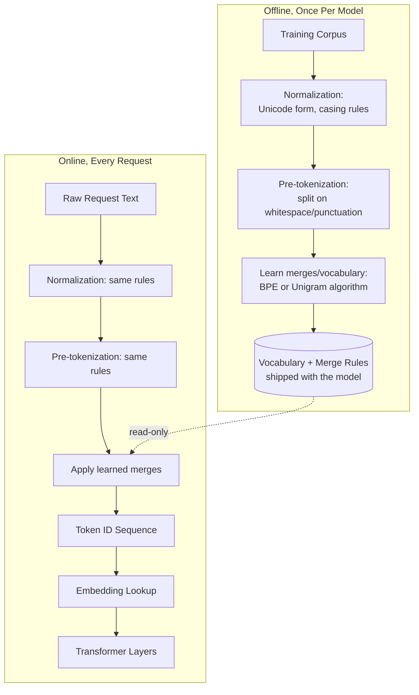
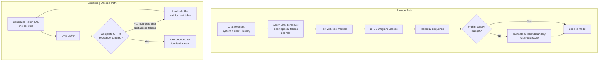
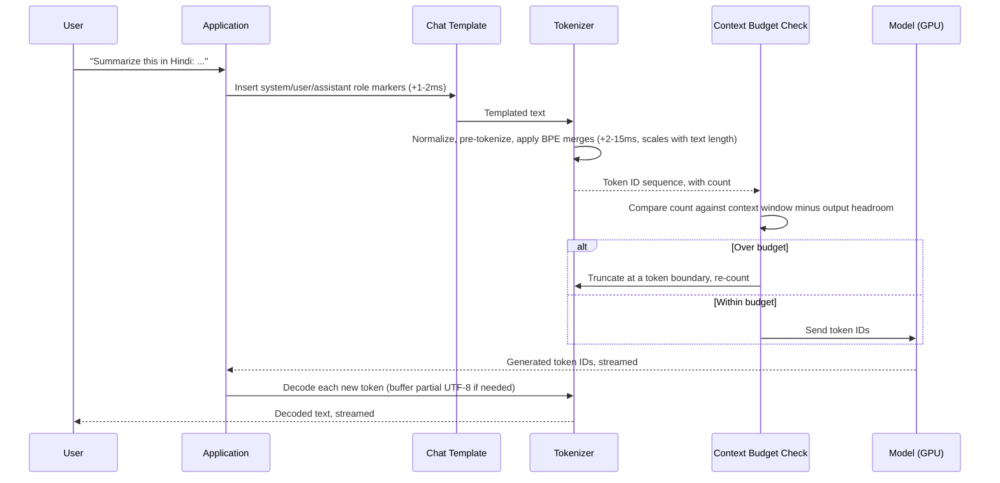
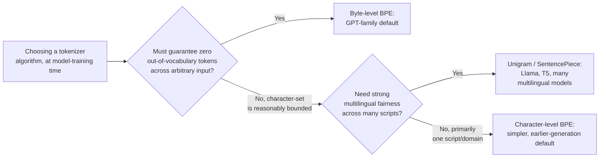
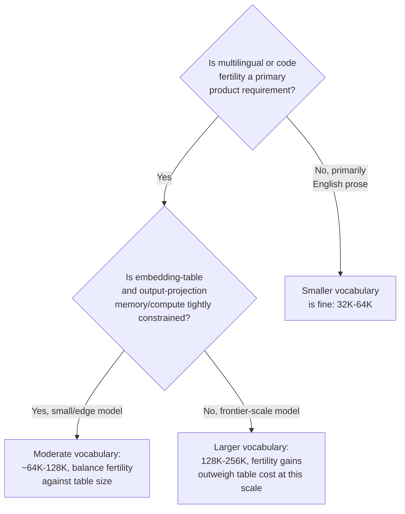

# Tokenization & Vocabulary

## Overview

A model never sees text — it sees a sequence of integers, and the function that turns one into the other is the tokenizer. That conversion is invisible from the API surface but determines three things systems engineers actually have to answer for: how many tokens a given request costs, how much usable context window a given amount of real text consumes, and why the same product can feel cheap in English and expensive in Japanese. Tokenization is a fixed, pre-trained artifact shipped with a model, not a runtime decision — which is exactly why getting it wrong is a silent, structural cost, not a bug you catch in a code review.

## Definition

A **tokenizer** is a deterministic, pre-trained function that maps a string of raw text to a sequence of integers (token IDs) drawn from a fixed **vocabulary**, and back again (detokenization). Production LLMs use **subword tokenization** — most commonly byte-pair encoding (BPE) or its byte-level and Unigram variants — which represents text as a sequence of variable-length character fragments learned from a training corpus, rather than whole words or single characters. The tokenizer and the model are trained as a matched pair: the model's embedding table has exactly one row per vocabulary entry, so a tokenizer is not portable across models with a different vocabulary without breaking the model entirely.

## Problem Statement

Tokenization sits below the abstraction every other chapter in this book operates at, which is exactly why its failure modes are invisible until they show up as a cost or quality incident:

- **The same prompt costs different amounts in different languages.** A tokenizer trained predominantly on English text represents English efficiently (common words often collapse to one or two tokens) and represents other scripts — Hindi, Arabic, Korean, Chinese — far less efficiently (sometimes one token per byte), so a literal translation of the same sentence can cost 1.5-4x more in tokens, a cost difference no amount of prompt engineering fixes.
- **"128K context window" does not mean 128K words, or even a stable ratio of words to tokens.** Capacity planning that assumes ~4 characters per token (a common English-only rule of thumb) silently breaks for multilingual traffic, code, or numeric-heavy content, which tokenize at a different, usually worse, ratio.
- **A tokenizer/model mismatch is a silent, catastrophic failure, not a clean error.** Encoding text with the wrong tokenizer — a real risk when swapping model providers or self-hosting a fine-tuned variant — produces a syntactically valid sequence of token IDs that map to entirely wrong embeddings, with no exception thrown; the model just generates nonsense, and the failure looks like a quality regression, not an integration bug.
- **Truncating by character count instead of token count silently cuts content mid-token**, and at a context-window boundary, mid-prompt — both wasting budget (the partial token contributes cost with no usable information) and occasionally producing malformed output if the cut lands inside a multi-byte sequence.

None of these failures appear in a typical functional test, because functional tests run in one language, on short strings, well inside the context window — exactly the regime where tokenization differences are invisible.

## Why This Architecture Exists

Early neural language models tokenized at the word level: one ID per dictionary word. This failed in two compounding ways. First, **vocabulary size and quality traded off directly against each other** — covering enough words for broad-domain text required either an enormous vocabulary (expensive: the embedding table and final projection layer both scale linearly with vocabulary size) or accepting a large out-of-vocabulary problem, where any word not in the fixed dictionary — a typo, a brand name, a word in a language the vocabulary wasn't built for — became an unrepresentable `<UNK>` token, destroying the information it carried. Second, word-level vocabularies don't generalize: a model that has never seen "tokenization" as a word has no way to leverage that it understands "token" and "-ization" separately.

Character-level tokenization (one ID per character) solved the out-of-vocabulary problem completely — every string is representable — but at a steep cost: sequences became much longer for the same text, and attention's quadratic cost in sequence length (see [Transformer Internals for Systems Engineers](01-transformer-internals-for-systems-engineers.md)) made that length increase expensive in both compute and effective context budget.

**Byte-pair encoding**, adapted from a 1990s data-compression algorithm, resolved the tension directly: start from individual characters (or bytes), then iteratively merge the most frequent adjacent pair into a new vocabulary entry, repeating until reaching a target vocabulary size. The result is a vocabulary that represents common words and word-fragments as single tokens (efficient, short sequences for typical text) while still being able to fall back to individual characters or bytes for anything rare or unseen (no out-of-vocabulary problem, ever) — the engineering compromise that made subword tokenization the universal default, and the reason every production LLM today inherits this exact tradeoff structure.

## Core Concepts

- **Subword unit** — a vocabulary entry that may be a whole word, a word fragment, a single character, or (in byte-level variants) a single byte; the basic unit a tokenizer emits.
- **Byte-Pair Encoding (BPE)** — builds a vocabulary by iteratively merging the most frequent adjacent symbol pair in a training corpus; encoding text applies the same learned merge rules, in order, to a starting sequence of characters or bytes.
- **Byte-level BPE** — runs BPE over raw UTF-8 bytes (256 possible starting symbols) instead of Unicode characters, guaranteeing that *any* input — any language, emoji, malformed text — is representable with zero out-of-vocabulary tokens, at the cost of needing more merges to reach the same vocabulary efficiency for non-Latin scripts. GPT-family tokenizers use this approach.
- **SentencePiece / Unigram** — an alternative training algorithm that starts from a large candidate vocabulary and iteratively *removes* low-value subwords (rather than BPE's iterative *merging* from scratch), scored by a unigram language-model probability; used by Llama, T5, and many multilingual models. Produces broadly similar results to BPE but differs in tie-breaking and rare-sequence behavior.
- **Vocabulary size** — the total number of distinct tokens a tokenizer can emit, commonly **32K-256K** in current production models; this single number is a direct lever on embedding-table size, final-layer projection cost, and average tokens-per-character for any given language mix.
- **Fertility / compression ratio** — tokens needed per unit of text (commonly measured in tokens-per-word or characters-per-token); the practical, measurable number behind "this language costs more," and it varies by script, domain (code vs. prose vs. numbers), and the training corpus's language mix.
- **Special tokens** — reserved vocabulary entries with non-text meaning: beginning/end-of-sequence markers, padding, chat-role delimiters (`<|user|>`, `<|assistant|>`); a tokenizer/template mismatch here is a distinct, common production failure from the merge-rule mismatch above.
- **Detokenization** — the inverse mapping, token IDs back to text; subtleties here (e.g., a partially-streamed multi-byte character) are a real, if narrow, source of production bugs in streaming responses.

## Training vs Inference Pipeline

Tokenization has two distinct lifecycles that are easy to conflate: a one-time, offline **training** phase that produces the vocabulary and merge rules, and a per-request, online **encode/decode** phase that every production request runs through.

The detailed view of the online path shows where the genuinely distinct failure surfaces sit: special-token handling, which is template-driven rather than text-driven, and the streaming decode path, which has to handle partial, not-yet-complete byte sequences.

## Pipeline Stages and Responsibilities

| Component | Responsibility | Does NOT own |
|---|---|---|
| Normalizer | Apply a consistent Unicode form and casing rules before splitting | Vocabulary content, merge rules |
| Pre-tokenizer | Split text into initial chunks (commonly on whitespace/punctuation boundaries) before subword merging applies within each chunk | Cross-chunk merges (most BPE implementations don't merge across this boundary) |
| Vocabulary / merge table | The fixed, trained mapping from subword units to integer IDs, and the ordered merge rules used to apply them | Embedding values (a separate, trained model parameter keyed by these IDs) |
| Encoder | Apply normalization, pre-tokenization, and merge rules to turn text into a token ID sequence | Truncation/budget policy (that's a context-engineering decision consuming the encoder's token count) |
| Decoder/detokenizer | Map token IDs back to text, including buffering partial multi-byte sequences during streaming | Encoding (a separate, not perfectly symmetric, operation in some edge cases) |
| Chat template | Insert role-delimiting special tokens around system/user/assistant turns before encoding | The merge algorithm itself |

## A Chat Request Through the Tokenizer

A single chat request's text passes through normalization, templating, and encoding before a single model FLOP is spent — and this entire path is CPU-bound, not GPU-bound, which makes it easy to under-monitor relative to the GPU-side latency budget.

Tokenization latency is rarely the bottleneck in absolute terms (single-digit to low double-digit milliseconds for typical request sizes), but it is the step that determines the *token count* every downstream cost and latency model in this book is built on — a tokenizer that represents a given request's text in 1,800 tokens versus 3,200 tokens, because the request happens to be in a less-efficiently-tokenized language, changes the prefill cost, the time-to-first-token, and the dollar cost by a comparable factor with zero change in the request's actual informational content.

## Tokenizer Algorithm Patterns

Three tokenizer-algorithm choices recur across production model families, and the decision is made once, at training time, by the model's creators — a systems engineer's job is knowing which one a given model uses and what that implies, not picking one at request time.

1. **Byte-level BPE** — the GPT-family default (OpenAI's `tiktoken` library implements this). Operating on raw bytes guarantees universal coverage with no `<UNK>` token ever, at the cost of needing more tokens for byte-heavy, less-common scripts.
2. **Unigram with SentencePiece** — Llama, T5, and many multilingual-first models. The removal-based training algorithm tends to produce more balanced segmentation across languages when the training corpus is deliberately multilingual, though it doesn't eliminate the fundamental skew toward whichever language dominates the training data.
3. **Vocabulary size as a separate, composable choice** — independent of the algorithm, model families have grown vocabulary size over generations (early models around 32K, many current frontier models 100K-256K) specifically to improve multilingual and code fertility, since a larger vocabulary can dedicate more entries to non-English subwords without sacrificing English efficiency.
4. **Domain-specialized vocabularies** — code models frequently use vocabularies tuned with code-heavy training corpora, since whitespace-sensitive, symbol-dense code tokenizes poorly under a prose-trained vocabulary (e.g., four-space indentation or repeated punctuation can fragment into many single-character tokens otherwise).

## Tradeoffs

Vocabulary size is the one tokenizer parameter a systems engineer can reason about as a clean tradeoff, since growing it has a direct, quantifiable cost on one side and a direct, quantifiable benefit on the other.

| Larger vocabulary | Smaller vocabulary |
|---|---|
| Better fertility (fewer tokens per word) for more languages and domains, lowering real-world cost and improving effective context utilization | Smaller embedding table and output-projection layer — meaningful memory and compute savings at the embedding/unembedding step |
| Shorter sequences for the same text, indirectly reducing attention's quadratic cost | Faster to train (smaller softmax over the vocabulary at every training step) |
| More vocabulary entries to learn good representations for — rare entries can be undertrained, especially in long-tail languages | Risk of poor fertility for underrepresented scripts persists or worsens, since there's less room to dedicate entries to them |
| Marginal benefit shrinks once a script's common subwords are already well covered | Marginal savings shrink at frontier model scale, where the embedding table is a tiny fraction of total parameters anyway |

## Scalability

- **Tokenization throughput scales with CPU, not GPU, capacity** — encoding is a CPU-bound string operation, so at high QPS it is typically parallelized across CPU cores ahead of the GPU-bound model call, and a tokenizer-side bottleneck shows up as elevated time-to-first-token with idle GPUs, a distinct signature from a GPU-bound regression.
- **Vocabulary size scales the embedding table and output projection linearly**, but both are a small fraction of total parameters in frontier-scale dense models (commonly under 5%) — the *systems* impact of vocabulary size is overwhelmingly about token count and fertility, not about table memory, except in genuinely small or edge-deployed models where the embedding table is a much larger fraction of total size.
- **Multilingual traffic mix is a workload-characterization input that compounds with everything in [Capacity Planning Primer](../01-fundamentals/04-capacity-planning-primer.md)** — a product expanding from English-only to a global user base should re-measure its tokens-per-request distribution, not assume the original capacity model still holds, since a language mix shift can move the average token count per request by a large, non-obvious factor.
- **Batch tokenization for offline pipelines** (embedding a corpus, evaluation sets) scales near-linearly with text volume and parallelizes trivially across cores or workers, unlike model inference, which is bounded by accelerator availability.

## Reliability

| Failure | Cause | Degradation strategy |
|---|---|---|
| Garbage output, no error thrown | Tokenizer/model version mismatch — encoding with the wrong vocabulary | Pin tokenizer and model versions together as one deployable unit; validate the pairing with a canary round-trip test before traffic, not after a quality complaint |
| Malformed streamed text | A multi-byte UTF-8 character split across two streamed tokens, decoded prematurely | Buffer incomplete byte sequences at the decoder until a full character is available, never emit partial bytes |
| Truncation cuts mid-token, wasting budget or corrupting the boundary | Truncating by character or byte count instead of token count | Truncate strictly at token boundaries, re-tokenizing the truncated string to confirm the final count |
| Unexpected cost spike with no code change | Traffic's language or content mix shifted toward worse-fertility text | Monitor tokens-per-character or tokens-per-request as a first-class metric, segmented by detected language where feasible |
| Special-token injection | User input containing literal special-token text (e.g., typing `<|endoftext|>`) interfering with template boundaries | Escape or strip literal special-token strings from untrusted input before templating, treating them as data, not control sequences |

## Security

Tokenization is a narrow but real attack surface, distinct from the model-level concerns in [AI Security](../21-ai-security/index.md):

- **Special-token injection** — if a chat template inserts role-delimiting special tokens around user text without escaping literal occurrences of those token strings *within* that user text, an attacker can attempt to forge a fake role boundary (e.g., injecting text that looks like an assistant-turn marker) to manipulate how the model interprets the conversation structure. Defense is at the templating/encoding layer: treat special-token strings appearing in untrusted input as plain data, never as the literal control tokens, by encoding them through the regular text path rather than pattern-matching on raw strings.
- **Tokenization-based jailbreak attempts ("token smuggling")** — encoding a request so that an unsafe phrase's tokens don't align with the boundaries a safety filter pattern-matches against (since BPE merges are context-dependent, the same word can tokenize differently depending on surrounding text), letting harmful content slip past surface-level string filters that don't operate on the model's actual token stream. Defense is layering safety checks on decoded text and on model behavior, not relying on raw token-ID pattern matching as a safety boundary — see [Guardrails & Content Safety](../21-ai-security/04-guardrails-and-content-safety.md).
- **Glitch tokens** — certain rare vocabulary entries (often artifacts of training-data quirks) can trigger anomalous or unstable model behavior when included in a prompt; treat unexplained model instability tied to specific rare strings as a known class of issue worth checking against, not a one-off bug.

## Cost Optimization

- **Measure fertility on your real traffic mix, not on an English benchmark.** The textbook "~4 characters per token" approximation is English-prose-specific; code, structured data, and non-Latin scripts can run meaningfully worse, and the only reliable number is one measured against your own request distribution.
- **A 1.5-4x token-cost multiplier for some languages is a real, durable unit-economics fact**, not a temporary inefficiency — pricing, quotas, and capacity plans for genuinely global products should account for it explicitly rather than budgeting off an English-only average.
- **Truncate and summarize history at the token level, not the character level**, so budget calculations stay accurate — a character-based estimate can be off by a large factor for non-English or code-heavy content, defeating the purpose of careful context budgeting (see [Context Window Budgeting](../04-context-engineering/02-context-window-budgeting.md)).
- **Don't default every product surface to the largest model's tokenizer assumptions** — if a smaller, cheaper model in the same family shares a tokenizer, switching doesn't change token economics, but switching model *families* (and therefore tokenizers) changes your entire cost model for the same input text, an easy detail to miss when comparing vendor pricing.

## Monitoring

- **Tokens-per-character (or tokens-per-request), trended over time and segmented by detected language where feasible** — the leading indicator that traffic mix has shifted in a way that changes cost without any code change.
- **Tokenization latency, p50/p95**, tracked separately from model latency — a regression here points at the CPU-bound encode path, not the GPU.
- **Truncation rate** — how often requests are truncated to fit budget, and by how much; a rising rate signals either growing real demand for more context or a budgeting policy that needs retuning.
- **Tokenizer/model version pairing**, asserted at deploy time and ideally alerted on if they drift apart — this is cheap to check and catastrophic to miss.
- **Detokenization buffering events**, if instrumented — a near-zero but non-zero rate is expected (multi-byte characters legitimately split across streamed tokens); a sudden spike suggests a decode-path bug.

## Production Best Practices

- **Pin tokenizer and model versions as one deployable artifact**, never updated independently — the failure mode when they drift (garbage output, no error) is too silent and too severe to leave to convention.
- **Budget and truncate in tokens, always** — any character- or byte-based approximation of context usage is a known source of both wasted budget and boundary-cutting bugs.
- **Benchmark fertility against your own multilingual and domain-specific traffic** before finalizing a capacity or pricing model — a generic English benchmark will under-forecast real cost for a global or code-heavy product.
- **Escape literal special-token strings in untrusted input** before templating, rather than trusting that user text never happens to contain them.
- **Buffer streaming decode output until a complete character is available** — never emit a token's raw bytes to a client without checking whether they complete a valid character.
- **Treat the chat template as part of the tokenization contract**, version it alongside the tokenizer and model, since a template change alone (without touching the vocabulary) can still change token counts and special-token placement.

## Real World Examples

The following are drawn from public documentation and known, widely-discussed tokenizer behavior — not internal specifications.

- **OpenAI's `tiktoken`** is the most widely studied byte-level BPE implementation in production use, with publicly documented vocabularies (e.g., the `cl100k_base` and newer `o200k_base` encodings) growing in size across model generations specifically to improve multilingual and code fertility.
- **Meta's Llama family** documents its move to a SentencePiece-trained vocabulary and has, across generations, grown vocabulary size (32K in early Llama models to 128K in Llama 3) explicitly citing improved compression and multilingual support as the motivation, a publicly stated instance of the size/fertility tradeoff in this chapter.
- **Google's Gemini and earlier T5/PaLM lineage** has published on SentencePiece-based, Unigram-trained tokenization with deliberately multilingual training corpora, reflecting Google's broad non-English user base as a first-class tokenizer design input rather than an afterthought.
- **Anthropic** has discussed Claude's context-window economics and prompt/context caching publicly without disclosing tokenizer internals in the same depth as OpenAI's open-sourced `tiktoken`; the broader industry pattern — token-based, not character-based, pricing and context limits — is the practical detail every API consumer of any provider needs to internalize regardless of the specific algorithm behind it.

## Interview Questions

### Beginner

**Q: Why don't LLMs just process raw text or individual characters instead of "tokens"?**
Word-level vocabularies can't represent words they've never seen (the out-of-vocabulary problem) and need huge vocabularies to cover broad-domain text. Character-level vocabularies avoid that but make sequences much longer for the same text, which is expensive given attention's quadratic cost in sequence length. Subword tokenization (BPE and similar) is the compromise: common words and fragments become single efficient tokens, while anything rare or unseen still has a fallback (down to individual characters or bytes), so coverage is universal without sequences blowing up for typical text.

**Q: Why can the same sentence cost different numbers of tokens depending on what language it's written in?**
Because the tokenizer's vocabulary was learned from a training corpus, and any subword that appeared frequently in that corpus gets its own efficient token, while less-represented scripts get split into more, smaller pieces — sometimes down to one token per byte. A tokenizer trained mostly on English text represents English efficiently and other languages less efficiently, purely as a function of how much of each language was in the training data.

### Intermediate

**Q: What actually breaks if you encode a request with the wrong model's tokenizer?**
The encoder still produces a valid-looking sequence of integers — there's no error, because any tokenizer can mechanically tokenize any text. But those integers index into a different embedding table than the one the model was trained with, so the model receives embeddings that don't correspond to the text's actual meaning at all. The output is incoherent, and because nothing crashed, this looks like a model quality problem rather than the integration bug it actually is — which is why pinning tokenizer and model versions together matters operationally, not just stylistically.

**Q: Why is truncating a prompt by character count a real production bug, not just an approximation?**
Token boundaries don't align with character-count boundaries, so cutting at a fixed character count can land in the middle of a token, in the middle of a multi-byte character, or simply miscount the actual token budget by a wide margin for non-English or code-heavy text — all of which either wastes context budget on a corrupted partial token or produces a request that's still over the real token limit despite passing a character-count check. Truncation needs to operate on the tokenizer's actual output, re-counted after cutting.

### Senior

**Q: A product expanding from English-only to a global launch sees its average cost-per-request rise by 60% with no code or feature changes. How do you investigate, and what's the likely cause?**
The first thing to check is the request's average token count, segmented by detected language — if the expansion shifted traffic mix toward languages the tokenizer represents less efficiently, the same user-facing request volume now carries meaningfully more tokens per request, which shows up directly as cost, with zero correlated code change. The fix isn't a tokenizer change (that's a model-training decision, not available at request time) — it's updating the capacity and pricing model to account for the real, measured fertility of the new traffic mix, and potentially adjusting context budgets per-language if a fixed token allocation was assumed to cover a fixed amount of *content* regardless of language.

**Q: How would you design a monitoring signal that catches a tokenizer/model version mismatch before it reaches production traffic?**
Treat the (tokenizer version, model version) pairing as an assertion checked at deploy time, not a convention trusted by process: encode and decode a small, fixed canary string through the deployed pairing and confirm the round-trip matches and that a known prompt produces an expected (or at least coherent) response pattern. Because the failure mode is silent — no exception, no error code, just incoherent output — this has to be an active, automated check gating the deploy, not a passive monitor that would only catch it after real traffic already saw degraded responses.

### Staff

**Q: You're designing the tokenization strategy for a code-generation product serving a genuinely global, multilingual developer audience. What tradeoffs do you weigh that a general-purpose chat product wouldn't face?**
Code and natural-language fertility pull in different directions: code's whitespace-sensitivity (especially indentation-heavy languages) and dense, repeated punctuation tokenize poorly under a vocabulary trained mostly on prose, while a vocabulary tuned for code may underrepresent the natural-language portions of a request (comments, docstrings, chat-style instructions) — and a globally multilingual developer base adds a third axis, since comments and identifiers in non-English languages compound the prose-side fertility problem on top of the code-side one. The model choice here is upstream of anything I control at request time (vocabulary is fixed at training), so my actual lever is selecting a model family whose published tokenizer and training corpus composition match this specific workload's profile, validated empirically against a representative sample of real multilingual code-and-prose traffic rather than assumed from general-purpose benchmarks, and building the cost model on that measured fertility rather than a generic assumption.

**Q: Tokenization is described as fixed at training time and not a runtime decision — does that mean a systems team has zero levers here, or are there real architectural choices that remain?**
The vocabulary and merge rules are fixed once a model ships, but several real decisions remain on the systems side: which model family to select partly on tokenizer fertility for your actual traffic profile (a [Model Families & Selection](05-model-families-and-selection.md) decision, not a tokenizer-engineering one); how aggressively to budget and truncate at the token level rather than approximate; how to instrument and monitor fertility drift as traffic mix changes; and how to design chat templates and special-token handling to avoid the injection and boundary bugs covered above. None of these change the tokenizer itself, but all of them are genuine engineering decisions that determine whether a fixed tokenizer's real-world cost and reliability profile is well-managed or quietly mismanaged.

## Google-Level Follow-Ups

- "If you could change exactly one property of a tokenizer to improve a multilingual product's unit economics, with no other constraints, what would you change and what would you give up?" — probes for naming vocabulary size growth (more entries to cover non-English subwords) and recognizing the cost: larger embedding/projection tables and the risk of undertraining the long tail of rarely-used entries.
- "How would you detect, from API-level metrics alone with no access to the tokenizer internals, that your traffic's fertility has gotten worse?" — probes for proposing tokens-per-character or tokens-per-request trended over time, ideally cross-referenced against a language-detection signal on the input text, as an external, black-box-compatible proxy.
- "A user reports that a phrase that should clearly violate content policy gets through, but only when phrased one specific way. How might tokenization be involved?" — probes for recognizing token-smuggling/context-dependent merge behavior as a plausible mechanism, and that the fix is checking decoded text and model behavior, not raw token patterns.
- "Why doesn't simply switching to character-level tokenization eliminate all of these problems, given that it has no out-of-vocabulary issue and no language-fertility skew?" — probes for understanding that character-level tokenization re-introduces a different, often worse cost: much longer sequences for the same text, which is expensive under attention's quadratic scaling — there's no free option, only a different point on the same tradeoff curve.

## Common Mistakes

- **Approximating token count from character count**, especially for non-English, code, or structured-data content, where the real ratio can differ from the assumption by a wide margin.
- **Treating tokenizer and model versions as independently upgradable**, risking a silent, catastrophic mismatch with no error thrown.
- **Truncating by character or byte count instead of re-tokenizing and cutting at a token boundary**, wasting budget or corrupting a partial token.
- **Forecasting cost and capacity entirely from English-language benchmarks** for a product with real multilingual traffic, then being surprised by the actual bill.
- **Decoding and emitting streamed bytes without buffering for complete multi-byte characters**, producing visibly malformed text mid-stream.
- **Relying on raw token-ID or substring pattern matching as a safety boundary**, missing that the same content can tokenize differently depending on context, letting filtered content slip through unblocked.

## Key Takeaways

- A tokenizer is a fixed, pre-trained pairing with its model, not a runtime choice — it maps text to integers via a learned subword vocabulary, most commonly BPE, byte-level BPE, or Unigram/SentencePiece.
- Subword tokenization exists because word-level vocabularies can't represent unseen words and character-level vocabularies make sequences too long; it is the engineering compromise between universal coverage and efficient sequence length.
- The same content can cost 1.5-4x more in tokens depending on language, purely as a function of how well-represented that language's scripts were in the tokenizer's training corpus — a durable unit-economics fact, not a transient inefficiency.
- A tokenizer/model version mismatch fails silently — valid-looking output, no error, just incoherent generation — making version pinning and active validation a real reliability requirement, not a convention.
- Always budget, truncate, and reason about context usage in tokens, never in characters or bytes, since the conversion ratio varies by language, domain, and content type.
- Tokenization-level attack surfaces (special-token injection, token smuggling, glitch tokens) are real and distinct from model-level safety concerns, and need their own mitigations at the encoding and templating layer.
- This chapter's vocabulary — fertility, special tokens, byte-level fallback — recurs directly in [Context Windows & Positional Encoding](03-context-windows-and-positional-encoding.md) (the token is the unit a context window is measured in) and [Capacity Planning Primer](../01-fundamentals/04-capacity-planning-primer.md) (the token is the unit every cost and throughput model is built on).

---

*Part of [LLM Architecture](index.md) in the [AI System Design Notes](../index.md). Tracked in [BACKLOG.md](https://github.com/GyanendraChaubey/AI-System-Design-Notes/blob/main/BACKLOG.md).*
