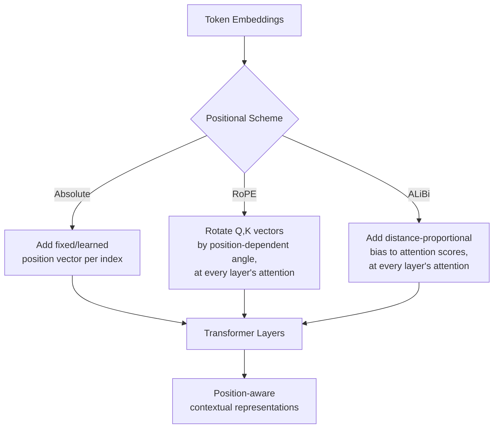
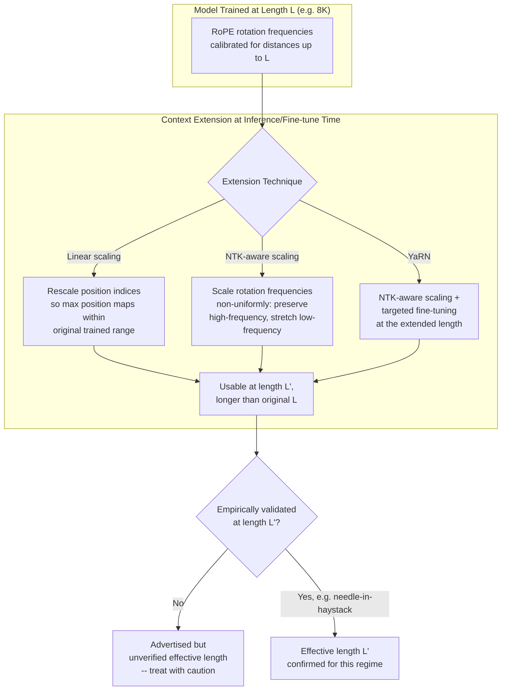
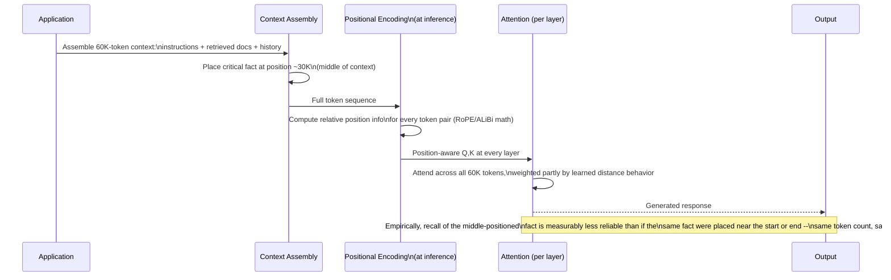
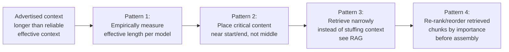
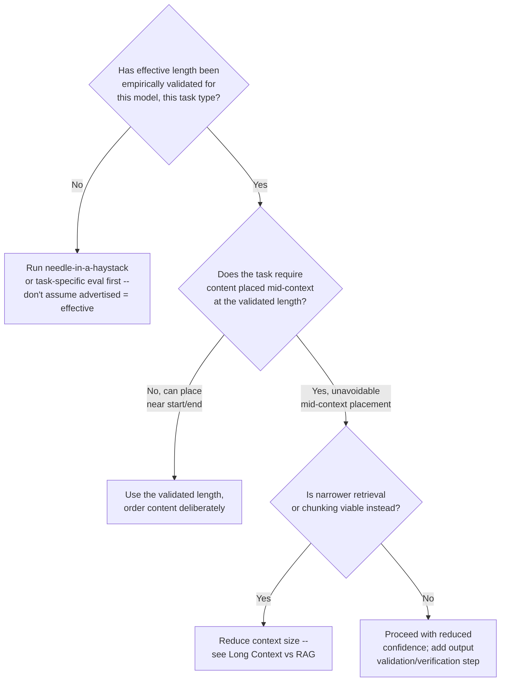

# Context Windows & Positional Encoding

## Overview

Self-attention, as covered in [Transformer Internals for Systems Engineers](01-transformer-internals-for-systems-engineers.md), compares every token to every other token — but that comparison, on its own, is blind to *order*: swap two tokens' positions and an order-agnostic attention computation would treat the sequence identically. Positional encoding is the mechanism that fixes this, and the specific scheme a model uses determines a fact every systems engineer eventually has to reckon with: a model's advertised context window and the length at which it actually reasons reliably are two different numbers, and the gap between them is a direct consequence of which positional encoding scheme, and which extension technique, the model uses.

## Definition

**Positional encoding** is the mechanism by which a transformer injects information about each token's position in the sequence into its representation, since self-attention's core computation has no inherent notion of order. **Context window** is the maximum sequence length (input plus output) a model can process in a single request, a number bounded jointly by the positional encoding scheme's reach and by what length the model was actually trained and evaluated at. The two are tightly coupled: extending a model's usable context window, almost always, means modifying or extending how it encodes position — and the resulting "effective context length" (where the model reasons reliably) is frequently shorter than the "advertised context length" (what the architecture can technically accept).

## Problem Statement

Treating the advertised context window as a flat, reliable budget produces real, recurring failures:

- **"128K context" is an upper bound on what the architecture accepts, not a guarantee of reasoning quality at that length.** Models systematically show degraded recall and reasoning on content placed in the middle of a long context relative to content near the beginning or end — the "lost in the middle" effect — meaning two requests of identical token count can get meaningfully different answer quality depending on *where* the critical fact sits.
- **Extending context length is not free, and not uniform across extension techniques.** A model trained at an 8K-token context and extended to 128K via a scaling technique applied post-training routinely shows quality degradation that's worse near the extended end of that range than near the original trained length — "it technically accepts 128K tokens" and "it reasons as well at 100K tokens as it does at 4K" are different, unlinked claims.
- **RAG and context-engineering decisions (chunk placement, ordering) are directly downstream of positional behavior**, not just token budget — a system that retrieves the single most relevant passage and then buries it in the middle of a long assembled context can underperform a system that retrieves the same passage and places it at the start or end, even though both used the identical token budget and identical retrieved content.
- **A model upgrade can silently change effective context length even when the advertised number stays the same or grows** — different model versions use different positional schemes or extension techniques, and "supports 128K tokens" said about two different models is not a like-for-like claim about reasoning quality at that length.

## Why This Architecture Exists

The original Transformer (2017) used **absolute positional encoding** — a fixed or learned vector added to each token's embedding, indexed by its raw position (position 1 gets vector A, position 2 gets vector B, and so on). This is the simplest possible scheme, but it has a hard ceiling: a position embedding table has a fixed number of rows, learned at training time, and a sequence longer than that table has no embedding to use — extending context length means retraining (or at minimum fine-tuning) a fundamentally new, larger table, with no graceful degradation path.

The industry moved toward **relative positional encoding** — schemes that encode the *distance between* tokens rather than each token's absolute index — because relative information generalizes better to lengths unseen during training: a model that has learned "tokens 10 apart attend to each other this way" can apply that same relationship whether the absolute positions are (5, 15) or (50,000, 50,010), which an absolute-position table fundamentally cannot do past its trained length. **Rotary Positional Embedding (RoPE)**, now the dominant scheme in production LLMs (Llama, Mistral, and many others), encodes relative position by rotating each token's Query and Key vectors by an angle proportional to position, so the attention score between two tokens becomes a function of their relative rotation — distance — rather than their absolute indices. **ALiBi** (Attention with Linear Biases) takes an even simpler approach: it adds a distance-proportional penalty directly to attention scores, with no learned position vectors at all, which empirically extrapolates to longer sequences more gracefully than absolute encoding, at some cost to how finely it can represent position relationships compared to RoPE.

Both relative schemes still have a real-world wrinkle: a model trained at one context length and asked to operate well beyond it (even with a relative scheme) still degrades, because the *distribution* of relative distances and attention patterns seen during training doesn't cover the longer regime — which is exactly the gap that **context-length extension techniques** (below) exist to narrow, imperfectly, after the fact.

## Core Concepts

- **Absolute positional encoding** — a fixed-size, position-indexed table of vectors added to token embeddings; simple, but hard-capped at the table's trained length and generalizes poorly beyond it.
- **Relative positional encoding** — encodes the distance between token pairs rather than each token's raw index; generalizes better to unseen lengths because relative relationships repeat across the sequence regardless of absolute position.
- **RoPE (Rotary Positional Embedding)** — rotates Query/Key vectors by a position-dependent angle so attention scores naturally become a function of relative distance; the dominant scheme in current open-weight and many closed-weight production models.
- **ALiBi (Attention with Linear Biases)** — adds a distance-proportional penalty directly to attention scores instead of modifying Q/K vectors; simpler and empirically robust to length extrapolation, with somewhat less expressive position representation than RoPE.
- **Context-length extension** — post-training techniques (RoPE frequency scaling, "NTK-aware" scaling, YaRN) that adjust a RoPE-based model's positional math to behave reasonably at lengths longer than originally trained, typically with brief continued fine-tuning at the extended length rather than full retraining from scratch.
- **Effective vs. advertised context length** — the advertised number is what the architecture and any extension technique technically accept; the effective number is the length at which the model actually retrieves and reasons over content reliably, measured empirically (commonly via needle-in-a-haystack-style benchmarks), and is frequently shorter than the advertised figure, especially near the top of the advertised range.
- **Lost in the middle** — the empirical pattern where model recall and reasoning accuracy is measurably worse for information placed in the middle of a long context than for information placed near the start or end, independent of whether the content technically fits within the context window.

## Positional Encoding Schemes and Extension Techniques

Positional information enters the model once, near the input, but its consequences — how attention behaves at different relative distances — propagate through every layer's self-attention computation, which is why a scheme decided once at training time shapes behavior at every depth of the network.

The detailed view shows where extension techniques intervene for a RoPE-based model: they modify the rotation frequency math itself, not the model weights directly, which is why extension can be applied without a full retrain — at the cost of needing some recalibration (typically brief continued fine-tuning) to perform well in the newly-reachable range.

## The Context Window Toolkit

| Component | Responsibility | Does NOT own |
|---|---|---|
| Positional encoding scheme | Inject order information into the attention computation, at every layer | Cross-token information mixing itself (attention's core job) |
| RoPE rotation parameters | Determine how Q/K vectors rotate as a function of position, calibrated at training time | Model weights (these are a separate, fixed mathematical transform, not learned parameters in the typical case) |
| Context extension technique | Adjust positional math (and optionally fine-tune) to make a trained model usable at lengths beyond its original training range | Guaranteeing quality at the extended length — that's an empirical claim requiring separate validation |
| Evaluation/benchmarking (needle-in-a-haystack and similar) | Measure effective context length empirically, distinct from the advertised maximum | The extension technique itself |
| Context engineering / chunk ordering ([Context Engineering](../04-context-engineering/index.md)) | Decide what content goes where within the available window, informed by positional behavior | The model's underlying positional architecture |

## Processing a Long-Context Request

A single long-context request reveals where positional behavior actually bites: not at the token-budget check, but in the quality of attention over content depending on *where* it sits in the assembled sequence.

The practical consequence: two requests with identical token counts and identical retrieved content can produce different answer quality purely because of *where* the critical fact was placed during context assembly — a fact [Context Engineering](../04-context-engineering/index.md) treats as a design constraint, not a model bug to wait out.

## Managing the Effective Context Gap

Production systems manage the gap between advertised and effective context length through a small set of recurring patterns, roughly in order of how much engineering effort they require.

1. **Empirically measure effective length, per model, before trusting the advertised number.** A needle-in-a-haystack-style test (place a known fact at varying depths and positions, measure retrieval accuracy) is cheap to run and is the only reliable way to know where a specific model's quality actually starts degrading.
2. **Place the most important content near the start or end of the assembled context**, deliberately working around the lost-in-the-middle effect rather than assembling context in an arbitrary or purely chronological order.
3. **Prefer narrow, high-precision retrieval over long-context stuffing** when both are viable — fewer, more relevant tokens reduce exposure to the lost-in-the-middle effect entirely, rather than trying to out-position a known weakness (see [Long Context vs RAG](../04-context-engineering/04-long-context-vs-rag.md)).
4. **Re-rank and reorder retrieved chunks by importance before final assembly**, rather than preserving retrieval-score order or document order by default, since assembly order is a positional lever independent of which chunks were retrieved.

## Tradeoffs

The central decision a systems team faces is not "which positional encoding scheme" (that's fixed at model-training time, outside a systems engineer's control) but "how much do we trust the advertised context length, and what do we do about the gap."

| Trusting the advertised context length | Validating effective length empirically first |
|---|---|
| Faster to ship — no benchmarking step before launch | Adds an upfront measurement step, but catches quality gaps before users do |
| Risk of silent, hard-to-diagnose quality degradation at real-world lengths, especially mid-context | Produces a defensible, model-specific number to design context budgets and chunk placement around |
| A model or version upgrade can silently change the real number with no warning | Re-running the same cheap benchmark after any model change catches drift before it reaches production |
| Common failure mode: blaming "the model" for inconsistent quality when the actual cause is positional, fixable by reordering content | Makes the lost-in-the-middle effect a known, designed-around constraint rather than an unexplained quality variance |

## Scalability

- **Effective context length does not scale linearly with model size or training compute** — a larger model is not automatically more reliable at long context; effective length is closely tied to the specific positional scheme, extension technique, and how much long-context data and fine-tuning the model actually received, independent of parameter count.
- **Extension techniques scale differently in cost.** Simple frequency rescaling (linear or NTK-aware) requires no additional training and is essentially free to apply, but typically yields a smaller effective-length gain and a more pronounced lost-in-the-middle effect than YaRN-style approaches that pair scaling with targeted continued fine-tuning at the extended length — a real engineering-cost-versus-quality tradeoff a model provider makes, and a systems engineer inherits without choice once a model is selected.
- **Lost-in-the-middle severity tends to worsen as context length grows**, even for models with strong long-context training, simply because there's proportionally more "middle" to be lost in — a 4K-context request has comparatively little room for the effect to manifest; a 200K-context request has a vast middle region where it can.
- **Multi-document, multi-source contexts compound the problem** — when content from many retrieved sources is concatenated, the positional disadvantage applies per-document depending on where each one lands in the final assembly, meaning [Hybrid Search & Reranking](../05-retrieval-systems/04-hybrid-search-and-reranking.md)'s output ordering is doing double duty as a relevance signal and a positional-placement decision.

## Reliability

| Failure | Cause | Degradation strategy |
|---|---|---|
| Inconsistent answer quality at long context, no clear pattern | Lost-in-the-middle effect on content placed mid-context | Reorder assembly to place critical content near start/end; validate with task-specific eval, not assumption |
| Quality regression after a model version upgrade, despite an equal or larger advertised context window | New version uses a different positional scheme or extension technique with a different effective-length profile | Treat effective context length as a property to re-validate on every model version change, not a number that only improves |
| Silent failure at the very top of the advertised context range | Extension techniques typically degrade gracefully but unevenly, often worst near the maximum extended length | Set a practical, validated maximum below the advertised ceiling for quality-sensitive use cases, with headroom |
| Apparent "forgetting" of early instructions in a long agentic session | Compounding effect of both context growth and positional placement as history accumulates | Periodically re-inject critical instructions, or summarize/compress older history rather than letting it drift into a disadvantaged position (see [Context Compression & Summarization](../04-context-engineering/03-context-compression-and-summarization.md)) |

A useful operational stance: treat "effective context length" the same way [GPU Sizing & Capacity Planning](../16-gpu-systems/02-gpu-sizing-and-capacity-planning.md) treats achievable throughput-per-GPU — a number that must come from your own measurement against your own workload, not a spec-sheet figure taken on faith.

## Security

Positional behavior has a narrower but concrete security implication, distinct from the model-architecture concerns in [Transformer Internals for Systems Engineers](01-transformer-internals-for-systems-engineers.md#security):

- **Burying instructions to evade attention is a plausible injection vector.** If safety-relevant instructions are placed in a positionally disadvantaged location (e.g., a system prompt rendered comparatively less salient by a very long subsequent context) while adversarial content is deliberately positioned where attention is empirically stronger, the lost-in-the-middle effect can be weaponized, not just stumbled into accidentally. This is a reason — among several covered in [Prompt-Injection-Resilient Design](../03-prompt-architecture/04-prompt-injection-resilient-design.md) — to re-inject critical instructions at multiple positions in long contexts, not just once at the start.
- **Context-length extension techniques are an under-scrutinized trust boundary.** A model's behavior at extended lengths is, by construction, less thoroughly evaluated than its behavior at originally-trained lengths — treating extended-range behavior as equally trustworthy for safety-critical instruction-following as in-range behavior is an unvalidated assumption, not a safe default.

## Cost Optimization

- **Don't pay for context you can't reliably use.** If a model's effective length is meaningfully shorter than its advertised maximum for your task, paying to send tokens into the unreliable range is spending budget on content the model is statistically less likely to use correctly — narrowing retrieval or compressing history to fit within the *validated* range is both a quality and a cost win simultaneously.
- **Reordering content for positional advantage is free.** Moving the most important content to the start or end of an assembled context costs nothing in tokens or latency — it's a pure quality lever with no cost tradeoff, which makes it one of the highest-leverage, lowest-cost interventions available in context engineering.
- **Validate before scaling to longer-context (and typically pricier) model tiers.** A larger-context model tier often costs more per token; confirming that effective length, not just advertised length, justifies the upgrade avoids paying a premium for capacity that won't be reliably used.

## Monitoring

- **Task-specific accuracy as a function of context length and fact position**, measured periodically (not just once at model-selection time) — the only reliable way to catch effective-length drift after a model version change.
- **Needle-in-a-haystack-style benchmark results, tracked per model version** as a regression signal, the same way an eval suite gates a prompt change elsewhere in these notes (see [Regression Testing for LLMs](../19-evaluation/05-regression-testing-for-llms.md)).
- **Distribution of where critical content lands in assembled contexts** in production, if instrumentable — a system that's unknowingly burying important content mid-context on a large fraction of requests has a quiet, systemic quality leak.
- **Quality metrics segmented by context-length bucket** (e.g., under 8K, 8K-32K, 32K-128K) — flat aggregate quality metrics can hide a real degradation concentrated in the longest-context bucket.

## Production Best Practices

- **Measure effective context length empirically for your actual task type, on your actual model version, before designing a context budget around the advertised maximum.**
- **Place critical instructions and the most important retrieved content near the start or end of the assembled context, deliberately**, treating the middle as a lower-reliability zone by default.
- **Re-validate effective context length after every model version upgrade** — a larger advertised window is not evidence of equal or better effective length.
- **Prefer narrow, well-targeted retrieval over maximal context stuffing** when both achieve the task, since it sidesteps the lost-in-the-middle effect rather than working around it.
- **Re-inject critical instructions periodically in long-running agentic sessions**, rather than relying on a single early system prompt to remain equally salient as context grows.
- **Treat extended-range behavior (beyond a model's original training length) as a less-validated regime**, applying extra scrutiny for safety-critical instruction-following specifically in that range.

## Real World Examples

The following are drawn from public research, technical reports, and widely discussed benchmarks — not confirmed internal specifications.

- **Google's Gemini family** has publicly emphasized very large advertised context windows (1M+ tokens in some tiers), and Google's own published long-context evaluation work (needle-in-a-haystack-style benchmarking) is part of the public evidence base that motivated the broader industry's lost-in-the-middle discussion — a useful, self-aware example of a provider publishing both the capability and the methodology for checking it.
- **Meta's Llama family**, widely deployed with RoPE-based positional encoding, has documented context-length increases across generations achieved partly through extension techniques and continued training at longer lengths, illustrating the "extend, then validate" pattern directly in its public model cards.
- **Anthropic's Claude models** have offered large context windows (200K tokens widely available, larger in some offerings) alongside published guidance on context engineering and prompt caching — framing the context window as something to budget and place content within deliberately, consistent with this chapter's design patterns rather than treating raw window size as the only relevant number.
- **Mistral and other open-weight model providers** commonly document RoPE-based architectures explicitly, and the open-weight ecosystem's reproducible extension techniques (NTK-aware scaling, YaRN) are publicly described in research papers, making this one of the more transparent corners of LLM architecture for systems engineers to study directly rather than infer from API behavior alone.

## Tools and Ecosystem

| Category | Tools | When to prefer |
|---|---|---|
| **Effective context measurement** | Needle-in-a-Haystack (NIAH) benchmarks, RULER (CMU), LongBench | NIAH: the de facto standard for verifying that a model actually attends to content at every position in its window; RULER: multi-task long-context benchmark; LongBench: multi-language long-context tasks |
| **Context-length extension (open models)** | LongLoRA, YaRN fine-tuning scripts, LLaMA-Factory with RoPE scaling | Extending a base model's context window by fine-tuning with adjusted RoPE frequencies; LLaMA-Factory provides prebuilt recipes |
| **Long-context serving** | vLLM (supports 200K+ contexts with chunked prefill), SGLang | Configure `--max-model-len` and `--enable-chunked-prefill` to serve long-context requests without blocking other users |
| **Prompt/context caching** | Anthropic API (`cache_control`), OpenAI (automatic prefix caching), Google Vertex AI | Cache the static prefix of a long document to avoid re-paying its positional encoding compute on every query |
| **Lost-in-the-middle mitigation** | LangChain's `compression_retriever`, reranking before assembly | Reorder retrieved chunks to place the most relevant content first and last; compress low-salience middle content |

## Interview Questions

### Beginner

**Q: Why does a transformer need positional encoding at all — what would happen without it?**
Self-attention's core computation compares tokens to each other based on content (Query against Key), with no inherent sense of order — without positional encoding, shuffling a sentence's word order would produce an identical computation, since attention alone can't distinguish "the dog bit the man" from "the man bit the dog." Positional encoding injects order information so the model can actually use sequence structure.

**Q: What's the difference between a model's "advertised context window" and its "effective context length"?**
The advertised number is the maximum sequence length the architecture technically accepts — what it won't reject with an error. The effective length is the length at which the model actually retrieves and reasons over content reliably, measured empirically. The effective number is frequently shorter than the advertised one, especially near the top of the advertised range, and the gap is something a systems engineer has to measure, not assume away.

### Intermediate

**Q: Why does relative positional encoding (like RoPE) generalize to longer sequences better than absolute positional encoding?**
Absolute encoding assigns a fixed vector to each raw position index, from a table sized at training time — a position beyond that table simply has no learned representation. Relative encoding represents the *distance* between token pairs instead, and the relationship "these two tokens are 10 apart" is the same relationship whether it occurs at the start of a short sequence or deep into a long one, so a model that's learned that relationship at training time can apply it at positions it never explicitly saw, within reason.

**Q: What is "lost in the middle," and why does it matter for RAG system design?**
It's the empirically observed pattern where models recall and reason over content placed mid-context less reliably than content near the start or end of the same context, independent of whether the content technically fits in the window. For RAG specifically, this means the order in which retrieved chunks are assembled into the final prompt is itself a quality lever — placing the most relevant retrieved passage at the start or end of the assembled context can outperform placing the identical passage in the middle, even with identical retrieval quality and token budget.

### Senior

**Q: A model upgrade doubles the advertised context window. Your team wants to immediately double the amount of retrieved context sent per request. What do you check first?**
Whether the new model's *effective* context length at the new range has actually been validated for your task, not just whether the architecture accepts the longer input. A larger advertised window says nothing about whether reasoning quality holds at that length — it could use a different positional scheme, a different extension technique, or simply not have been evaluated as thoroughly in the newly-extended range. Before doubling retrieved context, run a task-specific eval (or at minimum a needle-in-a-haystack-style check) at the new target length, and only scale up the actual usage once that's confirmed, rather than treating the advertised number as a green light.

**Q: How would you design a context-assembly strategy for a RAG system that's aware of lost-in-the-middle, without simply reducing how much content you retrieve?**
Treat assembly order as a separate decision from retrieval ranking: rerank retrieved chunks specifically for *placement* — the single most relevant chunk goes at the very start or very end of the assembled context, not necessarily in its original retrieval-score order if that happens to place it mid-context. For cases where multiple highly relevant chunks exist, consider a "bookend" pattern — most-relevant content at both the start and the end, with lower-relevance supporting content in the middle, since the middle is the zone where its lower importance matters least. This preserves total retrieved volume while deliberately working around the known positional weakness instead of just retrieving less.

### Staff

**Q: You're choosing between two model providers for a long-context legal-document analysis product. Both advertise a 200K-token context window. What's your evaluation process, and why doesn't the advertised number settle the decision?**
The advertised number tells you both models will *accept* a 200K-token document without erroring — it tells you nothing about which one reasons more reliably over content buried at, say, token position 100,000. I'd build a task-specific eval using real or realistic legal documents, deliberately placing critical facts (a key clause, a specific obligation) at varying depths throughout the document, and measure retrieval and reasoning accuracy as a function of position for each provider — not a generic needle-in-a-haystack benchmark, since legal-document reasoning has different failure characteristics than simple fact retrieval. The provider with the better *effective* length and the flatter accuracy-versus-position curve for this specific task is the right choice, even if it advertises an equal or nominally smaller maximum window, because the advertised ceiling was never the actual product requirement — reliable reasoning over the documents we'll actually send was.

**Q: How do you reconcile the lost-in-the-middle effect with a product requirement that a long agentic session maintain consistent adherence to instructions given at the very start, hours into the session?**
This is the same underlying problem — instructions given once, early, become positionally disadvantaged as the session's context grows and that instruction drifts toward (and eventually past) the "middle" relative to ever-more-recent content. The fix isn't fighting the positional architecture; it's not relying on a single early placement to remain salient indefinitely: periodically re-inject the critical instructions (verbatim or as a compressed restatement) at a fresh, recent position in the context, on a cadence tied to session length or turn count, treating instruction salience as a budget that needs topping up rather than a one-time deposit that should last the whole session. This trades a small amount of recurring token cost for materially better long-session instruction adherence, and should be validated empirically against the specific session lengths the product actually sees.

## Google-Level Follow-Ups

- "If lost-in-the-middle is a real, measurable effect, why hasn't the industry just trained models to fix it directly?" — probes for understanding that providers do invest in mitigating it (training data and methodology choices, evaluation-driven model selection before release), but it's a persistent, only partially-solved property of how attention statistics distribute over long sequences during training, not a simple bug with a complete fix — a strong answer treats it as a known, managed limitation rather than an oversight.
- "Design an experiment to determine whether a quality regression after a model upgrade is caused by a positional-encoding change versus an unrelated change (e.g., different training data, different RLHF tuning)." — probes for isolating variables: run the same needle-in-a-haystack-style test at short context (where positional effects are minimal) and at long context separately; a regression that appears only at long context implicates positional behavior, while a regression present even at short context points elsewhere.
- "Could a model with a *shorter* advertised context window actually be the better choice for a long-document product than one with a longer advertised window?" — yes, and a strong answer reasons through it directly: if the shorter-window model's effective length covers the actual document sizes the product needs with high reliability, while the longer-window model's effective length degrades earlier (in absolute terms) within its larger nominal range, the shorter-advertised model can be the better real choice — advertised maximum and reliability are genuinely decoupled.
- "How would your context-assembly strategy change for a task where the answer genuinely requires synthesizing facts scattered evenly throughout a long document, with no way to front-load or back-load the relevant content?" — probes for recognizing this is the genuinely hard case the lost-in-the-middle effect can't be engineered around via reordering alone, and that a strong answer considers alternatives: hierarchical summarization passes, multi-step/agentic retrieval that processes the document in sections (see [Agentic RAG](../08-agentic-rag/index.md)), or accepting a measured quality ceiling and validating it explicitly rather than assuming simple reordering solves every case.

## Common Mistakes

- **Treating advertised context length as a proxy for reasoning quality at that length**, with no empirical validation against the actual model and task.
- **Assuming a model upgrade with a larger or equal advertised context window automatically preserves or improves effective context length.**
- **Assembling RAG context in retrieval-score or document order by default**, without considering that assembly position is itself a quality lever independent of retrieval quality.
- **Relying on a single early system-prompt placement to remain salient throughout a long, growing agentic session**, without periodic re-injection.
- **Maximizing retrieved context volume up to the token budget**, rather than checking whether the *effective* length supports reliable use of that much content for the task at hand.
- **Assuming positional behavior near the top of an extended context range is as well-validated as behavior within the model's originally trained length.**

## Key Takeaways

- Positional encoding exists because self-attention's core computation is order-agnostic; the specific scheme (absolute, RoPE, ALiBi) determines how well a model generalizes to sequence lengths beyond what it was originally trained on.
- A model's advertised context window is an upper bound on what the architecture accepts, not a claim about reasoning quality at that length — effective context length must be measured empirically, per model and per task.
- The lost-in-the-middle effect means content placed mid-context is recalled and reasoned over less reliably than content near the start or end, with identical token count and content — making assembly order a free, high-leverage quality lever.
- Context-length extension techniques (linear/NTK-aware scaling, YaRN) let a trained model handle longer sequences without full retraining, but typically degrade unevenly, often worst near the top of the extended range — treat extended-range behavior as a less-validated regime.
- A model version upgrade can silently change effective context length even when the advertised number stays flat or grows, since different versions can use different schemes or extension techniques — re-validate after every upgrade, don't assume monotonic improvement.
- The practical response to all of this is the same short list: measure effective length empirically, place critical content near the start or end, prefer narrower retrieval over context-stuffing when viable, and re-inject critical instructions periodically in long sessions.
- This chapter's findings are direct inputs to [Context Engineering](../04-context-engineering/index.md) (assembly order as a design constraint) and [Long Context vs RAG](../04-context-engineering/04-long-context-vs-rag.md) (when narrower retrieval beats long-context stuffing outright).

---

*Part of [LLM Architecture](index.md) in the [AI System Design Notes](../index.md). Tracked in [BACKLOG.md](https://github.com/GyanendraChaubey/AI-System-Design-Notes/blob/main/BACKLOG.md).*
