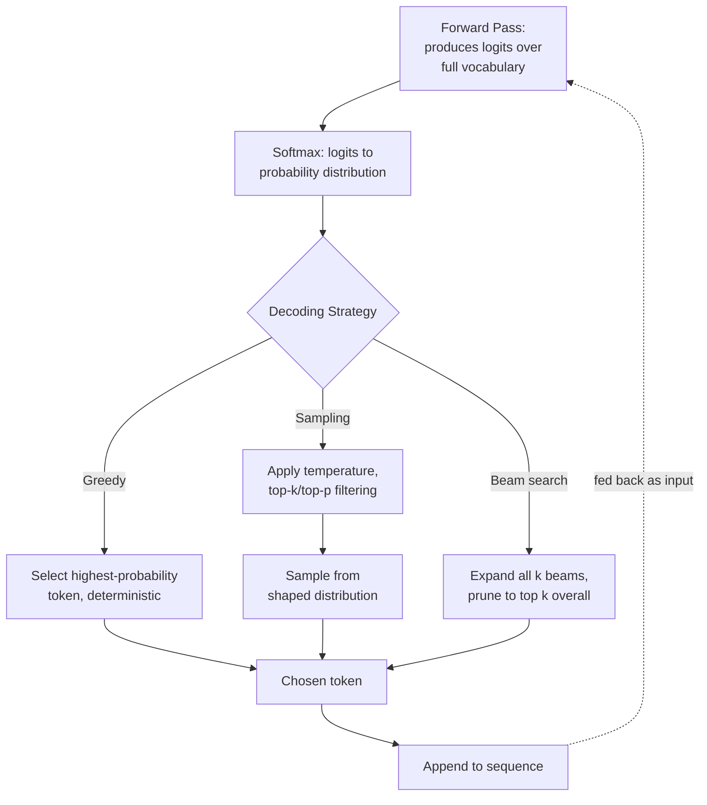
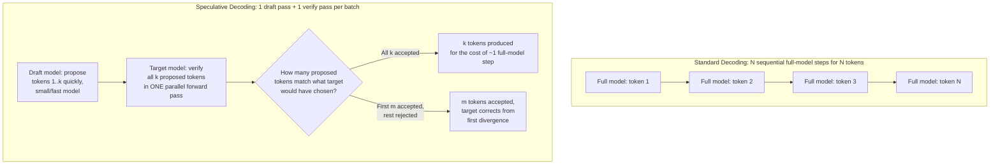
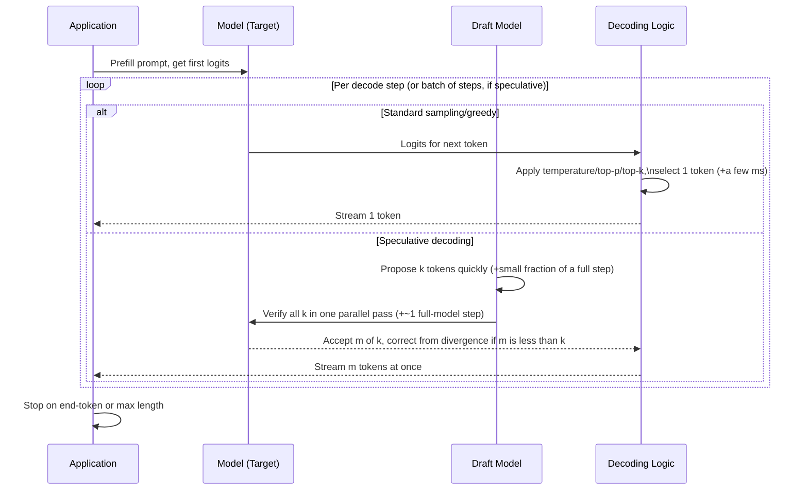
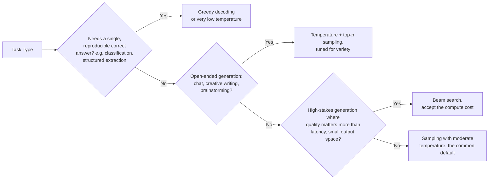
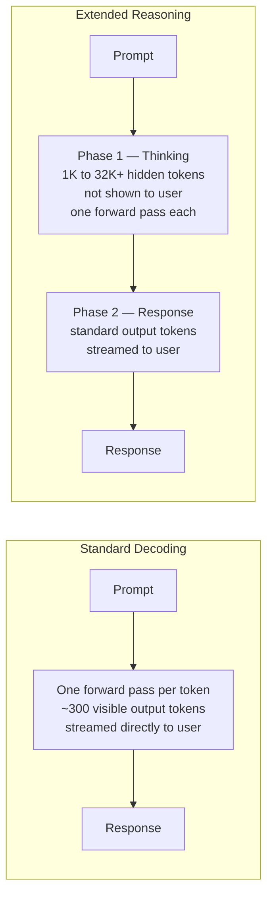
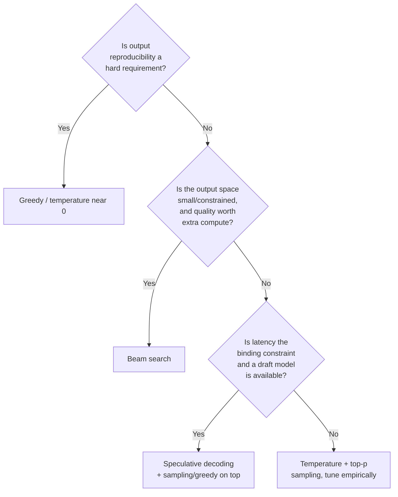

# Decoding & Inference Strategies

## Overview

A forward pass through a transformer ends in a probability distribution over the entire vocabulary — tens of thousands of numbers, one per possible next token. Decoding is the step that turns that distribution into an actual chosen token, and it is a genuinely separate decision from anything the model's weights determine: the same logits, decoded differently, produce a deterministic, repetitive answer; a creative, varied answer; or, with the wrong settings, an incoherent one. Decoding strategy is a product-level lever, not a fixed model property, and it trades off latency, cost, output quality, and output diversity against each other in ways every later chapter on inference takes for granted.

## Definition

**Decoding** (also called sampling or inference strategy) is the algorithm that selects a token from the model's output probability distribution at each generation step, and, in some strategies, manages multiple candidate sequences simultaneously before selecting a final output. The dominant production strategies are **greedy decoding** (always pick the single most probable token), **stochastic sampling** (draw from the distribution, shaped by temperature, top-p, and top-k parameters), **beam search** (track several candidate sequences in parallel and select the overall best), and **speculative decoding** (a latency-oriented technique that proposes multiple tokens at once using a smaller draft model, then verifies them with the full model). None of these change the model's weights or its computed probability distribution — they change what happens *after* that distribution exists.

## Problem Statement

Decoding strategy is one of the most consequential, and most under-examined, configuration choices in a production LLM system:

- **Greedy decoding is deterministic but not "safe" by default.** Always picking the highest-probability token sounds like the conservative choice, but it produces a single fixed path through the distribution that can get stuck in repetitive loops (a known failure mode) and exposes no mechanism for the kind of varied phrasing many products actually want.
- **The same prompt at different temperature settings can pass or fail an evaluation suite differently**, purely from decoding randomness — a quality regression that looks like a model or prompt problem can actually be sampling-parameter drift, and a team that doesn't control or monitor decoding settings has no way to distinguish the two.
- **Beam search's quality gains come at a multiplicative compute cost**, and that cost is easy to underestimate: tracking *k* candidate sequences instead of one multiplies the per-step compute and memory roughly by *k*, for output-quality gains that are real but often smaller than the multiplier suggests, especially for open-ended generation rather than constrained tasks.
- **Speculative decoding changes per-token latency, not output content** — when implemented correctly, it is a pure latency optimization with no quality tradeoff, which makes it one of the few "free" levers in this entire chapter, and exactly why teams that don't already use it are leaving a real, no-downside latency win on the table.
- **Decoding parameters are frequently treated as an afterthought left at provider defaults**, when they are in fact a first-class product decision with measurable, reproducible effects on output character, latency, and cost.

## Why These Strategies Exist

Early autoregressive language models faced an immediate design question the moment a probability distribution came out of the final layer: what do you actually do with it? **Greedy decoding** — always take the argmax — was the obvious first answer, simple and deterministic, but production use quickly surfaced its core weakness: greedy decoding is locally optimal at every step but not globally optimal across a sequence, and it has a well-documented tendency to fall into repetitive loops, since once a repetitive pattern becomes the highest-probability continuation at one step, it tends to remain so at the next.

**Beam search** addressed the local-optimum problem directly by tracking multiple candidate continuations in parallel instead of committing to one token at a time, then selecting whichever full candidate sequence scores best overall — better than greedy at avoiding a single bad early commitment, but at a real, multiplicative compute cost, and still prone to producing bland, generic continuations for open-ended text, since beam search tends to converge on the statistically safest path rather than a genuinely varied one.

**Stochastic sampling** (temperature, top-k, top-p) took a different approach entirely: instead of trying to find one "best" sequence, deliberately introduce controlled randomness, drawing from the actual probability distribution rather than always taking the maximum. This produces the variety and naturalness that became essential once LLMs moved from narrow tasks (machine translation, where one broadly-correct answer suffices) to open-ended generation (chat, creative writing, brainstorming), where a single deterministic "best" answer isn't even a coherent product goal.

**Speculative decoding** emerged from a completely different pressure: decode is sequential and memory-bandwidth-bound (see [Transformer Internals for Systems Engineers](01-transformer-internals-for-systems-engineers.md#prefill-and-decode-a-request-end-to-end)), so generating each token one at a time wastes the GPU's compute capacity, which sits comparatively idle during decode's bandwidth-bound steps. Speculative decoding exploits this idle compute: a small, fast draft model proposes several tokens ahead, and the full model verifies all of them in a single, parallel, compute-bound pass — turning several sequential decode steps into one, without changing what gets generated, as long as verification rejects any speculative token the full model wouldn't have actually chosen.

## Core Concepts

- **Logits** — the raw, unnormalized scores the model outputs for every vocabulary entry at a given step, before any decoding strategy is applied; softmax converts these into a probability distribution.
- **Greedy decoding** — always select the single highest-probability token at each step; fully deterministic, fastest to reason about, prone to repetition loops.
- **Temperature** — a scalar that reshapes the probability distribution before sampling: temperature below 1 sharpens the distribution toward the most likely tokens (more deterministic, less varied); temperature above 1 flattens it (more random, more varied); temperature of exactly 0 is equivalent to greedy decoding.
- **Top-k sampling** — restrict sampling to only the *k* highest-probability tokens at each step, discarding the long tail entirely before drawing a sample.
- **Top-p (nucleus) sampling** — restrict sampling to the smallest set of tokens whose cumulative probability exceeds threshold *p*, an adaptive alternative to a fixed *k* that naturally widens the candidate set when the distribution is flat (uncertain) and narrows it when the distribution is peaked (confident).
- **Beam search** — track *k* candidate sequences ("beams") simultaneously at every step, expanding each by its most promising next tokens and pruning back to the top *k* overall candidates; selects the final highest-scoring complete sequence.
- **Speculative decoding** — a smaller, faster "draft" model proposes several tokens ahead; the full "target" model verifies all proposed tokens in one parallel forward pass, accepting a correctly-predicted prefix and rejecting (and correcting) from the first divergence; output distribution matches what the target model alone would have produced, with materially fewer sequential full-model steps.
- **Repetition / frequency penalties** — explicit downweighting of tokens (or n-grams) already present in the generated output, a complementary, narrower-purpose lever on top of the main decoding strategy, aimed specifically at the repetition-loop failure mode.

## The Decoding Pipeline

Decoding sits at one specific, well-defined point in the request path: after the model produces logits for the current step, before the chosen token is appended and fed back in for the next step.

Speculative decoding restructures this loop entirely, replacing several single-token full-model steps with one batched verification step against a cheaper model's guesses.

## The Decoding Knobs

| Component | Responsibility | Does NOT own |
|---|---|---|
| Logits/softmax computation | Convert the model's raw output into a probability distribution over the vocabulary | Any decision about which token to actually pick |
| Sampling shaper (temperature, top-k, top-p) | Reshape or restrict the distribution before a token is drawn | The underlying probabilities themselves — these are filters/transforms applied on top |
| Beam manager | Track, expand, and prune multiple candidate sequences across steps | Per-step token probabilities (consumes them, doesn't compute them) |
| Draft model (speculative decoding) | Propose several candidate next tokens quickly and cheaply | Final acceptance — verification is the target model's job |
| Target model (speculative decoding) | Verify proposed tokens in one parallel pass; accept a correct prefix, correct from the first divergence | Proposing tokens itself in this mode — that's the draft model's role |
| Repetition penalty logic | Downweight already-generated tokens/n-grams as a targeted anti-repetition measure | Overall strategy choice — this is typically layered on top of greedy or sampling, not a strategy by itself |

## A Streamed Response Step by Step

A single streamed response makes the decoding loop's per-token cadence directly visible — each iteration of this loop is one decode step, and the strategy chosen determines both what happens inside the loop and, for speculative decoding, how many tokens the loop actually advances by per full-model invocation.

The practical consequence: under standard sampling or greedy decoding, perceived streaming speed is bound by one full-model forward pass per token; under well-tuned speculative decoding with a good draft-acceptance rate, the same perceived stream can advance by several tokens per full-model pass, directly cutting wall-clock decode time without changing what's generated — the deeper mechanics and acceptance-rate economics are covered in [Speculative Decoding at Scale](../17-distributed-inference/03-speculative-decoding-at-scale.md).

## Task-Routed Decoding Configuration

Production systems don't pick one decoding strategy globally — they route decoding configuration by task type, since the right choice is a function of what the output is for, not a fixed property of the model or the product.

1. **Task-routed decoding configuration** — a single product surface routes different request types (a structured data-extraction call vs. a conversational reply) through different decoding settings, rather than applying one global default everywhere.
2. **Low-temperature or greedy decoding for anything requiring reproducibility** — function calling, structured output, and classification-style generation typically default toward greedy or near-zero temperature, since variability here is a bug, not a feature (see [Structured Output & Grammars](../03-prompt-architecture/03-structured-output-and-grammars.md)).
3. **Sampling with tuned temperature and top-p for conversational and creative surfaces** — the overwhelming majority of consumer-facing chat products use this pattern, with temperature as one of the few user-tunable "personality" knobs some products expose directly.
4. **Speculative decoding layered underneath any of the above, transparently** — because it preserves the target model's output distribution exactly, it is a serving-infrastructure optimization that composes with whatever decoding strategy and parameters the product layer has chosen, not a separate, competing choice.

## Constrained and Structured Generation

Standard sampling selects from the full vocabulary at each step. **Constrained decoding** narrows the valid next-token set to only those tokens consistent with a target schema — a JSON object, a grammar, a fixed list of labels — guaranteeing structurally valid output without post-processing retries.

**Why this matters at the systems level:**

Unstructured LLM output that is then parsed downstream introduces a failure mode: the model generates text that looks like valid JSON but isn't (missing a closing brace, an extra comma, a truncated string), and the parser fails. Naive solutions — retry on parse failure, or use a "JSON fixer" model — add latency and cost. Constrained decoding eliminates the failure mode at the source.

**How it works:**

At each decode step, the decoding engine intersects the model's logit distribution with a **mask** of tokens that are currently valid according to the schema. Tokens that would produce an invalid partial structure (e.g., a non-numeric character when a number is expected) have their logits set to negative infinity before sampling, making them impossible to select. The mask is updated after each token, tracking position in the schema's parse state.

Libraries implementing this: **Outlines** (most widely used, grammar-based), **LMFE** (structured output with Pydantic), **Guidance** (handlebars-style templates), **XGrammar** (efficient grammar-constrained decoding). Several serving engines (vLLM, llama.cpp) integrate grammar-based constrained decoding natively.

**The tradeoff:** Constrained decoding imposes a small (~5–20%) throughput overhead per token — the mask computation runs on CPU alongside GPU decoding. For high-throughput batch workloads generating structured output at scale, this overhead is worth measuring explicitly.

**When to use each approach:**

| Output type | Recommended approach |
|---|---|
| JSON with known schema | Grammar-constrained decoding (Outlines, LMFE) or JSON mode API |
| Function/tool call selection | Native function-calling API (provider-side constrained) |
| Fixed label from a list | Constrained decoding to the label token set; or greedy at temp=0 with output validation |
| Free text with structure hints | System-prompt engineering; constrained decoding adds overhead without benefit |
| Deeply nested or recursive schemas | Grammar-based (context-free grammar); simple regex patterns miss recursive nesting |

**Provider-side JSON mode vs client-side constrained decoding:**

Most frontier model APIs now expose a `response_format: { type: "json_object" }` parameter (OpenAI, Anthropic) or function calling — these are provider-implemented constrained decoding with no client overhead. For self-hosted models, client-side libraries are required. The output quality is equivalent; prefer the native API option when available to avoid the serving-side overhead.

## Inference-Time Compute Scaling: Extended Reasoning

Standard decoding has a fixed compute budget per token — one forward pass, one token out. **Extended reasoning** breaks this: models like o1, o3, DeepSeek-R1, and Claude Extended Thinking generate thousands of internal "thinking" tokens before producing any visible output, spending compute on chain-of-thought exploration rather than emitting an answer immediately.

**The systems implications are material, not cosmetic:**

- **Latency profile inverts.** In standard decoding, time-to-first-token is fast (one prefill pass) and the user sees tokens arriving immediately. In extended reasoning, there is a silent thinking phase running 30–300 seconds before the first visible word. Streaming thinking tokens — as some APIs now expose — improves perceived responsiveness but does not reduce wall-clock time.
- **Token volume multiplies by 10–100×.** A response producing 500 output tokens in standard mode may require 8,000 thinking tokens + 500 response tokens in reasoning mode — a 17× token count for the same user-visible answer. At reasoning-model API pricing (typically 3–10× the base rate), the cost per query can be 30–1,000× more than the cheapest small model on the same task.
- **KV cache pressure spikes.** Thinking tokens require KV cache entries exactly like any other tokens. A 32K-token thinking budget consumes roughly 32× the KV cache of a standard 1K-token response. A single reasoning request can saturate the KV cache that would otherwise serve 30+ standard requests concurrently.
- **Thinking budget is a new capacity-planning input.** Most reasoning APIs expose a `max_thinking_tokens` parameter. Sizing without measuring actual thinking-token utilization from real traffic — not just the maximum budget — produces severely under-capacity estimates. Actual utilization commonly runs 30–60% of the budget ceiling on average, but p95 can hit the ceiling, and that's what drives your KV cache and GPU saturation events.

**When extended reasoning is worth the cost:**

Route tasks to a reasoning model only after measuring that a cheaper model's output on that task class is insufficient. Reasoning models dominate on multi-step math, complex code generation, and adversarial logical reasoning; they rarely improve factual lookup, summarization, or conversational response — and the cost premium is unjustifiable for those. The production pattern: run the standard model, route to the reasoning model only on inputs that trigger a measured confidence failure or complexity threshold, and track the fraction of real traffic that actually requires that routing, since it directly sets your reasoning-path cost line.

## Tradeoffs

The core decision is rarely "which algorithm" in the abstract — it's "how much does this specific task need reproducibility versus variety, and how much compute is the quality gain actually worth."

| Strategy | Latency/cost profile | Output character |
|---|---|---|
| Greedy | Cheapest per token; fully sequential, no extra compute | Deterministic, reproducible, prone to repetition loops on long generations |
| Temperature/top-p/top-k sampling | Same per-token cost as greedy — the shaping step is computationally negligible | Varied, natural; quality and coherence sensitive to parameter tuning, not guaranteed by default settings |
| Beam search (beam width *k*) | Roughly *k*x the per-step compute and memory of greedy | Generally higher-quality for constrained tasks; tends toward generic, "safe" output for open-ended generation |
| Speculative decoding | Adds a small draft-model cost per step, but cuts the number of required full-model sequential steps — net latency win when draft-acceptance rate is reasonably high | Output distribution unchanged from the underlying strategy it wraps (no quality tradeoff, by design) |

## Scalability

- **Decoding cost per token does not scale with batch size the way model compute does** — sampling and greedy selection are cheap, near-constant-time operations relative to the forward pass itself; they almost never become the bottleneck at scale, decode latency is dominated by the forward pass, not by the decoding logic layered on top of it.
- **Beam search's compute multiplier compounds with concurrency.** At beam width *k*, serving the same request volume requires roughly *k*x the aggregate decode compute and KV cache memory of greedy or sampled decoding for those requests — at meaningful production scale, this is rarely worth it outside narrow, quality-critical, latency-tolerant use cases (e.g., certain translation or structured-generation pipelines), which is why most consumer-facing LLM products use sampling, not beam search.
- **Speculative decoding's benefit scales with draft-model acceptance rate, not request volume directly** — a draft model well-matched to the target model's distribution for a given workload yields a consistent per-request latency win regardless of scale; a poorly-matched draft model (low acceptance rate) yields little benefit and wastes the draft pass's compute, making draft-model selection and monitoring a per-workload tuning problem, not a one-time setup (full treatment: [Speculative Decoding at Scale](../17-distributed-inference/03-speculative-decoding-at-scale.md)).
- **Decoding parameter consistency matters more at scale than it seems at small scale** — at low volume, sampling variance averages out and is barely noticed; at high volume, an un-pinned or inconsistently-applied temperature setting becomes a measurable, aggregate source of eval-score noise and unpredictable cost (longer or shorter generations) across the full traffic distribution.

## Reliability

| Failure | Cause | Degradation strategy |
|---|---|---|
| Repetitive, looping output | Greedy decoding (or very low temperature) on a long generation, falling into a locally-stable repetitive pattern | Apply a repetition penalty as a targeted fix; for open-ended tasks, prefer sampling over pure greedy |
| Incoherent or nonsensical output | Temperature set too high, or top-k/top-p configured too permissively, sampling too far into the distribution's low-probability tail | Cap temperature and top-p within validated ranges per task type; treat decoding parameters as configuration requiring the same review rigor as a prompt change |
| Eval score regression with no prompt or model change | Decoding parameters changed (deliberately or by a default-value drift in an upgraded client library) | Pin and version decoding parameters alongside prompts and model versions; treat a parameter change as a gated, evaluated deploy |
| Speculative decoding silently degrading quality | A bug in verification logic that accepts a token the target model would not have chosen | Verification correctness needs the same testing rigor as any other serving-path correctness property — speculative decoding's entire value proposition depends on output-distribution equivalence holding exactly |
| Beam search producing degenerate, overly generic output | Beam search's tendency to converge on the statistically safest, blandest continuation for open-ended tasks | Reserve beam search for genuinely constrained tasks; use sampling for open-ended generation regardless of available compute budget |

## Security

Decoding strategy has a narrower security surface than other layers in this book, but two points are worth naming directly:

- **Decoding randomness is not a security boundary.** Relying on sampling variability to make harmful outputs merely "less likely" rather than actually blocked is not a safety control — guardrails and content filtering (see [Guardrails & Content Safety](../21-ai-security/04-guardrails-and-content-safety.md)) must operate on actual output, independent of which decoding strategy or parameters produced it.
- **Beam search and speculative decoding both increase per-request internal compute work (multiple candidates, or a draft-plus-verify pass) for the same user-visible output** — a resource-exhaustion consideration worth folding into the same capacity and abuse-prevention thinking as context-length limits (see [Transformer Internals for Systems Engineers](01-transformer-internals-for-systems-engineers.md#security)), since these strategies change the real compute cost of a request beyond what its token count alone would predict.

## Cost Optimization

- **Speculative decoding is close to a free latency win when a good draft model exists** — it doesn't change output content or typically increase total cost meaningfully (the draft pass is cheap relative to the full-model steps it replaces), making it one of the few decoding-layer levers worth adopting by default rather than evaluating case by case.
- **Avoid beam search at production scale unless the task specifically justifies it** — the *k*x compute multiplier is a real, ongoing cost for marginal quality gains on most open-ended tasks; reserve it for narrow, quality-critical, lower-volume use cases where the gain is measured and justified.
- **Tune temperature and top-p for output length, not just quality** — higher-temperature sampling can produce longer, more rambling completions on some tasks, which directly costs more in output tokens; a parameter tuned purely for "creativity" without checking its effect on output length can silently inflate cost.
- **Cap maximum generation length explicitly per task**, independent of decoding strategy, since a repetition loop or runaway generation under any strategy is bounded in actual harm only by an enforced output-length ceiling.

## Monitoring

- **Repetition rate / degenerate-output rate**, sampled from production traffic — a leading indicator that decoding parameters need adjustment for a given task or model version.
- **Output length distribution, segmented by decoding configuration** — catches a temperature or top-p change (deliberate or accidental) that's silently inflating generation length and cost.
- **Decoding parameter values actually sent per request, logged and versioned** — without this, an eval regression investigation has no way to rule out (or confirm) decoding drift as the cause.
- **Speculative decoding acceptance rate**, if in use — the direct signal for whether the draft model is well-matched to current traffic, and the leading indicator for when a draft model needs retraining or replacement as the target model or workload shifts.
- **Latency improvement attributable to speculative decoding**, tracked as its own metric — confirms the technique is delivering its intended benefit in production, not just in benchmark conditions.

## Production Best Practices

- **Treat decoding parameters as versioned configuration**, reviewed and gated the same way a prompt or model change is — not a runtime default left untracked.
- **Route decoding strategy by task type explicitly** — greedy/low-temperature for anything requiring reproducibility, tuned sampling for open-ended generation, rather than one global setting for every product surface.
- **Default to speculative decoding wherever a viable draft model exists**, given its near-zero quality tradeoff and real latency upside.
- **Avoid beam search outside narrow, justified, lower-volume use cases**, given its compute multiplier at production scale.
- **Set and enforce a maximum generation length per task**, independent of decoding strategy, as a hard backstop against repetition loops or runaway output.
- **Validate any decoding parameter change against an eval suite before rollout**, the same gate applied to a prompt or model version change, since decoding parameters measurably affect eval outcomes.

## Real World Examples

The following reflect publicly documented patterns and widely discussed industry practice, not confirmed internal configuration of any specific product.

- **OpenAI's and Anthropic's public APIs** both expose temperature and top-p as direct, documented request parameters, with documented defaults — a direct, product-level acknowledgment that decoding strategy is a tunable surface for API consumers, not a fixed internal detail.
- **Code-completion products** (the category GitHub Copilot and similar tools occupy) are widely understood to favor low-temperature or near-greedy decoding for inline suggestions, prioritizing the kind of predictable, low-variance completions that match a single, specific coding context, over the open-ended variety appropriate for conversational products.
- **Speculative decoding** has been publicly described in research from multiple major labs (including Google's and DeepMind's published work on the technique) and is implemented in open-source serving engines like vLLM and others discussed in [Speculative Decoding at Scale](../17-distributed-inference/03-speculative-decoding-at-scale.md) — it has moved from a research technique to a standard production serving-engine feature within a few years of its initial publication.
- **Structured-output and function-calling features** across major providers are widely documented to recommend or default toward low-temperature decoding, since reproducibility and schema-validity matter more than phrasing variety for these use cases — a direct, publicly visible instance of task-routed decoding configuration.

## Interview Questions

### Beginner

**Q: What does "temperature" actually do during text generation?**
It reshapes the probability distribution the model outputs before a token is sampled. A temperature below 1 sharpens the distribution toward the already-most-likely tokens, making output more deterministic and repetitive; a temperature above 1 flattens it, making lower-probability tokens relatively more likely to be picked, producing more varied (and, past a point, less coherent) output. Temperature 0 is equivalent to greedy decoding — always pick the single highest-probability token.

**Q: Why might greedy decoding produce worse output than sampling, even though it always picks the "best" token at each step?**
Greedy decoding is only locally optimal — it picks the single best next token at each step with no regard for how that choice affects the rest of the sequence, and it has a well-known tendency to fall into repetitive loops, since once a repeated phrase becomes locally highest-probability, it tends to stay that way. Picking the "best" token every single time doesn't guarantee the best overall sequence, and for open-ended generation it isn't even clear that one deterministic "best" sequence is the right product goal.

### Intermediate

**Q: What's the difference between top-k and top-p sampling, and why would you prefer one over the other?**
Top-k restricts sampling to a fixed number of the highest-probability tokens, regardless of how the probability mass is actually distributed among them. Top-p (nucleus sampling) instead includes however many tokens are needed to reach a cumulative probability threshold, which adapts to the shape of the distribution — when the model is very confident (probability concentrated on a few tokens), the effective candidate set shrinks automatically; when it's uncertain (probability spread thin), the set widens. Top-p is generally preferred because it doesn't require guessing a good fixed *k* that works well across both confident and uncertain generation steps.

**Q: Why is speculative decoding described as a "free" latency win with no quality tradeoff, when it sounds like it's introducing an extra model into the pipeline?**
Because of how verification works: the small draft model's proposed tokens are only ever *accepted* if the full target model would have generated the same token anyway — verification compares the draft's proposals against the target model's actual distribution in one parallel pass, and rejects (and corrects) anything that doesn't match. The final output is mathematically equivalent to what the target model alone, decoding token by token, would have produced. The "free" part is that this verification happens in one parallel forward pass instead of several sequential ones, exploiting compute capacity that decode's memory-bandwidth-bound steps otherwise leave idle.

### Senior

**Q: An eval suite shows a quality regression after a routine model client library upgrade, with no prompt or model changes. What's an under-checked cause specific to this chapter?**
Decoding parameter defaults. Client libraries and SDKs sometimes change their default temperature, top-p, or other sampling parameters between versions, and if a team relies on library defaults rather than explicitly pinning decoding parameters, an otherwise-routine dependency upgrade can silently change generation behavior. The fix is treating decoding parameters as explicit, versioned configuration — never left to whatever a dependency's current default happens to be — and checking exactly this when an eval regression appears with no other explanation.

**Q: When would beam search actually be the right production choice despite its compute cost, and what tells you it's not worth it for a given task?**
It's justified for constrained-output tasks where small differences in sequence-level quality matter and the output space is narrow enough that beam search's tendency toward "safe, generic" output isn't a liability — certain structured translation or summarization tasks with a fairly bounded correct-answer space are plausible candidates. It's not worth it when the task is genuinely open-ended (chat, creative writing), where beam search's bias toward the statistically safest continuation actively works against the variety the product needs, or when request volume is high enough that the *k*x compute multiplier becomes a material, ongoing cost for a quality gain that hasn't been measured to justify it.

### Staff

**Q: Design the decoding configuration strategy for a multi-surface product: a chat assistant, a structured data-extraction API, and a code-completion feature, all built on the same underlying model. What differs, and what's shared?**
Each surface gets its own decoding configuration, routed by task type rather than sharing one global default: the chat assistant uses tuned temperature and top-p sampling for natural variety; the data-extraction API uses greedy or near-zero temperature, since reproducibility and schema validity matter far more than phrasing variety and any randomness here is a bug; code completion uses low-temperature decoding favoring predictable, contextually-likely completions, plus likely a tighter maximum generation length given the latency sensitivity of inline suggestions. What's shared across all three is the operational discipline: every surface's decoding parameters are versioned, gated by eval before any change ships, and monitored for output-length and repetition-rate drift — and speculative decoding, if a suitable draft model exists, can be layered underneath all three transparently, since it changes none of their output distributions.

**Q: A production incident traces back to a repetition loop in long-form generation that a recent eval suite didn't catch. How do you both fix the immediate issue and prevent this class of regression going forward?**
Immediate fix: apply or tighten a repetition penalty for the affected task, and/or shift away from near-greedy decoding toward sampling if the task tolerates it, plus enforce a hard maximum generation length as a backstop regardless of root cause. The deeper gap is in the eval suite: if it didn't catch a repetition-loop failure mode, it likely tests primarily on short-to-moderate generations where this failure mode is less likely to manifest — the fix is adding long-form generation cases specifically designed to surface repetition behavior (e.g., open-ended prompts with no natural stopping point) to the regression suite, since this failure mode is a known, well-documented risk of greedy and low-temperature decoding on long generations and should be tested for deliberately, not discovered in production.

## Google-Level Follow-Ups

- "If decoding strategy doesn't change the model's weights or its computed logits, why does it matter enough to be its own chapter rather than a minor configuration footnote?" — probes for articulating that decoding is the step that actually determines user-visible output character, reproducibility, latency (via speculative decoding), and cost (via output length) — a genuinely independent axis of system design, not a footnote to model selection.
- "Could you build a product where decoding strategy is chosen dynamically, per-request, by the model itself or by another model? What would that buy you, and what's the risk?" — probes for recognizing this is plausible (e.g., a router classifying whether a request needs reproducibility vs. variety before generation) and that the risk is an added latency/complexity cost and a new failure surface (the router being wrong) for a benefit that's only worth it if task types are genuinely heterogeneous and hard to route by simpler signals upfront.
- "Speculative decoding requires a draft model 'well-matched' to the target model. What does 'well-matched' actually mean, and how would you measure it without running full production traffic through it first?" — probes for understanding draft-acceptance rate as the core metric, and for proposing offline measurement against a representative sample of real or realistic prompts before full rollout, rather than assuming any smaller model from the same family is automatically well-matched.
- "How would your decoding strategy recommendations change for a model architecture fundamentally different from current autoregressive transformers — for instance, a diffusion-based text model that generates all tokens jointly rather than one at a time?" — probes for recognizing that most of this chapter's vocabulary (greedy, temperature, beam search, speculative decoding) is specifically shaped by autoregressive, one-token-at-a-time generation, and a genuinely different generation paradigm would need its own decoding theory, not a direct port of these concepts.

## Common Mistakes

- **Leaving decoding parameters at whatever a client library or SDK defaults to**, rather than explicitly pinning and versioning them, risking silent behavior drift on a routine dependency upgrade.
- **Using one global decoding configuration across genuinely different task types** (reproducible structured output vs. open-ended chat) instead of routing configuration by task.
- **Reaching for beam search at production scale by default**, without measuring whether its compute multiplier is actually justified by a meaningful quality gain for the specific task.
- **Treating decoding randomness as a safety or content-filtering mechanism**, rather than recognizing that guardrails must operate on actual output regardless of decoding strategy.
- **Tuning temperature purely for subjective "creativity" without checking its effect on output length and therefore cost.**
- **Not testing for repetition-loop failure modes in eval suites**, despite this being a well-known, specifically-triggerable failure mode of greedy and low-temperature decoding on long generations.

## Key Takeaways

- Decoding is a separate, product-level decision layered on top of the model's computed probability distribution — the same logits decoded differently produce meaningfully different output character, latency, and cost.
- Greedy decoding is deterministic and cheap but prone to repetition loops; sampling (temperature, top-k, top-p) trades determinism for variety and is the default for open-ended generation; beam search improves sequence-level quality at a real, multiplicative compute cost best reserved for constrained tasks.
- Speculative decoding is close to a free latency win: a small draft model proposes tokens, the full model verifies them in one parallel pass, and the output distribution is mathematically unchanged from standard decoding — a serving optimization, not a quality tradeoff.
- Production systems should route decoding configuration by task type — greedy/low-temperature for reproducibility-sensitive tasks, tuned sampling for open-ended generation — rather than applying one global default everywhere.
- Decoding parameters need the same versioning, gating, and monitoring discipline as prompts and model versions, since they measurably affect eval outcomes, output length (and therefore cost), and can drift silently through dependency upgrades.
- Decoding strategy is not a safety boundary — content guardrails must operate on actual output regardless of which strategy or parameters produced it.
- This chapter's speculative decoding concept gets its full latency-economics treatment in [Speculative Decoding at Scale](../17-distributed-inference/03-speculative-decoding-at-scale.md); its task-routing implications connect directly to [Structured Output & Grammars](../03-prompt-architecture/03-structured-output-and-grammars.md) and [Prompt Engineering as Systems Design](../03-prompt-architecture/01-prompt-engineering-as-systems-design.md).

---

*Part of [LLM Architecture](index.md) in the [AI System Design Notes](../index.md). Tracked in [BACKLOG.md](https://github.com/GyanendraChaubey/AI-System-Design-Notes/blob/main/BACKLOG.md).*
