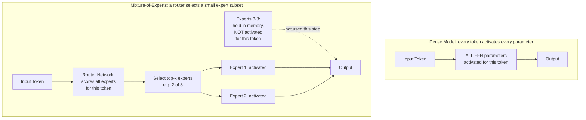
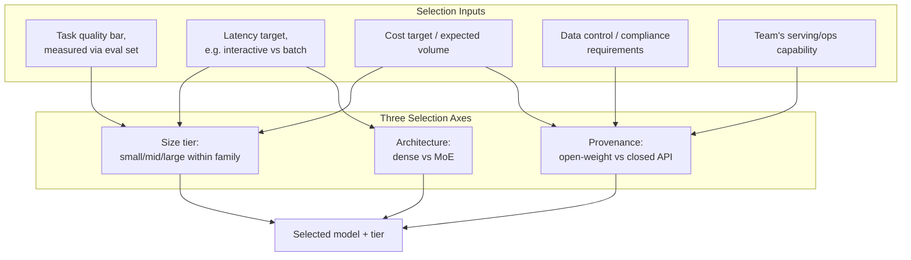
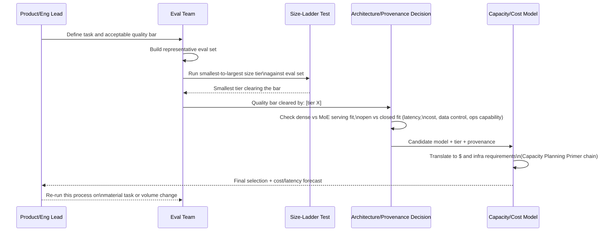
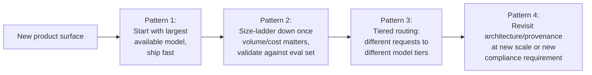
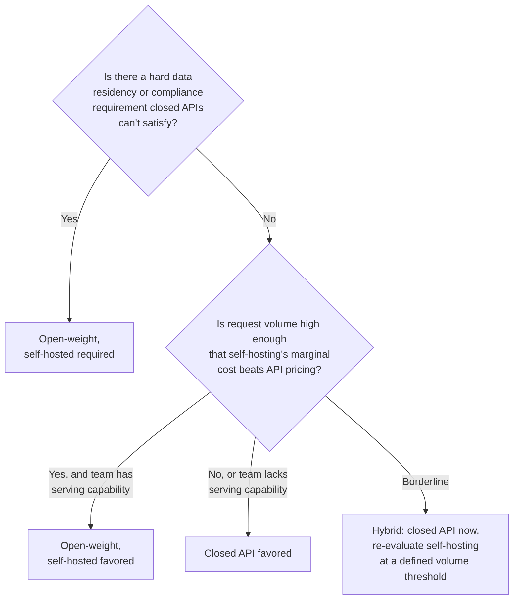

# Model Families & Selection

## Overview

Every chapter in this section has been building toward one practical question: given a target latency, cost, and quality bar, which model actually fits? This chapter is the decision layer on top of the architecture knowledge already covered — dense versus Mixture-of-Experts (MoE), open-weight versus closed/API models, and where a smaller, cheaper model genuinely suffices instead of reflexively reaching for the largest available option. None of this requires re-deriving transformer internals; it requires turning what those internals imply about cost and latency into a repeatable selection framework.

## Definition

**Model selection** is the process of choosing a specific model — and, almost as consequentially, a specific *size tier* within that model's family — to serve a given product surface, based on an explicit target for latency, cost, and quality rather than defaulting to whichever model is newest, largest, or most discussed. The decision spans two largely independent axes covered in this chapter: **architecture** (dense, where every parameter activates on every token, versus Mixture-of-Experts, where a router activates only a subset of a much larger total parameter count per token) and **provenance** (open-weight models you self-host versus closed models accessed via API) — and a third, cross-cutting axis, **size**, which interacts with both.

## Problem Statement

Model selection is frequently made by default rather than by decision, and that default is expensive in predictable ways:

- **"Use the best available model" is not a strategy, it's an unbounded cost and latency commitment.** Every product surface has a different actual quality bar; routing every request — including simple ones — through the largest, most expensive model in a lineup is the single most common, most avoidable cost mistake in production LLM systems.
- **Dense and MoE models of similar quality can have wildly different serving economics**, and parameter count alone doesn't tell you which: an MoE model's much larger total parameter count says little about its per-token compute cost, while its memory footprint is closer to that total count than to its activated-per-token subset — getting this backward leads to either under-provisioning compute or over-provisioning memory.
- **Open-weight versus closed/API is a build-vs-buy decision with the same structure (and the same failure modes) as any other build-vs-buy call** — teams that don't recognize it as such tend to either self-host out of a vague preference for control, absorbing real operational burden without a clear payoff, or default to an API out of convenience, missing a genuine cost or data-control case for self-hosting at sufficient scale.
- **Model-size ladders exist specifically so smaller models can be tried first**, and skipping that step — assuming only the largest model can do the job, without testing — routinely leaves a 3-10x cost reduction unclaimed for tasks a smaller model would have handled at an acceptable quality bar all along.

## Why This Framework Exists

For the first several years of production LLM deployment, model selection was simple by necessity: there were few model families, a narrow range of sizes, and essentially one provenance option (a closed API, since few large open-weight models existed at competitive quality). The selection "decision" was close to a non-decision.

That changed along two independent axes simultaneously. First, **architecture diversified**: Mixture-of-Experts moved from a research technique to a production default for several major model families, specifically because it decouples a model's total knowledge capacity (total parameters) from its per-token serving cost (active parameters) — letting a model be "large" in capability without paying dense-model serving costs for every token, at the cost of a much larger total memory footprint that must still be held, in full, in GPU memory. Second, **provenance diversified**: open-weight model families reached quality parity with closed models for a meaningful range of tasks, turning "self-host or call an API" from a hypothetical into a live, recurring engineering decision with real total-cost-of-ownership tradeoffs on both sides.

The result is a selection space with enough genuine dimensions — architecture, provenance, size, and the specific quality bar of the task at hand — that picking "the best model" stopped being a one-axis decision and became a multi-variable optimization most teams under-invest in compared to how much it actually costs them. This chapter exists to make that optimization explicit and repeatable, the same way [Capacity Planning Primer](../01-fundamentals/04-capacity-planning-primer.md) made infrastructure sizing explicit and repeatable instead of left to instinct.

## Core Concepts

- **Dense model** — every parameter activates on every token processed; parameter count, FLOPs per token, and memory footprint move together, making cost reasoning straightforward but offering no way to decouple "total capability" from "per-token cost."
- **Mixture-of-Experts (MoE)** — a router network selects a small subset of "expert" sub-networks (commonly 2 of 8, or similar ratios) to activate per token, out of a much larger total set; FLOPs per token resemble a much smaller dense model's, while total memory footprint resembles the full, much larger parameter count, since every expert must be held in memory regardless of how often it's actually used by a given batch.
- **Active vs. total parameters** — the two numbers that diverge in MoE and converge in dense models; quoting "parameter count" without specifying which one is a common source of miscommunication between a model's marketed capability and its real serving cost.
- **Open-weight model** — model weights are downloadable and can be self-hosted on infrastructure you control, at the cost of taking on serving, scaling, and security operations yourself.
- **Closed / API model** — accessed only through a provider's hosted API; serving infrastructure, scaling, and most security operations are the provider's responsibility, at the cost of per-token pricing, rate limits, and data leaving your infrastructure boundary.
- **Model-size ladder** — the range of sizes a single model family typically ships (e.g., a small/fast tier, a mid tier, and a large/frontier tier), letting a team test whether a cheaper, smaller tier clears the task's actual quality bar before committing to a larger, pricier one.
- **Quality bar** — the task-specific, measured threshold a model must clear to be acceptable for a given product surface, established via an eval set (see [LLM Evaluation Architecture](../19-evaluation/01-llm-evaluation-architecture.md)) — the number every selection decision in this chapter should ultimately be checked against, rather than a subjective impression of "good enough."

## Dense vs MoE and the Selection Inputs

Dense and MoE architectures diverge at exactly one point — how many of a layer's parameters are involved in processing a given token — and that single difference is the entire reason their serving economics diverge so sharply.

The detailed view shows where the selection decision tree actually operates: not on the model's internals directly, but on the inputs a team controls — task quality bar, latency/cost target, and data-control requirements — flowing into a choice across all three axes simultaneously.

## What Drives the Selection Decision

| Component | Responsibility | Does NOT own |
|---|---|---|
| Eval set / quality bar | Define and measure what "acceptable" means for a specific task | The selection decision itself — it's the input the decision is checked against |
| Model-size ladder testing | Empirically determine the smallest size tier that clears the quality bar | Architecture or provenance choice — orthogonal axes |
| Architecture decision (dense vs. MoE) | Determine the per-token compute vs. total-memory tradeoff for serving | Provenance — a model family can be open or closed regardless of its architecture |
| Provenance decision (open vs. closed) | Determine who operates serving infrastructure and where data flows | Model quality — both options span a wide quality range, this is a build-vs-buy axis, not a capability axis |
| Capacity/cost modeling ([Capacity Planning Primer](../01-fundamentals/04-capacity-planning-primer.md)) | Translate a selected model and tier into concrete $ and infrastructure requirements | The selection decision — it validates a candidate choice, doesn't make it |

## The Model Selection Process

Model selection isn't a runtime request, but the same staged, falsifiable-assumption discipline used elsewhere in this book applies directly — a sequence of decisions, each producing a concrete artifact the next step consumes.

The step worth never skipping is the size-ladder test before the architecture/provenance decision — testing whether a smaller tier clears the bar *before* deciding how to serve it avoids over-committing infrastructure or API spend to a size tier the task never actually needed.

## How Production Teams Apply This

Three recurring patterns show up across how production teams actually apply this framework, in roughly the order of selection sophistication a team adopts as the product and its traffic mature.

1. **Start large, ship fast.** Early-stage products reasonably default to the most capable available model to validate product-market fit before investing in selection rigor — appropriate as a deliberate first step, not appropriate as a permanent state once real volume exists.
2. **Size-ladder down once volume or cost matters.** Run the smallest-to-largest tier test against a real eval set and move to the cheapest tier that clears the bar — this single step is routinely the highest-leverage cost optimization available, often a 3-10x cost reduction with no measured quality loss.
3. **Tiered routing by request complexity.** Rather than one model for the entire product, route simple requests to a small/fast tier and complex or high-stakes requests to a larger tier, using a cheap classifier or heuristic ahead of the expensive model call (see [Multi-Model Serving & Routing](../15-model-serving/05-multi-model-serving-and-routing.md)).
4. **Revisit architecture and provenance at inflection points**, not on a fixed schedule — a self-hosting decision that didn't make sense at low volume can make sense after 10x growth; a closed-API decision that made sense pre-compliance-requirement can become disqualified by a new data-residency rule (see [Build vs. Buy](../23-staff-level-architecture/02-build-vs-buy.md) and [Open Source vs Closed Models](../23-staff-level-architecture/03-open-source-vs-closed-models.md)).

## Reasoning Models: A Fourth Dimension

Dense versus MoE, and open-weight versus closed API, are orthogonal to a third axis that now shapes model selection in production: **whether the model uses inference-time compute scaling** — generating an extended internal reasoning trace before producing any visible output.

| Selection axis | What it controls |
|---|---|
| Dense vs MoE | Per-token compute cost vs total-parameter memory footprint |
| Open-weight vs closed API | Who operates serving infra, data control, customisation depth |
| Size tier | Quality ceiling and per-token cost within a family |
| Standard vs reasoning | Token volume and wall-clock time per user-visible response |

**What reasoning models are and when they matter:**

Models in the o1/o3/o4-mini, DeepSeek-R1, QwQ, and Gemini Thinking families generate a hidden scratchpad — hundreds to tens of thousands of tokens of intermediate chain-of-thought — before emitting a final answer. The thinking trace is usually not shown to the user but is priced and metered the same as output tokens. On complex multi-step tasks (hard math, adversarial logic, long-horizon code generation), reasoning models outperform standard models of the same parameter count by wide margins. On factual retrieval, summarisation, and conversational response, they typically match or only marginally exceed standard models, at 10–100× the token cost and 10–60× the latency.

**Serving implications that distinguish reasoning models from standard models:**

- **Unpredictable output length at the tail.** Standard models produce roughly bounded outputs for a given task type. Reasoning models can generate 500 or 30,000 thinking tokens for inputs that look identical from the outside, depending on problem difficulty. Sizing from averages is dangerous; p95/p99 thinking-token distributions from real traffic are required.
- **Separate rate limits on reasoning endpoints.** Provider rate limits for reasoning models (e.g., `o3`, `deepseek-reasoner`) are almost always lower than for standard endpoints, reflecting higher per-request compute cost. Don't assume your existing tokens-per-minute ceiling applies.
- **Time-to-first-visible-token is a UX constraint, not a serving optimisation.** A 60-second thinking phase before the first word appears is a product decision — some APIs stream thinking tokens as activity feedback without reducing actual compute time.
- **Budget-capping limits tail variance.** Most reasoning APIs expose a `max_thinking_tokens` parameter. Setting an explicit budget converts an unbounded latency and cost tail into a predictable ceiling; without it, a single complex query can run minutes and dominate your GPU or API spend for that request slot.

**Selection rule:** Measure before routing. Run a standard model on a representative sample of the task; if it clears the quality bar, reasoning models add cost and latency for no measured benefit. If the standard model genuinely fails on a class of inputs, route exactly those inputs to the reasoning model, quantify the quality uplift, and track the fraction of real traffic hitting that routing path — it directly sets your reasoning-path cost line.

## Vision-Language and Multimodal Model Families

Vision-language models (VLMs) combine a text transformer with a vision encoder, processing images and text in a unified context window. This is no longer a niche capability: GPT-4o, Claude 3/3.5/3.7, Gemini 1.5/2.0, Llama 3.2 Vision, Qwen-VL, and LLaVA all ship multimodal architectures as their default — the purely text-only frontier model is increasingly the exception.

**What changes architecturally:**

- **A vision encoder prefixes the transformer.** A ViT or convolutional backbone encodes each image into patch embeddings (typically 256–5,300 image tokens per image depending on resolution and tile strategy). These embeddings enter the transformer's input sequence alongside text tokens. The transformer itself is largely unchanged.
- **Context window is shared across modalities.** Image tokens consume context budget the same as text tokens and are priced the same by most providers. A product that allows image uploads must account for image-token density in capacity planning (see [Multimodal Tokenization](02-tokenization-and-vocabulary.md)).
- **Serving adds a vision-encoder step.** Every multimodal request runs a forward pass through the vision encoder before the main transformer prefill. This adds 50–300ms of latency and GPU compute — a non-trivial fraction of the time-to-first-token budget for latency-sensitive products.

**Model selection implications:**

- Do not select a multimodal model for a purely text task — the added vision encoder has a real inference cost even when no image is present in some implementations. Verify whether the vision encoder is bypassed on text-only inputs in your target model's serving engine.
- Multimodal models have their own benchmark landscape (VQA, MMMU, DocVQA). Text-only eval sets miss their distinguishing capabilities entirely; eval your task mix separately.
- For document-heavy workflows (PDFs with charts, tables, diagrams), multimodal models that process the raw image of a page often outperform pipeline approaches that extract text then feed it as tokens — but at higher image-token cost per page.

## Model Customisation: Fine-Tuning and LoRA

The open-vs-closed axis determines whether customisation is possible at all. But the *form* of customisation matters as much as its availability:

**Fine-tuning (full or PEFT) changes what the model knows or how it behaves:**

- **Full fine-tuning** updates all weights on a supervised dataset. Expensive to run (requires the same infrastructure as pre-training at reduced scale), produces a new set of weights that must be served independently, and risks forgetting behaviour the base model had. Justified when the task requires deep domain shift (medical jargon, legal reasoning in a specific jurisdiction, code in a proprietary DSL).
- **LoRA (Low-Rank Adaptation)** adds small trainable rank-decomposition matrices to a subset of the model's weight matrices, leaving the base weights frozen. The adapter adds roughly 1–5% of the base model's parameter count. Training cost is ~10–50× lower than full fine-tuning. The adapter is a small file (typically 50–500 MB vs the base model's 10–70 GB); it can be hot-swapped on top of the base model at serving time, enabling **multi-LoRA serving** (one GPU holding the base weights, multiple adapters loaded as needed per request).
- **QLoRA** combines LoRA with quantising the base model to 4-bit during training, enabling fine-tuning of 70B-parameter models on a single 80 GB GPU. Quality is slightly below full LoRA but the accessibility gain is large.

**What fine-tuning is actually good at vs what it isn't:**

| Use case | Fine-tuning helps | Fine-tuning doesn't help |
|---|---|---|
| Output style and format | Yes — format and persona are deeply learned | Keeping outputs up-to-date with fresh facts |
| Domain vocabulary and jargon | Yes — improves fluency in specialised language | Injecting specific factual knowledge reliably |
| Task-specific behaviour | Yes — instruction following for a narrow task type | Replacing retrieval for high-precision factual lookup |
| Reducing refusals for legitimate use cases | Yes, with careful data | Hardening security properties |

**Serving a fine-tuned model:**

- A full fine-tuned model is served as an entirely new model — it needs its own serving replica, its own deployment pipeline, and its own eval suite. Treat it as a new model, not a configuration change.
- A LoRA adapter is served on top of the base model; see [Multi-LoRA Serving](../15-model-serving/01-model-serving-architecture.md) for how production systems host many adapters efficiently.
- Fine-tuning and retrieval (RAG) are not mutually exclusive: fine-tune for style and format, use RAG for fresh factual grounding. Most production systems that fine-tune eventually combine both.

## Tradeoffs

The single most consequential, recurring decision in this chapter is open-weight versus closed — and like most build-vs-buy calls, the right answer depends on volume, data sensitivity, and team capability more than on either option's inherent merit.

| Open-weight, self-hosted | Closed, API-based |
|---|---|
| Full data control — nothing leaves your infrastructure boundary | Data passes through a third party's infrastructure, a real constraint for some compliance regimes |
| Marginal cost per token can undercut API pricing at sufficient, sustained volume | No fixed infrastructure cost, no serving expertise required to start |
| Requires real serving expertise: the entire stack from [Model Serving](../15-model-serving/index.md) and [GPU Systems](../16-gpu-systems/index.md) becomes your team's responsibility | Provider absorbs serving complexity, scaling, and most security operations |
| Full control over model version timing — no surprise provider-side model updates changing behavior underneath you | Provider-side model updates can change behavior with limited notice, a real reliability consideration (see [Reliability Engineering](../23-staff-level-architecture/09-reliability-engineering.md)) |
| Customization (fine-tuning, architecture changes) is fully available | Customization is limited to whatever the provider's API exposes (fine-tuning endpoints, system prompts) |

## Scalability

- **The open-vs-closed cost crossover is a real, measurable volume threshold**, not a permanent philosophical stance — exactly the same crossover-volume reasoning [Capacity Planning Primer](../01-fundamentals/04-capacity-planning-primer.md#tradeoffs) develops for the self-hosted-vs-API fork generally, applied here specifically to model selection.
- **MoE's memory-footprint cost scales with total parameters regardless of traffic volume**, while its compute cost scales with active parameters and traffic — meaning an MoE model's hardware *floor* (you must fit every expert in memory before serving a single request) doesn't shrink with low volume the way a dense model's effective serving footprint can, via smaller batch sizes — a relevant consideration for a team evaluating MoE at modest scale.
- **Tiered routing's value grows with traffic heterogeneity** — a product with a genuinely uniform request distribution gets little benefit from routing complexity; a product where request difficulty varies widely (a high volume of simple lookups alongside a smaller volume of genuinely hard requests) sees routing's cost savings compound directly with that heterogeneity.
- **Size-ladder testing needs re-running as a task's real-world input distribution drifts**, the same way an eval set needs ongoing maintenance elsewhere in this book — a smaller tier validated against an initial eval set can quietly stop clearing the bar as real traffic diversifies beyond what that set represented.

## Reliability

| Failure | Cause | Degradation strategy |
|---|---|---|
| Silent quality drift after a provider-side model update | Closed/API model version updated behind a stable endpoint name, with no corresponding change on your side | Pin model versions explicitly where the provider allows it; monitor quality continuously, not just at initial selection (see [Drift & Quality Monitoring](../20-observability/04-drift-and-quality-monitoring.md)) |
| Self-hosted serving outage with no fallback | Single-provider, single-deployment dependency on a self-hosted model with no secondary path | Maintain a fallback path (a secondary self-hosted deployment or a closed-API backstop) for tiers serving latency- or business-critical traffic |
| Routing misclassification sends a hard request to a small/fast tier | Tiered-routing classifier is wrong or under-trained for the task's real difficulty distribution | Monitor downstream quality by routed tier, not just aggregate quality, to catch a misrouting pattern before it's invisible in a blended metric |
| Size-ladder selection becomes stale | Task's real-world input distribution drifted since the original size-ladder test | Re-run size-ladder validation on a defined cadence or trigger (volume growth, new use case added to the same product surface), not just once at launch |

## Security

Model selection has direct security consequences that belong in this chapter rather than only in [AI Security](../21-ai-security/index.md), because they're decided at selection time, not configured afterward:

- **Closed-API selection means data leaves your infrastructure boundary by definition** — for any task involving sensitive or regulated data, this is the threshold question, not an afterthought layered on once a model is already chosen; see [Data Governance & Compliance](../22-enterprise-ai/03-data-governance-and-compliance.md).
- **Open-weight selection inherits supply-chain risk specific to model weights** — provenance and integrity of downloaded weights, and the risk of a poisoned or backdoored checkpoint from an untrusted source, are real considerations distinct from API providers' own (typically more opaque, but provider-managed) supply chain (see [Supply Chain & Model Security](../21-ai-security/05-supply-chain-and-model-security.md)).
- **MoE's router is an under-examined attack surface in adversarial settings** — a router trained to send certain inputs toward specific experts is, in principle, a behavior that adversarial inputs could attempt to exploit or probe, an emerging consideration as MoE becomes more widespread in production, worth tracking as the research matures rather than assuming dense and MoE models share an identical threat model.

## Cost Optimization

- **The single largest lever in this entire chapter is size-ladder testing before committing to a tier** — empirically, this is routinely a 3-10x cost reduction for tasks that don't actually need the largest available model, and it costs only the time to run an eval set against a smaller tier.
- **Tiered routing compounds the size-ladder win across a heterogeneous request mix** — rather than picking one tier for an entire product surface, routing simple requests to a small tier and reserving the large tier for genuinely hard requests captures savings the single-tier decision can't.
- **The open-vs-closed crossover should be modeled with real numbers, not assumed** — model the actual marginal cost per token of self-hosting (achievable tokens/sec per GPU, amortized hardware and ops cost) against your actual negotiated API price at your actual volume, the same chain [Capacity Planning Primer](../01-fundamentals/04-capacity-planning-primer.md) develops generally.
- **MoE's cost advantage only materializes if your serving stack actually supports it efficiently** — an MoE model run on serving infrastructure not designed for sparse activation can fail to realize its theoretical compute savings, making serving-engine compatibility a real input to the architecture decision, not a detail to discover after deployment.

## Monitoring

- **Quality score by model tier**, tracked continuously in production, not just at the initial size-ladder test — confirms a smaller tier's validated quality bar is holding as real traffic evolves.
- **Cost per request, by tier and by routing path** — the direct signal for whether tiered routing is delivering its intended savings, and for catching a routing classifier sending more traffic to the expensive tier than the task mix should require.
- **Provider-side model version**, where exposed, tracked as a change-management signal — an unannounced version change behind a stable endpoint name is a leading indicator worth alerting on, not discovering via a quality complaint.
- **Routing classifier accuracy** (for tiered-routing patterns), validated against a held-out labeled set — a silently degrading classifier undermines the entire routing strategy's cost and quality assumptions simultaneously.
- **Self-hosted serving utilization and achievable throughput-per-GPU**, the same metrics [GPU Sizing & Capacity Planning](../16-gpu-systems/02-gpu-sizing-and-capacity-planning.md) tracks, as the ongoing input to whether the open-vs-closed crossover assumption still holds.

## Production Best Practices

- **Always run a size-ladder test against a real eval set before committing to a model tier** — never assume the largest available model is required without empirically checking a smaller one first.
- **Treat open-vs-closed as a build-vs-buy decision with a real crossover volume**, modeled with actual numbers, not decided by default or by team preference alone.
- **Route by task complexity wherever request difficulty is genuinely heterogeneous**, rather than defaulting an entire product surface to one model tier.
- **Re-validate model selection on a defined cadence or trigger**, not just once at launch — both the task's real input distribution and the competitive model landscape change continuously.
- **Pin model versions explicitly wherever a provider allows it**, and monitor for unannounced version drift where it doesn't.
- **Check serving-engine compatibility before selecting an MoE model for self-hosting** — its theoretical compute advantage depends on infrastructure built to exploit sparse activation.

## Real World Examples

The following are illustrative, drawn from public model documentation and industry-wide patterns — not confirmed internal selection criteria of any specific company.

- **OpenAI, Anthropic, and Google** each publicly offer multi-tier model families (commonly a fast/small tier, a balanced mid tier, and a frontier/large tier) explicitly marketed around the latency/cost/quality tradeoff this chapter formalizes — a direct, provider-level acknowledgment that size-tiering is a real, intended product lever for API consumers, not an internal implementation detail.
- **Mistral, Meta's Llama family, and other open-weight providers** have publicly released both dense and MoE variants within the same model family, letting teams directly compare architecture tradeoffs at similar quality levels using public benchmarks before committing to a self-hosting investment.
- **GitHub Copilot and similar coding assistants** are widely understood to use smaller, faster models for latency-critical inline completion while reserving larger models for chat-style, less latency-sensitive interactions within the same product — a public-facing instance of tiered routing by task type.
- **Enterprises with strict data-residency requirements** (commonly cited in financial services and healthcare contexts) are a widely discussed real-world driver toward open-weight, self-hosted deployment specifically because closed-API data flows are disqualified by compliance requirements regardless of cost or quality comparison — illustrating the threshold-question framing in this chapter's [Security](#security) section directly.

## Interview Questions

### Beginner

**Q: What's the practical difference between a dense model and a Mixture-of-Experts model, in terms of how they're served?**
A dense model activates every parameter for every token, so parameter count, compute cost per token, and memory footprint all move together. An MoE model has a router that activates only a small subset of a much larger total set of "expert" sub-networks per token — compute cost per token looks like a much smaller dense model's, but you still have to hold every expert in GPU memory regardless of which ones get used for a given token, so memory footprint stays close to the full, large total parameter count.

**Q: Why wouldn't a team just always use the largest, most capable available model for every task?**
Because cost and latency scale with model size, and most tasks don't actually need the largest model's full capability — using it everywhere by default means paying maximum cost and latency for requests a much smaller, cheaper model would have handled at an acceptable quality level. The fix is testing smaller tiers against the task's actual quality bar (a size-ladder test) before committing to the largest option.

### Intermediate

**Q: A model family advertises a large total parameter count, but a colleague says the "real" serving cost looks much smaller. How would you reconcile this?**
This is consistent with the model being Mixture-of-Experts: total parameter count reflects every expert that must be held in memory, while per-token compute cost reflects only the small subset of experts the router actually activates for a given token. Both numbers are real and relevant — total parameters drives memory/hardware requirements, active parameters drives compute cost and, loosely, latency — and conflating them (assuming compute cost scales with the total count) leads to over-estimating real serving cost for an MoE model.

**Q: How would you decide whether self-hosting an open-weight model is worth it instead of using a closed API for a growing product?**
Model the actual numbers rather than deciding by preference: estimate self-hosting's marginal cost per token (achievable tokens/sec per GPU at your target model and precision, amortized against hardware and ops cost) and compare it against your actual negotiated API price at your real, current and projected volume — the same chain [Capacity Planning Primer](../01-fundamentals/04-capacity-planning-primer.md) develops for the self-hosted-vs-API fork generally. Also weigh non-cost factors explicitly: data residency or compliance requirements can make self-hosting mandatory regardless of the cost comparison, and team serving capability is a real, separate cost the pure per-token math doesn't capture.

### Senior

**Q: Your team adopted tiered routing — simple requests to a small model, complex requests to a large one — six months ago. How would you check whether it's still working well today?**
Check quality by routed tier in production, not just at the original validation: confirm the small tier is still clearing its quality bar on the requests actually routed to it, since the real-world request distribution can drift from what the original routing classifier and size-ladder test were built against. Also check the routing classifier's own accuracy against a held-out labeled set, since a degrading classifier can silently send more (or fewer) requests to the expensive tier than the task mix actually requires, undermining either the cost savings or the quality guarantee the routing strategy was built to deliver.

**Q: A provider updates a closed model behind a stable API endpoint name, and your eval scores shift. What does this reveal about the open-vs-closed tradeoff that a pure cost comparison misses?**
It reveals that closed/API selection carries a reliability and control cost beyond per-token pricing: you don't fully control when the underlying model changes, and a provider's update — even one that improves average quality — can shift behavior on specific tasks in ways your eval suite needs to catch, ideally before it reaches users. This is a real argument in favor of self-hosting for use cases where behavioral stability matters as much as raw quality or cost, and it's a cost the simple per-token price comparison in a build-vs-buy analysis doesn't capture unless explicitly modeled as a reliability/control factor.

### Staff

**Q: Design the model-selection strategy for a platform serving many internal product teams, each with different latency, cost, and quality needs. What do you centralize, and what do you leave to individual teams?**
Centralize the size-ladder testing methodology, the eval-set discipline, and the capacity/cost modeling chain as a shared, reusable framework — and ideally centralize the open-vs-closed crossover analysis at the platform level, since the underlying infrastructure economics (negotiated API pricing, GPU fleet utilization) are shared resources that benefit from aggregated, not per-team, analysis. Leave the actual quality-bar definition and the specific tier selected to individual product teams, since "what counts as acceptable quality" is genuinely product-specific and a platform team imposing one global quality bar would either be too strict for low-stakes surfaces or too loose for high-stakes ones. The platform's job is making the *right* decision *cheap and fast* for each team to make for themselves, not making the decision for them — directly mirroring the golden-path framing in [AI Governance & Platform Strategy](../23-staff-level-architecture/10-ai-governance-and-platform-strategy.md).

**Q: A new model family claims a smaller active-parameter MoE design matches a much larger dense model's quality. How would you validate this claim before committing your platform's default tier to it, and what would make you skeptical?**
Validate with your own representative eval set and your own production-like traffic, not the published benchmark numbers alone — benchmark parity claims are routinely optimistic for the specific benchmark cited and don't guarantee parity on your actual task distribution. I'd be skeptical of the claim specifically if the comparison is parameter-count-normalized in a way that obscures which number (active vs. total) is being compared, since this is exactly the kind of distinction MoE marketing can blur — and I'd separately validate the memory-footprint and serving-engine-compatibility side of the claim, since even a genuine quality and compute-cost win doesn't help if your serving stack can't actually realize the sparse-activation compute savings in practice.

## Google-Level Follow-Ups

- "If MoE models can match dense-model quality at a fraction of the active compute cost, why hasn't every model family switched to MoE entirely?" — probes for recognizing real, non-trivial costs: a much larger total memory footprint regardless of traffic volume, added serving-engine complexity to exploit sparse activation efficiently, and routing-stability/training-difficulty considerations that don't show up in a simple "compute cost per token" comparison.
- "Walk through how you'd build a model-selection decision into a CI/CD pipeline, so a model or tier change is gated the same way a code change is." — probes for connecting this chapter to [CI/CD for AI Systems](../18-llmops/04-ci-cd-for-ai-systems.md): eval-suite-gated promotion, automated size-ladder regression checks on any model swap, and rollback criteria tied to production quality monitoring, not a one-time manual decision.
- "Your company committed to self-hosting eighteen months ago based on a cost crossover analysis. A new closed-API price drop now undercuts your self-hosted marginal cost. What do you do?" — probes for recognizing this as exactly the kind of decision that needs a stated review date and exit criteria (see [How Staff Engineers Think](../23-staff-level-architecture/01-how-staff-engineers-think.md)) rather than treating the original analysis as permanent — re-run the crossover model with current numbers and decide fresh, accounting for switching costs this time, which the original analysis didn't need to consider.
- "How would you select a model for a task with no existing eval set and no time to build one before a deadline?" — probes for proposing a fast, lightweight proxy (a small hand-labeled sample, a structured manual review session, or borrowing a closely related existing eval set) over either skipping validation entirely or blocking the deadline on building a full eval harness, while being explicit that this is a temporary, higher-risk substitute for the real practice, not an equivalent one.

## Common Mistakes

- **Defaulting to the largest available model for every task**, without testing whether a smaller, cheaper tier clears the actual quality bar.
- **Confusing total parameter count with per-token serving cost**, especially when comparing an MoE model to a dense model of similar quality.
- **Deciding open-weight versus closed by team preference or convention**, rather than modeling the actual cost crossover and checking data-control requirements explicitly.
- **Treating a model-selection decision as permanent**, rather than re-validating it on a defined cadence or trigger as the competitive landscape, task distribution, and pricing all continue to shift.
- **Selecting an MoE model for self-hosting without checking serving-engine compatibility**, then failing to realize the theoretical compute savings the architecture was chosen for.
- **Building tiered routing without monitoring quality by tier in production**, missing a routing classifier that's silently misrouting requests as the real traffic distribution drifts from what it was built against.

## Key Takeaways

- Model selection spans three largely independent axes — architecture (dense vs. MoE), provenance (open vs. closed), and size tier — and treating it as a single "pick the best model" decision misses real, separately-decidable tradeoffs on each axis.
- Dense models couple parameter count, compute cost, and memory footprint together; MoE models deliberately decouple them, trading a much larger total memory footprint for a much smaller per-token compute cost — both numbers matter, and conflating them leads to mis-provisioning.
- Open-weight versus closed is a build-vs-buy decision with a real, modelable cost crossover, plus non-cost factors (data control, behavioral stability, team serving capability) that can override the pure cost comparison entirely.
- Size-ladder testing — checking whether a smaller, cheaper tier clears the task's actual quality bar before committing to a larger one — is routinely the single highest-leverage cost lever available, often a 3-10x reduction with no measured quality loss.
- Tiered routing compounds the size-ladder win for products with genuinely heterogeneous request difficulty, but needs ongoing monitoring of both per-tier quality and routing-classifier accuracy to keep delivering on its premise.
- None of these decisions are permanent — re-validate model selection on a defined cadence or trigger, since pricing, available models, and your own traffic distribution all keep moving.
- This chapter is the decision layer on top of [Transformer Internals for Systems Engineers](01-transformer-internals-for-systems-engineers.md) (architecture mechanics), [Tokenization & Vocabulary](02-tokenization-and-vocabulary.md) and [Context Windows & Positional Encoding](03-context-windows-and-positional-encoding.md) (what a model actually costs to run at a given input), and [Decoding & Inference Strategies](04-decoding-and-inference-strategies.md) (how a selected model's output is actually produced) — and it connects forward directly into [Build vs. Buy](../23-staff-level-architecture/02-build-vs-buy.md) and [Open Source vs Closed Models](../23-staff-level-architecture/03-open-source-vs-closed-models.md) for the full Staff-level decision framework.

---

*Part of [LLM Architecture](index.md) in the [AI System Design Notes](../index.md). Tracked in [BACKLOG.md](https://github.com/GyanendraChaubey/AI-System-Design-Notes/blob/main/BACKLOG.md).*
