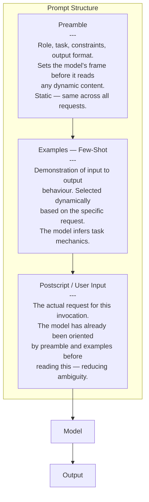
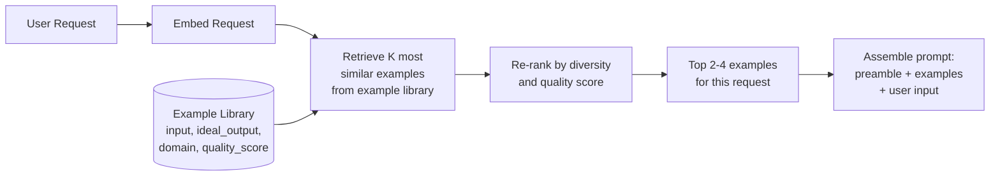

# Prompt Engineering as Systems Design

## Overview

A prompt is not a string you write once and forget. In a production AI system it is a **versioned, tested, owned software artifact** that sits on the critical path of every user request — and like every artifact on a critical path, it can regress, it can fail on edge cases, and it needs a deployment process. This chapter covers the discipline of treating prompt engineering as a systems engineering problem: how effective prompts are structured, how element positioning affects quality, how few-shot examples are selected, and how chain-of-thought is used as an explicit reasoning lever — drawn from the production experience of teams that ship LLM-based products at scale, including the GitHub Copilot team whose published work directly informs this chapter.

## Definition

**Prompt engineering as systems design** is the practice of designing the input to a language model the way a systems engineer designs an API: with clear contracts, explicit structure, systematic testing, versioned artifacts, and rollback paths. A prompt has components (system instructions, few-shot examples, user input, context); it has failure modes (hallucination, refusal, schema violation, format drift); and it has a lifecycle (authoring, testing, staging, production, monitoring, revision). The chapter that follows this one ([Prompt Templates & Versioning](02-prompt-templates-and-versioning.md)) covers the operational side of that lifecycle; this chapter covers the design and engineering of the prompt itself.

## Prompts Are Software Artifacts

The shift from "prompt as a throwaway string" to "prompt as a production artifact" has three practical consequences:

**Ownership.** Every system prompt in a production system should have a named owner — an engineer or team responsible for its correctness, monitoring its behaviour, and reviewing changes. A prompt that nobody owns will drift as models change and new edge cases accumulate. Ownership is asserted by committing the prompt to version control under a clear file path, not by leaving it hardcoded in application code.

**Review.** Prompt changes should go through the same review process as code changes — a pull request, a description of what changed and why, and a reviewer who checks for regression on the established eval set before merge. Prompt diffs are harder to read than code diffs (the effect of changing a single word is not locally obvious), which makes eval-gated review even more important than for code.

**Testing.** A prompt that passes "looks good on these five examples I just tried" has not been tested. A tested prompt has a representative eval set (at minimum 50–200 cases across the input distribution), a rubric for scoring outputs, and a regression baseline to compare against when the prompt changes. The discipline is identical to unit/integration testing; only the assertion mechanism differs (LLM-as-judge or human scoring instead of `assertEqual`).

## Anatomy of an Effective Prompt

Berryman and Ziegler (GitHub Copilot's founding engineering team) describe the recurring structure of effective prompts as three parts: **preamble, examples, and postscript**.

**Preamble** — the static framing: the model's role ("You are a senior software engineer reviewing pull requests"), the task definition, hard constraints ("Never suggest changes outside the file provided"), and the required output format. The preamble is read first and sets the interpretive frame for everything that follows. It should be stable across requests; dynamic information belongs in examples or the postscript.

**Examples** — few-shot demonstrations: a small number of (input, output) pairs that show the model the mechanics of the task. These are selected dynamically for each request (see [Few-Shot Example Selection](#few-shot-example-selection-as-a-retrieval-problem) below) and consumed between the preamble and the user input. The model extrapolates task behaviour from these examples more reliably than from instruction text alone, especially for format-critical tasks.

**Postscript / user input** — the actual request for this invocation. Placing it last, after the preamble and examples have already oriented the model, reduces ambiguity and improves compliance. The model arrives at the user input already knowing what role it plays, what format is expected, and what quality level to target.

## Prompt Element Positioning

The position of content within a prompt affects output quality in measurable ways. This reflects the model's learned behaviour: position carries real semantic weight in the pretraining distribution.

**Critical instructions belong at the beginning and the end, not the middle.** Attention weights for long prompts decay toward the middle ("lost in the middle" effect). Hard constraints, format requirements, and safety rules placed in the middle of a long prompt are more likely to be ignored than the same content at the preamble start or postscript end.

**Few-shot examples should immediately precede the user input.** The model is most influenced by examples it read most recently. If there are 2,000 tokens of retrieved context between the examples and the user's question, the examples' influence degrades. Keep examples as close to the user input as the context budget allows.

**Format instructions are more effective repeated at the end than stated only at the beginning.** A model that received format instructions at position 0 may ignore them 10,000 tokens later. Repeating a brief format reminder in the postscript ("Respond only with valid JSON, no prose.") consistently improves compliance on long prompts.

**Negative examples placed just before the user input outperform negative examples placed in the preamble.** Negative examples are generally less effective than positive examples for most tasks; when used, recency matters.

## Few-Shot Example Selection as a Retrieval Problem

The naive approach to few-shot examples is a fixed set hardcoded in the preamble. This works for simple, uniform tasks. For tasks with diverse inputs, it fails — a fixed example set that covers coding questions poorly serves medical questions and vice versa.

The production approach: **treat few-shot example selection as a retrieval problem**. Maintain a library of (input, ideal output, domain tag, quality score) examples. At request time, embed the user's input and retrieve the K most similar examples from the library. This is the identical architecture as RAG, applied to example selection rather than factual grounding.

**Diversity matters.** Retrieving the two most similar examples produces a set that covers one cluster of the input space but leaves edge cases uncovered. Maximal marginal relevance (MMR) combines similarity and diversity: retrieve the top K by similarity, then select examples that are both close to the query and maximally different from each other.

**Quality filtering.** Label each example with a quality score (human-rated, LLM-judge-rated, or derived from production feedback) and filter to high-quality examples before retrieval. A poorly-performing example selected by similarity will degrade the model's output.

**Freshness.** For tasks where correct answers change over time (pricing, policy, API specifications), examples should have an expiry policy. Stale examples with outdated answers are worse than no examples.

## Chain-of-Thought as a Prompt Discipline

Chain-of-thought (CoT) prompting — asking the model to reason step-by-step before producing a final answer — is not a single technique but a family of patterns with different cost/quality tradeoffs.

**Zero-shot CoT** ("Think step by step."): Append a reasoning elicitation to the user input. Costs 30–200% more output tokens. Improves accuracy on multi-step reasoning tasks; has little effect on single-step factual lookup or format-critical tasks. Simple to implement and the right starting point.

**Few-shot CoT**: Examples in the prompt include explicit reasoning chains, not just (input, output) pairs. The model learns to reason in the demonstrated style. More expensive to build (reasoning chains require annotation or strong-model generation) but substantially more reliable than zero-shot CoT for complex domains.

**Structured CoT**: Reasoning steps are formatted explicitly (numbered list, XML tags, scratchpad delimiters). Output is parsed to separate reasoning from the final answer — the final answer goes downstream; the reasoning is logged for debugging or used to train a cheaper model.

**When CoT hurts**: On simple, well-defined tasks — classification, extraction from structured data, format conversion — CoT adds latency and cost without quality benefit. The model can also "reason itself into a wrong answer" when the task requires pattern recognition rather than explicit reasoning. Always A/B test CoT on your specific task before deploying.

## Instruction-Following vs RLHF-Tuned vs Chat-Tuned Models

The same prompt produces materially different results on different model types. Understanding which model type you are targeting is a prerequisite for effective prompt design:

| Model type | Prompt design implication |
|---|---|
| Base / pretrained | Must "prime" the completion — few-shot examples are critical; instruction text is weak. Rarely used for production. |
| Instruction-tuned (SFT) | Instructions followed reliably; may be literal. Format constraints and output shape must be stated precisely. Less likely to refuse borderline requests. |
| RLHF-tuned | Trained to be helpful, harmless, honest. May refuse legitimate requests that pattern-match to harmful content. Use domain context ("In the context of a medical education platform...") to disambiguate. |
| Chat-tuned | Expects `system` / `user` / `assistant` role markers. Behaviour degrades with missing or malformed templates. The `system` role carries higher authority than `user` — put highest-priority constraints there. |

## Prompt Testing and Regression

A prompt that "worked in development" and has no regression tests will eventually fail in production. The minimum testing infrastructure:

**Eval set composition.** Include: (a) representative examples from real production traffic, (b) known hard cases (edge cases that failed before), (c) adversarial cases (inputs designed to trigger failure modes). The most common mistake is an eval set built entirely from the author's own test cases, which over-represents what the author already handled.

**Scoring.** For open-ended outputs: LLM-as-judge with a consistent rubric. For structured outputs: schema validation (pass/fail) supplemented by semantic quality. For classification/extraction: exact-match or precision/recall. Never rely solely on the prompt author's manual review.

**Regression threshold.** Before any prompt change ships, it must clear a quality bar on the eval set at least as good as the current production version, per rubric dimension. A change that improves average quality by 5% but regresses hard-case performance by 20% should not ship.

## Tools and Ecosystem

| Category | Tools | When to prefer |
|---|---|---|
| **Prompt management and versioning** | Langfuse (prompt registry), LangSmith (prompt hub), PromptLayer, Helicone | Langfuse: open-source, full eval + tracing integration; LangSmith: LangChain-native; PromptLayer: lightweight proxy-based logging and versioning |
| **Prompt testing / CI** | Promptfoo, Braintrust, DeepEval | Promptfoo: side-by-side model and prompt comparison, Git diff-aware CI; Braintrust: experiment tracking with A/B test support |
| **Few-shot example libraries** | Custom vector store (Qdrant, pgvector) + embedding model | Store `(input, output, quality_score)` with embeddings; retrieve K-nearest per request; same infrastructure as RAG |
| **Chain-of-thought formatting** | XML-style tags `<thinking>...</thinking>` (Claude-native), numbered steps (GPT-4), custom scratchpad delimiters | Follow the model family's documented recommended format; Claude responds best to XML-tagged reasoning; GPT-4 is more flexible |
| **Automated prompt improvement** | DSPy, Promptfoo CI, LangSmith evaluators | See [Automated Prompt Optimisation](05-automated-prompt-optimisation.md) |

## Interview Questions

### Beginner

**Q: What does it mean to treat a prompt as a software artifact, and why does it matter?**
It means the prompt has an owner, lives in version control, goes through review before changes ship, and has a test suite (an eval set) gating releases. It matters because a prompt regression is functionally a code regression — but completely invisible to conventional monitoring (no error codes, no exceptions, just silently worse outputs). Without this discipline, quality regressions go undetected until user complaints arrive.

**Q: What is the preamble-examples-postscript structure?**
Preamble: static role, task, and constraint framing that orients the model before any dynamic content. Examples: 2–4 few-shot (input, output) pairs selected dynamically for the current request, placed between preamble and user input. Postscript: the actual request for this invocation, placed last so the model reads it after being calibrated by preamble and examples. Placing the user's question last exploits the model's recency bias and consistently improves format compliance and output quality.

### Intermediate

**Q: Why should few-shot examples be retrieved dynamically rather than hardcoded, and how is retrieval implemented?**
Hardcoded examples are chosen for the prompt author's test cases, frequently missing the diversity of real production input. For tasks with diverse input types, no fixed set covers all types well. Dynamic retrieval embeds the user's input and retrieves K similar examples from a maintained library — identical to RAG architecture but applied to example selection. Implementation: embedding model + vector store holding `(input, output, quality_score)` triples + K-nearest-neighbor retrieval, optionally post-processed with MMR for within-selection diversity.

**Q: On what tasks does chain-of-thought help, and on what tasks should you avoid it?**
CoT helps on multi-step reasoning tasks: math, logic, multi-hop Q&A, code debugging, complex planning. It gives the model intermediate scratchpad space that makes errors visible and recoverable. It hurts on single-step tasks (classification, extraction from structured data, format conversion) where pattern recognition suffices — adding cost and sometimes degrading quality by introducing unnecessary reasoning steps.

### Senior

**Q: You've inherited a production system prompt with no version control and no eval set. How do you safely migrate it?**
First, recover the current prompt from application code and commit it to a prompt registry as "initial commit from production state" with a changelog. Second, build a retrospective eval set: sample 200 real production requests, label outputs with LLM-as-judge calibrated against a small human-labeled subset, and establish the baseline quality score. Third, introduce an eval-gated review workflow: no prompt change ships without an eval run against the baseline and reviewer sign-off. The likely outcome is discovering existing quality problems — that is a feature, making previously invisible issues explicit and trackable.

**Q: A prompt works well for chat but produces inconsistent format on structured extraction. How do you fix it without just lowering temperature?**
Root cause is usually under-specified format constraints. Steps: (1) Add an explicit JSON schema to the preamble and a brief format reminder in the postscript. (2) Add 3–4 few-shot examples each demonstrating valid, complete JSON output immediately before the user input. (3) Switch to JSON mode or constrained decoding if the serving infrastructure supports it. (4) Lower temperature only as a last resort and measure the quality impact on the full eval set — lower temperature can hurt open-ended quality while fixing format.

### Staff

**Q: Your team maintains 40 prompts across 8 product surfaces. How do you manage changes without causing unexpected cross-surface regressions?**
Prompt isolation: each surface owns its own prompt artifact and eval set. Shared components (a common system persona, shared constraints) are templated and versioned independently, so a change to the shared component triggers a re-run of every surface's eval suite before any surface ships. The CI gate must be cross-surface — not per-surface — to catch "one surface's improvement silently broke another surface's eval." The failure mode to prevent is prompt changes that propagate upstream without validation against all consumers.

## Google-Level Follow-Ups

- "Your eval set shows 92% quality, but users say the product got worse after your last prompt update. What went wrong?" — a static eval set only covers what was sampled at creation; continuous feedback-to-eval-set mining from production is required to catch distribution drift.
- "You have a task that benefits from CoT but your latency budget is 500ms and CoT adds 800ms. What are your options?" — structured CoT where only the final answer is streamed; smaller CoT model with caching for common reasoning paths; prefill caching for the reasoning preamble; async CoT with a progress indicator.
- "A new model version improves benchmarks 8% but your eval set shows a 3% regression on your task. Do you upgrade?" — decompose the aggregate: which rubric dimension regressed, how many real users are affected, whether the 8% benchmark gain covers your product's dominant task type, and whether the regression is recoverable with a prompt adjustment.

## Common Mistakes

- **Shipping prompts without an eval set** — "it looks good to me" is not a release gate; invisible regressions compound over time.
- **Placing critical constraints in the middle of long prompts** — lost-in-the-middle attention decay; put hard constraints at the beginning and repeat at the end.
- **Using chain-of-thought universally** — adds latency and cost without benefit on simple tasks.
- **Hardcoding a fixed few-shot example set** — fails when real input distribution is diverse; use retrieval-based selection.
- **Testing only on the author's own examples** — under-represents the inputs that cause production failures.
- **Ignoring the chat template** — using a chat-tuned model without correct role markers degrades quality in ways that look like a model problem but are actually a prompt engineering problem.

## Key Takeaways

- A prompt is a versioned, tested, owned software artifact — it needs the same ownership, review, and regression-testing discipline as code.
- Effective prompts follow preamble → examples → postscript: static framing first, dynamic few-shot examples in the middle, user input last.
- Element positioning matters: critical constraints belong at the beginning and end, not the middle; examples should immediately precede the user input.
- Few-shot example selection is a retrieval problem — a dynamic library queried per request outperforms a hardcoded fixed set for diverse input distributions.
- Chain-of-thought is a targeted tool: improves multi-step reasoning, adds cost without benefit on simple tasks.
- The tuning method (base, SFT, RLHF, chat-tuned) determines prompt design constraints — how instructions are interpreted, how refusals are triggered, whether role markers are required.

---

*Part of [Prompt Architecture](index.md) in the [AI System Design Notes](../index.md). Tracked in [BACKLOG.md](https://github.com/GyanendraChaubey/AI-System-Design-Notes/blob/main/BACKLOG.md).*
