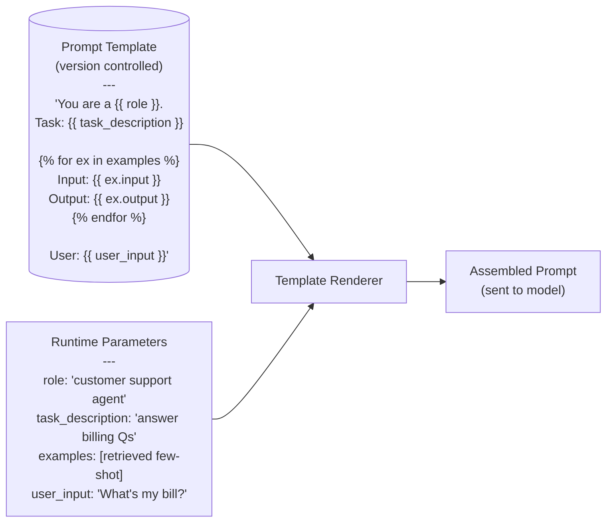
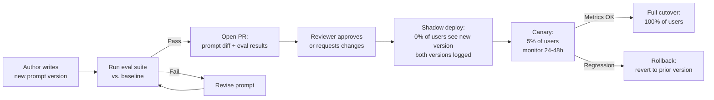

# Prompt Templates & Versioning

## Overview

A prompt template is the static skeleton of a prompt: the parts that stay the same across every request, with named placeholders for the parts that change per request. Versioning is the discipline of managing the evolution of those templates — so that a prompt change is a reviewable, rollback-able deploy rather than a silent behaviour shift. Together, templates and versioning give a production AI system the same change-management guarantees for its model inputs that CI/CD gives for its code.

## Why Templating and Versioning Matter

The failure mode this chapter prevents: a developer edits a string literal in application code, the change ships silently as part of a code deploy, quality regresses, and nobody knows why because there is no record of what changed, no eval run, and no rollback path.

Three things make prompt changes structurally different from code changes:

**Effect invisibility.** A code change that breaks a function produces an error or a test failure. A prompt change that degrades quality produces outputs that are subtly worse — no exception, no error code, just a different distribution of model outputs. This makes the change invisible to standard monitoring.

**Non-locality.** A one-word change in a 2,000-token prompt can change outputs on inputs that look nothing like what the author tested. The search space of inputs is the full distribution of natural language, not a finite set of code paths.

**Model coupling.** A prompt that works on model version X may not work on model version Y from the same provider, even when the provider describes the update as minor. Prompts must be versioned in coordination with model versions.

## Prompt Template Design

A prompt template separates static content from dynamic inputs using a consistent placeholder syntax. The design choices that matter:

**Placeholder syntax.** Choose a syntax that is unambiguous in your prompt content. Jinja2-style `{{ variable }}`, Handlebars `{{{ raw }}}`, or custom delimiters (`<<<user_input>>>`) all work. Avoid plain `{variable}` (Python f-string style) if your prompt text contains curly braces naturally (JSON examples, code samples).

**Static vs dynamic partitioning.** Every piece of the prompt that is constant across all requests should be in the template. Every piece that varies per request (user input, retrieved context, session history, user name) should be a named parameter. The static portion is what version control tracks; the dynamic portion is what the application injects at request time.



**Template partials and inheritance.** Large products share common components across many prompts (a standard safety disclaimer, a common persona, a shared output schema). Define these as reusable partial templates that can be ``-d into full templates. Change the partial once, and every template that includes it is updated — with a single point of version control.

**Defensive parameterisation.** Treat every dynamic parameter as potentially adversarial input. Escape or sanitise parameters before injection, especially `user_input`. A template that injects unescaped user content directly into system instructions creates prompt injection surface (see [Prompt-Injection-Resilient Design](04-prompt-injection-resilient-design.md)).

## Versioning Strategies

Three versioning strategies, each suited to different team maturity and prompt update frequency:

**Semantic versioning.** Each prompt has a version string (e.g., `v1.2.3`). Major: breaking change in expected output format or task scope. Minor: quality improvement that changes outputs but not the interface. Patch: typo fix or minor instruction clarification. Simple, readable, but requires human judgment on version bump level — teams frequently mislabel breaking changes as minor.

**Content-hash versioning.** The version is the SHA hash of the template content. Guarantees uniqueness and makes drift detection trivial (has the hash changed since last deploy?). Requires no human judgment. Harder to read in dashboards — version identifiers are not human-meaningful.

**Sequential / timestamp versioning.** Each deploy gets an auto-incrementing ID or a timestamp. Simple to implement. Gives no information about the nature of the change from the version ID alone.

**Best practice:** Use content hashing as the canonical identifier (for drift detection and reproducibility) alongside a human-readable alias (e.g., `billing-support-v3`) for dashboards and rollback references. Store the mapping between alias and hash in the prompt registry.

## Linking Prompts to Evals and Models

A version of a prompt is only meaningful relative to the model it was tested on. The complete version record for a deployed prompt should capture:

```
{
  "prompt_id": "billing-support",
  "prompt_hash": "sha256:a3f7...",
  "prompt_alias": "v3.1",
  "model_id": "gpt-4o-2024-11-20",
  "eval_run_id": "eval-2024-12-01-billing-v3.1",
  "eval_score": { "accuracy": 0.91, "format_compliance": 0.99 },
  "deployed_at": "2024-12-02T14:00:00Z",
  "deployed_by": "alice@company.com"
}
```

This record enables: (a) rollback to any previous version with full context on why the current version was chosen, (b) detecting model drift when the provider silently updates the model at the same model ID, (c) attributing quality changes to prompt changes vs model changes.

## Rollout Strategies for Prompt Changes

Prompt changes should follow the same staged rollout disciplines as code or model changes:

**Shadow deployment.** Run the new prompt version in parallel with the current version on a fraction of production traffic. Log both outputs but serve only the current version to users. Compare quality metrics between versions before switching. Zero user-facing risk; adds compute cost.

**Canary release.** Serve the new prompt version to a small percentage of users (1–5%). Monitor quality metrics and user signals (thumbs ratings, correction rate, escalation rate) for 24–48 hours before expanding. Requires per-request prompt version routing in the serving layer.

**A/B test.** Randomly assign users to the current or new prompt version and collect quality metrics over a pre-determined sample size for statistical significance. More rigorous than canary but requires more traffic to reach significance on low-frequency edge cases.

**Full cutover.** Serve the new prompt to all users after passing shadow or canary validation. Always pair with an easy rollback mechanism — the ability to revert to the previous version in under 5 minutes without a code deploy.



## Prompt Diff and Review Workflows

Reading a prompt diff is harder than reading a code diff. A reviewer cannot immediately see whether moving three words changed the model's behaviour significantly. Two practices that make prompt review tractable:

**Diff with eval context.** The PR that changes a prompt should include, alongside the text diff, the eval results before and after the change: which examples regressed, which examples improved, and the aggregate score change. The reviewer is approving an eval-evidenced change, not just an aesthetic judgment about the wording.

**AI-assisted prompt diff.** A supplementary step: pass the before and after prompt versions to an LLM with the instruction "describe how outputs would differ between these two versions on the following inputs." This doesn't replace an eval run but surfaces likely impacts on examples the eval set might not cover, making regressions more discoverable before they reach production.

## Tools and Ecosystem

| Category | Tools | When to prefer |
|---|---|---|
| **Prompt registry / versioning** | Langfuse (Prompt Management), LangSmith (Prompt Hub), PromptLayer, Agenta | Langfuse: open-source, stores version history + eval linkage + live tracing; LangSmith: LangChain-native with A/B test support; PromptLayer: lightweight, minimal setup; Agenta: version-controlled prompt + LLM config management |
| **Template engines** | Jinja2, Handlebars, Mustache, LangChain PromptTemplate | Jinja2: most expressive (loops, conditionals) for complex templates; LangChain PromptTemplate: built-in integration with chains and agents |
| **Prompt CI / eval gates** | Promptfoo (Git-native CI), Braintrust (experiment tracking), GitHub Actions + custom eval scripts | Promptfoo: runs eval on every PR diff, integrates with GitHub Actions; Braintrust: hosted experiment tracking with version comparison |
| **Shadow / canary routing** | LiteLLM (prompt version routing), feature flag systems (LaunchDarkly, Unleash), custom middleware | Feature flags for A/B routing; LiteLLM proxy for model + prompt version routing behind a single endpoint |

## Interview Questions

### Beginner

**Q: What is the difference between a prompt template and a prompt, and why does the distinction matter?**
A prompt template is the static, version-controlled skeleton with named placeholders for dynamic content. A prompt is the assembled result: the template with runtime parameters (user input, retrieved context, etc.) injected. The distinction matters because what you test, version, and deploy is the template — the same template assembles a different prompt for every request. Version controlling a rendered prompt (a single example) rather than the template misses the entire range of runtime variation.

**Q: Why is semantic versioning (v1.2.3) sometimes insufficient for prompt versioning?**
Semantic versioning requires human judgment to classify a change as major, minor, or patch — and the classification affects other systems (eval triggers, rollback policies). Teams frequently mislabel breaking prompt changes as minor, leading to consumers that break silently. Content-hash versioning is more reliable for drift detection and reproducibility: the hash changes if and only if the template changes, with no human classification required.

### Intermediate

**Q: How do you rollback a prompt change in production, and what needs to be in place before you can do it?**
Prerequisites: the prompt registry must store the full version history with content hashes, model IDs, and eval results for each version. The serving layer must support switching which prompt version is active at runtime without a code deploy (usually via a feature flag or registry query). The rollback itself is: (1) identify the previous version's hash, (2) update the active version pointer in the registry, (3) confirm the change propagated to serving, (4) monitor quality metrics. Without the registry and serving-layer routing, rollback requires a code deploy — typically 15–30 minutes vs. under 5 minutes with the infrastructure in place.

**Q: What information should a prompt PR include beyond the text diff, and why?**
The eval run results: which test cases regressed, which improved, the aggregate score change per rubric dimension, and the eval baseline the new version was compared against. Also: the model version the eval was run against, and any example outputs side-by-side for hard cases. Reviewers cannot reliably predict output behaviour from reading text diff alone; the eval context converts the review from an aesthetic judgment ("this sounds better") into an evidence-based decision ("this improves the hard case category by 8% with no regression on the standard cases").

### Senior

**Q: Your company ships 20 prompt templates that all include a common "safety disclaimer" partial. The legal team needs to change the disclaimer language. How do you manage this rollout?**
The partial is version-controlled independently. When the new disclaimer language is authored, run the eval suite for every template that includes it — not just a spot-check. Changes to a shared partial have N × (per-template regression probability) chance of causing a regression somewhere in the system. Shadow deploy the change on a low-risk surface first; validate eval scores; then roll out to each surface in order of traffic volume, with monitoring between each step. The full rollout takes days, not hours — this is correct; shared partial changes are high blast-radius changes and deserve proportional process rigor.

### Staff

**Q: Design a prompt versioning system for an AI platform that serves 50 enterprise customers, each of which can customise the system prompt for their deployment. How do you manage versions, rollout, and regression testing at this scale?**
Three tiers of templates: (1) global platform template (owned by the AI platform team, tested centrally, deployed to all customers after regression validation), (2) customer-specific overrides (owned by individual customer admins, tested against their specific eval set if provided or against the platform's generic eval otherwise), (3) customer-specific few-shot example libraries (per-customer, retrieved dynamically). The platform team's CI validates that global template changes don't break any customer's eval (requires maintaining N eval sets, one per customer, or a proxy set that represents the distribution). Customer-specific overrides are isolated — a change by Customer A cannot affect Customer B. Version audit trails are customer-visible, since enterprise customers frequently require change attribution for compliance.

## Google-Level Follow-Ups

- "How do you version a prompt when the model it runs against is itself unversioned (pinned to 'latest')?" — the answer requires pinning the model ID explicitly even when the provider doesn't enforce it (use model-version-pinned API parameters, not 'latest' aliases) and treating every model provider update as an implicit prompt version event that requires re-eval.
- "You detect that a prompt has been silently modified in production — the content hash doesn't match the expected version. What do you do and what does this tell you about your system?" — immediate rollback to last known good; investigate whether a code path bypassed the registry; this indicates the prompt is not the single source of truth, which is an architectural deficiency.

## Common Mistakes

- **Hardcoding prompts as string literals in application code** — makes versioning impossible and review invisible.
- **Versioning rendered prompts (one specific example) instead of templates** — misses all runtime variation.
- **Deploying prompt changes without eval gating** — relying on a visual review of the diff rather than measuring output quality impact.
- **Not linking prompt versions to model versions** — a quality regression from a provider model update looks identical to a quality regression from a prompt change if the version record doesn't capture both.
- **Forgetting to escape dynamic parameters** — injecting unsanitised user input into system instructions creates prompt injection surface.
- **Using 'latest' model alias instead of pinned model IDs** — silent model updates invalidate prompt behaviour without any observable version change.

## Key Takeaways

- A prompt template separates static (version-controlled) content from dynamic (runtime-injected) parameters — the template is what you deploy, test, and roll back.
- Content-hash versioning is more reliable than semantic versioning for detecting drift and ensuring reproducibility; combine with human-readable aliases for dashboards.
- Every deployed prompt version should be linked to the model version it was tested on, the eval run that validated it, and the quality scores at time of deploy.
- Prompt rollouts should follow the same staged discipline as code rollouts: shadow → canary → full cutover, with a rollback path that takes under 5 minutes.
- Shared template partials have N × regression probability; changes to shared components require cross-surface eval validation before any surface ships the update.

---

*Part of [Prompt Architecture](index.md) in the [AI System Design Notes](../index.md). Tracked in [BACKLOG.md](https://github.com/GyanendraChaubey/AI-System-Design-Notes/blob/main/BACKLOG.md).*
