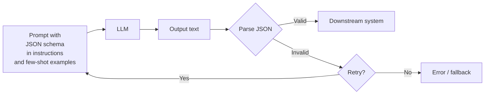
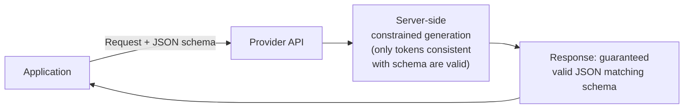
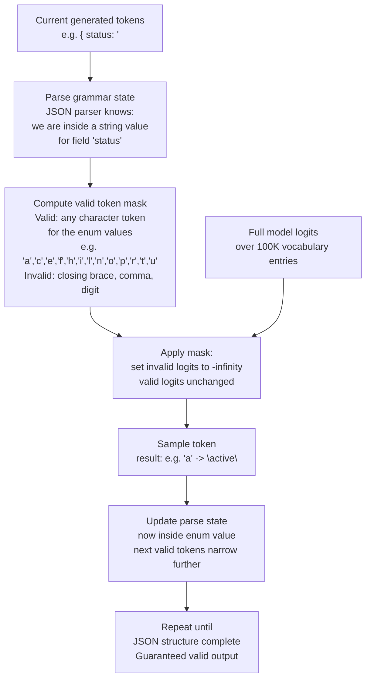
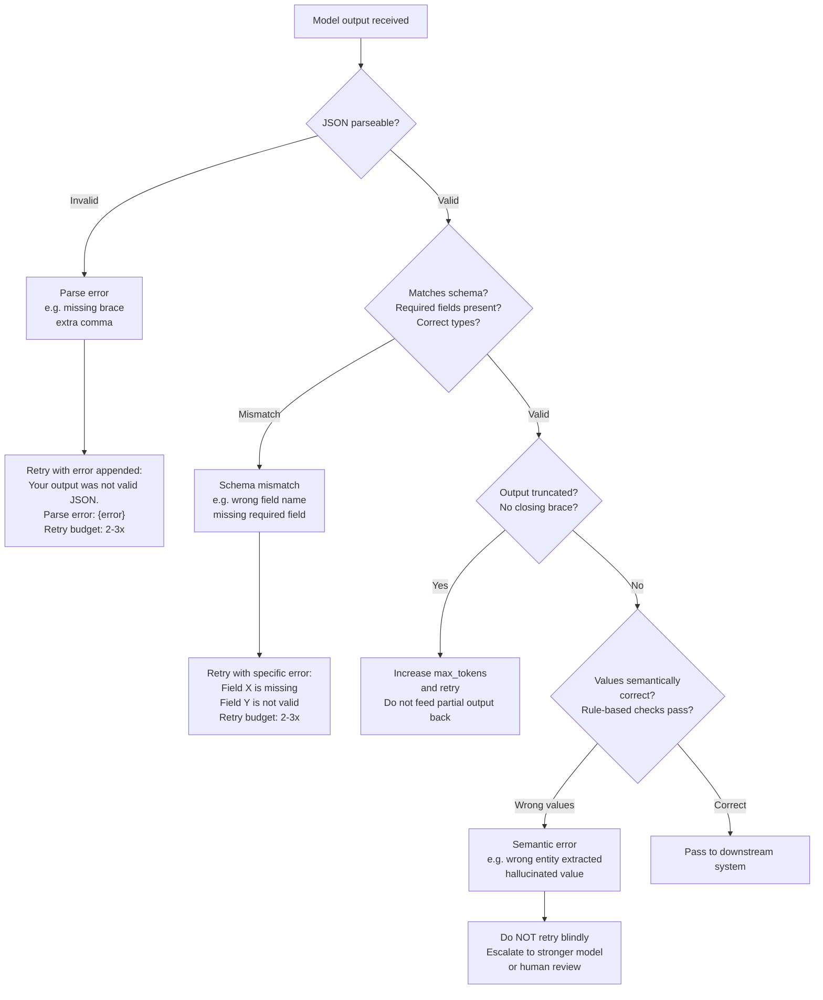
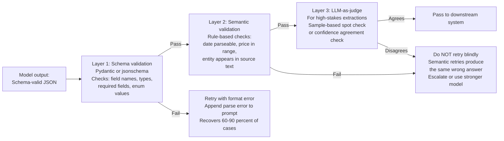

# Structured Output & Grammars

## Overview

An LLM is fundamentally a next-token sampler over natural language. Downstream systems that consume its output — parsers, databases, APIs, other models — need structured data: valid JSON, a specific enum value, a well-formed SQL query, a Pydantic model. The gap between "the model often produces something that looks like JSON" and "the model always produces valid JSON that matches this schema" is where production systems break. This chapter covers the three architectural approaches to closing that gap — prompt-level schema enforcement, provider-side JSON/function-calling modes, and client-side grammar-constrained decoding — along with their failure modes and when each is the right choice.

## Why Unstructured LLM Output Breaks Production Systems

The fundamental issue: language models are trained to produce natural language, not to satisfy formal grammars. A model that produces JSON 99.9% of the time still fails one request in a thousand — and at scale, one-in-a-thousand is a constant, visible production failure. The specific failure modes:

**Invalid JSON.** Missing closing braces, extra commas, trailing text after the closing `}`, unescaped special characters in string values, truncated output if the generation hits a length limit before completing the JSON.

**Schema mismatch.** The model produces valid JSON but with wrong field names, wrong types, missing required fields, or additional fields the schema doesn't expect. Common cause: the model "extrapolates" from the schema description rather than strictly following it.

**Hallucinated enum values.** Given an enum field with valid values `["low", "medium", "high"]`, the model occasionally produces `"moderate"` or `"critical"` — values that look plausible from the natural language context but are not in the allowed set.

**Escaped quotes and code in strings.** Code snippets or template strings in JSON values frequently contain characters that break JSON parsing: unescaped backslashes, embedded newlines, quotation marks.

## Approach 1: Prompt-Level Schema Enforcement

The simplest approach: include the output schema in the prompt and ask the model to follow it.

**When it works.** For simple, short schemas with few fields and no complex nesting, a clear schema in the preamble plus 2–3 few-shot examples of valid outputs is often sufficient. The model learns the pattern quickly and the parse failure rate is low enough that retry handles the remainder.

**Failure modes.** Prompt-level enforcement degrades with: (a) complex nested schemas — the model loses track of nesting depth; (b) long prompts — format instructions in the preamble are forgotten by the time the model is generating; (c) adversarial or unusual user input that "confuses" the model about whether it should follow the schema or engage with the user's text.

**Retry strategies.** A clean retry architecture: on parse failure, re-send the original prompt with an additional user turn — "Your output was not valid JSON. The parse error was: `{error}`. Please output only valid JSON matching the schema." This guided retry recovers 60–90% of failures at the cost of one extra model call. Without the error message, blind retries recover fewer failures and waste more compute.

**Output validation layer.** Parse + schema-validate (using `jsonschema`, Pydantic, or equivalent) all model outputs before passing them downstream. Never assume a valid-looking string is actually schema-valid. Log all validation failures for monitoring.

## Approach 2: Provider-Side Structured Output Modes

Most frontier model APIs now expose a structured output mode that constrains generation server-side. This is the preferred approach when it is available.

**OpenAI Structured Outputs** (`response_format: {type: "json_schema", json_schema: {...}}`): Pass a JSON Schema to the API; the model is constrained to only produce tokens consistent with the schema. Guarantees valid JSON matching the schema. Available for `gpt-4o` and newer models. Schema must be a strict subset of JSON Schema (some advanced features unsupported).

**OpenAI JSON mode** (`response_format: {type: "json_object"}`): Guarantees valid JSON but does not validate against a schema — just ensures parseable JSON. Simpler to use than full Structured Outputs but requires client-side schema validation.

**Anthropic tool use / function calling**: The `tools` parameter defines function schemas; the model produces structured `tool_use` blocks matching the schema. Reliable for extracting structured data by defining a "dummy" tool that the model is prompted to call with the extracted data.

**Google Vertex AI** (`responseMimeType: "application/json"`, `responseSchema`): Similar to OpenAI Structured Outputs — schema-constrained generation.

**Advantages.** Zero parse failures. No retry loop needed for format errors. No client-side constraint computation overhead. No dependency on a local library.

**Limitations.** Not all schema features are supported (recursive schemas, `oneOf` with many variants). The schema is sent with every request and counted as input tokens. Some schemas produce pathological behaviour (very deeply nested schemas can cause repetitive or very long outputs). Always test your specific schema against the provider's documented limitations before relying on it in production.

## Approach 3: Grammar-Constrained Decoding (Client-Side)

For self-hosted models, or when provider-side constraints are insufficient, grammar-constrained decoding enforces structure at the sampling level: at each decode step, a token mask is computed from the current parse state of the target grammar, and only tokens that would produce a valid partial string according to the grammar are allowed.

**How it works:**
1. Define the target structure as a grammar (JSON Schema, regex, context-free grammar, or Pydantic model).
2. At each decode step, determine the set of tokens consistent with the grammar given the tokens generated so far.
3. Set all other tokens' logits to negative infinity before sampling.
4. The sampled token is guaranteed to be grammatically consistent; generation cannot produce an invalid output.

**Libraries:**

| Library | Grammar types supported | Integration |
|---|---|---|
| Outlines | JSON Schema, regex, Pydantic, CFG | vLLM, transformers, llama.cpp |
| XGrammar | JSON Schema, context-free grammars | vLLM (native), custom serving |
| LM Format Enforcer (LMFE) | JSON Schema, Pydantic, regex | transformers, llama.cpp, TGI |
| Guidance | Handlebars templates + schema | transformers |

**Throughput overhead.** Grammar-constrained decoding adds 5–15% throughput overhead per token (the mask computation runs on CPU alongside GPU decode). For high-throughput batch workloads generating structured output at scale, measure this explicitly before deploying.

**When to use.** Self-hosted models where provider-side JSON mode is not available; complex grammars (SQL generation, code in a specific language, domain-specific structured formats) that JSON Schema cannot express; cases where output length needs to be tightly controlled by the grammar.

## Output Failure Modes and Recovery

Even with structured output modes or grammar constraints, non-format failures occur:

**Schema-valid but semantically wrong.** The model produces JSON matching the schema with incorrect field values (wrong entity extracted, wrong sentiment, hallucinated field content). Structure enforcement catches syntax; it cannot catch semantic errors. These require semantic validation (LLM-as-judge, rule-based validation, human spot-check) as a separate layer.

**Length-truncated output.** If `max_tokens` is set too low, the model may produce a truncated JSON object — syntactically incomplete. Detection: check for a valid closing `}` or `]` on the outer object. Mitigation: set `max_tokens` generously above the expected maximum output size; for schema-constrained modes, the provider handles this.

**Logit bias side effects.** Some teams use logit bias (downweighting tokens) to make format violations less likely. This can produce unexpected outputs: the model picks the next most likely token even when it is semantically wrong, because the correct token was suppressed. Use with caution; prefer explicit schema constraints over logit manipulation.

**Retry budget.** Define a maximum retry count (typically 2–3) before falling back to a degraded response (a structured error response, a human escalation, or returning partial extracted data). Unlimited retries on persistent failures compound cost and latency.

## When to Validate vs When to Regenerate

The decision of whether to validate, retry, or escalate depends on the failure type. The flowchart above (in the Output Failure Modes section) shows the full decision path. The table below adds nuance on escalation conditions.

Not every validation failure warrants a retry:

| Failure type | Response |
|---|---|
| JSON parse error (syntax invalid) | Retry with error message appended to prompt |
| Schema mismatch (wrong field name) | Retry with explicit error: "Field `X` is missing, field `Y` is not valid" |
| Required field missing | Retry with the specific missing field named |
| Enum value out of range | Retry with the allowed values listed |
| Output semantically wrong (wrong extraction) | Do NOT retry blindly — semantic retries often produce the same error; instead escalate or use a stronger model |
| Output truncated (hits max_tokens) | Increase max_tokens and retry; do not feed partial output back in |

## Tools and Ecosystem

| Category | Tools | When to prefer |
|---|---|---|
| **Provider-side JSON / structured output** | OpenAI Structured Outputs, Anthropic tool use, Google `responseSchema`, Mistral JSON mode | First choice when available — zero overhead, no client-side library, guaranteed valid output |
| **Grammar-constrained decoding** | Outlines, XGrammar, LMFE, Guidance | Self-hosted models; complex grammars beyond JSON Schema; when provider support is absent |
| **Schema definition** | Pydantic (Python), Zod (TypeScript), JSON Schema, OpenAPI schemas | Pydantic: most natural for Python; define schema once, generate JSON Schema automatically |
| **Output validation** | Pydantic `.model_validate()`, `jsonschema`, AJV (JS) | Validate ALL model outputs before passing downstream, even with provider-side constraints |
| **Retry orchestration** | Tenacity (Python retry), LangChain OutputFixingParser, Instructor | Instructor: Python library that wraps OpenAI and Anthropic APIs with automatic Pydantic validation + retry |

## Interview Questions

### Beginner

**Q: Why can't you just ask the model to produce JSON and trust the output?**
Because language models are trained on natural language, not to satisfy formal grammars — they produce JSON-like text most of the time, not valid JSON every time. At scale, a 99.9% success rate means persistent, visible production failures. The model also "forgets" format instructions on long prompts, produces plausible-but-wrong enum values, and truncates output if it hits a length limit mid-JSON. Production systems need a schema enforcement mechanism, not a hope.

**Q: What is the difference between JSON mode and Structured Outputs on the OpenAI API?**
JSON mode guarantees parseable JSON but does not validate against a schema — any valid JSON structure can be returned. Structured Outputs takes a JSON Schema parameter and guarantees that the output is both valid JSON and matches the schema exactly. Structured Outputs is strictly stronger and is the correct choice when you need schema compliance; JSON mode is appropriate when you need parseable JSON but the downstream system handles schema validation itself.

### Intermediate

**Q: How does grammar-constrained decoding work, and what are its tradeoffs?**
At each decode step, a mask is computed from the current parse state of the target grammar (JSON Schema, regex, CFG). Only tokens that would produce a grammatically valid partial string are allowed; all others have their logits set to negative infinity. The sampled token is guaranteed valid. Tradeoffs: adds 5–15% throughput overhead from CPU mask computation; requires a client-side library; complex grammars can produce pathological generation length or repetition. Prefer provider-side structured output when available; use grammar-constrained decoding for self-hosted models or unsupported schema features.

**Q: A model produces schema-valid JSON but with wrong extracted values. How do you detect and handle this?**
Schema validation catches syntax and structure violations, not semantic ones. Semantic validation layers: (1) rule-based checks (is the extracted date parseable? is the price in a plausible range?); (2) confidence checks (does the model agree with its own extraction if asked again at temperature 0?); (3) LLM-as-judge (a separate model or the same model in a judge role evaluates the extraction quality). For high-stakes extractions, always add at least rule-based semantic validation in addition to schema validation.

### Senior

**Q: Design the structured output pipeline for a legal document analysis system that extracts 15-field structured data from 100-page contracts. What are the failure risks and mitigations?**
Key risks: (1) Schema complexity — a 15-field Pydantic model with nested types may exceed what Structured Outputs handles reliably; mitigate by testing all field types against the provider's documented schema subset. (2) Document length — a 100-page contract likely exceeds the context window; mitigate by chunking (extract field-by-field or section-by-section) or using a 200K-context model. (3) Semantic wrong values — "valid JSON, wrong extraction" is the dominant failure mode at this complexity; mitigate with field-level rule-based validation (date formats, dollar amounts, party names must appear verbatim in source text). (4) Truncation on long fields (lengthy contract clause text); mitigate by capping string field length in the schema and extracting long text separately. Retry budget: 2 retries max on parse/schema failures, then log for human review.

### Staff

**Q: Your team produces 50 different structured output schemas across an AI platform. How do you manage schema evolution without breaking downstream consumers?**
Schema versioning: each schema has a version identifier linked to the prompt version that uses it. Downstream consumers specify which schema version they accept. Backward-compatible schema changes (adding optional fields, widening enum sets) can be shipped transparently. Breaking schema changes (removing required fields, narrowing types) require a versioned migration: deploy the new schema version alongside the old, migrate consumers one by one, deprecate the old version after all consumers are migrated. The registry that maps prompt versions to model versions should also map to schema versions — a single version record captures the full tuple of what was deployed together.

## Google-Level Follow-Ups

- "Provider-side Structured Outputs is available, but you still see 0.1% semantic extraction errors. The downstream system silently accepts wrong values. How do you detect and route these?" — probes for: online sampling with LLM-as-judge scoring, anomaly detection on field value distributions, confidence calibration via temperature-0 re-extraction agreement.
- "You're generating SQL queries with grammar-constrained decoding. The grammar ensures syntactically valid SQL, but the queries are semantically invalid (wrong table names, incorrect joins). What do you do?" — probes for recognising that grammar constraints solve syntax, not semantics; the solution is a schema-augmented prompt (table/column definitions in context) + SQL execution with rollback + error-message-guided retry.

## Common Mistakes

- **Trusting JSON mode without schema validation** — valid JSON is not schema-valid JSON; always validate against your expected schema with Pydantic or `jsonschema`.
- **Setting `max_tokens` too low** — truncated JSON output is a parse error that looks like a model failure but is actually a configuration error.
- **Blind retries on semantic failures** — retrying a "wrong extraction" without adding additional grounding to the prompt produces the same wrong answer; add the specific error or more context before retrying.
- **Overloading a single JSON schema with 20+ fields** — model compliance degrades with schema complexity; decompose into multiple smaller extractions if possible.
- **Using logit bias instead of schema constraints** — logit bias produces unpredictable side effects; prefer provider-side structured output or grammar constraints.
- **Not testing your schema against the provider's documented limitations** — recursive schemas and some `oneOf` patterns are unsupported in structured output modes and fail silently.

## Key Takeaways

- Production systems need a formal mechanism to enforce structured output — prompts alone ("produce JSON") are insufficient at scale.
- The three approaches in order of preference: provider-side structured output mode → grammar-constrained decoding for self-hosted models → prompt-level enforcement with retry.
- Schema validation (syntax + structure) and semantic validation (correct values) are separate layers — provider-side JSON mode handles the former, not the latter.
- Always define a retry budget (2–3 retries max), differentiate retry strategy by failure type (parse error vs semantic error vs truncation), and log all failures for monitoring.
- Pydantic is the most practical schema definition tool for Python: define once, derive JSON Schema automatically, use `.model_validate()` as the validation layer.

---

*Part of [Prompt Architecture](index.md) in the [AI System Design Notes](../index.md). Tracked in [BACKLOG.md](https://github.com/GyanendraChaubey/AI-System-Design-Notes/blob/main/BACKLOG.md).*
