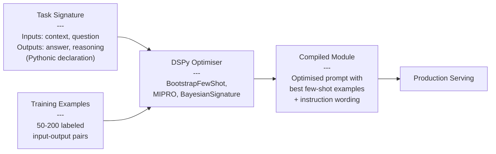
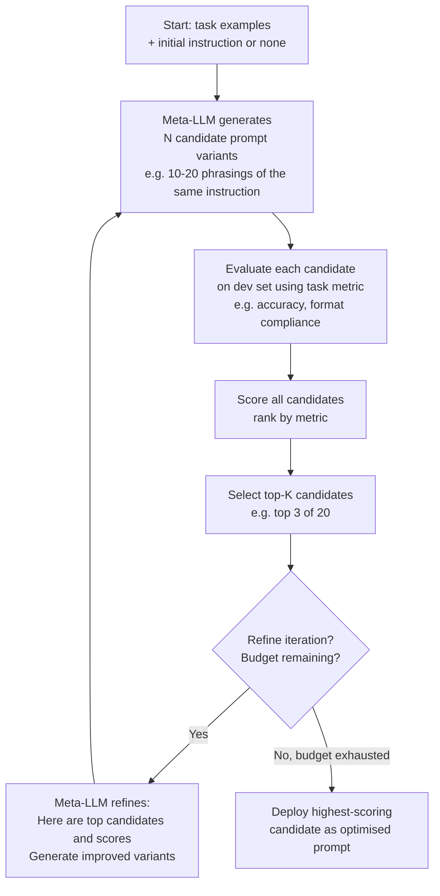
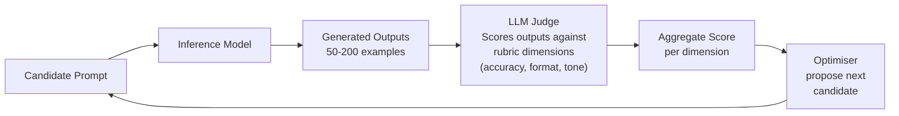
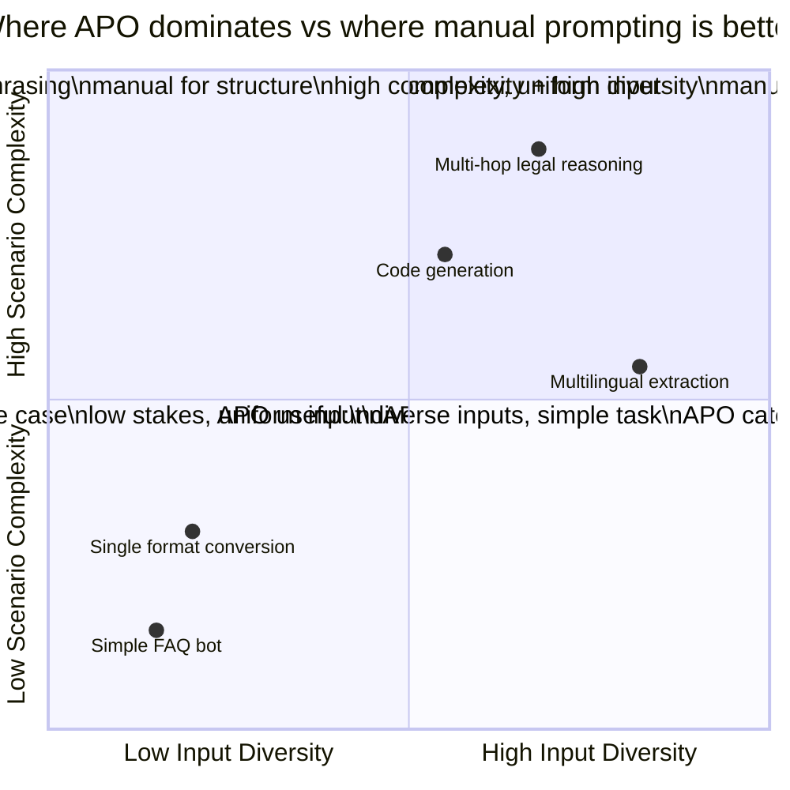
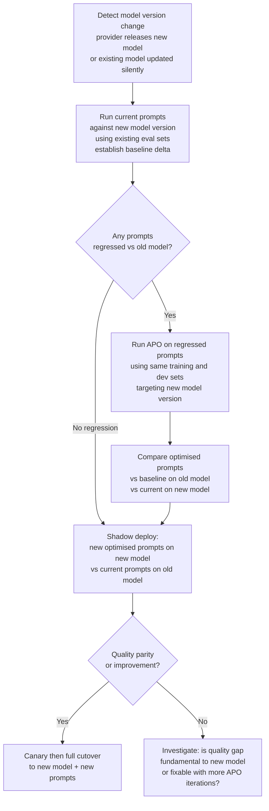

# Automated Prompt Optimisation

## Overview

Manual prompt engineering is an iterative, human-intensive process: write a prompt, test it on a few examples, adjust the wording, test again. It is also poorly reproducible — two engineers optimising the same prompt for the same task will produce different prompts, and neither can prove theirs is better without a systematic eval. **Automated prompt optimisation** (APO) replaces or supplements manual iteration with systematic, programmatic search over the prompt space, using an LLM as both the proposal engine and the evaluator. The result is prompts that are often better than what humans produce, in fewer iterations, and with a documented optimisation trace.

## The Limits of Manual Iteration at Scale

Manual prompt engineering breaks down in three ways as products mature:

**Search space is vast and non-intuitive.** A 500-token system prompt has astronomical possible variants. Human engineers explore a tiny fraction, guided by intuition about what "sounds better." Intuition systematically misses non-intuitive improvements: adding an apparently redundant sentence, changing the order of instructions, or removing a clause that seemed important can produce significant quality jumps that manual exploration never discovers.

**Prompt improvement is time-consuming at scale.** A product with 20 prompts across 8 surfaces, each needing optimisation for a new model version, represents hundreds of engineer-hours of manual iteration. Teams that cannot invest that time ship suboptimal prompts — which means suboptimal user experiences — simply because optimisation is too expensive to do manually at scale.

**Manual optimisation lacks reproducibility.** A prompt that one engineer spent three weeks tuning embodies undocumented knowledge about what was tried and why. When the prompt needs updating (model version change, new task requirement), the optimisation process restarts from scratch. Automated optimisation is reproducible: rerun the process, get a comparably optimised prompt.

## DSPy: Compilation-Based Prompt Optimisation

DSPy (Declarative Self-improving Python) is the most production-adopted automated prompt optimisation framework. Its core insight: rather than hand-writing prompts, you declare the **task signature** (what the module takes as input and what it produces as output) and the **training examples**, and DSPy's optimisers compile the most effective prompt to instantiate that signature.

**What DSPy optimisers do:**

- **BootstrapFewShot**: Generates candidate few-shot examples by running the model on training inputs, filters to those where the output is correct (by the eval metric), and assembles the best-scoring subset. Simple and fast; the right starting point.
- **MIPRO (Multi-prompt Instruction Proposal and Refinement)**: Uses a meta-LLM to propose instruction variants, evaluates each variant on the dev set, and selects the best combination of instructions + examples. More expensive than BootstrapFewShot but finds better prompts for complex tasks.
- **BayesianSignatureOptimizer**: Uses Bayesian optimisation over the prompt space. Best for tasks where the eval is expensive and the instruction search space is large.

**What DSPy does NOT do**: DSPy optimises the prompt; it does not change the model's weights. It is complementary to fine-tuning, not a replacement. The compiled prompt is a regular prompt that can be deployed with any LLM API.

**When to use DSPy:** Tasks with a clear input-output signature and an automatic evaluator (a classification accuracy metric, a regex match, a code execution result). Tasks where the output is too open-ended to evaluate automatically are harder — DSPy can still use LLM-as-judge evaluation but the signal is noisier.

## APE: Automatic Prompt Engineering

APE (Automatic Prompt Engineering, Zhou et al. 2022) is a gradient-free approach: use an LLM to **propose** candidate instruction phrasings, evaluate each on a dev set, and select the best.

**The APE loop:**
1. Provide a meta-prompt to a strong LLM ("Given these input-output examples, write an instruction that produces the correct output"): generate N candidate instruction variants.
2. Evaluate each candidate on the dev set using the task metric.
3. Select the top-scoring candidates; optionally iterate with a refinement prompt ("Here are the top candidates and their scores; generate improved variants").
4. Deploy the highest-scoring candidate.

**Advantages:** No framework dependency; implementable with any LLM API and a few dozen lines of Python. The proposal model can be a different, stronger model than the inference model (use GPT-4 to generate prompts that will run on GPT-3.5-turbo — the optimisation cost is a one-time expense).

**Limitations:** The search is shallow — the meta-LLM proposes variants within its own prior about what prompts look like. It rarely discovers non-intuitive structural changes (reordering sections, changing the output format entirely). Works best for instruction phrasing improvements, not deep structural changes.

## RIME: Instruction Induction from Examples

RIME (Recursive Instruction Mutation with Evaluation, Ye et al. 2023) focuses on **inducing instructions from examples** rather than iteratively improving a starting instruction. Given a set of (input, output) pairs with no initial instruction, RIME asks a strong LLM to infer what instruction would produce those outputs from those inputs.

**When RIME is useful:** When you have high-quality labeled examples but no good starting instruction. A common scenario: a team has accumulated 200 examples of a task from human labelers but hasn't systematically written the instruction. RIME can produce a first-pass instruction that is often better than a hand-written one, because it is grounded in the actual examples rather than the instruction author's mental model.

## LLM-as-Judge Feedback Loops

For tasks without automatic evaluation (open-ended generation, creative tasks, subjective quality), automated optimisation requires an LLM judge to provide the evaluation signal.

**Calibration is required.** An LLM judge has systematic biases (position bias, verbosity preference, self-preference). Before using an LLM judge for optimisation, calibrate it against a small set of human-labeled examples: measure the judge's correlation with human scores, and weight or correct the judge's scores accordingly. An uncalibrated judge optimises for the judge's biases, not for actual quality.

**Multi-judge ensembles.** A single judge may have systematic blind spots. Running two differently-sourced judge models (e.g., GPT-4o and Claude 3.5 Sonnet) and trusting only scores where they agree reduces systematic bias at the cost of higher eval compute.

**Cost management.** LLM-as-judge at scale is expensive. Typical automated optimisation runs 10–50 candidate prompts, each evaluated on 50–200 examples, with each example requiring a judge call. Budget 50K–5M judge tokens per optimisation run, depending on the task and the evaluation set size. Use a cheaper judge model for early filtering, reserve the expensive judge for final candidate selection.

## When Automated Optimisation Beats Manual

| Scenario | Automated APO advantage |
|---|---|
| Task has a clear automatic metric (accuracy, F1, regex) | High — can run thousands of candidates without human review |
| Task has diverse inputs (wide distribution) | High — APO samples broadly; manual iteration explores a narrow slice |
| Team has 10+ prompts to optimise simultaneously | High — parallelisable; manual iteration does not scale |
| Model version upgrade (same task, new model) | High — prompts tuned for old model often suboptimal for new; rerun APO |
| Task requires subtle instruction phrasing | Medium — APO finds phrasing variations humans miss |
| Task is open-ended / subjective (creative writing) | Low — evaluation signal is noisy; manual curation still adds value |
| Few training examples available (under 20) | Low — APO needs enough examples to evaluate reliably; overfits otherwise |
| Prompt is a deep structural design (multi-stage) | Low — APO optimises wording within structure; structural design still requires human judgment |

## Integrating Automated Optimisation into the Prompt Lifecycle

APO is not a one-shot process; it should be part of the ongoing prompt lifecycle:

**Model version upgrades.** When a provider updates a model, run APO on your existing prompts against the new model version using your established eval sets. The optimal instruction phrasing frequently differs between model versions. This converts a multi-week manual re-tuning exercise into a scheduled automated job.

**Continuous prompt refinement.** When production feedback (thumbs-down rates, correction events) identifies a prompt performing below threshold on a specific slice of inputs, add those cases to the training set and rerun APO. The optimiser finds the prompt variant that fixes the regressing slice without degrading the rest.

**Baseline establishment.** For any new task, run APO before any manual iteration. The APO result establishes a quantified baseline that manual iteration then tries to beat. This prevents teams from spending weeks manually tuning a prompt that APO could have found in an hour.

## Tools and Ecosystem

| Category | Tools | When to prefer |
|---|---|---|
| **Framework-based APO** | DSPy, TextGrad | DSPy: most mature, widest community, production-used; TextGrad: gradient-based text optimisation, research-focused |
| **Gradient-free proposal APO** | Custom APE implementation (any LLM API), Promptfoo AI optimization | APE: simple to implement from scratch with any API; Promptfoo: built-in comparison and optimisation loop |
| **LLM-as-judge infrastructure** | Braintrust, Langfuse (eval), Arize Phoenix, custom judge wrappers | Braintrust: best-in-class for tracked experiment comparison; Langfuse: open-source with judge integration |
| **Hyperparameter search** | Optuna (Bayesian), Ray Tune | For optimising model parameters (temperature, top_p) alongside prompt; Optuna is simplest |
| **Instruction induction** | DSPy BootstrapFewShot, custom RIME implementation | DSPy: most reliable; RIME: when no starting instruction is available |

## Interview Questions

### Beginner

**Q: What is the core idea behind automated prompt optimisation, and what problem does it solve?**
APO uses an LLM to propose candidate prompt variants and an evaluator (automatic metric or LLM-as-judge) to score them, systematically searching the prompt space rather than relying on human intuition. It solves the problem that manual prompt engineering explores a tiny fraction of the possible prompt space, is time-intensive at scale, and is not reproducible. APO is faster and often finds better prompts because it samples more broadly and without the intuitive biases of the human prompt engineer.

**Q: What is DSPy, and how is it different from manually writing a prompt?**
DSPy is a framework where you declare a task signature (input/output types) and training examples, and its optimisers compile the best prompt to instantiate that signature. Instead of writing prompt text, you write a Python module declaration. DSPy's optimisers try many candidate prompts (different instruction phrasings, different few-shot example subsets) and select the one with the best score on the dev set. The compiled prompt is a regular prompt that can be deployed with any LLM API.

### Intermediate

**Q: What are the main limitations of LLM-as-judge for automated prompt optimisation, and how do you address them?**
Key limitations: (1) position bias — judges prefer content in certain positions; mitigate by randomising output order or using position-invariant scoring. (2) Verbosity preference — judges often score longer outputs higher; mitigate by calibrating judge scores against human ratings and building length-independent rubrics. (3) Self-preference — a judge model scores outputs from same-family models higher; mitigate by using a judge from a different model family. (4) Cost — judge calls at scale are expensive; mitigate with a cheap judge for early filtering and an expensive judge for final selection.

**Q: When would you choose APE (gradient-free proposal) over DSPy for automated prompt optimisation?**
APE when: you have no existing DSPy infrastructure and need a simple solution from scratch; the task is narrow and instruction phrasing is the main lever; the team is comfortable with a custom Python script. DSPy when: the task involves multiple chained modules (retrieval + generation, or multi-step reasoning) where each module needs independent optimisation; you want to use optimisation algorithms like MIPRO or Bayesian search; the task has been running in production and you want a reproducible, documented optimisation history.

### Senior

**Q: Your model provider just released a new model version. You have 30 prompts in production. How do you use automated optimisation to manage the transition?**
Before the cutover: (1) Establish baselines on the new model — run every existing prompt against your eval sets on the new model without any changes. Identify which prompts regressed and by how much. (2) For regressed prompts, run DSPy BootstrapFewShot or APE using the same training and dev sets, targeting the new model. The optimiser finds the phrasing that works on the new model. (3) Shadow deploy the optimised prompts on new model alongside original prompts on old model, verify quality parity or improvement. (4) Canary then full cutover. The full process is parallelisable — all 30 prompts can be optimised simultaneously, reducing a multi-week manual effort to a few days of automated runs.

### Staff

**Q: How do you prevent automated prompt optimisation from overfitting to your eval set and underperforming in production?**
Overfitting to the eval set is the primary risk: the optimiser finds a prompt that scores high on the fixed examples but does not generalise. Mitigations: (1) Hold out a test set not shown to the optimiser; evaluate the optimised prompt on the test set before deploying. (2) Use a large, diverse eval set sampled from production traffic, not curated by the prompt author. (3) Evaluate on multiple eval sets (different time periods, different user segments, different input length distributions) — a prompt that generalises should perform consistently across all. (4) Apply a regularisation mindset: prefer simpler, more readable prompts when two candidates have similar eval scores, since complex prompts are more likely to be exploiting eval set-specific patterns. (5) Shadow deploy for 24–48 hours and compare online metrics against offline eval scores — a large online/offline gap indicates overfitting.

## Google-Level Follow-Ups

- "DSPy optimisation produced a prompt that scores 3% higher on the eval set but is 200% longer, costing 2x more at inference time. How do you make the trade-off decision?" — probes for cost-quality analysis: is 3% quality improvement worth 2x inference cost for this product surface? Run a cost-quality Pareto analysis across prompt variants of different lengths.
- "You run automated prompt optimisation and the best candidate uses phrasing that looks ungrammatical but scores highest. Do you ship it?" — probes for: trust the eval signal if the eval set is good; run a human review on a sample of outputs from the weird-looking prompt; ship if the eval signal is consistent and human review confirms quality.

## Common Mistakes

- **Running APO on too few training examples** — with fewer than ~20 examples, the optimiser overfits to the training set; need at least 50–100 for reliable signal.
- **Using the same examples for optimisation and evaluation** — guarantees overfitting; always hold out a separate dev set for evaluation during optimisation and a test set for final validation.
- **Using an uncalibrated LLM judge** — optimising for a biased judge produces prompts optimised for the judge's biases, not actual quality; always calibrate against human labels.
- **Treating APO as a one-shot activity** — prompt optimisation needs to be repeated on model updates, task changes, and when production quality drifts; build it into the prompt lifecycle.
- **Optimising prompts in isolation** — a prompt that is part of a multi-step pipeline should be optimised jointly with the other pipeline steps; optimising independently can create locally optimal but globally suboptimal prompts.

## Key Takeaways

- Automated prompt optimisation finds better prompts faster than manual iteration by systematically searching the prompt space rather than relying on human intuition.
- DSPy is the most production-mature framework: declare a task signature + training examples, and its optimisers compile the best prompt.
- APE (gradient-free proposal) is simpler to implement from scratch: use an LLM to propose instruction variants, evaluate on a dev set, select the best.
- LLM-as-judge enables automated optimisation for tasks without automatic metrics; calibration against human labels is required to avoid optimising for judge biases.
- Model version upgrades are the highest-value APO trigger: prompts optimised for one model version are frequently suboptimal on the next; automated re-optimisation converts multi-week manual work into a scheduled job.
- APO complements fine-tuning; it optimises the prompt (input to the model) while fine-tuning optimises the model weights. Both are needed in mature AI products.

---

*Part of [Prompt Architecture](index.md) in the [AI System Design Notes](../index.md). Tracked in [BACKLOG.md](https://github.com/GyanendraChaubey/AI-System-Design-Notes/blob/main/BACKLOG.md).*
