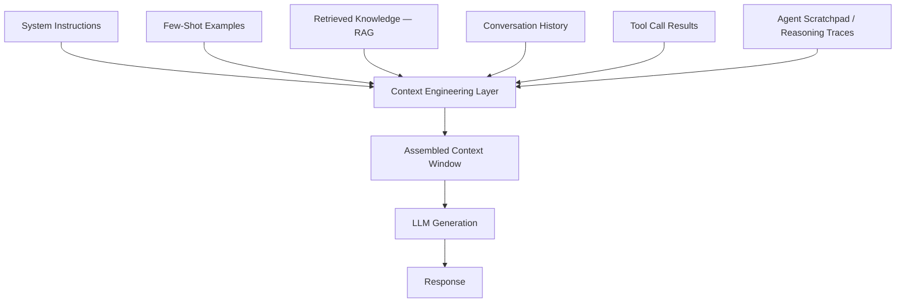
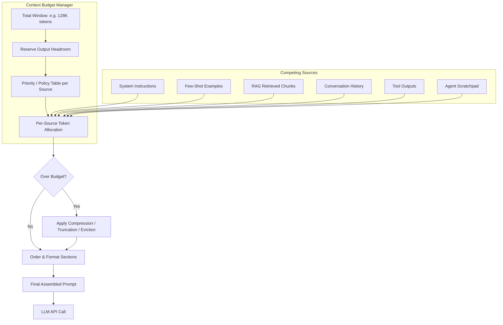
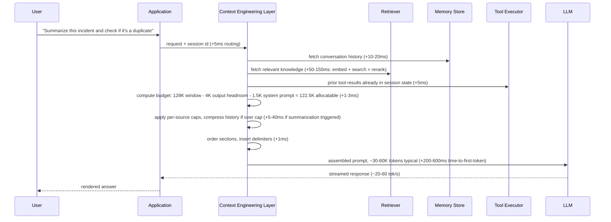
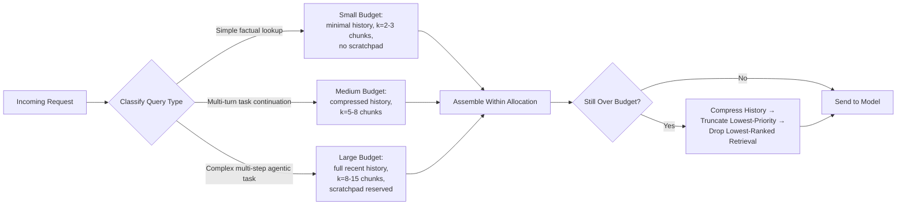
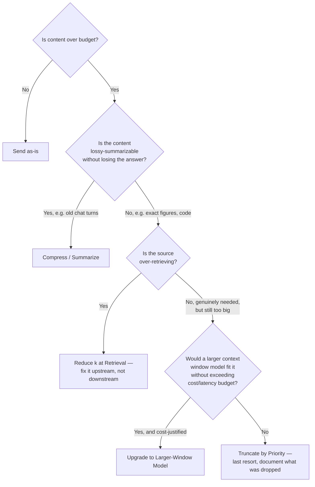

# What Is Context Engineering

## Overview

Context engineering is the discipline of deciding exactly what content occupies a model's context window, in what order, and at what token cost, for every single request. It is not "writing a good prompt" — it is the system that decides which prompt, which retrieved facts, how much history, which tool outputs, and how much room is left for the model to actually think and answer, before any of those words are assembled and sent.

## Definition

Context engineering is the engineering practice of constructing the input sequence to a language model by selecting, ordering, compressing, and budgeting content from multiple competing sources — system instructions, few-shot examples, retrieved knowledge, conversation history, tool outputs, and agent reasoning traces — so that the combined sequence fits within a fixed token budget while maximizing the model's ability to produce a correct, relevant response. It subsumes prompt engineering: a prompt is one input among several that context engineering must allocate space for, not the whole problem.

## Problem Statement

A model's context window is fixed and finite — 128K tokens, 200K tokens, 1M tokens, whatever the deployed model supports — and every token sent costs money and adds latency regardless of whether the model uses it. The moment a system grows past "send the user's message, get a reply," multiple things want space at once: a system prompt, format-demonstrating examples, retrieved documents, prior conversation turns, mid-task tool results, and, in agentic systems, the model's own reasoning scratchpad.

Without an explicit allocation policy, whichever component was wired up last wins by default: history grows unbounded until it crowds out the system prompt; a RAG pipeline retrieves "the usual" top-8 chunks regardless of need; tool outputs get pasted in raw, full JSON and all, because nobody wrote a serializer. The failure mode is not a crash — it is silent quality decay: the model ignores instructions it still technically has, contradicts earlier facts, or burns budget on irrelevant content while the fact that mattered gets truncated off the end. None of this throws an error. It just produces worse answers, with no record of why.

## Why This Architecture Exists

Early LLM applications had one input to manage: the prompt. "Prompt engineering" — wording instructions well, giving examples — was sufficient because the prompt was the entire request. That stopped being true once products added retrieval, multi-turn memory, tool use, and multi-agent orchestration, because each subsystem independently produces content that must enter the same window the prompt occupies.

The first thing teams tried was concatenation: append the chunks, the history, the tool result, let the model sort it out. This broke in three ways. Cost — every appended token is billed, making cost a function of conversation chattiness or tool verbosity, not a deliberate choice. Latency — bigger inputs take longer to process, and time-to-first-token scales with prompt size. And, most counterintuitively, quality: "lost in the middle" research showed that having room in the window is not the same as the model reliably using everything in it — content buried mid-input is attended to less reliably than content near the start or end, regardless of window size (see [Context Windows & Positional Encoding](../02-llm-architecture/03-context-windows-and-positional-encoding.md)).

The discipline that emerged treats the window the way a systems engineer treats any scarce resource — memory, disk, bandwidth — with explicit allocation and eviction policies, not first-come-first-served concatenation. That reframing, from "the prompt" to "a contested, budgeted resource," is why the term displaced "prompt engineering" as agentic and RAG-augmented systems became the default.

## Core Concepts

- **Context window** — the maximum number of tokens (input plus output) a model can process in a single request; the hard ceiling all allocation decisions operate under.
- **Context budget** — the explicit allocation of that ceiling across competing content sources, typically a token count or percentage per source.
- **Token cost** — every input token is billed and adds to time-to-first-token; output headroom is billed at a separate, usually higher, rate.
- **Context assembly** — the request-time process of selecting, formatting, ordering, and concatenating content from each source into the final input sequence.
- **Lost in the middle** — the observed pattern where attention to content degrades for material placed mid-context relative to the start or end, independent of whether the content technically fits.
- **Context rot** — quality degrading as effective context fills, including instruction drift (the model stops reliably following earlier instructions as more content is added after them) and self-contradiction across a long conversation. See [Context Rot & Failure Modes](05-context-rot-and-failure-modes.md).
- **Compression vs. truncation vs. retrieval reduction** — compression rewrites content denser (e.g., summarizing history); truncation drops content outright (oldest-first, lowest-relevance-first); retrieval reduction asks the retriever to return less in the first place rather than fixing it downstream.
- **Headroom** — budget reserved for the model's output (and, for agents, its reasoning), planned for before generation starts, not discovered as an overflow error after assembly.

## Context Assembly Pipeline

Context engineering sits as a deliberate assembly stage between every upstream content producer and the model call. Nothing reaches the model without passing through it.



The detailed view shows what the layer actually contains: a budget manager owning the token math, per-source policies deciding how much each source may contribute, and a final ordering/formatting pass before generation.



## Components

| Component | Responsibility | Does NOT own |
|---|---|---|
| Budget manager | Token math: window minus output headroom minus fixed costs equals allocatable pool | What content fills an allocation — per-source policy |
| Per-source policy | How much of a source's content gets included (e.g., top-k chunks until 6K tokens or k=8) | The overall budget ceiling |
| Compressor / summarizer | Rewrite oversized content (history, tool output) into a denser form preserving what matters | Deciding *whether* compression is needed |
| Truncation / eviction policy | Drop content by an explicit rule (oldest-first, lowest-score-first) when compression isn't enough | Silent, undocumented dropping |
| Ordering / formatting layer | Place sections to counter lost-in-the-middle; apply clear delimiters between sources | Ranking which chunks are relevant — retrieval's job |
| Token counter / pricer | Accurate per-section token counts before assembly, from real numbers | Generation itself |

Each component owns a narrow decision; the budget manager alone sees the whole picture. A retriever deciding independently how many chunks to return, oblivious to how much room history already consumed, is the exact failure this layer prevents.

## Assembling Context for a Request



The budget computation step looks trivial but is where most production incidents originate: it must run on *every* request, with current numbers, before a single token reaches the model. A stale token counter, a retriever ignoring its cap, or a memory fetch returning full history instead of a windowed slice will blow the budget downstream in ways that are expensive to debug, since the symptom — a degraded or truncated answer — appears far from the cause.

## Budget Allocation Patterns

The most consequential pattern in production context engineering is allocating budget dynamically based on what the request actually needs, rather than applying one fixed split to every request type.



Other recurring patterns:

1. **Static fixed-split budgeting** — hardcode percentages (10% system, 50% retrieval, 30% history, 10% headroom). Easy to reason about, but wastes budget on simple queries and starves complex ones; the starting point, rarely the end state.
2. **Dynamic allocation by query classification** — shown above; route through a cheap classifier before deciding the split, trading a little latency for much better utilization.
3. **Priority-ordered eviction** — rank every section by priority (instructions and the current turn are un-evictable; older history and lower-ranked chunks go first) and drop from the bottom until the request fits.
4. **Progressive summarization of history** — rather than evicting old turns outright, periodically collapse them into a running summary (see [Context Compression & Summarization](03-context-compression-and-summarization.md)), trading some fidelity for a small, stable cost.
5. **Reservation-first budgeting** — reserve output and scratchpad headroom *before* allocating the rest, instead of discovering afterward there's no room left to answer.

## Multimodal Context: Images, Files, and Audio

Text-only context budgets count characters and tokens. **Multimodal context budgets must also account for image patches, audio frames, and structured file extractions** — each of which consumes context window space and inference cost through the same token-pricing model as text, but at very different densities.

**Images in context:**

A single image passed to a vision-language model consumes roughly 1,000–5,300 "image tokens" depending on resolution and the model's patch size. Some providers (OpenAI GPT-4o, Anthropic Claude) scale token count with image size using tiling — a 2048×2048 image can consume 8,000–16,000 tokens. This has direct context budget and cost implications:

- A product that allows users to attach images must reserve image-token budget *before* allocating budget for system instructions, history, and retrieved knowledge. A single image at 5,000 tokens against a 32K window consumes 15% of the window before a word of text is processed.
- Images cannot be meaningfully "compressed" the way text history can. The only levers are: resize before sending (reduce resolution), select relevant sub-crops rather than full images, or reject inputs that exceed a per-request image-token ceiling.
- Track image tokens separately in monitoring — a cost spike from "more image-heavy conversations" is invisible if image and text tokens are blended into one average.

**Files and documents:**

PDFs, spreadsheets, and code files are not passed as binary — they are extracted to text (or image patches, for scanned PDFs) before entering the context window. The token density varies enormously:

- A 10-page prose document: ~3,000–5,000 tokens.
- A 10-page spreadsheet with numeric data: often 10,000–30,000 tokens after serialisation.
- A scanned PDF with no text layer: must be processed through a vision encoder, typically 1,000–5,000 image tokens per page.

The context engineering implication: **file-to-token conversion must be estimated before assembling the request**, not discovered after. A budget manager that doesn't know a file's post-extraction token count until after sending it will frequently exceed budget on the first request rather than the tenth.

**Audio in context:**

Audio-native models (Gemini Audio, GPT-4o audio) tokenise speech at roughly 25–50 audio tokens per second. A 2-minute voice message produces 3,000–6,000 audio tokens. This is uncommon in most products today but is the dominant modality in voice AI and meeting-assistant products; those products need a per-utterance token estimate as part of their context budget policy.

**Practical multimodal budget policy:**

```
Total window = output reserve + system instructions + multimodal inputs + text retrieval + history
```

Reserve multimodal input budget *before* text retrieval and history, in the same way output headroom is reserved before any other allocation — because unlike text, multimodal inputs arrive at a fixed size and cannot be selectively compressed once received.

## Prompt Caching as a Context Engineering Lever

Most of the content assembled per request is not unique: the system prompt, few-shot examples, product instructions, shared documents, and tool schemas are typically identical across thousands or millions of requests. **Prompt caching** lets the serving infrastructure compute the KV cache for these static prefixes once and reuse it across all requests that share that prefix — turning repeated prefill compute into a cache read.

**What it saves:**

At a product with a 4,000-token system prompt, no caching means every request pays the full prefill cost of those 4,000 tokens before any unique content is processed. With prefix caching and a 90% hit rate, 90% of requests skip that compute entirely. At $1/M input tokens and 10M requests/day, that's a $36K/day saving from a single engineering decision about how the context is structured.

Providers that expose prompt caching (as of mid-2025): Anthropic (breakpoint-based, explicit `cache_control` markers), OpenAI (automatic, for prompts above a minimum length), Google (explicit), most self-hosted engines via `prefix_caching=True`.

**How to engineer context for maximum cache hit rate:**

Cache hit rate depends on whether the shared prefix is an exact byte-for-byte match at the prefix position. A single character change — a dynamic timestamp, a request ID injected into the system prompt, a user name embedded in instructions — breaks the cache for that position and all content after it.

The engineering discipline:
1. **Freeze the static prefix.** Move everything that doesn't change per-request to the beginning of the context: system instructions, product rules, tool schemas, few-shot examples.
2. **Append dynamic content at the end.** User message, retrieved documents, conversation history — put these after the static prefix so the cache covers as much of the context as possible.
3. **Never inject dynamic values into static sections.** A current-date injection in the system prompt resets the cache every day at midnight. If the date is needed, put it in the user turn, not the system prompt.
4. **Track cache hit rate as a cost metric.** A hit rate below 80% on a product with a large, stable system prompt is a signal that context assembly is not structured optimally.

**Interaction with context engineering budgeting:**

Prompt caching changes the *cost* of a source but not its *token count*. A 4,000-token static system prompt with 90% cache hit rate effectively costs 400 input tokens per request in billing terms. Model the cost budget and the token budget separately: the token budget governs what fits in the context window; the cost budget governs what you actually pay.

## Tradeoffs



| Advantages | Disadvantages |
|---|---|
| Predictable, bounded per-request cost instead of cost scaling with conversation length or tool verbosity | Adds an assembly stage with its own latency (tens of ms, more if compression triggers) |
| Counters lost-in-the-middle decay via deliberate ordering and prioritization | Requires accurate token counting and instrumentation many teams under-invest in early |
| Makes degradation traceable — every eviction is a logged decision, not a silent drop | More moving parts: budget manager, per-source policies, compressor all need building and syncing |
| Dynamic allocation gives complex requests more room without overpaying on simple ones | Misclassifying a complex query as simple under-serves it |
| Decouples upstream subsystems so each evolves without silently breaking the others' budget | Every new subsystem is another consumer that must be explicitly registered |

## Scalability

Context engineering's scaling pressure is not request volume in the traditional sense — it is **the number and verbosity of content sources competing for the same fixed window**, and that pressure grows independently of QPS.

- **Source count growth**: a system going from system prompt + user message to system prompt + RAG + history + 5 tools + a scratchpad has gone from 2 consumers to 8+, each able to grow unbounded if not capped. The per-source cap table keeps this from becoming unbounded per-request cost.
- **Conversation length**: history grows linearly with turns; without compression, a long-running session eventually consumes the entire budget on history alone — the single most common scalability failure in agentic products, rarely caught in testing because test conversations are short.
- **Tool output verbosity**: a tool returning a 50KB JSON blob does not scale — at roughly 4 characters per token, that's upward of 12,000 tokens from one call, about 10% of a 128K window, for output the model likely needs a 200-token summary of. See [Function Calling Architecture](../13-tool-calling/01-function-calling-architecture.md).
- **Where dynamic windows fall over**: at very high QPS, the classifier step becomes its own bottleneck if implemented as a full model call — teams scaling past a few thousand QPS move classification to a sub-10ms heuristic or cache by request shape.

## Reliability

| Failure | Degradation strategy |
|---|---|
| Stale token counts (tokenizer mismatch after a model swap) | Re-tokenize with the actual serving tokenizer at assembly time; fail rather than silently overflow |
| A source ignores its cap and returns far more than allotted | Enforce caps at the assembly layer — treat every source as untrusted with respect to size |
| Compression step times out or fails | Fall back to hard truncation by priority — a degraded-but-bounded context beats no response |
| One source is entirely unavailable (e.g., memory store down) | Proceed with remaining sources and a visible "partial context" note, rather than failing the request |
| Context silently exceeds the model's window | Should be impossible by construction; treat any occurrence as a budget manager bug and add a hard pre-flight rejection check |

Context assembly failures should *degrade gracefully and visibly* (a shorter answer, a "history was summarized" note) rather than fail outright or silently send a worse context with no signal anything was dropped. See [Context Rot & Failure Modes](05-context-rot-and-failure-modes.md) for the deeper taxonomy once content *is* in the window but degrading behavior rather than overflowing it.

## Security

Context engineering is the chokepoint every external content source passes through, making it the natural place to enforce — or fail to enforce — a critical boundary: **content from retrieval, tool outputs, and history is untrusted data, not instructions**, regardless of formatting. A budget manager that concatenates a retrieved chunk or tool response directly against system instructions with no clear delimiter makes indirect prompt injection trivial — anything an attacker plants in an indexed document or a tool payload rides into context indistinguishable from a legitimate directive. Same threat surface as [RAG Architecture](../06-rag/01-rag-architecture.md#security); the mitigation belongs here because this layer controls formatting and ordering for every source, not just RAG's.

A second risk is **cross-source data leakage**: history or memory from one tenant or session allocated into another's window — a budget manager bug, a cache key collision — is a direct confidentiality breach. Isolation must be enforced at the point each source is fetched, not assumed upstream.

A third, agent-specific risk is **scratchpad leakage**: an intermediate reasoning trace surfaced to the wrong user, or persisted where another request can retrieve it, can leak data or credentials mentioned mid-execution. Treat scratchpad content as internal-only by default.

## Cost Optimization

Cost is close to linear in tokens sent — typical mid-2025 frontier-tier API pricing runs roughly $0.25-$3 per million input tokens and $1-$15 per million output tokens, several-fold higher for "frontier/large" versus "fast/small" tiers. Allocation choices are a direct line item:

- **Stop over-retrieving "just in case."** Tuning k from a default of 10 down to what an eval set shows is needed is routinely a 20-40% reduction in the largest line item, with no measured quality loss — the same lever as [RAG Architecture](../06-rag/01-rag-architecture.md#cost-optimization).
- **Compress history instead of carrying it raw.** A 40-turn conversation carried verbatim can exceed 15,000 tokens; a periodically-refreshed summary holds the same state in 500-1,500 — roughly a 10x reduction, every turn.
- **Serialize tool outputs, don't paste them.** A trimmed, schema-shaped summary instead of the raw payload is frequently a 5-20x reduction on that source alone.
- **Cache the static parts.** Instructions and few-shot examples are identical across most requests; prompt/context caching serves the unchanged prefix at 50-90% off standard pricing.
- **Match window size to the model tier.** Sending a 100K-token context to a frontier model when a cheaper one would answer correctly multiplies cost by the tier price differential.

**Illustrative budget breakdown**, agentic chat request on a 128K window: 1,500 tokens system instructions, 6,000 retrieved knowledge (~8 chunks), 8,000 compressed history, 3,000 tool outputs, 2,000 scratchpad reserve, 4,000 output headroom — roughly 24,500 tokens allocated, over 100K unused. At $1/million input and $5/million output tokens, that's roughly $0.0245 input plus up to $0.02 output — **about $0.04-$0.05 per request**. The same request under an unbudgeted "append everything" policy filling 80K tokens of history and tool output instead of 11K costs over 3x as much on input alone, for a model not 3x more likely to answer correctly with the extra content — per lost-in-the-middle, it may be less likely to.

## Monitoring

- **Tokens allocated per source, per request** — the single most useful metric for catching drift; a creeping rise in history or tool-output share with no product change is the first sign something stopped respecting its cap.
- **Eviction/truncation rate** — how often content is dropped or compressed to fit, by source; a rising rate signals growing demand or a policy needing retuning.
- **Time-to-first-token vs. assembled context size** — the leading indicator of when assembly itself, not generation, becomes the latency bottleneck.
- **Cost per request, by source** — mirrors RAG's "retrieval vs generation" split, extended to every source, so a regression is attributable.
- **Effective-context quality signals** — sampled quality (LLM-as-judge or correction rate) segmented by context length, to catch degradation before users escalate it. See [Drift & Quality Monitoring](../20-observability/04-drift-and-quality-monitoring.md).
- **Budget overflow / pre-flight rejection rate** — should sit near zero; any non-zero rate means a source is bypassing caps.

## Production Best Practices

- Treat the context window as a **budget with named owners per source** — every source gets an explicit cap, not an implicit "whatever it returns."
- **Reserve output headroom before allocating the rest** — no room left to answer is a design bug, not a runtime surprise.
- **Compress history progressively** rather than letting it grow unbounded — long-running sessions are where unbounded growth gets discovered by a user, not a test.
- **Make every eviction and compression traceable** — log what was dropped and why, so a regression is debuggable instead of mysterious.
- **Re-tokenize with the actual serving tokenizer at assembly time**, especially after a model version change — estimates can diverge enough to blow a budget that looked fine in testing.
- **Don't let upstream subsystems self-regulate size** — retriever, memory store, and tool executor should each respect a cap from the budget manager.
- **Cap and shape tool outputs at the source** — design schemas to return what the model needs, not the full payload, rather than relying on downstream truncation.

## Real World Examples

Public statements and product positioning reveal genuinely different philosophies about how much of this problem a bigger window should solve versus better engineering on top of a moderate one. These are illustrative, publicly observable patterns, not confirmed internal architecture.

- **Anthropic/Claude** has emphasized large windows (200K tokens widely available, 1M in some offerings) alongside published guidance and tooling — including prompt/context caching — framing context as something engineered and reused efficiently, not simply maximized.
- **OpenAI/ChatGPT** has shipped a layered approach — memory features that selectively persist facts across sessions rather than replaying full history, plus retrieval-style tools — a bet that *selective* context outperforms growing the window and hoping the model finds what matters.
- **Google/Gemini** has been the most aggressive publicly about raw window size (1M+ tokens in some tiers), while Google's own long-context evaluation research (needle-in-a-haystack benchmarks) is part of the public evidence base motivating the lost-in-the-middle concern this chapter describes.
- **Cursor** illustrates context engineering applied to a codebase: a large repository cannot be stuffed into any window wholesale, so its publicly described approach combines codebase retrieval with explicit, user-visible context controls — pin, exclude, or reference specific files — making allocation partly a user-facing affordance, not just a backend policy.

## Interview Questions

### Beginner

**Q: What is context engineering, and how is it different from prompt engineering?**
Prompt engineering writes good instructions for a single, static input. Context engineering decides what occupies the entire window on every request — instructions, retrieved knowledge, history, tool outputs, and agent reasoning all compete for the same budget. Prompt engineering is one input it budgets for, not the whole problem.

**Q: Why can't you just always use the biggest available context window and skip the budgeting problem?**
Cost and latency scale with tokens actually sent, regardless of window size — unused headroom is free, but a full window costs money and adds time-to-first-token. And "lost in the middle" research shows mid-context content is attended to less reliably than content near the start or end — a bigger window gives more room, not a better chance every token gets used correctly.

### Intermediate

**Q: You have a 128K window and five sources competing for it — how do you decide the split?**
Reserve output headroom first — no room to answer is a hard failure, not a quality tradeoff. Cap each remaining source by how essential and compressible it is: instructions are small and non-negotiable; retrieved knowledge is capped against an eval set, not a guess; history gets a compression fallback instead of unbounded growth; tool outputs are serialized, not pasted raw. Revisit the split per query type — a lookup doesn't need a multi-step task's allocation.

**Q: What's the difference between compressing, truncating, and "retrieving less," and when would you use each?**
Compression rewrites content denser while preserving meaning — for content summarizable without losing the needed fact, like older history. Truncation drops content outright by a priority rule — a last resort for content that can't be safely summarized. Retrieving less fixes the problem upstream by having the retriever return a smaller, better-ranked set — usually the first lever, since it avoids paying retrieval cost for content you'd discard anyway.

### Senior

**Q: A team's agent "forgets" instructions given early in a long-running session. How do you diagnose and fix this?**
This is context rot / instruction drift, not necessarily a model regression. Check where instructions land in the assembled context as the session grows — if history is appended after the system prompt with no compression, the prompt's relative weight shrinks each turn until it falls into the lost-in-the-middle zone or gets truncated. Fixes: re-inject critical instructions periodically; compress history instead of letting it grow unbounded; treat instructions as a protected, never-evicted allocation.

**Q: How would the budget policy differ for a simple Q&A chatbot versus a multi-step coding agent?**
A chatbot's budget is dominated by retrieval and a short history window — a small, mostly-fixed split suffices. A coding agent has different pressure: tool outputs (files, command/test output) and a scratchpad can dominate, history must track task state across tool calls rather than turns, and tool-output compaction must be far more aggressive, since raw tool volume — not retrieval — is typically the largest, most variable source.

### Staff

**Q: Design the context layer for a multi-agent system where sub-agents' intermediate output competes for the orchestrator's budget. What's the core decision?**
Whether sub-agent output enters as raw transcripts or compressed, structured summaries. Raw transcripts preserve fidelity but make the orchestrator's budget a function of however many sub-agents ran — reintroducing lost-in-the-middle risk inside orchestration itself. The production pattern requires every sub-agent to return a structured, capped-size result, treated like tool output, with the full transcript persisted separately for audit but not injected by default. A failure investigation needing full reasoning should trigger an explicit, on-demand fetch, not a default on every step.

**Q: Your budget manager was correct in testing but causes intermittent production quality regressions that don't reproduce locally — how do you approach this?**
Almost always a mismatch between test assumptions and production reality. Likely culprits: tokenizer mismatch (an estimate, or the wrong tokenizer after a silent provider update); a source bypassing its cap under real-world conditions a mocked test never exercised; compression failing silently with no alert; or a classifier misrouting requests unlike its training examples. The fix: instrument actual per-source token counts in production, not just intended caps, and alert on divergence between policy and what was actually sent.

## Google-Level Follow-Ups

- "Support a 10x longer agent session without changing the model. What changes?" — probes whether the candidate reaches for compression and hierarchical memory (see [Memory Architecture for Agents](../12-memory-systems/01-memory-architecture-for-agents.md)) rather than assuming a bigger window is the only lever.
- "If a bigger window were free — zero cost, zero latency — would context engineering still matter?" — yes: lost-in-the-middle and instruction-drift are about attention reliability, not cost. A free, infinite window still has a "what should the model attend to" problem.
- "How do you A/B test a budget policy change when answer quality is expensive to measure?" — probes for a layered approach: cheap proxy metrics (utilization, eviction rate) as a fast signal, sampled LLM-as-judge as mid-cost, production implicit signals as slow ground truth.
- "Two teams want to add a new source to the shared budget — a tool, and a memory tier. Who gets how much room?" — probes governance: the budget is a finite shared resource requiring an explicit, eval-backed allocation process, not "whoever asks first."

## Common Mistakes

- **Treating the prompt as the only thing that matters** — optimizing instruction wording while history, retrieval, and tool output silently consume most of the budget with no oversight.
- **Letting history grow unbounded** — works fine in short test conversations and fails only in real, long-running sessions, exactly when it's hardest to debug.
- **Pasting raw tool output instead of serializing it** — a single verbose tool call can consume more budget than the rest of the request combined, for bytes the model didn't need.
- **Over-retrieving "just in case"** — fetching more chunks than an eval set shows is needed, paying token cost on content that gets ignored or dilutes attention to the chunk that mattered.
- **No reserved output headroom** — discovering mid-design there's no room left to answer, because everything else was allocated first.
- **Assuming a bigger window fixes a budgeting problem** — moving from 32K to 128K without changing the allocation policy just gives the same undisciplined growth more room to hide in.

## Key Takeaways

- Context engineering decides what occupies the model's context window, in what order, and at what cost — prompt engineering is one input to that decision, not a replacement for it.
- The context window became a contested resource once systems added retrieval, history, tool use, and agent state on top of the prompt; allocation is an explicit engineering decision, not a default.
- Bigger windows do not eliminate this problem: cost scales with tokens actually sent regardless of size, and lost-in-the-middle degradation means a bigger window is not automatically a more reliable one.
- A disciplined budget reserves output headroom first, caps every source explicitly, and prefers compression or reduced retrieval over silent truncation — with every eviction traceable.
- Context engineering decides how much room retrieval ([RAG Architecture](../06-rag/01-rag-architecture.md)), memory ([Memory Architecture for Agents](../12-memory-systems/01-memory-architecture-for-agents.md)), and tool calling ([Function Calling Architecture](../13-tool-calling/01-function-calling-architecture.md)) are each allowed to contribute; those subsystems produce content, this layer decides what survives.
- Untrusted content (retrieved chunks, tool outputs, history) must be clearly delimited from trusted instructions at assembly — both a quality and a security boundary.
- A realistic agentic request might allocate roughly 24K of a 128K window; disciplined versus undisciplined allocation on the same task is routinely a 2-3x cost difference.
- The deeper mechanics get their own chapters — this one is the map; [Context Window Budgeting](02-context-window-budgeting.md), [Context Compression & Summarization](03-context-compression-and-summarization.md), [Long Context vs RAG](04-long-context-vs-rag.md), and [Context Rot & Failure Modes](05-context-rot-and-failure-modes.md) are the territory.
