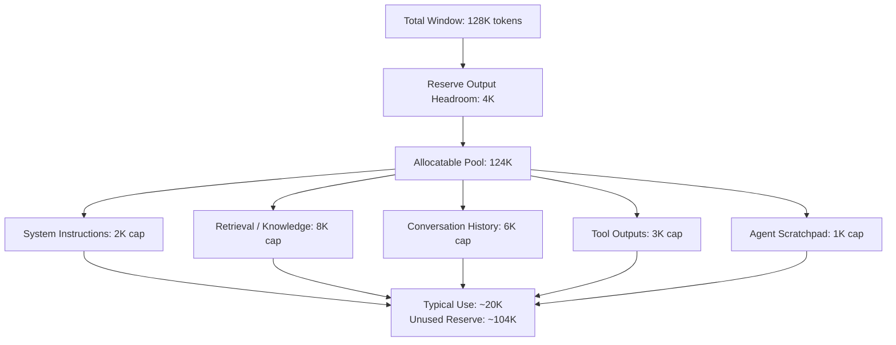
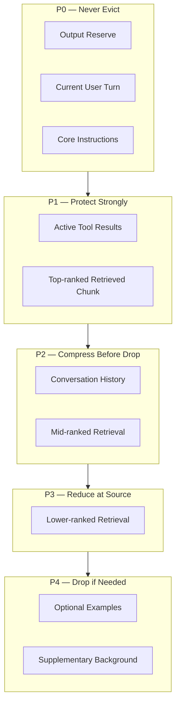
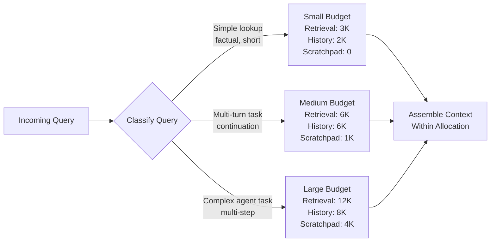
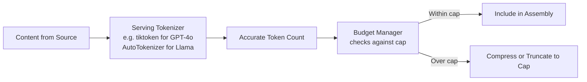
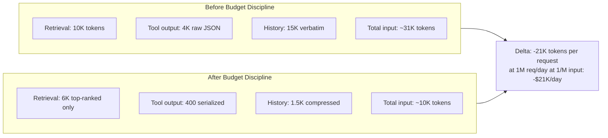

# Context Window Budgeting

## Overview

Context window budgeting is the practice of treating the model's context window as a finite, costed resource with named owners per category — and enforcing explicit allocation ceilings on every content source before assembling a request. It is the inner mechanics of [What Is Context Engineering](01-what-is-context-engineering.md): where that chapter describes the discipline, this one describes the arithmetic and policies that implement it.

The core claim is simple: without an explicit budget, every source grows to consume whatever space is available. History expands turn-by-turn. Retrieval defaults to "top-10, always." Tool outputs paste raw payloads. The result is not a crash — it is cost and quality degrading in step with product success, because longer, more active sessions and more tool calls are simultaneously signs the product is working and the mechanism by which undisciplined budgeting destroys margin.

## Definition

A context window budget is a pre-request token-count allocation across all competing content sources — system instructions, retrieved knowledge, conversation history, tool outputs, agent scratchpad — that sums to at most `window_size − output_headroom`, with the output headroom reserved first, before any source allocation. Each source is assigned a ceiling; content exceeding that ceiling triggers a defined response (compression, truncation, or retrieval reduction), not a silent overflow.

## The Window Arithmetic

Starting point for every budget design:

```
window_size = output_headroom + Σ(per_source_allocation)
```

In practice: a 128K-token window with 4K output reserve leaves 124K allocatable. A conservative multi-source product might use: 2K system instructions, 8K retrieval (top-8 chunks × ~1K/chunk), 6K compressed history, 3K tool outputs, 1K scratchpad. Total: 20K of 124K used. The 100K+ unused is not waste — it is reserve for queries that need more retrieval or longer tool chains.

The wrong framing is "we have 128K, let's use it all." The right framing is "we need 20K to answer well; the rest is reserve we might spend on unusual queries, not a target to fill by default."



## Priority Hierarchy

Not all sources are equal. Some content, if evicted, makes the response wrong by definition; other content is useful but optional. A priority hierarchy governs what survives when total requested content exceeds the budget:

| Priority | Source | Why |
|---|---|---|
| P0 — never evictable | Output headroom reservation | No room to answer is a hard failure |
| P0 — never evictable | Current user turn | The thing being answered |
| P0 — never evictable | Core system instructions | Rules the model must follow |
| P1 — protect strongly | Recent tool results, current-turn retrieval | Directly relevant to this request |
| P2 — compress before truncating | Conversation history | Long-lived but compressible to summaries |
| P3 — reduce at source | Retrieved chunks beyond top-ranked | The retriever can return less instead of truncating here |
| P4 — last to drop | Optional examples, supplementary background | Quality bonus, not answer-critical |

This hierarchy belongs in the budget manager, not assumed by each source independently.



## Static vs Dynamic Allocation

### Static allocation

A fixed-percentage or fixed-token split applied to every request, regardless of type. Simple to implement, operationally safe, and easy to audit. The correct baseline for any new product.

Example: instructions 2K, retrieval 8K, history 6K, tools 3K, output 4K — fixed for every query.

Failure mode: wastes budget on simple lookups (short history, no relevant retrieval) while starving complex multi-step tasks that need 3–5× more room across several sources.

### Dynamic allocation

A classifier or heuristic runs before assembly and adjusts per-source caps based on query type. Complex queries get more retrieval and scratchpad room; simple lookups get minimal allocations.



Failure mode: classifier errors under-serve misrouted queries. Keep the classifier cheap — a heuristic on query length, intent signals, or session history — not a second full model call.

### Reservation-first vs fill-then-trim

Two ordering philosophies:

- **Reservation-first**: declare source caps before fetching; each upstream system respects its cap at fetch time. The assembler enforces a ceiling but rarely needs to truncate.
- **Fill-then-trim**: fetch unlimited content from all sources, assemble everything, measure the total, then trim or compress until it fits.

Reservation-first is the production pattern — efficient fetching, predictable cost. Fill-then-trim is the prototype pattern — simple to wire up, but fetches content it will only discard, and creates unpredictable latency when compression triggers after a large fetch.

## Token Counting

Budget arithmetic is only as good as the token counter. Counts must use the actual serving tokenizer for the deployed model — not an estimate, not a character-count proxy, not a different model's tokenizer.



Common tokenizer pitfalls:

| Pitfall | Consequence |
|---|---|
| Character count / 4 as estimate | Off by 30–60% for code, JSON, non-English text |
| Wrong model's tokenizer | Systematic over- or under-counting; may not fail in testing |
| Counting at retrieval, not at assembly | Delimiters and formatting headers add tokens not counted at source |
| Stale tokenizer after model version swap | Tokenizers change between versions; silent budget overflow after upgrade |

The rule: call the serving tokenizer at assembly time, on the fully-formatted section including delimiters. `tiktoken.encode()` is milliseconds and the only accurate approach.

## Output Headroom

Output headroom is the token reservation for the model's generated response and, for agents, its reasoning trace. It must be reserved before any other allocation — designing the input budget first and discovering there's no room for the answer is a design bug, not a runtime edge case.

Sizing output headroom by use case:

| Use case | Recommended reserve |
|---|---|
| Short factual Q&A | 512–1,024 tokens |
| Conversational assistant | 2,048–4,096 tokens |
| Document summarization | 1,024–2,048 tokens |
| Code generation, complex | 4,096–8,192 tokens |
| Long-form report generation | 8,192–16,384 tokens |
| Agentic task with scratchpad | 4,096–8,192 tokens |

For agents: track scratchpad reservation and answer reservation separately. The reasoning trace and the final answer compete for the same token budget unless bounded independently.

## Allocation Enforcement

Declaring a cap is not the same as enforcing it. The budget manager must actively enforce ceilings, treating every upstream source as untrusted with respect to size:

- Retrievers default to "top-k regardless of total size" — 8 chunks at 2K tokens each may return 16K, not the 8K the budget assumed.
- History fetchers return the full log by default unless instructed otherwise.
- Tool calls return complete API responses without trimming.

Enforcement at three levels:

1. **Cap at fetch** — instruct the retriever, history store, and tool executor to respect a size ceiling when fetching, so content is never fetched that will only be discarded.
2. **Enforce at assembly** — count tokens for each fetched section; compress or truncate any section that exceeds its cap even after fetch-time enforcement (a second line of defence).
3. **Reject at pre-flight** — after assembly, count the total; if it exceeds `window_size − output_headroom`, that is a budget manager bug. Fail loudly and instrument.

## Cost Model

Token cost is nearly linear in tokens sent and generated:

```
request_cost = (input_tokens × input_price_per_M / 1,000,000)
             + (output_tokens × output_price_per_M / 1,000,000)
```

Mid-2025 representative prices (illustrative; vary by provider and tier):

| Tier | Input price | Output price |
|---|---|---|
| Frontier large | $2–3/M | $10–15/M |
| Frontier fast | $0.25–1/M | $1–5/M |
| Open-source self-hosted | GPU amortised cost | GPU amortised cost |

Allocation decisions map directly to daily spend. Over-retrieving by 6K tokens at $1/M input across 1M requests/day is $6K/day from a single policy choice. Serializing tool output from 4K raw tokens to 400 formatted tokens saves $3.6K/day at the same scale.



## Tradeoffs

| Approach | Advantage | Disadvantage |
|---|---|---|
| Static fixed allocation | Predictable, easy to audit, no classifier latency | Wastes budget on simple queries; may starve complex ones |
| Dynamic classification | Right-sizes allocation to query | Classifier errors mis-route; adds latency and complexity |
| Reservation-first | Fewer surprises at assembly; efficient fetching | Requires each source to accept a size limit at query time |
| Fill-then-trim | Simple to wire up; no upfront coordination | Fetches content it will discard; harder to predict cost and latency |
| Generous output headroom | Rare truncated response failures | Higher baseline cost per request |
| Tight output headroom | Lower baseline cost | Occasional truncated responses on verbose queries |

## Monitoring

- **Tokens per source per request** — track as a distribution, not just an average; p99 spikes reveal runaway sources before they hit average cost.
- **Cap breach rate per source** — how often each source exceeds its ceiling and triggers compression or truncation; a rising rate means either the policy cap is too tight or source verbosity is growing.
- **Budget utilization** — how much of the allocatable pool is actually used across request types; persistently below 30% suggests static caps are too conservative for complex queries.
- **Output headroom consumption** — how often the model generates at or near `max_tokens`; consistently hitting the ceiling means responses are being truncated, not completing naturally.
- **Cost per request by source share** — so a spend regression is attributable ("retrieval now owns 60% of input cost, up from 40%").
- **Tokenizer accuracy samples** — compare estimated token counts versus actual counts post-send; drift over 5% is a tokenizer misconfiguration bug.

## Production Best Practices

- **Reserve output headroom before anything else** — allocate answer and scratchpad room as the first step in budget construction, not as a residual.
- **Cap every source explicitly** — a source without a cap will grow to consume whatever is available; this is a guarantee, not a risk.
- **Enforce at the assembly layer, not just at the source** — treat every upstream system as untrusted with respect to size.
- **Use the serving tokenizer** — never estimate; count accurately at assembly time with the model's actual vocabulary.
- **Start static, migrate to dynamic** — a static allocation is the correct starting point; add dynamic classification once production data shows where the static split wastes or starves budget.
- **Log every eviction and compression** — a regression in answer quality must be traceable to a specific source being over-compressed or truncated.
- **Track cost and token budgets separately** — a cached prefix costs fewer billing tokens but occupies the same window space; monitor both independently.

## Real World Examples

- **Cursor** makes context management user-visible: the IDE shows which files are in context and lets users pin, include, or exclude them explicitly. This is UX-level source budgeting — the user controls what occupies the window rather than trusting a silent policy.
- **OpenAI Threads API** manages conversation history with automatic truncation behind the API: a managed implementation of history budgeting that relieves the developer from tracking token counts across turns, at the cost of reduced control over what survives truncation.
- **Anthropic `cache_control` markers** let a stable system prompt be cached at a discounted billing rate. This is a cost-budget lever: the window footprint of the system prompt is unchanged, but its billing cost is reduced by 50–90% on cache hits — illustrating why cost and token budgets must be tracked separately.

## Interview Questions

### Beginner

**Q: Why is it important to reserve output headroom before allocating input budget?**
If you allocate all input tokens first and check output room only afterward, you may find there's no room left for the model to generate a response — a hard failure, not a quality tradeoff. Reserving headroom first ensures the model always has room to answer; all input allocations happen in whatever space remains.

**Q: What happens if you use a character-count estimate instead of an accurate tokenizer for budget management?**
Token counts vary widely by content type — code, JSON, and non-English text can be 50–100% denser than prose at the same character count. Inaccurate estimates lead to either chronic under-utilization (wasting capacity) or silent budget overflow (truncating content or causing API errors), with no signal about which is happening.

### Intermediate

**Q: History is growing unboundedly in production and causing budget overruns — how do you fix this without losing conversation continuity?**
Add an explicit history cap and a compression fallback. Enforce the cap in the budget manager: if history exceeds its allocation, compress older turns into a rolling summary before assembly. The model sees the summary plus recent verbatim turns, preserving continuity without unbounded growth. Track the eviction rate to know when the cap needs recalibrating.

**Q: How do you test that your token budget is accurate across a model version upgrade?**
Before the upgrade, sample a representative set of assembled prompts and record actual post-send token counts from the API response metadata. After the upgrade, re-run the same samples with the new tokenizer and compare. Any systematic difference is a budget bug; correct the tokenizer before full rollout.

### Senior

**Q: Tool outputs are the largest source of budget overruns — how do you address this systematically?**
At three levels: schema design, serialization, and assembly enforcement. Schema design: tool responses should return only what the model needs — IDs, key fields, status — not complete API payloads. Serialization: write a structured formatter for each tool's output, not a raw JSON paste. Assembly enforcement: apply a hard cap at the assembly layer; if the formatted output still exceeds the cap, truncate the least-relevant fields, log what was dropped, and never silently allow expansion.

**Q: When would you choose dynamic allocation over static, and what is the cheapest way to implement the classifier?**
Dynamic allocation is worth the complexity once production data shows request types have systematically different optimal allocations — visible as either chronic budget over-use on simple queries or cap breaches on complex ones. The cheapest classifier is a heuristic on observable signals: query length, presence of tool invocations in prior turns, or explicit instruction type ("summarize this document" needs more output room than "what's the capital of France"). A heuristic adds under 1ms; a second model call for routing adds 50–200ms and competes with the main call's latency target.

### Staff

**Q: Design a budget governance model for an enterprise AI platform where 50+ teams each want to add their own context source.**
Each team registers a source with an explicit token allocation and a cost-attribution tag. New sources must go through an eval-gated intake: demonstrate on a held-out evaluation set that the source improves outcomes before claiming a window slice. Total registered allocations are audited against the agreed window size; a policy-as-code governance layer adjudicates conflicts. Cost is attributed per source tag so over-spending is traceable to the responsible team without requiring the platform team to police every source's runtime behavior.

## Google-Level Follow-Ups

- "Static allocation is causing complex queries to underperform but you can't add classifier latency — what do you do?" — probes for adaptive allocation via session history signals: route based on prior turns' observed token consumption, or retry with a larger allocation when a quality check flags a suspiciously short answer.
- "Token budgeting is working but per-request cost doubled after a product feature launch — how do you diagnose?" — probes for cost-attribution instrumentation; the root cause is only visible if per-source cost is tracked independently, not blended into an average.
- "Design a budget system that is fully testable end-to-end without live API calls." — probes for a token-count-accurate offline assembler, per-source mock fixtures, and budget-overflow detection as a standalone test suite with known-size synthetic inputs.

## Common Mistakes

- **Designing the input budget first, discovering there's no room for the answer** — reserve output headroom first, always.
- **Treating the token limit as a target to fill rather than a ceiling** — unused budget is not waste; filling it without a quality reason adds cost and latency.
- **Using character count / 4 as the token estimate** — inaccurate enough to cause budget overflows or under-utilization in production.
- **No per-source cap enforcement at the assembly layer** — a cap is a declaration, not a guarantee, until it is enforced at the point content is assembled.
- **Static allocation that never changes after launch** — optimal splits shift as feature launches change content volumes; review the budget against production token distribution quarterly.
- **Compressing at assembly when retrieval could have returned less** — fixing over-retrieval downstream at the assembly layer is inefficient; reduce retrieval at the source.

## Key Takeaways

- The context window is a budget with named owners: every source gets an explicit cap, not a residual "whatever's left."
- Reserve output headroom first — discover the answer's room before allocating content.
- Token counting must use the actual serving tokenizer at assembly time; estimates drift and models change tokenizers on updates.
- Static allocation is the correct starting point; dynamic allocation by query type is the production optimization once you have evidence the static split is suboptimal.
- Enforcement must happen at the assembly layer, treating every upstream source as untrusted with respect to size.
- Each misallocated token at production scale translates to measurable daily spend; budget decisions are cost decisions.
