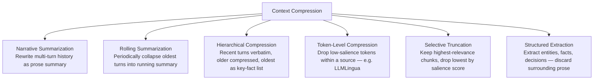
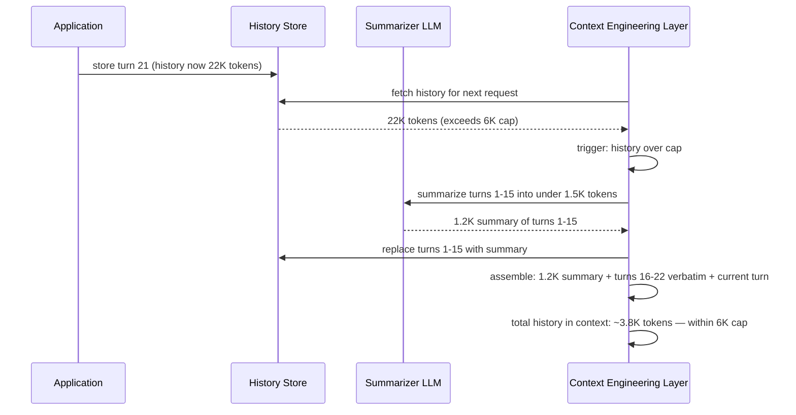
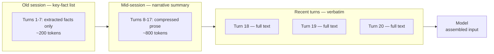
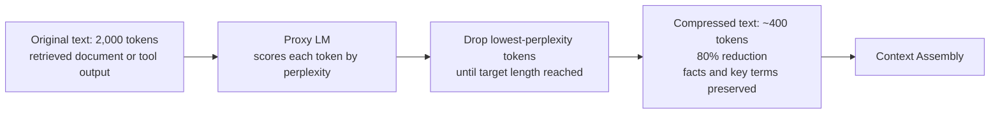
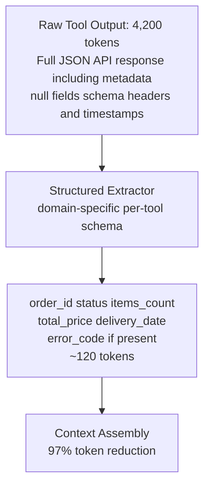
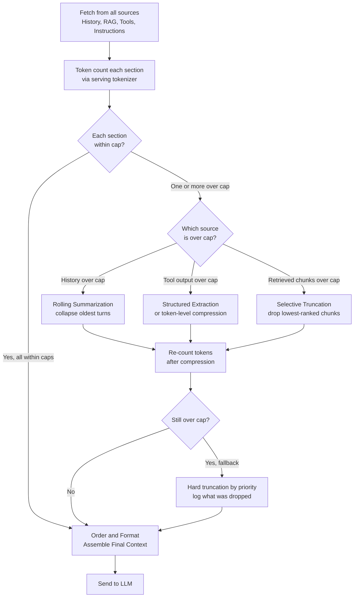
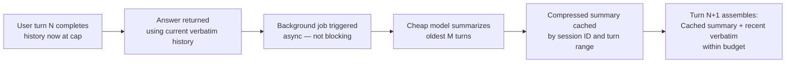

# Context Compression & Summarization

## Overview

Context compression is the set of techniques for reducing the token footprint of content that must remain in the context window — keeping information present without keeping every original token. It is the alternative to truncation (which drops content entirely) and retrieval reduction (which asks the retriever to return less to begin with). Compression trades fidelity for fit: the core meaning survives at a fraction of the original token cost, with some information loss that must be bounded, measured, and accepted deliberately.

Compression is triggered by the budget manager when a source exceeds its allocation but cannot simply be omitted. The canonical candidate is conversation history: a long-running session must carry conversation state, but carrying it verbatim makes cost a function of session length — the exact behavior a budget prevents. Compression transforms unbounded-cost history into a bounded, controlled one.

## Definition

Context compression is the process of rewriting or selecting from a content source to produce a shorter representation that preserves the facts, instructions, and context most relevant to the current query, within a target token budget. It is distinct from truncation (removing content with no replacement) and summarization (which can refer specifically to the narrative-summary compression technique, a subset of the general category).

## Why Compression Exists

A long-running agent session or conversation accumulates tokens regardless of whether earlier content remains relevant. Without compression, three failure modes compound:

1. **Budget overflow** — history grows past its allocation, forcing truncation of recent turns or retrieval, degrading current-query quality.
2. **Cost unboundedness** — per-request input cost rises with session length, making long conversations disproportionately expensive.
3. **Lost-in-the-middle degradation** — even if the model can technically attend to a full 50-turn history, content buried mid-context is attended to less reliably than content near the endpoints (see [Context Rot & Failure Modes](05-context-rot-and-failure-modes.md)).

Compression addresses all three: it controls size, controls cost, and keeps the essential state in a form the model is more likely to use correctly.

## Compression Taxonomy

## Technique 1 — Rolling Summarization

The most common pattern for conversation history. A rolling summarization runs on a trigger (every N turns, or when history exceeds X tokens) and collapses the oldest M turns into a compact narrative summary, which replaces those turns in the assembled context going forward.

Key design decisions:

- **Trigger point** — compress when history exceeds a token cap, not on a fixed turn count. A cap-based trigger stays within budget regardless of how verbose each turn is.
- **Summarizer model** — use a fast, cheap model (not the frontier model answering the user's question) for the summarization call. A $0.25/M model summarizing history instead of a $3/M model is a 12× cost reduction on the compression step alone.
- **What to preserve in the summary** — facts established, decisions made, tasks completed or attempted, constraints stated by the user. Conversational pleasantries and failed attempts can be omitted.
- **What to keep verbatim** — the most recent 3–5 turns, always. These contain the live task state and the user's current framing.

## Technique 2 — Hierarchical Compression

Hierarchical compression divides history into tiers, each with a different fidelity level, rather than applying uniform compression across all old turns. Recent content is kept verbatim; older content is summarized; the oldest content is extracted to a list of key facts only.

This maps to how memory actually works: full fidelity for what just happened, compressed state for the arc of the session, sparse facts for distant context. The tradeoff is a two-level compression overhead (two summarization calls to maintain the mid and old tiers), which is usually justified when sessions run beyond 30–40 turns.

## Technique 3 — Token-Level Compression

Narrative summarization rewrites whole turns. Token-level compression operates within a single source — a long retrieved document, a verbose tool output, or a dense history turn — by identifying and removing tokens that contribute little to the model's ability to answer the current query.

**LLMLingua / LongLLMLingua** (Microsoft Research) is the most studied open-source implementation:

1. Score each token in the source for perplexity given a small proxy language model — tokens the model is least surprised by carry less unique information.
2. Drop the lowest-perplexity tokens until the target token count is reached.
3. The resulting text is not grammatically complete prose — it looks like telegraphic compressed text — but preserves factual content at 3–5× compression ratios with measured quality degradation lower than truncation at the same ratio.

When to use token-level compression vs narrative summarization:

- **Narrative summarization**: preferred for conversation history — multi-turn dialogue benefits from a rewritten prose narrative more than telegraphic token drops.
- **Token-level compression**: preferred for dense retrieved documents, code, and structured data where telegraphic preservation is acceptable and a rewrite might introduce hallucinated facts.

## Technique 4 — Structured Extraction

Instead of compressing the prose, extract the structured information and discard the rest. For tool outputs returning JSON API responses, for example, extract only the fields the model actually needs (status, relevant IDs, key values) and omit the surrounding schema, null fields, metadata, and verbose error objects.

This is most powerful for tool outputs, where:
- The full response payload may be 5,000–30,000 tokens.
- The model needs 2–5 fields to answer the current query.
- Writing a per-tool schema extractor is a one-time engineering cost that pays back on every call.

See [Function Calling Architecture](../13-tool-calling/01-function-calling-architecture.md) for how to design tool response schemas to return the right fields by default, reducing the need for post-hoc extraction.

## Technique 5 — Selective Truncation

When the source cannot be summarized or extracted — raw code, exact numeric data, verbatim legal text — the only lossless option is dropping it. Selective truncation keeps the highest-relevance content and drops the lowest, using a salience score:

- **Retrieval chunks**: already ranked by relevance score; truncate from the bottom of the ranked list first.
- **Conversation history**: truncate oldest turns first (time-based relevance decay), but never truncate the current turn or the most recent few.
- **Tool outputs that can't be summarized**: truncate to the top N characters of the payload with a visible "[truncated]" marker — the model should know it has incomplete data.

Selective truncation is the last resort within a source; narrative summarization and extraction are preferable whenever the content type allows them.

## Compression Pipeline Placement

The pipeline always re-counts after compression — a summarizer can exceed its output budget too, and the re-count enforces the cap even on the compressor's output.

## Measuring Information Loss

Compression without measurement is a guess. Measure what the compression actually preserves:

| Metric | How to measure | What it catches |
|---|---|---|
| **Factual recall** | Ask a set of factual questions answerable from the original; score against answers from uncompressed version | Facts dropped by aggressive compression |
| **Task continuity** | Continue a multi-turn task after compression; measure success rate vs uncompressed baseline | Compression losing task state |
| **LLM-as-judge quality score** | Use a judge model to compare responses to the same query with and without compression | General quality degradation |
| **Answer correctness on benchmark** | Run a held-out eval set with and without compression, compare exact-match or F1 | Regression vs a ground-truth answer |
| **Compression ratio achieved** | `compressed_tokens / original_tokens` | Whether compression is meeting its budget target |

The key decision: what compression ratio is acceptable given measured quality loss? A 5× compression with 2% quality loss is usually worth it; a 5× compression with 15% quality loss means the compressor is losing critical content and the strategy needs to change.

## Tradeoffs

| Technique | Best for | Token reduction | Fidelity risk |
|---|---|---|---|
| Rolling narrative summarization | Conversation history | 5–20× | Moderate — facts preserved, nuance may be lost |
| Hierarchical compression | Long multi-tier sessions | 8–30× | Higher on oldest tiers |
| Token-level compression (LLMLingua) | Dense documents, code | 3–5× | Low-moderate — benchmarked, not rewritten |
| Structured extraction | Tool outputs, structured data | 10–100× | Very low if schema is correct; high if schema misses key fields |
| Selective truncation | Ranked retrieval lists | Proportional to k reduction | Lossless for kept content; total loss for dropped content |

Summarization introduces the risk of hallucination in the summary itself — the compressor LLM may confuse or omit facts. Token-level compression avoids this risk by never rewriting content, only selecting tokens.

## Compression at Scale

At high QPS, the compression step must not become a bottleneck:

- **Compress asynchronously** — trigger compression in the background after a session threshold is crossed, not inline during the user's next request. The user's request uses the current verbatim history; the compression result is ready for the following turn.
- **Cache compressed summaries** — the summary of turns 1–15 does not change between requests. Cache it by session ID and turn range; reuse it until those turns change.
- **Use a fast, cheap compressor model** — the compression model's cost should be a small fraction of the main model's cost. A 50ms compression call on a fast-tier model is acceptable; a 400ms compression call on a frontier model that costs as much as the main call is not.
- **Compress at session boundaries** — if a user returns to a session after a gap, trigger re-compression of the full prior history before the next turn rather than accumulating compression debt turn-by-turn.

At high QPS, the pattern looks like this:

## Monitoring

- **Compression trigger rate** — how often per session compression fires; a rising rate signals history is growing faster than the cap allows.
- **Compression ratio achieved vs target** — did the compressor actually reach the target token count, or is it over-running it?
- **Compressor latency** — a spike here means compression is becoming a request-path bottleneck; time to move it off-path.
- **Post-compression quality drift** — compare LLM-as-judge quality scores on compressed vs uncompressed sessions periodically; a widening gap is the signal to tighten the summarization prompt.
- **Compression hallucination rate** — sample compressed summaries and verify factual accuracy against the original turns; even a small hallucination rate in the summary compounds over a long session.

## Production Best Practices

- **Prefer extraction over summarization for structured sources** — a per-tool schema extractor has no hallucination risk and achieves better compression ratios; reserve summarization for unstructured prose history.
- **Always mark what was compressed** — the model should know it is seeing a summary, not a verbatim record ("The following is a summary of the first 15 turns of this conversation."); this calibrates its confidence in historical details.
- **Cap the compressor's output** — a summarization prompt with no output length constraint can produce a summary longer than the original; enforce the target token count.
- **Use a cheap model for compression, the main model for generation** — the compressor needs factual accuracy, not frontier reasoning ability; price accordingly.
- **Test compression on your worst-case sessions** — the sessions that have run longest, with the most tool calls and the most complex task state; those are where compression failure shows up first.
- **Don't compress the last 3–5 turns** — recent history is the live task state; compressing it risks losing the context the current turn depends on.

## Real World Examples

- **ChatGPT memory** — rather than compressing a full conversation verbatim, ChatGPT's memory feature selectively extracts facts the model should remember across sessions. This is structured extraction (key facts) rather than narrative summarization, avoiding the hallucination risk of rewriting multi-turn prose.
- **Zep** and **Mem0** (open-source memory frameworks) implement rolling summarization with an explicit entity graph — they extract both the narrative summary and a structured set of entities (people, tasks, facts), giving downstream retrieval a structured signal on top of the prose summary.
- **LangChain `ConversationSummaryMemory`** is a drop-in rolling summarizer that calls a model on history when it exceeds a token threshold, replacing the oldest turns with a progressively-updated summary — the simplest production implementation of the rolling pattern.

## Interview Questions

### Beginner

**Q: When should you compress context rather than simply truncating it?**
When the content cannot be omitted entirely — conversation history that carries task state, for example — but cannot fit within its budget verbatim. Compression keeps the essential meaning at a fraction of the token cost; truncation discards content entirely and accepts total information loss for whatever is dropped. Compress when lossy fidelity is better than no fidelity.

**Q: What is the hallucination risk of narrative summarization and how do you mitigate it?**
A summarizer LLM may confuse facts, merge events that didn't co-occur, or invent details not in the original turns. Mitigate by: using the summarization prompt to instruct the model to be conservative ("If unsure, omit rather than invent"), sampling compression results and spot-checking against originals in monitoring, and preferring structured extraction over narrative summarization for tool outputs and factual records where hallucination in the summary would corrupt downstream reasoning.

### Intermediate

**Q: How do you choose between token-level compression (like LLMLingua) and narrative summarization for a retrieved document?**
Token-level compression preserves the original phrasing without rewriting, avoiding hallucination, and is benchmarked to preserve factual content at 3–5× compression ratios. Narrative summarization rewrites the content as prose, which can be more readable and more flexible but risks introducing errors. For retrieved factual documents (specifications, legal text, technical docs), use token-level compression — factual preservation matters more than readability. For conversation history (unstructured multi-turn dialogue), narrative summarization is more natural and the quality risk is lower because the summary's role is to preserve task state, not exact phrasing.

**Q: How do you keep compression from becoming a latency bottleneck on a high-QPS API?**
Move compression off the critical request path: trigger it asynchronously in the background when a session exceeds the history threshold, so the result is ready for the following turn rather than blocking the current one. Cache compressed summaries by session ID and turn range — they do not change between requests until new turns are added. Use a fast, cheap model tier for the compression call; the latency target for compression is under 100ms on a dedicated fast-tier model.

### Senior

**Q: You discover that compressed history summaries are introducing subtle factual errors that downstream LLM responses then repeat — how do you diagnose and fix this?**
Diagnose: compare a sample of live session responses where compression fired against sessions of the same length where it didn't fire; LLM-as-judge the response quality difference and spot-check the intermediate summaries for factual accuracy against original turns. Root causes are usually: the summarization prompt didn't instruct conservative omission, the compressor is using too small a model for the content complexity, or the compression ratio target is too aggressive and the model is filling gaps. Fix: tighten the summarization prompt, switch to token-level compression for factual-heavy content types, and loosen the compression ratio target — accept slightly larger summaries to preserve accuracy.

**Q: Design a compression strategy for a long-running coding agent that calls tools frequently and produces hundreds of tokens of output per step.**
Apply compression at three levels: tool output (structured extraction per tool, targeting 5–10% of the raw payload), agent reasoning trace (keep the last 3 steps verbatim, compress earlier steps to decision summaries — "Ran test suite, 4 failures identified in auth module"), and conversation history (rolling summarization triggered when history exceeds its cap, preserving task goal, constraints, files modified, and current blocking issue). Never compress the most recent tool result or the current user instruction; those are the live task state.

### Staff

**Q: At scale, when would you invest in building a custom compressor model rather than using a general-purpose LLM for summarization?**
When the content domain has highly consistent structure (legal contracts, code reviews, financial reports), a fine-tuned domain-specific compressor can achieve higher compression ratios with better factual preservation and lower latency than a general-purpose model prompted ad hoc. The breakeven is roughly: if you're spending over $50K/month on compression model calls and a 10K fine-tuning run would cut that cost by 40%, the investment is justified in under a month. The second trigger is hallucination rate — if generic summarization is introducing errors that cost more in downstream quality than the compression savings gain, a domain-specific model with explicitly constrained output is the fix.

## Google-Level Follow-Ups

- "Your summarizer is adding latency to p99 of the user-facing request — what is the architecture change?" — probes for async off-path compression: pre-compress at session boundary, not inline; cache the summary for subsequent turns.
- "LLMLingua achieves 5× compression with 3% quality loss. What additional information would you need before committing to it in production?" — probes for eval depth: 3% on which benchmark, for which query types, at what compression ratio — and whether that 3% loss is uniform or concentrated in a specific content category (e.g., numeric facts, proper nouns) that is critical for your use case.
- "If you had to guarantee zero information loss in compression, what would you do?" — probes for understanding the tradeoff clearly: zero loss with reduced tokens is impossible by definition; the answer is either "don't compress, retrieve less" or "use retrieval-based recall (store full content, retrieve the right piece) rather than lossy in-context compression."

## Common Mistakes

- **Compressing everything at a fixed schedule** — compressing turns before they exceed the budget wastes computation and introduces fidelity loss with no benefit; compress only when a source exceeds its cap.
- **Using the frontier model for summarization** — the compression step should use the cheapest model that meets quality requirements; using the same model as the main generation call multiplies cost.
- **Not marking what was compressed** — passing a summary to the model without identifying it as a summary causes the model to treat it as verbatim record and over-trust it.
- **Ignoring compressor hallucination rate** — narrative summarization has non-zero hallucination risk; not measuring it is a quality blind spot that compounds over long sessions.
- **Setting a compression ratio target without measuring quality at that ratio** — the ratio and the quality loss are a package; a 10× compression that degrades quality by 20% is not a useful trade.
- **Compressing the most recent turns** — the last 3–5 turns contain the live task state; compressing them loses current context, which is worse than compressing old history.

## Key Takeaways

- Compression is the alternative to truncation when content must remain present but cannot fit verbatim; it trades some fidelity for a bounded, predictable token footprint.
- Rolling summarization handles conversation history; structured extraction handles tool outputs; token-level compression handles dense documents — match the technique to the content type.
- The compressor model should be cheap and fast; the quality requirement is factual accuracy, not frontier reasoning.
- Measure information loss before deploying a compression strategy; the acceptable ratio depends on the domain and the consequence of losing specific facts.
- Move compression off the critical request path at scale: trigger asynchronously, cache results by session and turn range.
- Every compression decision must be logged and traceable; quality regressions in compressed sessions should be diagnosable to a specific source and a specific compression decision.
