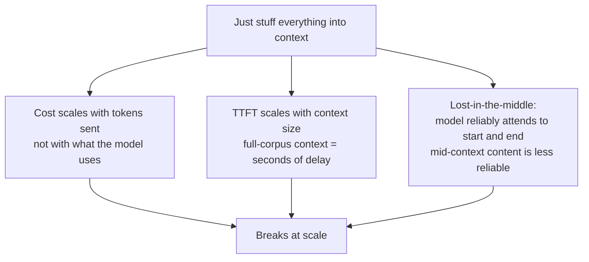
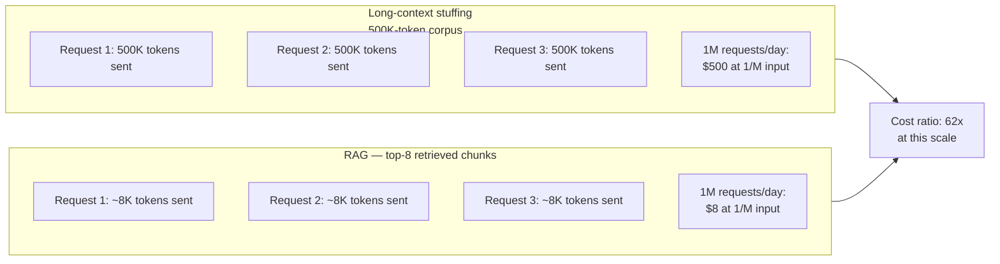
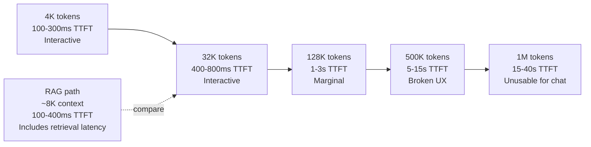
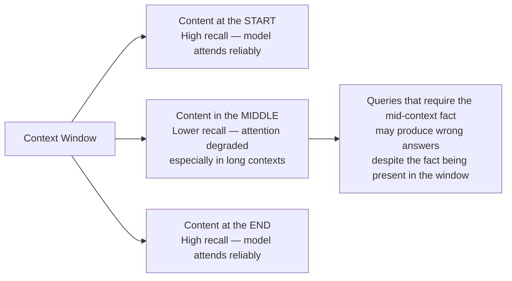
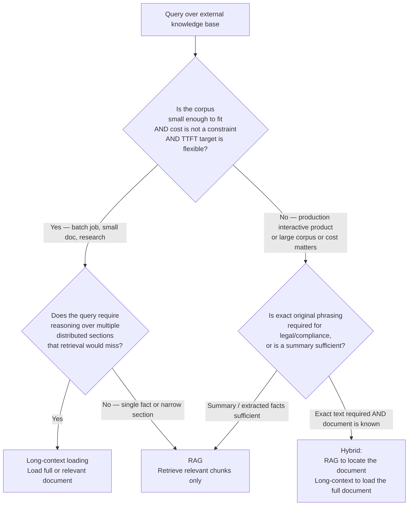
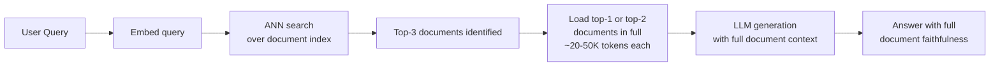
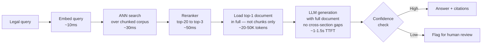

# Long Context vs RAG

## Overview

The release of models with 128K, 200K, and 1M+ token context windows triggered a common question among practitioners: if a model can hold an entire codebase, legal corpus, or knowledge base in its context window, why build retrieval-augmented generation at all? This chapter answers that question precisely — not with "bigger window is always better" or "RAG always wins," but with a principled decision framework grounded in cost, latency, and the non-obvious failure modes of each approach.

The short answer: larger context windows did not eliminate RAG, and the reasons are structural, not temporary.

## Definition

**Long-context stuffing**: loading all potentially-relevant content into the context window on every request, relying on the model's attention mechanism to identify what matters.

**RAG (Retrieval-Augmented Generation)**: retrieving only the content relevant to the current query — using an embedding search, keyword index, or reranker — and loading only the retrieved subset into context.

Both approaches aim to give the model access to knowledge beyond its training cutoff and proprietary data. They differ fundamentally in *what enters the context window* and *at what cost per query*.

## The Naive Argument and Why It Breaks

The naive case for stuffing everything into context:

> "A 1M-token window can hold our entire 800K-word knowledge base. Why build retrieval at all? Just put everything in and let the model find what it needs."

This breaks at scale for three independent reasons:

Each reason is independent — solving one doesn't solve the others.

## Cost Analysis

Input token cost is paid for every token sent, regardless of whether the model uses that token in producing its answer. Stuffing a 500K-token corpus into every query means paying for 500K input tokens on every request.

At $1/M input tokens and 1M requests/day:

| Approach | Input tokens/request | Daily input cost |
|---|---|---|
| Full corpus stuffing (500K tokens) | 500,000 | ~$500/day |
| Long-context (only relevant doc, 50K tokens) | 50,000 | ~$50/day |
| RAG top-8 chunks (~8K tokens) | 8,000 | ~$8/day |
| RAG top-3 chunks (~3K tokens) | 3,000 | ~$3/day |

The cost difference is not marginal — it is 60–170× across these configurations. At any meaningful production scale, this difference is the deciding constraint.

## Latency Analysis

Time-to-first-token (TTFT) scales with input context size. The attention computation in the prefill phase is O(n²) in the sequence length for standard attention — doubling the context more than doubles prefill time. Providers partially mitigate this with FlashAttention and hardware parallelism, but the fundamental relationship holds: more input tokens → longer TTFT.

| Context size | Typical TTFT (frontier API, mid-2025) |
|---|---|
| 4K tokens | 100–300ms |
| 32K tokens | 400–800ms |
| 128K tokens | 1–3 seconds |
| 500K tokens | 5–15 seconds |
| 1M tokens | 15–40 seconds |

For interactive products (chat, copilots, search), 5–40 seconds of TTFT before any streaming output begins is product-defining latency — most users experience this as a broken page load, not a slow response. RAG adds retrieval latency (50–200ms for embedding + ANN search + reranking) but keeps TTFT in the 100–400ms range by delivering a small, targeted context to the model.

## The Lost-in-the-Middle Problem

Large context windows give the model *room* to hold information, but they do not guarantee the model *reliably uses* everything in that room. Research (Liu et al. 2023, "Lost in the Middle") demonstrated that language model performance on retrieval tasks degrades significantly for content placed in the middle of long contexts, even when that content is technically within the window.

The implication: a RAG system that retrieves the relevant chunk and places it near the beginning or end of a short context window is *more reliably attended to* than the same chunk buried in the middle of a 500K stuffed context — even though the large window model technically "has" the information.

## When Long Context Wins

Despite its costs, long-context loading is the right choice in specific, well-bounded scenarios:

| Scenario | Why long context wins |
|---|---|
| **Document of unknown structure** — a long contract, report, or spec where you can't predict which sections are relevant | Retrieval needs a query to match against; if the question spans multiple unknown sections, retrieval may miss the join |
| **Exact source material required** — legal, medical, or compliance contexts where a RAG summary isn't enough; the model must reason over exact original text | Retrieval delivers an excerpt; the model may need the full surrounding text for correct interpretation |
| **Entire codebase reasoning** — "Why is this test failing?" may require seeing multiple files, their dependencies, and the test simultaneously | Retrieval returns isolated snippets; the multi-file dependency context is lost |
| **Needle-in-a-haystack tasks with a small corpus** — a dataset small enough that full context is affordable and the relevant fact is highly specific | Retrieval's embedding similarity may not match a highly specific or unusual phrasing |
| **One-time batch jobs, not interactive queries** — processing, extracting, or summarizing a corpus where latency is not a user-facing constraint | 15-second TTFT doesn't matter for an overnight batch job |

## When RAG Wins

RAG is the right default for the vast majority of production AI systems:

| Scenario | Why RAG wins |
|---|---|
| **Large corpora** — more than a few hundred pages, growing over time | Full stuffing is prohibitive in cost and latency; retrieval scales independently of corpus size |
| **Interactive latency requirement** — chat, copilots, search; TTFT must be under 1–2 seconds | Full stuffing TTFT is incompatible with interactive UX at corpus scale |
| **Cost constraint** — at any meaningful production QPS, stuffing dominates budget | RAG's 60–170× cost advantage determines ROI |
| **Many queries need only a small slice** — factual Q&A, reference lookups, knowledge-base search | Stuffing pays for the entire corpus to answer a query that needs 3 chunks |
| **Freshness and dynamic knowledge** — new content can be indexed and retrieved immediately | Adding content to a stuffed context means rebuilding a larger prompt; indexing is incremental |
| **Attribution and citations** — RAG knows which chunks produced the answer | Stuffed context makes attribution difficult — the model attended to some unknown subset |

## The Decision Framework

## Hybrid: RAG + Long Context

The most powerful production pattern combines both:

1. **Retrieve to locate** — use RAG to identify the 1–3 most relevant documents or sections from a large corpus.
2. **Load in full** — pass the identified document(s) in full to the model, rather than just the retrieved chunks, when the query requires broader document context.

This pays retrieval latency (50–200ms) to find the right document, but then loads it fully to avoid the mid-document fragmentation that chunk-only RAG introduces on questions that span sections.

The tradeoff: loading full documents costs more than loading only chunks, but much less than loading the entire corpus; and it produces more faithful answers than chunk-only RAG on cross-section queries.

## Cost and Latency Comparison Table

| Approach | Input tokens per query | TTFT | Corpus freshness | Attribution quality |
|---|---|---|---|---|
| Full corpus stuffing | Entire corpus (500K–1M+) | 10–40s | On prompt rebuild only | Poor — implicit |
| Long-context (single doc) | 10K–200K | 1–8s | Requires doc update | Good within doc |
| RAG top-k chunks | 3K–15K | 100–400ms | Real-time indexing | Excellent — chunk-level |
| Hybrid RAG + full doc load | 20K–100K | 500ms–2s | Real-time indexing | Excellent — doc-level |

## Tradeoffs

| Factor | Long-context stuffing | RAG |
|---|---|---|
| Corpus coverage | Complete — model sees everything | Only retrieved content — can miss if retrieval fails |
| Cost per query | Very high and fixed | Low and targeted |
| TTFT | Seconds to tens of seconds | Hundreds of milliseconds |
| Recall reliability | Degrades mid-context | High for the retrieved chunk; zero for non-retrieved content |
| Corpus freshness | Requires context rebuild | Incremental indexing |
| Attribution | Implicit — unknown which tokens mattered | Explicit — the retrieved chunks are the source |
| Engineering complexity | Lower — no retrieval pipeline | Higher — indexing, embedding, ANN, reranking |
| Multi-document reasoning | Natural | Requires chunk design to preserve cross-doc context |

## Cost Optimization

- **Use long context only where it uniquely wins** — not as a convenience to avoid building retrieval; reserve it for the specific cases in the decision framework above.
- **Cap the long-context load size** — even when loading a full document, truncate at a reasonable ceiling (e.g., 50K tokens) and retrieve additional context if needed, rather than loading an unbounded document.
- **Prompt caching for repeated long-context loads** — if the same document is loaded repeatedly across requests (e.g., a shared knowledge document), apply prompt caching to amortize its prefill cost across all requests that include it.
- **In hybrid RAG+long-context**: retrieve to narrow to the right document first, then load in full — pay retrieval cost once to avoid full-corpus stuffing cost on every query.

## Monitoring

- **Cost per request, by approach** — track which requests are using long-context vs RAG paths; an unexpected shift toward long-context loading is a cost regression.
- **TTFT by context size** — monitor the distribution of TTFT segmented by assembled context size; a growing p99 TTFT with no query volume change is a signal that context sizes are creeping up.
- **Retrieval precision at k** — for RAG paths, measure how often the correct answer was in the retrieved top-k; below 80% precision signals retrieval is missing relevant content, which can tempt teams toward long-context stuffing as a workaround instead of fixing retrieval.
- **Answer accuracy on cross-section queries** — specifically test queries that require reasoning across multiple sections; this is where chunk-only RAG most often fails relative to long-context.

## Real World Examples

- **Cursor** takes a hybrid approach: embeddings-based retrieval to identify relevant files, then loads those specific files in full — not the entire repository — giving the model full file context without corpus-scale cost.
- **NotebookLM** (Google) uses long-context loading for user-uploaded documents: the corpus is user-controlled, small enough to fit in a large window, and the user expects the model to reason holistically over the document — a case where RAG's chunking would lose cross-section coherence.
- **Enterprise RAG platforms** (Glean, Coveo, Guru) almost universally use RAG over long-context stuffing for enterprise knowledge bases, where corpora run to millions of documents and interactive latency is non-negotiable.
- **GPT-4o on files** — OpenAI's file analysis in ChatGPT uses a tiered approach: short documents load in full, long documents trigger retrieval-based analysis — a product-level implementation of the decision framework.

## Interview Questions

### Beginner

**Q: Why can't you just use a 1M-token context window instead of building a RAG system?**
Three independent reasons: cost (1M tokens sent per query at production scale is prohibitively expensive regardless of token pricing), latency (prefill for 1M tokens takes 15–40 seconds before any output streams), and quality (content placed in the middle of very long contexts is attended to less reliably than content placed at the start or end, per "lost in the middle" research). RAG avoids all three by retrieving only the ~8K tokens relevant to the query.

**Q: What is "lost in the middle" and why does it matter for long-context decisions?**
Long-context LLMs attend more reliably to content at the beginning and end of the context window than to content in the middle, even when mid-context content is technically within the window. For retrieval tasks, this means a relevant fact placed mid-context in a large stuffed window may be missed, producing an incorrect answer despite the model "having" the information. RAG avoids this by delivering a small context where relevant content can be placed at the beginning or end.

### Intermediate

**Q: Design a system that must serve queries over a 50GB legal document corpus with sub-2-second response time and 99.9% factual accuracy. Which approach, and why?**
RAG with a hybrid refinement. The corpus is too large for long-context stuffing (cost, latency). Use dense retrieval over chunked documents for candidate selection, reranking for precision, and then load the top-ranked document in full (not just chunks) for the LLM generation step — this handles questions that span sections of a single document. The "99.9% factual accuracy" target requires an explicit eval-and-monitor loop on legal-specific test cases, with a fallback to human review for low-confidence answers. Long-context is used at the document level, not the corpus level.

**Q: A team wants to switch from RAG to long-context loading to "simplify the stack" — when is this a good trade and when is it not?**
It is a reasonable trade when: the corpus is small and stable (fits within budget at the target QPS), latency is flexible (the use case is not interactive), and multi-section reasoning is frequent enough that chunk-based retrieval is producing real quality problems. It is a bad trade when: the corpus is large and growing (cost scales with corpus size on every request), the product is interactive (TTFT at corpus scale fails the UX requirement), or retrieval precision is actually fine and the motivation is engineering convenience rather than a quality signal.

### Senior

**Q: How do you evaluate whether RAG or long-context produces better answers for your specific domain?**
Create a gold-standard test set of 100–200 queries where you know the correct answer and which part of the knowledge base contains it. For each query, run both approaches and score: factual accuracy (exact match or LLM-as-judge against the gold answer), citation correctness (did the cited source actually support the answer), and performance on cross-section queries specifically. Add latency and cost measurement. The test set should include queries that span multiple sections — this is where the approaches diverge most, and where the decision framework's "full-document reasoning" criterion maps to a measurable outcome.

### Staff

**Q: You are designing a platform that must support both interactive chat queries over a 100M-document enterprise corpus and batch analytical queries over curated small document sets. How do you architect the retrieval and context strategy to serve both?**
Treat them as separate request paths, not one system trying to do both. Interactive chat: RAG over the full corpus with vector + keyword hybrid retrieval, top-8 chunks, strict TTFT SLA. Batch analytical: classify at the API layer by request type; small curated sets load their documents in full per the long-context path with no TTFT constraint. The context engineering layer applies different budget policies per path — the interactive path enforces a strict 8K retrieval cap, the batch path allows up to the model's window limit for the specified document set. Cost accounting separates the two paths since cost profiles are completely different.

## Google-Level Follow-Ups

- "Retrieval precision for your RAG system is 85% — the 15% miss rate drives quality incidents. Would you fix retrieval or switch to long-context?" — probes for fixing the root cause vs avoiding it; the right answer is: fix retrieval (better reranking, chunk design, query expansion), because long-context is not a reliable substitute for retrieval that doesn't find the right content.
- "If model providers eliminated the cost of input tokens tomorrow, would RAG still be worth building?" — yes: TTFT from large context and lost-in-the-middle degradation persist regardless of pricing; and retrieval provides attribution, citation, and the ability to update knowledge incrementally without rebuilding prompts.
- "Design a benchmark to measure 'lost in the middle' in your specific knowledge base." — probes for test construction: insert a specific fact at position 0%, 25%, 50%, 75%, and 100% of a fixed-length context, ask a question requiring that fact, measure accuracy as a function of position.

## Common Mistakes

- **Treating large context as a retrieval replacement rather than a retrieval complement** — large windows are a tool; retrieval precision determines whether the right content reaches the model, regardless of window size.
- **Ignoring TTFT at the corpus sizes under consideration** — testing with a 10K-token context and planning to scale to 500K-token contexts without re-benchmarking TTFT is a planning failure.
- **Underestimating mid-session context growth** — interactive products that "stuff in context" accumulate conversation history alongside knowledge, compounding TTFT and cost as sessions lengthen.
- **Not measuring cross-section query performance** — the case for long-context is strongest on multi-section queries; not measuring these specifically hides the quality differential that would justify the cost.
- **Using full corpus stuffing as a fallback when retrieval fails** — if retrieval missed the relevant content, stuffing in the whole corpus is not a reliable fix; it adds cost while the model's attention mechanism may still fail to find the specific fact mid-context.

## Key Takeaways

- Larger context windows did not eliminate RAG: cost scales with tokens sent, TTFT scales with context size, and lost-in-the-middle attention degradation persists regardless of window size.
- RAG is the right default for interactive products, large corpora, and cost-constrained systems — which describes the majority of production AI systems.
- Long-context loading wins for document-level reasoning where chunking breaks cross-section coherence, exact source fidelity is required, or the corpus is small enough to be affordable.
- The most powerful production pattern is hybrid: RAG to identify the right document, long-context to load that document in full.
- The decision is empirical, not philosophical: measure cost, TTFT, and answer quality on your specific queries and corpus before committing to either approach.
- Attribution and freshness are structural RAG advantages that persist even as window sizes grow.
