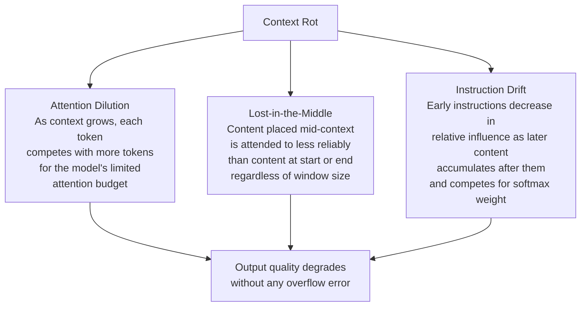
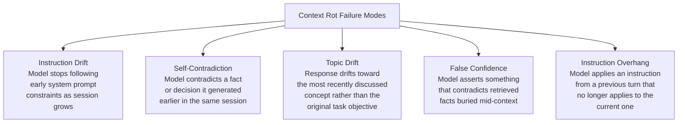
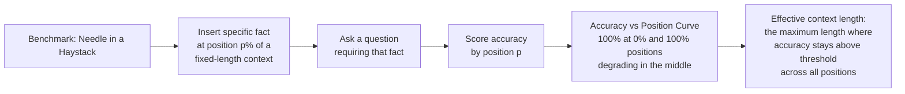
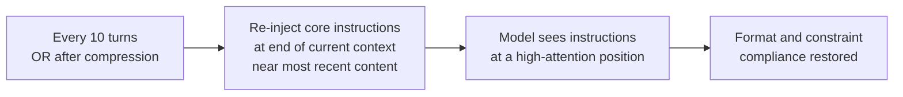
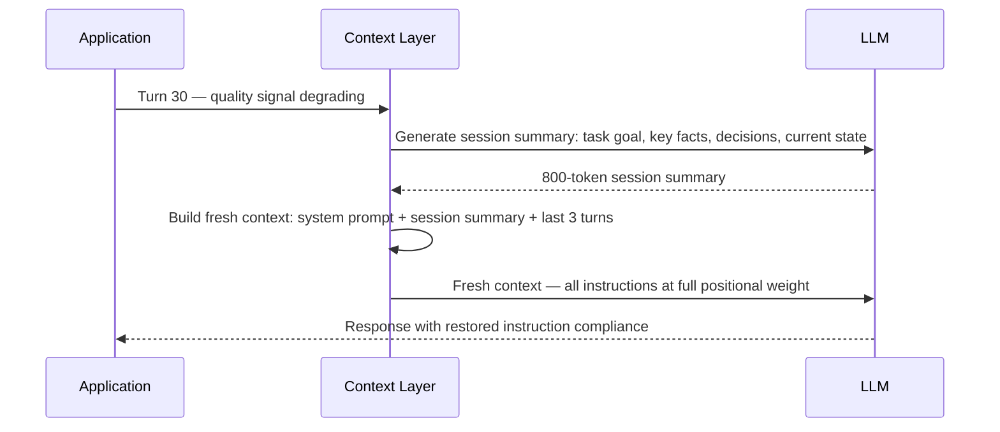
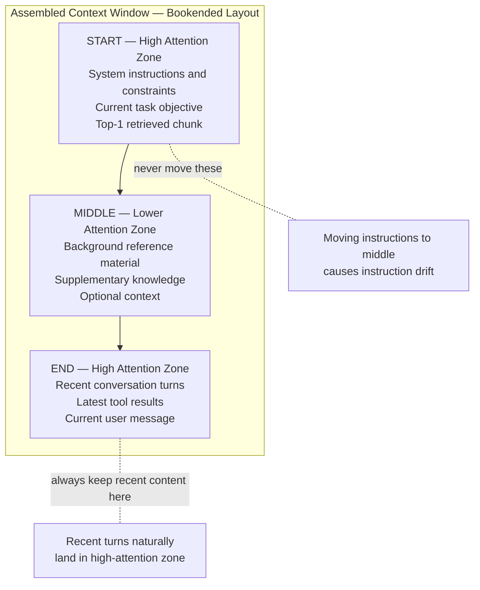
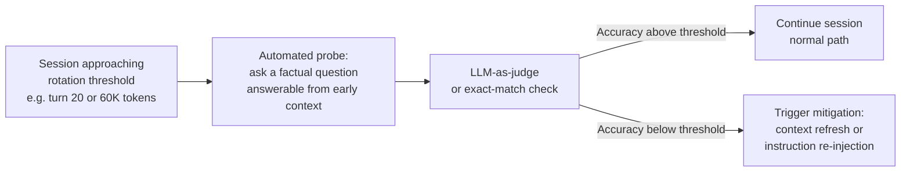
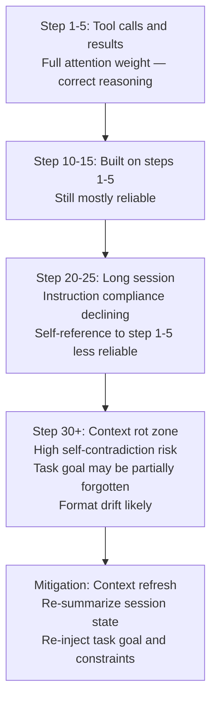
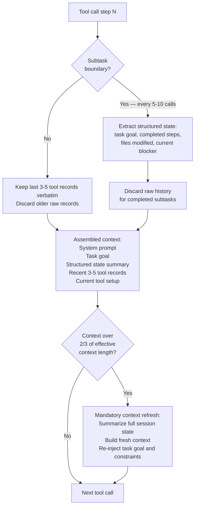

# Context Rot & Failure Modes

## Overview

Context rot is the gradual, silent degradation of model output quality as the context window fills — even when the filled content is technically within the advertised window limit. It is distinct from context overflow (where content physically doesn't fit) and from retrieval failure (where the wrong content was retrieved). Context rot happens with the right content, within the limit, and still produces worse answers as the session or the window grows.

The name reflects the analogy: content doesn't disappear, it decays. The model still "has" it — technically — but attends to it less reliably, follows it less consistently, and contradicts it more often the deeper into the session a conversation goes. This makes context rot particularly treacherous: it doesn't throw an error. Quality just gets worse, gradually, in ways that are hard to attribute without instrumentation.

## Definition

Context rot is the degradation of model output quality that occurs as the context window fills — manifesting as instruction drift (the model inconsistently follows instructions it was given earlier), attention dilution (mid-context content is used less reliably than content near the start or end), self-contradiction (the model contradicts earlier facts or decisions it generated), and topic drift (responses drift from the original task framing). It is distinct from a model bug and distinct from retrieval failure; it arises from how attention operates over long sequences, and from how competing content at different positions fights for influence on the next generated token.

## Why Context Rot Happens

Three mechanisms drive context rot, each independent of the others:

**Attention dilution**: transformer attention is a softmax over all positions; as the sequence grows, the attention weight any single token can receive decreases — it is divided among more candidates. An instruction token that received 5% of attention in a 4K context may receive less than 0.5% in a 128K context, reducing its influence on the generated output.

**Lost in the middle**: empirically demonstrated (Liu et al. 2023) that accuracy on retrieval tasks drops significantly for content placed in the middle of long contexts. The model reliably attends to the first few thousand tokens and the last few thousand tokens; the middle is attended to less consistently.

**Instruction drift**: instructions placed in the system prompt or early in the conversation decrease in relative influence as more tokens accumulate after them. The model doesn't "forget" them, but the gradient of their influence on the next token diminishes. For long-running agentic sessions, this manifests as the model gradually behaving less like it received the constraint at all.

## Taxonomy of Context Rot Failure Modes

### Instruction Drift in Detail

Instruction drift is the most common and most impactful form of context rot in agentic systems. The system prompt defines constraints — output format, prohibited topics, persona — that the model is expected to follow on every turn. As the conversation accumulates tool results, retrieved content, and responses, the system prompt's relative weight in the attention computation shrinks.

Symptoms:
- Output format gradually reverts to the model's default (ignoring JSON schema, losing structured sections)
- Prohibited topics gradually creep back in
- Persona or tone inconsistencies that weren't present in early turns
- Safety constraints being applied less consistently in long sessions

### Self-Contradiction in Detail

A model generates an answer at turn 8: "The deployment was on April 14." At turn 34 — after 26 turns of additional content — the model refers to "the April 16 deployment." Nothing was wrong with turn 8; the context rot caused turn 34 to "see" the earlier fact less reliably.

Self-contradiction is especially dangerous in agentic systems that build on their own prior outputs, because an incorrect reference at step 34 becomes the input to step 35, and errors compound rather than staying isolated.

## Measuring Effective Context Length

The model's advertised context window is the maximum length at which the model *can* process input. The *effective context length* is the length at which the model *reliably uses* all positions in the context to produce correct outputs. These are not the same number.

The "Needle in a Haystack" benchmark methodology:
1. Create a long filler context ("the haystack") of irrelevant prose.
2. Insert a specific fact ("the needle") at a target position (0%, 10%, 25%, 50%, 75%, 90%, 100% of the full context).
3. Ask the model a question that requires the inserted fact.
4. Record accuracy as a function of needle position and total context length.

Run this benchmark on your specific model and deployment. The published context window size does not tell you where accuracy degrades; the benchmark does. A model advertised at 128K tokens may have effective reliable recall down to 80–90% accuracy at 64K-token contexts with content placed in the middle.

## Measuring Context Rot in Production

Benchmark results tell you the floor. Production monitoring catches when sessions are hitting it:

| Signal | What it detects |
|---|---|
| **LLM-as-judge quality score vs session turn count** | Whether answer quality declines as sessions lengthen — the clearest rot signal |
| **Instruction compliance rate vs context size** | Does format/constraint adherence degrade at higher turn counts? |
| **Self-contradiction rate** | Sampled checks for factual consistency within a session against prior turns |
| **User correction / edit rate** | Implicit signal that the response was wrong, rising with session length |
| **Task success rate, long sessions vs short** | For agents: do multi-step tasks succeed at the same rate at turn 30 as at turn 5? |

## Mitigations

### 1. Instruction Repetition / Re-injection

Re-inject critical instructions periodically — every N turns or after a compression event — to restore their positional influence on the model's attention.

The implementation is simple: include the system prompt both at the start (standard position) and summarized at the end of the assembled context, specifically for long sessions where the start-to-end distance exceeds the effective context length threshold.

### 2. Context Refresh

Rather than accumulating context indefinitely, periodically start a fresh context with a compressed summary of the session state. This restores full instruction weight at position 0 and resets the attention dilution clock.

Context refresh is the most reliable mitigation for instruction drift in long agentic sessions. The cost is a summarization call; the benefit is that every content source starts at full positional weight in the new context.

### 3. Context Pruning

Active removal of content that is no longer relevant to the current task state, rather than waiting for the budget to overflow:

- Completed subtask results that have been summarized and incorporated
- Superseded tool outputs (an earlier version of a file that was then modified)
- Resolved errors and their diagnostics
- Conversational turns that added no durable facts

Context pruning reduces the total token count and, crucially, reduces the "dilution pool" — fewer irrelevant tokens in the window means more of the attention budget can reach the content that matters.

### 4. Bookending Critical Content

The lost-in-the-middle finding gives a positioning strategy: place the most important content at the beginning or end of the context, not buried in the middle.

| Content type | Recommended position |
|---|---|
| Core instructions, constraints, persona | Beginning (system prompt position) — always |
| Current task objective | Beginning |
| Most relevant retrieved chunk | Beginning or end of the retrieval section — not buried between less-relevant chunks |
| Recent conversation turns | End — natural recency position |
| Background / optional reference material | Middle — least critical, most tolerable for attention dilution |

### 5. Quality Monitoring with Automated Alerts

Detect context rot before users do:

## Context Rot in Agentic Systems

Agentic systems are more vulnerable to context rot than chat systems for two compounding reasons:

1. **Sessions are longer** — an agent completing a multi-hour task accumulates far more tokens than a conversational chatbot.
2. **Earlier outputs become later inputs** — at step 34, the agent may be reasoning about content it generated at step 8; if step 8's fact is being attended to less reliably at step 34, the agent's reasoning chain is built on an imperfectly-recalled foundation.

## Failure Mode Severity Classification

| Failure mode | Severity | Detection | Recovery |
|---|---|---|---|
| Instruction drift — format | Low | Automated format check | Re-inject instructions |
| Instruction drift — safety constraints | Critical | LLM-as-judge + human review | Context refresh, escalation |
| Self-contradiction | High | Factual consistency check | Context refresh |
| Topic drift | Medium | LLM-as-judge relevance score | Context refresh or prune |
| False confidence from missed mid-context fact | High | Gold-set accuracy benchmark | Context refresh, bookend critical facts |

## Reliability

| Failure | Mitigation strategy |
|---|---|
| Instruction drift at long sessions | Re-inject instructions every N turns; context refresh at session threshold |
| Self-contradiction in multi-step agents | Periodically extract and re-state established facts as a "ground truth" block |
| Lost-in-the-middle for critical retrieved content | Bookend: place the most relevant chunk first or last in the retrieval section |
| Compounding errors in agentic chains | Extract completed subtask summaries; don't carry raw intermediate outputs indefinitely |
| Quality degradation with no alert | Add LLM-as-judge quality probes keyed to session length; alert on threshold breach |

## Monitoring

- **Answer quality vs session turn count** — the primary production signal; a downward trend in quality as sessions lengthen is context rot.
- **Instruction compliance rate vs context size** — automatically test format and constraint adherence on sampled long sessions.
- **Context refresh trigger rate** — how often automated rotation fires; a rising rate means sessions are hitting the rotation threshold more often, possibly because context is growing faster.
- **Self-contradiction rate on sampled sessions** — periodically extract claims from a session and check for internal consistency; even a 1–2% self-contradiction rate in an agent is a significant reliability risk.
- **Needle-in-a-haystack accuracy on production model** — run the benchmark on the deployed model version at the sizes seen in production; the effective context length should be treated as an SLA, not a static spec.

## Production Best Practices

- **Treat the effective context length, not the advertised window limit, as your operational ceiling** — run the needle-in-a-haystack benchmark on your deployed model and use the accuracy-degradation point as the maximum session length before mandatory refresh.
- **Re-inject critical instructions at long sessions** — every 10–15 turns, or after compression fires, re-inject the core constraints and task goal near the end of the context.
- **Set a mandatory context refresh threshold** — choose a session length or token count at which a fresh context is always built from a compressed state summary, regardless of apparent quality signals.
- **Design agentic systems with intermediate state extraction** — don't carry raw multi-step outputs indefinitely; at the end of each major subtask, extract the key facts into a structured state block and discard the raw reasoning.
- **Add context-length-stratified quality monitoring** — don't average quality metrics across all sessions; slice by session length to see whether long sessions are underperforming short ones.
- **Document your effective context length** — every team deploying a model should know the effective context length empirically measured on their use case, and treat it as a documented operational parameter, not an assumption.

## Real World Examples

- **Claude Projects** (Anthropic) — the Project feature allows users to maintain a persistent context and instructions across sessions. The design separates stable "project knowledge" (loaded at fixed positions) from conversation history (which can be managed separately), a practical implementation of instruction placement and bookending to resist drift.
- **Cursor** for long coding sessions — when working on a large codebase over a long session, Cursor's context management actively manages which files remain in context and which are evicted, rather than accumulating all prior context indefinitely. This is effectively automated context pruning to prevent rot.
- **Long-running LLM agent frameworks** (LangGraph, AutoGPT, Devin) — publicly observed failure modes in early long-running agents (forgetting the original task, contradicting prior tool results, reverting to training defaults on format) are canonical context rot manifestations. Mitigation in more mature systems involves explicit state extraction and session summaries between major subtask boundaries.

## Interview Questions

### Beginner

**Q: What is "context rot" and how is it different from a context overflow error?**
Context overflow is a hard failure: the input exceeds the model's maximum token limit and the API rejects the request. Context rot is a silent, gradual quality failure: the input fits within the window, but answer quality degrades as the context grows — instructions are followed less consistently, mid-context facts are used less reliably, and the model may contradict its own earlier outputs. There is no error thrown. The only signal is measurement.

**Q: What is "lost in the middle" and why does it matter for context rot?**
Research shows that language model accuracy on tasks requiring recall of specific facts degrades for content placed in the middle of long contexts, even within the advertised window. Content at the very start and very end of the context is attended to more reliably. This means a key fact placed mid-context in a large session is less likely to influence the model's answer than the same fact placed at the start or end — a silent accuracy hit that gets worse as sessions grow and more content accumulates in the middle.

### Intermediate

**Q: Your agent's task success rate drops from 87% in 5-turn sessions to 61% in 30-turn sessions — how do you diagnose context rot as the cause?**
First, rule out other causes: check whether the 30-turn sessions involve harder tasks (confound), whether retrieval quality is lower in longer sessions (separate issue), and whether the tools are less reliable in longer sessions. Then isolate context length: construct a test where the same task is presented at turn 5 and at turn 30, with identical prior context — if performance drops, context length is the cause. Then identify the mechanism: check instruction compliance at turn 30 vs turn 5 (instruction drift), check whether the model is referencing prior tool results correctly (self-contradiction), and run a needle-in-a-haystack probe at the sizes seen in 30-turn sessions. Mechanism determines mitigation: re-injection for instruction drift, context refresh for general rot, bookending for mid-context fact misses.

**Q: How do you implement context refresh without interrupting the user experience?**
Trigger the refresh asynchronously. At the end of a turn that crosses the refresh threshold, run a background summarization call to generate the session state summary. The user's current turn is answered using the full current context; the next turn uses the refreshed context. From the user's perspective, the session continues uninterrupted — the refresh happens between turns. Add a subtle indicator if the product warrants it ("I've summarized our conversation to maintain accuracy in a long session") to set appropriate expectations about what I will or won't recall verbatim.

### Senior

**Q: You're building an agent that executes 50+ sequential tool calls over hours. Design the context management strategy.**
At each major subtask boundary (roughly every 5–10 tool calls), extract the structured state: task goal, completed steps with outcomes, files modified, constraints still in effect, current blocking issue. Discard the raw tool call history for completed subtasks; keep it only for the most recent 3–5 calls. The assembled context at any step is: system prompt + task goal + structured state summary + recent 3-5 tool call records + current tool call setup. Set a mandatory refresh if total context exceeds two-thirds of the effective context length. Re-inject the task goal and key constraints at the end of each context refresh. Log every pruning and refresh event for post-hoc debugging.

**Q: How do you set a context refresh threshold empirically rather than picking an arbitrary turn count?**
Run the needle-in-a-haystack benchmark on the deployed model at increasing context sizes, using representative content from your domain (not random prose). Identify the context length at which accuracy drops below an acceptable threshold (e.g., 90%). That is your empirical effective context length. Set the refresh threshold at 70–80% of that figure — early enough to avoid reaching the degradation zone, with headroom for content added within a session after the last refresh. Re-run the benchmark after any model version change, since effective context length can change across versions.

### Staff

**Q: Design a context rot detection and mitigation system for a multi-tenant AI platform serving 10,000 agents running simultaneously, each at different session lengths.**
Detection: each agent session emits a quality probe every N turns — a lightweight LLM-as-judge call using a small model to score consistency and instruction compliance. Probes are asynchronous and non-blocking. Results aggregate into a quality-vs-session-length dashboard, alerting on degradation above a per-agent-type threshold. Mitigation: the platform manages a session state store; at the refresh threshold, it automatically generates a state summary and rebuilds the context, storing the compressed state in the session store. The agent resumes in the new context without application-layer intervention. Governance: the refresh policy (threshold, summarization model, state schema) is configurable per agent type, not global — a legal review agent and a code review agent have different effective context lengths and different state-extraction requirements.

## Google-Level Follow-Ups

- "If effective context length were empirically identical to advertised context length — zero mid-context degradation — would context rot go away?" — no: instruction drift (positional influence) and self-contradiction (error compounding in agentic chains) are separate mechanisms not fully resolved by perfect attention recall; state management and refresh remain necessary.
- "Your context refresh fires at turn 25, but the session state summary is wrong — the agent proceeds with incorrect state. How do you detect and recover?" — probes for ground-truth state validation: before proceeding on a refreshed context, run a fast consistency check against an authoritative state store (database, tool result log); if the summary diverges from the recorded state, flag for review rather than proceeding.
- "How do you communicate context rot risk to a product team that wants to market 'infinite session memory' as a feature?" — probes for the honesty of the technical constraint: the model has a reliable recall length; beyond it, quality degrades measurably; the product can mitigate but not eliminate this with compression and refresh; marketing "infinite memory" without qualifying it sets user expectations the system cannot consistently meet.

## Common Mistakes

- **Treating the advertised context window size as a quality guarantee** — it is a capacity limit, not a quality boundary; effective reliable recall is shorter and must be measured on the deployed model.
- **No quality monitoring stratified by session length** — averaging quality metrics across all session lengths hides that long sessions underperform short ones.
- **Assuming instruction drift only happens when content is truncated** — it happens well within the window, as attention weight dilutes with context growth, and is invisible without explicit testing.
- **Not logging what was pruned or compressed** — when quality degrades in a long session, the debugging trail must include what content was evicted and when, or the root cause is untraceable.
- **Context refresh without state validation** — a refresh built on a hallucinated or incomplete summary propagates the error; always validate the refreshed state against an authoritative record before resuming.
- **Applying the same refresh threshold to all agent types** — a coding agent and a customer-support chatbot have completely different session content density and different effective context lengths; thresholds should be calibrated per workload.

## Key Takeaways

- Context rot is silent quality degradation within the window limit — not an overflow error — driven by attention dilution, lost-in-the-middle effects, and instruction drift.
- The effective context length (where quality stays reliably high) is shorter than the advertised window limit and must be measured empirically on the deployed model.
- Agentic systems are more vulnerable than chat systems because sessions are longer and the model reasons over its own prior outputs — errors compound rather than staying isolated.
- Core mitigations: instruction re-injection for drift, context refresh for general rot, bookending for mid-context fact recall, and context pruning to reduce the dilution pool.
- Production detection requires quality probes segmented by session length — not average quality across all sessions.
- Context rot is a permanent property of the attention mechanism, not a bug that will be patched away; effective context management is the engineering response, not a workaround pending a fix.
