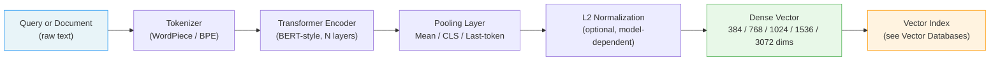
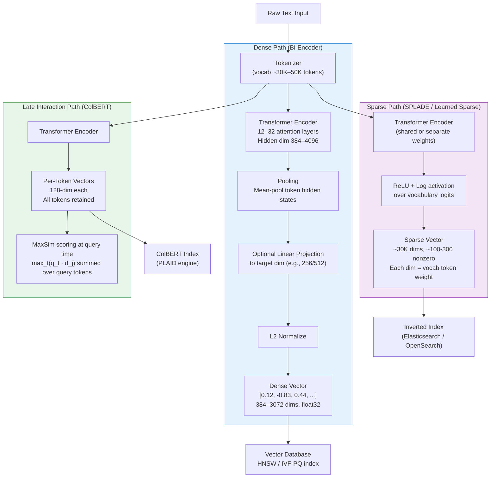
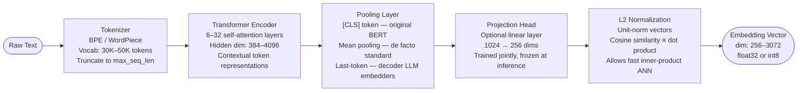
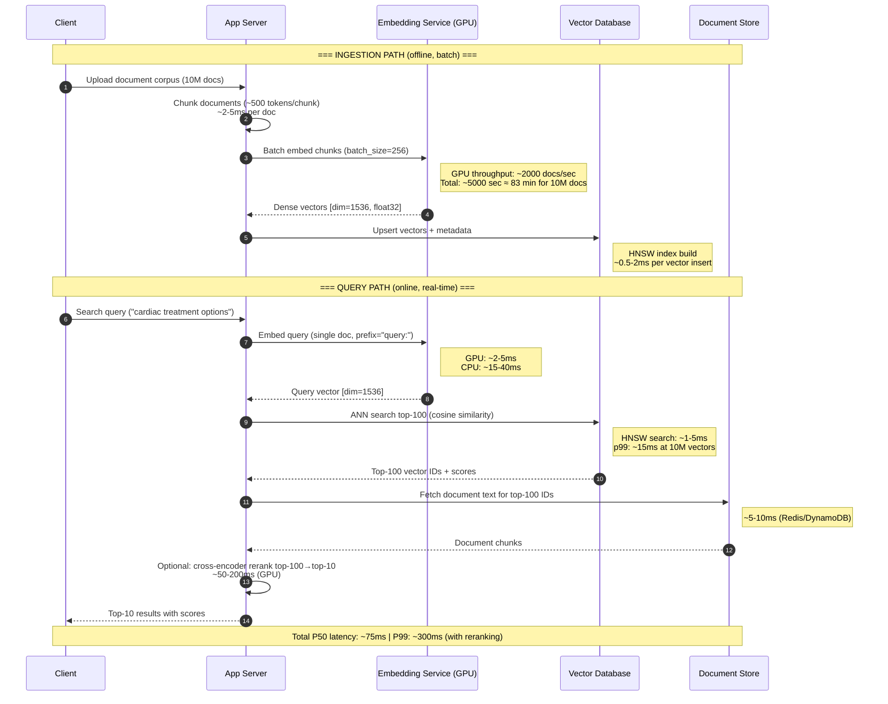
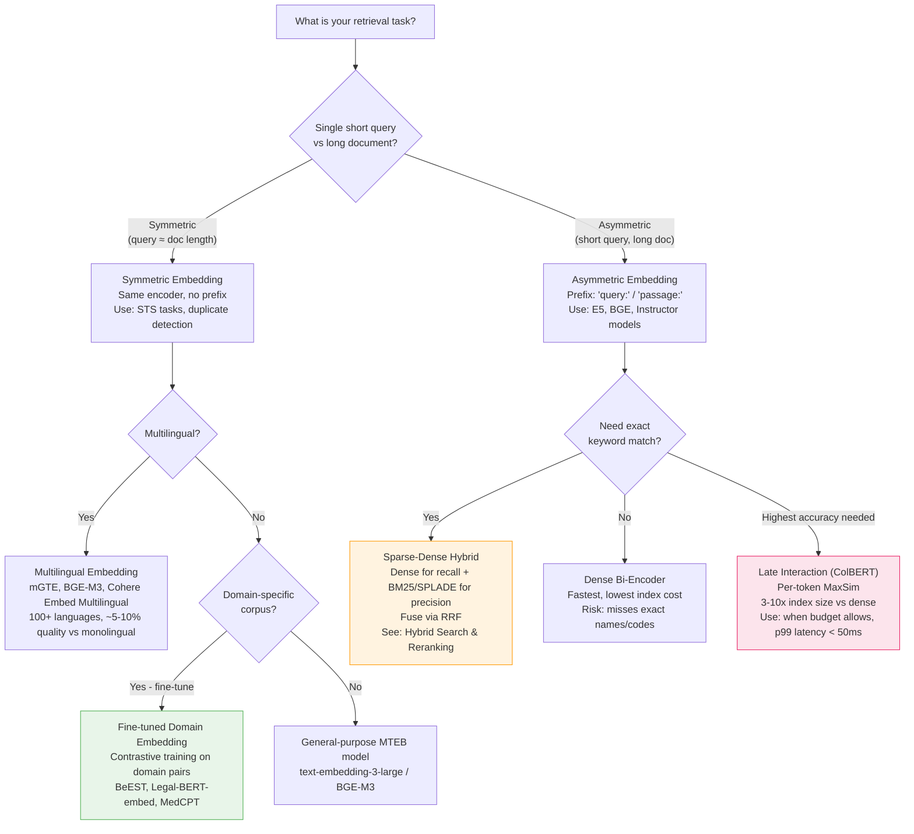
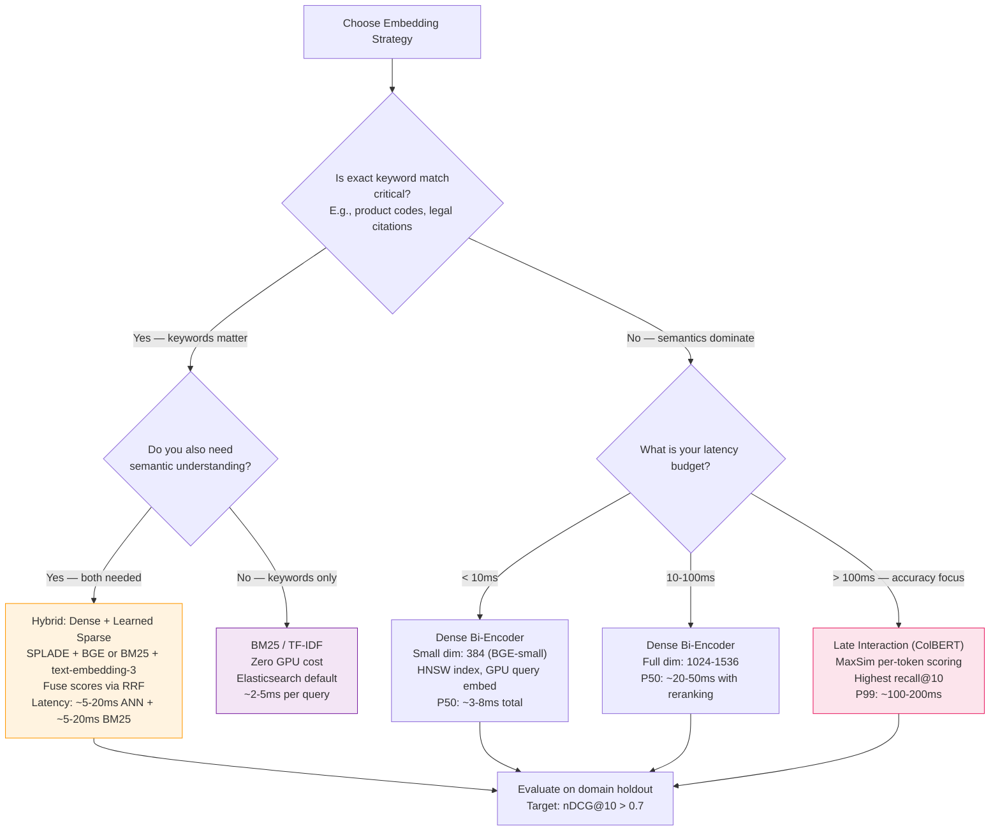
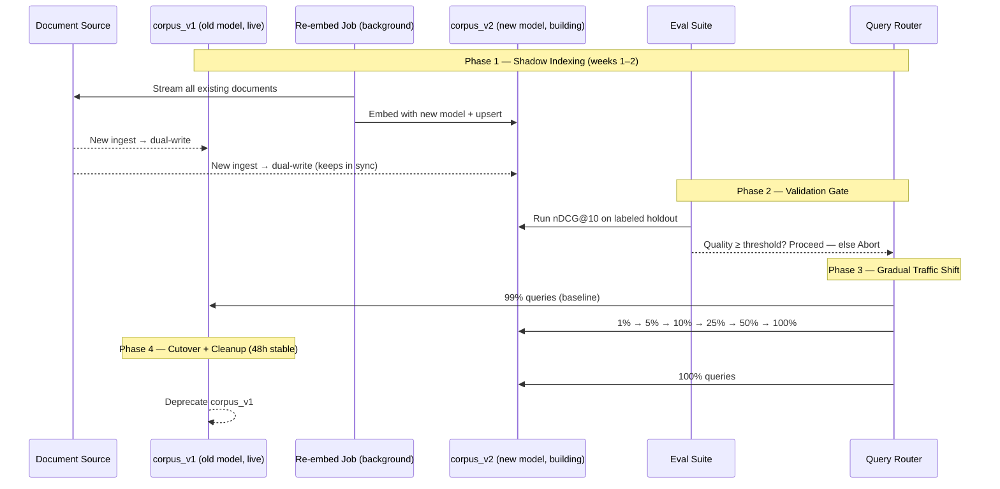

# Embedding Models

## Overview

Embedding models convert raw text (or multimodal content) into fixed-size dense vectors that capture semantic meaning, enabling similarity search at scale. They are the core primitive of every modern retrieval system: without a good embedding model, even a perfect vector index retrieves the wrong documents. Choosing the wrong model for a domain, mismatching query and document encoding strategies, or ignoring re-embedding costs when upgrading models are the most common causes of silent retrieval quality regressions in production.

## Why Embedding-Based Retrieval Exists

Early neural retrieval experiments (circa 2013–2016) tried to train a single DSSM-style network that scored query-document pairs jointly, feeding both through the same network and producing a scalar relevance score. This **cross-encoder** architecture is accurate but fundamentally incompatible with pre-computation: because the query is needed at encode time, you cannot cache document representations. At 10 million documents and 100ms per cross-encoder inference, full re-ranking on every query takes 277 hours — clearly infeasible.

Without embedding models, retrieval reduces to lexical matching: a query for "cardiac arrest" will not surface a document that only says "heart attack," and a query in French will not match a document in English even if they express identical facts. BM25 and similar TF-IDF methods are fast and interpretable but are entirely blind to paraphrase, synonymy, domain jargon, and cross-lingual content. At scale this precision gap is catastrophic: a legal RAG system that misses a controlling case because it uses the synonym "statute of limitations" instead of "prescription period" has a liability problem, not a search problem.

The **bi-encoder** (two-tower) architecture decoupled this: encode documents offline once, store their vectors, and at query time encode only the query, then retrieve by approximate nearest-neighbor search. Facebook's 2020 DPR paper popularized this pattern for open-domain QA. Sentence-BERT (2019) demonstrated that mean-pooled BERT representations with contrastive fine-tuning dramatically outperform naive [CLS]-token embeddings. By 2021 the field converged on: pre-trained language model → contrastive fine-tuning on MS-MARCO or Natural Questions → mean pooling → cosine similarity as the standard recipe.

Sparse learned representations (SPLADE, 2021) emerged to capture the best of both worlds: the semantic generalization of neural models and the lexical precision and interpretability of BM25. Late interaction models (ColBERT, 2020) went further still, keeping per-token vectors and computing fine-grained MaxSim scores at retrieval time — trading index size for accuracy. Today production systems typically run a dense bi-encoder for recall, a learned sparse model for precision, and a cross-encoder reranker for the final top-K — the three-stage funnel described in [Hybrid Search & Reranking](04-hybrid-search-and-reranking.md).

Embedding models solve the lookup-table problem by encoding intent and meaning rather than surface tokens — but they introduce new failure modes: out-of-domain distribution shift, silent truncation at the 512-token context limit, high GPU cost at ingestion time, and expensive full-corpus re-embedding every time a better model is released.

## Core Concepts

### Representation Types

- **Dense (bi-encoder)**: Single vector per document/query, typically 384–3072 dimensions, float32. Fast ANN search. Sensitive to domain shift. Examples: OpenAI `text-embedding-3-large`, Cohere Embed v3, BGE-large, E5-large, GTE-large, Sentence-BERT.
- **Sparse (BM25)**: Term-frequency bag-of-words vector. Interpretable, zero domain adaptation needed, no GPU required. Fails on paraphrase, multilingual, and jargon.
- **Learned sparse (SPLADE)**: Neural model outputs a high-dimensional sparse vector (~30K dims, BERT vocab size) where each dimension is a weighted vocabulary token. Combines lexical precision with semantic expansion.
- **Late interaction (ColBERT)**: Stores all per-token vectors (not just the pooled one). Query-time MaxSim scoring gives higher accuracy than single-vector dense at 3–10x the index storage cost.
- **Multi-vector**: Hybrid of dense + sparse stored as two separate index entries per document, retrieved independently and fused via Reciprocal Rank Fusion (RRF).

### Distance Metrics

- **Cosine similarity**: Angle between vectors; insensitive to vector magnitude. Standard choice for most embedding models. `cos(q,d) = (q·d)/(|q||d|)`.
- **Dot product (inner product)**: Equivalent to cosine when vectors are L2-normalized. Preferred by models trained with dot product objective (OpenAI Ada-002, text-embedding-3). Faster than cosine in ANN indexes that can skip normalization.
- **L2 (Euclidean)**: Sensitive to magnitude; rarely preferred for text embeddings but sometimes used in image embedding spaces. Mathematically equivalent to cosine after normalization.

> **Rule of thumb**: If the model card doesn't specify, use cosine. If the model explicitly trains with normalized vectors and dot product loss, use dot product — it's the same metric but the index can be optimized differently.

### Asymmetric Embedding

Many retrieval tasks are inherently asymmetric: a short query ("cardiac treatment options") is semantically different in structure from a long document passage. Models like E5 and BGE are explicitly trained with different prefixes for queries (`query:`) and documents (`passage:`). Using the wrong prefix — or ignoring the distinction entirely — degrades nDCG@10 by 3–8 points on BEIR benchmarks. Always check whether a model requires asymmetric encoding.

### Pooling Strategies

- **[CLS] token**: Uses the first token's hidden state. Original BERT default. Outperformed by mean pooling for semantic similarity.
- **Mean pooling**: Average of all token hidden states. The de facto standard since SBERT. Dilutes the contribution of rare tokens.
- **Weighted mean pooling**: Down-weights padding tokens; marginally better than mean pooling on longer sequences.
- **Last token**: Used by some decoder-only LLM embedding models (e.g., E5-Mistral-7B). Works well because the last token attends over all prior tokens via causal attention.

### Context Limit and Truncation

Most embedding models have a **512-token hard limit** (BERT-based). Content beyond 512 tokens is silently truncated — the model receives no signal that truncation occurred and produces a vector representing only the first ~380 words. OpenAI text-embedding-3 and Cohere Embed v3 extend this to 8192 tokens. Jina Embeddings v3 reaches 8192. For long documents, chunking (see [Chunking Strategies](05-chunking-strategies.md)) is mandatory regardless of the nominal context limit.

### MTEB Benchmark

The **Massive Text Embedding Benchmark** (MTEB, Hugging Face, 2022) evaluates models across 56 datasets and 8 task types: retrieval, clustering, classification, pair classification, reranking, semantic textual similarity, summarization, and bitext mining. Top models as of mid-2025:

| Model | MTEB Avg | Retrieval nDCG@10 | Dims | Params |
|---|---|---|---|---|
| text-embedding-3-large | 64.6 | 55.4 | 3072 | ~350M |
| Cohere Embed v3 | 64.5 | 55.9 | 1024 | ~350M |
| BGE-M3 | 66.0 | 58.2 | 1024 | 567M |
| E5-large-v2 | 62.2 | 50.6 | 1024 | 335M |
| GTE-large | 63.1 | 52.2 | 1024 | 335M |
| Sentence-BERT (mpnet) | 57.8 | 43.8 | 768 | 110M |
| E5-Mistral-7B | 66.6 | 56.9 | 4096 | 7B |

Scores represent approximate averages across task categories; always evaluate on your domain-specific holdout set, not just MTEB. MTEB scores overfit to English Wikipedia/Common Crawl distributions.

## Dense, Sparse, and Late Interaction Representations

### Definition

An embedding model is a neural network — typically a Transformer encoder — that maps an input sequence of tokens to a single fixed-dimensional vector in a continuous semantic space. The model is trained (via contrastive learning, masked language modeling, or supervised fine-tuning on labeled pairs) so that semantically similar inputs land close together under a chosen distance metric (cosine similarity, dot product, or L2), while dissimilar inputs are pushed apart. The resulting vectors are called **embeddings** or **dense vectors**, and the space they inhabit is called the **embedding space**. Sparse embedding models instead produce high-dimensional, mostly-zero vectors where each nonzero dimension corresponds to a weighted lexical feature, bridging the gap between traditional term-frequency methods and learned semantic representations.

### Dense Bi-Encoder Embeddings

Dense bi-encoders produce a single vector per document/query. Models in this family include BERT-family models (Sentence-BERT, E5, BGE, GTE), OpenAI `text-embedding-3-large` (3072-dim), and Cohere Embed v3 (1024-dim). They enable fast ANN search and pre-computation of all document vectors at ingestion time. The primary weakness is sensitivity to domain shift: a model trained on Wikipedia/Common Crawl may fail on legal, medical, or code corpora.

### Sparse Representations: BM25 and SPLADE/uniCOIL

- **BM25**: Term-frequency bag-of-words vector. Interpretable, zero domain adaptation needed, no GPU required. Fails on paraphrase, multilingual, and jargon.
- **SPLADE / uniCOIL (learned sparse)**: Neural model outputs a high-dimensional sparse vector (~30K dims, BERT vocab size) where each dimension is a weighted vocabulary token. Combines lexical precision with semantic expansion. Inverted-index compatible, allowing deployment on standard Elasticsearch/OpenSearch infrastructure. Typically 2–5x slower to embed than dense but retains keyword precision.

### Late Interaction: ColBERT — Token-Level Embeddings and MaxSim

ColBERT (2020) takes a different approach: instead of pooling all token representations into a single vector, it retains **all per-token vectors** (128-dim each). At query time, the MaxSim operation computes `max_t(q_t · d_j)` over each query token `t` against all document tokens `d_j`, summing across query tokens to produce a fine-grained relevance score. This delivers higher accuracy than single-vector dense retrieval — typically 3–8 nDCG points higher — at the cost of 5–20x the index storage. The PLAID engine (2022) uses centroid-based approximation to prune candidates before MaxSim, reducing effective comparisons by ~100x.

### High-Level Architecture



### Detailed Architecture — Dense and Sparse Paths



## Encoder Internals: Tokenization, Attention, and Pooling

| Component | Owns | Does NOT Own |
|---|---|---|
| **Tokenizer** | Vocab mapping, subword segmentation (BPE/WordPiece), truncation, padding to max_length | Semantic meaning; it is purely lexical |
| **Transformer Encoder** | Contextual token representations via self-attention; captures long-range dependencies | Pooling strategy; raw token IDs to hidden states only |
| **Pooling Layer** | Reducing sequence of hidden states to one vector (mean, CLS, last-token) | Dimensionality of the output space |
| **Projection Head** | Optional linear layer reducing hidden dim to target embedding dim (e.g., 1024→256) | Training signal; used at inference only |
| **L2 Normalization** | Ensuring unit-norm vectors for cosine / dot-product equivalence | Applied post-training; does not change model weights |
| **Vector Index** | ANN lookup (HNSW, IVF-PQ); see [Indexing Algorithms](03-indexing-algorithms-ann.md) | Embedding computation; only stores and searches pre-computed vectors |
| **Re-ranker (Cross-encoder)** | Scoring top-K candidates from retrieval with full query-document attention | Initial retrieval recall |

### Tokenizer (WordPiece/BPE)

The tokenizer converts raw text to integer token IDs using a fixed vocabulary (~30K–50K entries). WordPiece (used by BERT) and BPE (used by RoBERTa and GPT-family models) both handle out-of-vocabulary words by splitting them into subword units. Truncation to `max_seq_length` happens here — silently. The tokenizer does not know the semantic content of what it is discarding.

### Transformer Encoder Layers

A stack of 6–32 self-attention layers. Each layer computes attention over all other tokens in the sequence, producing contextual representations. The final-layer hidden states are passed to the pooling layer. Hidden dimensionality ranges from 384 (MiniLM-L6) to 4096 (E5-Mistral-7B).

### Pooling Strategies: [CLS] Token, Mean Pooling, Max Pooling

- **[CLS] pooling**: Uses the hidden state of the special `[CLS]` token prepended to every input. Original BERT default. Outperformed by mean pooling for semantic similarity tasks per the SBERT paper.
- **Mean pooling**: Averages all non-padding token hidden states. De facto standard since SBERT (2019). Slightly dilutes rare-token signal.
- **Max pooling**: Takes the element-wise maximum across token hidden states. Less common; used in some classification-oriented models.
- **Last-token pooling**: Takes the hidden state of the final token. Used by decoder-only LLM embedding models (E5-Mistral-7B, LLM2Vec) because the last token in a causal model has attended over all prior tokens.

### Projection Head / Linear Adapter

An optional linear layer that maps from the encoder's native hidden dimension to a smaller target embedding dimension. For example, a 1024-hidden-dim encoder may be projected to 256 dims for storage efficiency. Trained jointly with the contrastive objective; frozen at inference.

### Normalization for Cosine Similarity

L2 normalization (dividing each vector by its norm) ensures that all embeddings have unit length. This makes cosine similarity equivalent to dot product, allows the vector index to use the more efficient inner-product computation path, and prevents magnitude from being confused with relevance. Most production embedding models normalize by default.



## Embedding Ingestion and Query Pipeline



### Offline Ingestion: Raw Text → Tokenize → Encoder → Normalize → Upsert to Vector DB

The ingestion pipeline is batch-oriented and latency-tolerant. Steps:

1. **Chunk**: split raw documents into overlapping windows of 256–512 tokens with 50-token overlap.
2. **Tokenize**: convert each chunk to token IDs; validate `len(tokens) <= model.max_seq_length` and log truncation rate.
3. **Batch encode**: pass batches of 256–512 chunks through the embedding model on GPU. GPU throughput is ~2,000–5,000 chunks/sec for a 110M-parameter model.
4. **Normalize**: L2-normalize the output vectors if the model does not do so internally.
5. **Upsert**: write `{vector_id, embedding, model_id, model_version, created_at, chunk_id}` to the vector database. HNSW insert cost is ~0.5–2ms per vector.

### Online Query: Query Text → Same Encoder → Normalize → ANN Search → Top-K

The query path is real-time and latency-sensitive. Steps:

1. **Tokenize query**: apply the same tokenizer and any required asymmetric prefix (`query:` for E5/BGE models).
2. **Encode**: single forward pass through the embedding model. GPU: ~2–5ms. CPU: ~15–40ms.
3. **Normalize**: apply the same L2 normalization used at ingestion.
4. **ANN search**: query the vector index for top-100 nearest neighbors by cosine similarity. HNSW: ~1–5ms; p99 ~15ms at 10M vectors.
5. **Fetch and rerank**: retrieve document text for top-100 candidates; optionally apply a cross-encoder reranker to return top-10. Reranking adds ~50–200ms on GPU.

## Choosing an Embedding Strategy



### When to Use Dense vs Sparse vs Late Interaction

- **Dense bi-encoder**: default for most production systems. Fast ANN search, pre-computable, good semantic generalization. Use when exact keyword match is not critical and latency budget is < 10ms.
- **Sparse (BM25)**: when exact keyword match dominates and there is no GPU budget. Legal citations, product codes, regulatory identifiers. Zero training cost.
- **Learned sparse (SPLADE)**: when you need both keyword precision and semantic generalization. Inverted-index compatible. Use when an existing Elasticsearch/OpenSearch stack must be preserved.
- **Late interaction (ColBERT)**: when accuracy is the primary constraint and index storage cost is acceptable (5–20x vs dense). Use when p99 latency budget > 20ms and per-token signal matters.
- **Hybrid (dense + sparse)**: best of both worlds, robust to failure modes of each. Use as the default when keyword match matters and latency budget is 20–100ms.

### Domain-Specific Fine-Tuning: When and How

Fine-tune when: (1) your corpus has specialized jargon absent from MTEB training data; (2) your domain holdout evaluation shows the best general model underperforms BM25; or (3) your task is asymmetric (short query vs long domain document).

The standard recipe is contrastive fine-tuning with triplet or in-batch negative loss:

1. **Collect training pairs**: (query, positive passage, hard negative passages). Positives come from human annotations, click data, or LLM-generated questions. Hard negatives from BM25 or an existing dense model retrieval of top-50 near-misses are critical.
2. **Initialize from a strong base model**: start from `bge-large-en-v1.5` or `e5-large-v2`. Fine-tuning from a strong general-purpose model requires only 10K–100K training pairs to see 5–15 nDCG gains.
3. **Training**: multiple negatives ranking loss (MNR-Loss) with in-batch negatives. Batch size 256–1024 is critical: larger batches = more in-batch negatives = stronger training signal.
4. **Evaluation**: nDCG@10, MRR@10, Recall@100 on a held-out domain set of 1,000–5,000 labeled pairs.

**Symmetric vs asymmetric**: symmetric embedding (same encoder, no prefix) for STS tasks, duplicate detection, and clustering. Asymmetric (query: / passage: prefixes) for question answering, search, and retrieval where query and document structure differ significantly.

### Multi-Vector vs Single-Vector Tradeoffs

Single-vector dense models are simpler to deploy, cheaper to store (1 vector per document vs many), and sufficient for most workloads. Multi-vector approaches (ColBERT's per-token vectors, or a dense+sparse dual index) provide higher accuracy at 5–20x storage cost and additional query-time complexity. The break-even point: if your single-vector dense model achieves Recall@100 ≥ 0.90 on your domain holdout, multi-vector is unlikely to justify the operational overhead.

## Representation Type Tradeoffs



### Dense vs Sparse vs Late Interaction

| Strategy | Latency | Memory | Recall@10 | Notes |
|---|---|---|---|---|
| **Dense bi-encoder (384-dim)** | ~3–8ms p50 | 15 GB / 10M docs | Good | Fast; lowest storage |
| **Dense bi-encoder (1024-dim)** | ~5–15ms p50 | 40 GB / 10M docs | Good–High | Sweet spot for most systems |
| **Sparse (BM25)** | ~2–5ms | Inverted index ~5–20 GB | Moderate | Zero semantic; exact match only |
| **Learned sparse (SPLADE)** | ~10–30ms | Inverted index ~10–40 GB | Good | Semantic + lexical; GPU needed |
| **Late interaction (ColBERT)** | ~50–200ms | 5–20x dense | Highest | Best recall; PLAID reduces by ~100x |
| **Hybrid (dense + sparse)** | ~20–50ms | Both indexes | Best | Robust; 2 pipelines; RRF tuning |

### Fine-Tuned vs General-Purpose

| Approach | nDCG@10 (domain) | Cost | Notes |
|---|---|---|---|
| **General MTEB model** | Baseline | Low | No training data needed |
| **Domain fine-tuned (110M)** | +5–15 points | Medium (10K–100K pairs) | Often beats 7B general model |
| **LLM-based (7B)** | +1–5 points vs 350M general | 4–20x GPU cost | MTEB leader; not always best on domain |

### Advantages and Disadvantages

| Strategy | Advantages | Disadvantages |
|---|---|---|
| **Dense bi-encoder** | Fast ANN search; pre-computable; good semantic generalization; compact index | Poor on exact keyword match; silent truncation at 512 tokens; domain shift hurts; full re-embedding on model change |
| **Sparse (BM25)** | Zero training cost; interpretable; exact keyword match; CPU-only; no re-indexing on model change | Zero semantic understanding; fails on paraphrase, synonyms, multilingual |
| **Learned sparse (SPLADE)** | Semantic + lexical; inverted index compatible; interpretable activated tokens | 2-5x slower to embed than dense; training data needed for SPLADE-style models |
| **Late interaction (ColBERT)** | Highest retrieval accuracy; token-level matching | Index 5-20x larger than dense; higher query latency; more complex infrastructure |
| **Hybrid (dense + sparse)** | Best of both worlds; robust to failure modes of each | 2 index pipelines; 2x ingestion cost; RRF tuning required |
| **Large LLM-based (7B)** | Highest MTEB scores (E5-Mistral: 66.6) | 4–20x higher GPU cost per inference; not feasible for CPU fallback |

## Re-Embedding Cost When Models Change

Re-embedding is a first-class operational cost that must be planned before the first model upgrade, not after. The formula for full corpus re-embedding cost via a hosted API:

```
cost = corpus_size × tokens_per_chunk × embedding_price_per_token
```

For example: upgrading from `text-embedding-3-small` to `text-embedding-3-large` on a 10M-document corpus:

```
$0.13/1M tokens × 10M docs × 500 tokens/doc = $650 in API fees
```

For self-hosted models, the cost is compute only: a single A100 at $2–3/hr running for 83 minutes = **~$5 in compute**. This asymmetry means that once you commit to a hosted embedding model at scale, changing models has a non-trivial one-time cost.

### Strategy: Shadow Index and Blue-Green Swap

The safe upgrade procedure:

1. **Shadow index**: spin up a new, empty vector collection (`corpus_v2`). Start a background re-embedding job that processes all documents and writes to `corpus_v2`. This runs in parallel to live traffic on `corpus_v1`.
2. **Dual-write during ingestion**: any new document ingested during the migration gets written to both `corpus_v1` and `corpus_v2` to keep them in sync.
3. **Validation gate**: once `corpus_v2` is fully populated, run the offline evaluation suite (nDCG@10 on the labeled holdout). If quality improves or is within 0.5 points, proceed. If quality regresses, abort.
4. **Gradual traffic shift (blue-green)**: route 1% → 5% → 10% → 25% → 50% → 100% of queries to `corpus_v2` with the new query encoder, monitoring live metrics at each step.
5. **Cutover and cleanup**: after 100% traffic is on v2 for 48 hours with stable metrics, deprecate `corpus_v1`.

This procedure takes 1–2 weeks for a 10M-document corpus but is the only way to guarantee zero inconsistency during the transition.

### When to Trigger Re-Embed vs Keep Old Model

**Trigger re-embed when**:
- A new model shows ≥ 3 nDCG@10 points improvement on your domain holdout.
- The current model is producing measurable retrieval quality regressions (embedding drift signal).
- A security vulnerability is found in the model weights or the hosted API provider.

**Keep old model when**:
- The new model's improvement is < 2 nDCG points on your domain holdout (not worth migration cost).
- The corpus is > 100M documents and re-embedding cost exceeds the quality improvement ROI.
- You are mid-flight on another infrastructure change that should not be compounded.

**Cost-minimizing alternative**: Hot-cold tiering — re-embed only the "hot" documents (top 1% accessed in the last 30 days, which typically accounts for ~80% of queries by Zipf's law) with the new model first. These are the documents where the quality improvement will have the largest user-visible impact.



## Scalability

**Ingestion throughput** is the primary scaling constraint. A single A100 GPU embeds approximately 2,000–5,000 documents per second at batch size 256 with a 110M-parameter model (BGE-small), or 500–1,000 documents/second with a 335M model (BGE-large). Embedding 10 million 500-token chunks takes:

- BGE-small (A100): ~2,000–5,000 chunks/sec → 33–83 minutes
- text-embedding-3-large (OpenAI API): rate-limited to ~2M tokens/min → ~41 hours at 500 tokens/chunk
- Self-hosted BGE-large (4x A100): ~4,000 chunks/sec → ~42 minutes

**Storage** scales linearly with corpus size and dimensionality:
- 384-dim float32: 1.5 KB per vector → 15 GB for 10M docs
- 1536-dim float32: 6 KB per vector → 60 GB for 10M docs
- 3072-dim float32: 12 KB per vector → 120 GB for 10M docs
- int8 quantization halves storage with < 1% quality loss on most benchmarks

**Query throughput**: a single embedding service on one A10G GPU can handle ~500–2,000 queries/second (single-token forward pass is ~1–5ms). Horizontal scaling with a load balancer in front of a pool of embedding replicas is the standard pattern. Pin model weights in GPU memory to eliminate cold-start latency.

For very large corpora (> 100M vectors), consider [Indexing Algorithms](03-indexing-algorithms-ann.md): IVF-PQ reduces memory 4–8x vs flat HNSW at the cost of 3–10% recall@10 drop.

## Reliability

**Silent truncation** is the most dangerous failure mode: a BERT-based model with a 512-token limit will silently embed only the first ~380 words of a longer chunk. The vector appears valid — it has the right dimensionality and norm — but represents incomplete content. Always validate `len(tokenizer.encode(text)) <= model.max_seq_length` before embedding. Emit a metric `embedding.truncation_rate` and alert if it exceeds 5%.

**Model versioning**: a corpus embedded with `text-embedding-3-small` cannot be compared against a query embedded with `text-embedding-3-large` — the spaces are different. Track the model version as metadata on every vector. When upgrading, run both models in parallel (shadow mode) for at least one week before cutting over. See the re-embedding cost section above.

**API failure handling**: if using a hosted embedding API (OpenAI, Cohere), implement exponential backoff with jitter, a circuit breaker, and a fallback to a local model (e.g., BGE-small) for degraded-mode operation. Rate limits on OpenAI text-embedding-3 are typically 1M tokens/min on tier 2 plans; batch requests to stay within limits and avoid per-request overhead.

**Checkpointing ingestion pipelines**: embed in batches of 1,000–10,000 documents, commit the batch to the vector database, and persist an offset. This makes crash recovery O(last batch) rather than O(full corpus).

## Security

- **Data privacy in hosted APIs**: every document sent to OpenAI or Cohere embeddings leaves your infrastructure. For regulated industries (HIPAA, PCI, SOC 2), use self-hosted models only. OpenAI's API data usage policy (as of 2024) states API inputs are not used for training, but verify contractually for your use case.
- **Vector inference as a privacy leak**: dense vectors can be partially inverted via Vec2Text attacks (Morris et al., 2023), which reconstruct ~70% of input text from an embedding with a dedicated inversion model. Do not store user-specific embeddings in shared indexes without access control. Differential privacy via noise injection is an active research area.
- **Prompt injection via embedded documents**: a malicious document can embed adversarial text targeting a downstream LLM. The embedding model itself is not vulnerable, but ensure the retrieved chunk pipeline sanitizes or rate-limits document content before passing to an LLM (see [RAG Architecture](../06-rag/01-rag-architecture.md)).
- **Model supply chain**: self-hosted models pulled from Hugging Face Hub should be pinned to a specific commit SHA and scanned for pickle exploits before production deployment. Verify model hashes against the official model card.

## Cost Optimization

**Hosted embedding cost (2024 list prices, illustrative):**

| Provider / Model | Price per 1M tokens | Cost: 10M docs × 500 tokens |
|---|---|---|
| OpenAI text-embedding-3-small | $0.02 | $100 |
| OpenAI text-embedding-3-large | $0.13 | $650 |
| Cohere Embed v3 (English) | $0.10 | $500 |
| Google Vertex text-embedding-004 | $0.025 | $125 |
| Self-hosted BGE-large (A100, spot) | ~$0.01–0.05 | $50–250 |

**Dimensionality reduction**: OpenAI text-embedding-3 supports the `dimensions` parameter, returning truncated-PCA vectors at lower dimensionality (e.g., 256-dim instead of 3072-dim). At 256 dims, MTEB average drops ~2 points but storage cost drops 12x and ANN search is ~4x faster. Evaluate on your workload before committing.

**int8 quantization**: storing vectors as int8 instead of float32 halves storage and doubles SIMD throughput in the ANN index. Quality loss is typically < 0.5% on nDCG@10. Most production vector databases (Qdrant, Weaviate, Milvus) support int8 natively.

**Caching query embeddings**: at high QPS, a small LRU cache for the embedding of frequently repeated queries eliminates GPU round-trips. The cache key is the (model_version, raw_query) hash. This can absorb 20–40% of embedding load for product search workloads where top-1000 queries repeat heavily.

## Monitoring

Key metrics to emit from an embedding service in production:

| Metric | Type | Alert Threshold |
|---|---|---|
| `embedding.latency_ms` (p50, p95, p99) | Histogram | p99 > 50ms (GPU), > 200ms (CPU) |
| `embedding.truncation_rate` | Gauge | > 5% of inputs truncated |
| `embedding.batch_size` | Histogram | Alert if batches < 32 (throughput waste) |
| `embedding.model_version` | Gauge/Label | Alert on unexpected model change |
| `embedding.api_errors` (rate) | Counter | > 0.1% error rate |
| `retrieval.nDCG@10` (offline eval) | Gauge | Drop > 2 points vs baseline |
| `retrieval.mrr@10` | Gauge | Drop > 0.05 vs baseline |
| `embedding.gpu_memory_used_gb` | Gauge | > 90% of GPU memory |
| `embedding.tokens_per_second` | Gauge | < 50% of baseline (regression signal) |

**Embedding drift detection**: periodically embed a fixed evaluation set of 1,000 labeled query-document pairs and compute nDCG@10 against the ground truth. A drop of > 2 points signals a retrieval quality regression — often caused by a change in the upstream embedding API (model update, behavior change) or a data distribution shift in ingested documents.

## Production Best Practices

1. **Always evaluate on your domain before choosing a model.** MTEB scores are computed on English Wikipedia and Common Crawl. Legal, medical, code, and multilingual corpora can show 5–15 point nDCG gaps between the MTEB winner and a domain-specific model.

2. **Separate the ingestion embedding pipeline from the query embedding service.** Ingestion is batch, latency-tolerant, and benefits from large batch sizes (256–512). Query embedding is real-time and benefits from GPU warm pools and connection reuse. Running them in the same service creates resource contention.

3. **Store model version with every vector.** Schema: `{vector_id, embedding, model_id, model_version, created_at, chunk_id}`. Without this, you cannot safely run A/B tests between model versions or roll back.

4. **Set an explicit `max_seq_length` truncation strategy.** Options: truncate to 512 tokens (default), chunk the document into 512-token overlapping windows and embed each separately, or use a model with 8K context. Log the truncation rate per document source.

5. **Use asymmetric prefixes if the model supports them.** For E5, BGE, Instructor: `query: <text>` for queries, `passage: <text>` for documents. Omitting the prefix is a common silent mistake that costs 3–8 MTEB points.

6. **Warm up the embedding model before serving traffic.** Run a dummy batch through the model at startup. GPU kernel compilation (first forward pass on CUDA) adds 2–10 seconds of latency to the first real request if not pre-warmed.

7. **Implement a re-embedding strategy.** Maintain an `embed_version` column on document records. On model upgrade, run a background job that re-embeds all documents in batches, writing to a new vector collection. Cut over query traffic only after the full collection is re-embedded.

8. **Use chunking before embedding; never embed full documents.** See [Chunking Strategies](05-chunking-strategies.md). Embedding a 10,000-token document as a single vector dilutes the signal — the vector represents an average over a book chapter. Chunk to 256–512 tokens with 50-token overlap, embed each chunk, and store the parent document ID as metadata. Retrieved chunks are then re-associated with their source document for display.

## Real-World Examples

**Semantic search at e-commerce scale (illustrative, based on public engineering blogs):** Large e-commerce platforms use bi-encoder models to embed product descriptions and user queries. A public Shopify engineering post describes embedding 100M+ product catalog entries using batched GPU workers, storing 256-dim quantized vectors, and achieving sub-10ms p50 search latency. Domain-specific fine-tuning on click data improved add-to-cart rates by 8% versus a generic MTEB model.

**Legal document retrieval:** Public papers from Casetext (Westlaw/Thomson Reuters) describe fine-tuning BERT-based encoders on legal citation pairs — if case A cites case B, they should be near each other in embedding space. A fine-tuned legal embedding model outperformed text-embedding-ada-002 by 12 nDCG points on a held-out bar exam question dataset, at 1/5th the per-token cost since it was self-hosted.

**Multilingual customer support (Intercom/Zendesk public talks):** A multilingual BGE-M3 model allowed a single vector index to cover support tickets in 50+ languages. The alternative — separate indexes per language — would require 50 separate fine-tuning pipelines and 50x the index storage. The trade-off is ~7% quality loss versus a monolingual specialist model for each language, which was acceptable for the Tier 1 support deflection use case.

**Code search (GitHub Copilot, public research):** GitHub uses embedding models trained on code (CodeBERT, UniXcoder) to power semantic code search. Unlike natural language, code benefits from asymmetric embedding where the query is a natural language description and the document is a code function. Using the same model for both degrades recall by 15–20% on the CodeSearchNet benchmark.

## Interview Questions

### Beginner

**Q: What is an embedding model and why do we need it?**

An embedding model converts text into a fixed-size numerical vector. We need it because computers cannot directly compute the "similarity" between two strings of text — "heart attack" and "cardiac arrest" share no characters yet mean the same thing. By mapping both phrases to nearby points in a high-dimensional vector space, we can retrieve semantically related content with a single dot product. The key insight is that the vector captures meaning, not just surface tokens — the classic example is `king - man + woman ≈ queen` in Word2Vec embedding space.

**Q: What is the difference between cosine similarity and dot product?**

Cosine similarity is the dot product divided by the product of both vectors' magnitudes: `cos(q,d) = (q·d)/(|q||d|)`. It measures the angle between vectors and is insensitive to their magnitude. Dot product measures both angle and magnitude. For embedding models that produce L2-normalized vectors (|v|=1 for all v), cosine similarity and dot product are identical because the denominator is always 1×1=1. In practice: if a model trains with dot product loss and normalizes outputs, use dot product in the index (it's slightly cheaper to compute); otherwise use cosine similarity to avoid magnitude bias.

**Q: What is MTEB and why is it important?**

MTEB (Massive Text Embedding Benchmark) is the standard benchmark for comparing embedding models across 56 datasets and 8 task types. It's important because no single metric captures embedding quality: a model that ranks first on sentence similarity might rank fifth on retrieval. MTEB provides an aggregate score (average across all tasks) and per-task breakdowns. However, MTEB has a significant limitation: it skews heavily toward English Wikipedia and Common Crawl. For domain-specific use cases, always evaluate on a held-out set from your actual data.

### Intermediate

**Q: What is the difference between a bi-encoder and a cross-encoder, and when would you use each?**

A bi-encoder encodes the query and document independently, producing separate vectors that are compared via dot product or cosine similarity. This enables offline pre-computation of all document vectors, making ANN retrieval feasible at scale (millions of documents, sub-10ms latency). A cross-encoder concatenates the query and document and runs them through the model jointly, producing a scalar relevance score. Cross-encoders are significantly more accurate because they can model query-document interactions at every attention layer, but they are 1,000–100,000x slower because every (query, document) pair must be processed at query time — you cannot pre-compute.

The production pattern is to use a bi-encoder for first-stage retrieval (recall the right 100 candidates from 10M documents in ~5ms) and a cross-encoder as a reranker to re-score those 100 candidates and return the top 10 (taking ~100–200ms). This two-stage design is described in [Hybrid Search & Reranking](04-hybrid-search-and-reranking.md).

**Q: How would you fine-tune an embedding model for a domain-specific corpus?**

The standard recipe is contrastive fine-tuning with triplet or in-batch negative loss:

1. **Collect training pairs**: (query, positive passage, negative passages). Positives come from human annotations, click data, or synthetic generation via an LLM ("generate a question that this passage answers"). Hard negatives — passages that are topically relevant but not the right answer — are critical: BM25 or an existing dense model retrieves the top-50 near-misses, which become hard negatives.
2. **Initialize from a strong base model**: start from `bge-large-en-v1.5` or `e5-large-v2`, not from scratch. Fine-tuning from a strong general-purpose model typically requires only 10K–100K training pairs to see 5–15 point nDCG gains.
3. **Training**: multiple negatives ranking loss (MNR-Loss) with in-batch negatives is the most compute-efficient setup. Batch size matters enormously: larger batches = more in-batch negatives = stronger training signal. Use a batch size of 256–1024 if GPU memory allows.
4. **Evaluation**: hold out 1,000–5,000 labeled pairs, compute nDCG@10, MRR@10, Recall@100. Compare to the base model and a BM25 baseline.

Common pitfall: if your positive pairs were collected by BM25, the model will learn to mimic BM25 and will not generalize to semantic matches. Diversify your positive pair collection strategy.

**Q: What are the storage and latency tradeoffs of different embedding dimensions?**

Higher dimensionality captures more nuanced semantic distinctions but costs more in storage, ANN index memory, and query latency:

- **384-dim (BGE-small, MiniLM)**: 1.5 KB/vector × 10M docs = 15 GB. HNSW query: ~1–3ms. MTEB average ~57–62. Good for latency-critical applications.
- **768-dim (Sentence-BERT, E5-base)**: 3 KB/vector → 30 GB. MTEB average ~62–64.
- **1024-dim (BGE-large, Cohere Embed v3)**: 4 KB/vector → 40 GB. MTEB average ~63–66.
- **1536-dim (text-embedding-3-small)**: 6 KB/vector → 60 GB. MTEB average ~63.
- **3072-dim (text-embedding-3-large)**: 12 KB/vector → 120 GB. MTEB average ~65.

In practice, int8 quantization halves these storage numbers with < 1% quality loss. Beyond 1024 dimensions, MTEB gains are marginal (1–3 points) for 3–8x storage cost, making 1024-dim models the sweet spot for most production systems.

### Senior

**Q: Walk me through the architecture decisions for an embedding pipeline serving 1B documents at 10,000 QPS.**

At 1B documents and 10,000 QPS, the challenges are:

**Ingestion**: 1B × 500 tokens = 500B tokens. At $0.13/1M tokens (text-embedding-3-large), that is $65,000 for a single embedding pass — which immediately argues for self-hosted models. A fleet of 32 A100 GPUs embedding at 2,000 docs/sec each = 64,000 docs/sec → 1B docs in ~4.3 hours. Ingestion is a one-time cost but re-embedding on model upgrade must be budgeted.

**Storage**: 1B × 1024-dim float32 = 4 TB of raw vectors. With int8 quantization: 1 TB. An HNSW index at default parameters adds ~20–30% overhead → 1.2–1.3 TB. This requires a distributed vector store — Qdrant in distributed mode, Milvus, or Pinecone — sharded across multiple nodes.

**Query embedding**: 10,000 QPS at 2ms/embed = 20 CPU-seconds/second of GPU work = ~20 A10G GPU equivalents just for query embedding. A pool of ~25 GPU replicas with a load balancer handles this with headroom.

**ANN search**: 10,000 QPS against 1B vectors in a sharded HNSW requires either: (a) replication (each shard searched in parallel, results merged), or (b) an IVF-PQ index where each shard is a cluster centroid. At this scale, IVF-PQ with 4x quantization is preferred for memory efficiency, accepting ~5–8% recall@10 drop.

**Key design choices at this scale**: (1) int8 quantize vectors, (2) use IVF-PQ not flat HNSW, (3) self-hosted embedding, (4) cache top-1000 query embeddings (these repeat heavily at 10K QPS), (5) shard vector store to 8–16 nodes, (6) maintain a hot embedding replica per shard for query-time ANN search.

**Q: How would you handle a model upgrade in production without downtime and without serving inconsistent results?**

Model upgrades are operationally one of the hardest parts of running an embedding system. The failure mode to avoid is a mixed-model index: if 60% of documents are embedded with model v1 and 40% with model v2, similarity scores are not comparable across the two sets. Here is the safe upgrade procedure:

1. **Shadow index**: spin up a new, empty vector collection (`corpus_v2`). Start a background re-embedding job that processes all documents and writes to `corpus_v2`. This runs in parallel to live traffic on `corpus_v1`.
2. **Dual-write during ingestion**: any new document ingested during the migration gets written to both `corpus_v1` and `corpus_v2` to keep them in sync.
3. **Validation gate**: once `corpus_v2` is fully populated, run the offline evaluation suite (nDCG@10 on the labeled holdout). If quality improves (expected) or is within 0.5 points (neutral), proceed. If quality regresses, abort.
4. **Gradual traffic shift**: route 1% → 5% → 10% → 25% → 50% → 100% of queries to `corpus_v2` with the new query encoder, monitoring live metrics (click-through rate, user satisfaction proxies) at each step.
5. **Cutover and cleanup**: after 100% traffic is on v2 for 48 hours with stable metrics, deprecate `corpus_v1`.

This procedure takes 1–2 weeks for a 10M-document corpus but is the only way to guarantee zero inconsistency during the transition.

### Staff

**Q: A team reports that retrieval quality is good in English but poor in other languages even though you're using BGE-M3, a multilingual model. How do you diagnose and fix this?**

This is a multilingual distribution shift problem. BGE-M3 is trained on mC4 and multilingual NLI data — heavy on common European languages, lighter on low-resource languages. The diagnostic steps:

1. **Stratify your nDCG@10 eval by language.** If Spanish/French score 0.65 but Vietnamese/Thai score 0.40, the problem is language-specific, not model-agnostic.
2. **Check tokenization fertility.** Run `len(tokenizer.encode(text)) / len(text.split())` per language. High-fertility languages (Thai: ~4 tokens/word, Arabic: ~3) hit the 512-token limit much faster than English (~1.3 tokens/word). A Thai document of 128 words may exceed 512 tokens. This means aggressive truncation that disproportionately hurts non-Latin scripts.
3. **Check training data coverage.** BGE-M3's model card lists training corpus sizes per language. Languages with < 1M training examples often underperform.
4. **Evaluate language-specific baseline.** Does a monolingual model (e.g., `solon-ai/csebuetnlp-xlm-roberta-base-bnews-categories` for Bengali) outperform BGE-M3 for that language? If yes, consider a routing layer that selects the specialist model by detected input language.
5. **Fine-tune with language-specific pairs.** Translate 10K high-quality English query-passage pairs into the target languages (using a strong MT model like NLLB-3.3B), then fine-tune BGE-M3 on those translated pairs. This typically recovers 5–10 nDCG points for low-resource languages.
6. **Extend context limit for high-fertility languages.** Use a sliding window approach: embed 256-token windows with 64-token overlap, store all window vectors, and at query time take the max similarity across all windows rather than a single truncated vector.

**Q: Late interaction (ColBERT) achieves the best recall@100 on your benchmark, but the product team is pushing for a system with < 5ms p99 query latency at 50K QPS. Can you make ColBERT work?**

ColBERT's standard PLAID implementation has p99 latency of ~50–150ms at moderate QPS because the MaxSim computation over per-token vectors is expensive. At 50K QPS, the required throughput means you cannot run MaxSim exhaustively. The options:

1. **Use ColBERT only as a reranker, not as a first-stage retriever.** Retrieve top-1000 candidates with a fast dense model (p99 < 3ms), then ColBERT-rerank those 1000. ColBERT MaxSim over 1000 docs takes ~5–20ms depending on avg doc length and GPU. Total: ~25ms — better but still not 5ms.
2. **PLAID's centroid-based approximation.** PLAID (Santhanam et al., 2022) precomputes centroid vectors and uses them to prune candidate documents before MaxSim. This reduces effective comparisons by ~100x and achieves ~10–20ms on ColBERT with minimal recall loss. Still likely not 5ms at 50K QPS.
3. **Honest answer**: 5ms p99 at 50K QPS is not achievable with ColBERT today. The right architecture is a dense bi-encoder (p99 < 2ms, 50K QPS with a modest GPU pool) for primary retrieval, with ColBERT optionally applied to the top-10 for a final accuracy-boosting pass if the user is willing to tolerate 15–25ms. Present the recall@10 trade-off data: if the dense model achieves 0.72 nDCG@10 and ColBERT first-stage achieves 0.80, but a dense + cross-encoder reranker achieves 0.79 at lower latency — the cross-encoder reranker is the pragmatic choice.

## Google-Level Follow-Up Questions

**1. If you embed the same document with two different embedding models and compute the cosine similarity between the two resulting vectors, what do you expect to find? What does this tell you about embedding spaces?**

**Discussion**: The cosine similarity will be close to zero or even slightly negative — not because the documents are dissimilar, but because different models learn orthogonal coordinate systems. Each model's embedding space is a rotation and possibly a non-linear warping of the semantic concept space. Without an explicit alignment step (e.g., Procrustes alignment or a learned linear mapping), vectors from different models are incomparable. This has deep practical implications: you cannot mix vectors from `text-embedding-3-small` and `text-embedding-3-large` in the same index, even though they are trained by the same provider. It also means that "universal" embedding benchmarks like MTEB are measuring the quality of a model's space internally, not whether its space is interoperable with others. Research in this area (LinMap, CLWE) explores linear maps between spaces but these require parallel data for alignment.

**2. You discover that your embedding model encodes sensitive attributes (gender, race, political affiliation) in the embedding space. Retrieval for some queries is measurably biased as a result. How do you measure, quantify, and mitigate this?**

**Discussion**: Bias measurement: embed demographic word probes (`{man, woman}`, `{Black, White, Asian}`) and measure their geometric relationships to professional/role words (`{engineer, nurse, CEO}`). The Word Embedding Association Test (WEAT) quantifies effect sizes. For retrieval bias: audit nDCG@10 for queries likely to surface results about different demographic groups; if `"engineer biography"` systematically returns male-coded documents, the embedding has absorbed societal bias from its training corpus. Mitigation options: (1) Null-space projection — identify the "gender direction" in embedding space via SVD on (he-she, man-woman, etc.) and project it out. Simple but removes all gender information, which may harm legitimate gender-relevant queries. (2) Fine-tuning with debiased contrastive pairs where positives are explicitly balanced across demographic groups. (3) Post-hoc reranking layer that applies fairness constraints. None of these solutions fully resolve the problem; they represent accuracy-fairness tradeoffs that must be documented and socialized with the product team.

**3. You embed 10M documents with model v1 and store them. Six months later, a 3x better model is released. Propose a system that allows you to migrate to the new model with zero downtime while minimizing cost.**

**Discussion**: The naive approach (re-embed everything with v2 before cutover) requires 83 minutes of downtime or a full second index copy. A cost-minimizing approach: (1) Hot-cold tiering — re-embed only the "hot" documents (top 1% accessed in the last 30 days, which typically accounts for ~80% of queries by Zipf's law) with v2 first. These are the documents where the quality improvement will have the largest user-visible impact. (2) Lazy re-embedding — when a document is retrieved via v1 and scored low in a reranker, trigger async re-embedding with v2 and update the index. Over time, hot documents migrate to v2 organically. (3) Retrieval blending — query both v1 and v2 indexes simultaneously during migration, fuse results via RRF. This requires maintaining both indexes but allows gradual traffic migration without full re-embedding. (4) Model distillation — distill v2 into v1's embedding space using knowledge distillation, producing a lightweight v1.5 that occupies the same vector space as v1 but with v2's semantic richness. This avoids re-indexing entirely but loses ~20% of v2's improvement.

**4. A retrieval system performs well on your offline MTEB-style evaluation but users report poor results. What are the most likely causes of this offline-online gap?**

**Discussion**: The offline-online gap in retrieval is one of the most important and underappreciated failure modes. Likely causes: (1) **Label distribution mismatch** — your offline eval pairs were collected from a different query distribution than production queries. If you built your eval set from FAQ documents and production queries are conversational, the match is poor. (2) **Query length mismatch** — MTEB queries are typically 5–15 tokens; production queries may be 50-token multi-sentence questions. Long queries hit truncation or exhibit averaging artifacts. (3) **Vocabulary shift** — new product launches, current events, and slang introduce terminology the model has never seen. A query about "GPT-4o mini" or a new medical drug name has no training signal. (4) **Implicit negative feedback** — users who don't click the top result are not sending an explicit negative signal; measuring click-through rate as a proxy for relevance is noisy (position bias, presentation effects). (5) **Re-ranking masking retrieval failures** — if a cross-encoder reranker is strong, it can compensate for poor recall at top-100 in a holdout set but fail when the dense retriever misses the ground truth entirely (recall@100 = 0 — no reranker can fix that). The fix: (a) shadow-log a sample of production queries with their actual clicks, (b) compare click-corrected nDCG to offline nDCG, (c) analyze failure cases where the clicked document was not in the top-100 retrieved candidates.

## Common Mistakes

1. **Mixing embedding model versions in a single index.** Embedding different documents with different model versions and storing them in the same collection. The vectors occupy different semantic spaces and cosine scores between cross-version pairs are meaningless. Always record `model_id` + `model_version` as vector metadata and assert version consistency before hybrid retrieval.

2. **Ignoring asymmetric embedding prefixes.** Models like E5, BGE, and Instructor are trained with explicit query/passage prefixes. Running production queries through the model without the `query:` prefix is equivalent to asking the model to retrieve with the wrong "mode" — quality degradation of 3–8 MTEB points is expected and silent.

3. **Embedding full documents instead of chunks.** Embedding a 5,000-token document as a single vector and truncating to 512 tokens means the vector encodes only the opening paragraph. The correct pattern is to chunk the document into overlapping windows of 256–512 tokens, embed each chunk independently, and store parent document ID as metadata. See [Chunking Strategies](05-chunking-strategies.md).

4. **Selecting a model based on MTEB average alone.** MTEB is weighted toward English Wikipedia/Common Crawl and STS tasks. A model that ranks #1 on MTEB may rank #5 on your domain-specific corpus. Always run a domain holdout evaluation with at least 500 labeled query-document pairs before committing to a model in production.

5. **No re-embedding strategy on model change.** Treating the embedding model as static and never planning for upgrade means that when a significantly better model is released, the team has no runbook. The result is either freezing on a suboptimal model or scrambling through an unplanned migration with downtime risk.

6. **Skipping int8 quantization at scale.** At 10M+ documents, float32 vectors consume 4–12x more memory than necessary and slow ANN queries. int8 quantization is a one-line change in most vector databases (Qdrant, Milvus, Weaviate all support it natively) and recovers 2x memory and 2x throughput at < 1% quality cost.

## Key Takeaways

- **Embedding models convert text to fixed-size dense vectors via Transformer encoder → mean pooling → (optional) normalization.** The vector position in the learned semantic space — not the raw tokens — enables similarity search across paraphrases, synonyms, and languages.
- **Dense bi-encoders enable pre-computation and ANN retrieval at millisecond scale; cross-encoders are 10–1000x more accurate but cannot be pre-computed.** Production systems stage them: bi-encoder for recall (top-100), cross-encoder for precision (top-10).
- **No single metric selects the best model.** MTEB is a useful starting point; domain-specific holdout evaluation is mandatory before production commitment. A domain-fine-tuned 110M-parameter model often beats a 7B general model on your corpus.
- **Silent truncation at 512 tokens is the most dangerous production footgun.** Always validate chunk length against `model.max_seq_length`, emit a truncation rate metric, and alert at 5%.
- **Dimensionality, model size, and embedding cost scale non-linearly with quality.** A 1024-dim BGE-large covers ~95% of the quality headroom of a 3072-dim text-embedding-3-large at 4x lower storage and 8x lower API cost.
- **Re-embedding is a first-class operational cost.** At 10M documents and $0.13/1M tokens, a single model upgrade costs $650 in API fees plus engineering time. Build a shadow-index migration pipeline before the first upgrade, not after.
- **Asymmetric embedding (different encoding for queries vs documents) is the standard, not the exception.** Use `query:` / `passage:` prefixes for E5/BGE/Instructor models. For OpenAI and Cohere models, the asymmetry is baked in via the training objective — queries and documents are treated differently automatically.
- **Sparse and dense retrieval are complementary, not competitive.** Dense models dominate on semantic recall; BM25/SPLADE dominate on exact keyword precision. Hybrid retrieval via Reciprocal Rank Fusion robustly outperforms either alone on mixed query distributions. See [Hybrid Search & Reranking](04-hybrid-search-and-reranking.md).

---
*Part of [Retrieval Systems](index.md) in the [AI System Design Notes](../index.md).*
