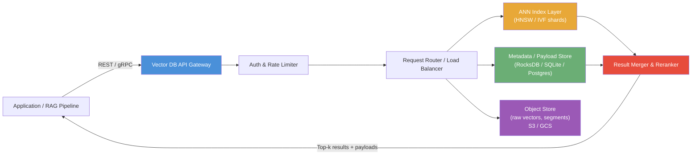
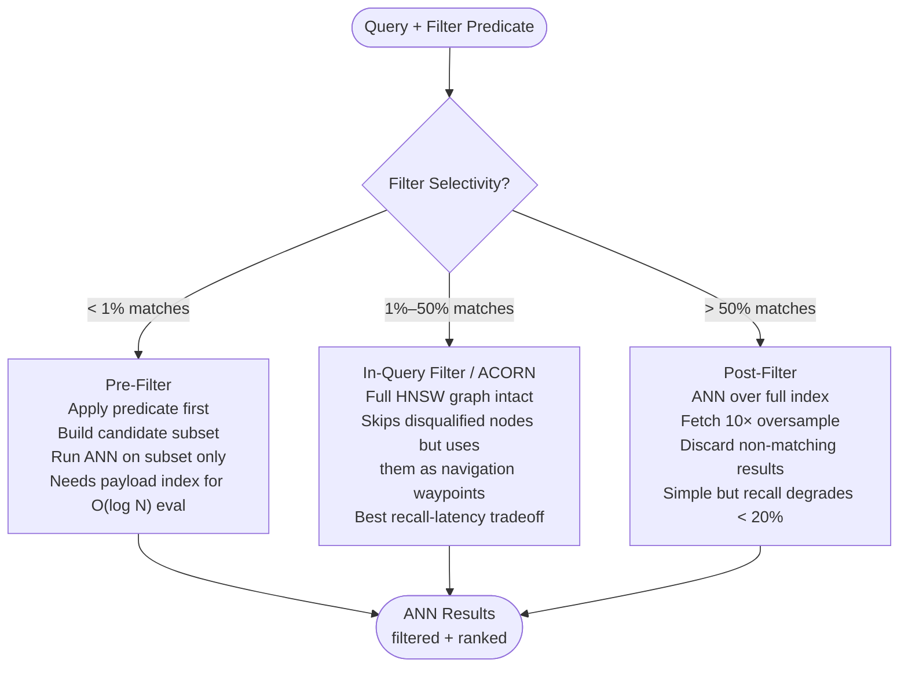
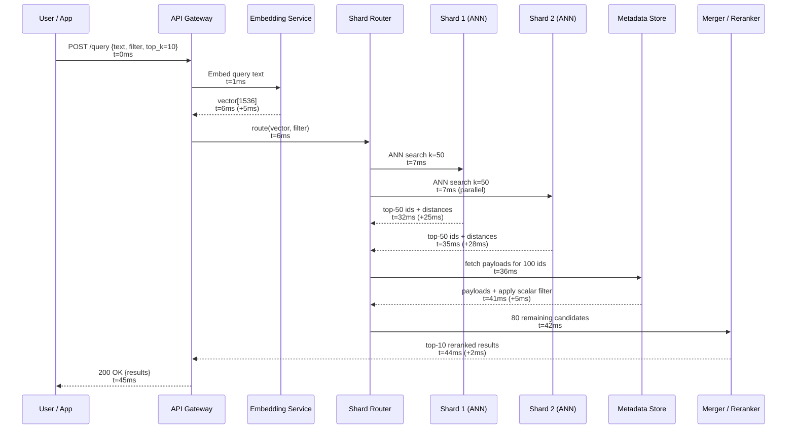
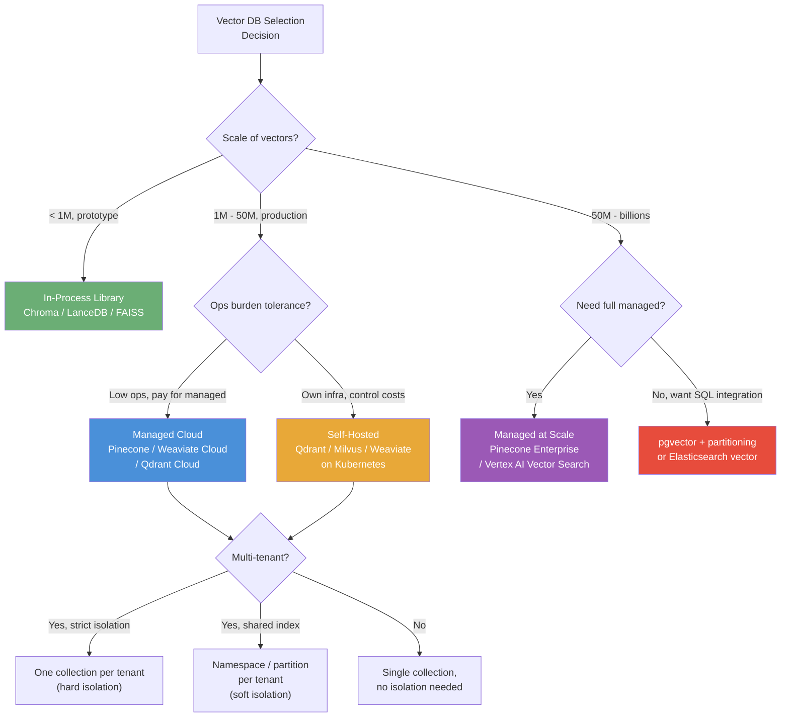
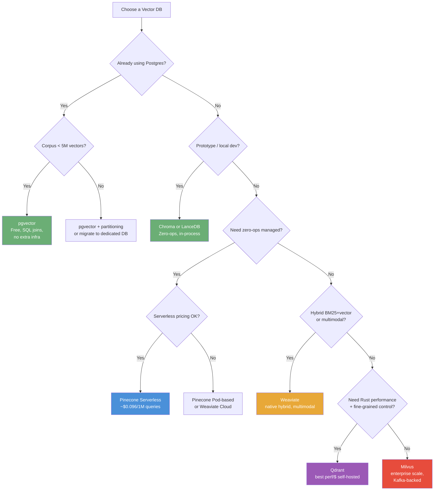

# Vector Databases

## Overview

A vector database stores high-dimensional numeric vectors — typically [embeddings](01-embedding-models.md) from ML models — and answers approximate nearest-neighbor (ANN) queries in milliseconds, even over billions of vectors. Unlike a relational database that matches rows by equality or range predicates, a vector database matches by geometric proximity in embedding space, making it the backbone of semantic search, retrieval-augmented generation, and recommendation systems. Modern systems combine ANN search with structured metadata filtering, hybrid keyword+vector queries, and multi-tenant namespace isolation inside a single managed service.

---

## Why Purpose-Built Vector Databases Emerged

Before specialized vector databases existed, teams tried to store embeddings in PostgreSQL `float[]` columns and compute similarity with a full table scan. At 100k vectors and 768 dimensions, a single cosine similarity scan takes ~200ms on a well-tuned Postgres instance. At 1M vectors it exceeds 2 seconds; at 10M it becomes untenable for real-time use. General-purpose search engines like Elasticsearch could invert keyword tokens but had no distance-based index for continuous vectors. The result was a hard ceiling: semantic search worked in proof-of-concept notebooks but could not survive production traffic at scale without an entirely different indexing strategy. Vector databases solve this by:

- Replacing the exact linear scan with an approximate index that trades a small recall loss (~2-5%) for 100-1000x speedup.
- Providing native metadata filter push-down so that ANN search and scalar predicates execute together rather than in two sequential passes.
- Offering a horizontal scaling story: shard the index, replicate shards, and add nodes without changing the query API.

Without this, every embedding-powered feature degrades linearly with corpus size, making billion-scale retrieval for production RAG or recommendation impossible.

In 2016-2019, the dominant approach was to run [FAISS](03-indexing-algorithms-ann.md) (Facebook AI Similarity Search) as an in-process library: embed queries on the fly, call `index.search()`, and serve results. FAISS is blazing fast in a single process but offers no persistence, no metadata filtering, no multi-tenancy, and no horizontal scaling. Teams bolted on a relational database to store metadata and joined results post-hoc — a two-trip architecture with no index co-location. Elasticsearch added approximate KNN (HNSW via Lucene) in 7.x but it was an afterthought alongside text inverted indexes; filtering semantics were awkward, and memory overhead was high.

The first generation of purpose-built vector databases (Pinecone 2021, Weaviate, Qdrant, Milvus) recognized that vectors are first-class citizens deserving their own storage engine with tight coupling between the ANN index and the payload store. They also packaged what FAISS could not: HTTP/gRPC APIs, serverless scaling, RBAC, multi-tenant namespaces, and operational tooling. The rise of LLMs in 2022-2023 and the explosion of RAG pipelines made vector databases the hottest infrastructure category, driving a proliferation of options from fully managed clouds to embeddable libraries like Chroma and LanceDB.

A **vector database** is a purpose-built data store whose primary index is a high-dimensional vector index (commonly HNSW, IVF-PQ, or DiskANN) optimized for approximate nearest-neighbor search under a distance metric (cosine similarity, dot product, or L2). Each record ("point" or "document") pairs a floating-point vector of fixed dimensionality with an opaque payload of structured metadata. The system exposes upsert, delete, and query APIs; a query supplies a vector (or a text that is embedded server-side) and optional metadata predicates and returns the k most similar records ranked by distance, optionally post-processed by a reranker. Distributed deployments shard the index across nodes using consistent hashing and replicate shards for read availability, while providing eventual or strong consistency guarantees depending on the implementation.

---

## Core Concepts

### Distance Metrics

- **Cosine similarity**: angle between vectors; most common for NLP embeddings where magnitude is meaningless.
- **Dot product**: magnitude-aware; used when embeddings are trained with dot-product loss (e.g., OpenAI `text-embedding-3`).
- **Euclidean (L2)**: raw spatial distance; common in image embeddings and recommendation systems.

### ANN Index Structures

See [Indexing Algorithms (ANN/HNSW/IVF)](03-indexing-algorithms-ann.md) for deep coverage. In brief:

- **HNSW** (Hierarchical Navigable Small World): graph-based; excellent recall at low latency; high memory usage; used by Qdrant, Weaviate, pgvector, Elasticsearch.
- **IVF-PQ** (Inverted File with Product Quantization): cluster-then-search; supports quantization to shrink RAM footprint; used by Milvus/Faiss.
- **DiskANN**: graph-based but designed for NVMe-resident indexes; enables trillion-scale at reduced DRAM cost.

### Payload / Metadata

Each vector has a structured payload (JSON or schema-defined fields): author, date, document_id, language, tenant_id, etc. Metadata predicates filter the candidate pool before or after ANN search.

### Filtering Strategies

- **Pre-filter**: apply scalar filter first, then run ANN over the subset. Correct but slow when the subset is large (loses graph structure efficiency).
- **Post-filter**: run ANN over the full index, then discard results failing the predicate. Fast but recall degrades when the filter is selective.
- **In-query / ACORN filter**: the ANN graph traversal is filter-aware; it skips disqualified nodes during graph exploration. Qdrant and Weaviate implement variants of this. Best recall-latency tradeoff.

### Namespaces and Collections

- **Collection** (Weaviate: Class, Qdrant: Collection, Pinecone: Index): a logical container with a fixed vector dimension and distance metric. Separate indexes, no cross-collection ANN.
- **Namespace** (Pinecone) / **Partition** (Qdrant): a logical shard within a collection sharing the same index. Enables multi-tenancy: tenant A queries only their namespace without scanning tenant B's data.

### Embedding Dimensions and Memory

Memory for a dense float32 HNSW index: `N × D × 4 bytes × (1 + HNSW overhead factor ~1.5)`.

- 1M vectors × 1536 dims × 4 × 1.5 ≈ **~9 GB RAM** (pure index).
- In practice, with payload and segment overhead, plan for 12-15 GB per 1M vectors at 1536 dims.
- Quantization (int8 or binary) can reduce this to 3-5 GB at ~1-3% recall cost.

### Consistency Models

Most distributed vector databases use **eventual consistency** on writes: an upsert is acknowledged after writing to a WAL and a quorum of replicas, but the HNSW graph rebuild propagates asynchronously. Milvus uses a segment-based architecture with a log-broker (Pulsar/Kafka) for durability. Qdrant offers write consistency levels (one/majority/all). Strong consistency for vector search requires expensive quorum reads and is rarely needed for semantic retrieval.

---

## Write Path and Read Path

The write path takes a client upsert through normalization, WAL durability, shard routing, HNSW graph update, and segment sealing. The read path takes a query vector through ANN scatter-gather across shards, metadata filtering, merge, and reranking to return top-K results.

### High-Level Architecture

### Detailed Write Path and Read Path

**Component responsibilities along each path:**

| Component | Owns | Does NOT Own |
|---|---|---|
| **API Gateway** | Auth, rate limiting, request validation, TLS termination | Business logic, embedding generation |
| **Request Router** | Consistent-hash-based shard routing, load balancing across replicas | Index construction, query execution |
| **ANN Index (HNSW/IVF)** | Vector similarity computation, graph traversal, top-k selection | Metadata predicates, payload retrieval |
| **Payload / Metadata Store** | Structured JSON payloads, scalar filter execution, attribute indexing | Vector similarity math |
| **WAL / Commit Log** | Durability before acknowledgment, crash recovery, replica sync | Query path |
| **Segment Manager** | In-memory buffer, segment sealing, compaction, soft-delete cleanup | Embedding generation, ANN graph traversal |
| **Object Store (S3/GCS)** | Long-term segment persistence, backup, cross-AZ replication | Low-latency query serving |
| **Result Merger** | Multi-shard top-k merge (k-way heap), optional reranking | Initial ANN computation |
| **Embedding Service** | (Optional, external) vector generation from text | Storage, indexing, retrieval |

---

## Metadata Filtering Strategies

Metadata filtering is one of the most operationally significant design decisions in a vector database deployment. The strategy chosen determines both query recall and latency far more than ANN parameter tuning alone.

### Pre-Filter

Apply the scalar predicate first to build a candidate set, then run ANN over only those vectors. This is precise — every ANN candidate satisfies the filter — but slow when the filtered set is large. HNSW's navigational efficiency depends on the full graph structure; a pre-filtered subgraph may be poorly connected, forcing the traversal to take many more hops. Pre-filter works well only when the filter is highly selective (e.g., 0.1% of the corpus matches, leaving a small dense subgraph).

### Post-Filter

Run ANN over the full index first, fetching the top-k × oversampling factor (e.g., top-500 when you need top-10), then discard results failing the predicate. Fast, because the full graph structure is intact during traversal. However, recall degrades badly when the filter is selective: if only 5% of vectors match the filter, most of the top-500 ANN candidates may be discarded, leaving fewer than 10 valid results even though the true nearest matching neighbors exist in the corpus.

### In-Query Filter (ACORN)

The ANN graph traversal is filter-aware: it skips disqualified nodes during graph exploration while still using them as navigation waypoints when they are the best available path. Qdrant and Weaviate implement variants of this (Qdrant calls its implementation "filtered HNSW"; the general pattern is ACORN). This provides the best recall-latency tradeoff for most production filter selectivities (1%-50% of corpus), because the traversal can still navigate through nodes that fail the filter to reach nodes that pass it.

**Rule of thumb:** if your filter passes >10% of the corpus, use in-query filter. If <1%, pre-filter (the subgraph is small enough to be well-connected). Avoid pure post-filter unless the filter is very permissive (>80%).

### Metadata Store and Payload Indexing

The metadata/payload store — typically LMDB, RocksDB, or a columnar store — holds structured fields alongside the vector. For in-query and pre-filter strategies to be fast, the metadata store must support fast scalar lookups. Qdrant allows explicit payload index creation (`create_payload_index`) on fields used in filters, converting filter evaluation from O(N) scan to O(log N) or O(1) hash lookup. Without payload indexing, even an in-query filter must evaluate the predicate on every candidate node visited during traversal.

**Filtering latency and recall impacts (approximate, 10M vectors):**

| Strategy | Latency (p50) | Recall@10 (5% filter selectivity) | When to use |
|---|---|---|---|
| Pre-filter (no payload index) | 50-200ms | 95%+ | Filter selectivity <1%, small corpus |
| Pre-filter (with payload index) | 10-30ms | 95%+ | Filter selectivity <1% |
| Post-filter (10× oversample) | 10-20ms | 60-75% | Filter selectivity >50% |
| In-query / ACORN | 15-40ms | 90-98% | Filter selectivity 1%-50% |

---

## A Query from Text to Top-K Results

A user query travels through embedding generation, shard fan-out, ANN search, metadata filtering, reranking, and serialization before results reach the client. Each hop has a measurable latency budget.

**Latency budget (p50, 1M vectors, managed cloud):**

| Hop | Latency |
|---|---|
| Embedding generation | ~5ms |
| ANN search per shard (HNSW, ef=64) | ~10-50ms |
| Metadata filter + payload fetch | ~5ms |
| Multi-shard merge + rerank | ~2ms |
| Network + serialization | ~3-5ms |
| **Total p50** | **~25-67ms** |
| **Total p99** | **<100ms** |

Note that because ANN search is fanned out to all shards in parallel, the total ANN latency is determined by the slowest shard (the max), not the sum. This makes the shard count a lever for managing index size, not latency. To improve p99, tune `ef_search` down (accepting slightly lower recall) or reduce shard memory pressure.

---

## Deployment Models and Multi-Tenancy Patterns

### Managed SaaS

**Pinecone** offers a serverless tier (~$0.096/1M read units, ~$2/1M write units) and pod-based tiers (p1.x1 ≈ 1M vectors at ~$70/month). Zero ops burden; fully managed scaling, backups, and RBAC. Opaque internals; pricing at scale can exceed self-hosted by 5-10x.

**Weaviate Cloud** provides native hybrid BM25+vector search and multimodal support. Sandbox free for 14 days; paid from ~$25/month. Higher ops complexity than Pinecone even in the managed tier.

**Zilliz** (managed Milvus): enterprise-grade managed Kubernetes deployment. Best for teams already invested in Milvus semantics who want to offload cluster operations.

### Self-Hosted

**Qdrant**: Rust-based, best performance per dollar self-hosted. Single node handles ~100M vectors with scalar quantization. Kubernetes Helm chart available; exposes Prometheus `/metrics`. Smaller ecosystem than Milvus but simpler cluster ops.

**Weaviate**: supports hybrid BM25+vector natively (not a bolt-on). Higher RAM overhead than Qdrant; better for teams needing GraphQL API or multimodal vectors.

**Milvus**: separated storage/compute (query nodes, index nodes, data nodes, log broker via Pulsar/Kafka). The most complex cluster to operate (8+ components) but battle-tested at hundreds of billions of vectors. Meta has reported 1 trillion vectors in research deployments.

**pgvector / pgvectorscale**: HNSW directly in Postgres. Free, ACID transactions, SQL joins. Single-threaded HNSW build; practical limit ~5-10M vectors per table without pgvectorscale partitioning.

### Multi-Tenancy Isolation Strategies

| Strategy | Isolation | Max Tenants | Overhead |
|---|---|---|---|
| **Collection per tenant** | Hard — separate HNSW index, separate memory | ~100 large tenants | High: one index manager per tenant |
| **Namespace/partition per tenant** | Soft — shared index, query-time routing | ~10,000 medium tenants | Medium: one metadata object per namespace |
| **Payload field + in-query filter** | Soft — shared index, filter at traversal time | Millions of users | Low: no extra metadata objects |

Use collection-per-tenant for <100 tenants with large datasets (hard isolation, no cross-tenant scan risk). Use namespaces/partitions within one collection for 100-100,000 small tenants (shared HNSW overhead amortized). For per-user isolation at millions of users, store `user_id` as a payload field and use in-query filtering with ACL enforcement at the application layer. See [Multi-Tenancy for AI Platforms](../22-enterprise-ai/02-multi-tenancy-for-ai-platforms.md).

---

## Choosing the Right Vector Database

### Comparison Table

| System | Managed | Scale | Filtering | Cost | When it wins |
|---|---|---|---|---|---|
| **Pinecone** | Yes (SaaS) | Billions (managed) | Namespace + payload | High at scale | Zero-ops requirement; sub-10ms p50 SLA |
| **Qdrant** | Self-hosted / cloud | 100M+ self-hosted | ACORN in-query, best-in-class | Best perf/$ | Self-hosted; Rust performance; fine-grained control |
| **Weaviate** | Self-hosted / cloud | 100M+ with cluster | Native hybrid BM25+vector | Medium | Hybrid search; multimodal; GraphQL |
| **Milvus** | Self-hosted / Zilliz | Billions self-hosted | IVF-PQ pre/post filter | High ops cost | Enterprise Kubernetes; hundreds of billions of vectors |
| **pgvector** | Via Postgres (RDS, etc.) | ~5-10M per table | SQL WHERE (pre-filter) | Near zero | Existing Postgres infra; ACID; SQL joins; small corpus |
| **Chroma** | No (in-process) | ~1M in-process | Python predicate | Free | Local dev; prototypes; no horizontal scale needed |
| **Elasticsearch** | Yes (Elastic Cloud) | 50M+ with hardware | BM25 + kNN hybrid | High memory | Existing ES cluster; BM25 + vector in one query |
| **Redis (RediSearch)** | Yes (Redis Cloud) | ~10M (RAM cost) | In-memory filter | High (RAM) | Ultra-low latency; in-memory speed; hot vector subset |

---

## Scalability

**Sharding via Consistent Hashing.** A vector index cannot be naively split by row-range because ANN graph edges cross shard boundaries. Instead, distributed vector DBs (Milvus, Qdrant) assign a vector to a shard using consistent hashing on its ID, then replicate each shard to R nodes (typically R=2 for HA). A query fans out to all shards, each shard returns its local top-k, and a merger performs a k-way heap merge. This means adding shards requires data re-balancing (not cheap — plan sharding upfront).

**Horizontal scale numbers:**

- Pinecone pods: p1.x1 = 1M vectors, p1.x8 = 8M vectors. Replicas multiply QPS linearly.
- Qdrant: tested at 1B vectors on a 100-node cluster. Single node handles ~100M with scalar quantization.
- Milvus: Meta reported 1 trillion vectors in research; production deployments in the hundreds of billions.

**Quantization for scale:** scalar quantization (float32 → int8) reduces index size 4x; binary quantization (float32 → 1 bit) reduces 32x but loses ~5-10% recall without re-scoring. Qdrant's oversampling + re-score pattern (fetch 10× candidates in quantized space, re-score top candidates in float32) recovers recall to >99% with ~2x speedup.

**Throughput benchmarks:**

- HNSW at 768 dims, ef=64: ~3,000-5,000 QPS per node on a 16-core machine.
- At 1536 dims: ~1,500-3,000 QPS per node (bandwidth-bound at high dims).
- With in-memory quantization: can reach 10,000 QPS per node at 768 dims.

---

## Reliability

**Replication.** All production-grade vector DBs support replica factor ≥ 2. A read quorum of 1 (any replica) achieves low read latency; a write quorum of majority ensures durability. Qdrant's `write_consistency_factor` and `read_consistency_type` are tunable per request.

**Segment compaction and soft delete.** Deleting a vector from an HNSW graph is expensive — removing a node can disconnect the graph. Instead, systems mark records as tombstones (soft delete) and lazily exclude them from search results. Periodic compaction rebuilds segments without tombstones. This means: (1) deleted vectors still consume RAM until the next compaction; (2) compaction is a background I/O-intensive operation — schedule it during off-peak hours. Re-indexing from scratch after a bulk delete requires a full segment rebuild, costing ~30-120 minutes per billion vectors.

**Backup and recovery.** Managed services (Pinecone, Weaviate Cloud) handle snapshots automatically. For self-hosted, Qdrant exposes a `/snapshots` API; Milvus integrates with MinIO. RTO depends on snapshot frequency and segment count; plan for 10-30 minutes to restore 100M vectors from object store.

**Crash recovery.** The WAL (write-ahead log) ensures that upserts acknowledged to the client survive node crashes. On restart, the node replays the WAL before rejoining the cluster. HNSW graphs are rebuilt from persisted segment files, not the WAL, so cold start can take minutes for large segments.

---

## Security

- **Authentication:** API key (Pinecone, Qdrant), JWT, or mTLS. Always rotate keys; use short-lived credentials for production.
- **Authorization / Multi-tenancy isolation:** Namespace-level isolation (Pinecone) ensures tenant A cannot query tenant B's vectors. Collection-per-tenant (Weaviate, Qdrant) provides stronger isolation with separate indexes. RBAC at collection granularity is available in Weaviate and Milvus enterprise.
- **Encryption at rest:** AES-256 for managed services. For self-hosted, use encrypted volumes (AWS EBS, GCP PD).
- **Encryption in transit:** TLS 1.2+ on all API endpoints. For internal cluster communication (Milvus, Weaviate cluster), configure inter-node TLS.
- **Data residency:** Pinecone pods are region-pinned. For GDPR, ensure vectors and payloads (which may contain PII) stay in the target region. Use separate collections per data-residency zone.
- **Vector poisoning:** an adversary who can inject vectors can manipulate retrieval (recall-based attack on RAG). Validate and sanitize document sources before embedding; log all upsert operations for audit.

---

## Cost Optimization

**Memory is the dominant cost driver.** 1M vectors at 1536 dims float32 ≈ 6 GB raw; with HNSW overhead ≈ 9-12 GB RAM. On a cloud VM with 16 GB RAM ($50-100/month on GCP/AWS), that's roughly **$50-100 per million dense vectors per month** self-hosted, fully loaded.

**Managed pricing (as of 2025):**

| Service | Pricing Model | Approximate Cost |
|---|---|---|
| Pinecone Serverless | $0.096/1M read units; $2/1M write units | ~$50-200/month for 10M vectors + moderate traffic |
| Pinecone Pod (p1.x1) | ~$70/month per pod (1M vectors, 1 replica) | Scales linearly with pods |
| Pinecone Pod (p1.x8) | ~$560/month per pod (8M vectors) | $70/pod × 8 |
| Weaviate Cloud (Sandbox) | Free for 14 days; paid from ~$25/month | Usage-based |
| Qdrant Cloud | Free tier 1GB; ~$25-100/month for production clusters | Based on RAM |
| Self-hosted Qdrant (16GB VM) | ~$50-100/month VM cost | + Engineering ops time |
| pgvector (on existing Postgres) | $0 additional licensing | Compute overhead only |

**Cost levers:**

1. **Quantization**: scalar int8 quantization cuts memory (and cost) by 4x with <2% recall loss. Binary quantization cuts by 32x but requires re-scoring.
2. **Dimension reduction**: PCA or Matryoshka embeddings from 1536 → 512 dims cuts memory 3x; test recall impact on your data.
3. **Tiered storage (DiskANN)**: keep hot vectors in RAM, cold vectors on NVMe. Milvus supports this natively. Reduces cost for large corpora with skewed access patterns.
4. **Right-size replicas**: replicas multiply cost but only improve QPS. If p99 < 100ms with 1 replica, don't add a second just for "HA" — use cross-AZ for HA at lower cost.
5. **Namespace consolidation**: running 1 collection with namespaces vs 100 collections has dramatically lower overhead (no per-collection index manager processes).

---

## Monitoring

**Key metrics to alert on:**

| Metric | Warning Threshold | Critical Threshold | What It Indicates |
|---|---|---|---|
| Query latency p99 | >80ms | >200ms | Index fragmentation, hot shard, low ef |
| ANN recall (offline eval) | <95% | <90% | Index misconfiguration, heavy deletes |
| Shard memory usage | >75% | >90% | Approaching OOM, need scale-out |
| Tombstone ratio | >10% | >20% | Need compaction trigger |
| Write queue depth | >1000 | >5000 | Write amplification, slow indexing |
| Replica lag | >5s | >30s | Replica falling behind, stale reads |
| Embedding service latency | >20ms | >100ms | Upstream bottleneck affecting total query latency |

**Tooling:**

- Qdrant: `/metrics` Prometheus endpoint; Grafana dashboards available in official repo.
- Weaviate: Prometheus + Grafana; track `weaviate_vector_index_operations_total`.
- Pinecone: Dashboard metrics for QPS, latency, and pod fill ratio. No custom Prometheus scraping.
- Milvus: built-in Grafana dashboards via Milvus Operator; tracks segment states, compaction jobs, and proxy latency.

**Recall monitoring.** Latency is easy to measure; recall is not. Build an offline evaluation pipeline: maintain a small labeled query set with ground-truth nearest neighbors (computed via exact search on a sample corpus), run it daily, and alert if recall@10 drops below your SLA threshold (typically 95%). Recall can degrade silently as the index grows and HNSW parameters become suboptimal.

---

## Production Best Practices

1. **Size your index before you write.** Compute `N × D × 4 × 1.5` and ensure your node has 2x that in RAM. Running HNSW with <20% free RAM causes thrashing and latency spikes.

2. **Use upsert, not insert + update.** All major vector DBs handle idempotent upserts natively. Separate insert/update patterns cause double-writes and index bloat.

3. **Batch upserts.** Single-vector upserts have per-request overhead. Batch in groups of 100-500 vectors for 10-20x write throughput improvement.

4. **Pre-filter is rarely the right choice for production.** Unless your filter reduces the corpus to <1% of total vectors, in-query filtering (Qdrant ACORN, Weaviate ACORN-like) or post-filter with oversampling (fetch 10× k then filter) gives better recall-latency tradeoffs.

5. **Pin your embedding model version.** Embedding model updates change the vector space entirely. If you update the embedding model without re-indexing all vectors, queries and stored vectors will be in different spaces and retrieval will silently degrade. See [Embedding Models](01-embedding-models.md) for versioning strategies.

6. **Tune ef_search, not m, for query-time recall.** `m` (number of HNSW links per node) is set at index build time and cannot be changed without full re-index. `ef_search` (search exploration factor) is a per-query parameter: increase it for higher recall at the cost of latency, decrease for speed. A good default: `ef_search = 2 × top_k`.

7. **Plan for compaction downtime.** Major compaction (full segment rebuild after bulk deletes) blocks writes on single-node deployments. In clustered setups, roll compaction across replicas to avoid downtime.

8. **Use separate collections for incompatible embedding spaces.** If your system uses multiple embedding models (e.g., multilingual + English-only), store them in separate collections with separate indexes. Cross-model ANN search is meaningless.

9. **Cross-lingual retrieval strategy.** Option A: use a single multilingual embedding model (e.g., `multilingual-e5-large`) — simpler ops, slightly lower per-language recall (~2-5% vs. language-specific models). Option B: separate indexes per language with a language-detection router — higher recall but N-times the index maintenance. For most production systems, Option A is preferred; Option B is warranted only when per-language SLA precision is contractual.

10. **Namespace vs. collection for multi-tenancy.** For <100 tenants with large datasets, use separate collections (hard isolation, no cross-tenant scan risk). For 100-100,000 small tenants, use namespaces/partitions within one collection (shared index overhead amortized). See [Multi-Tenancy for AI Platforms](../22-enterprise-ai/02-multi-tenancy-for-ai-platforms.md).

---

## Real-World Examples

**Notion (RAG over workspace documents).** Notion's AI uses pgvector on Aurora Postgres for their initial semantic search implementation (publicly discussed at PGConf). At their scale (~10M documents per large enterprise tenant), they partition the table by workspace and use partial indexes. This works because most workspace corpora fit within pgvector's practical limit; they do not need billion-scale retrieval. The integration with existing Postgres infrastructure (connection pooling, RLS for access control, existing backups) outweighed the performance benefits of a dedicated vector DB.

**Shopify (product recommendations).** Shopify's ML platform team (per public engineering blog) uses a managed vector DB to serve embedding-based product recommendations at Shopify scale (~1.7M merchants, billions of product impressions). They run embedding generation offline (batch), store vectors with product metadata as payload, and serve real-time ANN queries filtered by merchant_id namespace.

**Slack / Salesforce (enterprise search).** Enterprises deploying RAG over Slack archives face a classic multi-tenant problem: user A must not retrieve user B's private messages. The pattern is collection-per-workspace or namespace-per-user-group, with metadata payload containing channel visibility and ACL hashes, and post-retrieval ACL enforcement as a second filter. This double-filter pattern (vector filter + ACL check) is the production-safe approach even when the vector DB offers namespace isolation.

---

## Interview Questions

### Beginner

**Q: What is a vector database and why can't you just use a regular SQL database for similarity search?**

A: A vector database is a data store optimized for finding records whose stored vectors are geometrically closest to a query vector, using an ANN index (commonly HNSW or IVF-PQ) rather than B-tree or hash indexes. A regular SQL database can store vectors as `float[]` columns but must perform a full sequential scan to compute distances — O(N) per query with no index pruning. At 1M vectors and 1536 dimensions, this is billions of multiply-accumulate operations per query, taking 1-5 seconds. A vector database with HNSW can answer the same query in 10-50ms by traversing a proximity graph that was built at index time, visiting only a tiny fraction of the corpus. SQL databases also lack native support for distance metrics (cosine, dot product) and metadata filter push-down during ANN traversal.

**Q: What is the difference between ANN and exact nearest-neighbor search? When do you use each?**

A: Exact nearest-neighbor (KNN) compares the query against every vector, guaranteeing the true top-k by distance. It is O(N × D) per query — only practical for corpora under ~100k vectors or when recall must be 100% (medical imaging, fraud detection where a near-miss is unacceptable). ANN trades a small recall loss (typically 2-5%, meaning ~95-98 of the true top-100 are returned) for 100-1000x speedup via graph or cluster-based pruning. For semantic search and RAG, 95%+ recall is perfectly acceptable — the downstream LLM handles imprecision, and the user-facing quality difference between 95% and 100% recall is undetectable. Use exact KNN only when you can prove your corpus will stay small or when the cost of a missed true-nearest-neighbor is catastrophic.

### Intermediate

**Q: Explain pre-filter vs post-filter vs in-query filter for metadata filtering in vector search. What are the tradeoffs?**

A: Pre-filter applies the scalar predicate first, building a candidate set, then runs ANN over only those vectors. This is precise but slow when the filtered set is large (you lose the graph structure efficiency of HNSW — the filtered subgraph may be poorly connected). It works well only when the filter is highly selective (e.g., 0.1% of the corpus matches). Post-filter runs ANN over the full index, fetches the top-k × oversampling factor (e.g., top-500 when you need top-10), then discards results failing the predicate. Fast, but recall degrades badly when the filter is selective (most of the top-500 may be filtered out, leaving fewer than 10 valid results). In-query filter (ACORN, implemented in Qdrant and Weaviate) modifies the HNSW graph traversal itself to skip disqualified nodes, maintaining good graph connectivity. This provides the best recall-latency tradeoff for most production filter selectivities (1%-50% of corpus). The rule of thumb: if your filter passes >10% of the corpus, use in-query filter; if <1%, pre-filter; avoid pure post-filter unless the filter is very permissive (>80%).

**Q: How does consistent hashing enable horizontal scaling of a vector index, and what are its limitations?**

A: Each vector is assigned to a shard by hashing its ID (e.g., using jump consistent hash or rendezvous hashing) to produce a stable shard assignment without a centralized lookup table. Each shard holds a complete HNSW graph over its subset of vectors. On query, the coordinator fans out to all shards in parallel, each shard returns its local top-k, and a k-way heap merge produces the global top-k. This is linearly scalable for reads (add shards, add replicas per shard). Limitations: (1) cross-shard graph edges don't exist, so each shard's ANN is over its local subset — recall is slightly lower than a global index at the same ef setting; compensate by fetching top-k × shard_count from each shard. (2) Adding a new shard requires rebalancing (re-routing ~1/N of vectors to the new shard and rebuilding the affected shard's HNSW graphs) — this is operationally expensive. Size shards correctly upfront. (3) Hotspot shards can occur if ID distribution is skewed; prefer random UUIDs as IDs over sequential integers.

### Senior

**Q: You have a RAG system with 500M documents, p99 latency SLA of 100ms, multi-tenant (10,000 tenants), and budget of $5,000/month. Design the vector DB layer.**

A: At 500M documents × 1536 dims float32, the raw index size is ~3 TB before HNSW overhead — far beyond single-node capacity. This requires a distributed, sharded deployment. Budget ($5,000/month) eliminates Pinecone pod-based pricing (would cost ~$35,000/month for 500M vectors at p1 pods). Options: self-hosted Milvus or Qdrant on Kubernetes.

Architecture: Qdrant cluster on Kubernetes (EKS/GKE), 10 shards × 3 replicas = 30 Qdrant nodes. Each shard holds 50M vectors. With scalar quantization (float32→int8), each shard needs ~50M × 1536 × 1 × 1.5 = ~112 GB RAM. Use nodes with 128 GB RAM; at ~$0.75/GB-hour on-demand (AWS r6i.4xlarge ~$1.00/hour = $720/month), 30 nodes = ~$21,600/month on-demand. To hit $5,000: use 3-year reserved instances (~60% discount → ~$8,640/month) or Spot instances for read replicas (~70% discount). Realistically, this use case requires ~$8-15K/month self-hosted with reserved instances and 3 replicas, or accept higher risk with spot replicas.

For multi-tenancy with 10,000 tenants: use namespace partitions (not separate collections) to avoid 10,000 separate HNSW indexes. Store `tenant_id` as a payload field, use in-query filter for tenant isolation. For the largest tenants (top 1% with millions of documents each), consider separate collections. P99 <100ms: with 10 shards, each shard's ANN over 50M vectors takes ~20-40ms at ef_search=64 with quantization; parallel fan-out means total ANN latency ≈ shard latency, not sum. Add 5ms embed + 5ms merge + 5ms network = ~35-55ms p50, ~80-100ms p99. This is tight; tune ef_search down to 32 if needed (check recall impact).

**Q: A bulk delete of 20% of your 100M-vector index has caused query latency to spike and recall to drop. Walk through the diagnosis and remediation.**

A: The root cause is tombstone accumulation. HNSW does not physically remove deleted nodes — it marks them as tombstones and skips them during traversal. With 20M tombstones (20% of 100M), traversal must visit many more nodes to find 20M non-tombstoned neighbors, increasing latency. Additionally, the HNSW graph was built with those nodes as valid navigation waypoints; their logical absence creates connectivity gaps, degrading recall (the traversal path to some true nearest neighbors may go through a tombstoned node that is now skipped, leaving a dead end). Diagnosis: check the `tombstone_ratio` metric; query the segment stats API to confirm >15% tombstones. Remediation: trigger a segment compaction/rebuild. In Qdrant, call `POST /collections/{name}/index` to rebuild the HNSW index from scratch on a schedule. In Milvus, compaction is triggered automatically but can be forced via the SDK. Plan for this during off-peak: rebuilding 80M live vectors takes 45-90 minutes on a 32-core machine. To prevent recurrence: for bulk deletes, prefer re-creating the collection from a re-ingestion pipeline rather than in-place deletion; soft-delete via a `deleted` payload flag and filter it at query time until a planned rebuild window.

### Staff

**Q: Your cross-lingual RAG system serves 50 languages. A multilingual embedding model gives 3% worse recall than language-specific models. How do you decide whether to use one model or multiple, and what operational implications follow from each choice?**

A: The decision framework has two axes: recall SLA and operational cost. A 3% recall gap means if your baseline precision@10 is 80%, the multilingual model gives 77.6% — likely imperceptible to users in most RAG contexts, where the LLM compensates for minor retrieval noise. However, for high-stakes retrieval (legal documents, medical records, contractual language) in non-English languages that are underrepresented in multilingual training data, 3% can be much larger in practice (the gap for low-resource languages like Swahili or Nepali can be 10-15% vs. a fine-tuned language-specific model).

Single multilingual model: one collection, one ANN index, one set of infrastructure. Ingestion pipeline has one embedding step. Query path has no language detection. Recall gap tolerated. Operational cost: 1/N of the infrastructure of the multi-model approach.

Per-language model approach: 50 embedding models (realistically, a small number cover 90% of traffic — 10 models for the top 10 languages, a 51st multilingual catch-all for the long tail). Each requires its own collection (incompatible vector spaces). The routing layer detects query language and routes to the right collection. Operational cost: 50x index maintenance, 50x storage, 50x compaction windows, 50x backup jobs. Cross-language queries (translate first, then retrieve) require an additional translation hop.

**Recommendation for most production systems:** use one high-quality multilingual model (e.g., `multilingual-e5-large`, `paraphrase-multilingual-mpnet-base-v2`) with a single shared collection. If recall for specific high-value languages is contractually required to exceed the multilingual model's capability, add language-specific sub-collections only for those languages (e.g., 2-3 languages), not all 50. Accept the multilingual model for the remaining long tail. This delivers 90% of the recall benefit at 10% of the operational complexity.

---

## Google-Level Follow-Up Questions

**1. The HNSW graph is built assuming the data distribution is approximately stationary. What happens when the embedding space distribution drifts over time (e.g., new topics emerge, the embedding model is updated), and how do you detect and mitigate it?**

Distribution drift causes the HNSW graph's navigational shortcuts to no longer reflect the true nearest-neighbor structure of the current corpus. Detection: run weekly offline recall evaluations using a labeled query set; a drop in recall@10 of >2% signals structural drift. Also monitor query latency creep (more nodes visited per query = slower traversal over time). Mitigation options: (1) incremental upserts tolerate modest drift — HNSW handles new points reasonably well as long as the graph is not too stale; (2) periodic full re-index during maintenance windows (e.g., monthly); (3) if the embedding model itself changes, full re-embedding and re-indexing of all documents is mandatory — there is no shortcut. Design ingestion pipelines to be idempotent upserts keyed on document ID so re-embedding is a replay operation. Consider Matryoshka embeddings to reduce the cost of re-embedding at a smaller dimension.

**2. A FAISS-based system in a single process achieves 10ms p99 for 10M vectors. A distributed Qdrant cluster for the same corpus achieves 45ms p99. Why the latency difference and when would you accept it?**

FAISS in-process: the query vector and the index are in the same process memory space. ANN traversal is direct memory access with no serialization, no network hop, no TLS, no HTTP parsing. The HNSW traversal at 10M vectors at ef=64 is ~2-5ms of pure compute. Qdrant cluster adds: (1) network RTT to the Qdrant node (~1-5ms); (2) HTTP/gRPC serialization/deserialization (~1-2ms); (3) shard fan-out coordination (~2-5ms); (4) result merge over the wire. For small corpora (<10M vectors), the FAISS in-process latency advantage is real and matters for applications needing <20ms end-to-end (e.g., autocomplete, real-time recommendation while a user is typing). Accept the higher Qdrant latency when: (1) corpus exceeds single-process memory; (2) multiple services need to share the index; (3) persistence, RBAC, and operational tooling are required; (4) write throughput from multiple writers is needed. A hybrid: use an in-process library (LanceDB, FAISS) as a local cache for the hottest 1M vectors, backed by a distributed DB for the full corpus.

**3. A tenant in your multi-tenant vector DB has 10x more vectors than any other tenant and is causing "noisy neighbor" latency spikes for other tenants. How do you redesign the isolation model?**

The immediate mitigation: move the large tenant to a dedicated collection (and potentially dedicated nodes) rather than sharing a namespace. In Qdrant, use separate collections with a routing layer; in Milvus, use resource groups to pin large tenant collections to specific query nodes. At the infrastructure level, implement query-level rate limiting per tenant in the API gateway (token bucket, 1000 QPS burst, 100 QPS sustained per tenant). For long-term architecture: adopt a "whale tenant" detection heuristic at onboarding — tenants exceeding N vectors or M QPS are placed on dedicated infrastructure tiers rather than the shared pool. This is the same pattern Google uses for BigQuery slot reservations and Snowflake multi-cluster warehouses: shared for small tenants, dedicated for large ones.

**4. You need to serve vector search with <5ms p99. What architectural changes make this achievable?**

At <5ms p99, network latency alone (across datacenters) consumes most of the budget. Requirements: (1) co-locate the vector DB node in the same AZ as the application server (ideally the same host for in-process); (2) use a smaller embedding dimension (256-384 dims instead of 1536 — use Matryoshka embeddings truncated at inference time); (3) use binary quantization with in-memory indexing (no disk I/O); (4) reduce ef_search to 16-32 (accept slightly lower recall); (5) pre-warm the HNSW graph in hugepages to minimize TLB misses; (6) use gRPC (not REST) with connection pooling to eliminate connection setup latency; (7) keep the query corpus to <1M vectors per node (smaller graph = fewer hops). Achieving <5ms p99 at 10M+ vectors typically requires in-process FAISS with HNSW, or a highly optimized embedded library like Turbopuffer or USearch, not an off-the-shelf managed vector DB.

---

## Common Mistakes

1. **Using pgvector without testing at target scale.** Teams add pgvector in development on a 10k-row table, see 2ms queries, and assume it will scale. At 5M vectors, without an HNSW index on the `embedding` column (and without `SET hnsw.ef_search`), queries fall back to sequential scan and take seconds. Always benchmark with production-scale data before committing to pgvector for large corpora.

2. **Not re-indexing after bulk deletes.** After removing 15%+ of vectors, tombstone accumulation silently degrades both latency and recall. Teams observe "the search is getting worse" months after a corpus refresh without realizing that soft-deletes have fragmented the graph. Monitor tombstone ratio and schedule compaction proactively.

3. **Mismatched embedding models between ingestion and query.** A common mistake during model upgrades: new documents are embedded with model v2, but queries still use model v1 (or vice versa), because the embedding service was updated independently of the ingestion pipeline. Vectors from different model versions are in incompatible spaces; the ANN results are garbage. Enforce embedding model version as metadata on every vector and validate at query time.

4. **Ignoring the cold-start memory problem.** Qdrant and Weaviate load HNSW graphs into RAM on startup. On a node with 100M vectors, this can take 5-15 minutes during which the node serves no queries. Teams deploying with rolling restarts fail to account for this warmup period, causing cascading latency spikes. Pre-warm replicas before removing the old node from the load balancer.

5. **Using one namespace per user in a high-user-count system.** Creating a namespace per user for 1M users results in 1M namespace/partition metadata objects. This creates significant coordinator overhead in Qdrant/Milvus and is not the intended use of namespaces. Namespaces are for tens-to-thousands of logical tenants. For per-user isolation, store `user_id` as a payload field and use in-query filtering, with ACL enforcement at the application layer.

6. **Treating vector similarity as a ground truth relevance score.** A cosine similarity of 0.92 does not mean 92% relevant. Similarity scores are not calibrated probabilities. Teams that threshold on raw similarity scores (e.g., "only return results with similarity > 0.85") get brittle behavior that varies by embedding model, query length, and domain. Use a reranker (see [Hybrid Search & Reranking](04-hybrid-search-and-reranking.md)) or relative ranking, not absolute score thresholds.

---

## Key Takeaways

- **Vector databases exist because ANN search is fundamentally incompatible with B-tree/hash indexes.** The only way to achieve sub-100ms similarity search at millions-to-billions scale is a purpose-built proximity graph or cluster index (HNSW, IVF-PQ, DiskANN).
- **Memory is the first-order cost driver.** 1M vectors at 1536 dims float32 ≈ 9-12 GB RAM with HNSW overhead. Scalar quantization (int8) cuts this to 3-4 GB at <2% recall loss — almost always worth it in production.
- **Metadata filtering strategy determines recall more than ANN parameters.** Pre-filter destroys graph structure; post-filter loses recall on selective filters; in-query filtering (ACORN) is the production choice for 1-50% selectivity filters.
- **Soft-delete + periodic compaction is the universal delete pattern.** No major vector DB supports efficient immediate node removal from HNSW. Monitor tombstone ratio and compact before it exceeds 15%.
- **Embedding model version pinning is non-negotiable.** A model version mismatch between stored vectors and query vectors produces semantically random results with no error signal. Treat the embedding model as a schema version.
- **Multi-tenancy strategy depends on tenant count and isolation requirements.** <100 large tenants → separate collections. 100-100k small tenants → namespaces within one collection. >100k users → payload field + in-query filter, not namespaces.
- **For cross-lingual retrieval, a good multilingual model beats operational complexity of per-language indexes** for all but the most recall-sensitive, high-value language pairs. The operational cost of 50 separate indexes is rarely justified by a 2-5% recall improvement.
- **Choose the deployment model first, then the product.** Prototype (<1M vectors, no ops) → Chroma/LanceDB. SQL-ecosystem, <5M vectors → pgvector. Managed, no ops, any scale → Pinecone. Self-hosted, best perf/$ → Qdrant. Enterprise Kubernetes, billions of vectors → Milvus.

---

*Part of [Retrieval Systems](index.md) in the [AI System Design Notes](../index.md).*
