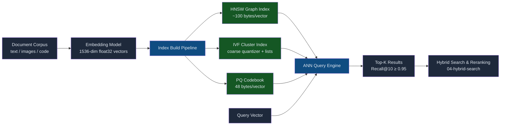
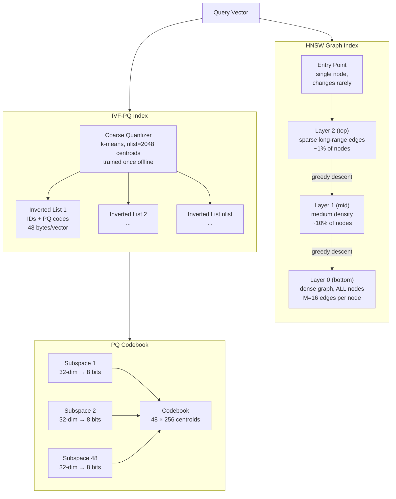
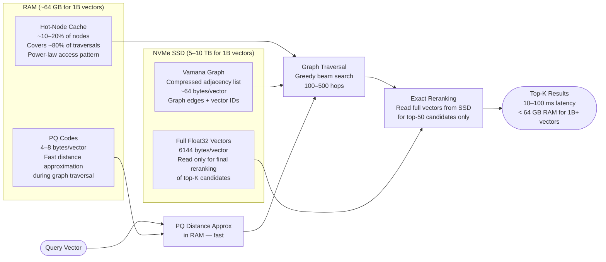
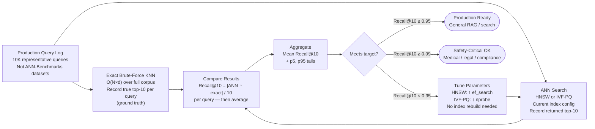
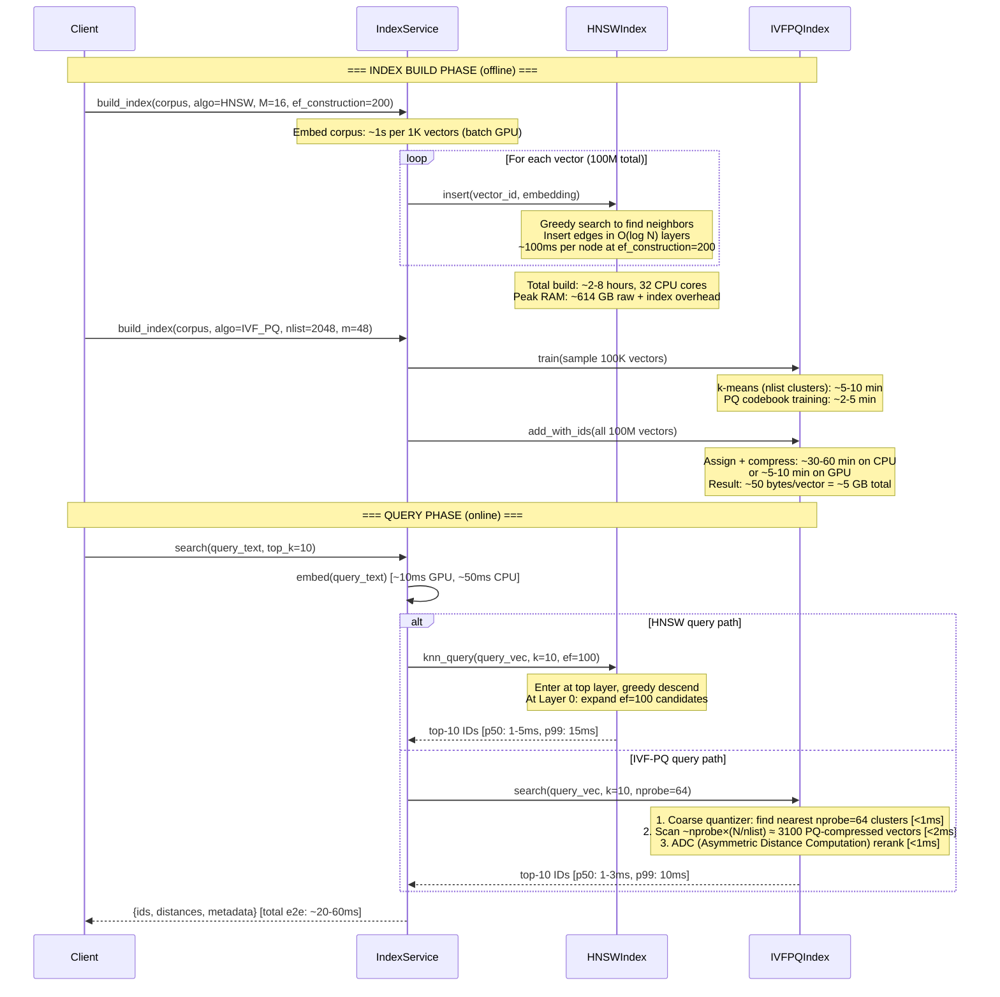
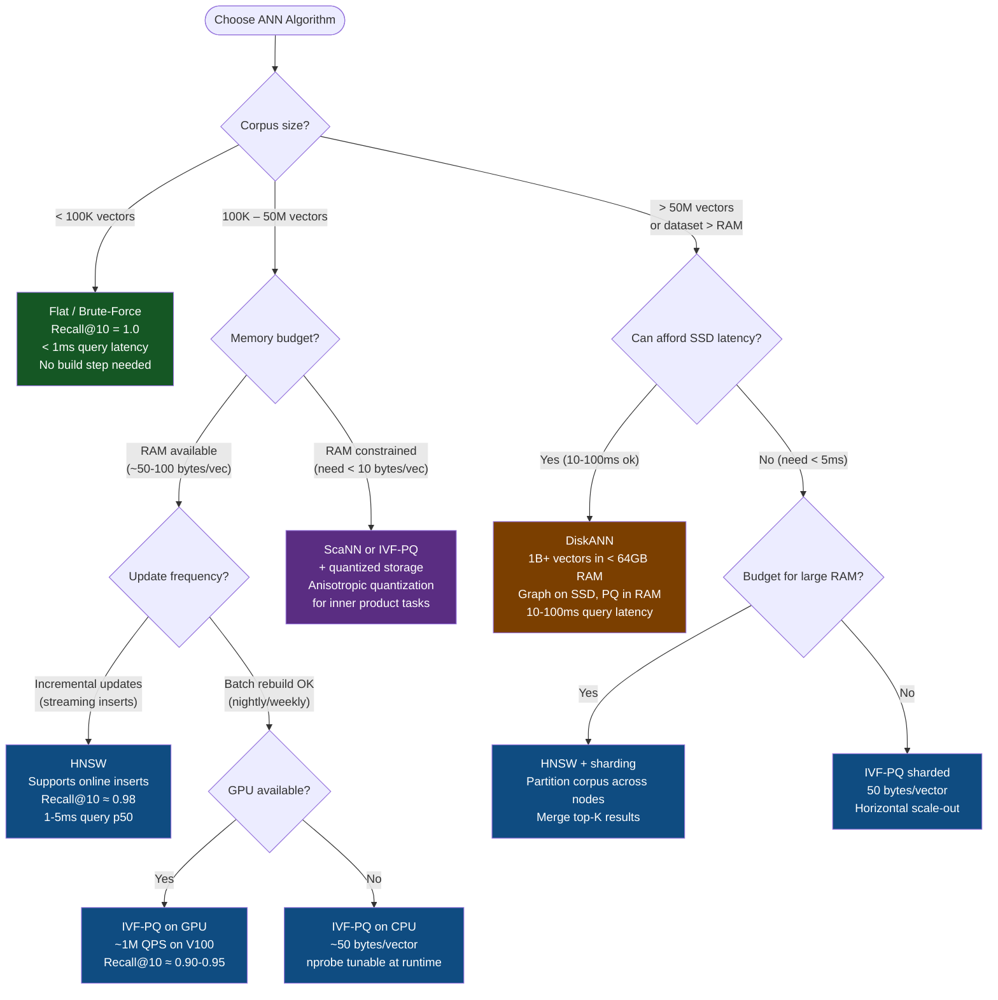
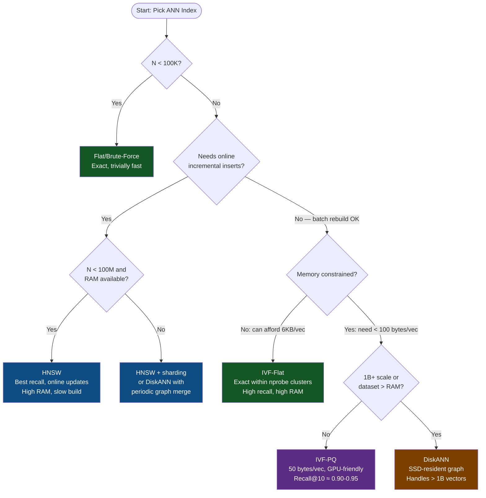

# Indexing Algorithms (ANN/HNSW/IVF)

## Overview

Approximate Nearest Neighbor (ANN) search is the engine behind every production vector retrieval system: instead of scanning every vector to find the closest match, these algorithms trade a small amount of recall for orders-of-magnitude speedups. The three dominant families—graph-based (HNSW), cluster-based (IVF), and compression-based (PQ)—each make different tradeoffs across memory, latency, recall, and update frequency. Choosing the right algorithm for a given corpus size, query budget, and memory envelope is one of the highest-leverage infrastructure decisions in any AI-powered system.

## From Exact Search to Approximate Nearest Neighbor

Exact nearest neighbor search over a corpus of N vectors each with dimensionality d requires computing N distance calculations per query, each taking O(d) time—giving O(N×d) total work. At N=100M vectors with d=1536 (OpenAI text-embedding-3-large dimensions), that is 1.536×10¹¹ floating-point operations per query. At 1 GFLOP/s per CPU core, a single query takes ~153 seconds. Even with a 32-core server doing 32 GFLOPs/s, you are looking at ~5 seconds per query—completely infeasible for a latency-sensitive application. Additionally, storing 100M × 1536 × 4 bytes = 614 GB of float32 vectors exhausts the RAM of all but the largest servers, so exact search is doubly infeasible: too slow and too large to fit in memory. ANN algorithms solve both problems simultaneously.

Early information retrieval used inverted indexes over token IDs (BM25); these are exact and cheap because token vocabularies are small. When dense embedding models began producing high-dimensional continuous vectors in the 2010s, practitioners first tried tree-based approaches: KD-trees and ball-trees partition the space recursively, giving O(log N) expected query time. This works well up to d≈20, but in high dimensions (d>100) the partitioning degenerates—every query visits nearly all nodes ("curse of dimensionality")—so trees offer no speedup over brute force above ~100 dimensions.

Locality Sensitive Hashing (LSH) was the next attempt: hash similar vectors into the same bucket so only bucket members need comparison. LSH works but requires many hash tables for good recall (memory-expensive) and performs poorly on modern GPU hardware. Around 2016, graph-based methods matured: the NSW (Navigable Small World) paper showed that a proximity graph with short- and long-range edges enables greedy nearest-neighbor routing in O(log N) hops. HNSW (2016, Malkov & Yashunin) added a hierarchical layer structure that made the routing logarithmically efficient even as N grows. Simultaneously, FAISS (Johnson et al., 2017) made IVF-PQ a practical billion-scale baseline with GPU acceleration. By 2020, these two lineages—graph-based and quantization-based—dominated production deployments, with DiskANN (2019) adding an SSD-resident variant for datasets too large for DRAM.

The fundamental recall-latency-memory triangle governs every ANN decision: you can improve any two axes only by sacrificing the third. Higher recall requires examining more candidates (higher latency) or storing more index structure (more memory). Lower latency requires examining fewer candidates (lower recall) or compressing the index (lower memory, but more quantization error). Every parameter in every algorithm is ultimately a point on this triangle.

## Core Concepts

**Distance metric**: All ANN algorithms operate over a distance function. Inner product (IP) and L2 Euclidean are most common; cosine similarity reduces to IP after L2 normalization. The choice of metric is baked into the index at build time and cannot be changed without rebuilding.

**Recall@K**: The fraction of true top-K nearest neighbors returned by the ANN query. Recall@10 = 0.97 means 9.7 of the true 10 nearest neighbors are returned on average. This is the only quality metric that matters in production; latency and memory are constraint axes.

**ef (exploration factor)**: In HNSW, the number of candidate neighbors examined during the greedy search. Higher ef → higher recall → higher latency. This is the primary runtime knob to tune recall vs. latency.

**M (max connections)**: In HNSW, the maximum number of bi-directional edges per node in the graph. M=16 is the typical default; M=32 improves recall at 2x memory cost. Each edge is 8 bytes (int64 node ID), so M=16 adds 16×2×8 = 256 bytes of edge storage per vector (both directions), totaling ~50-100 bytes of graph overhead per vector depending on the layer distribution.

**ef_construction**: The exploration factor used during HNSW index build. Higher ef_construction → better-connected graph → higher recall at query time, but slower build. Typical values: 100–400.

**nlist**: In IVF, the number of Voronoi cells (clusters) from the k-means partitioning. Typical values: 1024–65536 depending on corpus size. The rule of thumb is `nlist ≈ sqrt(N)` for N vectors.

**nprobe**: The number of IVF clusters examined per query. nprobe=1 is fastest but lowest recall; nprobe=nlist is exact search. Recall@10 ≈ 0.97 is achievable with nprobe=64, nlist=2048 on typical text embedding corpora.

**PQ (Product Quantization)**: Splits the d-dimensional vector into m equal subspaces of d/m dimensions each, then quantizes each subspace to one of 256 centroids (8 bits). A 1536-dim float32 vector (6144 bytes) compressed with m=48 subspaces occupies 48 bytes—a 128x compression ratio. Codebooks are trained once on a representative sample (typically 10–100x nlist vectors).

**FAISS**: The de-facto reference library implementing Flat (brute-force), IVF, IVF-PQ, HNSW, and combinations. Provides both CPU and GPU backends; GPU IVF-PQ can sustain ~1M queries/second on a single V100.

## HNSW: Hierarchical Navigable Small World

HNSW is a graph-based index where vectors are nodes in a multi-layer proximity graph. It achieves O(log N) expected query time by combining a skip-list-like hierarchical structure with greedy graph traversal.

**Layered graph structure**: HNSW builds a hierarchy of graphs. The top layer (Layer 2 and above) is sparse, containing only ~1% of all nodes, with long-range edges that provide fast global navigation. The middle layers contain increasing fractions of nodes. Layer 0 (the bottom layer) contains all N nodes, each connected to M=16 neighbors via bidirectional edges. The probability of a node appearing in layer l decreases exponentially with l, controlled by a normalization factor (typically 1/ln(M)).

**Construction**: To insert a new vector, HNSW randomly assigns it a maximum layer (drawn from the exponential distribution). Starting from the entry point at the top layer, a greedy search finds the ef_construction=200-500 nearest existing neighbors at each layer, then connects the new node to the M=16 closest ones with bidirectional edges. The entry point (the single node at the highest layer) changes rarely—only when a new node is assigned a higher layer than the current entry point.

**Query**: A query starts at the entry point in the top layer. At each layer, greedy descent selects the neighbor closest to the query and moves there, repeating until no closer neighbor exists. At Layer 0, an ef_search=100-200 candidate priority queue explores the neighborhood more thoroughly before returning the top-K results. The multi-layer structure means long-range edges carry the search to the right region of space in O(log N) hops, and the dense Layer 0 provides fine-grained local search.

**Key parameters**:
- M (neighbors per node): typically 16–64. M=16 is the default; M=32 doubles memory but improves recall ~1%.
- ef_construction: typically 200–500. Higher values produce a better-connected graph but slow builds.
- ef_search: typically 100–200. This is the primary runtime tuning knob; it can be changed without rebuilding.

**Memory**: O(M × N × 4 bytes) for graph edges, plus O(N × d × 4 bytes) for raw vectors. For 1M vectors with M=16 and d=1536: graph overhead ≈ 16 × 2 × 8 × 1M = 256 MB; raw vectors = 6 GB. Total ~6.25 GB for 1M vectors.

**Query time**: O(log N) expected hops across layers; in practice p50 is 1-5ms for N≤10M, rising slowly with N due to the logarithmic scaling.

## IVF and Product Quantization

IVF-PQ combines two orthogonal ideas: coarse partitioning via Inverted File Index (IVF) to narrow the search space, and Product Quantization (PQ) to compress vectors for memory-efficient distance computation.

**IVF — Inverted File Index**: The corpus is partitioned into nlist centroids (typically 4096) via k-means clustering, trained once offline on a representative sample. Each vector is assigned to its nearest centroid and stored in that centroid's inverted list. At query time, only nprobe nearest centroids (typically 64) are searched—so instead of scanning all N vectors, the query scans only nprobe × (N/nlist) ≈ 64 × (N/4096) ≈ 1.5% of the corpus. The coarse quantizer itself is cheap: finding the nearest centroid is a single brute-force scan over nlist centroids (not N vectors).

**PQ — Product Quantization**: Each 1536-dim float32 vector (6144 bytes) is split into 48 sub-vectors of 32 dimensions each. Each sub-vector is quantized to one of 256 centroids (trained separately per subspace), stored as 1 byte. Total: 48 bytes per vector—a 128x compression ratio versus the original 6144 bytes.

**Combined IVF-PQ**: Each inverted list stores only the 48-byte PQ codes (not the full 6144-byte float32 vectors). Query-time distance computation uses Asymmetric Distance Computation (ADC): precompute a 48×256 lookup table of distances between the query and all subspace centroids, then sum 48 table lookups per candidate—~48 additions instead of 1536 multiplications for exact distance, giving an additional ~30x compute speedup.

**Recall tradeoff**: nprobe=1 is fastest but lowest recall; nprobe=64 achieves Recall@10 ≈ 0.95+ on typical text embedding corpora; nprobe=nlist is the maximum recall achievable (equivalent to full IVF scan with PQ-level approximation). PQ compression introduces quantization error that caps recall even at nprobe=nlist; increasing m (more subspaces) reduces this error at the cost of higher memory.

## DiskANN and SSD-Resident Indexes

**The problem**: HNSW requires keeping the entire graph and raw vectors in RAM. For 1B vectors with M=16 and d=1536: graph overhead alone is 16 × 2 × 8 × 1B ≈ 256 GB RAM; raw vectors add another 6 TB. This is prohibitive for most production deployments.

**Solution — Vamana graph on SSD**: DiskANN (Microsoft Research, 2019) builds a Vamana graph (similar to HNSW's Layer 0 but optimized for SSD access patterns) and stores the full graph and raw vectors on NVMe SSD. Only two data structures live in RAM: (1) PQ-compressed codes for all nodes (~4-8 bytes/vector), used for fast candidate pruning without SSD reads; and (2) a hot-set cache of the most frequently traversed graph nodes (power-law access patterns mean ~10-20% of nodes cover ~80% of traversals).

**Architecture**:
- Compressed adjacency list (graph edges + vector IDs) on SSD: ~64 bytes/vector
- Full float32 vectors on SSD: 6144 bytes/vector (read only for final reranking of top candidates)
- PQ codes in RAM: 4-8 bytes/vector for distance approximation during graph traversal
- Hot-node cache in RAM: covers frequently visited nodes to reduce SSD seeks

**Performance**: Handles 10B+ vectors on a single server with <64 GB RAM. Query latency is 10-100ms (dominated by NVMe seek latency of ~100 microseconds per random read × ~100-500 graph hops). Throughput is lower than HNSW or IVF-PQ in RAM, but the cost per vector is orders of magnitude lower.

**When to use DiskANN**: datasets too large for HNSW to fit in RAM (>200M vectors for typical d=1536), where 10-100ms query latency is acceptable, and the use case can tolerate batch-only updates (DiskANN does not support online inserts; new vectors require a graph merge or full rebuild).

**Component reference**:

| Component | Role | Key Parameters | Memory Cost |
|---|---|---|---|
| **Flat (brute-force)** | Exact search, O(N×d) | — | d × 4 bytes/vector (6 KB at d=1536) |
| **HNSW graph** | Multi-layer proximity graph, greedy routing | M, ef_construction, ef | ~50-100 bytes overhead/vector (M=16) |
| **IVF coarse quantizer** | k-means partitioner, assigns vectors to clusters | nlist | nlist × d × 4 bytes (small) |
| **Inverted lists** | Per-cluster storage of vector IDs (+ PQ codes if using IVF-PQ) | nlist, nprobe | N × (4 + pq_bytes) bytes |
| **PQ codebook** | Subspace quantizer, compresses each vector to m bytes | m (subspaces), nbits | m × 2^nbits × (d/m) × 4 bytes |
| **DiskANN graph** | Graph index stored on SSD; RAM holds only compressed PQ vectors | R (graph degree), L (search list) | ~4-8 bytes/vector in RAM; full vectors on SSD |
| **ScaNN (Google)** | Anisotropic quantization; scores candidate pool with exact distances | num_leaves, num_leaves_to_search | Similar to IVF-PQ |
| **FAISS GPU index** | IVF-PQ on GPU VRAM; ~1M QPS on V100 | nlist, nprobe, m | VRAM-bound |

## Recall@K: The Only Metric That Matters

**Definition**: Recall@K = |ANN_top_K ∩ exact_top_K| / K. It measures what fraction of the true K nearest neighbors (as determined by brute-force exact search) the ANN algorithm actually returns. Recall@10 = 0.97 means 9.7 of the true 10 nearest neighbors are returned on average.

**Why not precision, F1, or latency alone**: Precision@K equals Recall@K for symmetric top-K retrieval (both numerator and denominator are K), so it provides no additional information. F1 averages precision and recall but is misleading when the positive class is sparse. Latency alone tells you nothing about correctness—a system returning random results in 1ms has perfect latency and zero recall. The downstream ranker (see Hybrid Search & Reranking) cannot recover results that were never retrieved; high recall is a prerequisite for all subsequent quality improvements.

**Benchmarking process**:
1. Sample 10K representative queries from your production query log (not the ANN-Benchmarks datasets, which may not match your embedding geometry).
2. Run exact brute-force KNN on all 10K queries against the full corpus; record the true top-10 for each query.
3. Run your ANN algorithm on the same 10K queries; compare returned results to ground truth.
4. Report Recall@10 as the average fraction overlap. Also report p5 and p95 to catch distribution tails.

**Typical production targets**: Recall@10 > 0.95 for most RAG and search applications; Recall@10 > 0.99 for safety-critical retrieval (medical, legal, compliance).

**Impact of tuning parameters on recall**:
- HNSW: ef_search=50 → Recall@10 ≈ 0.90; ef_search=100 → ≈ 0.97; ef_search=200 → ≈ 0.99. Latency roughly doubles with each doubling of ef_search.
- IVF-PQ: nprobe=16 → Recall@10 ≈ 0.80; nprobe=64 → ≈ 0.95; nprobe=256 → ≈ 0.99. Latency scales linearly with nprobe.
- Both parameters are runtime-tunable without rebuilding the index—this is the cheapest way to improve recall in a running system.

## Index Build and Query Lifecycle

**Build phase**: HNSW inserts vectors one at a time, constructing graph edges incrementally; each insert is O(log N) but the constant is large (ef_construction=200 candidate explorations per layer). IVF-PQ build has two stages: training (k-means for nlist centroids + PQ codebook, done on a sample) and indexing (assigning and compressing all N vectors). IVF-PQ builds 5-10x faster than HNSW for the same corpus.

**Incremental insert**: HNSW supports online inserts natively—new vectors get graph edges immediately and are visible to queries within milliseconds. IVF-PQ supports adding vectors to existing inverted lists (`faiss.add_with_ids`) but recall degrades over time as lists become imbalanced; a periodic full rebuild is required to restore recall.

**Query phase**: Both algorithms follow the same logical flow: embed the query text (~10ms GPU), search the index (1-5ms for HNSW or IVF-PQ at typical ef/nprobe), then pass results to post-filtering (metadata predicates) and reranking (cross-encoder or hybrid score fusion).

## Algorithm Selection by Workload

**Decision criteria**:
- **Dataset size**: The single biggest factor. Under 100K vectors, brute-force Flat index is exact, trivially fast, and requires no build step. 100K–50M vectors: HNSW or IVF-PQ depending on memory and update pattern. 50M–1B: IVF-PQ (with GPU if throughput demands). Over 1B or dataset exceeds available DRAM: DiskANN.
- **Memory budget**: HNSW at M=16 requires ~50-100 bytes of overhead per vector beyond raw vector storage. IVF-PQ compresses each vector to ~50 bytes total. DiskANN keeps only ~4-8 bytes/vector in RAM (PQ codes), storing the rest on SSD.
- **Latency requirement**: HNSW and IVF-PQ deliver 1-5ms p50 in RAM. DiskANN delivers 10-100ms (SSD-bound). Brute-force is <1ms for corpora under ~100K.
- **Update frequency**: Streaming inserts → HNSW only (supports online inserts). Weekly batch rebuild → any algorithm, but IVF-PQ is preferred for memory efficiency.

**Algorithm selection summary**:
- **HNSW wins**: ≤100M vectors, RAM available, streaming inserts needed, or highest possible recall required.
- **IVF-PQ wins**: 100M–1B vectors, tight memory budget, GPU throughput required, or batch updates are acceptable.
- **DiskANN wins**: >1B vectors or dataset exceeds DRAM, and 10-100ms latency is acceptable.

## Recall, Latency, and Memory Tradeoffs

**HNSW parameter tuning — ef_search vs. recall vs. latency**:

| ef_search | Recall@10 (typical) | Query Latency p50 | Query Latency p99 |
|---|---|---|---|
| 32 | ~0.87 | ~0.8ms | ~3ms |
| 64 | ~0.93 | ~1.2ms | ~5ms |
| 100 | ~0.97 | ~2ms | ~8ms |
| 200 | ~0.99 | ~4ms | ~15ms |
| 500 | ~0.999 | ~10ms | ~35ms |

**IVF-PQ parameter tuning — nprobe vs. recall**:

| nprobe | Fraction searched | Recall@10 (typical) | Query Latency p50 |
|---|---|---|---|
| 1 | 0.05% | ~0.50 | <0.5ms |
| 16 | 0.8% | ~0.80 | ~0.8ms |
| 64 | 3.1% | ~0.95 | ~2ms |
| 256 | 12.5% | ~0.99 | ~6ms |
| nlist (4096) | 100% | ~0.99+ (PQ-limited) | ~30ms |

(All figures assume nlist=4096, N=10M, d=1536, m=48; actual numbers vary by dataset and hardware.)

**Memory comparison across algorithms (100M vectors, d=1536)**:

| Algorithm | Memory/Vector | Total (100M vecs) | Notes |
|---|---|---|---|
| **Flat (float32)** | 6144 bytes | 614 GB | Exact search; impractical for 100M vecs |
| **HNSW (M=16)** | ~6244 bytes | ~625 GB | Raw vectors + ~100 bytes graph overhead |
| **IVF-Flat** | ~6148 bytes | ~615 GB | Raw vectors in inverted lists; no PQ compression |
| **IVF-PQ (m=48)** | ~50 bytes | ~5 GB | 128x compression; dominant choice for 100M+ scale |
| **DiskANN** | ~8 bytes RAM + SSD | ~800 MB RAM + 600 GB SSD | SSD cost ~$0.10/GB/month vs. RAM ~$8/GB/month |

**Key advantages and disadvantages**:

| Algorithm | Recall@10 | Query Latency (p50) | Memory/Vector | Build Time (100M vecs) | Online Updates | Best For |
|---|---|---|---|---|---|---|
| **Flat** | 1.0 (exact) | <1ms (at 100K) | 6 KB (float32, 1536-dim) | None | Yes | Small corpora < 100K |
| **HNSW** | ~0.98 (ef=100) | 1-5ms | ~50-100 bytes overhead | 2-8 hours (32 CPU cores) | Yes (insert only) | Medium corpus, streaming updates |
| **IVF-Flat** | ~0.99 (nprobe=64) | 1-3ms | 6 KB | 30-60 min (k-means only) | No (batch) | When memory allows, high recall needed |
| **IVF-PQ** | ~0.90-0.95 | 1-3ms | ~50 bytes | 30-90 min | No (batch) | Billion-scale, GPU-accelerated |
| **ScaNN** | ~0.97 (tuned) | <2ms | ~50 bytes | Hours | No | Google-scale inner product search |
| **DiskANN** | ~0.95 | 10-100ms | <64 GB RAM for 1B vecs | 12-24 hours | Partial (with merge) | Datasets too large for RAM |

**HNSW key drawbacks**:
- Deletion requires marking nodes as deleted (tombstoning); no true in-place delete.
- Memory scales with M: M=32 doubles graph memory vs. M=16.
- Build is single-threaded per shard in most implementations; parallelism requires sharding.

**IVF-PQ key drawbacks**:
- Recall degrades sharply if nprobe is too low; requires careful calibration per dataset.
- Full rebuild required to add vectors cleanly (can do partial adds with FAISS `add_with_ids` but recall degrades as lists become unbalanced).
- PQ compression introduces quantization error; inner product approximation is noisier than L2.

## Scalability

**Horizontal sharding**: Both HNSW and IVF-PQ shard by vector ID ranges. A query fan-out sends the query vector to all shards; each shard returns local top-K; a merge layer selects global top-K. With S shards, build parallelizes linearly; query latency is shard latency + O(S×K) merge overhead (~1ms at K=10, S=100).

**GPU acceleration**: FAISS GPU IVF-PQ achieves ~1M queries/second on a single V100 (32 GB VRAM). The GPU holds the compressed vectors (50 bytes × 1B = ~50 GB—fits 2× V100 in a DGX) and uses CUDA for batched ADC distance computation. CPU-only IVF-PQ typically peaks at ~50-100K QPS per socket.

**Quantized storage tiers**: For 1B × 1536-dim float32 vectors:
- Float32 raw: 1B × 6144 bytes = 6 TB (out of DRAM, impractical)
- IVF-PQ (m=48): 1B × 50 bytes = 50 GB (fits in ~2× A100 VRAM, or ~1U RAM server)
- DiskANN PQ-in-RAM: ~4-8 bytes/vector for in-RAM PQ codes = ~4-8 GB for 1B vectors; full graph on SSD

**Build parallelism**: HNSW build is embarrassingly parallelizable across shards but not within a shard (insertions serialize on graph state). With 32 shards across 32 CPUs, 100M vectors build in ~10-20 minutes wall-clock, each shard taking 2-8 hours on a single core, but shards finish in parallel.

## Reliability

**Index corruption**: Both HNSW and IVF indices are mutable in-memory data structures. A crash during build leaves a partially written index. Production deployments write indices to object storage (S3, GCS) as immutable snapshots and swap the serving shard atomically on reload.

**Consistency**: Because IVF-PQ requires full rebuild to incorporate new vectors cleanly, the standard pattern is a dual-index setup: new vectors go into a small HNSW shadow index while the main IVF-PQ index serves the bulk corpus. Queries fan out to both and merge results. The shadow index is periodically folded into a full rebuild (nightly or weekly).

**Recall regression testing**: Every time index parameters change (nprobe, ef, M), a regression suite should run Recall@10 against a held-out ground-truth set. A drop of >1% in Recall@10 should block deployment. Store Recall@10 metrics alongside each index snapshot.

**Hot-swap deploys**: Serving replicas hold the old index in memory; new index loads into standby. A single atomic pointer swap at the request router level achieves zero-downtime index updates.

## Security

**Data isolation**: Vector indices encode the semantic content of the original documents; an adversary with query access can reconstruct approximate document embeddings via model-inversion attacks. Treat index files as sensitive assets: encrypt at rest (AES-256) and in transit (TLS 1.3).

**Namespace partitioning**: Multi-tenant deployments must shard indices by tenant namespace. Cross-namespace query fan-out must be blocked at the application layer; the index layer itself has no tenant awareness.

**Membership inference**: A well-crafted query can test whether a specific document was included in an index (the query vector is the target document's embedding). Mitigate with query rate-limiting and query result rounding (return ranks, not raw distances).

**Dependency pinning**: FAISS is a C++ library with frequent updates. CVE patches in underlying BLAS/LAPACK libraries can silently change recall behavior. Pin FAISS versions in production and test Recall@10 on every version upgrade.

## Cost Optimization

**RAM vs. SSD cost tradeoff (100M vectors, 1536-dim)**:
- Float32 HNSW: ~614 GB RAM needed. At $8/GB/month (cloud DRAM), that is ~$4,900/month just for vector storage.
- IVF-PQ (m=48): ~5 GB RAM. At $8/GB/month, that is ~$40/month.
- DiskANN (1B vectors): ~50 GB DRAM for PQ codes + 400 GB NVMe SSD. NVMe SSD at $0.10/GB/month = $40/month; DRAM = $400/month. Total ~$440/month vs. ~$49,000/month for full DRAM.

**GPU vs. CPU query cost**:
- GPU IVF-PQ on V100 (8× ×P3.16xlarge, $24.48/hr): ~1M QPS → $0.0000245 per query.
- CPU IVF-PQ on c5.4xlarge ($0.68/hr): ~50K QPS → $0.0000136 per query. CPU is cheaper per query but cannot burst.
- At <100K QPS sustained, CPU is more cost-effective; above ~500K QPS, GPU instances win on $/query.

**Build cost**: HNSW build for 100M vectors on a 32-core r6i.8xlarge ($2.02/hr): 2-8 hours build time → $4-$16 per full rebuild. IVF-PQ on the same instance: 1-2 hours → $2-$4. Run full rebuilds only when corpus changes >5% or recall drifts.

**ef/nprobe tuning**: Dropping ef from 200 to 100 in HNSW cuts latency by ~40% with only a ~0.5% Recall@10 drop. For many RAG use cases, Recall@10 = 0.95 is sufficient; operating at ef=64 instead of ef=200 can halve your serving fleet.

## Monitoring

**Golden signals**:
- **Recall@10** (via shadow evaluation against ground truth): alert if it drops >1% from baseline.
- **p50/p95/p99 query latency**: HNSW at ef=100 should stay <5ms p99 for N≤10M. Alert at >20ms p99.
- **QPS and queue depth**: IVF-PQ is embarrassingly parallel; if queue depth rises, scale out replicas.
- **Index build lag**: Time since last successful index build. Alert if >2× the scheduled rebuild interval.
- **Memory pressure**: HNSW graph memory can grow unexpectedly if tombstoned vectors accumulate. Track live vs. deleted vector count.

**Operational metrics**:
- `ann_search_latency_ms` histogram, labeled by `{algorithm, ef_or_nprobe, shard_id}`
- `ann_recall_at_10` gauge, updated by periodic shadow-evaluation jobs
- `index_build_duration_seconds` and `index_build_success` counter
- `vector_count_total`, `tombstone_count_total` (HNSW-specific)

**Recall estimation in production**: Because you don't know ground truth at query time, use a canary approach: 0.1% of queries also run against a Flat brute-force index on a small representative sample. Compare top-K overlap to get a running Recall@10 estimate without full ground-truth labeling.

## Production Best Practices

1. **Always measure Recall@10 on your actual data.** Benchmarks (ANN-Benchmarks, FAISS wiki) use datasets like SIFT-1M; your embedding model's geometry may differ significantly. Run a 10K ground-truth eval before committing to an algorithm.

2. **Start with HNSW (M=16, ef_construction=200, ef=100) as your baseline.** It has the best recall out of the box, supports incremental inserts, and is easy to reason about. Move to IVF-PQ only when memory pressure forces it.

3. **Set nlist ≈ sqrt(N) for IVF.** For N=10M, nlist=3162 is a good starting point; round to a power of 2 (4096). Tune nprobe to hit your Recall@10 target—start at nprobe=nlist/32 and double until recall is acceptable.

4. **Train PQ codebooks on a representative random sample**, not the first N vectors (which may be temporally biased). Sample at least 40× nlist vectors; 100× is safer.

5. **Never use cosine similarity without normalizing vectors to unit length first.** Then use inner product (IP) metric; it is equivalent and faster (no sqrt in distance computation).

6. **Implement dual-index for live corpora**: serve queries from stable IVF-PQ index + small HNSW delta index. Merge periodically. This avoids serving-time rebuild downtime.

7. **Size HNSW shards to fit in L3 cache when possible.** A shard of ~5M vectors with HNSW overhead ≈ 500 MB fits in the L3 cache of modern Xeon CPUs, giving cache-friendly graph traversal and lower latency variance.

8. **Pin FAISS to a specific version in CI** and run a Recall@10 regression test on every FAISS version bump. Silent regressions from BLAS library changes are a real failure mode in production.

## Real-World Examples

**Illustrative search platform (100M document corpus)**:
A platform serving dense retrieval over 100M news articles might use IVF-PQ (nlist=8192, nprobe=64, m=48) with FAISS on a GPU node, achieving Recall@10 ≈ 0.95 at 1-2ms query latency. Articles indexed in float32 (614 GB) are compressed to ~5 GB—a 120x reduction—making it feasible to serve the entire index from a single A100 GPU node.

**Illustrative streaming recommendation system (incremental updates)**:
A recommendation platform ingesting millions of new user-item embeddings daily might use HNSW with M=32 and ef_construction=400 for high recall, accepting the 2x memory cost of M=32 over M=16 because the higher recall translates directly to click-through rate. Incremental inserts (FAISS `add` on HNSW) allow new embeddings to appear in the index within seconds of being created.

**Illustrative trillion-parameter knowledge base (> RAM)**:
A research retrieval system over 1B+ scientific paper embeddings might use DiskANN, storing the graph on NVMe SSDs with PQ-compressed vectors in RAM (~50 GB). Query latency is 20-50ms (SSD seek latency dominates), which is acceptable when paired with an initial HNSW layer over a hot-cache of the 10M most-queried papers.

**ScaNN at Google**:
Google's ScaNN (Scalable Nearest Neighbors) uses anisotropic quantization—quantizing the components of a vector that contribute most to inner product error first, rather than treating all components equally as standard PQ does. This gives higher recall at the same compression ratio for inner-product workloads (semantic search over Google's embedding models), reportedly outperforming FAISS IVF-PQ by ~10-20% Recall@10 at equivalent latency.

## Interview Questions

### Beginner

**Q: Why can't we just do exact nearest neighbor search for all use cases?**
Exact nearest neighbor (brute-force / Flat search) requires O(N×d) distance computations per query. At N=100M, d=1536, this is ~1.5×10¹¹ FLOPs per query—approximately 5 seconds on a 32-core CPU. Additionally, storing 100M float32 vectors at 1536 dims requires 614 GB of RAM. ANN algorithms reduce query time to O(log N) or O(nprobe×N/nlist) at the cost of a small Recall@10 degradation (typically <5%), making sub-5ms latency feasible.

**Q: What is Recall@10 and why is it the metric that matters?**
Recall@K is the fraction of the true top-K nearest neighbors (as computed by brute-force exact search) that the ANN algorithm returns. Recall@10 = 0.97 means 9.7 out of 10 true neighbors are returned on average. It is the primary quality metric because it directly measures how much semantic signal is being lost in the approximation. Precision, F1, and MRR are secondary—without high recall, the downstream ranker (see [Hybrid Search & Reranking](04-hybrid-search-and-reranking.md)) has no chance to recover the missed results.

**Q: What is the difference between HNSW and IVF-PQ at a high level?**
HNSW is a graph-based index: vectors are nodes in a multi-layer proximity graph, and queries traverse the graph greedily from a high layer to the bottom. It has high recall (~0.98), supports incremental inserts, but requires ~50-100 bytes of graph overhead per vector in RAM. IVF-PQ is a quantization-based index: vectors are partitioned into clusters (IVF), then each vector is compressed to ~50 bytes using product quantization (PQ). Queries check only nprobe clusters and compute approximate distances using lookup tables. IVF-PQ is more memory-efficient but requires periodic full rebuilds.

### Intermediate

**Q: How does HNSW achieve O(log N) query time?**
HNSW maintains a hierarchy of graphs. The top layer is sparse with long-range edges (only ~1% of nodes appear here). A query starts at the entry point in the top layer and performs a greedy descent: at each node, move to the neighbor that reduces the distance to the query most. When no neighbor is closer, descend to the next layer. The bottom layer (Layer 0) contains all nodes with M=16 edges each. The multi-layer structure is analogous to a skip list: long-range edges provide shortcuts that reduce the number of hops needed to reach the approximate nearest neighbors from O(N) to O(log N). The ef parameter controls how many candidates are maintained during Layer 0 exploration—higher ef finds more true neighbors but examines more nodes.

**Q: When would you use nprobe=nlist in IVF-PQ, and what happens?**
Setting nprobe=nlist means every cluster is searched—equivalent to scanning the entire corpus. If PQ compression is used (IVF-PQ), it is not exact search (PQ introduces approximation error), but it is the maximum recall achievable with a given IVF-PQ index. This is useful for debugging: if Recall@10 does not improve when you increase nprobe to nlist, the bottleneck is PQ quantization error, not the coarse quantizer. The fix is to increase m (more subspaces, less compression, more accuracy) or reduce compression (use IVF-Flat instead of IVF-PQ).

**Q: Why does PQ compress 1536-dim float32 vectors to only 48 bytes? Walk through the math.**
PQ splits the 1536-dimensional vector into m=48 subspaces of 1536/48 = 32 dimensions each. Each subspace is quantized to one of 2^8 = 256 centroids (trained via k-means). Each subspace assignment is stored as 8 bits (one byte). Total: 48 subspaces × 1 byte = 48 bytes per vector. The original float32 vector required 1536 × 4 = 6144 bytes. Compression ratio: 6144/48 = 128x. Query-time distance computation uses ADC (Asymmetric Distance Computation): precompute a lookup table of distances between the query and all 256 centroids for each of the 48 subspaces (48 × 256 lookups), then sum the 48 table lookups per candidate vector—approximately 48 additions vs. 1536 multiplications for exact distance, giving another ~30x speedup in distance computation.

### Senior

**Q: How would you implement a dual-index architecture for a corpus that receives streaming inserts while also needing to serve queries at <10ms p99?**
Design: maintain two indices—a "warm" IVF-PQ index serving the bulk corpus (rebuilt nightly, immutable during serving), and a "hot" HNSW delta index holding vectors inserted in the last 24 hours. Queries fan out to both indices in parallel; the routing layer merges the top-K results from each and applies reranking. The HNSW delta index receives inserts in real time (FAISS HNSW supports concurrent inserts with a mutex per node). At rebuild time, a background job trains a new IVF-PQ index over the full corpus (including yesterday's delta), swaps the pointer atomically, and clears the delta HNSW. Key challenges: (1) ensuring query results are consistent during the swap (use read-write lock), (2) sizing the delta HNSW appropriately (keep it small enough that it doesn't dominate query latency—ideally <5% of total corpus size), (3) monitoring Recall@10 separately for the two index paths to diagnose regressions.

**Q: How would you debug a Recall@10 regression from 0.97 to 0.89 after a corpus update?**
Step 1: Run nprobe=nlist (exhaustive IVF scan) on the new corpus. If recall recovers to >0.97, the problem is nprobe is too low for the new corpus distribution—increase nprobe or reduce nlist. Step 2: If nprobe=nlist still shows low recall, the PQ codebook is stale—the new vectors have drifted from the training distribution, so subspace centroids are no longer representative. Retrain the PQ codebook on a fresh sample from the updated corpus and rebuild. Step 3: If the corpus distribution is fine but recall is still low, check for inverted list imbalance: if some clusters have 10x more vectors than average, they are underprobed. Diagnose with `faiss.search_preassigned` to see per-list recall. Fix: increase nlist or use a hierarchical coarse quantizer. Step 4: Verify the embedding model version has not changed—a different embedding model produces vectors in a different geometry, invalidating all index structures.

### Staff

**Q: You are building a vector search system for 50 billion product embeddings (d=1024). Queries must return top-50 at <50ms p99. Monthly budget is $500K. What is your architecture?**
At 50B × 1024 × 4 bytes = 200 TB of float32 vectors, no RAM-only solution is feasible. The architecture is DiskANN-style with tiered storage. PQ-compressed vectors (m=32 → 32 bytes/vector): 50B × 32 bytes = 1.6 TB stored in RAM across a cluster. Full vectors (200 TB) on NVMe SSD (8× faster than HDD, < $0.20/GB/month on cloud). Graph edges (DiskANN with R=64): ~50B × 64 × 4 bytes = 12.8 TB on SSD. Architecture: 1600 nodes, each holding 32M vectors in RAM (50 GB PQ codes) + 160 GB of graph on local NVMe. Query routing uses consistent hashing; each query fans out to ~100 nodes in parallel (each node covers ~500M vectors). Per-node latency is 5-20ms (NVMe seek for graph traversal); fan-out latency is the max across shards. Merge layer: each shard returns top-50 local results; central merger picks global top-50 (O(shards × 50) ≈ 5ms). Cost: 1600 × r6id.2xlarge ($0.504/hr) = $806/hr → ~$580K/month. Meets budget. Optimize by reducing fanout with a two-level routing: 1 super-shard of 100 coarse-quantizer nodes assigns query to 200 of 1600 nodes, reducing fan-out 8x → cost drops to ~$100K/month at the cost of some recall.

**Q: How does ScaNN's anisotropic quantization differ from standard PQ, and when does it matter?**
Standard PQ minimizes reconstruction error uniformly across all vector components—it minimizes ||x - x̂||² averaged over the corpus. For inner product (IP) search, this is suboptimal: what matters is not the total reconstruction error but the error in the component of x̂ that is parallel to the query vector q (the component that determines the inner product ⟨q, x̂⟩). A large reconstruction error in a direction orthogonal to q has zero effect on the IP ranking. ScaNN's anisotropic quantization assigns more of its bit budget to the parallel component by weighting the quantization loss by the squared inner product between the residual direction and the query direction. In practice this means ScaNN's codebooks are biased toward preserving the top singular vector directions of the corpus (the directions most queries probe), at the cost of higher error on orthogonal directions that few queries care about. The result is 10-20% higher Recall@10 at equivalent compression ratio for IP-heavy workloads (semantic search, ad retrieval). For L2-metric workloads (image retrieval, some multimodal models), the benefit is smaller because no single direction dominates.

## Google-Level Follow-Up Questions

### 1. "Your HNSW index achieves 0.98 Recall@10 in offline eval but only 0.91 in A/B test. What's happening?"
**Discussion**: The offline eval uses a static query set sampled from the training distribution. In production, query distribution shifts continuously as users change behavior, new topics trend, and the corpus grows. Vectors added after the offline eval was generated are not represented in the ground-truth computation—so the Recall@10 metric looks good, but the actual result quality has degraded for the new content. Additionally, HNSW with online inserts accumulates tombstoned deleted vectors that pollute the graph; the entry point (the highest-layer node) may no longer be globally optimal. Solutions: (1) run Recall@10 evals on rolling windows of recent queries rather than a static benchmark; (2) periodically rebuild the HNSW index from scratch to consolidate tombstones; (3) implement a feedback loop where actual user engagement (clicks) serves as a proxy for recall quality.

### 2. "If IVF-PQ recall degrades when you add new vectors without rebuilding, can you quantify the degradation?"
**Discussion**: When new vectors are added to existing inverted lists, the lists become unbalanced—the new vectors may cluster in regions not well-covered by the original nlist centroids (especially if the data distribution has drifted). Empirically, adding 10% new vectors to an IVF-PQ index without retraining shows Recall@10 degrading by 1-3% for in-distribution additions, but up to 10-15% for out-of-distribution additions (e.g., new product categories, new languages). The coarse quantizer assigns these OOD vectors to the "nearest" centroid even though it is a poor match; nprobe=64 may miss the true neighbors entirely because they map to centroids the coarse quantizer identifies as distant from the query. Mitigation: monitor per-cluster vector count distribution; alert when any cluster grows to >5× its original size; trigger a rebuild before the degradation compounds.

### 3. "How would you guarantee Recall@10 ≥ 0.99 for a safety-critical retrieval system?"
**Discussion**: 0.99 Recall@10 is very demanding. HNSW at ef=500 typically achieves this for well-behaved embedding spaces but at 5-10ms latency. For adversarial guarantee, layer HNSW with a re-ranking step: first fetch top-100 from HNSW, then compute exact distances for those 100 candidates (100 × 1536 × 4 bytes = 600KB per query—fits in L2 cache). This hybrid approach guarantees that any vector HNSW misses in the top-10 due to graph routing errors is recovered if it was in the top-100 candidates. At typical HNSW miss rates, Recall@100 > 0.9999 for ef=200, so the two-step approach reliably achieves Recall@10 > 0.99. Additional strategies: ensemble two independent HNSW indices built with different random seeds (different entry points, different layer assignments), then union their candidate sets. The union of two independent 0.98 Recall@10 indices gives approximately 1 - (0.02)² = 0.9996 Recall@10.

### 4. "DiskANN claims 1B vectors in < 64GB RAM. Where exactly does the data live, and what are the failure modes?"
**Discussion**: DiskANN stores the graph adjacency lists and full-precision vectors on NVMe SSD. In RAM, it caches the PQ-compressed vectors for all nodes (~4-8 bytes/vector) for fast candidate pruning, and aggressively caches the most frequently accessed graph nodes (a hot-set of ~10-20% of nodes covers ~80% of graph traversal steps, consistent with power-law access patterns). The failure modes are: (1) SSD wear: a write-heavy workload can exhaust NVMe write endurance; DiskANN graphs are typically built once and read-only during serving, so wear is low. (2) SSD latency tail: NVMe p99.9 latency spikes during background garbage collection can cause query latency to jump from 20ms to 200ms; mitigate by over-provisioning SSD capacity (keep <70% full). (3) Cold cache degradation: after a pod restart, the in-memory hot-set is cold; first 10-30 minutes of serving have 5-10x higher latency. Mitigate with cache warming (replay recent query logs). (4) Graph staleness: DiskANN does not support online inserts; adding new vectors requires a graph merge or full rebuild, during which new vectors are invisible.

## Common Mistakes

1. **Using the wrong distance metric**: Configuring the index with L2 metric when the embedding model expects cosine similarity (or inner product). Because FAISS metrics are set at build time, a mismatch silently produces wrong rankings—Recall@10 may look acceptable in offline eval on a balanced dataset but degrades badly on asymmetric queries. Always normalize vectors to unit length and use inner product.

2. **Training PQ/IVF on the first N vectors**: Data pipelines often fill a buffer until it reaches the training sample size, using the first vectors ingested. If data arrives in topic order (all news articles first, then product descriptions), the training sample is unrepresentative. Train on a random sample drawn uniformly across the full corpus.

3. **Setting nprobe too low after an index rebuild**: After rebuilding with a larger nlist (to handle corpus growth), the old nprobe value covers a smaller fraction of the search space. Recall@10 drops silently. Always re-tune nprobe after every rebuild and test against your ground-truth eval set.

4. **Ignoring build-time memory spikes**: HNSW build requires holding the entire graph in RAM plus the working set for ef_construction candidate lists. For 100M vectors with M=16, ef_construction=200, peak RAM during build is ~150-200 GB even if the final index is 10 GB. Provision build machines separately from serving machines.

5. **Treating ANN recall as a query-time-only concern**: Index quality degrades over time as new vectors are added (IVF list imbalance, HNSW tombstones, distribution drift). Teams that set ef once at launch and never revisit it routinely operate with Recall@10 10-20% below their initial benchmark within 6 months of corpus growth. Build a scheduled recall evaluation job that fires after every major corpus update.

6. **Sharding HNSW by embedding content rather than by vector ID**: Some engineers attempt to shard HNSW by semantic cluster (k-means partition the corpus first, then build one HNSW per cluster) hoping for faster routing. This creates hot shards when queries concentrate on popular topics. Shard by random vector ID range instead; all shards receive uniform query load.

## Key Takeaways

- **Brute-force search is O(N×d) and infeasible above ~100K vectors** for 1536-dim embeddings; ANN algorithms reduce this to O(log N) or O(nprobe×N/nlist) at the cost of <5% Recall@10 degradation.
- **HNSW is the best single algorithm** when memory is available and incremental inserts are needed (Recall@10 ≈ 0.98, 1-5ms query, supports streaming inserts); use M=16 as the default and tune ef at query time.
- **IVF-PQ is the memory-efficiency champion**: 1536-dim float32 vectors (6 KB each) compress to ~50 bytes—a 120x reduction—enabling billion-scale indices to fit in tens of GB of RAM; sacrifice is Recall@10 ≈ 0.90-0.95 and no online inserts.
- **nprobe in IVF and ef in HNSW are the primary runtime knobs**: tuning these is the cheapest way to trade latency for recall without rebuilding the index; always characterize the recall-vs-latency curve for your specific dataset.
- **DiskANN extends billion-scale ANN to datasets that exceed DRAM**: stores graph and full vectors on NVMe SSD, keeps PQ codes in RAM, and handles 1B+ vectors in <64 GB at 10-100ms query latency.
- **Recall@10 must be measured on your actual data and your actual queries**: published benchmarks (SIFT-1M, GLOVE) do not predict recall on production embedding spaces; run a ground-truth eval with at least 10K representative queries before and after every index rebuild.
- **Dual-index architecture (IVF-PQ + HNSW delta) is the standard pattern** for live corpora: serve the bulk corpus from a stable IVF-PQ index, absorb new vectors into a small HNSW delta index, merge periodically.
- **GPU-accelerated IVF-PQ (FAISS) achieves ~1M QPS on a single V100**, making it the right choice for high-throughput serving once corpus size forces away from HNSW; CPU IVF-PQ tops out at ~50-100K QPS per socket.

---
*Part of [Retrieval Systems](index.md) in the [AI System Design Notes](../index.md).*
