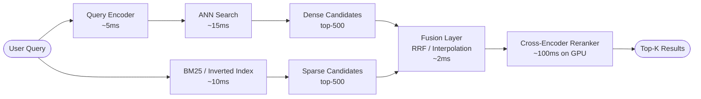
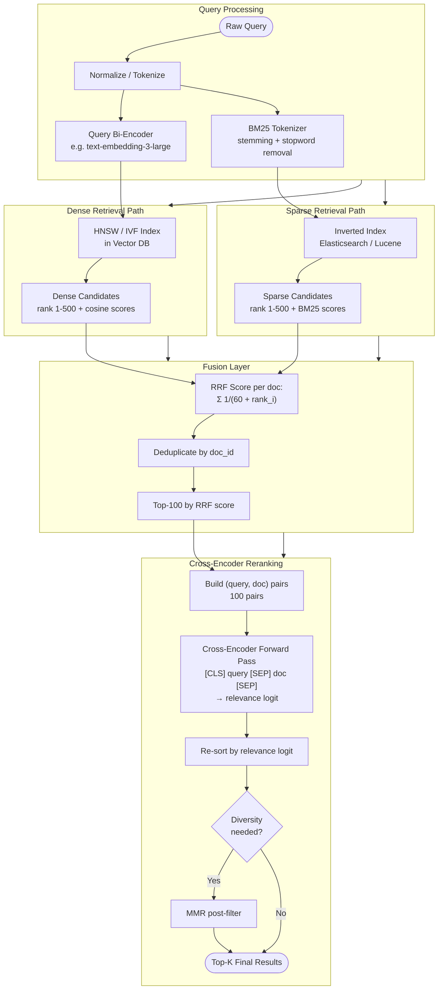
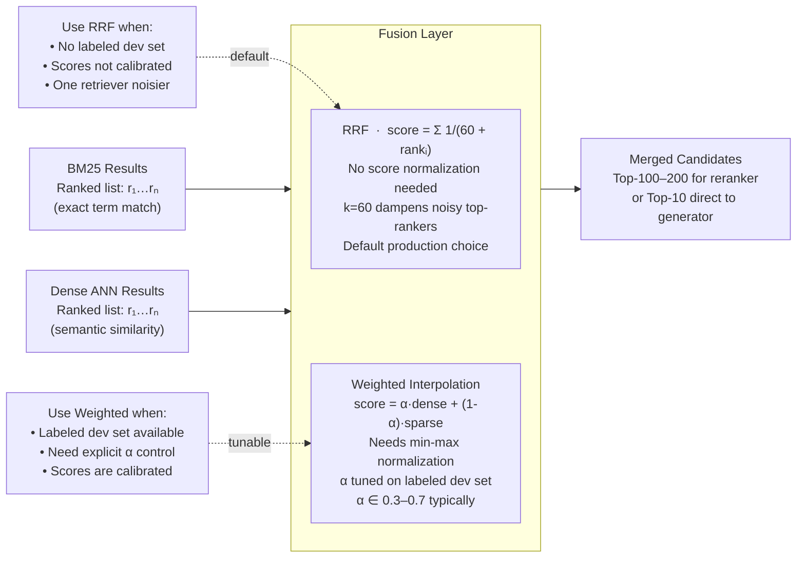
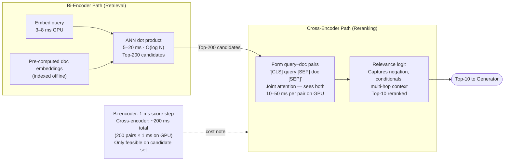
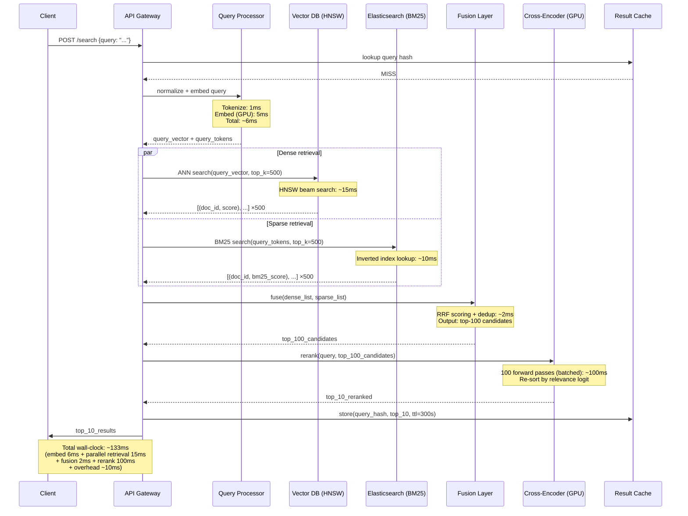
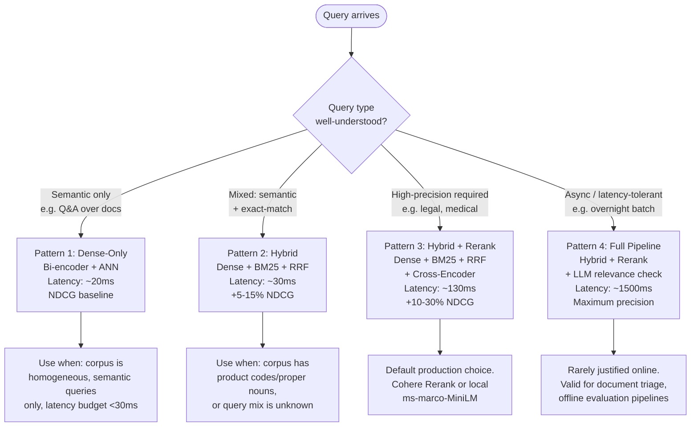
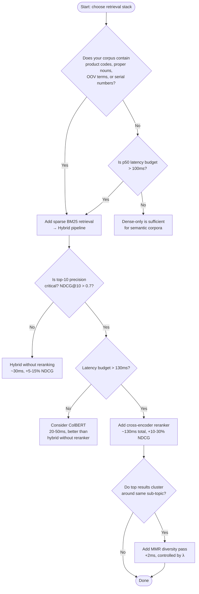

# Hybrid Search & Reranking

## Overview

Production retrieval systems almost never rely on a single retrieval method — dense vector search excels at semantic similarity but fails on exact-match queries, while sparse lexical search (BM25) nails keyword precision but is blind to paraphrase or concept. Hybrid search merges both signals, and cross-encoder reranking then refines that merged candidate set using deeper query-document interaction that the retrieval phase cannot afford at scale. Together these three stages form the default architecture for any retrieval pipeline that needs to handle the full diversity of real user queries with measurable precision improvements.

## Definition

Hybrid search is a retrieval strategy that independently executes a dense (embedding-based ANN) retrieval path and a sparse (lexical/BM25) retrieval path against the same corpus, then merges their ranked candidate lists using a fusion function — most commonly Reciprocal Rank Fusion (RRF) — before passing the merged candidate set to a cross-encoder reranker that scores each candidate against the query using deep pairwise interaction. The result is a multi-stage pipeline: Stage 1 retrieves 100–500 candidates in 5–20 ms, Stage 2 fuses to a unified ranked list in ~2 ms, and Stage 3 reranks the top-100 down to the top-10 in 50–200 ms, yielding 10–30% NDCG improvement over first-stage retrieval alone.

## Problem Statement

Every single-method retrieval approach has a hard failure mode that production traffic will hit:

**Dense-only failures.** Bi-encoder embeddings compress text into a fixed-dimensional vector (typically 768–1536 dimensions). Rare terms, out-of-vocabulary (OOV) tokens, product codes (`SKU-AX4921`), serial numbers, medication names (`hydroxychloroquine`), and domain jargon with no training signal simply get folded into the nearest generic neighbor in embedding space. A query for "CVE-2024-3094 exploit" returns semantically adjacent security content — not the specific CVE. Dense retrieval fundamentally cannot precision-match on terms that are underrepresented in the embedding model's training distribution.

**Sparse-only (BM25) failures.** BM25 scores documents by TF-IDF statistics over exact term overlap. A query for "fast ML inference" will score zero on a document containing "low-latency model serving" because no tokens overlap. Synonyms, abbreviations, multi-lingual queries, and paraphrase-heavy corpora break BM25 entirely. Semantic relevance is invisible to it.

**Retrieval-quality ceiling without reranking.** Both methods produce relevance-imperfect candidate sets because they embed or index at indexing time and cannot evaluate fine-grained query-document interaction at query time. A bi-encoder produces a single vector per document regardless of which query will hit it. This means the ranking within the candidate set is coarse. A cross-encoder that jointly encodes the query and each candidate can capture interaction signals (negation, multi-hop context, relative comparisons) that neither retriever can.

Without hybrid search and reranking, a RAG system delivers inconsistent quality across query types — precise on common semantic queries, brittle on tail-distribution or keyword-specific queries — and there is no systematic path to closing the gap.

## Why Dense-Only and Sparse-Only Both Fall Short

The first generation of neural retrieval (2019–2021) went dense-only: encode everything with BERT-style bi-encoders, run ANN search, done. On MS MARCO and NQ benchmarks, dense models dramatically outperformed BM25. Teams translated this directly to production — and immediately encountered the failure cases above. Enterprise knowledge bases are full of product codes, policy identifiers, regulation numbers, and proper nouns that occur once or twice. Embedding models trained on Wikipedia and web crawls have no signal for these.

The fix attempted was query expansion: use the LLM to paraphrase the query into N variants and retrieve with each. This helped recall but multiplied retrieval latency by N and did nothing for the precision of rare-term matching because the expanded queries are also dense.

The field then rediscovered what classical IR had always known: sparse and dense retrieval are *complementary*, not one replacing the other. Nogueira et al. (2019) and the subsequent MS MARCO leaderboard demonstrated that naively combining BM25 and dense retriever outputs beat either alone. The remaining question was how to fuse them — which gave rise to RRF (Cormack et al., 2009, rediscovered for neural IR by Raudaschl 2023) as the default because it requires no score normalization and is robust to score scale differences.

Cross-encoder reranking was introduced to close the quality gap between retrieval (bi-encoder, O(1) per document) and full cross-attention (O(n) per document) at a manageable compute cost by limiting it to a small candidate set. Nogueira and Cho (2019) showed reranking top-100 with BERT improved MRR@10 by 15+ points over first-stage retrieval alone.

## Core Concepts

- **Bi-encoder (dual-encoder):** Two separate transformer encoders — one for queries, one for documents — that produce independent fixed-size vectors. Similarity is cosine or dot product. Enables pre-computation of all document vectors at indexing time. Retrieval is O(log n) with ANN. See [Embedding Models](01-embedding-models.md).

- **Cross-encoder:** A single transformer that takes `[CLS] query [SEP] document [SEP]` as joint input and produces a relevance score via a classification head. Cannot pre-compute document representations — requires a forward pass per (query, document) pair at query time. O(n × d) complexity makes it unsuitable for full-corpus retrieval; constraining it to top-100 candidates makes it practical.

- **BM25 (Best Match 25):** A probabilistic ranking function scoring documents by term frequency (TF), inverse document frequency (IDF), and document length normalization. Formula: `BM25(q,d) = Σ IDF(t) × (TF(t,d) × (k1+1)) / (TF(t,d) + k1×(1-b+b×|d|/avgdl))`. Parameters k1∈[1.2,2.0], b=0.75 are standard defaults. Runs in <10 ms at 100M documents with an inverted index.

- **Reciprocal Rank Fusion (RRF):** `RRF(d) = Σ 1/(k + rank_i(d))` summed over all retrieval systems. k=60 is standard; it controls how much the top-ranked documents are boosted. The k=60 choice makes the score of the first-rank document roughly 1/61 ≈ 0.016 and prevents any single list from completely dominating. RRF is parameter-free beyond k, requires no score normalization, and is robust when one retriever returns many low-quality results.

- **Weighted linear interpolation:** `score = α × dense_score + (1-α) × sparse_score`. Requires score normalization (min-max or z-score per query). α is tuned on a validation set, typically α∈[0.3,0.7]. More sensitive to distribution shifts than RRF but allows direct control of the dense/sparse balance.

- **CombSUM / CombMNZ:** Classic IR fusion from Fox & Shaw (1994). CombSUM sums normalized scores across retrieval systems. CombMNZ multiplies CombSUM by the count of systems that retrieved the document — rewarding consensus. Both require score normalization and are less commonly used than RRF in practice.

- **SPLADE (Sparse Lexical and Expansion model):** A learned sparse retrieval model that uses a transformer to predict activation weights over the full vocabulary per document/query, producing a sparse weight vector. Combines BM25's inverted-index efficiency with learned vocabulary expansion. SPLADE-v2 beats BM25 by 5–10 NDCG points and runs with comparable latency. Still uses an inverted index at inference time.

- **ColBERT (Contextualized Late Interaction):** Encodes query and document into sequences of token-level vectors (not a single pooled vector). Similarity is computed as the sum of maximum cosine similarities between each query token vector and all document token vectors — the MaxSim operator. Latency is 20–50 ms, between bi-encoder (5–20 ms) and cross-encoder (50–200 ms), because document token vectors are pre-computed but interaction is richer than single-vector dot product.

- **Query Expansion:** Augmenting the original query with synonyms, related terms, or LLM-generated hypothetical documents (HyDE) to improve recall before retrieval. Increases latency by 2–5× if multiple retrieval calls are made.

- **MMR (Maximal Marginal Relevance):** A post-reranking diversification step that iteratively selects the next document maximizing `λ × relevance(d,q) - (1-λ) × max_similarity(d, already_selected)`. λ∈[0,1] controls relevance vs. diversity. Used when top-k results would otherwise be near-duplicates.

## The Three-Stage Retrieval Pipeline

The hybrid retrieval pipeline has three distinct stages that run in sequence, each with a different role and latency budget:

- **Stage 1 — Parallel sparse + dense retrieval (~20 ms):** BM25 and ANN search run concurrently against the same corpus, each returning up to 500 candidates with their own scores. The goal at this stage is recall — the correct answer must be in the merged candidate set.
- **Stage 2 — Fusion (~2 ms):** RRF or weighted interpolation merges the two candidate lists into a single ranked list, deduplicates by doc_id, and surfaces the top-100 candidates for the next stage. Documents appearing in both lists receive a consensus boost.
- **Stage 3 — Cross-encoder reranking on top-100 (~100 ms):** A cross-encoder scores each of the top-100 candidates against the query with joint attention, then re-sorts them. The final output — top-10 to top-20 results — goes to the generator.

**High-level hybrid retrieval pipeline:**

**Detailed architecture — parallel retrieval paths, fusion internals, and reranker internals:**

## Fusion Strategies: RRF and Weighted Scoring

The fusion layer merges the ranked candidate lists from dense and sparse retrieval into a single ordering. Two strategies dominate production:

**Reciprocal Rank Fusion (RRF):** `RRF(d) = Σ 1/(k + rank_i(d))` summed over all retrieval systems. k=60 is the standard default. The k=60 sweet spot is not arbitrary: it makes the rank-1 document score 1/61 ≈ 0.016, the rank-60 document 1/120 ≈ 0.008 (a 2× difference, not a 60× cliff), and prevents any single noisy retriever from dominating. If BM25 returns many poor candidates that rank highly by BM25 score, their RRF contribution is dampened because rank alone — not score magnitude — drives the formula. RRF requires no score normalization and has no tunable weight parameter beyond k.

**Weighted score interpolation:** `score = α × dense_score + (1-α) × sparse_score`. Requires per-query score normalization (min-max or z-score over the candidate set, not global normalization — global normalization leaks corpus statistics). α is tuned on a validation set, typically α∈[0.3,0.7]; dense-heavy corpora typically need α∈[0.5,0.7], keyword-heavy corpora α∈[0.3,0.4]. The normalization requirement is the main liability: BM25 scores are unbounded and scale with document length and corpus size, while cosine similarities are bounded in [-1, 1]. Skipping normalization causes BM25 to dominate by orders of magnitude.

**When to use each:**

| Factor | Prefer RRF | Prefer Weighted Interpolation |
|---|---|---|
| Score calibration | Scores not calibrated | Scores are calibrated / normalized |
| Tuning budget | No dev set for tuning | Have labeled dev set for α tuning |
| Retriever reliability | One retriever may be noisier | Both retrievers are equally reliable |
| Operational simplicity | Default choice | Only when direct balance control is needed |

**CombSUM / CombMNZ** (Fox & Shaw, 1994) are older alternatives that sum normalized scores or weight by the count of systems that retrieved the document. Both require normalization and are less used than RRF in practice.

**SPLADE** is a drop-in replacement for BM25 in the sparse path: it uses a transformer to predict vocabulary activation weights, enabling learned vocabulary expansion beyond exact token overlap, while still running on an inverted index at query time with identical latency. SPLADE-v2 outperforms BM25 by 5–10 NDCG points; choose it when offline index build time (GPU required) is acceptable.

| Component | Implementation Options | Latency | Notes |
|---|---|---|---|
| Query bi-encoder | `text-embedding-3-large`, `bge-large-en-v1.5`, `e5-mistral-7b` | 3–8 ms (GPU) | Same model used at indexing time; model changes require full re-embedding |
| Dense ANN index | HNSW (Qdrant, Weaviate), IVF-PQ (Faiss), DiskANN | 5–20 ms | See [Indexing Algorithms](03-indexing-algorithms-ann.md) |
| Sparse index | Elasticsearch / OpenSearch (Lucene BM25), Typesense | <10 ms at 100M docs | Sharded horizontally; supports SPLADE with custom scorer |
| Fusion layer | In-process Python (RRF), Redis sorted sets | 1–3 ms | Stateless; parallelism on candidate lists |
| Cross-encoder reranker | `ms-marco-MiniLM-L-6-v2`, `bge-reranker-large`, Cohere Rerank API | 50–200 ms (GPU), 300–800 ms (CPU) | MiniLM is fastest; BGE-large is highest quality offline |
| Vector store | Qdrant, Weaviate, Pinecone, pgvector | — | See [Vector Databases](02-vector-databases.md) |
| LLM reranker (Stage 3, optional) | GPT-4o, Claude 3 Haiku as pointwise/pairwise judge | 500–2000 ms | Only for latency-insensitive or async pipelines |

## Cross-Encoder Reranking: Cost vs Precision

**Bi-encoder vs. cross-encoder:** A bi-encoder encodes query and document independently, produces separate vectors, and computes similarity via dot product — retrieval is O(log n) with ANN, and document vectors are pre-computed at indexing time. Query latency is 1 ms for the dot product step. A cross-encoder takes `[CLS] query [SEP] document [SEP]` as joint input and produces a relevance logit via a classification head. It cannot pre-compute document representations because the representation depends on the query. One forward pass per (query, document) pair at query time: 10–50 ms per pair on GPU, which makes full-corpus cross-encoder retrieval computationally impossible (10M documents × 50 ms = 140 hours per query). The cross-encoder's accuracy advantage comes precisely from this joint attention — it captures negation, conditional relevance, and multi-hop context that a bi-encoder compresses away.

**Models and their cost profile:**

- `ms-marco-MiniLM-L-12-v2`: 6–12 layers, 22M–33M parameters, FP16, fits in <1 GB VRAM. Fastest self-hosted option. 10–30 ms per 100-candidate batch on A10G.
- `bge-reranker-large`: 335M parameters. Highest offline quality among self-hosted models. 50–100 ms per 100-candidate batch on A10G.
- **Cohere Rerank API**: Managed, ~$1.00 per 1,000 queries for 100 candidates each. At 1M queries/day: $1,000/day = $30,000/month.
- Self-hosted MiniLM on A10G ($1.50/hr, 200 QPS): ~$180/month at 1M queries/day — 160× cheaper than Cohere. Quality difference is measurable but small for general-domain corpora.

**Cost formula:** N candidate pairs × latency per pair = total reranking latency. Reranker latency scales linearly with candidate count. Reranking 200 candidates takes ~2× as long as reranking 100. The marginal recall improvement from 100→200 candidates is typically <2 NDCG points. Default to top-100 candidates.

**When to rerank:**
- Precision matters more than last-mile latency (legal, medical, enterprise Q&A).
- Latency budget allows 100–200 ms for reranking on top of retrieval.
- Domain evaluation confirms the reranker improves NDCG@10 by at least 5 points on your distribution.

**When NOT to rerank:**
- High QPS paths where reranker GPU cost dominates infrastructure budget.
- Latency-sensitive paths with p50 SLA < 50 ms.
- Corpora where a general-purpose reranker has not been validated — it may hurt precision on specialized domains.
- Navigational queries where the top fusion result is already correct with high probability (detect with a lightweight query classifier and route past the reranker).

## Query Flow Through the Hybrid Pipeline

End-to-end: query arrives → parallel BM25 + ANN search → merge candidates → RRF → cross-encoder rerank → top-K to generator.

The parallel execution of dense and sparse retrieval is critical — executing them sequentially would add ~10 ms for no reason, since they share nothing. Most production implementations issue both requests concurrently in the same async coroutine group.

**Latency budget per stage:**

| Stage | Operation | Latency (p50) | Latency (p99) |
|---|---|---|---|
| Query processing | Tokenize + embed | ~6 ms | ~10 ms |
| Parallel retrieval | ANN + BM25 (concurrent) | ~15 ms | ~25 ms |
| Fusion | RRF + dedup | ~2 ms | ~3 ms |
| Reranking | Cross-encoder top-100 | ~100 ms | ~150 ms |
| Overhead | Serialization + network | ~10 ms | ~20 ms |
| **Total** | **End-to-end** | **~133 ms** | **~208 ms** |

## When to Add Each Layer

**When to add sparse retrieval alongside dense:**
- Corpus contains product codes, serial numbers, policy identifiers, medication names, or other OOV terms.
- Query mix is unknown or heterogeneous (production traffic always includes some keyword-precise queries).
- BM25 infrastructure is already present (Elasticsearch, OpenSearch) — marginal cost of adding the hybrid path is low.

**When to add fusion:**
- Both dense and sparse paths are already running — fusion is required to merge their outputs.
- You want to reward documents with multi-signal relevance (appearing in both lists).
- Prefer RRF as the default; switch to weighted interpolation only if you have a labeled dev set to tune α.

**When to add cross-encoder reranking:**
- Top-10 precision is critical (NDCG@10 target > 0.7).
- Latency budget exceeds ~130 ms.
- Domain evaluation confirms a net improvement of at least 5 NDCG points over first-stage + fusion output.

**When to skip reranking:**
- Latency budget < 50 ms.
- QPS is high enough that GPU reranker cost dominates budget.
- Corpus is homogeneous and semantic-only (no rare terms, no domain-specific precision requirements).
- Navigational query traffic is high — route those queries past the reranker.

**Decision flowchart:**

**Decision tree — when to add each layer:**

**Advantages and disadvantages:**

| Dimension | Hybrid + Rerank | Dense-Only | Sparse-Only (BM25) |
|---|---|---|---|
| Semantic recall | High | High | Low |
| Exact-match precision | High | Low | High |
| OOV / rare-term handling | High | Low | High |
| Tail-query robustness | High | Low | Medium |
| Latency (p50) | ~130 ms | ~20 ms | ~10 ms |
| Infrastructure complexity | High (3 systems) | Low (1 system) | Low (1 system) |
| Cost per query | $0.001–$0.01 | $0.0001 | $0.00001 |
| Index maintenance | High (two indices) | Medium | Low |
| Tuning surface | α, k (RRF), reranker model | Embedding model only | k1, b only |
| NDCG@10 improvement vs BM25 | +15–40% | +5–20% | baseline |

## Scalability

**Horizontal scaling of retrieval.** The dense ANN path and the sparse BM25 path scale independently. Vector DBs shard by embedding space partitions (IVF cells or HNSW per-shard); Elasticsearch shards by document ID hash. Both scale linearly with additional nodes. A 10-node Elasticsearch cluster handles 100M documents with BM25 latency under 10 ms. A 4-node Qdrant cluster with HNSW handles 10M 1536-d vectors with ANN latency under 20 ms.

**Reranker throughput.** A single A10G GPU running `ms-marco-MiniLM-L-6-v2` in FP16 with batch size 32 achieves 100–500 QPS for top-100 reranking. At 100 QPS, a single reranker handles 8.6M queries/day. GPU autoscaling on GKE or EKS allows burst capacity. MiniLM is 6 layers / 22M parameters; it fits in <1 GB VRAM, enabling dense packing on a single GPU.

**RRF fusion is stateless and cheap.** The fusion layer is a pure in-process function — no network hop, no state. It consumes two sorted lists of 500 items and produces a sorted list of ~600 unique items in <1 ms. It can be inlined into the gateway or query processor without a separate service.

**Caching.** Query-level caching at the result cache (Redis, ttl=300s) offloads repeat queries entirely. For production corpora with power-law query distributions, the top 1% of queries may account for 30–50% of traffic. Even a shallow cache (10K entries) captures significant traffic.

**SPLADE at scale.** SPLADE uses the same inverted index infrastructure as BM25 but requires a GPU at index time to compute sparse activations per document. Index build is 10–50× slower than BM25 but query-time latency is identical. Choose SPLADE over BM25 when offline index build time is acceptable and keyword-recall improvements matter.

## Reliability

**Graceful degradation.** Each retrieval path is independently deployable. If the vector DB becomes unavailable, fall back to BM25-only. If Elasticsearch is unavailable, fall back to dense-only. The gateway should implement a fallback circuit breaker: detect >50 ms response time increase on either path and route 100% of traffic to the healthy path, emitting an alert metric.

**Reranker failure.** If the cross-encoder is unavailable or times out (> 250 ms), return the fused first-stage results without reranking. Emit a `rerank_skipped` metric. Most queries have acceptable first-stage quality; the reranker is a quality improvement layer, not a correctness requirement.

**Index freshness.** Dense and sparse indices must stay in sync after document updates. A dual-write pipeline (same event triggers both a vector upsert and an Elasticsearch document update) is the standard pattern. Stale index divergence is common during high write throughput — monitor `index_lag_seconds` per path and alert above 60 seconds.

**Recall validation.** Run a nightly recall@100 evaluation against a held-out relevance test set. Alert if recall drops more than 2 percentage points, which signals index corruption, embedding model drift, or tokenizer misconfiguration.

## Security

**Data leakage via retrieval.** A reranker that processes (query, document) pairs on shared GPU infrastructure must ensure that retrieved document text is not logged or retained beyond the request. For cross-encoder APIs (Cohere Rerank), review the data processing agreement — some tiers log inputs for model improvement.

**Access control filtering.** Retrieved candidates must be filtered by the user's access permissions *before* passing to the reranker. Passing unauthorized documents to a reranker that then returns them re-ranked is a security failure. Apply ACL filters at the retrieval layer (Elasticsearch `filter` clause, Qdrant `must` conditions on a `user_id` or `tenant_id` field), not post-retrieval.

**Prompt injection via documents.** If retrieved document text is passed directly to an LLM reranker or to a downstream RAG generation step without sanitization, adversarially crafted documents can inject instructions. Scrub or encode retrieved text before concatenating into LLM prompts.

**Query logging.** Queries contain PII in many domains (medical record numbers, employee IDs). Implement query hashing before logging; store only the hash + result IDs, not raw query text. Retrieve the raw text only with explicit audit justification.

## Cost Optimization

**Reranking cost.** Cohere Rerank API charges approximately $1.00 per 1,000 queries for 100 candidates each ($0.001/query). At 1M queries/day, that is $1,000/day = $30,000/month. A self-hosted `ms-marco-MiniLM-L-6-v2` on a single A10G ($1.50/hr on-demand, 200 QPS) costs ~$180/month at 1M queries/day — an 160× cost reduction. The quality difference is measurable but small for general-domain corpora; use MiniLM unless your domain requires the precision of Cohere or BGE-large.

**Tiered reranking.** Not all queries need deep reranking. For navigational queries (high-confidence first result), skip the reranker and serve the top fusion result. Classify queries as "navigational" vs "exploratory" using a lightweight 2-class model (20 ms inference); route navigational queries past the reranker. A 30% navigational traffic rate reduces reranker load by 30% with negligible quality loss.

**Candidate set sizing.** Reranking 200 candidates takes ~2× as long as reranking 100. The marginal recall improvement from 100→200 candidates is typically <2 NDCG points. Default to 100 candidates; only increase to 200 if recall@100 metrics show systematic misses.

**Dense index compression.** Quantizing embeddings from FP32 to INT8 reduces vector memory by 4× with <1% recall drop (see [Indexing Algorithms](03-indexing-algorithms-ann.md)). A 10M document corpus with 1536-d embeddings: FP32 = 60 GB, INT8 = 15 GB. This fits on fewer nodes and reduces ANN latency.

**SPLADE vs. BM25 cost.** SPLADE requires a GPU for document encoding at index time but not at query time. If index rebuild frequency is low (<1× per day), the GPU cost for indexing (1 hour of A10G = $1.50) is negligible. SPLADE is cost-equivalent to BM25 at query time.

## Monitoring

| Metric | Collection Point | Alert Threshold |
|---|---|---|
| `retrieval_latency_p50_ms` (dense) | VDB query hook | > 25 ms |
| `retrieval_latency_p50_ms` (sparse) | ES slowlog | > 15 ms |
| `fusion_candidate_count` | Fusion layer | < 50 (degenerate retrieval) |
| `rerank_latency_p99_ms` | XE service | > 300 ms |
| `rerank_skipped_rate` | Gateway | > 5% (reranker instability) |
| `recall_at_100` | Nightly eval job | < reference - 2% |
| `ndcg_at_10` | Weekly eval job | < reference - 3% |
| `index_lag_seconds` (dense) | Vector DB write queue | > 60 s |
| `index_lag_seconds` (sparse) | ES indexing queue | > 60 s |
| `dense_sparse_overlap_rate` | Fusion layer | < 10% (signals retrieval divergence) |

Track `dense_sparse_overlap_rate` — the fraction of top-100 candidates that appear in both retrieval lists. A healthy hybrid pipeline shows 15–40% overlap. Overlap below 10% means the two paths retrieve completely different content (possible tokenizer/embedding mismatch). Overlap above 60% means BM25 is largely redundant and you may be over-investing in the sparse path.

## Production Best Practices

**Fix k=60 for RRF unless you tune.** The k=60 default for RRF is robust across a wide range of corpora. If you tune k on a development set, validate on a held-out test set — k is corpus-sensitive and will overfit if tuned on a small sample. For most production deployments, k=60 gives 90% of the benefit with zero tuning.

**Normalize before weighted interpolation; skip normalization for RRF.** If you choose weighted interpolation (α × dense + (1-α) × sparse) over RRF, normalize scores per-query using min-max over the candidate set — not globally. Global normalization leaks corpus statistics. RRF requires no normalization because it operates on ranks, not scores.

**Run dense and sparse queries in parallel, never sequential.** Sequential execution adds 10–15 ms of unnecessary latency. Use async Python (`asyncio.gather`), Go goroutines, or thread pools. Both queries are I/O-bound (network to VDB and ES), so parallel execution is free.

**Benchmark your reranker model before deploying.** Run your reranker on 500 sampled queries from your production distribution with human relevance judgments. Report NDCG@10 improvement over first-stage. A reranker that does not improve NDCG@10 by at least 5 points on your domain is not worth the latency cost. General-domain rerankers sometimes *hurt* precision on specialized corpora (medical, legal, code).

**Keep the reranker candidate count fixed at 100 unless corpus size exceeds 10M.** Increasing candidates improves first-stage recall but increases reranker latency linearly. Benchmark recall@100 vs. recall@200 on your corpus; if the gap is <2%, stay at 100.

**Use MMR only for conversational or diversity-critical interfaces.** MMR degrades NDCG@10 (it deliberately deprioritizes redundant-but-relevant results). Only apply it when diversity is explicitly valued (recommendation feeds, exploratory search). Never apply it to factual Q&A retrieval.

**Version your reranker model separately from your embedding model.** They are independently upgradeable. A reranker upgrade requires no re-indexing (it only touches candidates at query time). An embedding model upgrade requires full corpus re-embedding — a multi-hour to multi-day job. Decouple their release cycles.

**Monitor fusion overlap as an operational signal.** A sudden drop in `dense_sparse_overlap_rate` (e.g., from 25% to 5%) is an early warning that one retrieval path has degraded — often caused by an Elasticsearch shard failure, a vector DB compaction event that invalidated part of the index, or a silent tokenizer misconfiguration after a library upgrade.

## Real-World Examples

**E-commerce product search.** An illustrative e-commerce platform replacing dense-only search with hybrid + reranking would observe the following: BM25 handles queries like `"Sony WH-1000XM5"` (exact model number) with 98% precision; dense retrieval handles `"noise cancelling headphones for travel"` where no exact tokens match the indexed product title. After RRF fusion, precision on exact-model queries improves from ~40% to ~90%. Adding a cross-encoder reranker further improves precision on ambiguous queries like `"wireless headphones under 200"` by reordering based on price-feature joint understanding that neither retriever can capture in its scoring function.

**Enterprise knowledge base Q&A.** A company deploying a RAG system over internal documentation (10M documents, mix of policy text, technical specs, Jira tickets) would find dense-only retrieval failing on ticket IDs (`"JIRA-14923"`), employee IDs, and product model codes. Hybrid retrieval recovers these cases. The cross-encoder reranker then resolves ambiguity between documents that use the same terminology in different contexts (e.g., "deployment" in the DevOps sense vs. the HR deployment letter sense), selecting the document whose context aligns with the query's implied domain.

**Legal discovery.** A legal research pipeline searching case law would use hybrid search to handle both citation-style exact queries (`"472 U.S. 38"`) and concept queries (`"fourth amendment reasonable expectation of privacy in digital data"`). The reranker, fine-tuned on legal relevance judgments, applies domain-specific relevance signals (precedential weight, jurisdiction) that a general-purpose bi-encoder cannot encode.

**Code search.** A developer tooling pipeline searching a codebase would rely heavily on sparse retrieval (function names, class identifiers, error codes are exact-match terms) with dense retrieval handling natural-language queries (`"how to handle authentication errors"`). ColBERT is an attractive choice here because it preserves token-level interaction (matching `"token"` in the query against `"AccessToken"` in code) better than a single pooled embedding.

## Interview Questions

### Beginner

**Q: What is BM25 and why does it still matter in 2024?**

BM25 is a probabilistic ranking function that scores documents by the frequency and rarity of query terms in the document, normalized by document length. Despite being formulated in the 1990s, it remains competitive for keyword-precise queries because dense embeddings fundamentally cannot precision-match terms that appear rarely in training data. BM25 runs on an inverted index in <10 ms at 100M documents, requires zero GPU infrastructure, and its performance on exact-match queries (product codes, identifiers, rare technical terms) is often *better* than dense embeddings trained on general web crawls. It is not replaced by dense retrieval — it is complemented by it.

**Q: Why can't you use a cross-encoder for retrieval over a full corpus?**

A cross-encoder requires a separate forward pass through a transformer for every (query, document) pair. For a corpus of 10M documents and 768-dimension models, that is 10M forward passes per query — roughly 10M × 50 ms = 140 hours per query on a single GPU. A bi-encoder can pre-compute all document embeddings once at indexing time, reducing query time to a single query embedding + ANN lookup. The cross-encoder's accuracy advantage comes precisely from this joint query-document attention, which cannot be precomputed because it depends on the query. The practical solution is to use the cross-encoder only on a small candidate set (top-100) retrieved by the bi-encoder.

**Q: What is RRF and what does k=60 do?**

Reciprocal Rank Fusion scores each document as the sum of `1/(k + rank_i)` over all retrieval systems. k=60 is a smoothing constant that prevents the top-ranked document from receiving an outsized score. With k=60, the rank-1 document receives score 1/61 ≈ 0.016; the rank-60 document receives 1/120 ≈ 0.008 — a 2× difference, not a 60× difference. This makes RRF robust to cases where one retriever is much noisier than the other: if BM25 returns many poor candidates that rank highly, their scores are dampened. RRF's main advantage over weighted interpolation is that it requires no score normalization and no tuning of weight parameters.

### Intermediate

**Q: How do you tune α in weighted linear score interpolation for hybrid search?**

Create a development set of 200–500 queries with human relevance judgments (or click-through data as a proxy). For each query, run dense retrieval and BM25 retrieval independently, normalize both score lists to [0,1] using per-query min-max, then compute `α × dense_score + (1-α) × sparse_score` for α ∈ {0.1, 0.2, ..., 0.9}. Measure NDCG@10 at each α. The optimal α is the one maximizing NDCG@10 on a held-out test set (not the dev set used for tuning, to avoid overfitting). For general-domain corpora, optimal α is typically 0.5–0.7 (dense-heavy). For corpora with many rare terms, optimal α shifts toward 0.3–0.4. Retune when you change the embedding model.

**Q: What is ColBERT and when does it outperform the standard bi-encoder → cross-encoder pipeline?**

ColBERT encodes both query and document into sequences of per-token vectors (not a single pooled vector). At query time, document token vectors are pre-computed and stored; the similarity is the sum of maximum cosine similarities between query tokens and document tokens (MaxSim). This costs more than a single dot product (O(|q| × |d|) vs. O(d)) but far less than a full cross-encoder forward pass on joint input. ColBERT achieves latency of 20–50 ms vs. 5–20 ms for bi-encoder and 50–200 ms for cross-encoder. ColBERT outperforms the bi-encoder → cross-encoder pipeline primarily when: (1) the token-level interaction signals are strong (code search, technical docs with precise terminology), and (2) latency budget is tight enough that a cross-encoder's 100 ms cannot be afforded but bi-encoder quality is insufficient. The main operational cost is storage: ColBERT requires storing per-token embeddings (~100× more than bi-encoder per document).

**Q: Describe the full three-stage pipeline and where each stage makes its precision contribution.**

Stage 1 (ANN + BM25, ~20 ms): maximizes recall. The goal is to ensure the correct answer is in the top-500 candidate set with high probability. A 95% recall@100 means 95% of all queries have their correct answer in the first 100 candidates. This stage uses approximate methods — ANN is not exact, BM25 ignores semantic meaning — because exact full-corpus scoring is computationally impossible at query time.

Stage 2 (RRF fusion, ~2 ms): merges the two candidate sets, rewarding documents that appear in both lists (evidence of multi-signal relevance) and deduplicating. RRF improves NDCG@10 by 5–15% over the best single retriever.

Stage 3 (cross-encoder reranking, ~100 ms): maximizes precision within the candidate set. The cross-encoder attends jointly to query and document tokens, capturing negation (`"not Python 2"`), conditional relevance, multi-hop reasoning, and sub-topic alignment that neither retriever can encode. It improves NDCG@10 by 10–30% over the Stage 1 + Stage 2 output.

### Senior

**Q: Your hybrid search system shows high recall@100 but poor NDCG@10 even after reranking. What is your debugging methodology?**

First, check whether the recall@100 claim is accurate for the tail query distribution, not just the average. Compute recall@100 stratified by query type (navigational, informational, transactional) and by query length. Short queries (1–2 tokens) often have high average recall but catastrophic recall for specific rare-term queries. Second, run error analysis on the NDCG@10 failures: pull the top-10 results for the 50 worst-NDCG queries and examine what the reranker ranked first vs. what the ground truth is. Common failure patterns: (a) the correct document is not in the top-100 candidate set (recall failure, not reranking failure — fix the retrieval stage), (b) the reranker is out-of-domain (general-domain reranker on a specialized corpus), (c) the candidate set has near-duplicate documents that split relevance signal across multiple results. Third, check `dense_sparse_overlap_rate` — if it's <10%, the two retrieval paths are retrieving completely disjoint content, which means fusion has no consensus signal and is effectively just concatenating two noise lists. Fourth, validate reranker calibration: plot the reranker's output relevance score distribution against human judgments. If the reranker assigns similar scores to relevant and irrelevant documents, the model is not calibrated for your domain.

**Q: How would you design a hybrid search system for a corpus with documents in 40 languages?**

Dense retrieval: use a multilingual bi-encoder (`multilingual-e5-large`, `mUSE`, or `LaBSE`). Cross-lingual retrieval is handled naturally by the embedding space. ANN index is language-agnostic. Sparse retrieval: BM25 requires language-specific tokenization and stemming for each language — a non-trivial operational burden for 40 languages. Options: (1) use a single BM25 index with ICU tokenizer (handles Unicode word boundaries for most languages), (2) use SPLADE with a multilingual model (outputs sparse activations over a shared vocabulary), (3) maintain per-language BM25 shards and route queries to the appropriate shard by language detection. Reranking: use a multilingual cross-encoder (`multilingual-MiniLM-L12`, `mDeBERTa-v3-base`). Performance on non-English languages typically degrades 5–15 NDCG points vs. monolingual models; acceptable for most use cases but validate per-language NDCG in your eval suite. Language detection should happen at the query processor, not at the reranker.

### Staff

**Q: You are designing retrieval for a product with 10M active users, 500M documents, and a p99 latency SLA of 200 ms. Walk through every architectural decision you make and what you would need to validate each one.**

**Corpus scale decision.** 500M documents at 1536-d embeddings (FP32) = 3 TB of vectors. FP32 HNSW at this scale is infeasible on a single cluster. Use IVF-PQ with 8-bit quantization: 3 TB → ~375 GB, fits on 5 nodes with 128 GB RAM each. Recall@100 at this compression level: validate with a 1M-document sample before full indexing. Expect 92–96% recall@100 vs. exact search. For sparse, a 500M-document Elasticsearch cluster at ~2 KB average document size = ~1 TB of inverted index data, sharded across 20 nodes.

**Latency budget allocation.** Total 200 ms p99 budget: query embedding 8 ms, parallel retrieval 25 ms (p99, not p50), fusion 3 ms, reranking 100 ms, overhead/serialization 20 ms = 156 ms. This leaves 44 ms headroom at p99. If retrieval p99 is 25 ms, that implies p50 of ~12–15 ms — achievable with IVF-PQ on a properly sized cluster. If reranker p99 spikes to 150 ms under load, total hits 200 ms and violates SLA. Reranker autoscaling must be configured to keep p99 < 120 ms even at peak QPS.

**QPS planning.** 10M users, assume 5% active concurrently = 500K active users, each issuing 1 query per 10 seconds = 50K QPS. At 100 QPS per A10G reranker, you need 500 A10G GPUs for reranking alone at $1.50/hr each = $750/hr = $18K/day. This is likely unsustainable. Mitigations: (1) tiered reranking (skip reranker for navigational queries, ~30% reduction → $12.6K/day), (2) smaller MiniLM model instead of BGE-large (4× throughput improvement → $3.15K/day), (3) result caching (top-10% of queries account for ~40% of traffic at cache hit rate → $1.89K/day effective). Validate the cache hit rate assumption with a Zipf distribution analysis of historical query logs.

**Validation checklist:** (a) recall@100 of IVF-PQ index vs. exact HNSW on 10K held-out queries; (b) NDCG@10 with reranker on 1K human-judged queries; (c) p99 latency under 50K QPS load test; (d) graceful degradation test: kill 2/20 ES shards, measure precision degradation; (e) ACL filter correctness: 100% pass rate on 200 access-control test cases; (f) index staleness: measure lag between write event and query visibility, target <30 seconds.

## Google-Level Follow-Up Questions

**1. "RRF assumes all retrievers are equally reliable. How do you handle a case where BM25 is systematically noisier than your dense retriever for 70% of query types?"**

RRF's k parameter provides implicit downweighting of lower-ranked results from noisy retrievers, but it does not explicitly weight systems against each other. If BM25 is systematically noisier, three approaches: (a) increase k for the BM25 list only — a per-system k parameter. In practice, run with k=60 for dense and k=120 for BM25: BM25's score contribution at rank 1 becomes 1/121 vs. dense's 1/61, halving BM25's weight. (b) Use learned fusion: train a lightweight linear model (or logistic regression) on rank features from each retrieval system with NDCG as the training signal. This is a form of learning-to-rank at the fusion layer. (c) Use CombMNZ with learned weights per system rather than equal weights. The deeper question is why BM25 is noisier: if it's because the query set is predominantly semantic (no keyword-exact signal), the right fix is not to tune fusion weights but to detect query type and route semantic queries to dense-only retrieval.

**2. "ColBERT's storage cost is 100× a bi-encoder. Your 500M document corpus would require 375 GB for bi-encoder embeddings but 37.5 TB for ColBERT. How do you evaluate whether ColBERT's quality improvement justifies the storage cost?"**

This is a cost-benefit analysis with three inputs: (a) quality delta — measure NDCG@10 improvement of ColBERT over bi-encoder + cross-encoder on your specific corpus and query distribution. If the improvement is <2 NDCG points, ColBERT is almost certainly not worth 100× storage. Improvements >5 NDCG points in precision-critical applications (medical, legal) may justify it. (b) Storage cost — 37.5 TB at $0.023/GB/month (S3) = $862/month just for storage, plus the cost of the retrieval infrastructure to serve it. (c) Operational complexity — ColBERT requires a custom serving layer (PLAID for approximate ColBERT, or RAGatouille in Python). The standard answer at Google scale: use ColBERT on a sharded subset of the most-accessed documents (e.g., the top 10M by access frequency), use bi-encoder + cross-encoder for the long tail. This gives ColBERT's precision benefits on the Zipf-heavy head without paying the storage cost for the full corpus.

**3. "Your reranker consistently outperforms on your evaluation set but underperforms in A/B tests. What are the likely explanations and how do you investigate?"**

Classic Goodhart's Law scenario. Likely explanations: (a) evaluation set leakage — the queries in the eval set are not sampled from the production query distribution, or human relevance judgments were provided by annotators who used the same documents that the reranker was trained on. Fix: stratify eval set by query age (queries from the last week only); measure NDCG on queries that were logged *after* the eval set was created. (b) Implicit feedback mismatch — the A/B metric is click-through rate or dwell time, which correlates with but is not the same as relevance. A reranker can improve NDCG (absolute relevance) while *reducing* CTR if it demotes popular but less relevant results that users habitually click. (c) Session context — production users have conversational context that single-query eval does not capture. The reranker sees the query in isolation; production users may have refined their query twice before the evaluated query. (d) Latency-quality tradeoff — the reranker adds 100 ms, which may degrade A/B metrics through latency-sensitive user abandonment, independent of result quality. Measure session abandonment rate in the A/B test separately from click-quality metrics.

**4. "Design a hybrid search system that can handle real-time document ingestion at 10,000 documents per second while maintaining sub-200ms query latency."**

The constraint is that embedding 10K documents/second requires real-time inference capacity. At ~100 tokens/document and a GPU throughput of ~10K tokens/second for a typical bi-encoder (batch inference), you need 100 A100 GPUs just for embedding. This is almost certainly not the right architecture. Practical answer: (a) separate the freshness SLA from the embedding SLA. For the dense index, accept 60-second index freshness lag: ingest documents into a fast key-value store (Redis, DynamoDB) at 10K/sec, asynchronously queue for embedding (Kafka), GPU embed in batches of 256 with 4 A10G GPUs (~1K docs/sec/GPU × 4 = 4K docs/sec), write to vector DB with ~3-second lag. For the sparse index, Elasticsearch accepts raw text documents and indexes them in near-real-time (1–5 second lag for BM25 availability), no GPU required. (b) For query time, freshly ingested documents that have not yet been embedded serve only from the BM25 path; once the embedding is available, they appear in the dense path too. Gate queries on a per-document `indexed_in_dense` flag. This is a two-tier freshness model: BM25 index lag = seconds, dense index lag = minutes. The query pipeline degrades gracefully to sparse-only for documents in the lag window, which is acceptable because freshly ingested documents are often the subject of exact-match queries where BM25 excels.

## Common Mistakes

**1. Skipping score normalization when using weighted interpolation.** BM25 scores are not bounded and scale with document length and corpus size. Dense cosine similarity scores are bounded in [-1, 1]. Directly computing `α × BM25_score + (1-α) × cosine_score` produces a sum where BM25 dominates by orders of magnitude for long documents. Always normalize scores to [0,1] per-query before interpolation. This mistake is invisible in small-scale tests (where score ranges happen to be similar) and catastrophic in production.

**2. Applying the cross-encoder to the full retrieval set instead of the top-100 candidates.** A system that retrieves 1,000 candidates and passes all 1,000 to the cross-encoder will have reranking latency of 1,000–2,000 ms — a user-visible timeout. The candidate set for reranking must be bounded. The standard is 100 candidates; the quality improvement from 100→500 candidates is marginal (the correct answer is almost always in the top-100 if recall@100 is above 90%).

**3. Tuning RRF's k on the same dataset used for evaluation.** k=60 is robust precisely because it is not tuned per-corpus. Teams that tune k on a dev set and report eval results on the same split overestimate improvements. The correct approach: treat k=60 as the default; only tune if a held-out test set (never seen during any development decision) shows a statistically significant improvement at a different k value.

**4. Using the same embedding model for indexing and a different one for query encoding.** Embedding models must be symmetric: the query encoder and the document encoder must produce vectors in the same embedding space. Using `text-embedding-3-small` to index and `text-embedding-3-large` to query produces garbage results because the cosine similarity between vectors from different models is not meaningful. This seems obvious but occurs in practice when an embedding model is upgraded for queries without re-embedding the corpus.

**5. Applying MMR to factual Q&A retrieval pipelines.** MMR actively suppresses relevant documents that are similar to already-selected results. In a factual Q&A system where the correct answer appears in 3 slightly different phrasings in the corpus, MMR will suppress 2 of the 3 most relevant documents in favor of diverse-but-less-relevant alternatives. MMR is for diversity-driven interfaces; never apply it to retrieval for generation tasks where redundancy in the candidate set is useful (it provides multiple perspectives for the LLM to synthesize).

**6. Not validating the reranker on your specific domain before deployment.** General-purpose cross-encoder models trained on MS MARCO (web search) or NLI datasets may have relevance criteria that conflict with your domain. A legal corpus defines relevance by precedent and jurisdiction; a medical corpus defines relevance by clinical specificity; a code corpus defines relevance by API signature match. A reranker that has never seen these domains may *hurt* precision by reranking based on surface-level similarity signals that do not match domain-specific relevance criteria. Always run a domain-specific eval (200+ human-judged queries from your production distribution) before declaring the reranker a net positive.

## Key Takeaways

- Dense-only retrieval fails predictably on OOV terms, rare identifiers, and product codes; BM25-only fails on synonyms and paraphrase; production systems require both, fused via RRF (k=60 default, no normalization required) or weighted interpolation (normalize per-query, tune α on held-out set).

- RRF provides a 5–15% NDCG@10 improvement over the best single retriever; adding a cross-encoder reranker adds another 10–30% improvement at the cost of 50–200 ms latency on GPU — this is the standard quality-latency tradeoff that makes hybrid + reranking the default production retrieval architecture.

- Cross-encoders are O(n × d) and cannot be used for corpus-level retrieval; their accuracy advantage comes from joint query-document attention that is incompatible with pre-computation; constrain them to top-100 candidates retrieved by faster methods.

- ColBERT occupies the middle ground between bi-encoder (5–20 ms, single vector) and cross-encoder (50–200 ms, joint input): 20–50 ms latency via per-token MaxSim, at the cost of 100× storage vs. bi-encoder — suitable for precision-critical heads of large corpora, not for the full corpus.

- SPLADE replaces BM25 in the sparse path when offline index build time is acceptable: it uses a transformer to predict vocabulary activation weights, enabling learned vocabulary expansion beyond exact-match terms, while still running on an inverted index at query time with identical latency.

- The candidate set for reranking must be fixed at 100 (not 500, not 1000); reranker latency scales linearly with candidate count and the marginal recall improvement above 100 candidates is typically <2 NDCG points; always bound this parameter explicitly.

- Operational signals that matter: `dense_sparse_overlap_rate` (15–40% is healthy; <10% signals retrieval path divergence), `rerank_skipped_rate` (alert above 5%), `recall@100` (nightly eval, alert on >2% drop), `index_lag_seconds` on both paths (alert above 60 seconds).

- Cost at scale is dominated by the reranker; a single A10G GPU running MiniLM handles ~200 QPS at $1.50/hr, vs. Cohere Rerank API at $1.00/1K queries; at 1M queries/day, self-hosting is 160× cheaper than the managed API — evaluate against the operational cost of managing GPU infrastructure for your specific org.

---
*Part of [Retrieval Systems](index.md) in the [AI System Design Notes](../index.md).*
