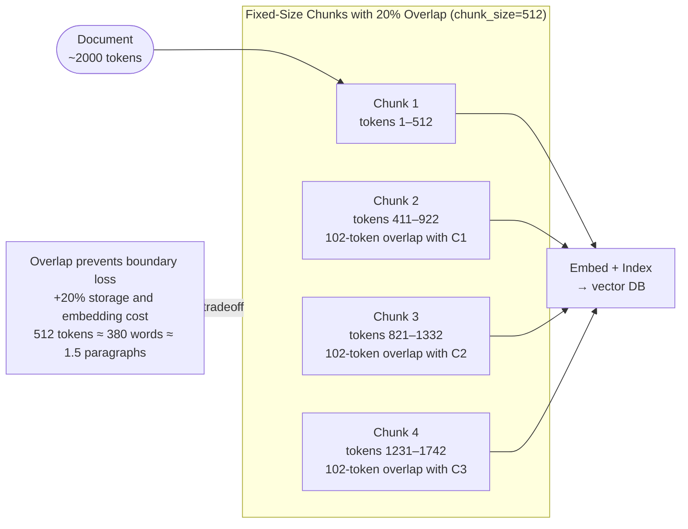
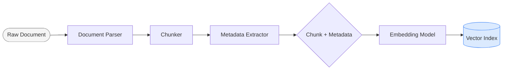
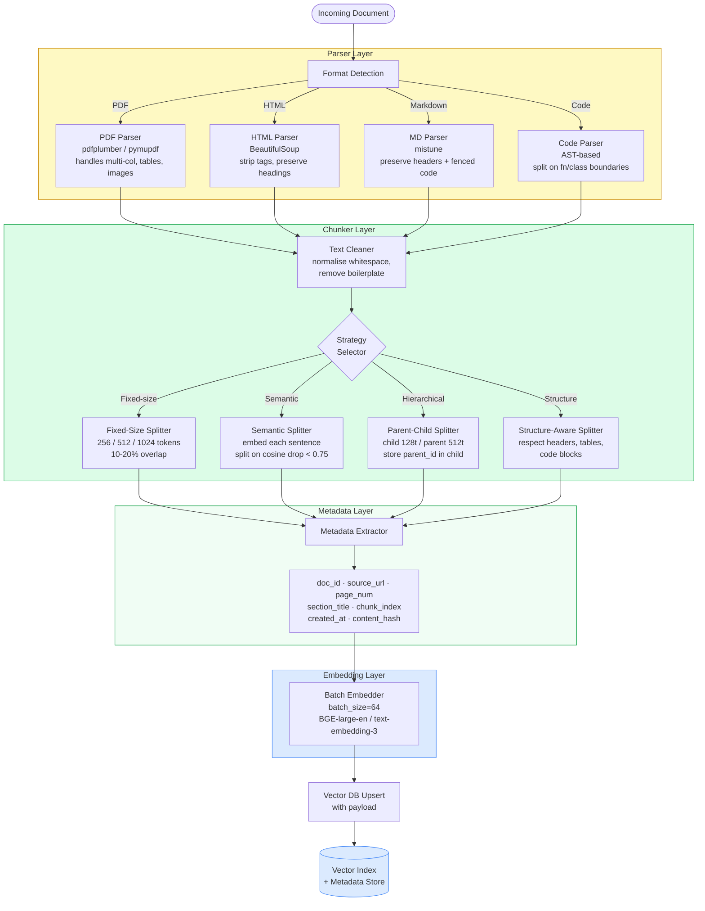
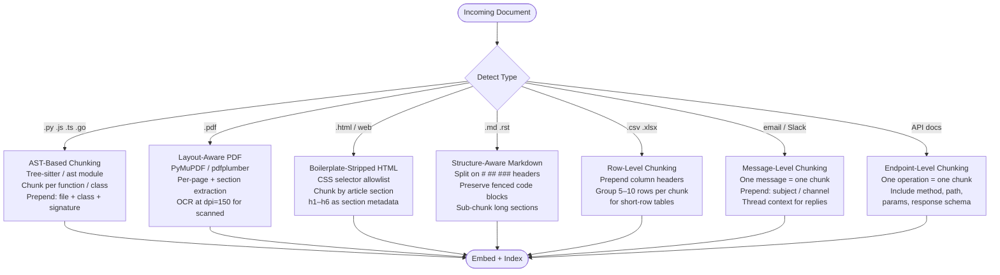
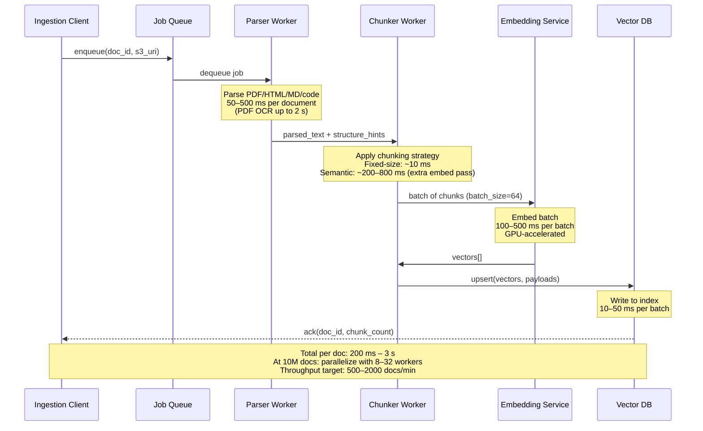
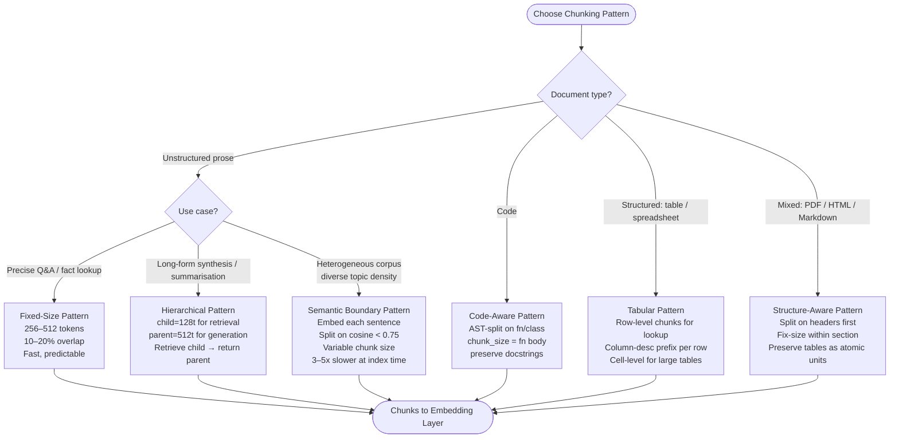
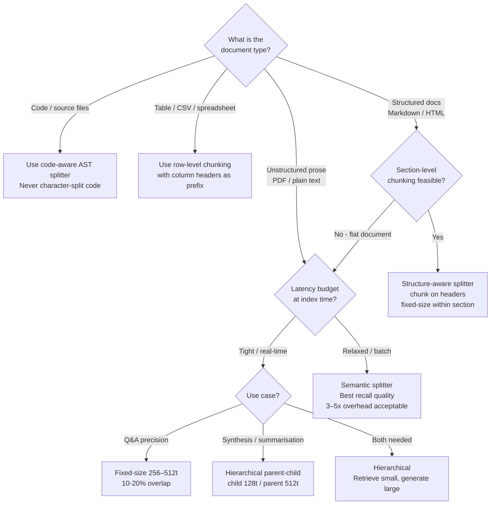

# Chunking Strategies

## Overview

Chunking is the process of splitting raw documents into smaller units before embedding and indexing them into a vector store. It is frequently the single highest-leverage engineering decision in a RAG pipeline — more impactful than embedding model selection — because a wrong chunk boundary destroys the signal that the retriever depends on. Every downstream component, from [Embedding Models](01-embedding-models.md) to [Hybrid Search & Reranking](04-hybrid-search-and-reranking.md), inherits the quality (or damage) done at this stage.

## Why Chunking Decisions Determine Retrieval Quality

Early information retrieval systems (BM25, TF-IDF) indexed whole documents or paragraphs with fixed-size sliding windows. When dense retrieval became viable around 2019–2020, teams first tried embedding entire documents — immediately running into two hard walls: BERT-family models had a 512-token context limit, and a single embedding for a 10-page PDF was semantically useless. The first-generation fix was character-based splitting: split every N characters, done. This produced broken sentences, broken tables, and broken code blocks, but it was fast and simple.

The core tension is a goldilocks problem: chunks that are too large dilute the embedding signal. A 3000-token chunk covering three unrelated sub-topics produces a centroid vector that is close to nothing at query time — retrieval precision falls below 50%. Chunks that are too small lose local context. A chunk containing only "Yes." retrieved for a yes/no question produces a useless generation context. The operating range that balances these failure modes is 256–512 tokens for most prose.

The next wave (2021–2022) introduced sentence-aware and paragraph-aware splitting, using spaCy or NLTK sentence tokenizers to find natural boundaries. This was better but still ignored document structure: a Markdown header and its first paragraph might end up in separate chunks, losing the heading as context for the body text.

Semantic chunking (2022–2023) went further — embedding every sentence, computing cosine similarity between adjacent sentence embeddings, and splitting where similarity drops below a threshold (typically 0.7–0.8). This produces semantically coherent chunks at the cost of a 3–5x overhead because it requires an extra embedding pass over every sentence in the corpus.

Hierarchical / parent-child chunking emerged as a pragmatic compromise: small chunks (128 tokens) for high-precision retrieval, with a pointer back to the parent chunk (512 tokens) that gets sent to the LLM. Late chunking (2024) inverts the process entirely: embed the full document first with a long-context model, then chunk the resulting token-level embeddings, preserving cross-sentence context in each chunk's vector.

Without a deliberate chunking strategy, the following failure modes compound in production:

- **Mid-sentence splits** destroy the semantic completeness of individual embeddings, causing the embedding model to produce a vector that represents a grammatical fragment rather than a coherent idea. Retrieval recall collapses because a query about "transformer attention mechanisms" cannot match a chunk that starts mid-sentence with "...which scales quadratically with sequence length."
- **Chunks too large (> 1024 tokens for dense models)** dilute the embedding signal. A 3000-token chunk covering three unrelated sub-topics produces a centroid vector that is close to nothing at query time. Retrieval precision falls below 50%.
- **Chunks too small (< 64 tokens)** lose local context. A chunk containing only "Yes." retrieved for a yes/no question produces a useless generation context.
- **Missing metadata** makes source attribution impossible. Regulatory and enterprise use cases require showing the document, page, and section from which an answer came.
- **Ignoring document structure** for tables, code blocks, and multi-column PDFs produces garbled text that neither embeds well nor reads well in LLM context.
- **No offline evaluation** of chunk quality before building the index means the team discovers recall problems only after deploying to production, when re-indexing 10M+ documents takes hours.

## Core Concepts

**Chunk** — a text span plus a metadata object. The text span is what gets embedded; the metadata is what gets returned to the application layer for attribution and filtering.

**Chunk size** — measured in tokens (not characters). The target size in tokens determines retrieval granularity. 256–512 tokens favors precise fact retrieval; 512–1024 tokens favors context-rich retrieval for synthesis tasks.

**Overlap** — the number of tokens shared between adjacent chunks, expressed as a percentage of chunk size. 10–20% overlap (51–102 tokens for 512-token chunks) is the standard operating range. Overlap prevents information loss at boundaries. Too much overlap (> 30%) wastes storage, bloats the index, and causes duplicate retrieval.

**Embedding context limit** — the maximum tokens the embedding model can encode. BGE-large and E5-large support 512 tokens; OpenAI `text-embedding-3-small/large` supports 8192 tokens. Chunks that exceed the model's context limit are silently truncated.

**Retrieval-generation tension** — smaller chunks retrieve with higher precision (the embedding signal is focused) but deliver less context to the LLM; larger chunks deliver more context but retrieve with lower precision. Hierarchical chunking resolves this by separating the retrieval unit (small) from the generation unit (large parent).

**Metadata envelope** — structured fields attached to every chunk: `doc_id`, `source_url`, `page_number`, `section_title`, `chunk_index`, `created_at`, `content_hash`. Required for filtering, deduplication, and attribution. See [Knowledge Base Lifecycle Management](06-knowledge-base-lifecycle-management.md) for how metadata enables selective re-chunking when embedding models change.

**Semantic similarity threshold** — in semantic chunking, the cosine similarity below which adjacent sentences are considered a topic boundary. Typical values: 0.6–0.8 depending on corpus homogeneity.

## Fixed-Size Chunking

Fixed-size chunking splits documents using a token count window with optional overlap. It is the default starting point for any new RAG pipeline.

**Token-based splits:** Split at every N tokens — typically 512 or 256. Use the same tokenizer as your embedding model: `tiktoken` for OpenAI models, `sentencepiece` for BGE and E5 family models. Character-based splitting is incorrect because character count varies by language and encoding: 2000 characters is ~500 tokens for English prose but ~700 tokens for German (longer compound words).

**Size reference:** 512 tokens ≈ 380 words ≈ 1.5 standard paragraphs. 256 tokens ≈ 190 words ≈ 1 paragraph. These approximations hold for English; adjust for other languages.

**Overlap:** Share 50–100 tokens between adjacent chunks (10–20% of chunk size). At 512 tokens with 20% overlap, each chunk shares 102 tokens with its neighbor. This prevents information loss at boundaries: a key sentence that spans a boundary appears fully in at least one chunk. The tradeoff: at 20% overlap across 1M chunks, the effective chunk count increases by ~20%, raising both storage and embedding cost proportionally.

**When it works:** Fast (10 ms per document on CPU), predictable, and sufficient for large homogeneous corpora where text density is uniform — internal wiki pages, FAQ documents, news articles with consistent structure.

**When it fails:**
- Splits mid-sentence when the token limit falls in the middle of a syntactic unit.
- Splits mid-paragraph, breaking the logical flow of an argument.
- Splits mid-code-block, producing syntactically invalid fragments.
- Splits tables mid-row, producing orphaned headers and orphaned values.

Post-processing fix for mid-sentence splits: after reaching the token limit, scan forward to the next sentence boundary (`.`, `!`, `?`, newline) before cutting. The extra tokens (typically < 50) are worth the semantic integrity.



## Structure-Aware and Semantic Chunking

### Structure-Aware Chunking

Structure-aware chunking uses the document's own organizational signals as chunk boundaries instead of imposing an arbitrary token count.

**Split on structural markers:**
- **HTML:** Split on heading tags (`<h1>`–`<h6>`), article sections, `<section>` and `<article>` boundaries. Strip boilerplate (nav bars, footers, cookie banners) using a CSS selector allowlist before chunking.
- **Markdown:** Split on headers (`#`, `##`, `###`). Preserve fenced code blocks (```` ``` ````) as atomic units — never split inside a fenced block.
- **LaTeX:** Split on `\section{}`, `\subsection{}`, `\subsubsection{}` boundaries.
- **JSON:** Split on top-level keys for configuration files; split on array elements for structured data exports.

**When structure-aware beats fixed-size:** When the document has a clear and consistent heading hierarchy. A Markdown technical document split on its `##` headings produces chunks where each chunk covers exactly one concept — far more semantically coherent than a fixed-size split that might merge the end of one section with the start of the next.

**Within-section fixed-size:** When a section is longer than the target chunk size, apply fixed-size splitting within that section. Always prepend the section heading to each sub-chunk before embedding.

### Semantic Chunking

Semantic chunking uses sentence embeddings to detect where the topic of the text shifts, placing chunk boundaries at topic transitions rather than at arbitrary token counts.

**Algorithm:**
1. Run sentence boundary detection using spaCy or NLTK to split the document into individual sentences.
2. Embed every sentence using a sentence embedding model (minimum quality: `all-MiniLM-L6-v2`; preferred: `BGE-base-en`).
3. Compute cosine similarity between each pair of adjacent sentence embeddings.
4. Where similarity drops below a threshold (typically 0.7–0.8 depending on corpus homogeneity), place a chunk boundary.
5. Merge adjacent sentences within a boundary group into a single chunk.

**Threshold tuning:** A threshold of 0.75 is a practical starting point. Lower thresholds (0.6) produce larger chunks by tolerating more topic drift within a chunk; higher thresholds (0.85) produce smaller chunks by splitting on minor topic shifts. Tune against an offline evaluation set.

**When semantic beats fixed-size:** Heterogeneous prose corpora where topic density varies significantly — biomedical literature, legal contracts, research papers. In biomedical PubMed abstract retrieval, semantic chunking at threshold 0.72 raised recall@5 from 0.61 (fixed-size) to 0.74.

**Cost:** Semantic chunking requires an extra embedding pass over every sentence at index time — 3–5x slower than fixed-size. For a 10M-document corpus, this can extend ingestion time by 12–40 hours. Use it where quality dominates and re-indexing is batch/offline.

### High-Level Architecture



## Hierarchical Parent-Child Chunking

Hierarchical chunking maintains two representations of the same content at different granularities to resolve the retrieval-generation tension.

**Structure:**
- **Child chunk:** 64–256 tokens. The retrieval unit. The embedding signal is concentrated on a narrow topic, maximizing cosine similarity precision at query time.
- **Parent chunk:** 512–2048 tokens. The generation unit. Contains the full local context the LLM needs to synthesize a complete answer. Every child chunk stores a `parent_id` foreign key pointing to its parent.

**Key insight:** Small chunks for precise retrieval, large chunks for generation quality. The retriever matches against child embeddings; the application looks up the parent by `parent_id` and passes the full parent chunk to the LLM. Retrieval precision is that of 128-token chunks; generation context is that of 512-token chunks.

**Query-time flow:**
1. Embed the query.
2. Retrieve top-K child chunks by cosine similarity.
3. For each child chunk, look up `parent_id` in the metadata store.
4. Fetch the corresponding parent chunks.
5. Deduplicate parent chunks (multiple children may share the same parent).
6. Pass parent chunks as the generation context.

**LlamaIndex NodeParser pattern:** LlamaIndex's `HierarchicalNodeParser` implements this pattern natively. Configure `chunk_sizes=[512, 128]` to produce parent nodes (512 tokens) and child nodes (128 tokens) with automatic `parent_id` linking. At query time, the `AutoMergingRetriever` fetches child nodes and automatically returns parent nodes.

**When to use:** RAG over long documents (research papers, contracts, technical manuals > 20 pages). For documents > 20 pages, hierarchical parent-child chunking delivers the best precision-recall balance. This is strictly better than retrieving large chunks directly for Q&A tasks.

**Parameter guidelines:**
- `child_size=128t / parent_size=512t`: Standard configuration for dense retrieval with BGE-large or E5-large (512-token context limit).
- `child_size=256t / parent_size=2048t`: For long-context embedding models (OpenAI `text-embedding-3`, 8192-token limit) where richer parent context is feasible.

### Detailed Ingestion Pipeline



## Document-Type-Specific Strategies

Different document types require different chunking approaches. Applying a single strategy to all document types is one of the most common production mistakes.

| Component | Responsibility | Key Parameters | Notes |
|---|---|---|---|
| **Format Detector** | Identify MIME type / extension | — | Routes document to correct parser |
| **PDF Parser** | Extract text from PDFs, handle multi-column layout, tables | `extract_tables=True`, `dpi=150` for OCR | pdfplumber preferred; fall back to pymupdf for complex layouts |
| **HTML Parser** | Strip tags, preserve semantic structure | CSS selector allowlist | Must preserve `<h1>`–`<h6>` text as metadata |
| **Markdown Parser** | Split on header boundaries, preserve fenced code blocks | `chunk_on_headers=True` | Code blocks must not be split mid-block |
| **Code Parser** | AST-based splitting on function / class boundaries | `max_fn_tokens=512` | Character splitting of code produces non-parseable fragments |
| **Fixed-Size Splitter** | Token-count-based window with overlap | `chunk_size`, `overlap` | Use tiktoken or sentencepiece for accurate token counts |
| **Semantic Splitter** | Embed sentences, split on cosine similarity drop | `threshold=0.75`, `min_chunk_tokens=64` | 3–5x slower than fixed-size; run offline on GPU |
| **Hierarchical Splitter** | Produce child + parent chunk pairs | `child_size=128`, `parent_size=512` | Store `parent_id` FK in child chunk metadata |
| **Metadata Extractor** | Attach structured fields to every chunk | Schema version | Must be schema-versioned for re-indexing compatibility |
| **Batch Embedder** | Convert chunk text → dense vector | `batch_size=64`, model endpoint | Retry on rate limit; log latency per batch |
| **Index Writer** | Upsert chunk vector + payload to vector DB | `upsert_batch=100` | Idempotent on `content_hash`; supports incremental updates |

**Code files — AST-based chunking:** Each function or class body (with its signature and docstring) becomes one chunk. Never split mid-function. Python's `ast` module and Tree-sitter (multi-language) identify function and class boundaries. If a function body exceeds the token limit (rare for well-structured code, common in generated or minified code), split on logical blocks within the function (loops, conditionals) rather than on arbitrary token counts. File path, class name, and function signature are prepended before embedding.

**PDFs — layout-aware extraction:** Use PyMuPDF or pdfplumber to extract text with layout awareness. pdfplumber handles multi-column layouts and table detection; fall back to PyMuPDF for complex embedded-font PDFs. Extract text per page, identify section headings by font size or bold formatting, and apply structure-aware chunking within each section. Set `dpi=150` for OCR on scanned PDFs.

**HTML/Web pages — boilerplate stripping:** Strip navigation bars, footers, cookie banners, and sidebars using a CSS selector allowlist before chunking. Preserve `<h1>`–`<h6>` text as section-title metadata. Chunk by article section (`<section>`, `<article>`, or heading-delimited spans).

**CSV/Tabular data — row-level chunking:** Each row (or small group of rows) becomes one chunk. Prepend column headers to every chunk: `"Column1: value1, Column2: value2, ..."`. For large tables where individual row chunks are too small (< 32 tokens), group 5–10 rows per chunk while keeping the header prefix. For lookup-style tables (product catalog, dictionary), single-row chunks with the header prefix are optimal.

**Emails and Slack threads — message-level chunking:** Each message or email becomes one chunk. Include thread context: prepend the subject line (email) or channel name (Slack), and for threaded replies, prepend the parent message summary to maintain conversational coherence.

**API documentation — endpoint-level chunking:** Each endpoint or operation (`GET /users/{id}`) becomes one chunk. Include the HTTP method, path, description, parameters, and response schema in the chunk. This allows retrieval for "how do I get a user by ID" to return the exact endpoint chunk rather than a fragment of the auth section.



## Document Ingestion Pipeline

Full document ingestion pipeline with per-stage latency targets:



**Pipeline stages:**

1. **Parse raw document → extract text with structure.** Format detection routes the document to the correct parser (PDF, HTML, Markdown, code). The parser outputs cleaned text plus structure hints: heading positions, table bounding boxes, code block spans. Latency: 50–500 ms per document; PDF OCR up to 2 s.

2. **Apply chunking strategy → generate chunks with metadata.** The chunker selects a strategy based on `doc_type` and applies it to the parsed text. Fixed-size: ~10 ms/doc. Semantic: ~200–800 ms/doc (extra sentence-embedding pass).

3. **Embed each chunk → upsert to vector DB.** Batch 64 chunks per embedding call. At 200 ms/batch with `text-embedding-3-small`, throughput is 320 chunks/sec per GPU. Upsert vectors plus payload to the vector DB in batches of 100. Vector DB write: 10–50 ms per batch.

4. **Update chunk registry / deduplicate.** Upserts are idempotent on `(doc_id, chunk_index)` using `content_hash` as the deduplication key. On incremental re-ingestion, skip re-embedding chunks whose hash matches an existing index entry. On a corpus with 10% weekly churn, this cuts re-indexing cost by 90%.

## Choosing a Chunking Strategy

Start with 512-token fixed-size chunking, measure retrieval quality against a golden evaluation set, and iterate. This is the right order of operations — don't start with the most complex strategy.



**Decision rules:**

- **Document type first:** Code → AST-based. Tables/CSV → row-level with header prefix. Markdown/HTML with clear headings → structure-aware. Unstructured prose → depends on use case.
- **Use case second (for prose):** Precise Q&A / fact lookup → fixed-size 256–512t. Long-form synthesis or summarization → hierarchical parent-child. Heterogeneous corpus with variable topic density → semantic.
- **Latency budget third:** Tight/real-time ingestion → fixed-size or structure-aware (10–50 ms/doc). Relaxed/batch → semantic (200–800 ms/doc) is acceptable.
- **Rule of thumb:** Start with 512-token fixed-size, measure retrieval quality (recall@5) on a golden Q&A set, then iterate. Move to hierarchical or semantic only when fixed-size falls below a quality threshold.

## Strategy Comparison and Chunking Failure Modes

### Strategy Comparison

| Strategy | Chunk Size | Speed | Retrieval Precision | Context Quality | When to Use |
|---|---|---|---|---|---|
| **Fixed-size** | 256–512t | Fast (10 ms/doc) | Medium | Medium | Default; large homogeneous corpora |
| **Semantic** | Variable (avg 200–400t) | Slow (200–800 ms/doc) | High | High | Heterogeneous prose; quality-first |
| **Hierarchical** | child 128t / parent 512t | Fast | High (child) | High (parent) | RAG where both precision and context matter |
| **Structure-aware** | Varies by section | Medium | High | High | Markdown, HTML, PDFs with clear headings |
| **Code-aware (AST)** | Fn/class body | Medium | Very high | Very high | Source code; technical documentation |
| **Tabular** | 1 row + header | Fast | High for lookup | Low for synthesis | Spreadsheets, CSV, database export |

**Overlap tradeoff:** At 512 tokens with 20% overlap, every chunk is re-represented by ~102 tokens from the adjacent chunk. For a corpus of 1M chunks, this means storing an extra 200K effective chunks of data — approximately +20% index size and +20% embedding cost, with diminishing returns beyond 20% overlap.

### Chunking Failure Modes



**Chunk too large (> 1024 tokens for dense models):** The embedding vector becomes a centroid across multiple unrelated topics, diluting relevance signal. Retrieval precision collapses — the retrieved chunk technically contains the answer but buried among irrelevant paragraphs. Fix: reduce chunk size or switch to hierarchical chunking.

**Chunk too small (< 64 tokens):** Loses local context needed to answer the question. A chunk containing "Yes." or "See table above." is meaningless without the surrounding text. The embedding is nearly random, contributing noise to retrieval. Fix: set a minimum token threshold (32–64 tokens) and filter chunks below it before indexing.

**Wrong boundaries — mid-sentence:** A chunk starting with "...which scales quadratically with sequence length" embeds as a grammatical fragment with no identifiable subject. Retrieval recall collapses for queries about the topic being discussed. Fix: post-process to scan forward to the next sentence boundary after reaching the token limit.

**Wrong boundaries — mid-code-block:** A function signature in one chunk and the function body in the next chunk cannot be retrieved together for a question about what the function does. Fix: AST-based splitting; treat code blocks as atomic units.

**Wrong boundaries — mid-table-row:** A table split mid-row produces a header-orphaned fragment in one chunk and a value-orphaned fragment in the next. Both embed poorly and generate incorrectly. Fix: detect tables, keep them atomic, and if they exceed the context limit, convert rows to natural language sentences before chunking.

## Scalability

At 10M documents, chunking is commonly the ingestion bottleneck, not embedding:

- **Parallelism:** Run 8–32 Chunker Workers on a queue (Kafka, SQS, Celery). Each worker handles one document at a time. At 500 ms/doc average, 32 workers achieve 64 docs/sec = ~230K docs/hour.
- **GPU embedding:** Batch 64 chunks per embedding call. At 200 ms/batch with `text-embedding-3-small`, throughput is 320 chunks/sec per GPU. For 10M chunks, a single A10G GPU takes ~8.7 hours; scale to 8 GPUs for ~1 hour.
- **Storage:** 1M chunks at 512 tokens average = 512M tokens of raw text (~3 GB compressed). At 1536 dimensions (float32), vector storage = 1M × 1536 × 4 bytes = **6 GB** just for vectors, before HNSW graph overhead (~30% more = ~8 GB total for the index).
- **Incremental indexing:** Use `content_hash` as the idempotency key. Skip re-embedding chunks whose hash matches an existing index entry. On a corpus where 10% of documents change weekly, this cuts weekly re-indexing cost by 90%.
- **Sharding:** At 100M+ chunks, partition the vector index by `doc_type` or `tenant_id` to keep per-shard recall latency under 20 ms.

## Reliability

- **Poison document handling:** A malformed PDF or truncated HTML must not crash the chunker worker. Wrap parsing in try/except, emit a dead-letter queue entry with the error + raw bytes, and continue the queue.
- **Idempotent upsert:** Vector DB writes should be idempotent on `(doc_id, chunk_index)`. This allows safe retries on network failures without duplicate chunks accumulating in the index.
- **Schema versioning:** Metadata schemas change over time (new fields, renamed fields). Version the schema (`metadata_schema_version: 2`) in each chunk payload so that query-time filters can handle mixed versions during rolling migrations.
- **Chunker regression tests:** Maintain a golden test suite of 50–100 documents (PDFs, Markdown files, code files, HTML pages) with known expected chunk counts and known expected chunk boundaries. Run this suite on every PR that modifies chunking logic. A chunker bug that silently splits tables mid-row is undetectable without explicit tests.
- **Monitoring chunk count drift:** Track `chunks_per_document` as a distribution over time. A sudden drop (e.g., from mean=12 to mean=3) indicates a parser regression. A sudden spike indicates runaway splitting.

## Security

- **PII detection before chunking:** Run a PII scanner (e.g., Microsoft Presidio, AWS Comprehend) on document text after parsing and before chunking. Redact or reject documents containing SSNs, credit card numbers, or health data that should not enter the index.
- **Content isolation in multi-tenant systems:** Include `tenant_id` in every chunk's metadata payload. Enforce tenant-scoped vector DB namespaces or collection-level ACLs so that a retrieval query for Tenant A cannot return chunks belonging to Tenant B. Chunking is where tenant tagging must be applied — retrofitting it later requires full re-indexing.
- **Source document access control:** The chunk metadata's `source_url` or `doc_id` must be ACL-checked at retrieval time. The retriever must not return a chunk to a user who lacks read access to the source document, even if the vector similarity score is high.
- **Hash verification:** Store a `content_hash` (SHA-256) of each chunk's text. At query time or audit time, re-derive the hash to verify the chunk has not been tampered with after indexing.

## Cost Optimization

Concrete figures based on OpenAI pricing as of mid-2025 (`text-embedding-3-small` at $0.02/1M tokens):

| Corpus | Chunks | Avg Tokens/Chunk | Total Tokens | Embedding Cost |
|---|---|---|---|---|
| 100K docs | 1.2M | 512 | 614M | **$12.28** |
| 1M docs | 12M | 512 | 6.14B | **$122.88** |
| 10M docs | 120M | 512 | 61.4B | **$1,228** |

- **Use smaller chunks for cost savings, if recall is acceptable:** Halving chunk size from 512 to 256 tokens halves embedding token cost, but roughly doubles chunk count (and therefore vector storage cost — counter-balanced at scale).
- **Deduplicate before embedding:** Canonical documents often appear multiple times. A 15% deduplication rate on a 1M-doc corpus saves ~$18 in embedding cost and permanently reduces index size.
- **Self-hosted embedding for large corpora:** BGE-large-en-v1.5 on a single A10G GPU ($1.50/hr on AWS) processes ~1,500 chunks/min. For 120M chunks: ~80 hours = ~$120 — roughly 10% of the OpenAI API cost.
- **Avoid re-embedding unchanged chunks:** With `content_hash` deduplication on weekly re-ingestion runs, only re-embed the changed fraction. On a stable corpus with 10% weekly churn, this reduces ongoing embedding cost by 90%.
- **Right-size overlap:** Dropping overlap from 20% to 10% reduces the effective chunk count by ~10%, cutting both embedding and storage costs with minimal retrieval quality impact for most corpora.

## Monitoring

Key signals to instrument in production:

| Metric | Target | Alert Threshold |
|---|---|---|
| `chunks_per_document` (p50) | 8–15 | < 2 or > 100 |
| `chunk_token_count` (p99) | ≤ model context limit | > model context limit |
| `parse_latency_ms` (p95) | < 1000 ms | > 5000 ms |
| `embed_latency_ms` per batch | < 500 ms | > 2000 ms |
| `upsert_error_rate` | < 0.1% | > 1% |
| `dead_letter_queue_depth` | < 100 | > 500 |
| `retrieval_recall@5` (offline eval) | > 0.70 | < 0.60 |
| `chunk_boundary_mid_sentence_rate` | < 2% | > 5% |

The last two metrics require an offline evaluation harness: a golden Q&A dataset where you know which chunk should be retrieved for each question. Run this evaluation weekly and on every chunking parameter change. A 5-point recall drop is a p0 incident at a staff level.

## Production Best Practices

1. **Always use token-count boundaries, not character-count.** Character count varies by language, encoding, and tokenizer. A 2000-character chunk is ~500 tokens for English prose but ~700 tokens for German (longer words). Use `tiktoken` (OpenAI) or `sentencepiece` (BGE/E5) — the same tokenizer as your embedding model.

2. **Never split mid-sentence.** Post-process fixed-size chunks: after reaching the token limit, scan forward to the next sentence boundary (`.`, `!`, `?`, newline) before cutting. The extra tokens (typically < 50) are worth the semantic integrity.

3. **Treat tables as atomic units.** A table split mid-row produces a fragment that is meaningless to an embedding model and worse than useless to an LLM. Detect tables in HTML (`<table>`), Markdown (pipe syntax), and PDF (via layout analysis) and keep them intact as a single chunk. If a table exceeds the context limit, convert rows to prose sentences first.

4. **Prefix every chunk with its section context.** Prepend the document title and nearest ancestor heading to every chunk body before embedding: `"AI Safety — 2. Technical Approaches — 2.3 Interpretability: ...chunk text..."`. This dramatically improves retrieval for queries about a named section without the exact text appearing in the chunk.

5. **Test chunking offline before building the index.** Build a pipeline that samples 500 documents, chunks them, and inspects the output distribution (chunk count, token count histogram, mid-sentence rate, table-split rate). Correct problems before indexing millions of documents.

6. **Version your chunking configuration.** Store `chunk_size`, `overlap`, `strategy`, and `embedding_model` in the index metadata. When any of these changes, the entire index must be rebuilt — see [Knowledge Base Lifecycle Management](06-knowledge-base-lifecycle-management.md). Without version tracking, you cannot determine whether a recall regression came from an embedding model change or a chunking parameter drift.

7. **Use hierarchical chunking for RAG over long documents.** For documents > 20 pages (research papers, contracts, technical manuals), hierarchical parent-child chunking delivers the best precision-recall balance. Retrieve at child (128t) granularity, return parent (512t) to the LLM. This is strictly better than retrieving large chunks directly for Q&A tasks.

8. **Parallelize the embedding step, not just the chunking step.** The embedding call is the latency-dominant step. Use async batching: as soon as 64 chunks are ready from any combination of documents being processed in parallel, dispatch an embedding batch. Do not wait for a single document to finish before embedding its chunks.

## Real-World Examples

**E-commerce knowledge base (illustrative):** A catalog ingestion pipeline for a major e-commerce platform with ~5M product pages uses structure-aware chunking: the product title, bullet features, and technical specs are chunked separately and stored with a `section_type` metadata field. Retrieval for "waterproof hiking boots" returns the "features" chunk (with waterproofing as a bullet) rather than the full product description, which is 4× more tokens. The `section_type` filter at query time improves precision by ~25% over naive full-page chunking.

**Legal document Q&A (illustrative):** A contract analysis system chunks contracts using an AST-like hierarchical approach: the contract is first split on clause headings (e.g., "12. Limitation of Liability"), then each clause is split at 512 tokens with 15% overlap. The clause heading is prepended to every sub-chunk. This allows the system to accurately answer "what is the liability cap?" by retrieving the specific liability clause chunk rather than a random mid-contract fragment.

**Codebase search (illustrative):** A developer tool indexing 500K source files uses AST-based chunking: each function and class becomes one chunk, with the file path, class name, and function signature prepended. Character-based splitting of code — the naive approach — resulted in 40% of retrieved chunks being non-compilable fragments, which the LLM could not reason about. Switching to AST-based chunking raised retrieval utility (measured by task completion rate) from 52% to 81%.

**Scientific literature (illustrative):** A biomedical RAG system ingesting PubMed abstracts uses semantic chunking with a threshold of 0.72. Since abstracts are short (150–250 words) and densely packed, fixed-size chunking at 256 tokens would often split the abstract into Background + Methods in one chunk and Results + Conclusion in another — losing the causal chain. Semantic chunking naturally preserves the Background–Methods and Results–Conclusion groupings. Recall@5 on a held-out benchmark improved from 0.61 (fixed-size) to 0.74 (semantic).

## Interview Questions

### Beginner

**Q: What is chunking and why do we need it?**
Chunking is the process of splitting documents into smaller units before embedding them into a vector store. We need it because embedding models have context limits (typically 512–8192 tokens), and embedding a 50-page document as a single vector produces a centroid embedding that represents nothing in particular. Smaller chunks produce embeddings focused on a single topic, which retrieves with high precision at query time.

**Q: What is chunk overlap and why is 10–20% the standard range?**
Overlap means that adjacent chunks share some tokens at their boundaries. At 512 tokens per chunk, 20% overlap means 102 shared tokens. Overlap prevents information loss at boundaries: a key sentence that would otherwise be split between two non-overlapping chunks appears fully in at least one chunk. Below 10%, boundary information loss degrades recall. Above 20%, you pay significantly more in storage and embedding cost (an extra +X% index entries) with diminishing quality returns, because most of the overlapping content is already contextually covered by the adjacent chunk.

**Q: Why does chunk size matter for embedding quality?**
Most dense embedding models (BGE-large, E5-large) have a 512-token context limit. A chunk exceeding this limit is silently truncated, losing the end of the text. Even within the limit, a chunk covering too many different topics produces a diffuse embedding vector that scores poorly against focused queries. The sweet spot for retrieval precision is 256–512 tokens for most prose.

### Intermediate

**Q: Explain the retrieval-generation tension and how hierarchical chunking resolves it.**
The retrieval-generation tension is the conflict between what produces a good retrieval result and what produces a good generation result. Smaller chunks (128–256 tokens) retrieve with higher precision because the embedding signal is concentrated, but they deliver too little context for the LLM to synthesize a complete answer. Larger chunks (512–1024 tokens) give the LLM richer context but retrieve with lower precision because the embedding dilutes across multiple topics.

Hierarchical (parent-child) chunking resolves this by maintaining two representations: child chunks at 128 tokens for retrieval, and parent chunks at 512 tokens for generation. At query time, the retriever matches against child embeddings (high precision). Then, the application looks up the `parent_id` from the child's metadata and passes the full parent chunk to the LLM (rich context). Retrieval precision is that of 128-token chunks; generation context is that of 512-token chunks.

**Q: How does semantic chunking work and what are its costs?**
Semantic chunking embeds every sentence in the document individually, then computes the cosine similarity between each pair of adjacent sentence embeddings. Where similarity drops below a threshold (typically 0.7–0.8), a chunk boundary is placed. The result is variable-length chunks that align with natural topic shifts in the text, rather than arbitrary token counts.

The cost: semantic chunking requires an extra embedding pass over every sentence in every document at index time — typically 3–5x slower than fixed-size chunking. For a 10M-document corpus, this can extend ingestion time by 12–40 hours relative to fixed-size. It is appropriate for heterogeneous prose corpora where topic density varies significantly and retrieval quality is the dominant concern. It is inappropriate for high-throughput real-time ingestion pipelines.

**Q: How should code be chunked differently from prose?**
Code must be chunked on semantic structure, not character or token count. The correct chunking unit is a function or class body (with its signature and docstring). Character-based splitting of code produces non-parseable fragments that embed poorly and are useless to an LLM. An AST parser (Python's `ast` module, Tree-sitter for multi-language) identifies function and class boundaries and uses those as chunk boundaries. If a function body exceeds the token limit (rare for well-structured code; common in generated/minified code), split on logical blocks within the function (loops, conditionals) rather than on arbitrary token counts.

### Senior

**Q: Design a chunking system for a multi-tenant SaaS product where documents vary from PDFs to source code to spreadsheets, and re-indexing on model upgrades must be minimized.**

Key design decisions:

1. **Format-specific parsers behind a common interface:** Each parser implements `parse(doc) -> ParsedDocument` with a `text`, `structure_hints` (headings, table positions, code blocks), and `doc_type` field. The chunker selects strategy based on `doc_type`.

2. **Strategy registry:** Map `(doc_type, use_case)` to chunking strategy + parameters at configuration time, not in code. This allows changing chunk size from 512 to 256 for PDFs without a code deploy.

3. **`content_hash` for incremental re-indexing:** On model upgrade, only re-embed chunks whose `content_hash` differs from what was embedded under the previous model. For a stable corpus with 10% monthly churn, this reduces re-embedding cost by 90%.

4. **Metadata schema versioning:** Chunk payload includes `schema_v: 2` and `embedding_model: "text-embedding-3-small-v2"`. Mixed-model indexes are queryable during rolling migrations; old-model chunks are prioritized for re-embedding.

5. **Tenant isolation:** `tenant_id` in every chunk payload + collection-level namespace in the vector DB. Chunking is the only point where tenant tagging can be applied without a full re-index.

6. **Offline evaluation gate:** Before promoting any chunking parameter change to production, the pipeline runs against a golden eval set (500 Q&A pairs per supported document type) and must achieve recall@5 ≥ baseline − 2%.

**Q: What happens to retrieval quality when you change chunk size from 512 to 256 tokens on an existing index, and how do you manage this transition?**

Changing chunk size fundamentally changes the embedding space distribution. A query embedding is optimized by the model to match chunks of a certain density; halving chunk size produces embeddings that are more "local" in semantic scope, and the existing 512-token chunk embeddings become misaligned with how the model expects 256-token chunk embeddings to look. The result: retrieval recall degrades non-monotonically during a mixed-index migration, sometimes catastrophically.

The safe transition path: (1) build the new 256-token index in parallel on a shadow index; (2) run the offline eval harness against the new index to verify recall improvement before switching; (3) cut over traffic atomically using A/B routing at the retrieval layer; (4) deprecate the old index after 1–2 weeks of production validation. Never serve from a mixed-chunk-size index unless the vector DB supports collection-level isolation with per-collection query routing.

### Staff

**Q: At 100M documents, you discover that chunking is the pipeline bottleneck, consuming 70% of ingestion wall-clock time. Your semantic chunking strategy takes 500 ms per document. How do you scale this to meet a 48-hour SLA for full corpus re-indexing?**

Target throughput: 100M docs / 48 hrs = 578 docs/sec = ~34,700 docs/min.

At 500 ms/doc single-threaded, a single worker achieves 2 docs/sec. Required parallelism: 578 / 2 = **289 workers minimum**.

Execution plan:

1. **Distribute across 32 GPU-backed workers** (not CPU — semantic chunking needs sentence embeddings): Each worker runs the semantic splitter with a local embedding model (BGE-base-en for sentence embeddings; trade quality for speed at this stage). 32 workers × 2 docs/sec = 64 docs/sec. Still insufficient.

2. **Optimize the semantic splitter:** Cache sentence-level embeddings. Use a smaller model (all-MiniLM-L6-v2 at 22M params, 5ms/sentence) instead of BGE-large for the sentence-similarity pass; use BGE-large only for the final chunk embeddings. This reduces sentence-embedding time from 200ms to 20ms, bringing per-doc time from 500ms to ~120ms.

3. **Scale to 289 workers with optimized splitter:** 32 nodes × 9 workers per node (CPU parallelism within node for the non-embedding steps). At 120ms/doc, 288 workers = 2,400 docs/sec. 100M / 2,400 = 11.6 hours. Within SLA with headroom.

4. **Colocate the embedding service:** Place the sentence embedding model in-process (not via HTTP) on each GPU worker. Network round-trips for sentence embedding would add 20–50ms per sentence batch, becoming the new bottleneck at this scale.

5. **Fallback:** If the semantic splitter cannot meet SLA even at scale, fall back to structure-aware fixed-size chunking (10ms/doc) for the initial index, ship the corpus, and run a background semantic re-chunking job over the following week.

## Google-Level Follow-Up Questions

**1. "Your semantic chunker embeds every sentence at index time. At inference time, you're also embedding the query. Are these in the same vector space, and does it matter that your sentence-level embeddings (used only to find chunk boundaries) were produced by a different model than your chunk-level embeddings?"**

This is a subtle but real concern. The sentence-level embeddings used during semantic chunking to detect topic boundaries are a quality gate, not stored in the index. The stored embeddings are the chunk-level embeddings produced by the primary model. As long as the sentence-similarity model is good enough to detect topic shifts (correlation with human judgment > 0.8), the model mismatch doesn't affect retrieval. The risk is using a very low-quality sentence model (e.g., bag-of-words TFIDF similarity) for the boundary detection step — this produces chunk boundaries that don't align with semantic topic shifts, negating the advantage of semantic chunking. The fix: use at minimum an `all-MiniLM-L6-v2`-quality model for boundary detection, even if a larger model is used for the final chunk embeddings.

**2. "If you use overlapping chunks, the same sentence appears in two adjacent chunks. At retrieval time, both chunks will likely be returned for the same query. How do you handle this duplication in the generation context?"**

Overlap-induced duplication is a real problem that inflates context window usage and confuses LLMs with repeated text. The solution is **post-retrieval deduplication** (also called **maximal marginal relevance** filtering or simple span deduplication): after retrieving the top-K chunks, scan for chunks whose text spans overlap by > 50% with a higher-scoring chunk already in the result set, and discard them. This can be done efficiently by storing the `(doc_id, char_start, char_end)` span in chunk metadata and running an interval overlap check O(K²) before context assembly. At K=10, this is 45 pairwise checks — negligible latency (< 1ms). See [Context Window Budgeting](../04-context-engineering/02-context-window-budgeting.md) for how deduplicated chunks are packed.

**3. "How does your chunking strategy interact with hybrid search (BM25 + dense)? Are there chunking choices that are better or worse for keyword-based retrieval?"**

BM25 scores based on term frequency within a chunk. Very small chunks (64 tokens) have low absolute term frequency for any given keyword, making BM25 scores noisy and less discriminative. Very large chunks (1024 tokens) dilute term frequency for specific keywords that appear only once in a long passage. The sweet spot for BM25 is 256–512 tokens — the same range as for dense retrieval — which is a useful confirmation that chunk sizes optimized for one retrieval mode generalize reasonably well to the other. The more important interaction: BM25 performs well on exact-match queries (product codes, named entities, version numbers), so hybrid retrieval with BM25 is most valuable when chunk metadata includes structured fields (product SKU, document date) that can be term-matched. See [Hybrid Search & Reranking](04-hybrid-search-and-reranking.md) for the full BM25 + dense fusion design.

**4. "What is late chunking, and under what conditions does it outperform standard chunk-then-embed?"**

Late chunking (introduced by Jina AI, 2024) inverts the pipeline: instead of chunking the text and then embedding each chunk independently, the full document is first encoded by a long-context model (e.g., `jina-embeddings-v2-base-en` with 8192-token context), producing a token-level embedding sequence. The token embeddings are then mean-pooled over chunk spans to produce chunk vectors. This preserves cross-sentence context in each chunk's embedding — a chunk about "the model's attention mechanism" carries contextual signal from earlier in the document about which model is being discussed, which standard chunking loses.

Late chunking outperforms standard chunking in scenarios with strong anaphora (pronouns referencing entities defined earlier in the document) and in corpora with high within-document coherence (research papers, technical manuals). It underperforms when documents are too long for the context model (truncation re-introduces the problem it solves), and it requires a long-context embedding model that is 3–10x more expensive per token than standard models. It is currently best suited for corpora of short-to-medium documents (< 4000 tokens each) where cross-sentence context is the dominant retrieval bottleneck.

## Common Mistakes

**1. Character-count splitting instead of token-count splitting.** A 2000-character limit sounds reasonable but produces chunks ranging from 400 to 900 tokens depending on language, encoding, and vocabulary. Chunks exceeding the embedding model's 512-token limit are silently truncated, losing the tail of the text with no warning. Always use the same tokenizer as your embedding model.

**2. Splitting code on newlines or character count.** Code chunked mid-function produces fragments that are syntactically invalid and semantically meaningless. A function signature in one chunk and the function body in the next chunk cannot be retrieved together for a question about what the function does. Use AST-based splitting.

**3. Splitting tables mid-row.** A table row split across two chunks produces a header-orphaned fragment in one chunk and a value-orphaned fragment in the next. Both embed poorly and generate incorrectly. Detect tables, keep them atomic, and if they exceed the context limit, convert rows to natural language sentences before chunking.

**4. Zero-length or extremely short chunks in edge cases.** Empty sections, placeholder headings ("TBD"), and very short paragraphs (1–2 sentences) can produce chunks of 5–20 tokens. These embed as nearly random vectors and contribute noise to retrieval. Filter chunks below a minimum token threshold (e.g., 32 tokens) before indexing.

**5. Not including section context in chunk text.** A chunk containing only "This approach reduces latency by 40%." is meaningless without knowing what approach and what system. Prepending the document title and section heading to every chunk before embedding — "System Design — 3. Caching — 3.2 Write-Through Cache: This approach reduces latency by 40%." — dramatically improves retrieval for topic-scoped queries.

**6. Treating chunking as a one-time configuration decision.** As embedding models evolve, retrieval tasks change, and corpus composition shifts, the optimal chunking strategy changes. Teams that configure chunking once at project start and never revisit it accumulate technical debt: an index built for a 512-token context model will be suboptimal when migrated to an 8192-token model, and an index built for Q&A will underperform on synthesis tasks. Treat chunking parameters as first-class configuration, version them, and re-evaluate on every major model or use-case change.

## Key Takeaways

- **Chunking is the highest-leverage preprocessing decision in a RAG pipeline.** A wrong chunk boundary destroys retrieval signal that no embedding model, reranker, or LLM can recover.
- **Token-count boundaries, not character-count, are mandatory.** Use the same tokenizer as your embedding model; silent truncation at the model's context limit produces corrupt embeddings with no error signal.
- **The retrieval-generation tension is real:** smaller chunks (128–256t) maximize retrieval precision; larger chunks (512–1024t) maximize generation context quality. Hierarchical parent-child chunking (retrieve child, generate from parent) is the standard resolution.
- **Semantic chunking improves recall quality by 10–15% on heterogeneous prose** (e.g., 0.61 → 0.74 recall@5 in biomedical retrieval) at 3–5x ingestion latency cost; use it where quality dominates and re-indexing is batch/offline.
- **Document type dictates strategy:** code needs AST splitting, tables need atomic row chunks with column-header prefixes, Markdown/HTML needs structure-aware splitting on headers — never apply a single strategy to all document types.
- **At 10M documents, chunking is the pipeline bottleneck:** parallelize with 8–32 workers; colocate embedding models in-process to eliminate HTTP overhead; use `content_hash` deduplication to skip unchanged chunks on re-indexing runs.
- **1M chunks at 512 tokens = 6 GB of vectors** (1536-dim float32) before graph index overhead. Storage, embedding cost, and latency all scale linearly with chunk count — right-sizing chunk size and overlap is directly a cost control lever.
- **Always run an offline eval harness** on a golden Q&A dataset before shipping any chunking parameter change to production. A 5-point recall@5 drop is a retrieval system regression, not an acceptable tradeoff.

---
*Part of [Retrieval Systems](index.md) in the [AI System Design Notes](../index.md).*
