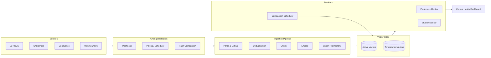
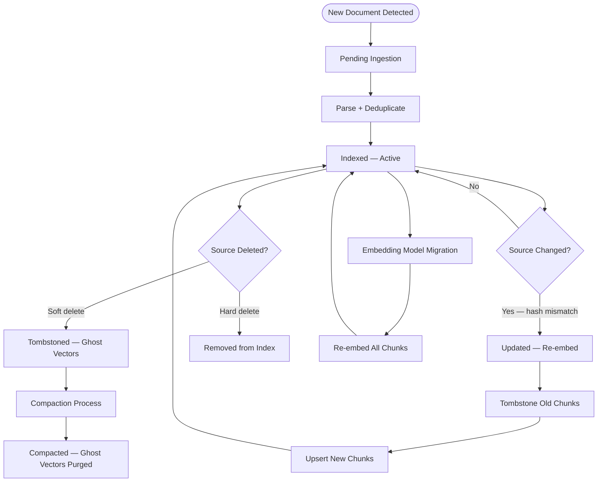
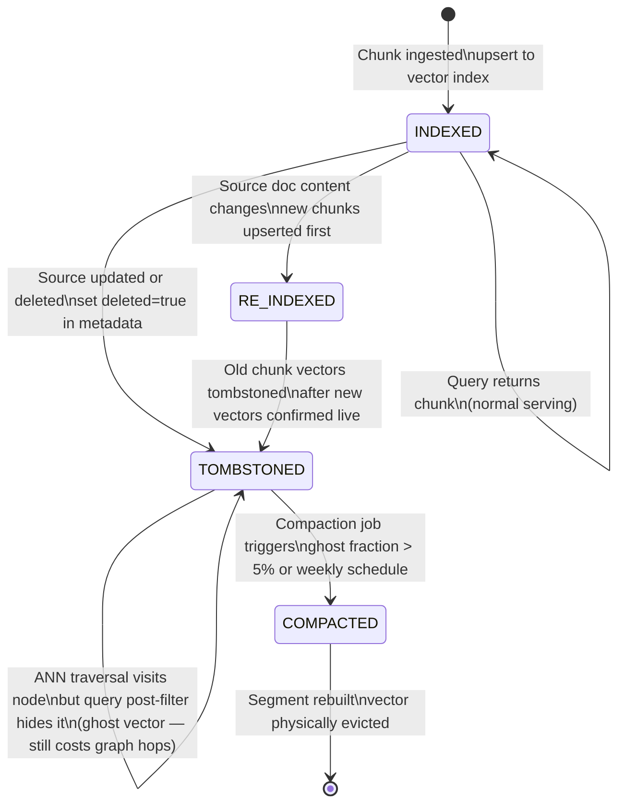
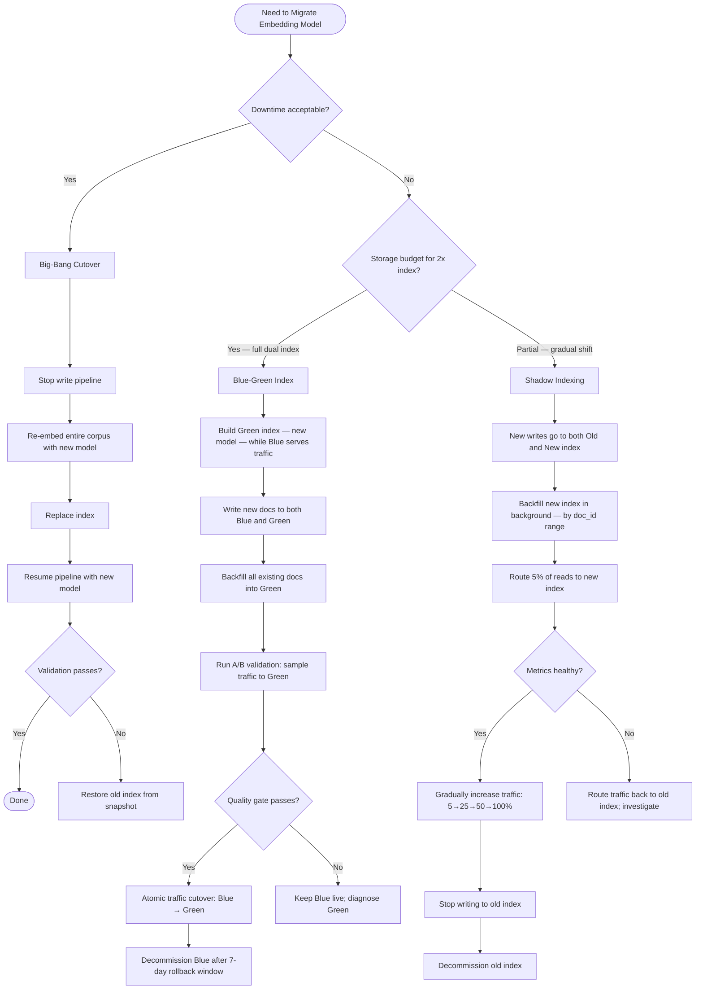
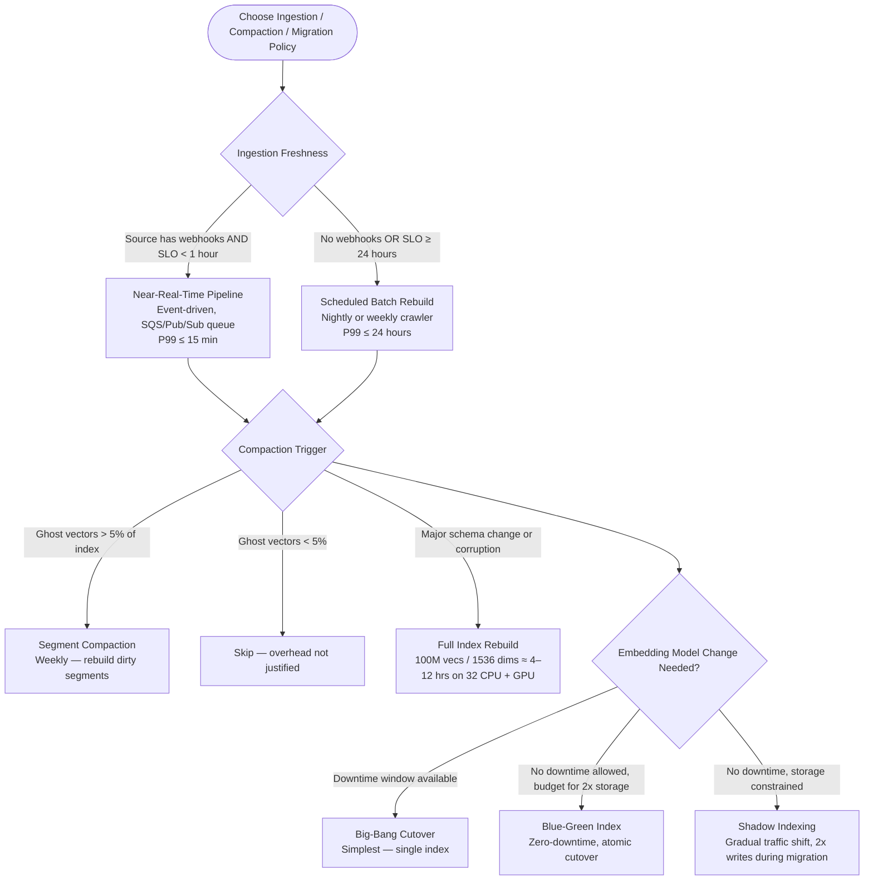
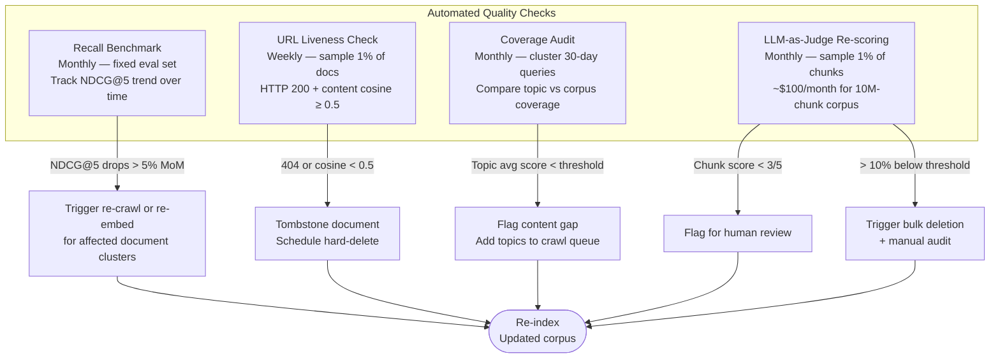

# Knowledge Base Lifecycle Management

## Overview

A vector-backed knowledge base is not a static artifact — it is a living system that must track its source corpus as documents are created, edited, deleted, and migrated across embedding models. Without deliberate lifecycle management, search quality degrades silently: stale chunks surface outdated information, deleted documents keep appearing in results, and an embedding-model upgrade without re-indexing produces retrieval that is fundamentally broken. This chapter documents the operational playbook for keeping a production RAG knowledge base accurate, fresh, and cost-efficient over its entire lifespan.

## Definition

Knowledge Base Lifecycle Management is the set of operational processes, data-pipeline components, and monitoring systems that govern how documents enter a vector index, how they are updated or removed when their source changes, how the index is kept free of orphaned vectors through compaction, how the corpus is migrated to new embedding models without downtime, and how quality decay is detected and remediated — all while enforcing freshness SLOs and cost constraints. It spans the full lifespan of every document: from first ingestion through every subsequent revision, embedding-model migration, and eventual hard deletion.

## Problem Statement

Without explicit lifecycle management, vector indexes accumulate three classes of rot:

- **Staleness**: A document updated at the source continues to be retrieved in its old form because the ingestion pipeline never detected the change. The LLM answers from outdated information — a silent accuracy regression. See [RAG Failure Modes](../06-rag/03-rag-failure-modes.md) for the downstream hallucination patterns this triggers.
- **Ghost vectors**: Soft-deleted chunks remain queryable because the deletion was recorded only in metadata, not in the ANN index structure. Index recall degrades as the fraction of ghost vectors grows (recall can drop 5-15% when >10% of index is stale).
- **Embedding space invalidation**: Switching embedding models — even a minor version bump — produces vectors in a different geometric space. Querying a mixed-model index returns semantically incoherent results with no error; precision collapses silently.

## Why Production Knowledge Bases Need Explicit Lifecycle Management

Early RAG prototypes treated the vector index as a one-time build artifact: ingest everything once, query forever. This worked for static document sets (internal wikis with infrequent edits), but production systems have live source corpora — SharePoint sites edited hourly, Confluence pages updated daily, S3-backed data lakes with continuous writes. The operational gap became visible around 2022-2023 as enterprises moved RAG from demos to production: teams discovered that 30-60 days after initial indexing, answer quality had visibly degraded because the source and the index had diverged. The canonical solution — borrowed from search-engine operational practice — is an event-driven ingestion pipeline layered on top of the vector store's CRUD API, combined with scheduled compaction and quality monitoring.

Documents change. Embeddings go stale. Models are upgraded. Corpus rots. Without explicit lifecycle management the index diverges from reality — silently, and at scale.

## Core Concepts

- **Chunk**: The atomic unit stored as one vector. A document is split into chunks during ingestion; each chunk has its own vector and metadata row. See [Chunking Strategies](05-chunking-strategies.md).
- **Tombstone**: A metadata flag (`deleted_at`, `is_active=false`) marking a chunk as logically deleted without removing it from the ANN index. Enables fast soft-delete at the cost of ghost vectors.
- **Ghost vector**: A tombstoned chunk whose vector still participates in ANN search unless filtered post-retrieval or removed via compaction.
- **Compaction**: A process that rebuilds an index segment (or the full index) to physically remove ghost vectors, reclaiming space and restoring recall.
- **Embedding model migration**: Replacing the model that produced the current index vectors. All existing vectors must be regenerated because the new model's vector space is geometrically incompatible.
- **Freshness SLO**: A contractual bound on how stale a retrieved document may be. Typical values: P99 ≤ 15 minutes for near-real-time pipelines; P99 ≤ 24 hours for batch pipelines.
- **Shadow indexing**: A migration pattern in which writes go to both old and new indexes simultaneously while read traffic is gradually shifted.
- **Blue-green index**: Maintaining two complete indexes (blue=current, green=new) and switching traffic atomically when the green index is validated.
- **LLM-as-judge**: Using an LLM to score chunk relevance or factual currency as a quality signal — at roughly $1 per 1,000 evaluations.
- **Source hash**: An MD5/SHA-256 of source document content stored at index time; compared on re-crawl to detect changes without parsing.

## Document Lifecycle: Ingestion, Update, and Deletion

Every document moves through a defined state machine from first detection to eventual removal. Understanding this state machine is prerequisite to reasoning about freshness gaps, ghost vectors, and migration correctness.

**Document states**: PENDING → PROCESSING → INDEXED → UPDATED → DELETED (soft or hard).

**Ingestion path**: hash check → parse → chunk → embed → upsert. The content hash is stored at index time; on any subsequent re-crawl, the hash is compared before any downstream work is done. If the hash matches, the pipeline short-circuits — no re-chunking, no re-embedding, no upsert.

**Update path**: detect change (hash mismatch / timestamp delta / webhook event) → re-chunk → re-embed → atomic swap. The atomic swap pattern writes new vectors before tombstoning old ones, so there is never a window where a document has no queryable representation.

**Deletion path**: two strategies with different trade-offs:
- **Soft-delete (tombstone)**: Set `deleted_at` or `is_active=false` in metadata. The chunk is filtered out of query results at query time. Instant from the application's point of view. The downside: the vector remains in the ANN graph as a ghost vector, degrading recall until compaction.
- **Hard-delete**: Physically remove the vector from the index. Required for GDPR right-to-erasure compliance. Some vector databases (e.g., Qdrant, Pinecone) support per-vector delete; others require segment rebuild.

### High-Level Architecture



### Detailed Document State Machine



## Vector Index Compaction and Soft-Delete Patterns

| Component | Role | Key Implementation Notes |
|---|---|---|
| Source Connectors | Pull or receive documents from S3, SharePoint, Confluence, web | SharePoint + Confluent/EventBridge handle 1,000s of events/sec; queue downstream |
| Change Detector | Detect new/modified/deleted documents | Webhooks for event-capable sources; polling + hash comparison for legacy sources |
| Parser | Extract text from PDF, DOCX, HTML, images | Apache Tika, Unstructured.io; preserve metadata (author, modified_at) |
| Deduplication Engine | Near-duplicate detection before ingestion | Cosine similarity > 0.97 on lightweight embedding signals probable duplicate |
| Chunker | Split documents into indexable chunks | See [Chunking Strategies](05-chunking-strategies.md) for strategy selection |
| Embedding Service | Produce vectors for each chunk | See [Embedding Models](01-embedding-models.md); determines vector dimensionality |
| Vector Store | Store and query vectors with metadata | See [Vector Databases](02-vector-databases.md); must support filtered ANN for tombstones |
| Freshness Monitor | Detect documents where `source_updated_at > vector_indexed_at` | Query metadata store; alert on SLO breach |
| Quality Monitor | Score chunk relevance via LLM-as-judge | Sample 1% of corpus monthly; $1/1,000 evaluations |
| Compaction Scheduler | Rebuild index segments to remove ghost vectors | Weekly for corpora with >5% ghost vectors |
| Migration Controller | Orchestrate blue-green or shadow-index migrations | Tracks per-model version; controls traffic split |

**Why soft-delete**: Vector indexes do not support efficient in-place deletion. In ANN graph structures (HNSW), removing a node requires re-linking its neighbors — an O(degree) operation that, at scale, is prohibitively expensive to do synchronously on the write path. Soft-delete defers this cost to a scheduled compaction process.

**Tombstone pattern**: When a document is deleted at the source, set `deleted=true` (or `deleted_at=<timestamp>`) in the metadata record associated with each of the document's chunk vectors. At query time, all ANN results are post-filtered to exclude tombstoned vectors before returning results. The vector still participates in the ANN graph traversal internally — this is the ghost vector cost — but is invisible to callers.

**Compaction**: A periodic job that rebuilds one or more index segments to physically evict tombstoned vectors. Milvus and Weaviate both use a segment architecture: each segment is an immutable HNSW graph written during bulk ingestion. Compaction merges small segments and drops tombstoned entries, producing a new segment with a clean graph. Compaction triggers: ghost vector fraction > 5% (metric-driven), or a fixed weekly schedule. The cost is CPU + I/O — approximately 2x the index size in temporary I/O during the rebuild. Run off-peak to avoid query latency spikes.

**WAL + snapshot for durability**: Production vector databases (Qdrant, Weaviate) write all upsert and tombstone operations to a write-ahead log (WAL) before acknowledging them. Periodic snapshots checkpoint the WAL. Recovery after a crash replays the WAL from the last snapshot — no data is lost that was acknowledged. Compaction only runs on committed segments, not on WAL-pending data.

**Cost of compaction**: CPU + I/O intensive; typically done during off-peak hours (e.g., 2–6 AM). For a 100M-vector index, a full segment rebuild takes 4-12 hours on 32 CPU cores + GPU. Prefer per-segment compaction where the vector DB supports it (Qdrant segments, Elasticsearch segments) to bound the blast radius.

**Advantages and Disadvantages of soft-delete vs. hard-delete**:

| Pattern / Policy | Advantages | Disadvantages |
|---|---|---|
| Soft-delete (tombstone) | Instant delete from application POV; no index rebuild | Ghost vectors degrade recall over time; requires compaction discipline |
| Hard delete | No ghost vectors; clean index | Slow if vector DB requires full segment scan; some DBs don't support per-vector delete efficiently |
| Compaction (segment rebuild) | Removes ghost vectors; improves recall | Temporary 2x I/O during rebuild; slight query latency spike |
| Full index rebuild | Cleanest state; resets all accumulated debt | Long rebuild time (4-12 hours for 100M vectors); requires read-only or dual-index during rebuild |



## The Document Update Pipeline

The sequence below documents what happens from the moment a source document changes until the updated content is live in the index and stale vectors are compacted.

**Pipeline stages**: Source change detected → content hash check → delta extraction → re-chunking → re-embedding → transactional upsert.

**Atomic update pattern**: Write new vectors before deleting old. This ensures there is no window during the update where the document is unqueryable. The sequence is: (1) embed new chunks, (2) upsert new vectors to the index, (3) tombstone old chunk vectors. If the pipeline crashes between steps 2 and 3, the document temporarily has duplicate representations — the freshness monitor will detect the version mismatch and the pipeline will re-run, which is safe because upsert is idempotent.

**Latency SLOs**: P99 update lag (time from source change to index update committed) should be tracked per source connector. Typical targets: P99 ≤ 15 minutes for webhook-driven pipelines, P99 ≤ 4 hours for polling-based pipelines, P99 ≤ 24 hours for batch pipelines. Freshness budget is the gap between the source's `updated_at` and the vector DB's `indexed_at` for the same document version.

```mermaid
sequenceDiagram
    actor Author
    participant Source as Source System<br/>(SharePoint / S3)
    participant Queue as Event Queue<br/>(SQS / Pub/Sub)
    participant Pipeline as Ingestion Pipeline
    participant EmbedSvc as Embedding Service
    participant VecDB as Vector Database
    participant CompactJob as Compaction Job<br/>(Scheduled Weekly)
    participant FreshMon as Freshness Monitor

    Author->>Source: Edit document
    Source->>Queue: Emit change event (doc_id, version, timestamp)
    Queue->>Pipeline: Deliver event (deduped, at-least-once)

    Pipeline->>Source: Fetch updated document
    Pipeline->>Pipeline: Parse, extract text + metadata
    Pipeline->>Pipeline: Hash content → compare with stored hash
    alt Content changed
        Pipeline->>Pipeline: Re-chunk document
        Pipeline->>EmbedSvc: Embed new chunks (batch API call)
        EmbedSvc-->>Pipeline: New vectors
        Pipeline->>VecDB: Tombstone old chunk vectors (set deleted_at)
        Pipeline->>VecDB: Upsert new vectors with updated metadata
        Pipeline->>Pipeline: Store new content hash + indexed_at timestamp
    else Content unchanged (hash match)
        Pipeline->>Pipeline: Skip — no-op
    end

    FreshMon->>VecDB: Query: docs where source_updated_at > indexed_at
    FreshMon-->>FreshMon: Alert if P99 staleness > 15 min SLO

    Note over CompactJob: Runs on weekly schedule
    CompactJob->>VecDB: Count tombstoned vectors (ghost fraction)
    alt Ghost fraction > 5%
        CompactJob->>VecDB: Rebuild index segment — purge tombstoned vectors
        VecDB-->>CompactJob: Segment rebuilt; ghost vectors removed
    else Below threshold
        CompactJob->>CompactJob: Skip compaction this cycle
    end
```

## Embedding Model Migration Strategies

Switching embedding models — even a minor version bump — produces vectors in a different geometric space. The old and new vector spaces are geometrically incompatible: there is no incremental migration path at the vector level. Every chunk must be re-embedded. The strategic question is how to handle traffic during the re-embed window.

**Big-bang migration**: Stop all writes, re-embed the entire corpus with the new model, replace the index, resume writes. Simplest operationally — only one index to manage at any time. Risky for large corpora: if the new model underperforms, rollback requires restoring the pre-migration index snapshot. Requires a hard downtime or a write-freeze period. Only appropriate when a scheduled maintenance window is acceptable and the corpus is small enough to re-embed quickly (< 1 hour).

**Blue-green migration**: Build a new "green" index in parallel while the "blue" index serves all traffic. Dual-write new ingestion events to both indexes. Backfill all existing documents into the green index. Validate green quality with shadow traffic (A/B test). When quality gates pass, atomically flip the router from blue to green. Zero downtime, clean atomic cutover, easy rollback (flip the router back). Requires 2x persistent storage until the old blue index is decommissioned. The gold standard for production migrations with no downtime tolerance.

**Shadow indexing**: New writes go to both old and new indexes simultaneously. Read traffic is gradually shifted (5% → 25% → 50% → 100%). The old index continues to serve the majority of reads while the new index is backfilled and validated. No hard cutover moment — traffic shifts gradually as confidence builds. Requires 2x write cost and 2x storage during the migration window, but avoids the need to build a full parallel index before any reads go to it. Budget alternative to blue-green when storage is constrained.

**Incremental migration**: Re-embed in priority order — hot documents (high retrieval frequency) first, cold documents (rarely retrieved) last. Serve from the old index for cold documents during the transition. Requires a hybrid query layer that routes to the old or new index based on document priority tier. Reduces the time until high-value content is on the new model, at the cost of significant query-layer complexity.

**When to use each strategy**:

| Pattern / Policy | Advantages | Disadvantages |
|---|---|---|
| Near-real-time ingestion | P99 freshness ≤ 15 min; users see updates quickly | Higher infrastructure cost (always-on consumers); event ordering complexity |
| Batch ingestion | Simple; cost-predictable | P99 freshness ≤ 24 hours; miss time-sensitive updates |
| Big-bang migration | Operationally simple; single index to manage | Hard downtime or a freeze period; high risk if new model underperforms |
| Shadow indexing | No downtime; gradual confidence building | 2x storage + 2x write cost during migration; stale backfill ordering issues |
| Blue-green index | Zero-downtime; clean atomic cutover; easy rollback | 2x persistent storage until old index decommissioned; operational complexity of two live indexes |



## Index Freshness Policies and SLOs

**Freshness SLO**: The maximum acceptable lag between a source document change and the corresponding update being live in the vector index. Defined per source connector because different sources have different change rates and user expectations. Example targets: SharePoint = P99 ≤ 15 min, Confluence = P99 ≤ 30 min, S3 data lake = P99 ≤ 4 hours, web crawl = P99 ≤ 24 hours, legacy FTP = P99 ≤ 24 hours.

**Change detection strategies**:
- **Push (webhook/CDC)**: The source system emits an event on every change. Lowest latency (seconds to minutes). Requires webhook support at the source. Change Data Capture (CDC) for database-backed sources (Debezium + Kafka). Risk: webhook delivery failures create silent freshness gaps — always back up with periodic reconciliation.
- **Polling (crawl-based)**: A scheduled job crawls the source at fixed intervals, comparing `modified_at` timestamps or content hashes. Simple and universal. Latency bounded by poll interval. Higher compute cost at large scale.
- **Hybrid**: Webhook-driven for near-real-time sources; polling as a catch-all reconciliation pass for missed events. The reconciliation poll interval sets the worst-case SLO floor even for webhook sources.

**Freshness tiers**:
- **Hot docs** (real-time): Documents with high retrieval frequency or time-sensitive content. Webhook-driven pipeline, P99 ≤ 15 min. Examples: incident runbooks, product pricing pages, regulatory notices.
- **Warm docs** (hourly): Documents updated frequently but not time-critical. Scheduled batch every 1 hour. Examples: internal wiki pages, team documentation.
- **Cold docs** (daily/weekly): Rarely updated, low retrieval frequency. Nightly or weekly batch rebuild. Examples: archived product specs, historical reports.

**Freshness vs cost tradeoff**: Near-real-time ingestion requires always-on consumers (Lambda, Cloud Run, GKE workers) and event queue infrastructure. Batch ingestion is simpler and cost-predictable but provides weaker freshness guarantees. The cost delta between hourly batch and real-time is typically 3-5x on infrastructure; justify it only when the SLO genuinely requires it.



## Corpus Quality Decay and Automated Quality Checks

A knowledge base that is kept fresh at the ingestion level can still rot at the content level. Quality decay is silent: retrieval metrics look normal, but the retrieved content is outdated, irrelevant, or factually wrong — the index reflects the source faithfully, but the source itself has decayed.

**Types of decay**:
- **Stale facts**: Documents remain at source but their content has not been updated to reflect changed reality (deprecated APIs, obsolete pricing, superseded procedures). The source is live; the information is wrong.
- **Removed source pages (404)**: Source URLs that once hosted valid content now return 404 or redirect to unrelated content. The index holds vectors for content that no longer exists at its canonical location.
- **Domain drift**: The subject matter of the corpus shifts over time (e.g., a product documentation knowledge base gradually accumulates support-ticket content and blog posts). The index no longer aligns with the intended retrieval domain.
- **Topic coverage gaps**: New topics emerge in user queries that have no coverage in the indexed corpus. The index is not stale — it never had the content. This is a coverage audit problem, not a freshness problem.

**Quality signals**:
- **Embedding model confidence**: Low cosine similarity between the query vector and the top-k retrieved vectors is a signal that the index lacks good coverage for that query.
- **Retrieval hit rate**: The fraction of queries where at least one retrieved chunk is rated relevant (via LLM-as-judge or user feedback). A declining hit rate indicates corpus decay.
- **Citation freshness**: The `source_created_at` or `source_updated_at` distribution of retrieved chunks. An increasing fraction of old citations indicates the corpus is not being refreshed.

**Automated quality checks**:
- **Periodic recall benchmark**: Monthly, run a fixed evaluation set of (query, expected_chunk) pairs against the live index. Track NDCG@5 and recall@10 over time. A downward trend predicts user-facing degradation 2-4 weeks before complaints.
- **Source URL liveness check**: Weekly, sample 1% of indexed documents and verify the source URL returns a 200 status with non-trivially changed content. URLs returning 404, 301 chains to unrelated pages, or content with cosine similarity < 0.5 vs. the indexed version are flagged for removal or re-crawl.
- **Coverage audit**: Monthly, cluster the last 30 days of user queries by topic. Compare topic coverage in the corpus using a lightweight retrieval test. Topics with average retrieval score < threshold flag a content gap.
- **LLM-as-judge re-scoring**: Sample 1% of chunks monthly. At $1/1,000 evaluations, that is $100/month for a 10M-chunk corpus. Track the quality score distribution over time as a KPI. A downward shift predicts retrieval degradation.

**Quality thresholds triggering action**:
- Chunk quality score < 3/5 on LLM-as-judge → flag for human review.
- > 10% of sampled chunks below quality threshold → trigger manual review and potential bulk deletion.
- Source URL liveness check fails → tombstone and schedule hard-delete.
- Recall benchmark drops > 5% month-over-month → trigger re-crawl or re-embed for affected document clusters.



## Scalability

**Ingestion throughput**: An S3 + EventBridge pipeline can ingest 1,000s of change events/second before queue saturation. The bottleneck shifts to the embedding service — a typical GPT-3-sized encoder handles ~5,000-10,000 tokens/second per GPU. At 512 tokens/chunk, that is roughly 10-20 chunks/second/GPU; scale horizontally.

**Index size**: Pinecone, Weaviate, and Qdrant all support horizontal sharding. Plan index shards for 10-50M vectors per shard to keep ANN latency in the 5-30ms range. Beyond 50M vectors per shard, recall/latency tradeoffs degrade.

**Compaction**: Run compaction on a per-segment basis (not full-index) where the vector DB supports it (Qdrant segments, Elasticsearch segments). Full index rebuild at 100M vectors × 1,536 dimensions takes approximately 4-12 hours on 32 CPU cores + GPU acceleration, depending on I/O and the ANN algorithm (HNSW build is compute-heavy).

**Re-embedding cost at scale**: 10M chunks × 512 tokens average × $0.13/1M tokens (text-embedding-3-small) = **$665** for a full corpus re-embed. At 100M chunks, that is $6,650. Factor this into migration planning; the compute time, not the API cost, is usually the binding constraint for large corpora.

**Queue fan-out**: SharePoint and Confluence both support webhooks; route through SQS or Pub/Sub with per-document deduplication (using the event's `doc_id` + `version` as idempotency key) to avoid processing the same change twice during at-least-once delivery.

## Reliability

**At-least-once ingestion**: Use a durable queue (SQS, Pub/Sub) between the source event and the pipeline. Process with idempotent upserts: `upsert(chunk_id, vector, metadata)` is safe to replay. Store the document's content hash; skip re-embedding if the hash is unchanged.

**Ingestion dead-letter queue (DLQ)**: Route failed processing attempts (parse failures, embedding service timeouts) to a DLQ after 3 retries. Alert on DLQ depth > 100 items. Failed documents create freshness gaps.

**Dual-index serving**: During a blue-green or shadow migration, both indexes must be queryable. Use a feature flag or traffic-splitting layer (Envoy, custom query router) to control the read split. Monitor per-index retrieval latency and precision separately.

**Rollback plan**: Keep the old index and the old embedding model endpoint live for a minimum of 7 days after migration cutover. Reverting a blue-green deployment is a traffic-router config change; reverting a big-bang cutover requires restoring from the pre-migration index snapshot.

**Consistency under concurrent updates**: If the same document is updated twice in quick succession, both events hit the queue. The second event should supersede the first. Implement optimistic concurrency control: store `doc_version` in metadata and reject (or skip) an upsert if the incoming version is older than the stored version.

## Security

**Source connector credentials**: Rotate service account tokens for SharePoint, Confluence, and S3 on a 90-day schedule. Use AWS IAM roles for S3 (no long-lived keys). Store connector secrets in Vault or AWS Secrets Manager; never in environment variables in container specs.

**Vector data sensitivity**: Vectors are not directly human-readable, but with enough pairs of (vector, source text) an attacker can train an inversion model to reconstruct approximate source text. Apply the same access controls to the vector index as to the source document. If your source requires row-level security, replicate it as metadata filters on the vector store and enforce at query time.

**Tenant isolation**: In multi-tenant deployments, isolate each tenant's vectors by namespace (Pinecone namespace, Qdrant collection, Weaviate multi-tenancy). Never mix tenant vectors in the same index; cross-contamination at retrieval time is a data-leak vector.

**Audit log**: Log every document ingestion, update, and deletion event with actor, timestamp, and doc_id. This is required for GDPR right-to-erasure compliance (prove a document was hard-deleted from the index).

## Cost Optimization

**Embedding cost**:
- 10M chunks × 512 tokens × $0.13/1M tokens = **$665** per full re-embed (text-embedding-3-small).
- Incremental updates only re-embed changed documents; at typical corpus churn of 2-5%/day, daily incremental cost = $665 × 0.03 ≈ **$20/day**.
- Use a cheaper model (e.g., text-embedding-3-small at $0.13/1M vs. ada-002 at $0.10/1M — comparable cost, better quality) for bulk ingestion; reserve higher-quality models for latency-sensitive applications.

**Storage cost**:
- Blue-green migration requires 2x storage during the migration window (typically 1-7 days). Size this explicitly in your migration budget.
- Shadow indexing also requires 2x storage but only during backfill. Decommission promptly.

**Quality monitoring cost**:
- LLM-as-judge re-scoring: $1 per 1,000 evaluations. At 10M chunks, sampling 1% monthly = 100,000 evaluations/month = **$100/month**.
- Use a fast, cheap model (Haiku-class) for quality scoring; reserve Sonnet/Opus for escalated human-review triage.

**Compaction cost**:
- Weekly segment compaction on a corpus with >5% ghost vectors. Compaction is a compute operation (CPU + disk I/O), not a per-token cost. Size your compaction window during off-peak hours to avoid query latency spikes.

**Right-sizing the embedding model**: Larger embedding dimensions (3,072 vs. 1,536) cost more in both compute and storage. Benchmark retrieval quality at smaller dimensions first; most corpora see diminishing returns beyond 1,536 dims.

## Monitoring

**Freshness SLO tracking**:
- Metric: `max(source_updated_at - vector_indexed_at)` over a rolling 1-hour window, P99.
- Alert: P99 staleness > 15 minutes for near-real-time pipelines; > 24 hours for batch pipelines.
- Dashboard: Plot per-source connector freshness lag separately; a broken SharePoint webhook shows up as a spike on that connector only.

**Ghost vector fraction**:
- Metric: `tombstoned_vector_count / total_vector_count`.
- Alert: > 5% triggers compaction; > 15% is a critical incident (recall impact is measurable).

**Ingestion pipeline health**:
- DLQ depth: alert if > 100 documents in the dead-letter queue.
- Processing latency: p99 time from event enqueue to vector upsert committed.
- Embedding service error rate: alert if > 0.1% of embedding requests return non-200.

**Quality score distribution**:
- After LLM-as-judge re-scoring, track the distribution of chunk quality scores. A shift toward lower scores indicates corpus rot.
- Alert: if >10% of sampled chunks score below the relevance threshold (e.g., < 3/5), trigger a manual review and potential bulk deletion.

**Index rebuild progress**: During compaction or full rebuild, expose a progress metric (vectors rebuilt / total vectors). Set a timeout alert if rebuild takes >150% of expected duration.

See [AI Observability Architecture](../20-observability/01-ai-observability-architecture.md) for the broader observability stack these metrics feed into.

## Production Best Practices

1. **Always store the content hash at ingestion time.** Without it, change detection falls back to polling source `modified_at`, which is unreliable (some systems don't update it on minor edits).

2. **Never delete vectors without tombstoning first.** Immediate hard-delete can cause race conditions in ongoing ANN queries. Tombstone, then schedule hard delete during a compaction window.

3. **Enforce idempotent pipeline stages.** Parse, chunk, embed, and upsert must all be safe to replay. Use chunk IDs derived from `doc_id + chunk_index + content_hash` so re-runs produce the same IDs.

4. **Keep old indexes for at least 7 days post-migration.** In practice, issues with a new embedding model surface within 2-3 days of production traffic. A 7-day rollback window catches the long tail.

5. **Run compaction on a schedule, not reactively.** Waiting for recall complaints to trigger compaction means users already experienced degraded quality. Set a weekly schedule; measure ghost vector fraction before and after.

6. **Test rollback before every major migration.** Simulate a rollback in staging: switch traffic back to the old index, confirm latency and precision metrics recover. Untested rollback procedures fail under stress.

7. **Deduplication before ingestion saves both cost and recall.** If two near-duplicate documents are indexed, retrieval may return both; the LLM sees repeated context and quality degrades. Use cosine similarity > 0.97 on a cheap lightweight embedding as a near-dup gate before the full ingestion pipeline.

8. **Apply per-language chunking for multilingual corpora.** CJK languages (Chinese, Japanese, Korean) do not use whitespace as token boundaries; applying English word-splitting rules produces garbage chunks. Use language detection + language-specific tokenizers (jieba for Chinese, MeCab for Japanese) before chunking.

## Real-World Examples

**Enterprise knowledge base (illustrative)**: An internal IT-support knowledge base with 500,000 documents on SharePoint processes approximately 2,000 change events per day. The team operates a near-real-time pipeline (SQS + Lambda + Pinecone), maintains a P99 freshness SLO of 15 minutes, and runs weekly compaction. After 6 months, the ghost vector fraction was 8%; a compaction run cut it to 0.3% and improved retrieval recall@5 by ~11%.

**Embedding model migration (illustrative)**: A legal-tech company migrates from text-embedding-ada-002 to text-embedding-3-large across 8M chunks. They choose blue-green because downtime is prohibited. The migration takes 4 days (backfill + validation). Shadow read traffic at 10% shows +4% NDCG over the old index. They cut over on day 5 and decommission the ada-002 index after 7 days. Total cost: 8M × 512 tokens × $0.13/1M = **$532** in embedding API calls plus 7 days of 2x storage.

**Multi-modal corpus (illustrative)**: A product-documentation system indexes both text and product images. Text chunks are embedded with a text encoder; images are embedded with CLIP. At query time ("show me the error screen for login failures"), the query is embedded with both models and routed to both indexes; results are merged by a rank-fusion layer. Audio content (tutorial videos) is first transcribed via Whisper, then treated as text for indexing.

## Interview Questions

### Beginner

**Q: What happens if you switch embedding models without re-indexing?**

A: The existing index contains vectors produced by the old model in its specific geometric space. The new model produces vectors in a different space — the basis directions are not aligned, the distances mean different things. Running a nearest-neighbor query with a new-model query vector against old-model index vectors returns semantically random results. Precision collapses to near-zero with no error message — the system silently returns wrong answers. You must re-embed every chunk with the new model and rebuild the index.

**Q: What is a tombstone in a vector database context?**

A: A tombstone is a metadata flag (e.g., `deleted_at = <timestamp>`, `is_active = false`) that logically marks a chunk as deleted without removing its vector from the ANN index. It enables fast soft-delete: the application marks the record deleted, and subsequent queries filter it out via metadata predicates. The downside is that the vector still participates in the ANN graph traversal (ghost vector), degrading recall until compaction physically removes it.

### Intermediate

**Q: Design a change-detection mechanism for a SharePoint-backed knowledge base.**

A: Use the SharePoint webhook API to subscribe to change notifications at the site or library level. SharePoint emits a notification (containing the list of changed item IDs, not the document content) to a configured endpoint within seconds of a change. Route the notification to an SQS queue for durability. A consumer fetches the updated document, hashes its content, compares with the stored hash, and skips if unchanged (handles spurious notifications). For sources that do not support webhooks (legacy file shares, some databases), fall back to scheduled polling: crawl the source every N minutes, request only items with `modified_at > last_crawl_at`, and hash-compare content to confirm real changes. The hash comparison is the critical idempotency gate — without it, spurious notifications or redundant polls trigger unnecessary re-embedding.

**Q: Walk through the compaction decision. When do you compact vs. rebuild?**

A: Compact a segment when the ghost vector fraction exceeds 5% — the compaction rebuilds that segment, removing tombstoned vectors and re-linking the HNSW graph. This is cheaper than a full rebuild because only dirty segments are processed. Full index rebuild is warranted for: (1) changing the ANN algorithm or HNSW construction parameters (m, ef_construction); (2) major schema changes in metadata that require re-indexing all vectors; (3) corruption. Full rebuild at 100M vectors × 1,536 dims takes 4-12 hours on 32 CPU cores + GPU — budget a maintenance window or run a blue-green build alongside the live index.

### Senior

**Q: Your team wants to migrate from ada-002 to text-embedding-3-large with zero downtime. The corpus has 50M chunks. Design the migration.**

A: Use blue-green indexing. Steps: (1) Provision a new "green" index (Pinecone, Qdrant, or Weaviate) with the text-embedding-3-large dimensionality (3,072 dims vs. ada-002's 1,536). (2) Begin dual-writing: all new ingestion events embed with both models and write to both indexes. (3) Start the backfill job: iterate over all 50M existing chunks by doc_id range, re-embed with text-embedding-3-large, and upsert to the green index. At $0.13/1M tokens × 50M chunks × ~512 tokens = ~$3,300 in API costs; at 10,000 chunks/second embedding throughput, the backfill takes roughly 5,000 seconds (~1.4 hours), but rate limits on the embedding API typically extend this to 1-3 days. (4) Once the green index is fully backfilled, route 5% of read traffic to it via a query router and measure NDCG/recall vs. the blue index on the same queries. (5) If quality gates pass after 24 hours, ramp to 25%, 50%, 100%. (6) Stop writing to the blue index. (7) Retain the blue index for 7 days as the rollback target, then decommission. Storage cost during migration: 2x for ~7-10 days.

**Q: How do you handle corpus quality decay for a knowledge base with 2M documents that's 18 months old?**

A: First, quantify the decay. Run LLM-as-judge re-scoring on a 1% random sample (20,000 chunks). At $1/1,000 evaluations, that is $20 and ~2 hours of compute. Bucket results by chunk quality score. Identify patterns: are low-quality chunks clustered in specific source folders (content rot), specific authors, or specific time ranges (old documents)? Second, address the zombie document problem: query the metadata store for all doc_ids, then check each against the source system. Any doc_id not found in the source should be tombstoned. Automate this reconciliation as a weekly job. Third, for content rot (documents still present at source but factually outdated), establish quality signals: low click-through rate on retrieved chunks (if instrumented in the RAG pipeline), explicit thumbs-down feedback, and LLM-judge scores below threshold. Flag low-quality chunks for human review; set a 30-day SLO on human disposition (keep vs. delete). Fourth, re-check after 60 days by re-running the 1% sample; track the quality distribution over time as a KPI on the corpus health dashboard.

### Staff

**Q: Design the freshness monitoring and SLO enforcement system for a multi-source knowledge base with five different source connectors, each with a different SLO.**

A: Model freshness as a per-source-connector SLO. Each connector gets a target: SharePoint = 15 min, Confluence = 30 min, S3 data lake = 4 hours, web crawl = 24 hours, legacy FTP = 24 hours. The metadata store records three timestamps per chunk: `source_created_at`, `source_updated_at` (from the source system's API), and `vector_indexed_at` (pipeline write time). The freshness metric for each connector is `P99(vector_indexed_at - source_updated_at)` over a rolling 1-hour window, computed from the metadata store. Alert when any connector's P99 staleness exceeds its SLO. For SLO burn rate alerting (borrowed from SRE error budgeting): if the SharePoint connector is consuming its 15-minute SLO budget at 2x the normal rate, alert before the budget is exhausted. Dashboard: per-connector freshness time series, current SLO budget remaining, DLQ depth per connector. Incident runbook: connector webhook failure → backfill trigger (poll source since `last_successful_index_at`); embedding service degradation → route to fallback embedding service endpoint or queue with extended timeout; vector DB write failure → retry with exponential backoff, alert on DLQ growth.

## Google-Level Follow-Up Questions

**1. In a blue-green migration, the green index returns better offline NDCG but worse user satisfaction scores in the 10% shadow traffic A/B test. How do you diagnose and resolve this?**

Offline NDCG is computed against a curated relevance dataset; online satisfaction is measured via thumbs-up/down or session engagement. The divergence means the new model is not aligned with user intent as expressed in real queries — the evaluation dataset is stale or not representative. Steps: (1) Sample the shadow traffic queries that got thumbs-down on green but passed on blue. Manually inspect the retrieved chunks. (2) Common cause: the new model over-emphasizes semantic similarity to the query but ignores lexical matching for specific product names, version numbers, or error codes that users search for literally — text-embedding-3-large is often worse at this than ada-002 for highly technical domains. (3) Resolution options: hybrid search (BM25 + dense retrieval with reciprocal rank fusion) can close the gap; alternatively, fine-tune the green-index query router to blend BM25 scores. (4) Do not cut over until online metrics are at parity. Extend the shadow period and iterate on the retrieval layer rather than reverting the embedding model — the offline quality is real, but the retrieval strategy needs to be adapted.

**2. Your ingestion pipeline uses at-least-once delivery, but your vector database does not support idempotent upsert — duplicate chunk_ids produce duplicate vectors. How do you handle this?**

The correct fix is to make the pipeline idempotent before the vector DB write: (1) Introduce an idempotency cache (Redis, DynamoDB) keyed by `(doc_id, chunk_index, content_hash)`. Before writing to the vector DB, check if this tuple was already committed in the last N hours. If yes, skip the write. (2) If the vector DB supports per-vector delete, delete-then-insert is atomic enough for most workloads: delete by chunk_id first, then insert — no duplicates accumulate. (3) If neither option is available, build a deduplication step in the vector DB query layer: post-process ANN results to filter by chunk_id uniqueness before returning to the caller. Note that option 3 doesn't prevent duplicate storage — it only masks the problem. Option 1 or 2 is required for correctness. The root issue is that idempotent upsert is a fundamental requirement for any system operating over an at-least-once queue; choose vector DB infrastructure that supports it natively (Pinecone and Qdrant both support upsert by ID).

**3. How would you design the corpus lifecycle system to support GDPR right-to-erasure requests with proof of compliance?**

Right to erasure requires that when a user requests deletion of their data, all copies — including derived representations such as embeddings — are deleted within 30 days (GDPR Article 17). For a vector knowledge base: (1) At ingestion, store a mapping from `user_id → [chunk_id_1, chunk_id_2, ...]` in a persistent audit store (e.g., DynamoDB). (2) On erasure request, look up all chunk_ids for that user, tombstone each in the vector DB, schedule hard deletion via the next compaction run (or force an immediate compaction for that document's segments if the 30-day SLO is tight). (3) Log every step — tombstone timestamp, hard-delete timestamp — to an append-only audit log (CloudTrail or equivalent). (4) Generate a compliance attestation report: "User X's N vectors were tombstoned on date T and hard-deleted on date T+3 during compaction cycle C." Critically, shadow index and blue-green migration must both respect erasure: if a new index is being built, omit the erased user's chunks from the backfill. This requires the erasure list to be checked during backfill, not just at query time.

**4. You need to index a corpus where 40% of documents are in Japanese, 30% in English, and 30% in Spanish. Walk through the architecture decision for embedding strategy.**

Three options: (1) Multilingual model (e.g., multilingual-e5-large, paraphrase-multilingual-mpnet): single index, single model. Simple operations, but English-dominant training data means retrieval quality for Japanese may lag. (2) Per-language models + language router: at query time, detect query language, route to the matching per-language index (English index with ada-002, Japanese index with multilingual-e5 or sonoisa/text-embedding-sbert-base-ja-mean-tokens, Spanish index with multilingual-e5). Better per-language quality, but 3x operational complexity. (3) Hybrid: single multilingual index for cross-language retrieval (user asks in English, retrieves a Japanese document); per-language secondary indexes for monolingual precision queries. Recommendation for 40/30/30 split: option 1 or 3 is appropriate unless Japanese retrieval quality is a product requirement. Japanese requires language-specific chunking (MeCab or SudachiPy for tokenization) regardless of embedding strategy. Run a retrieval quality benchmark (NDCG@10 per language) with both a multilingual model and a Japanese-specific model before committing to the architecture. The operational cost of maintaining 3 indexes is significant; justify it with measured quality deltas, not assumptions.

## Common Mistakes

1. **Not storing content hashes at ingestion.** Teams rely on source `modified_at` timestamps for change detection. Problem: `modified_at` is unreliable — it can be reset by file moves, metadata-only edits, or system clock issues. Result: missed updates (stale index) or unnecessary re-embeds (wasted cost). Fix: always hash document content at ingestion and store the hash as metadata.

2. **Hard-deleting vectors immediately on source document deletion.** Immediate hard delete can corrupt ongoing ANN queries that are mid-traversal when the vector is removed. It also bypasses the soft-delete audit trail needed for GDPR compliance attestation. Fix: tombstone first, hard-delete during the next scheduled compaction window.

3. **Skipping rollback validation before embedding model migration.** Teams test the migration forward (new model works) but never test the rollback (reverting to the old model). When the new model turns out to have a regression for a specific query type discovered post-cutover, the rollback procedure fails because the old index snapshot was not kept, or the old embedding service endpoint was decommissioned. Fix: explicitly keep the old index for 7 days post-cutover and test the rollback procedure in staging before starting any production migration.

4. **Allowing compaction to fall behind indefinitely.** A team disables the weekly compaction job to save compute costs. After 3 months, the ghost vector fraction reaches 25%. ANN recall@5 has degraded by 18% (measured), but no one noticed because there was no freshness monitoring. Fix: set an alert on ghost vector fraction > 5%, treat compaction as a required operational task, and measure recall before and after each compaction run to build an empirical degradation curve.

5. **Indexing near-duplicate documents without deduplication.** A web crawler ingests the same press release from 40 different syndication URLs. The index contains 40 near-identical chunks. Retrieval returns the same information 40 times in the top-40 results; effective recall@5 is near zero because the LLM sees no diversity. Fix: run cosine similarity deduplication (threshold ~0.97) using a cheap lightweight embedding before upsert. Store canonical `source_url` and suppress duplicates.

6. **Applying English chunking logic to CJK languages.** Word-boundary chunking (splitting on whitespace or punctuation) produces single-character or meaningless chunks for Chinese and Japanese. A team ingests a Japanese customer-support corpus with English chunking rules; chunk quality is garbage and retrieval precision is ~20% below expected. Fix: detect document language at parse time and branch to the appropriate tokenizer (jieba, MeCab, SudachiPy) before chunking. This is not optional for multilingual corpora — it is a prerequisite for functional retrieval.

## Key Takeaways

- **A vector index is a derived artifact, not a source of truth.** It must be continuously synchronized with its source corpus; without lifecycle management, divergence is the default, not the exception.
- **Soft-delete is fast but expensive in the long run.** Tombstones enable instant logical deletion but accumulate as ghost vectors that degrade ANN recall. Enforce weekly compaction with a 5% ghost-vector-fraction trigger to keep recall stable.
- **Embedding model migrations are full re-index operations.** No incremental path exists; every chunk must be re-embedded because the old and new vector spaces are geometrically incompatible. Budget $665 per 10M chunks at current pricing (text-embedding-3-small) and plan for 2x storage during the migration window.
- **Blue-green is the gold standard for zero-downtime migration; shadow indexing is the budget alternative.** Both require 2x write traffic during migration. Retain the old index for 7 days post-cutover as the rollback target.
- **Freshness SLOs must be measured from the source's `updated_at`, not from queue enqueue time.** Queue enqueue time misses delays between source edit and event emission. Store `source_updated_at` as metadata at ingestion time and monitor `P99(indexed_at - source_updated_at)`.
- **Corpus quality decay is silent and cumulative.** Sample 1% of chunks monthly with LLM-as-judge re-scoring ($100/month at 10M chunks) and track the quality distribution as a KPI. A downward trend predicts retrieval degradation 2-4 weeks before users notice.
- **Content hash is the universal idempotency key.** Use `hash(doc_content)` to deduplicate events, skip unchanged documents, and ensure pipeline replay safety. It is the cheapest correctness mechanism in the entire lifecycle system.
- **Multi-language and multi-modal corpora multiply operational complexity.** Per-language chunking, multilingual embedding strategy, and cross-modal rank fusion are each non-trivial systems. Quantify quality before committing to architecture — measured NDCG deltas, not assumptions, should drive the design.

---
*Part of [Retrieval Systems](index.md) in the [AI System Design Notes](../index.md).*
