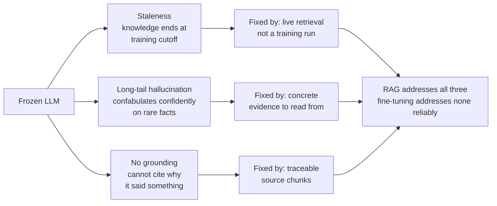
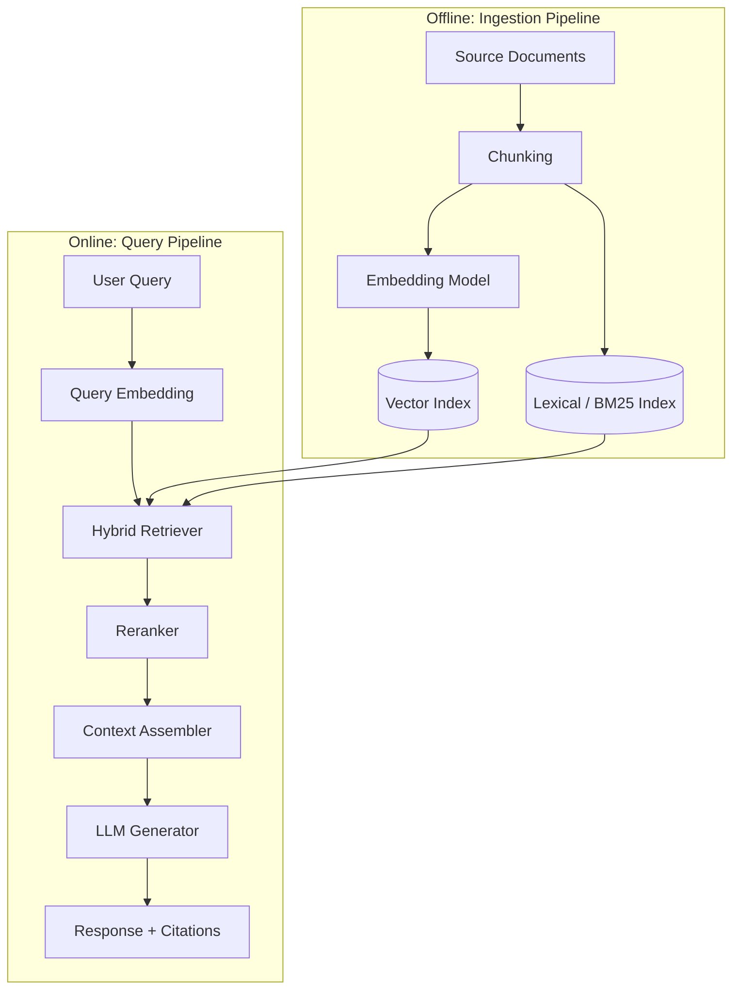
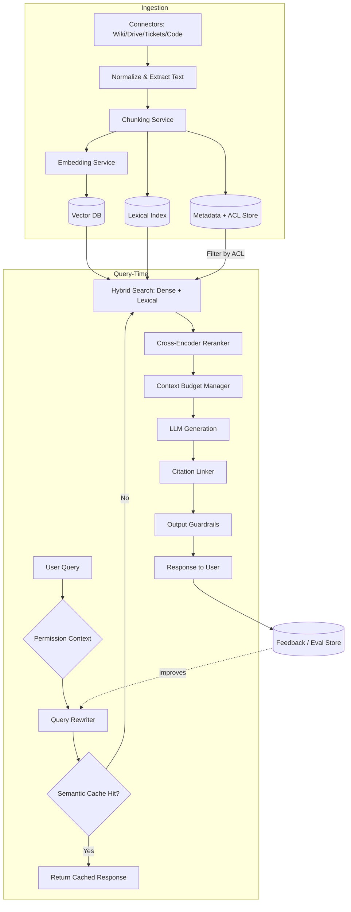
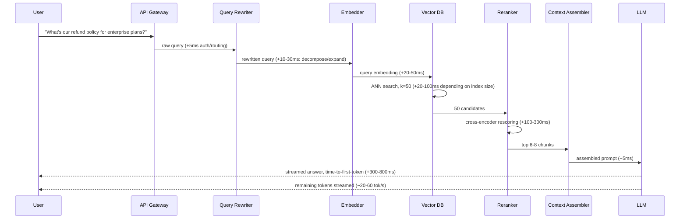
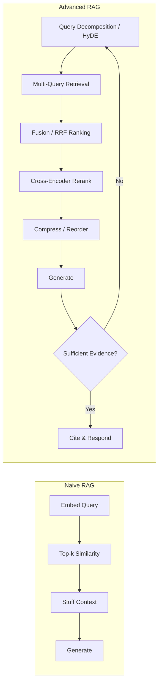
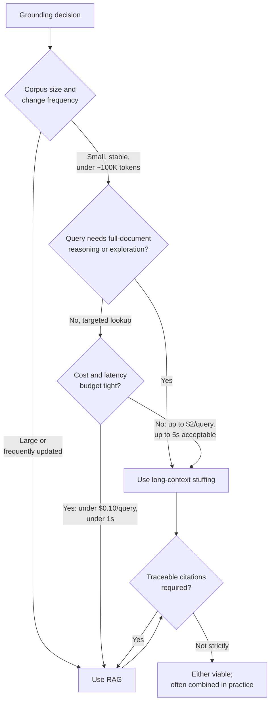
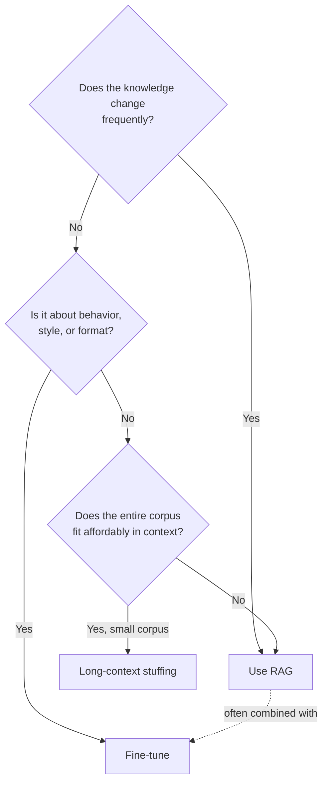
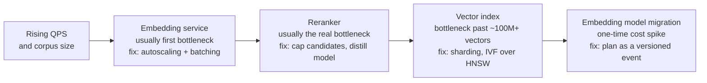
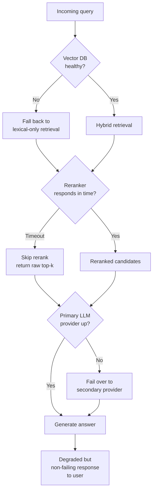
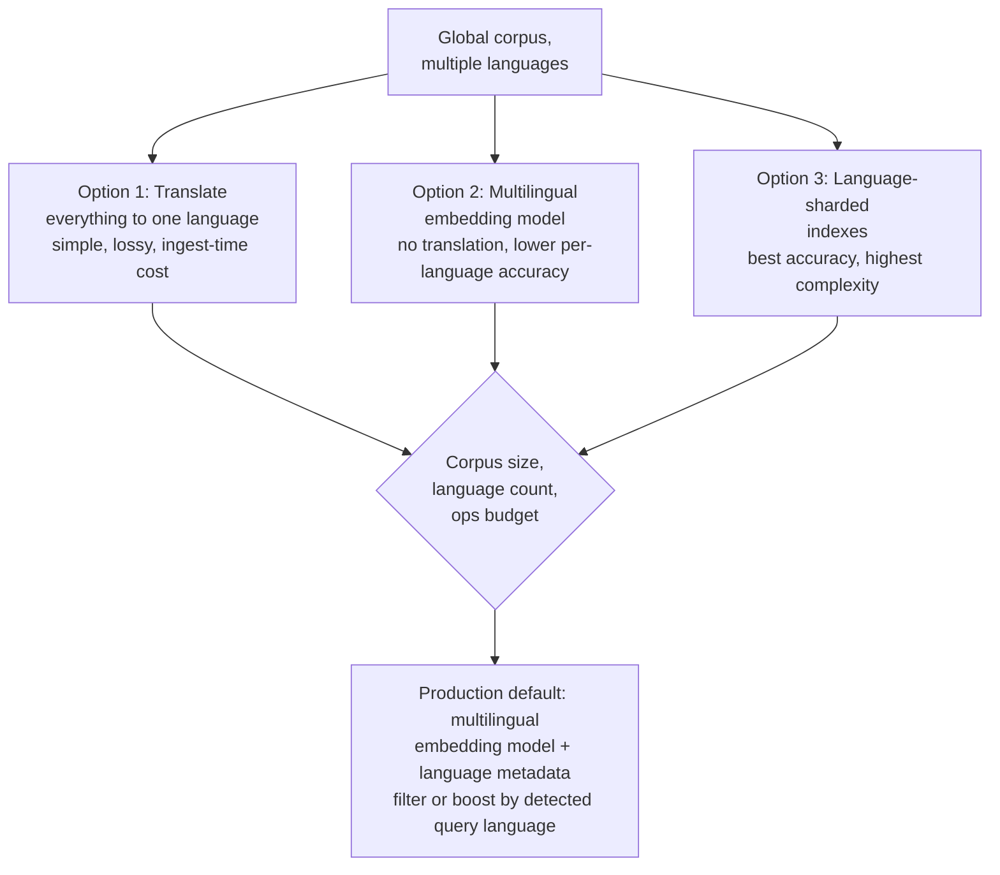

# RAG Architecture

## Overview

Retrieval-Augmented Generation (RAG) combines a search system over an external, updatable knowledge corpus with a generative LLM, so the model answers using retrieved evidence instead of relying solely on what it memorized during training. It is the single most widely deployed AI system design pattern in production today — every enterprise search assistant, support bot, and "chat with your docs" product is some variant of RAG.

## Definition

RAG is an architecture in which, at inference time, a system retrieves the most relevant passages from an external knowledge store and inserts them into the model's context window before generation, so the model's output is conditioned on retrieved evidence rather than purely on parametric (trained-in) knowledge. The knowledge store can be updated independently of the model — that independence is the entire point.

## Problem Statement

A frozen LLM has three structural problems that retrieval fixes and fine-tuning does not:

- **Staleness** — the model's knowledge ends at its training cutoff. A support bot answering questions about a product that shipped last week cannot know about it unless something supplies that knowledge at inference time.
- **Hallucination on long-tail facts** — models are statistically more likely to confabulate plausible-sounding answers for facts that were rare or absent in training data, and they do so with the same confident tone as for well-represented facts.
- **No grounding or citability** — without a traceable source, you cannot tell a user (or an auditor, or a regulator) *why* the model said what it said.

Fine-tuning does not solve any of these well: it is good at teaching style, format, and latent skills, but published evidence and production experience both show it is an unreliable way to inject discrete, retrievable facts — the model can still confabulate facts that were in the fine-tuning set, and updating it requires a full retrain-and-redeploy cycle (hours to days) instead of a re-index (minutes).

## Why This Architecture Exists

Early LLM products tried two things first: bigger context windows (stuff everything in) and fine-tuning (bake the knowledge into the weights). Both broke at production scale — context windows because real knowledge bases run into millions of documents, far past any context budget, and because retrieval-quality research consistently shows model attention degrades over long contexts ("lost in the middle"); fine-tuning because it's slow to iterate, expensive to retrain per knowledge update, and empirically unreliable at fact recall.

RAG, formalized by Lewis et al. (2020), reframed the problem: keep the model frozen — cheap to call, fast to iterate on — and make the **knowledge store** the thing you version, update, and scale. This is the architectural insight that makes RAG durable: it turns "the model doesn't know X" from a retraining problem into a search-relevance problem, and search-relevance problems are something the industry already knows how to engineer.

## Core Concepts

- **Corpus** — the source documents (wikis, tickets, code, PDFs, transcripts) before any processing.
- **Chunking** — splitting documents into retrieval-sized units (see [Chunking Strategies](../05-retrieval-systems/05-chunking-strategies.md)).
- **Embedding** — a dense vector representation of a chunk's meaning, produced by an embedding model.
- **Vector index** — a data structure (typically HNSW or IVF) enabling fast approximate nearest-neighbor search over embeddings.
- **Retriever** — the component that returns the top-k candidate chunks for a query.
- **Reranker** — a more expensive, more accurate model (usually a cross-encoder) that re-scores the top-k candidates before they reach the generator.
- **Augmentation** — assembling the retrieved chunks plus the user query into a single prompt for the generator.
- **Grounding / faithfulness** — the degree to which the generated answer is actually supported by the retrieved evidence, as opposed to invented.

## Ingestion and Query Pipelines

RAG has two distinct pipelines that are easy to conflate but operate on completely different cadences: an **offline ingestion pipeline** (runs on a schedule or on content change) and an **online query pipeline** (runs on every user request, latency-critical).

The detailed view adds the components production systems actually need: permission filtering, query rewriting, caching, and a feedback loop back into evaluation.

## Components

| Component | Responsibility | Does NOT own |
|---|---|---|
| Connectors | Pull source content, detect changes (CDC) | Ranking, generation |
| Chunking service | Split documents into retrieval units | Embedding |
| Embedding service | Turn text into vectors (corpus + query side) | Storage, ranking |
| Vector DB | Store vectors, serve ANN search, filter by metadata | Lexical search, generation |
| Lexical index (BM25) | Exact/keyword match search | Semantic similarity |
| Reranker | Precisely re-score a small candidate set | Initial recall (too expensive to run over the whole corpus) |
| Context assembler | Fit retrieved chunks + history + instructions into budget | Retrieval ranking |
| Generator (LLM) | Produce the answer conditioned on context | Fact verification (needs guardrails for that) |
| Citation linker | Map generated claims back to source chunks | Retrieval |
| Eval/feedback store | Capture labels and production signal for regression testing | Serving traffic |

## A RAG Query End to End

A typical chat-style RAG request budgets **1.5-3 seconds to first token** end-to-end at moderate corpus scale (tens of millions of chunks); the reranking step is usually the single largest controllable cost, which is why many systems make it conditionally skippable for low-stakes queries.

## Naive to Advanced RAG Patterns

The pattern families seen in production, roughly in order of adoption:

1. **Naive RAG** — embed, top-k, stuff, generate. Works as a prototype; breaks on ambiguous queries, multi-fact questions, and noisy corpora.
2. **Query transformation** — rewriting, decomposition into sub-questions, or HyDE (generate a hypothetical answer first, embed *that* for retrieval — it matches the corpus's answer-shaped text better than a short question does).
3. **Multi-query / RAG-fusion** — issue several reformulated queries in parallel and merge results with reciprocal rank fusion, trading extra retrieval calls for better recall on ambiguous questions.
4. **Post-retrieval compression and reordering** — trim irrelevant sentences from chunks and place the most relevant chunk first/last (not buried in the middle) to counter attention decay.
5. **Self-RAG / Corrective RAG** — the model critiques its own retrieved evidence before generating, and re-retrieves if evidence is insufficient or contradictory (this is the on-ramp to [Agentic RAG](../08-agentic-rag/01-agentic-rag-architecture.md)).

## When Long Context Replaces Retrieval

A common assumption in 2022–2023 was that RAG would always be necessary for grounding — the model's context window was too small to "just put everything in." That assumption has weakened. Models with 128K–2M token windows can now ingest entire codebases, full policy manuals, or complete contract sets in a single prompt. The question is no longer *whether* you can — it's *whether you should*.

**Where long-context stuffing wins:**

- **Small, stable corpora where you need complete coverage.** A 50-page legal agreement, a 200-page technical spec, a full codebase under 150K tokens — if the entire corpus fits in the window and the user's queries require understanding *any* part of it (not just a retrievable subset), stuffing the whole document is often simpler and more accurate than retrieval.
- **Multi-hop reasoning across the full corpus.** Retrieval returns the most relevant chunks, but relevance is computed per-query. A question that requires reasoning across three non-adjacent sections ("does clause 12 contradict clause 47 in light of Exhibit B?") requires either very sophisticated retrieval or a complete view of the document. Long context gives the latter trivially.
- **Exploratory or open-ended queries where the "right chunk" isn't predictable upfront.** Retrieval optimises for known-answer lookup. Exploratory analysis benefits from the model having the full picture.

**Where RAG still wins:**

- **Large or frequently-changing corpora.** A 10M-document knowledge base cannot fit in any context window; retrieval is required. For corpora that change daily, RAG's incremental indexing is far cheaper than re-encoding the entire corpus on every query.
- **Cost at scale.** A 128K-token prompt at $15/M tokens costs $1.92 per query — before the model generates a single word of response. At 10K queries/day, that's $19,200/day in input tokens alone. RAG at 5K tokens of retrieved context costs $0.075/query — 25× cheaper for the same product surface.
- **Latency.** Prefilling 128K tokens takes 2–10 seconds on most frontier model APIs. Retrieval + 5K-token context typically completes time-to-first-token in under 1 second.
- **Attribution and citation.** RAG naturally produces citations (the retrieved chunks). Long-context stuffing requires the model to self-identify which parts of the full document it used — a harder, less reliable task.

**The practical decision:**

| Signal | Long-context stuffing | RAG |
|---|---|---|
| Corpus size | Under ~100K tokens and stable | Over 100K tokens or frequently updated |
| Query type | Exploratory, multi-hop, full-coverage | Targeted lookup, known-answer retrieval |
| Cost target | Acceptable up to $0.50–$2.00/query | Must be under $0.10/query at scale |
| Latency target | Under 5s acceptable | Under 1s required |
| Citation required | Not required, or model self-cites reliably | Required with traceable source links |

The emerging best practice: **use long context for the document or session context already assembled in memory; use RAG for grounding against external, large, or dynamic corpora.** These are not competing architectures — they target different grounding problems within the same system.

## Tradeoffs

| Advantages | Disadvantages |
|---|---|
| Knowledge updates in minutes (re-index), not days (retrain) | Generation quality has a hard ceiling set by retrieval quality |
| Citable, auditable answers | Adds a retrieval hop to every request's latency budget |
| Smaller, cheaper, more frequently updatable than a fine-tune | New infrastructure surface: vector DB, embedding pipeline, reranker |
| Reduces (but does not eliminate) hallucination on covered facts | Context window is now contested real estate (see [Context Engineering](../04-context-engineering/01-what-is-context-engineering.md)) |
| Works with a frozen, cheaper-to-serve base model | Retrieved content is untrusted input — new security surface (indirect prompt injection) |

## Scalability

- **Index scale**: HNSW build time and memory grow roughly linearly with vector count; past a few hundred million vectors, sharding by tenant or topic becomes necessary, and IVF-style indexes (lower memory, slightly lower recall) start winning over pure HNSW.
- **QPS scale**: the embedding service is frequently the first bottleneck — it is its own small inference workload and needs independent autoscaling, ideally with request batching.
- **The reranker is usually the real bottleneck**, since a cross-encoder runs a full forward pass per candidate. Production systems cap reranker input at 20-100 candidates and use a smaller distilled reranker rather than the largest available cross-encoder.
- **Re-embedding cost**: changing embedding models means re-embedding the entire corpus. At 1B chunks and ~$0.02-0.13 per 1M tokens for a typical embedding API, a full re-embed of a 1B-chunk, ~200-token-average corpus is on the order of $4,000-$26,000 in API cost alone, before compute/time — which is why embedding-model migrations are planned, versioned events, not casual swaps.

## Reliability

| Failure | Degradation strategy |
|---|---|
| Vector DB outage | Fall back to lexical-only (BM25) retrieval rather than failing the request |
| Embedding service outage | Queue + retry on ingestion side; on query side, fall back to cached/lexical results |
| Stale index | Serve with a visible "as of" freshness indicator rather than silently serving outdated facts |
| Reranker timeout | Skip reranking, return raw top-k — degraded relevance beats no answer |
| LLM provider outage | Fall back to a secondary model/provider (see [Reliability Engineering](../23-staff-level-architecture/09-reliability-engineering.md)) |

Useful SLO framing: track **answerable rate** (fraction of queries where retrieval returned at least one chunk above a relevance threshold) separately from **answer quality**, and track **freshness lag** (time between a source document changing and that change being reflected in the index) as a first-class SLO — for fast-moving corpora (ticket systems, chat logs) this might be minutes; for slower ones (policy docs) hours is fine.

## Security

RAG's defining security risk is that **retrieved content is attacker-reachable text that flows directly into the model's context** — anyone who can write to a source system indexed by the RAG pipeline (a wiki page, a support ticket, a shared doc) can potentially plant an indirect prompt injection that the model later "reads" as instructions. See [AI Security Architecture](../21-ai-security/01-ai-security-architecture.md) for the general threat model; RAG-specific mitigations include treating retrieved chunks as data, not instructions (clear delimiters, no chunk content is ever treated as a system-level directive), output-side checks before any tool call triggered by a RAG-grounded response, and content provenance tracking so a compromised source can be identified and purged.

The second major risk is **permission leakage**: retrieval that ignores document-level ACLs will happily surface a document the requesting user cannot see. In any multi-tenant or enterprise deployment, permission filtering must happen *at retrieval time* (filter the candidate set by the requester's access before — or as part of — the ANN search), not as a post-hoc check on the final answer. See [SSO, Permissions & RAG ACL Enforcement](../22-enterprise-ai/04-sso-permissions-and-rag-acl-enforcement.md).

## Cost Optimization

- **Semantic caching**: cache full responses for near-duplicate queries (cosine similarity above a threshold against recent queries) — in FAQ-heavy products this alone can cut LLM generation calls by 30-60%.
- **Tiered retrieval**: run a cheap lexical pre-filter before expensive dense retrieval on huge corpora, rather than running ANN search over everything.
- **Right-sized embeddings**: a 384-1024 dimension open embedding model is frequently good enough; paying for the largest available embedding model is rarely where quality is actually won.
- **Context trimming**: every token sent to the generator is billed; tuning top-k down from "8 just in case" to the number an eval shows is actually needed is often a 20-40% generation-cost reduction with no quality loss.
- **Batch ingestion**: embed documents in large batches during ingestion rather than one-at-a-time, since most embedding APIs and self-hosted models have much better $/token at batch sizes of hundreds-to-thousands.

Illustrative cost shape for a mid-size deployment (10M chunks, 500K queries/month, k=8 retrieved chunks of ~300 tokens each sent to a mid-tier model): embedding ingestion is a one-time/incremental cost in the tens of dollars per million chunks; vector storage runs roughly $0.02-0.05 per million vectors per month on managed services; the dominant recurring cost by far is generation tokens — at ~2,500 input tokens (context + chunks) and ~300 output tokens per query, 500K queries/month is on the order of 1.4B input tokens/month, which is the line item worth optimizing first.

## Monitoring

- **Retrieval recall@k** against a maintained, labeled eval set — the single most important leading indicator.
- **Per-stage latency** (embedding, retrieval, rerank, generation) at p50/p95/p99 — isolate which stage regresses.
- **No-relevant-doc rate** — fraction of queries where nothing in the candidate set clears a relevance bar; a rising trend usually means corpus gaps or query drift.
- **Faithfulness/groundedness score**, sampled in production via LLM-as-judge (see [LLM-as-Judge](../19-evaluation/03-llm-as-judge.md)).
- **Index freshness lag** and **ingestion pipeline failure rate** — RAG quality silently rots if ingestion breaks and nobody notices.
- **Cost per query**, broken down by retrieval vs generation.

## Production Best Practices

- Default to **hybrid search** (lexical + dense), not dense-only — dense embeddings are weak on exact IDs, codes, and rare terms that BM25 handles natively.
- Rerank whenever the latency budget allows it; the recall-vs-precision gap between raw top-k and reranked top-k is consistently the highest-leverage quality lever in RAG.
- **Version the index**, not just the code — a bad re-index should be a one-command rollback, the same way a bad deploy is.
- Build a **labeled eval set before shipping**, not after users complain; without one, you cannot tell whether a chunking or reranker change helped or hurt.
- Make low-confidence cases visible in the product (hedge or decline to answer) instead of always answering with the same confident tone regardless of evidence quality.
- Treat the ingestion pipeline as a **data engineering system**: idempotent, retryable, monitored, with its own on-call story — not an afterthought script.

## Real World Examples

- **Perplexity** is the clearest consumer-facing example of RAG as the entire product: every answer is generated from a live web retrieval pass with inline citations, making "groundedness" the core UX promise rather than a backend detail.
- **Glean** applies the enterprise variant: retrieval fans out across many connectors (wikis, tickets, code, chat) with permission-aware filtering enforced at query time, since the hardest engineering problem in enterprise RAG is never showing a document the asking user cannot see.
- **Google** and **Anthropic** both expose "grounding"/citations-style APIs (e.g., search-grounded generation, citation-linked responses) that follow the same retrieve-then-generate-with-attribution pattern described in this chapter, packaged as a platform primitive rather than a single product.
- **Cursor** applies the same architecture to a different corpus: the retrieval target is a codebase, combining embedding-based semantic search over code with lexical/symbol-aware signals, because code retrieval has exact-match requirements (identifiers, function names) that pure dense retrieval handles poorly on its own.

## Cross-Lingual Retrieval

Most RAG literature assumes a monolingual corpus and single-language queries. Production enterprise systems are rarely this clean: a global company's knowledge base spans English, German, Japanese, Spanish, and Portuguese documents, and users query in their native language.

**The three design options:**

1. **Translate everything to one language at ingestion time.** Translate all documents to English before chunking and embedding. Pros: single embedding model, simple retrieval. Cons: translation cost and latency at ingest, translation quality loss (especially for domain-specific terminology), original-language metadata lost. Acceptable for small-to-medium corpora where translation quality is high.

2. **Use a multilingual embedding model.** Models like BGE-M3, multilingual-E5, and LaBSE produce embeddings where semantically equivalent content in different languages is close in embedding space. A query in German can retrieve relevant documents written in English without explicit translation. Pros: no translation cost, language agnostic at query time. Cons: multilingual models typically have lower performance on any single language than a monolingual model specialising in that language; vocabulary fertility for non-Latin-script languages can inflate token counts and embedding cost.

3. **Language-sharded indexes.** Maintain a separate index per language, each with a language-specialised embedding model. Route each query to its language's index. Pros: best per-language retrieval quality. Cons: highest operational complexity (N indexes, N embedding models, query routing layer).

**Hybrid approach (most common in production):** Use a multilingual embedding model for all languages, but maintain a language metadata field per document and apply a language filter (or a mild boost) to prefer documents in the user's detected language when multiple equally-relevant documents exist across languages. This gives 90% of the benefit of sharded indexes at much lower operational cost.

**Query language detection** is a prerequisite for any language-aware retrieval. `langdetect`, `fasttext` language ID models, and cloud APIs (Google, AWS Comprehend) are common choices; the query is typically short enough that model-based detection is more reliable than character set heuristics.

## Tools and Ecosystem

| Category | Tools | When to prefer |
|---|---|---|
| **Vector DB — managed** | Pinecone, Weaviate Cloud, Zilliz Cloud (managed Milvus) | Fastest to production — no infrastructure to run; Pinecone: simplest API; Weaviate Cloud: hybrid search built-in; Zilliz: scales to billions of vectors |
| **Vector DB — self-hosted** | Qdrant, Milvus, Weaviate, Chroma | Data residency requirements; cost at scale; Qdrant: Rust-based, low memory overhead; Milvus: battle-tested at billion-vector scale; Chroma: easiest dev setup |
| **Vector DB — in-database** | pgvector (PostgreSQL), SQLite-vec, OpenSearch | When data already lives in Postgres — avoids a separate service; pgvector + HNSW index is production-viable up to ~5M vectors per table |
| **Embedding models — managed** | OpenAI `text-embedding-3-small/large`, Cohere `embed-v3`, Voyage AI | text-embedding-3-small: best price/performance for English; Cohere embed-v3: strong multilingual; Voyage: top-ranked on MTEB for many domains |
| **Embedding models — self-hosted** | BGE-M3 (BAAI), E5-mistral, GTE-Qwen, Jina embeddings | BGE-M3: multilingual + multi-granularity, best open model; self-host when data cannot leave your infrastructure |
| **Hybrid / lexical search** | Elasticsearch, OpenSearch, BM25s (Python) | Production hybrid search: dense retrieval for semantics + BM25 for exact match; Elasticsearch/OpenSearch ship both; BM25s for lightweight self-contained setup |
| **Reranking** | Cohere Rerank, Jina Reranker, BGE-reranker, Voyage Rerank | Cross-encoder reranking consistently improves precision; Cohere/Voyage: managed API; BGE-reranker: self-hosted open model |
| **RAG frameworks / orchestration** | LlamaIndex, LangChain, Haystack, DSPy | LlamaIndex: richest RAG primitives; LangChain: broadest ecosystem; Haystack: production pipeline design; DSPy: optimise retrieval pipeline automatically |
| **RAG evaluation** | RAGAS, DeepEval, Braintrust, Arize Phoenix, TruLens | RAGAS: faithfulness + answer relevance + context precision; DeepEval: modular metrics, CI integration; TruLens: tracing + eval combined |

## Interview Questions

### Beginner

**Q: What is RAG, and why does it reduce hallucination?**
RAG retrieves relevant passages from an external knowledge store and includes them in the model's prompt before generation. It reduces (not eliminates) hallucination because the model is now conditioning its answer on concrete provided text rather than purely on patterns memorized during training — it has something to "read from" instead of having to "recall" a fact it may never have seen clearly.

**Q: What's the practical difference between RAG and fine-tuning?**
Fine-tuning changes the model's weights and is suited to teaching style, format, or a skill; RAG changes what the model is shown at inference time and is suited to giving the model fresh, specific, citable facts. Fine-tuning requires retraining to update; RAG requires re-indexing, which is far faster and cheaper.

### Intermediate

**Q: How would you choose a chunk size for a RAG pipeline?**
Start from the query patterns: short fact-lookup queries favor smaller, tightly-scoped chunks (better precision, less noise per chunk); synthesis-style queries favor larger chunks or parent-document retrieval (a small "child" chunk used for matching, a larger "parent" chunk delivered to the generator) so the model has full surrounding context. In practice, this is tuned empirically against a labeled eval set, not chosen from a rule of thumb alone.

**Q: Walk through what happens, end-to-end, when a user asks a RAG system a question.**
(See the [A RAG Query End to End](#a-rag-query-end-to-end) sequence diagram above.) The key points to hit: query rewriting/expansion, embedding the query, hybrid retrieval against vector and lexical indexes, reranking the candidate set, assembling a context-budgeted prompt, generation, and citation linking — with a latency budget assigned to each hop.

### Senior

**Q: How do you evaluate a RAG system before and after shipping a change?**
Maintain a labeled eval set of (query, expected relevant chunks, expected answer characteristics) tuples. Track retrieval metrics (recall@k, MRR) and generation metrics (faithfulness, answer relevance) offline before shipping; in production, sample traffic for LLM-as-judge scoring and correlate with implicit signals (thumbs up/down, follow-up question rate) to detect drift between your offline eval and real usage.

**Q: How do you enforce permissions in a multi-tenant RAG system?**
Permission checks must happen at retrieval time, filtering the candidate set by the requester's access (via metadata filtering in the vector DB, or a pre-filtered index per permission boundary), not as a post-generation check on the final answer — by the time the model has read a document, a logging/caching leak is already possible even if the final answer is suppressed.

### Staff

**Q: Your RAG system's answer quality has degraded over three months with no code changes — how do you diagnose it?**
Check, in order: (1) corpus drift — has the underlying content changed faster than ingestion freshness keeps up, or has the *mix* of user queries shifted away from what the corpus covers well; (2) embedding/reranker model deprecation or silent provider-side updates; (3) index health — fragmentation, growth past the regime your ANN parameters were tuned for; (4) eval/production mismatch — your offline eval set may no longer represent current query distribution. This is exactly the [Drift & Quality Monitoring](../20-observability/04-drift-and-quality-monitoring.md) problem applied to RAG specifically.

**Q: Design a RAG system requiring sub-300ms p99 retrieval latency over a 500M-document corpus. What changes from the default architecture?**
At that scale and latency bar: shard the vector index (by tenant, topic, or recency) so no single query touches the full 500M vectors; favor IVF-style indexes or tuned HNSW with lower-recall/higher-speed parameters over the most-accurate-but-slowest configuration; consider skipping or radically shrinking the reranking step (it's usually the single biggest latency cost) or running it asynchronously with a fast-path raw-retrieval response that gets refined; push embedding computation onto dedicated low-latency infrastructure with aggressive batching only where it doesn't blow the latency budget; and cache aggressively given that real query distributions are usually heavy-tailed.

## Google-Level Follow-Ups

- "Your retrieval recall@10 is 92% in offline eval, but production users are complaining about irrelevant answers — what's going on?" — probes whether the candidate understands eval/production mismatch: stale eval sets, distribution shift in real queries, or recall@k measuring something different from what actually drives perceived quality (e.g., recall measures *a* relevant doc was retrieved, not that the *most* relevant one was ranked first).
- "How would this design change if the corpus were 100x larger?" — probes sharding strategy, the recall/latency tradeoff at scale, and whether the candidate over-indexes on "just add more compute."
- "The product now requires near-real-time freshness — seconds, not minutes — on a corpus with 10,000 writes/sec. What changes?" — probes streaming ingestion architecture, incremental index updates vs. full rebuilds, and serving a blended view of a fast-but-approximate fresh layer plus a slower, fully-indexed layer.
- "How do you prevent this system from becoming a data exfiltration vector?" — probes whether the candidate treats retrieved content as untrusted input and has a concrete answer beyond "we'll add a filter."

## Common Mistakes

- **Dense-only retrieval** with no lexical fallback — silently fails on exact-match queries (IDs, codes, rare proper nouns) that embeddings represent poorly.
- **Skipping reranking** because recall@k "looks fine" in eval — recall measures whether a relevant chunk is *somewhere* in top-k, not whether the *most* relevant chunk is what the model actually attends to first.
- **Fixed-size chunking with no structural awareness** — splitting mid-table or mid-code-block destroys the chunk's meaning regardless of how good the embedding model is.
- **Shipping without an eval set** — every subsequent change becomes a guess instead of a measurement.
- **Ignoring ACL enforcement at retrieval time** — a compliance and security incident waiting to happen in any multi-user deployment.
- **Treating retrieved content as trusted** — opens the system to indirect prompt injection from anything in the corpus an attacker can write to.
- **No freshness monitoring** — the ingestion pipeline breaks quietly and answers go stale with no alert firing.
- **Over-stuffing context "just in case"** — drives up cost and triggers lost-in-the-middle quality degradation instead of improving answers.

## Key Takeaways

- RAG's core value is separating *what the model knows* (frozen weights) from *what it can look up* (a live, independently updatable index).
- Retrieval quality is a hard ceiling on generation quality — no amount of prompting fixes bad retrieval.
- Hybrid search plus reranking is the production default, not an optional upgrade over "simple" dense-only RAG.
- Retrieved content is untrusted input from a security standpoint, and must be permission-filtered at retrieval time in any multi-tenant system.
- Build a labeled eval set before shipping changes, not after users notice regressions.
- RAG and fine-tuning are complementary, not competing — most mature production systems use both for different jobs (see [Fine-Tuning vs RAG](../23-staff-level-architecture/04-fine-tuning-vs-rag.md)).
- The ingestion pipeline is a data-engineering system in its own right and needs the same operational rigor as any other production pipeline.
