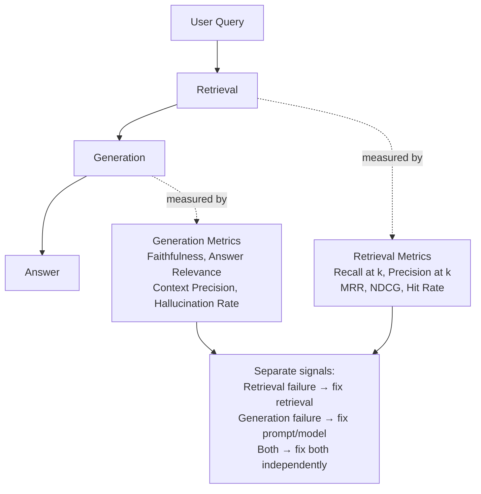
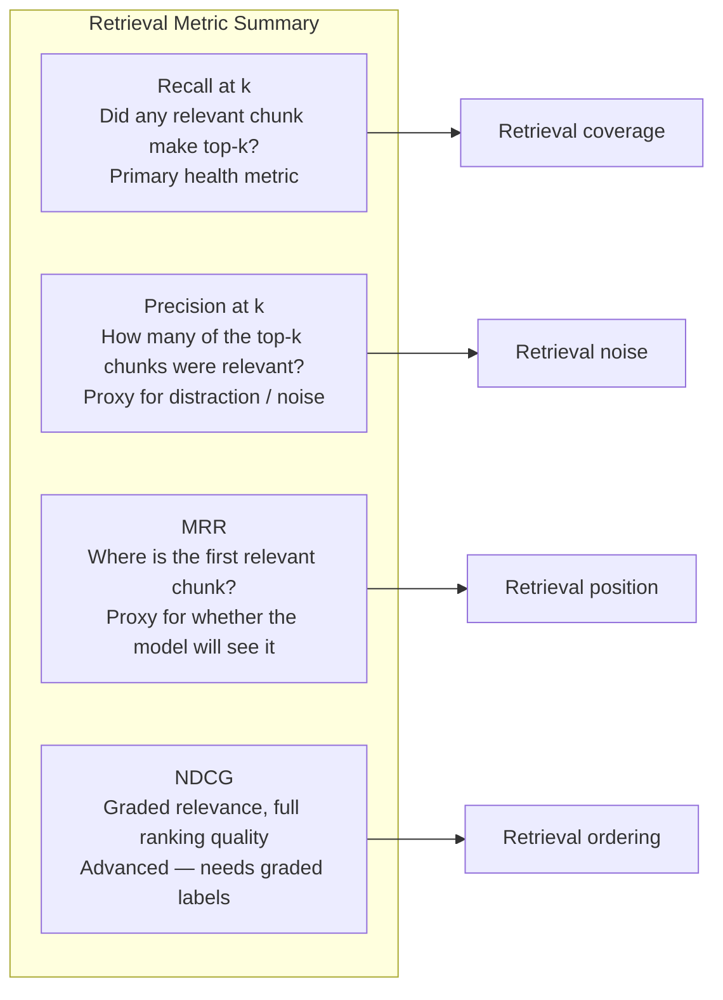
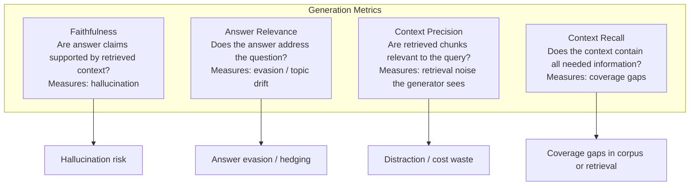
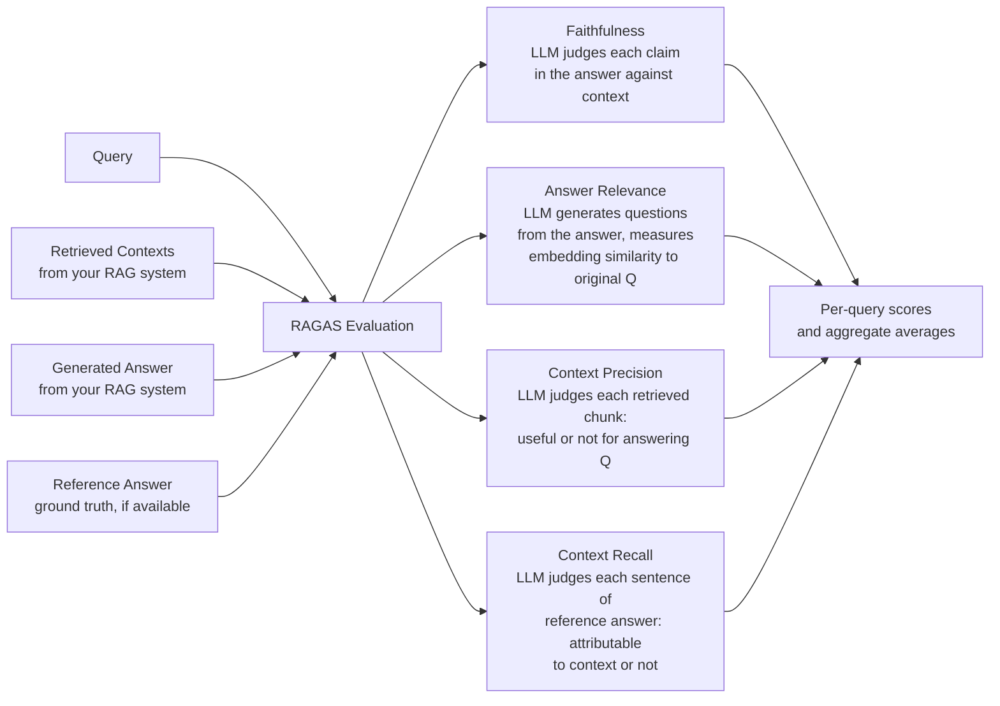
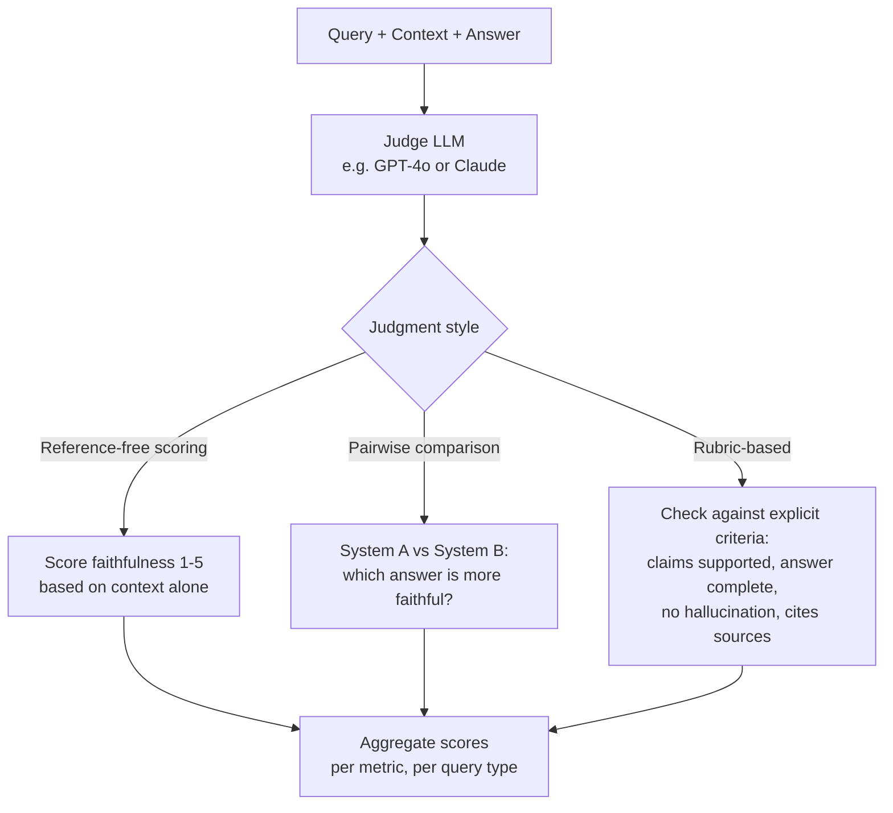
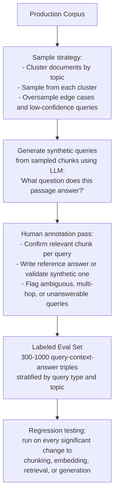
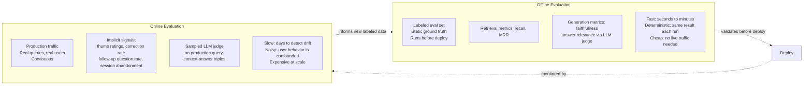
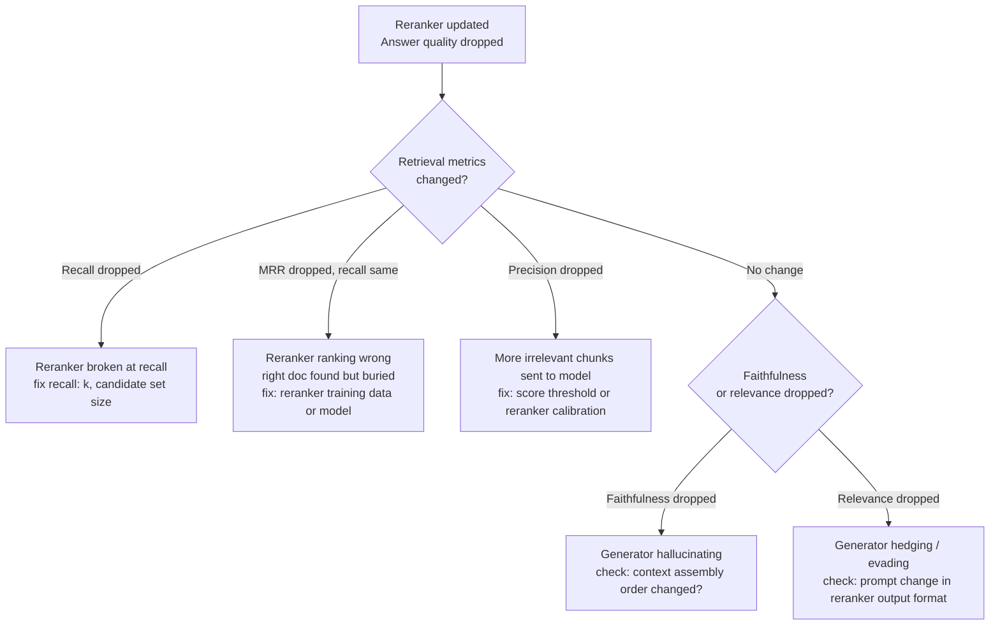

# RAG Evaluation Metrics

## The Eval Problem

"The demo looks great" is not an evaluation strategy. A RAG system can look good during a product walk-through while silently failing on 30% of production queries — because demos use hand-picked questions and nobody checks whether the retrieved chunks actually contained the answer, or whether the model's confident-sounding response was grounded in them.

RAG evaluation is harder than single-model evaluation because there are two places the system can fail independently: **retrieval** (did the right content come back?) and **generation** (did the model use that content faithfully?). A system can have excellent retrieval and poor generation, poor retrieval that the model somehow compensates for, or poor both — and each failure has a different fix. Blending them into one "quality score" makes the system unmaintainable.

The discipline of RAG evaluation is, first and foremost, the discipline of **decomposing the signal** so you know which component broke.



## Retrieval Metrics

Retrieval evaluation asks: **given a query, did the system return the chunks that contain the answer?** This requires a labeled dataset — a set of query → relevant chunk(s) pairs, established by human annotation or verified ground truth.

### Recall@k

The fraction of queries where at least one relevant chunk appears within the top-k returned results. This is the most important retrieval metric: if recall@k is low, generation quality has a hard ceiling regardless of how good the model is.

```
Recall@k = (queries where a relevant chunk is in top-k) / (total queries)
```

Typical production targets: recall@5 of 85–95% for well-maintained systems. Below 80% is a red flag that either the embedding model is a poor fit for the domain, chunking is breaking answers across chunk boundaries, or the corpus has coverage gaps.

### Precision@k

Of the k chunks returned, what fraction were actually relevant? High recall@10 with low precision@10 means the system retrieves the right answer but buries it among irrelevant chunks — the model then has to attend to the needle across a haystack of distractors.

```
Precision@k = (relevant chunks in top-k) / k
```

Precision and recall are in tension: increasing k improves recall but hurts precision. This is why reranking exists — it recovers precision after a high-recall first-stage retrieval pass.

### MRR — Mean Reciprocal Rank

MRR measures where the **first** relevant chunk appears in the ranked list. A system that puts the most relevant result at rank 1 every time has MRR = 1.0; one that puts it at rank 5 consistently has MRR = 0.2.

```
MRR = average of (1 / rank_of_first_relevant_result) across all queries
```

MRR matters most when the generator only reliably uses the top 1–2 chunks despite being given more — which is common (lost-in-the-middle). A high recall@10 with low MRR signals that the relevant chunk is being found but ranked too low for the model to reliably use it.

### NDCG — Normalized Discounted Cumulative Gain

NDCG accounts for **multiple relevant results at different relevance grades** (e.g., "perfectly relevant" scores 3, "partially relevant" scores 1, "irrelevant" scores 0). It rewards systems that put higher-grade results earlier in the ranking.

NDCG is most useful when documents have graded relevance (not binary) and you care about the full top-k ordering, not just whether something useful appears somewhere in it. For most RAG eval sets with binary relevance labels, MRR is simpler and equally informative.



### Hit Rate

Binary simplification of recall@k: did any relevant chunk appear in the top-k, yes or no? Hit rate at k=5 is identical to recall@k=5 when there is exactly one relevant chunk per query. It is the fastest metric to compute and useful as a coarse dashboard signal.

## Generation Metrics

Generation evaluation asks: given the retrieved context, **did the model produce a correct, grounded, relevant answer?** These metrics measure what the model does with the context, independently of whether the context was right.

### Faithfulness

The fraction of claims in the generated answer that are **supported by the retrieved context**. A faithfulness score of 1.0 means every statement in the answer can be traced to a specific chunk; 0.6 means 40% of statements were invented by the model.

```
Faithfulness = (supported claims in answer) / (total claims in answer)
```

Faithfulness is the primary anti-hallucination metric. It requires identifying the individual claims in the answer (LLM-based extraction) and then verifying each against the retrieved chunks (LLM-based entailment or manual check).

### Answer Relevance

Does the answer actually address the question? A model that retreats to a hedge ("Here is some information that might help...") every time it's unsure can score high on faithfulness (it only states what's in the context) but low on answer relevance (it didn't answer the question).

Answer relevance is typically scored by an LLM judge given the query and answer, or measured by embedding similarity between the generated answer and the original question (a generated answer that is on-topic will be semantically close to the question in embedding space).

### Context Precision

Of the retrieved chunks that were actually sent to the generator, what fraction were relevant to the query? Context precision measures **retrieval noise as seen by the generator** — how much of what the model was given was actually useful for answering.

Low context precision means the model is reading a lot of irrelevant context, which increases cost, latency, and the risk of lost-in-the-middle quality degradation (see [Context Rot & Failure Modes](../04-context-engineering/05-context-rot-and-failure-modes.md)).

### Context Recall

Does the retrieved context contain all the information needed to answer the question? A context can be precise (everything retrieved was relevant) but incomplete (the one fact needed to answer the question was missing). Context recall catches this.

```
Context recall ≈ (claims in the reference answer attributable to the context) / (total claims in reference answer)
```

This requires a reference answer (the ground truth) to compare against, making it a more expensive metric to compute than faithfulness.



## The RAGAS Framework

RAGAS (Retrieval Augmented Generation Assessment) is the most widely adopted open-source framework for automated RAG evaluation. It operationalizes the four metrics above into a single Python library that uses an LLM judge to score each dimension without requiring labeled golden answers for faithfulness and answer relevance.



**RAGAS limitations to know:**

- The LLM judge used inside RAGAS introduces its own error rate — RAGAS scores on GPT-4 differ from scores on GPT-3.5 on the same test set.
- Faithfulness scoring requires the LLM to correctly decompose the answer into atomic claims and then judge entailment — both steps can fail, especially on long or complex answers.
- RAGAS does not measure user satisfaction, task completion, or whether the answer was actually correct for the user's goal — it measures structural properties of the retrieval-generation interaction, which correlates with quality but is not a substitute for end-task accuracy.
- Context precision as computed by RAGAS uses an LLM to judge relevance per-chunk, which is expensive at scale. A cheaper proxy is embedding similarity between each chunk and the query.

## LLM-as-Judge for RAG

An LLM judge evaluates RAG output without requiring a manually labeled reference answer for every query. This is the only practical approach to comprehensive production-scale evaluation.



**Reliability techniques for LLM judges:**

- **Reference answer consistency check**: on a held-out sample, compare the judge's scores against human ground-truth scores; the Pearson correlation tells you how much to trust the automated scores.
- **Prompt stability testing**: run the same judge prompt on the same examples across multiple judge calls; high variance on identical inputs means the judge is noisy and scores should be averaged across N runs.
- **Multi-judge agreement**: run two different judge models on the same examples and report inter-judge Cohen's kappa; agreement below 0.6 suggests the scoring rubric needs to be more specific.
- **Rubric specificity**: vague criteria ("is the answer good?") produce unreliable scores; specific criteria ("does the answer contain only claims directly stated in the provided context, with no inferences or additions?") produce reproducible ones.

## Building a Production Eval Set

An eval set is the most valuable artifact in a RAG system. Without it, every change to chunking, reranking, or the model is a guess. Building it should happen **before shipping**, not after users report problems.



**Minimum viable eval set size**: 300 queries across diverse topics and query types is enough to detect meaningful regressions (a >3% change in recall@5) with reasonable statistical confidence. Larger sets (1,000+) are needed for reliable regression detection on metric shifts under 2%.

**Stratification matters more than size**: 300 queries evenly distributed across topics, difficulty levels, and query types (factual lookup, multi-hop synthesis, edge cases) is far more useful than 1,000 queries sampled uniformly from the most common query patterns. Rare but important query patterns that fail will be invisible in a uniform sample.

**Synthetic query generation** (using an LLM to write questions for each chunk) is a fast way to bootstrap the eval set — but synthetic queries reflect the corpus language, not real user language. Supplement with real production queries (anonymized and labeled) as soon as the system has live traffic.

## Online vs Offline Evaluation



Offline evaluation catches regressions before users see them. Online evaluation catches distribution shift — cases where the production query distribution has drifted away from the eval set, so offline performance looks fine but production quality has degraded. Both are necessary; neither alone is sufficient.

**Production sampling strategy**: not every query needs to be evaluated online. Sample 1–5% of production traffic for LLM judge scoring (chosen to balance cost and coverage), stratified by query type and weighted toward queries the system flagged as low-confidence. Log everything but evaluate selectively.

## Tradeoffs

| Metric / Approach | Strength | Weakness |
|---|---|---|
| Recall@k | Simple, fast, no LLM needed | Doesn't tell you if the right chunk is ranked first |
| MRR | Measures rank of first relevant hit | Ignores multiple relevant results |
| Faithfulness (LLM judge) | No reference answer needed | Judge LLM adds its own error rate |
| Context precision (LLM judge) | Directly measures retrieval noise | Expensive; judge may disagree with humans on borderline chunks |
| RAGAS composite | Single framework, good defaults | Scores on judge model A ≠ scores on judge model B; opaque when a score changes |
| Human annotation | Gold standard | Expensive, slow, subjective on ambiguous cases |
| Implicit online signals | Free, real distribution | Highly confounded — low rating could mean wrong answer or slow response or bad UX |

## Monitoring

- **Recall@k and MRR on a rolling test-query sample** — the primary retrieval health signal; run nightly against a fixed labeled set so regressions are caught before they compound.
- **Faithfulness score distribution** — track the p10 (worst 10%) in addition to the average; a rising tail of low-faithfulness answers signals a class of queries breaking before the average moves.
- **No-context-rate** — fraction of queries where the retriever returned nothing above a relevance threshold; a rising rate means corpus coverage is degrading or query distribution has shifted.
- **Eval-production query distribution similarity** — embed both the eval set queries and live production queries weekly, compare the centroid distance; a large drift is an early warning that the eval set needs refreshing.
- **LLM judge cost** — at scale, per-query LLM evaluation gets expensive; track judge-model API spend separately from the main generation spend.

## Interview Questions

### Beginner

**Q: Why isn't "the answer looks correct" a sufficient RAG evaluation?**
Because it conflates two different failure modes. The system might return a correct-looking answer by hallucinating from the model's parametric memory while the retrieved chunks were completely irrelevant — in which case the answer is correct today but will be wrong the moment the facts change, and you have no idea the retrieval is broken. Conversely, the answer might be wrong because retrieval missed the one relevant document, even though the generation step was perfectly faithful to bad evidence. You need separate measurements to know what to fix.

**Q: What is faithfulness, and how is it different from answer correctness?**
Faithfulness measures whether the model's answer is grounded in the retrieved context — every claim traces back to a provided chunk. Answer correctness measures whether the claims are actually true. A model can be perfectly faithful (every claim it makes is in the context) while being factually wrong (the retrieved context was outdated or incorrect). Faithfulness is the within-context sanity check; correctness requires external ground truth.

### Intermediate

**Q: Your RAG system's answer quality dropped after a reranker update — how do you use metrics to isolate whether the reranker broke retrieval precision or the generator degraded?**
Check retrieval and generation metrics separately. Re-run recall@k and MRR on the labeled eval set before and after the change — if recall@k didn't change but MRR dropped, the reranker moved the relevant chunk down the list without failing to retrieve it at all. If context precision dropped (more irrelevant chunks in the top-k), the reranker is letting noise through to the generator. If retrieval metrics are unchanged but faithfulness dropped, the generator itself is the issue (perhaps the reranker changed the prompt structure that the model relied on). The decomposed signal tells you exactly which layer to fix.



**Q: How do you build an eval set for a domain where annotators can't reliably label relevance?**
Use a two-phase approach. First, use the LLM to generate synthetic question-answer pairs from chunks (a paragraph → "what question does this answer?"), which gives you retrieval relevance labels for free (the source chunk is the ground truth). Then run a human annotation pass focused not on labeling retrieval relevance (the LLM did that) but on checking the synthetic questions for naturalness and edge case coverage, and adding a sample of real production queries. For domains where even human annotators struggle with relevance (highly technical, legal, medical), use domain experts for a small calibration set and use LLM-judged scores against that calibration to validate the judge's reliability before deploying it at scale.

### Senior

**Q: RAGAS faithfulness scores are declining across the board with no obvious cause — how do you investigate?**
First, check whether the judge model changed or was updated — RAGAS faithfulness is judge-LLM-dependent, and a provider-side model update changes the scoring distribution without any change to your RAG system. Next, segment the failing queries: are faithfulness scores declining uniformly, or concentrated in specific query types, topics, or answer lengths? Long, multi-paragraph answers have lower faithfulness than short ones because more claims give more opportunities for hallucination — rising average answer length can drive falling faithfulness. Finally, pull 20–30 low-faithfulness examples and read them: is the model actually hallucinating, or is the judge misjudging entailment (a common failure in technical domains where the judge misses implicit domain-specific connections)? The fix differs entirely based on the root cause.

**Q: Design an evaluation framework for a RAG system that answers medical questions, where ground-truth labeling is expensive and errors have real consequences.**
Build a tiered system. The first tier is automated: RAGAS faithfulness and context precision on a synthetic eval set, run continuously with every change. The second tier is expert-labeled: a small set of 200–300 queries labeled by a medical professional, covering common query types plus high-stakes edge cases (drug interactions, dosage questions, contraindications). Run this set monthly or after any significant corpus or model change; this set is the ground truth against which the automated judge is calibrated. The third tier is online: sample 1% of production queries, route them to a clinician for spot-review with a SLA of 48 hours, and track the discrepancy between automated scores and clinician scores as a signal that the automated system is drifting. For any query where the automated faithfulness score falls below a threshold, suppress the direct answer and show a "consult a medical professional" fallback — never show a low-confidence medical answer directly.

### Staff

**Q: Your eval set was built 18 months ago. Answer quality is fine in offline eval but users are increasingly unhappy. What's the likely cause and how do you fix it?**
The classic eval/production distribution gap: the query distribution in production has shifted — users are asking different types of questions than 18 months ago — but the eval set still reflects the old distribution, so the system looks fine on metrics while failing on the new patterns. Diagnose by embedding all queries from both the eval set and a recent production sample and measuring distribution overlap; if the centroids are far apart or coverage gaps are visible, the eval set is stale. Fix: mine the recent production queries for examples of new patterns the eval set doesn't cover, label the hardest 20% manually, discard eval set queries from patterns that are now rare in production, and set a policy to refresh the eval set quarterly. The eval set is a living artifact, not a one-time build.

## Google-Level Follow-Ups

- "Faithfulness is 0.9 on your eval set. A product manager wants to ship. What additional information do you need before you agree?" — probes for: what query types drive the 0.1 failure rate, whether the failures are concentrated in high-stakes domains, and whether the eval set's faithfulness distribution is calibrated against human ground truth.
- "How do you detect when your LLM judge has become unreliable without manually re-reviewing thousands of examples?" — probes for calibration sets: keep a small set of examples with human-labeled scores; re-run the judge periodically; alert if judge-human agreement correlation drops below a threshold.
- "Your eval set takes 4 hours to run on the LLM judge. CI is blocked waiting for it. What do you do?" — probes for a tiered eval strategy: run the fast subset (recall@k using a labeled retrieval set, no LLM judge) on every PR in seconds; run the full LLM-judge suite nightly or on staging.

## Common Mistakes

- **Evaluating retrieval and generation together as a single quality score** — makes it impossible to know which layer to fix when quality drops.
- **Building the eval set only from questions you know the system handles well** — produces an artificially high baseline and misses the failure modes that matter.
- **Trusting RAGAS scores without validating the judge against human labels** — different judge models score differently; an uncalibrated judge is no better than a guess.
- **Ignoring context precision** — systems that retrieve relevant content buried in noise will show high recall but produce worse answers at lower cost than systems with targeted precision.
- **Never refreshing the eval set** — query distributions shift over months; an 18-month-old eval set may be measuring a problem the system no longer has while missing the new ones.
- **Using overall average faithfulness as the only signal** — the p10 tail (worst 10% of queries) causes user complaints, not the average; monitor the distribution, not just the mean.

## Key Takeaways

- Separate retrieval metrics from generation metrics — the fix for a retrieval failure (embedding model, chunking, reranking) is entirely different from the fix for a generation failure (prompt, model, context ordering).
- Recall@k is the single most important retrieval metric; faithfulness is the single most important generation metric.
- RAGAS is a useful starting point, not the final word — validate its LLM judge against human labels before trusting the scores.
- The eval set is the most important artifact in the system; build it before shipping, refresh it quarterly, and treat staleness as a reliability risk.
- Online and offline evaluation are not substitutes — offline catches regressions before users see them; online catches distribution drift the eval set doesn't cover.
- LLM-as-judge is the only practical approach at production scale, but requires calibration against human ground truth to be trustworthy.
