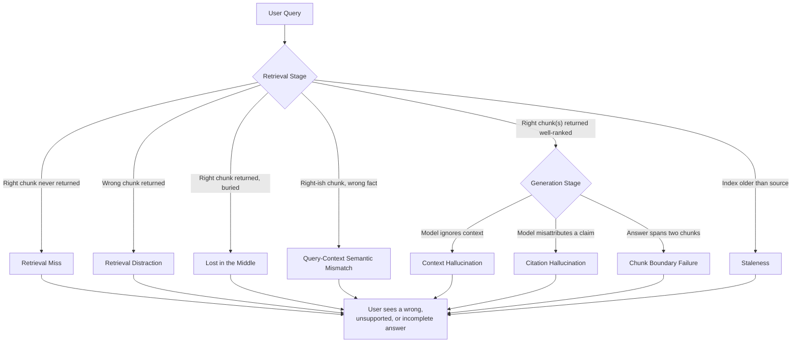
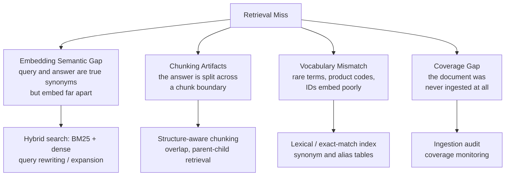
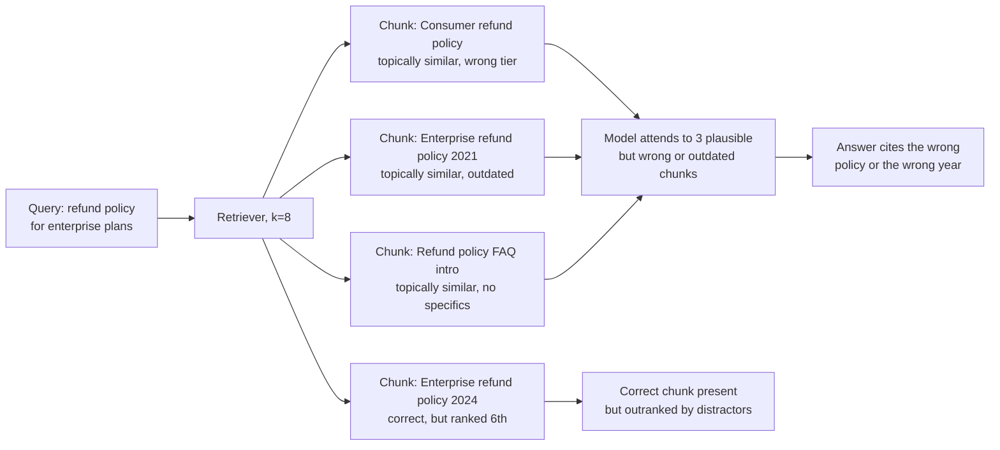
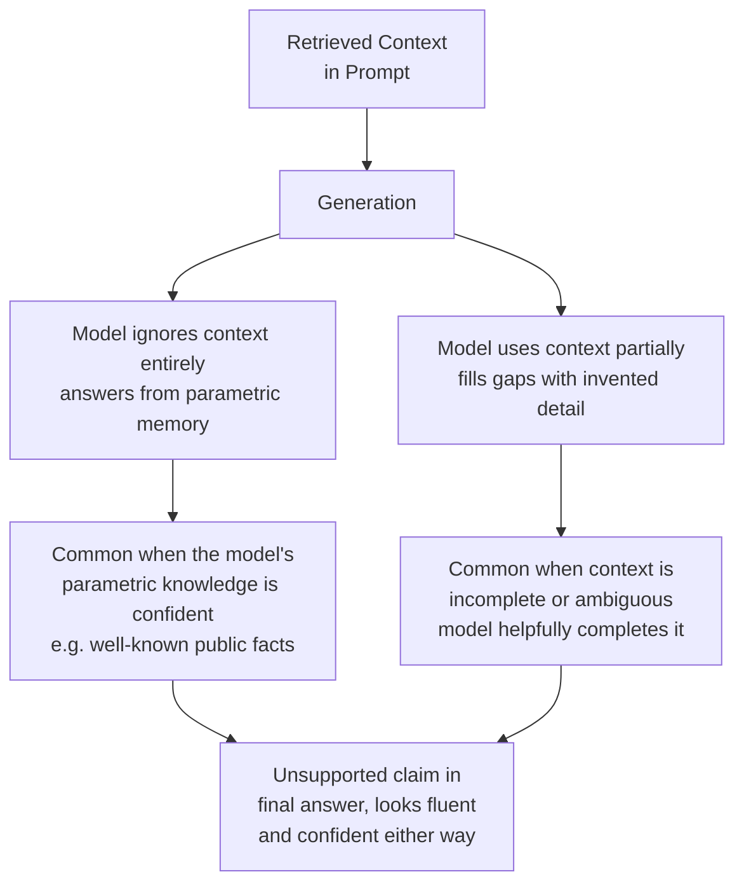
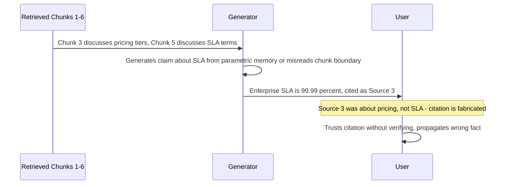
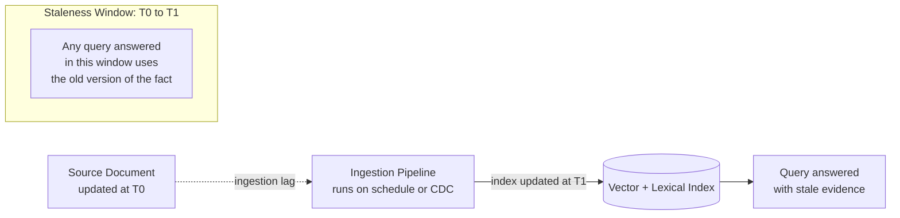
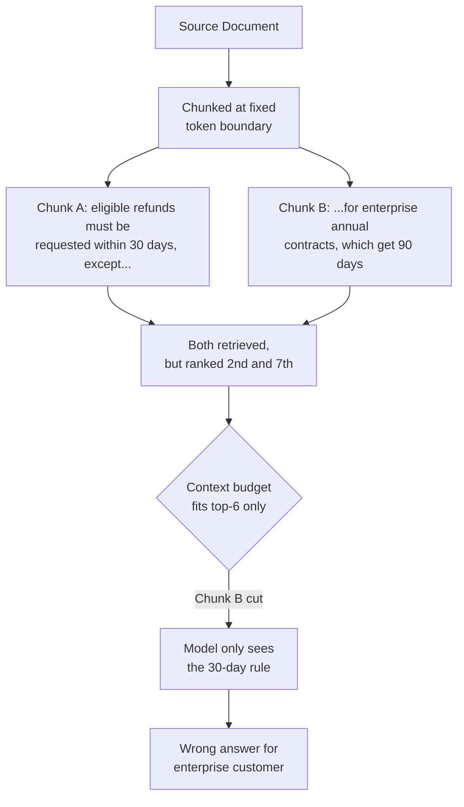
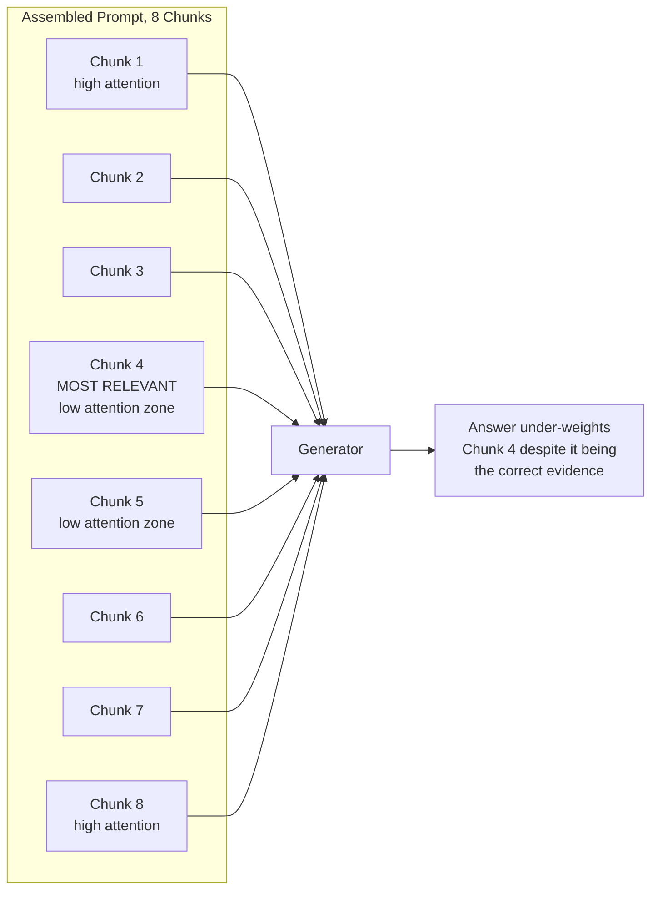
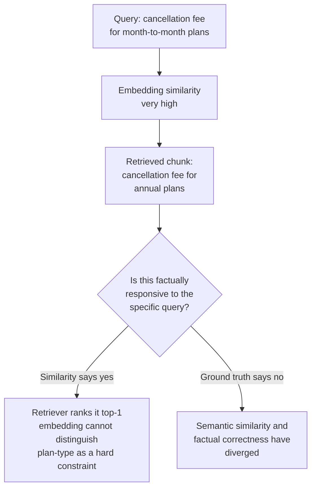
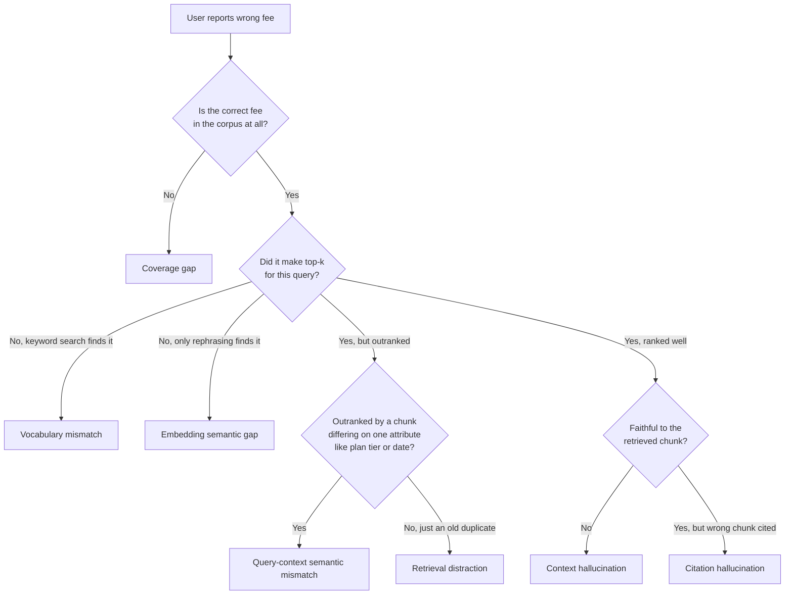

# RAG Failure Modes

## Why RAG Fails Differently From a Plain LLM Call

A plain LLM call fails in one place: generation. RAG fails in at least four places — retrieval can miss the right content, retrieval can surface the wrong content, generation can ignore good content, and generation can misattribute good content — and each of these looks identical to a user staring at a wrong answer. The entire discipline of operating RAG in production is learning to tell these failure modes apart, because the fix for one does nothing for the others.

Every failure mode below follows the same shape: **cause → detection signal → mitigation**. Treat detection signal as the more important column in practice — a mitigation you can't tell is working is just a hope.

## Retrieval Miss — The Relevant Document Never Reaches Top-k

This is the most fundamental RAG failure: the chunk that contains the answer exists in the corpus, was ingested, and is retrievable in principle — but the retriever's top-k for this specific query doesn't include it. Everything downstream (reranking, generation, citation) is irrelevant if the right evidence never arrives at the door.

Retrieval miss has four distinct causes that require different fixes, which is why "improve recall" is not an actionable ticket on its own.

### Embedding semantic gap

Dense embeddings capture topical similarity, not logical equivalence. "How do I cancel my subscription?" and "Steps to terminate a recurring plan" are the same question to a human but can sit at a meaningful cosine distance in embedding space if the embedding model wasn't trained on domain-adjacent phrasing. This gets worse the more the query is phrased as a question and the corpus is phrased as declarative documentation — the surface forms simply don't look alike, even though the meaning does.

- **Detection signal**: recall@k on a labeled eval set is below target (typically under 80-85% at k=5) specifically on queries phrased differently from the corpus's own language; a query rewritten closer to corpus phrasing suddenly retrieves the chunk that the original phrasing missed.
- **Mitigation**: hybrid search combining dense and lexical retrieval (see [Hybrid Search and Reranking](../05-retrieval-systems/04-hybrid-search-and-reranking.md)); query rewriting to bridge phrasing (see [Chapter 04](04-advanced-rag-patterns.md)); fine-tuning or selecting an embedding model evaluated against your own domain rather than generic MTEB leaderboard rank.

### Chunking artifacts

If a chunk boundary falls in the middle of the sentence or paragraph that actually answers the question, neither the chunk before nor after contains a complete, retrievable unit of meaning — the embedding of each half is an embedding of half an answer, which matches the query worse than a full answer would.

- **Detection signal**: the answer text exists in the corpus (confirmed by manual search), a chunk containing part of it is in the top-k, but its similarity score is markedly lower than chunks that contain the same information intact; increasing chunk overlap or size measurably fixes retrieval on the affected queries.
- **Mitigation**: structure-aware chunking that respects sentence, paragraph, and section boundaries instead of fixed token windows (see [Chunking Strategies](../05-retrieval-systems/05-chunking-strategies.md)); chunk overlap of 10-20%; parent-child retrieval (small chunk for matching, larger parent for context — see [Chapter 04](04-advanced-rag-patterns.md#parent-child-chunk-retrieval)).

### Vocabulary mismatch on rare terms, codes, and IDs

Dense embedding models are trained on natural language and are systematically weak on exact tokens that carry no distributional meaning of their own: SKU numbers, error codes, ticket IDs, part numbers, acronyms specific to one company. Two different SKUs can embed almost identically because the model has no signal that "SKU-88213" and "SKU-88214" refer to different products — they're both just "a SKU-looking string" to the embedding space.

- **Detection signal**: recall failures cluster specifically around queries containing exact identifiers, codes, or rare proper nouns, while natural-language queries on the same corpus retrieve fine; a plain substring/keyword search finds the answer instantly when vector search does not.
- **Mitigation**: this is the textbook case for lexical (BM25) retrieval running alongside dense retrieval, not instead of it — exact tokens are exactly what inverted indexes are built for. Maintain synonym/alias tables for known ID formats.

### Coverage gap — the document was never ingested

Sometimes there is no retrieval bug at all: the source document containing the answer was never pulled into the corpus in the first place, because a connector doesn't cover that source system, an ingestion job failed silently, or the document was added to the source of truth after the last successful ingestion run.

- **Detection signal**: a manual search of the vector DB or lexical index for content known to exist in the source system returns zero hits; ingestion pipeline logs show failed or skipped documents; a periodic "known documents present" audit fails.
- **Mitigation**: ingestion pipeline health monitoring as a first-class system (see [Reliability](01-rag-architecture.md#reliability) in Chapter 01); a coverage audit that periodically diffs the source system's document count/hashes against what's actually indexed; alerting on ingestion job failure, not just on ingestion job absence of errors.

## Retrieval Distraction — Wrong Chunks Retrieved, Right Chunk Crowded Out

Distraction is a different failure from a miss: the retriever *does* return content, and that content is topically related to the query — it just isn't the content that actually answers it. The model then either gets pulled toward the distractor (misled) or has to actively discount plausible-looking but wrong evidence (a much harder generation task than "answer from what you're given").

This is especially common in corpora with near-duplicate documents (multiple versions of a policy, region-specific variants of the same FAQ, old and new pricing pages) where several chunks are all topically about "the refund policy" but only one is the current, applicable one.

- **Detection signal**: high recall@k (the right chunk is somewhere in top-k) combined with low precision@k or low MRR — the correct chunk exists in the candidate set but is outnumbered or outranked by near-duplicates; production answers show a pattern of citing outdated or wrong-tier documents even though the current one is in the corpus.
- **Mitigation**: cross-encoder reranking, which scores query-chunk pairs jointly rather than by independent embedding similarity and is much better at distinguishing "topically similar" from "actually responsive"; deduplication and versioning at ingestion time (retire or clearly flag superseded documents instead of leaving five years of policy revisions equally retrievable); metadata filtering (date, region, plan tier) applied before or during retrieval, not left for the model to sort out from prose.

## Context Hallucination — The Model Generates Beyond What Was Retrieved

Context hallucination happens after retrieval succeeds: the right chunks are in the prompt, but the model's answer contains claims that are not supported by them. This happens two ways, and they need different fixes.

- **Cause (ignoring context)**: the model has strong, confident parametric priors about the topic (e.g., a well-known public API, a famous historical event) and the retrieved context is thin or slightly off-topic, so the model defaults to what it already "knows" — which may be outdated or simply not what the specific corpus says.
- **Cause (filling gaps)**: the retrieved context answers *most* of the question but leaves a specific sub-detail unaddressed (a number, a date, an edge case), and the model, trained to be helpful and fluent, generates a plausible completion rather than saying "the context doesn't specify this."
- **Detection signal**: faithfulness score (see [RAG Evaluation Metrics](02-rag-evaluation-metrics.md#faithfulness)) below target on a sampled or LLM-judged basis; specific claims in the answer that cannot be matched to any span in the retrieved chunks under an entailment check; a rising gap between context recall (the context has the info) and faithfulness (the answer is grounded in it).
- **Mitigation**: explicit instruction-following pressure in the prompt ("answer only using the provided context; if the context does not contain the answer, say so") — necessary but not sufficient on its own; faithfulness-focused fine-tuning or few-shot examples that demonstrate declining to answer; output-side faithfulness checking (a second LLM pass or NLI model verifying each claim against the context) before the answer is returned for high-stakes domains; lowering generation temperature, which measurably reduces (but does not eliminate) confident fabrication.

## Citation Hallucination — Attributing a Claim to the Wrong Chunk

A more specific and more insidious failure: the answer's content might even be correct, but the citation attached to it points to a chunk that does not actually say that. This is dangerous precisely because citations are meant to be the trust mechanism — a user who sees "[Source 3]" next to a claim reasonably assumes source 3 was checked and says that, when in practice the model may have generated the citation as a plausible-looking artifact of its output format rather than as a genuine attribution.

- **Cause**: the model is asked to produce a citation for every claim as a formatting requirement, and when it isn't certain which chunk actually supports a claim, it picks a plausible-sounding one (often just "the nearest chunk index" or "a chunk that's topically adjacent") rather than reliably tracing the claim back to its source; this is more likely with many retrieved chunks (the model loses track of which chunk said what) and with claims synthesized across multiple chunks.
- **Detection signal**: automated citation-checking — for each cited chunk, run an entailment/NLI check confirming the chunk actually supports the associated claim; a citation-accuracy metric distinct from faithfulness (faithfulness asks "is the claim true given *all* context"; citation accuracy asks "does *this specific* cited chunk support it"); spot-check audits where a human clicks through citations and finds mismatches.
- **Mitigation**: structural citation linking rather than model-generated citation numbers — have the system programmatically attach citations based on which chunk's text the answer's claim extraction step matched, instead of trusting the model to self-report the source; constrain generation to quote or closely paraphrase spans with explicit source tags baked into the prompt structure; penalize or flag answers where the claim extraction step cannot find a supporting span in the cited chunk.

## Staleness — Index Lag vs. Source of Truth

Staleness is a systems failure, not a modeling failure: the answer is generated faithfully from what's in the index, but what's in the index no longer matches reality, because the source document changed after the last successful ingestion.

- **Cause**: batch ingestion schedules (e.g., nightly) inherently create a staleness window between a source edit and its reflection in the index; change-data-capture (CDC) pipelines can silently fail or fall behind under load; documents deleted or superseded at the source may not be correspondingly removed from the index (stale content persisting is often worse than stale content simply being missing).
- **Detection signal**: freshness lag metric — measured time between a source document's last-modified timestamp and its last successful re-index timestamp — exceeding the freshness SLO for that content class; user-reported "this is out of date" feedback correlated with a specific document; a scheduled reconciliation job that diffs source content hashes against indexed content hashes and finds drift.
- **Mitigation**: define freshness SLOs per content class — fast-moving content (ticket systems, chat logs, pricing) might need a minutes-level SLO; slow-moving content (policy PDFs, architecture docs) can tolerate hours; **surface freshness to the user** ("as of [date]") rather than presenting stale answers with the same unqualified confidence as fresh ones; alert on ingestion pipeline failure as a first-class incident, not a background job that fails silently; for the highest-freshness-need content, move from batch to event-driven (CDC/webhook-triggered) incremental indexing.

## Chunk Boundary Failure — The Answer Spans Two Chunks

Related to but distinct from the chunking-artifact retrieval miss above: here, retrieval actually succeeds at returning *both* halves of the split answer in the top-k — but they are still two separate chunks in the context window, and the model may fail to synthesize them into one coherent answer, especially if they aren't adjacent in the final assembled prompt or if reranking scored them differently and only one made the final cut sent to the generator.

- **Cause**: a single logical answer (a rule with an exception, a multi-step procedure, a table row referencing a header several rows up) is mechanically split by fixed-size chunking; even when both halves are retrieved, they may not both survive the context budget cut, and even when both survive, the model may not reliably connect a rule in one chunk with its exception in another if they are not presented as contiguous text.
- **Detection signal**: eval failures where the correct answer requires combining information present in two different retrieved chunks; manual inspection shows the "exception" or "continuation" half of an answer consistently ranked lower and often cut by top-k or context-budget truncation.
- **Mitigation**: chunk overlap so boundary-adjacent context isn't hard-cut; parent-document retrieval so the generator receives the full section around a matched child chunk, not just the matched fragment (see [Chapter 04](04-advanced-rag-patterns.md#parent-child-chunk-retrieval)); structure-aware chunking that keeps a rule and its exceptions, or a table and its header, inside the same chunk; sorting/adjacency-preserving context assembly so chunks from the same source document are presented together rather than interleaved by score.

## Lost-in-the-Middle Inside the Retrieved Set

Even when the single most relevant chunk is successfully retrieved and included in the prompt, its *position* within the assembled context affects whether the model actually uses it. This is the RAG-specific instance of the general lost-in-the-middle attention pattern (see [Context Rot & Failure Modes](../04-context-engineering/05-context-rot-and-failure-modes.md)): models attend most reliably to content near the start and end of a long context, and least reliably to content buried in the middle — regardless of how relevant that middle content actually is.

- **Cause**: this is a property of transformer attention over long contexts, not a bug in any one retrieval or ranking component — it will happen even with perfect retrieval and perfect ranking if the relevant chunk simply lands in the middle position of the assembled prompt.
- **Detection signal**: MRR is high (the relevant chunk is ranked well by the retriever) but faithfulness/answer-relevance is still inconsistent; A/B testing the same retrieved set with the relevant chunk artificially moved to the front vs. the middle shows a measurable quality difference — this is the clearest possible proof the failure is positional, not retrieval-based.
- **Mitigation**: reorder assembled context so the highest-ranked chunk(s) are placed at the start and/or end of the prompt rather than left in scored order in the middle; keep the total number of chunks sent to the generator as small as the task allows (fewer chunks means less "middle" to get lost in); contextual compression to shrink each chunk to only its relevant sentences (see [Chapter 04](04-advanced-rag-patterns.md#contextual-compression)), which shortens the whole prompt and reduces the positional risk.

## Query-Context Semantic Mismatch — Topically Adjacent, Factually Wrong

The subtlest failure mode: the retrieved chunk is not randomly irrelevant (as in distraction) — it is about the *exact right topic*, phrased in a way that scores highly similar to the query, but it answers a factually different version of the question. A query about "the cancellation fee for month-to-month plans" retrieving a chunk about "the cancellation fee for annual plans" is a near-perfect topical match and a completely wrong factual answer.

- **Cause**: dense embeddings represent overall topical/semantic proximity, not the specific discriminating facts (plan type, date range, jurisdiction, product version) that determine whether a chunk is *actually* responsive versus merely *about the same subject*; the more a corpus contains many near-identical variants differing only in one key attribute, the worse this gets.
- **Detection signal**: eval failures where the top-ranked chunk is topically perfect but the discriminating attribute (tier, date, region, version) doesn't match the query's implied constraint; production complaints of "close but wrong" answers rather than "irrelevant" answers.
- **Mitigation**: metadata filtering on the discriminating attribute *before* semantic ranking (filter to month-to-month plan documents first, then rank by similarity within that filtered set) rather than relying on embeddings to encode the distinction; query rewriting/decomposition to make the discriminating constraint explicit in the retrieval query; structured/faceted retrieval where key attributes are stored as filterable metadata fields, not left embedded only in prose.

## Full Failure Taxonomy

| Failure Mode | Root Cause | Detection Signal | Mitigation Strategy |
|---|---|---|---|
| Retrieval miss — embedding gap | Query and answer phrasing diverge in embedding space | Low recall@k specifically on differently-phrased queries | Hybrid search, query rewriting, domain-evaluated embedding model |
| Retrieval miss — chunking artifact | Answer split across a chunk boundary | Partial-answer chunks retrieved with weak scores; overlap fixes it | Structure-aware chunking, overlap, parent-child retrieval |
| Retrieval miss — vocabulary mismatch | Rare terms, IDs, codes embed poorly | Failures cluster on exact-identifier queries; keyword search finds it instantly | Lexical (BM25) retrieval, alias/synonym tables |
| Retrieval miss — coverage gap | Document never ingested | Zero hits on manual index search for known content | Ingestion monitoring, coverage audits, alerting on pipeline failure |
| Retrieval distraction | Near-duplicate or outdated chunks outrank the correct one | High recall@k, low precision@k/MRR; wrong-version citations in production | Cross-encoder reranking, deduplication, versioning, metadata filtering |
| Context hallucination | Model ignores context or fills gaps from parametric memory | Low faithfulness score; claims with no supporting span in context | Explicit grounding instructions, faithfulness fine-tuning, output-side entailment checks |
| Citation hallucination | Model attributes a claim to a chunk that doesn't support it | Citation-accuracy check fails independent of faithfulness | Structural/programmatic citation linking, not model self-reported citations |
| Staleness | Index lag behind source-of-truth changes | Freshness lag metric exceeds SLO; reconciliation hash diff | Freshness SLOs per content class, visible "as of" dating, event-driven ingestion |
| Chunk boundary failure | Rule and exception (or multi-part answer) split across chunks | Eval failures needing synthesis across two retrieved chunks | Overlap, parent-document retrieval, adjacency-preserving assembly |
| Lost-in-the-middle in retrieved set | Transformer attention decays over context position, not relevance | High MRR but inconsistent faithfulness; position A/B test shows the effect | Reorder context (best chunks first/last), minimize chunk count, contextual compression |
| Query-context semantic mismatch | Embeddings miss the one discriminating fact (tier, date, version) | Top-ranked chunk is topical but fails a specific factual constraint | Metadata filtering before ranking, query decomposition, faceted retrieval |

## Interview Questions

### Beginner

**Q: What's the difference between a retrieval miss and retrieval distraction?**
A retrieval miss means the chunk that actually contains the answer never makes it into the top-k candidates at all — the retriever failed to find it. Retrieval distraction means the retriever *did* return content, and even returned the correct chunk in some cases, but wrong or outdated chunks that are topically similar also made it into the candidate set and either outrank the correct one or mislead the generator. A miss is a recall problem; distraction is a precision/ranking problem, and they need different fixes.

**Q: Why can a RAG system with perfect retrieval still hallucinate?**
Because generation is a separate stage from retrieval. Even with the exactly right chunk in the prompt, the model can ignore it and answer from its own parametric memory, or it can use most of the chunk but invent the one specific detail (a number, a date) the chunk didn't cover. Retrieval quality is necessary but not sufficient for a grounded answer — the generation step has to actually be faithful to what it was given.

### Intermediate

**Q: A user reports that your support bot gave the wrong cancellation fee. How do you figure out which failure mode this is?**
Start by manually searching the corpus and index for the correct fee: if it isn't there at all, that's a coverage gap. If it's there but wasn't in the top-k the system actually retrieved for that query, check whether a keyword search finds it easily (vocabulary mismatch) or only a rephrased query finds it (embedding semantic gap). If the correct chunk *was* retrieved, check whether a topically similar but wrong-tier or wrong-date chunk was ranked above it (distraction or query-context semantic mismatch) — the giveaway for semantic mismatch specifically is that the wrong chunk is a near-perfect topical match but differs on exactly one discriminating attribute like plan tier. If the correct chunk was retrieved and ranked well, the bug is downstream: check faithfulness (did the model actually use it) and citation accuracy (did it correctly attribute the number to that chunk).

**Q: Why does increasing chunk overlap help with both retrieval misses and chunk boundary failures?**
Overlap means the text right at a chunk boundary appears fully in at least one chunk instead of being split across two. For a retrieval miss caused by a chunking artifact, overlap increases the chance that some chunk contains the complete answer intact, so its embedding matches the query well. For a chunk boundary failure, overlap increases the chance that a rule and its exception (or a fact and the qualifier a few sentences later) land in the same chunk, so the generator doesn't need to synthesize across two separately-scored, possibly separately-truncated chunks.

### Senior

**Q: Your recall@5 is 93% in offline eval, but users still frequently get wrong-tier or wrong-date answers. What's the disconnect?**
Recall@5 only measures whether *a* relevant chunk made top-5 — it says nothing about whether the *most factually applicable* chunk was ranked first, or whether a topically-similar-but-wrong-variant chunk was ranked above it. This is exactly the query-context semantic mismatch and retrieval distraction failure modes: the eval set's relevance labels may be too coarse (marking any chunk "about refund policy" as relevant) to catch that the system frequently returns the *wrong version* of a topically-correct chunk. The fix is in the eval set, not just the system: relevance labels need to be attribute-aware (does this chunk apply to *this specific* tier/date/region), and precision/MRR need to be tracked alongside recall, since recall alone can look excellent while the system is still systematically wrong on discriminating details.

**Q: How would you distinguish context hallucination from citation hallucination in a monitoring dashboard, and why does the distinction matter operationally?**
Track them as separate metrics computed from separate checks. Faithfulness (context hallucination) asks: is every claim in the answer supported by *some* part of the full retrieved context? Citation accuracy asks: does the *specific chunk cited* for each claim actually support that claim, independent of whether the claim is supported elsewhere in the context. A system can have high faithfulness and low citation accuracy — the model is grounded but sloppy about which of the six chunks a fact came from — which is a UX/trust problem (users click a citation and it doesn't say what's claimed) rather than a correctness problem. Conflating them into one "hallucination rate" hides which one to fix: citation accuracy is fixed by structural/programmatic citation linking, faithfulness is fixed by grounding instructions, fine-tuning, or output-side verification — different engineering investments entirely.

### Staff

**Q: You're running a RAG system at a scale where manual review of every failure is impossible. Design a system to automatically classify production failures into the taxonomy above, using only signals available at request time (no ground truth).**
Build a per-request signal pipeline rather than one aggregate score: compute retrieval confidence (top-1 similarity score and score gap to top-2 — a flat score distribution across candidates is itself a distraction/mismatch signal), compute an LLM-judged faithfulness pass on the final answer against the full retrieved context, compute a separate citation-accuracy check per cited chunk, and log freshness metadata (source last-modified vs. index last-updated) for every chunk used. Combine these into a decision tree at inference time: low top-1 similarity with no close competitor suggests a genuine miss (escalate to fallback/hedge); high similarity but a flat score distribution across several near-duplicates suggests distraction (flag for dedup/versioning review); high faithfulness but failed citation check isolates a citation hallucination; low faithfulness despite high retrieval confidence isolates context hallucination; a large freshness gap on the top chunk flags staleness independent of everything else. Log the classification, not just a pass/fail, so weekly aggregation shows *which* failure mode is trending, and route each class to the team that owns its fix — ingestion, chunking, ranking, or prompting — rather than a single generic "RAG quality" backlog.

## Google-Level Follow-Ups

- "Recall@k, faithfulness, and citation accuracy are all within target, yet a specific enterprise customer keeps getting wrong answers. What do you check next?" — probes whether the candidate considers per-tenant corpus differences, ACL/permission-filtered retrieval scoping out the correct document for that tenant, or a metadata/versioning gap specific to that customer's documents rather than assuming the aggregate metrics tell the whole story.
- "How would lost-in-the-middle change your answer to 'should we increase k from 5 to 15'?" — probes whether the candidate understands that more retrieved chunks can *reduce* effective answer quality even while recall improves, because a larger context has a larger and more damaging middle zone, and whether they'd propose reordering/compression rather than blindly increasing k.
- "A staleness incident caused the system to confidently state a price that changed three days ago. Design the SLO and alerting so this class of incident is caught before a customer reports it, not after." — probes for freshness-lag-as-SLO thinking, reconciliation-diff jobs, and whether the candidate defaults to visible "as of" dating as a defense-in-depth measure rather than assuming ingestion will never lag.

## Common Mistakes

- **Treating "hallucination" as one failure mode** — context hallucination and citation hallucination have different causes and different fixes; conflating them wastes engineering effort on the wrong lever.
- **Optimizing recall@k in isolation** — a system can hit excellent recall while still routinely serving the wrong-tier, wrong-date, or outdated variant of a topically correct chunk; precision, MRR, and attribute-aware relevance labels catch what recall alone cannot.
- **Assuming more retrieved chunks is strictly better** — beyond a certain k, added chunks increase the lost-in-the-middle risk and dilute the model's attention on the one chunk that actually matters.
- **No reconciliation between source system and index** — coverage gaps and staleness are invisible until a user notices, unless something actively diffs source content against indexed content on a schedule.
- **Trusting model-generated citations at face value** — citations are an easy thing for a model to fabricate convincingly; without a structural or programmatic check, a citation number is not evidence of anything.
- **Fixed-size chunking with no overlap on structured or rule-heavy content** — policy documents, legal text, and tabular data are exactly the content most likely to have an answer split by an arbitrary token-count boundary.

## Key Takeaways

- RAG fails in at least four independent places — retrieval miss, retrieval distraction, generation hallucination, and citation hallucination — and each needs its own detection signal and fix; there is no single "RAG quality" lever.
- Recall@k alone is an incomplete health signal; it says a relevant chunk was *somewhere* in top-k, not that the *right version* of it was ranked first or used faithfully.
- Chunking decisions (size, overlap, structure-awareness) are a root cause of multiple failure modes at once — boundary artifacts, retrieval misses, and boundary-spanning answers all trace back to how the corpus was split.
- Lost-in-the-middle is a positional failure, not a retrieval failure — it can happen with perfect retrieval and perfect ranking, and the fix is context reordering and compression, not "retrieve better."
- Staleness is an operational/systems failure, not a model failure — it needs freshness SLOs, reconciliation jobs, and visible "as of" dating, not a smarter prompt.
- Citations need to be verified structurally, not trusted as self-reported by the model — a fabricated-but-plausible citation is one of the most trust-damaging failures because it looks like exactly the thing meant to build trust.

---

*Part of [RAG](index.md) in the [AI System Design Notes](../index.md). Tracked in [BACKLOG.md](https://github.com/GyanendraChaubey/AI-System-Design-Notes/blob/main/BACKLOG.md).*
