# Advanced RAG Patterns

## From Failure Modes to Fixes

[Chapter 03](03-rag-failure-modes.md) catalogued how naive retrieve-then-generate breaks: queries and corpora don't share vocabulary, multi-hop questions need evidence naive top-k can't assemble, wrong-but-similar chunks crowd out the right one, and relevant chunks get lost in the middle of the context. Every pattern in this chapter is a targeted fix for one or more of those failures — this is not a grab-bag of tricks, it's a direct map from diagnosed problem to architectural response.

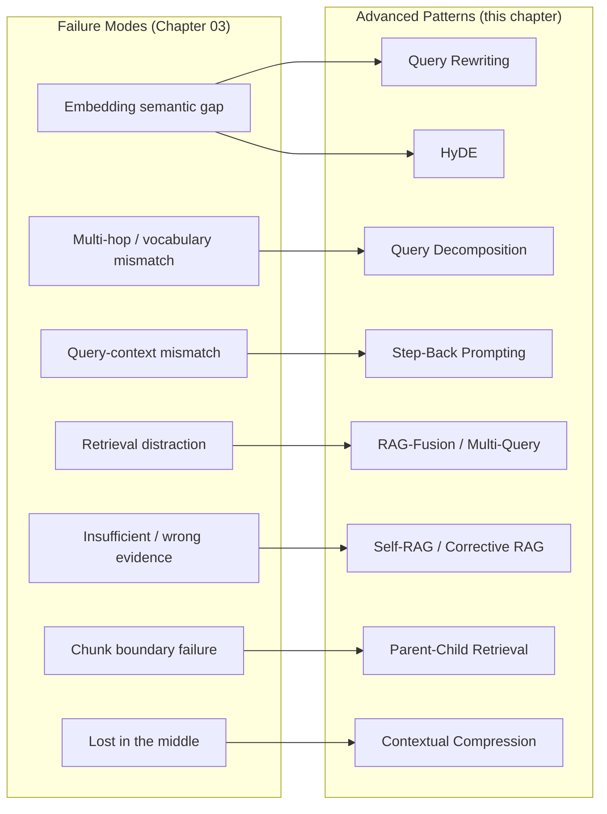

Naive RAG is embed-query, top-k, stuff, generate. Every pattern below inserts a step *before* retrieval (transform the query), *during* retrieval (issue more/better queries), or *after* retrieval (fix what the generator actually sees) — and every insertion trades latency or cost for quality. That tradeoff is the recurring theme; the decision framework at the end of this chapter makes it explicit.

## Query Rewriting

### Why raw user queries are poor retrieval signals

Users type queries the way they'd ask a colleague, not the way information is written in a knowledge base. "why is my bill so high this month" is a completely reasonable thing to type and a poor retrieval query — it's conversational, it contains no domain vocabulary, it may reference context from earlier in a conversation ("it" referring to something mentioned three turns ago), and it's often underspecified relative to what the corpus actually indexes on (plan tier, billing cycle, add-ons). Retrieval quality is bounded by how well the query's surface form matches the corpus's — query rewriting closes that gap before a single vector comparison happens.

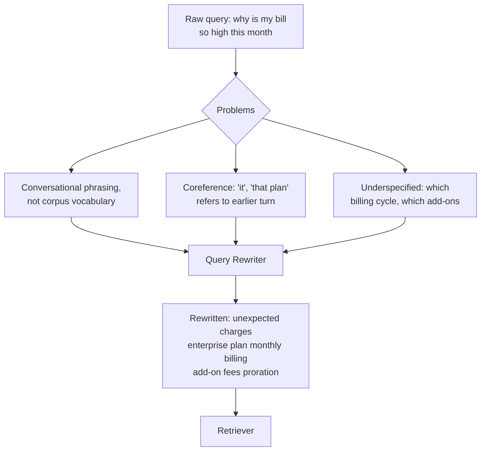

### LLM-based rewriting vs. rule-based rewriting

- **Rule-based rewriting** — deterministic transformations: stopword stripping, acronym expansion from a maintained glossary, synonym substitution from a domain thesaurus, spelling correction. Fast (sub-millisecond), free, and fully predictable, but brittle — it can't resolve coreference, can't infer missing context from conversation history, and only handles the specific patterns someone thought to encode.
- **LLM-based rewriting** — an LLM call (often a small, fast model) takes the raw query plus recent conversation history and produces a self-contained, corpus-appropriate rewrite. This handles coreference resolution, implicit context, and vocabulary translation that no static rule table can anticipate — but it adds an extra model call to the latency budget (typically 50-200ms with a fast model) and a new failure surface (the rewrite itself can be wrong).
- **Production default**: use rule-based rewriting for cheap, deterministic normalization (acronyms, known synonyms) as a first pass, and reserve LLM-based rewriting for conversational queries or queries flagged as ambiguous/low-confidence by the retriever — not on every single request if latency is tight.

### Domain-specific expansion

Beyond generic rewriting, domain expansion adds terms the user didn't type but that the corpus uses to describe the same concept — a query for "sign-on bonus" in an HR corpus benefits from also matching on "signing bonus," "hiring incentive," and the specific internal policy name, if one exists. This is typically implemented as a maintained expansion table or a fine-tuned small model, and it's one of the highest-leverage, lowest-cost fixes for the embedding semantic gap failure mode from Chapter 03.

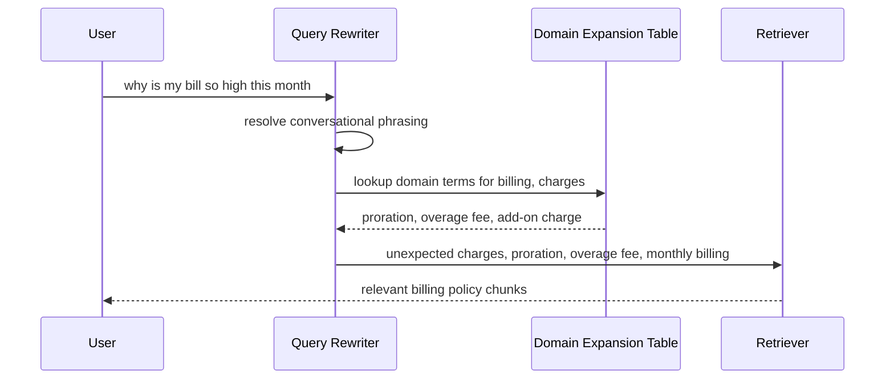

## Query Decomposition

### Multi-hop questions need more than one retrieval pass

Some questions cannot be answered by a single retrieval call because the answer requires combining facts from documents that have no lexical or semantic overlap with each other — only with sub-parts of the question. "Did the team that won the 2019 championship also win in 2023?" requires retrieving *who won in 2019*, then *who won in 2023*, then comparing — a single embedding of the whole question doesn't match either fact well, because the question as a whole is about neither year specifically.

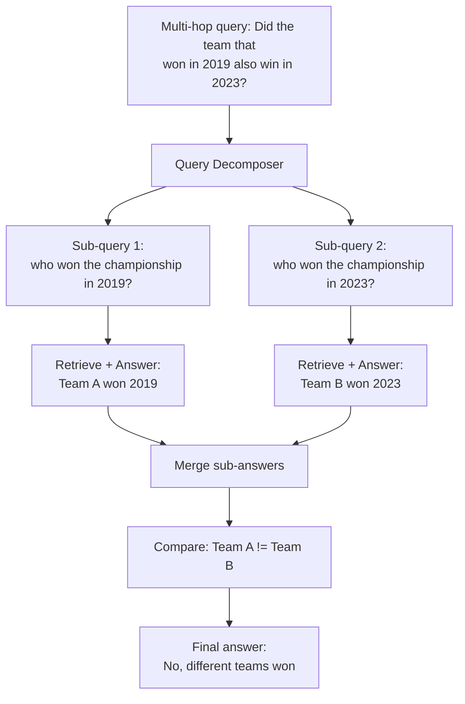

### Sub-query fan-out and result merging

The decomposition step (typically an LLM call) splits the original question into independent or sequentially-dependent sub-questions. Independent sub-questions can be retrieved in parallel (fan-out); sequentially-dependent ones (where sub-query 2 needs the answer to sub-query 1 to even be formed) must run serially. Each sub-query goes through its own retrieval-and-generation pass, and a final merge step combines the sub-answers into a coherent response to the original question — this merge step is itself an LLM call and is where synthesis errors can creep back in if the sub-answers are ambiguous or conflicting.

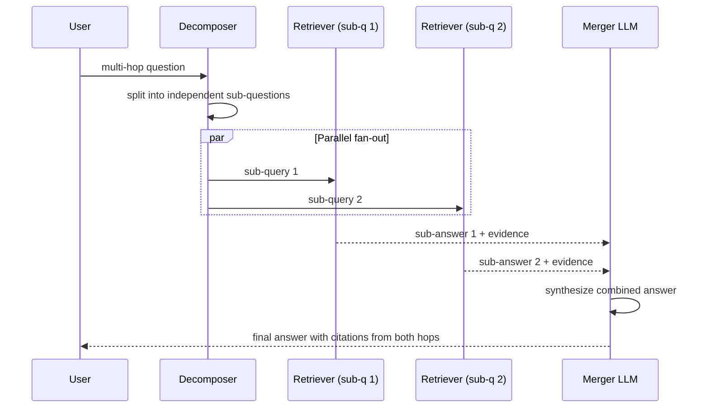

### When decomposition hurts

Decomposition adds at minimum one LLM call (to decompose) plus N retrieval-and-generation passes plus one merge call — for a simple, single-fact question, this is pure latency and cost overhead with no quality benefit, and can even *hurt* quality if the decomposer over-splits a question that didn't need splitting, introducing sub-questions that individually retrieve worse than the original would have. The practical mitigation is a routing/classification step: only decompose queries that a fast classifier (or the decomposer itself, cheaply) flags as genuinely multi-hop, and pass single-hop queries straight to standard retrieval.

## HyDE — Hypothetical Document Embeddings

### The core idea

HyDE inverts the usual retrieval flow: instead of embedding the user's question and searching for chunks near that embedding, an LLM first generates a *hypothetical answer* to the question — a plausible-sounding passage that *would* answer it, whether or not it's factually correct — and that hypothetical answer is what gets embedded and searched against the corpus. The insight is that a hypothetical answer is written in answer-shaped, declarative, corpus-like prose, which sits much closer in embedding space to the real answer in the corpus than a short interrogative question ever would.

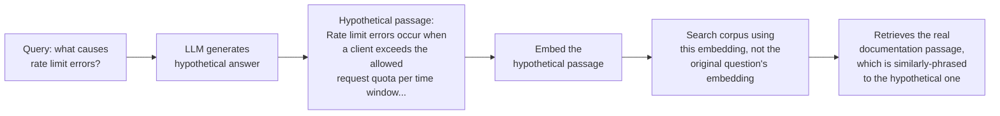

### Why it bridges the query-to-corpus semantic gap

A question ("what causes rate limit errors?") and its answer ("rate limit errors occur when...") are semantically related but structurally very different pieces of text — one is a query, one is an explanation. Embedding models are trained primarily on natural declarative text and are often better at matching declarative-to-declarative similarity than question-to-declarative similarity. By generating a hypothetical declarative answer and embedding *that*, HyDE reframes retrieval as a declarative-to-declarative similarity search — the exact regime embeddings are strongest at — even though the hypothetical passage was never verified against any real source.

### Failure cases

HyDE has one structural weakness: if the LLM's hypothetical answer is confidently wrong or invokes a completely different framing than what the corpus actually contains (common on questions about niche, company-specific, or newly-changed facts the model has no parametric knowledge of), the hypothetical embedding can point *away* from the real answer rather than toward it — the technique's core mechanism (generate plausible answer-shaped text) is also its failure mode when there's no good parametric prior to draw on. It also adds an LLM call before every retrieval, which is pure latency overhead on top of the standard pipeline.

- **Mitigation**: combine HyDE with the original question as an additional retrieval signal (run both, merge results) rather than replacing the original query entirely; this hedges against a bad hypothetical document while still getting the benefit when it helps.

## RAG-Fusion / Multi-Query Retrieval

### Issue N reformulations in parallel

RAG-Fusion generates several different rephrasings of the original query (typically 3-5, via an LLM prompted to produce varied reformulations), runs retrieval for each in parallel, and merges the resulting ranked lists into one final ranking. The idea is that any single query phrasing has blind spots, but several phrasings of the same underlying question are unlikely to all miss the same relevant chunk — this directly targets retrieval misses caused by an unlucky single phrasing.

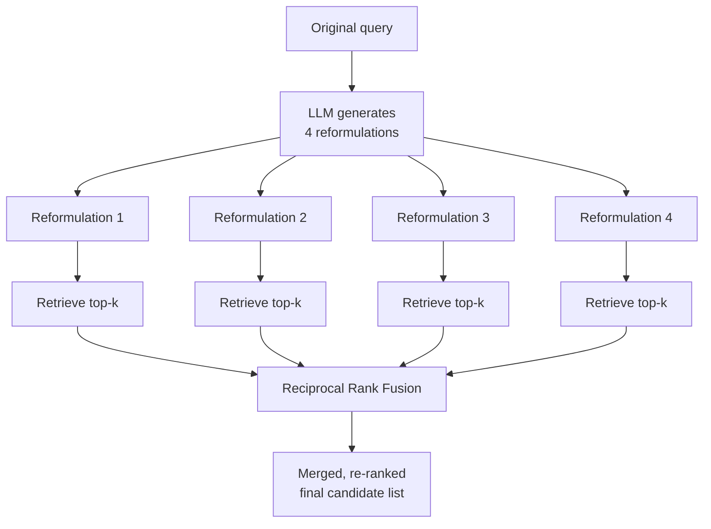

### Merging with Reciprocal Rank Fusion (RRF)

RRF combines multiple ranked lists into one by scoring each document based on its rank position across all the lists it appeared in, rather than its raw similarity score (which isn't comparable across different queries/embeddings):

$$\text{RRF}(d) = \sum_{i=1}^{N} \frac{1}{k + \text{rank}_i(d)}$$

where $\text{rank}_i(d)$ is the document's rank in the $i$-th query's result list (or omitted from the sum if it didn't appear), and $k$ is a small constant (commonly 60) that dampens the influence of very high individual ranks. A document that ranks moderately well across all four reformulations often outscores a document that ranks first in only one — which is exactly the robustness property that makes fusion effective: it rewards consistent relevance over reformulations rather than a single lucky match.

### Cost tradeoff

RAG-Fusion multiplies retrieval cost by N (one embedding + one ANN search per reformulation) plus the cost of the LLM call to generate the reformulations. For a corpus and query volume where retrieval is cheap (small corpus, low QPS), this is an easy win; at high QPS against a large, latency-sensitive index, running 4-5x the retrieval calls per user request is a real infrastructure cost, and the reformulation LLM call adds 50-150ms before retrieval even starts. Production systems often reserve RAG-Fusion for queries flagged as ambiguous or for a "didn't find a good answer" retry path, rather than running it on every request unconditionally.

## Step-Back Prompting

### Abstract before retrieving

Step-back prompting asks the model to first generate a more general, abstract version of the user's specific question, retrieve using that abstracted query, and then answer the original specific question using the retrieved general context. This is the mirror image of the usual instinct to make queries *more* specific — it exists because overly specific query vocabulary can fail to match how the corpus discusses the underlying general principle.

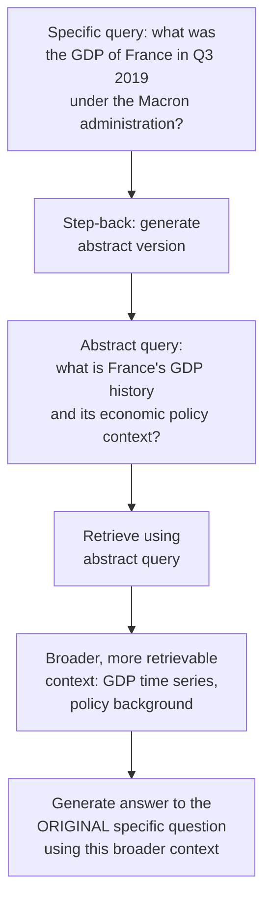

### What problem it solves

A corpus discussing "France's GDP" as a general economic time series is unlikely to contain a chunk phrased with the exact specificity of "GDP of France in Q3 2019 under the Macron administration" — the specific query over-constrains the retrieval search to a phrasing the corpus doesn't use, even though the corpus contains everything needed to answer it. Stepping back to "France's GDP history and economic policy context" retrieves the general time-series data and policy background that, combined, let the model derive the specific answer. This is effectively the inverse fix to query decomposition: decomposition breaks a compound question into narrower sub-questions; step-back broadens an over-specific question into a more retrievable general one. Choosing between them depends on whether the failure is "the question is compound" (decompose) or "the question is over-specified relative to corpus phrasing" (step back).

## Self-RAG / Corrective RAG

### The model decides whether retrieval is needed at all

Not every query needs retrieval — "what's 15% of 200?" or "write a haiku about autumn" gain nothing from a knowledge-base lookup, and forcing retrieval on every request wastes latency and can even hurt quality (an irrelevant retrieved chunk stuffed into the prompt is a distraction, per Chapter 03). Self-RAG trains or prompts the model to first decide: does this query need retrieved evidence at all?

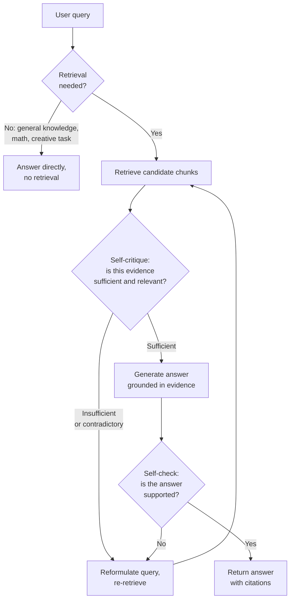

### Critiquing retrieved evidence and re-retrieving

Beyond the initial retrieval-needed decision, both Self-RAG and Corrective RAG add a critique step *after* retrieval: the model (or a lightweight classifier) evaluates whether the retrieved chunks are actually relevant and sufficient before generating. If the evidence is judged irrelevant, contradictory, or incomplete, the system reformulates the query (often using query rewriting or decomposition from earlier in this chapter) and retrieves again, rather than generating from known-bad evidence. Corrective RAG specifically adds a relevance classifier as an explicit, separate step immediately after retrieval, and can fall back to a broader search (e.g., web search) if the internal corpus's retrieved evidence is classified as irrelevant.

### Bridge to agentic RAG

This retrieve → critique → re-retrieve → generate → self-check loop is a control loop, not a fixed pipeline — the number of iterations isn't fixed in advance, and the system is making decisions about its own process rather than executing a scripted sequence of stages. That is precisely the definitional shift into agentic RAG: once a system is deciding *whether* to retrieve, *what* to retrieve next based on a critique of what it already has, and *when* it has enough evidence to stop, it has crossed from a pipeline into an agent with retrieval as one of its tools. See [Agentic RAG Architecture](../08-agentic-rag/01-agentic-rag-architecture.md) and [Iterative Retrieval and Self-Correction](../08-agentic-rag/02-iterative-retrieval-and-self-correction.md) for where this pattern goes next.

## Parent-Child Chunk Retrieval

### Retrieve small, deliver large

Small chunks retrieve more precisely — a 100-200 token chunk embeds a narrow, specific idea, so its similarity to a specific query is a cleaner signal than a 1000-token chunk that blends several ideas together. But small chunks are often insufficient *context* for generation — the generator needs the surrounding paragraph, section, or document to answer well, not just the two sentences that happened to match. Parent-child retrieval resolves this tension by decoupling the unit used for matching from the unit delivered to the generator.

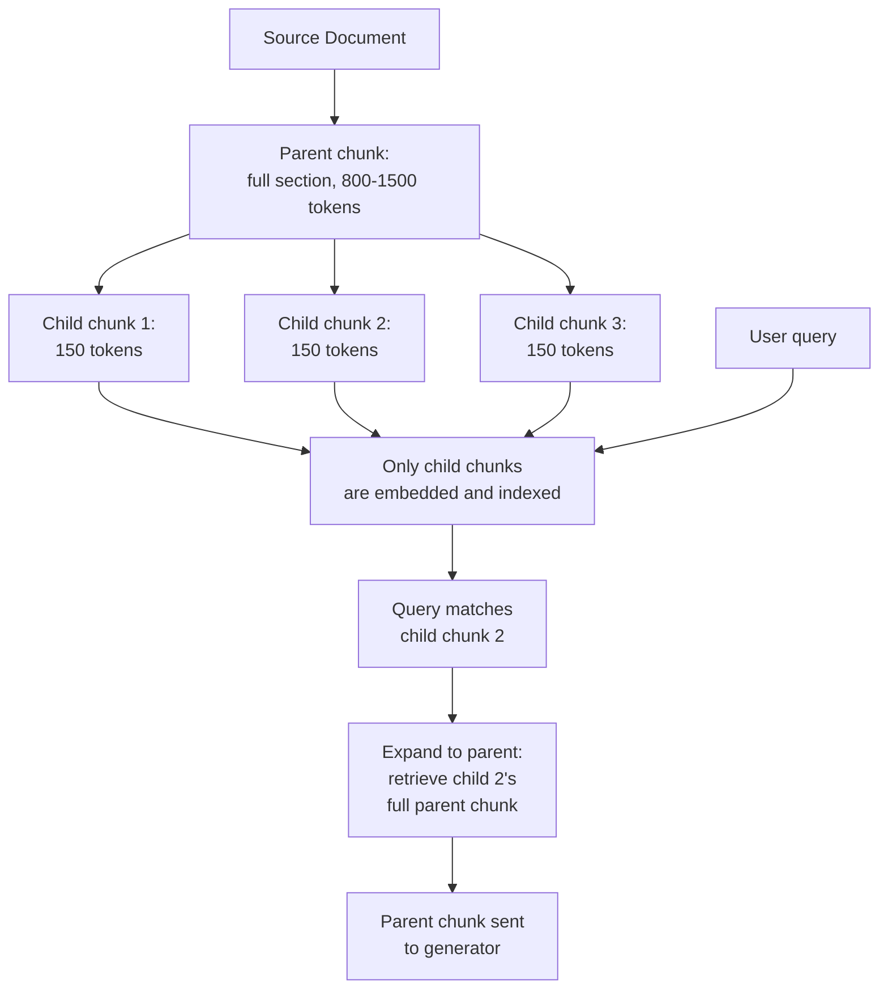

### Implementation patterns

- **Small-to-big retrieval**: index only child chunks; store a pointer (parent ID) on each child pointing to its parent; at retrieval time, match on children, then fetch and deduplicate the corresponding parents before sending to the generator. This is the most common pattern in frameworks like LlamaIndex ("Parent Document Retriever").
- **Sentence-window retrieval**: an even finer-grained variant — index individual sentences, and at retrieval time expand each matched sentence to a fixed window of surrounding sentences (e.g., 2 before, 2 after) rather than a structurally-defined parent chunk. Simpler to implement, less semantically aware than section-based parents.
- **Multiple levels of hierarchy**: some systems use three tiers (sentence → paragraph → document section) with matching at the finest level and expansion configurable per query type. This adds complexity and is usually only worth it for very long, deeply structured documents (legal contracts, technical manuals).
- **Deduplication on expansion**: if multiple matched children share the same parent, expand once, not once per child — otherwise the same parent content appears multiple times in the assembled context, wasting budget and reintroducing a lost-in-the-middle risk from redundant content.

This pattern is a direct fix for both the chunking-artifact retrieval miss and the chunk boundary failure from Chapter 03: the child chunk is small enough to match precisely, and the parent expansion guarantees the generator sees the full surrounding rule/exception/table instead of a truncated fragment.

## Contextual Compression

### Extract only the relevant sentences before generation

Even a well-retrieved, well-ranked chunk typically contains sentences that are irrelevant to the specific query — a 300-token chunk about a product feature might have only one sentence that answers the user's specific question, with the rest being introduction, caveats about unrelated aspects, or boilerplate. Contextual compression runs a post-retrieval pass (usually a small, fast LLM or an extractive model) that reads each retrieved chunk against the query and extracts or highlights only the query-relevant spans, discarding the rest before assembling the final generation prompt.

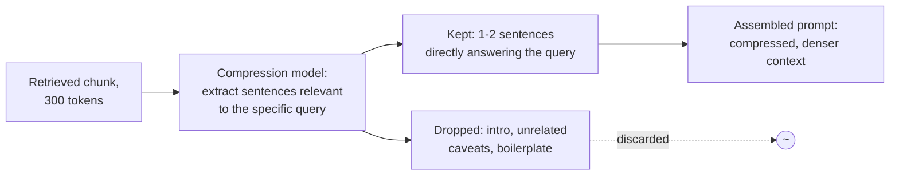

### How it reduces noise and cost

Compression directly attacks two problems at once: it reduces the lost-in-the-middle risk by shrinking the total context the generator has to attend across (less "middle" for the important span to get buried in), and it reduces generation cost since the model is billed on the actual tokens sent, not the tokens originally retrieved. The tradeoff is an extra model pass per retrieved chunk before generation — for k=8 retrieved chunks, that's 8 additional (typically small/fast) model calls, which can be run in parallel to limit the added latency, but which adds cost and a new place for the compression step itself to drop something the generator actually needed.

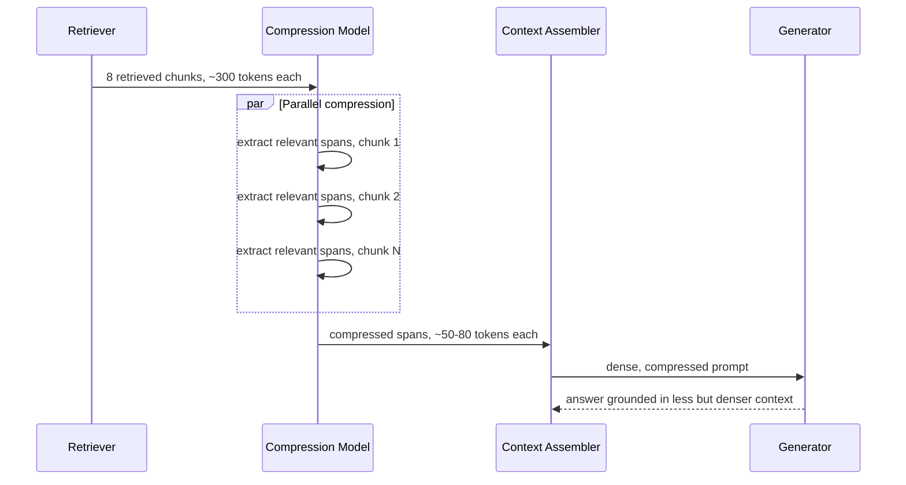

## Decision Framework — Which Pattern Fixes Which Failure

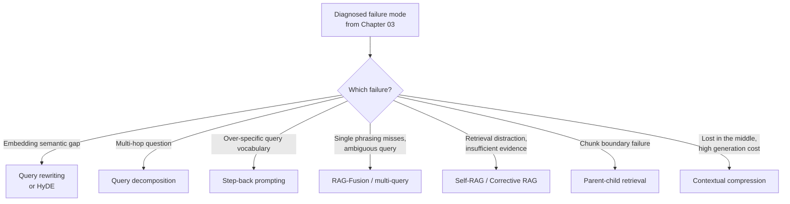

| Pattern | Fixes | Latency Cost | Infra / Compute Cost | Best Applied When |
|---|---|---|---|---|
| Query rewriting | Embedding semantic gap, conversational underspecification | +1 fast LLM call (~50-200ms) | Low | Conversational queries, coreference-heavy chat |
| Query decomposition | Multi-hop questions | +1 LLM call plus N full retrieval/generation passes | Medium-High | Compound questions requiring synthesis across facts |
| HyDE | Embedding semantic gap on answer-shaped corpora | +1 LLM call before retrieval | Low | Corpus is declarative prose (docs, articles), question is short |
| RAG-Fusion / multi-query | Single-phrasing misses, ambiguous queries | +1 LLM call, Nx retrieval calls | Medium (Nx vector search load) | High-value or ambiguous queries, not blanket applied at high QPS |
| Step-back prompting | Over-specific query vocabulary vs. general corpus phrasing | +1 LLM call before retrieval | Low | Specific factual questions about broadly-documented topics |
| Self-RAG / Corrective RAG | Retrieval distraction, insufficient/contradictory evidence | Variable, can loop (+1 to +N cycles) | Medium-High, unbounded worst case | High-stakes answers where wrong-but-confident is costlier than slower |
| Parent-child retrieval | Chunk boundary failure, chunking-artifact misses | Minimal (one extra fetch/dedup step) | Low (extra storage for parent chunks) | Structured or rule-heavy documents (policies, legal, technical manuals) |
| Contextual compression | Lost-in-the-middle, generation cost | +1 parallelizable model call per chunk | Low-Medium | Long retrieved chunks with low relevant-content density |

The overarching production principle: **apply these patterns conditionally, not universally.** Running query decomposition, RAG-Fusion, and Self-RAG's critique loop on every single request — including the simple ones that naive top-k already answers correctly — burns latency and cost for no quality gain on the majority of traffic. The highest-leverage architectures route: a fast classifier (or the retriever's own confidence signal) decides whether a query needs one of these interventions, and only pays their cost when the diagnosed failure mode is actually likely to be present.

## Interview Questions

### Beginner

**Q: What problem does query rewriting solve that retrieval alone cannot?**
Retrieval can only match what's actually in the query against what's in the corpus. If a user's raw query is conversational, underspecified, or phrased very differently from how the corpus discusses the same concept, no amount of retrieval tuning fixes that — the query itself needs to be transformed into something closer to the corpus's vocabulary and self-contained enough to not depend on earlier conversation turns. Query rewriting is a pre-retrieval fix; it happens before the retriever ever runs.

**Q: In one sentence, what's the core idea behind HyDE?**
Generate a hypothetical answer to the question and embed that hypothetical answer instead of the question itself, because answer-shaped text matches the corpus's answer-shaped text better than a short question does.

### Intermediate

**Q: When would you choose query decomposition over RAG-Fusion for the same ambiguous-looking query?**
The distinguishing question is whether the query is genuinely compound (it requires combining facts from logically separate sub-questions, like comparing two different years' results) or whether it's a single question that's just ambiguous in phrasing (many reasonable rephrasings would all retrieve the same underlying fact, just via different vocabulary). Decomposition is for the former — it splits into sub-questions that get answered semi-independently and then merged. RAG-Fusion is for the latter — it issues several phrasings of the *same* question and fuses the ranked results, betting that the union of phrasings covers the vocabulary gap. Using decomposition on a single ambiguous question over-splits it into artificial sub-questions; using fusion on a genuinely compound question doesn't help because no single reformulation of the compound question retrieves both needed facts.

**Q: Why does parent-child retrieval work better than just using large chunks everywhere?**
Because the unit that's best for matching (small, focused, precise) and the unit that's best for generation context (large, complete surrounding context) are different, and using one size for both forces a compromise: large chunks everywhere hurt retrieval precision (a chunk blending several ideas matches queries less cleanly), while small chunks everywhere hurt generation quality (the generator doesn't get surrounding context it needs). Parent-child retrieval gets both: match on the small child, deliver the larger parent.

### Senior

**Q: You've added Self-RAG's critique-and-re-retrieve loop to a production system and now p95 latency has become unpredictable. How do you fix this without abandoning the pattern?**
The unbounded iteration is the root cause — a critique loop with no hard cap can keep re-retrieving on a genuinely under-covered corpus gap, burning latency (and cost) chasing evidence that doesn't exist. Cap the number of re-retrieval cycles (e.g., 2 maximum), and make the terminal behavior explicit: after the cap, return the best evidence found so far with an honest confidence signal (or a "insufficient information" response) rather than looping indefinitely or silently generating from weak evidence. Separately, since the loop's cost is inherently variable, don't apply it universally — route only queries where the initial retrieval confidence is low or the query is flagged high-stakes into the critique loop, and let well-matched queries skip straight to generation on the first retrieval pass. This turns an unbounded-tail latency problem into a bounded, small-percentage-of-traffic cost.

**Q: A colleague argues you should apply RAG-Fusion to every query "since it can only improve recall." Push back on this.**
RAG-Fusion multiplies retrieval calls by N and adds an LLM call to generate reformulations before that — at high QPS against a large index, that's a real and continuous infrastructure cost, not a one-time investment, and it adds 50-150ms+ of latency before retrieval even starts on every request, including the majority of queries that a single well-formed query already retrieves correctly. It also isn't free of quality risk: fusing ranked lists from several reformulations can occasionally promote a plausible-but-wrong distractor that happened to rank consistently across reformulations, over a genuinely correct chunk that only one phrasing matched strongly. The right framing isn't "does it ever help" (it does), it's "does the marginal recall gain justify Nx retrieval cost and added latency on every request" — and for the bulk of well-specified queries, it typically does not, which is why production systems gate this behind a confidence or ambiguity signal rather than applying it unconditionally.

### Staff

**Q: Design a query-time routing layer that decides, per request, which of the patterns in this chapter (if any) to apply, optimizing for a fixed p95 latency budget and a fixed monthly compute budget.**
Start with a fast, cheap classification step (a small model or even the base retriever's own confidence signal — top-1 similarity score and score gap to top-2) run on every query before any expensive pattern is invoked. Define tiers: tier 0 (majority of traffic) — high retriever confidence, single-hop-looking query — goes straight to standard retrieve-rerank-generate with no added pattern. Tier 1 — low confidence or detected ambiguity/conversational underspecification — gets query rewriting (cheap, single LLM call) as a first intervention, then re-checks retrieval confidence; if it clears the bar, proceeds normally. Tier 2 — still low confidence after rewriting, or query classified as multi-hop by a lightweight classifier — gets decomposition or RAG-Fusion, whichever the query pattern warrants (compound vs. ambiguous). Tier 3 — high-stakes queries (flagged by product/domain rules, e.g., anything touching pricing, legal, safety) — always get Self-RAG-style critique regardless of initial confidence, since the cost of a wrong answer there outweighs the added latency. Track, per tier, the actual latency and cost consumed against budget in real time, and if the tier-2/3 volume is trending over budget, tighten the confidence thresholds that gate entry into those tiers rather than letting the budget blow out — this makes the routing layer itself a monitored, tunable control surface, not a fixed decision tree.

## Google-Level Follow-Ups

- "Your Self-RAG critique step is itself an LLM call that can be wrong — how do you know the critique is trustworthy, and what happens when it isn't?" — probes whether the candidate recognizes the critique step needs its own calibration/eval (does "insufficient evidence" correlate with actual downstream faithfulness failures) rather than being trusted as ground truth simply because it's a second model call.
- "If HyDE's hypothetical document is generated by the same model family that will later hallucinate on this exact query, doesn't that risk compounding the hallucination into the retrieval step itself?" — probes for understanding that HyDE's hypothetical document is a retrieval aid, not a claim, and needs safeguards (hedging with the original query, or using a different/cheaper model for hypothesis generation) rather than assuming any LLM output used anywhere in the pipeline carries the same risk profile as final generation.
- "You have unlimited compute budget but a hard 400ms p99 latency SLA. Which patterns are simply off the table, and which can you make work anyway?" — probes for latency-vs-compute tradeoff reasoning: decomposition and unbounded Self-RAG loops are likely off the table entirely at 400ms; HyDE, rewriting, and contextual compression (parallelized) might fit if implemented with fast models and aggressive timeouts/fallbacks to the un-augmented path.

## Common Mistakes

- **Applying every advanced pattern to every query regardless of cost** — the patterns in this chapter are targeted fixes for diagnosed failure modes, not universal upgrades; blanket application burns latency and budget on the majority of queries that don't need it.
- **Using query decomposition on ambiguous-but-not-compound queries** — over-splits a single question into artificial sub-questions that individually retrieve worse than the original.
- **Trusting HyDE's hypothetical document without hedging against the original query** — on niche or company-specific facts the model has no parametric prior for, the hypothetical can point retrieval away from the real answer.
- **Running an unbounded Self-RAG / Corrective RAG critique loop** — without a hard iteration cap, a genuine corpus coverage gap turns into unpredictable, runaway latency chasing evidence that doesn't exist.
- **Expanding every matched child chunk to its parent without deduplication** — multiple children sharing a parent reintroduce the same content multiple times in context, wasting budget and reintroducing lost-in-the-middle risk.
- **Treating contextual compression as risk-free** — the compression step itself can drop a span the generator actually needed; it needs its own evaluation, not an assumption that "shorter is always safer."

## Key Takeaways

- Every advanced RAG pattern in this chapter is a direct, targeted fix for a specific failure mode from [Chapter 03](03-rag-failure-modes.md) — match the diagnosed failure to the pattern, don't apply patterns speculatively.
- Query-side patterns (rewriting, decomposition, HyDE, RAG-Fusion, step-back) intervene *before* retrieval; evidence-side patterns (Self-RAG, parent-child, compression) intervene *during or after* — know which stage a given production failure lives in before picking a fix.
- RAG-Fusion and decomposition both multiply retrieval cost; reserve them for queries flagged as ambiguous, compound, or high-stakes rather than running them on all traffic.
- Self-RAG's retrieve-critique-re-retrieve loop is the conceptual bridge from a fixed RAG pipeline into agentic RAG — the system is now making decisions about its own retrieval process, not just executing a scripted sequence.
- Parent-child retrieval and contextual compression are the lowest-latency-cost patterns in this chapter and are reasonable production defaults; query decomposition and unbounded self-critique loops are the highest-cost and should be gated behind confidence or ambiguity signals.
- A production RAG system should route queries through these patterns conditionally, based on a cheap upfront confidence/classification signal, rather than making a single global architectural choice for all traffic.

---

*Part of [RAG](index.md) in the [AI System Design Notes](../index.md). Tracked in [BACKLOG.md](https://github.com/GyanendraChaubey/AI-System-Design-Notes/blob/main/BACKLOG.md).*
