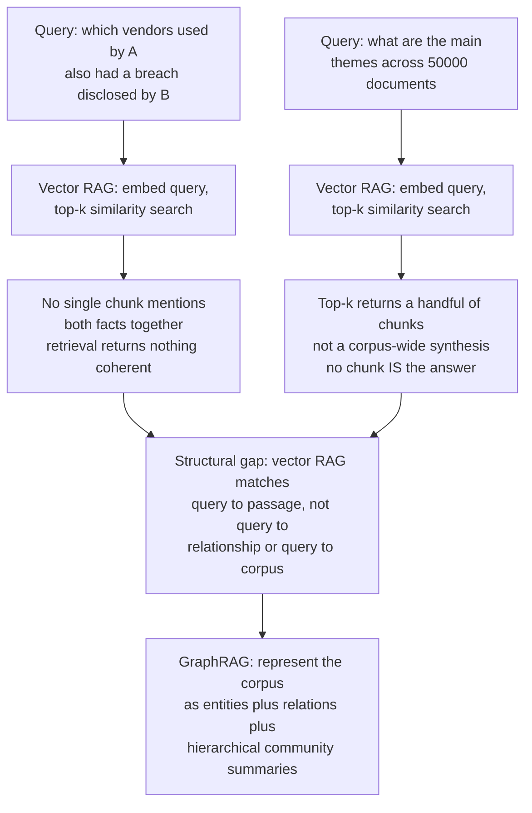
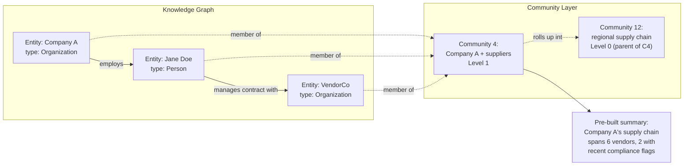
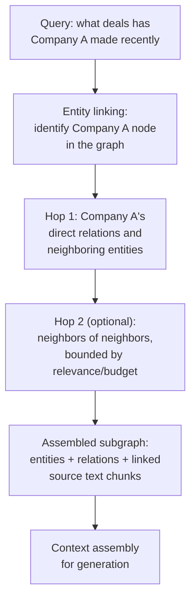
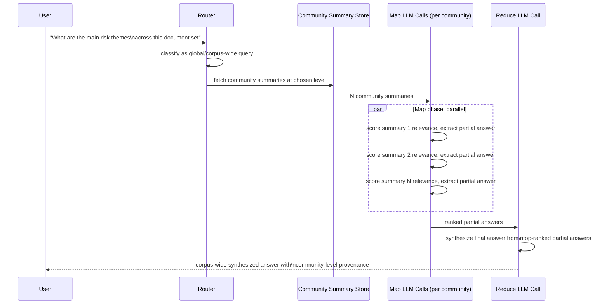
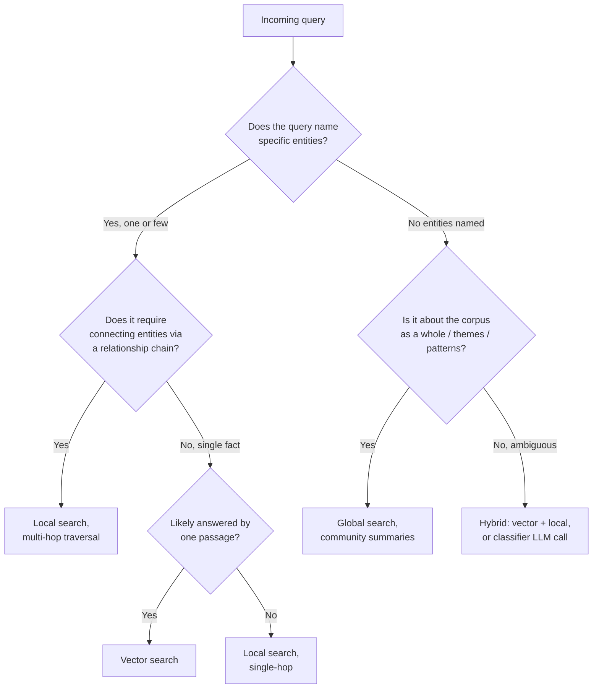
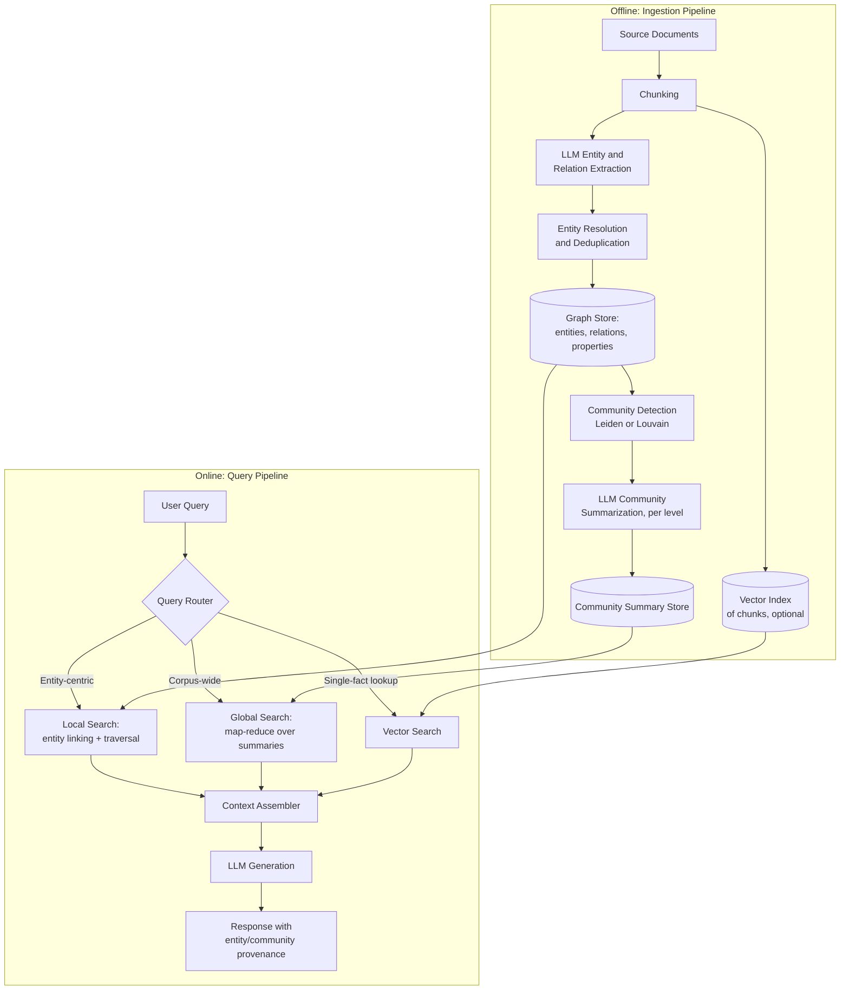
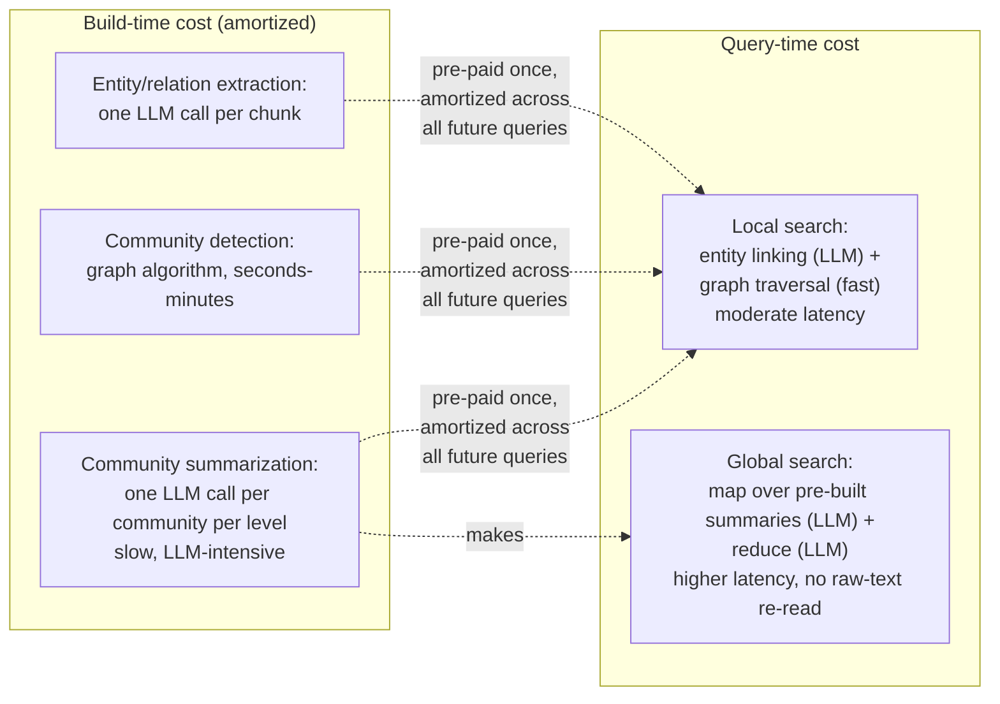
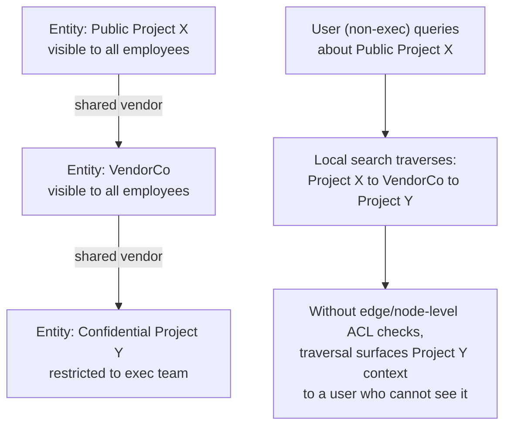
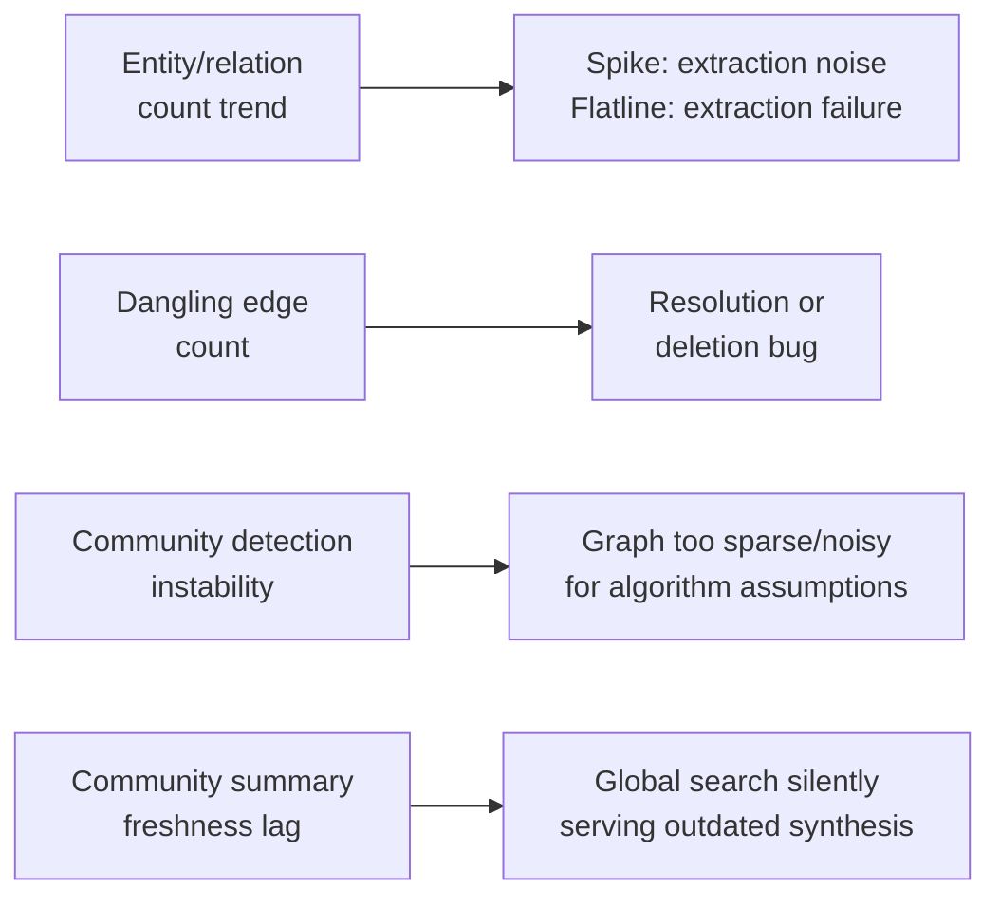
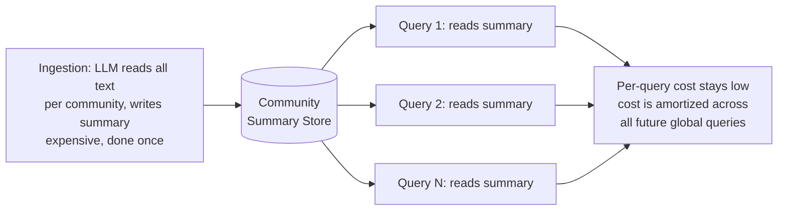

# GraphRAG Architecture

## Overview

GraphRAG represents a corpus as a knowledge graph — entities as nodes, relationships as edges, clusters of densely-connected entities as communities — instead of, or alongside, a flat set of vector-embedded chunks. It exists to answer two classes of question that vector RAG structurally cannot: questions that require reasoning *across* multiple entities and their relationships, and questions *about the corpus as a whole* rather than about any single retrievable passage.

## Definition

GraphRAG is a retrieval-augmented generation architecture in which an LLM-driven ingestion pipeline extracts entities and relations from unstructured text into a graph, detects hierarchical communities of related entities, and pre-builds natural-language summaries of those communities; at query time, the system either traverses the graph outward from query-relevant entities (**local search**) or reads pre-built community summaries (**global search**) to assemble context for generation, instead of relying solely on nearest-neighbor similarity over chunk embeddings.

## Problem Statement — Where Vector RAG Hits a Ceiling

Vector RAG's retrieval unit is the chunk, and its retrieval mechanism is similarity between a query embedding and a chunk embedding. That combination is excellent at one thing — "find the passage that most resembles this question" — and structurally incapable of two others:

- **Multi-hop reasoning across entities.** "Which vendors used by Company A also had a data breach disclosed by Company B?" has no single chunk that answers it. The answer requires connecting facts that live in different documents, joined through shared entities (a vendor name) that never co-occur in the same paragraph. No amount of top-k tuning fixes this — the *relationship* between two facts, not either fact alone, is the answer.
- **Corpus-wide synthesis.** "What are the major themes across this 50,000-document research corpus?" has no chunk that answers it either, because the answer isn't *in* any one chunk — it's a property that emerges from reading the whole corpus at once. Vector RAG's only lever here is stuffing more chunks into context, which runs into the same cost, latency, and lost-in-the-middle ceiling covered in [RAG Architecture](../06-rag/01-rag-architecture.md#when-long-context-replaces-retrieval).

Representing the corpus as a graph closes both gaps directly. Multi-hop questions become graph traversal — walk from vendor to Company A, walk from vendor to Company B, the connecting node *is* the answer. Corpus-wide questions become a lookup against summaries that were already built by having an LLM read each cluster of related entities once, at ingestion time, rather than trying to read the whole corpus at query time.

## Why This Architecture Exists

GraphRAG originates from Microsoft Research's 2024 GraphRAG paper, which was a direct response to a specific, repeated failure in production RAG deployments: "global sensemaking" queries — questions about the shape of a corpus, not a fact within it — consistently produced weak or empty answers no matter how good the underlying retriever was, because the failure wasn't in retrieval quality, it was in the retrieval *unit*. A chunk can never be an answer to "what are the themes here" because a theme is a property of the relationships between many chunks, not any one of them.

The alternative that came before GraphRAG — and still the majority default — was to throw compute at the problem: multi-query fan-out, iterative agentic retrieval, or brute-force long-context stuffing. All three can *approximate* an answer to a corpus-wide question by retrieving progressively more of the corpus, but none of them is structurally suited to it, and all three get expensive fast. GraphRAG's insight was to move that expensive "read a lot of the corpus and synthesize" work from query time (expensive, repeated on every request) to ingestion time (expensive once, amortized across every future query) — the pre-built community summary is the load-bearing idea of the entire architecture.

## Core Concepts — The Graph Data Model

| Concept | What it is | How it's stored | What it enables |
|---|---|---|---|
| **Entity (node)** | A discrete real-world thing extracted from text — a person, organization, product, location, event, concept | A graph node with a canonical name, type, and a text description synthesized from every mention across the corpus | Anchor point for local search; the unit that gets traversed and summarized |
| **Relation (edge)** | A stated or inferred connection between two entities — "acquired," "works at," "cites," or an untyped co-occurrence | A graph edge with source/target entity IDs, a relation type or description, and provenance (which chunk it was extracted from) | Multi-hop traversal; relationship queries ("how does A relate to B") |
| **Property** | An attribute attached to a node or edge — a date, a numeric value, a source document ID, a confidence score | Key-value pairs on the node/edge record (native property graph) or a separate attributes table (relational-backed graph stores) | Filtering, provenance tracing, permission enforcement, temporal queries |
| **Community** | A cluster of entities with denser mutual relations to each other than to the rest of the graph | The output of a community-detection algorithm (Leiden/Louvain) run over the entity-relation graph, stored as a community ID per entity plus a hierarchy level | Global search — each community gets one pre-built LLM summary; querying "themes in the corpus" becomes reading community summaries, not raw text |

Each concept enables a different query shape: entities and relations enable **traversal** ("start at Company A, walk to its vendors"); properties enable **filtering and provenance** ("only relations extracted after 2023, only from documents this user can see"); communities enable **synthesis** ("summarize this whole cluster without reading it").

## The Two Search Modes

This is the feature that makes GraphRAG a different architecture from vector RAG, not just vector RAG with extra metadata.

### Local Search — Entity-Centric Traversal

Local search is the graph analogue of vector top-k: instead of finding the nearest chunks in embedding space, it finds the entities mentioned or implied by the query, then traverses outward through the graph to assemble a relevant subgraph — the entity's direct relations, the descriptions of connected entities, and the source text chunks those relations were extracted from.

Local search is analogous to vector RAG's top-k in shape (anchor → retrieve a bounded relevant set) but different in mechanism (graph traversal and relevance-scored expansion instead of approximate nearest-neighbor search). It answers questions that are *about a specific entity or a small set of entities* — "what has Company A done," "who reports to Jane Doe," "what products does VendorCo supply" — well, including one or two hops of connection that vector similarity alone would miss because a related entity's chunk may not be textually similar to the query at all.

### Global Search — Community Summarization

Global search never touches raw chunks at query time. Instead, it reads the pre-built community summaries — potentially at multiple hierarchy levels — map-reduces over them with an LLM, and synthesizes a final answer. This is what makes "what are the main themes in this corpus" answerable at all: the expensive work of reading the corpus was already done once, per community, during ingestion.

Global search operates at a chosen level of the community hierarchy — coarser levels (fewer, bigger communities) for broad "what are the themes" questions, finer levels (many, smaller communities) for more specific corpus-wide questions ("what do different documents say about pricing across all regional communities"). Vector RAG has no equivalent lever at all: it has one granularity (the chunk) and no pre-built synthesis to fall back on.

## Query Routing

The router is what decides whether a query needs local search, global search, plain vector search, or some combination — get this wrong and the system either pays global-search cost on a simple factual question or returns an empty/weak answer to a corpus-wide question by only doing local search.

| Signal | Points toward | Example |
|---|---|---|
| Query names a specific entity or small set of entities | Local search | "What contracts does VendorCo hold?" |
| Query asks about themes, patterns, or "overall" / "across" the corpus | Global search | "What are the recurring compliance risks across all vendor contracts?" |
| Query is a single, narrow factual lookup with a likely single-chunk answer | Vector search | "What is the notice period in the VendorCo master agreement?" |
| Query requires connecting two or more named entities via a relationship | Local search (multi-hop) | "Is there any vendor shared between Company A and Company B?" |
| Query scope is ambiguous or conversational | Classifier LLM call, defaults to vector + local hybrid | "What's going on with our vendors lately?" |

The routing signals in practice come from a lightweight classifier (rule-based entity detection plus an LLM call for scope classification) run before any expensive retrieval — the same conditional-routing principle as [Advanced RAG Patterns](../06-rag/04-advanced-rag-patterns.md#decision-framework-which-pattern-fixes-which-failure): don't pay global-search cost on traffic that a cheap vector lookup would answer just as well.

## The Full Architecture

## Components

| Component | Responsibility | Does NOT own |
|---|---|---|
| Chunking service | Split source documents into extraction-sized units | Entity extraction itself |
| Extraction LLM | Read each chunk, emit candidate entity/relation triples | Deduplication, graph storage |
| Entity resolver | Merge duplicate entity mentions into canonical nodes | Extraction, community detection |
| Graph store | Persist entities, relations, properties; serve traversal queries | Community detection, summarization |
| Community detection | Cluster the graph into hierarchical communities | Summarization content |
| Community summarizer (LLM) | Read all text tied to a community, write a summary per level | Query-time retrieval |
| Query router | Classify query scope, choose local/global/vector path | Retrieval execution itself |
| Local search engine | Entity linking, bounded graph traversal, subgraph assembly | Community summaries |
| Global search engine | Map-reduce over community summaries | Raw chunk access |
| Context assembler | Merge graph/vector output into a generation-ready prompt | Ranking within each path |

## Storage Layer

| Approach | Description | Cost / Scale Implications |
|---|---|---|
| **Graph database (Neo4j, Kuzu, Amazon Neptune)** | Native property-graph storage with an optimized traversal query engine (Cypher/openCypher) | Best for large graphs (millions of nodes/edges) with frequent traversal queries and concurrent multi-user access; operational cost of running and tuning a dedicated database; Neo4j has the richest tooling, Kuzu is embeddable and cheaper for single-node workloads, Neptune trades control for AWS-managed scaling |
| **In-memory graph library (NetworkX)** | Load the entire graph into process memory as a Python object, traverse with library calls | Fine for small-to-medium corpora (tens of thousands of entities) that fit in RAM; trivial to set up; does not scale past single-machine memory and has no built-in concurrency or persistence story — every process restart means reloading |
| **Microsoft GraphRAG approach (parquet/CSV + NetworkX)** | Entities, relations, and community summaries stored as flat parquet/CSV files, loaded into NetworkX for graph operations at query time | Simple, portable, versionable with the same tooling as any data pipeline (no separate database to run); works well for research/batch-oriented workloads; weaker at low-latency concurrent query serving than a dedicated graph database, since the whole graph (or large slices of it) must be loaded/queried in-process |

The practical decision mirrors the vector-DB choice in ordinary RAG: pick the in-memory or flat-file approach while a corpus is small and query patterns are still being discovered, and move to a dedicated graph database once concurrent query load, graph size, or the need for incremental updates without a full reload makes an in-memory reload-per-restart model untenable.

## Latency Profile

Global search is expensive to *build* (an LLM reads and summarizes every community, at every hierarchy level, which for a large corpus means a large, one-time — or nightly — batch of LLM calls) but cheap-ish to *query*, since answering doesn't require re-reading raw text, only the pre-built summaries. Local search is cheaper to build (no summarization step required) but every query still pays for LLM-based entity linking and graph traversal, so it doesn't get the same amortization benefit — its query-time cost is steadier and doesn't shrink with corpus age the way global search's does.

## When to Use GraphRAG Over Vector RAG

Briefly: GraphRAG earns its cost on multi-hop, relationship, and corpus-wide synthesis queries, and loses to vector RAG on high-volume single-fact lookup, small or simple corpora, and any workload where update frequency matters more than relationship depth. This chapter covers the architecture; [When GraphRAG Beats Vector RAG](03-when-graphrag-beats-vector-rag.md) covers the full decision framework, cost comparison, and hybrid patterns.

## Security — Graph Traversal and ACL Boundaries

Vector RAG's permission problem is filtering a flat candidate list. GraphRAG's permission problem is structurally harder: **traversal can cross an ACL boundary through a shared edge**, surfacing information the requesting user should never see even if no single node they touched was itself restricted.

The fix is the same principle as vector RAG's ACL enforcement — filter at retrieval time, not after generation — applied at the traversal layer instead of the candidate-list layer: every node and edge carries a permission property, and the traversal engine prunes any path that would cross into a node or edge the requesting user's context does not authorize, *before* that node's text ever reaches the context assembler. This has to be enforced inside the graph query itself (a Cypher `WHERE` clause on permission properties, or an equivalent filter in the traversal library), not as a post-hoc filter on the assembled context, for the same reason described in [RAG Architecture's security section](../06-rag/01-rag-architecture.md#security) — by the time a restricted node's text has been read into context or logged, the leak has already happened even if the final answer is scrubbed. Community summaries add a second-order version of the same risk: a community summary that blends public and restricted entities' text at ingestion time bakes the leak into the summary itself, which then serves every future query regardless of the asker's permissions — this argues for building separate community summaries per permission boundary in any corpus with meaningfully different access tiers, rather than one summary serving all users.

## Cost

Construction cost is GraphRAG's central economic tradeoff, and it is meaningfully higher than vector RAG's ingestion cost because **every chunk calls an LLM for extraction, and every community calls an LLM for summarization** — vector RAG's ingestion cost is one embedding call per chunk (cheap, non-generative); GraphRAG's is one generative LLM call per chunk plus another generative call per community per hierarchy level.

| Cost driver | Vector RAG | GraphRAG |
|---|---|---|
| Per-chunk ingestion | One embedding call (cheap, ~$0.02-0.13/1M tokens) | One LLM extraction call (generative, orders of magnitude more expensive per token) |
| Per-community cost | N/A | One LLM summarization call per community, per hierarchy level |
| Update cost | Re-embed the changed chunk | Re-extract, re-resolve entities, possibly re-detect communities, possibly re-summarize affected communities |
| Query-time cost (local) | ANN search, cheap | Entity linking LLM call + graph traversal |
| Query-time cost (global) | N/A (cannot answer this query class) | Map-reduce LLM calls over summaries, but no raw-text re-read |

The improved quality on multi-hop and corpus-wide queries has to be weighed against this construction premium — see [When GraphRAG Beats Vector RAG](03-when-graphrag-beats-vector-rag.md#cost-comparison) for the per-million-token cost comparison and break-even analysis.

## Monitoring

Graph health is a different monitoring surface than vector index health, and it needs its own metrics:

- **Entity and relation counts over time** — a sudden spike usually means extraction is over-triggering (noise); a flatline on a growing corpus usually means extraction is failing silently.
- **Dangling edges** — relations pointing to an entity ID that no longer resolves to any node (a resolution or deletion bug), which will break traversal at query time in a way that's hard to detect without an explicit check.
- **Community detection failure/instability rate** — how often re-running detection on a lightly-changed graph produces wildly different community assignments (a symptom of a graph structure that's too sparse or too noisy for the algorithm's assumptions).
- **Community summary freshness** — time since a community's member entities last changed vs. time since its summary was last regenerated; a stale summary silently degrades every future global-search answer touching that community, with no query-time error to signal it.
- **Entity resolution rate and merge-error rate** — how many raw extracted mentions collapse into canonical entities, and (via periodic sampling) how many of those merges are wrong.

## Production Best Practices

- Route conditionally — never run global search (map-reduce over every community) for queries a vector or local-search path would answer correctly and far more cheaply.
- Enforce permissions inside the graph traversal query itself, not as a post-retrieval filter — see [Security](#security-graph-traversal-and-acl-boundaries).
- Treat community summary staleness as a first-class freshness SLO, the same way [RAG Architecture](../06-rag/01-rag-architecture.md#reliability) treats vector index staleness.
- Keep the vector index alongside the graph rather than replacing it — most production GraphRAG systems are hybrid (see [Chapter 03](03-when-graphrag-beats-vector-rag.md#hybrid-architecture)), using vector search for the majority single-fact traffic and reserving graph paths for the queries that actually need them.
- Version the graph and community summaries together — a bad re-summarization run should be a one-command rollback, same as a bad re-index in vector RAG.

## Real World Examples

- **Microsoft GraphRAG** is the reference implementation and the source of the local/global search split described in this chapter; it defaults to a parquet/CSV + NetworkX storage model and is explicitly positioned for corpus-wide sensemaking queries rather than as a full vector RAG replacement.
- **Neo4j** publishes GraphRAG reference architectures pairing its native graph database with vector indexes (Neo4j supports vector search natively), targeting exactly the hybrid pattern this chapter and Chapter 03 describe.
- **LangChain and LlamaIndex** both ship graph-construction and graph-query abstractions (`LangChain` graph transformers, `LlamaIndex` knowledge graph index) that wrap the extract-resolve-store-traverse pipeline described here on top of a pluggable graph store.

## Interview Questions

### Beginner

**Q: What is the core difference between how vector RAG and GraphRAG retrieve context?**
Vector RAG retrieves by similarity: it embeds the query and finds the chunks whose embeddings are closest to it. GraphRAG retrieves by structure: it either traverses a graph outward from query-relevant entities (local search) or reads pre-built summaries of clusters of related entities (global search). The unit of retrieval is a chunk in vector RAG and an entity/relationship/community in GraphRAG.

**Q: Why can't vector RAG answer "what are the main themes in this corpus"?**
Because no single chunk *is* the answer to that question — a theme is a property that emerges from many chunks together, not something embedded in any one of them. Vector RAG's retrieval mechanism can only return individual passages close to a query embedding; it has no mechanism for synthesizing across the whole corpus short of stuffing an infeasible number of chunks into context.

### Intermediate

**Q: Explain the difference between local search and global search, and give a query example for each.**
Local search is entity-centric: it anchors on one or a few named entities in the query, traverses the graph outward from them, and assembles the relevant subgraph — example: "what deals has Company A made recently?" Global search is corpus-centric: it reads pre-built hierarchical community summaries and map-reduces over them, never touching raw chunks at query time — example: "what are the recurring compliance risks across all vendor contracts?" Local search is the graph analogue of vector top-k; global search has no vector RAG analogue at all.

**Q: Why is global search cheaper at query time than you might expect, given that it seems to require reading the whole corpus?**
Because the expensive work — reading all the text tied to each community and writing a summary — happens once, at ingestion time, not per query. Query time only reads the pre-built summaries and map-reduces over them, which is a much smaller and cheaper operation than reading raw source text for every request. The cost is real, it's just moved to ingestion and amortized across every future query that touches that community.

### Senior

**Q: How would you design query routing between vector search, local graph search, and global community search?**
Start with a cheap classification pass before any expensive retrieval: rule-based entity detection (does the query name specific entities?) combined with a lightweight LLM or classifier call to detect corpus-wide scope ("themes," "overall," "across all"). Route named-entity queries with a likely single-passage answer to vector search; named-entity queries that imply traversal (relationship or multi-hop phrasing) to local search; corpus-wide-scope queries with no specific named entity to global search. Ambiguous or conversational queries fall back to a hybrid path (run vector and local in parallel, let context assembly reconcile) rather than guessing wrong on an expensive path. This mirrors the conditional-routing principle in [Advanced RAG Patterns](../06-rag/04-advanced-rag-patterns.md): never pay the most expensive path's cost on traffic a cheaper path would answer just as well.

**Q: A colleague proposes enforcing ACLs in GraphRAG by filtering the final assembled context before it reaches the LLM. Why is this insufficient?**
Because by the time a restricted entity's text has been traversed into the subgraph, it may already have been logged, cached, or included in an intermediate LLM call (e.g., during map-reduce over community summaries) before the final filter ever runs — the leak has already happened even if the last-mile filter catches it before the user sees a response. Permission enforcement has to happen inside the traversal query itself (pruning any path that crosses into a node or edge the requester isn't authorized for, before that node's text is ever read into context), the same principle as enforcing vector RAG ACLs at retrieval time rather than as a post-generation check.

### Staff

**Q: Design the query pipeline for a GraphRAG system that must serve both high-volume single-fact lookups (p99 under 500ms) and occasional corpus-wide synthesis queries (acceptable up to 10s), on the same underlying graph.**
Split the two workloads onto separate paths sharing the same graph store. For the high-volume path, route through vector search over chunk embeddings (kept alongside the graph, per the hybrid pattern) — this is the cheap, low-latency path and should absorb the overwhelming majority of traffic via the router's entity/scope classification. For local-search queries needing one or two hops of traversal, keep the graph store's traversal-critical subset (entities, relations, permission properties) in a low-latency store (a tuned graph database or an in-memory cache of the hot subgraph) so entity linking and traversal don't compete with the ingestion pipeline's heavier writes. Route corpus-wide queries to a separate global-search path with its own concurrency limits and a relaxed latency SLO, backed by the pre-built community summary store, which is read-heavy and can be cached aggressively since summaries change only on a batch/nightly cadence. Critically, isolate the ingestion pipeline's write load (extraction, resolution, community re-detection, re-summarization) from the query-serving path's read load — e.g., build into a staging graph and swap/version it in, the same versioned-index discipline as vector RAG's index rollback story — so a heavy nightly rebuild never degrades daytime query latency.

## Google-Level Follow-Ups

- "Your community summaries were built last week; the underlying documents have since had 200 edits. How do you know which summaries are now wrong, and what's your staleness bound?" — probes for concrete freshness tracking per community (last-modified of member entities vs. last-summarized timestamp) rather than a blanket "we rebuild nightly" answer, and whether the candidate can reason about which communities are actually affected instead of re-summarizing everything.
- "A user in a non-privileged group asks a local-search question that requires traversing through a restricted node to reach a public one on the other side. What's the correct behavior, and where exactly does the enforcement happen?" — probes whether the candidate understands traversal-time ACL pruning (not post-hoc filtering) and can articulate why enforcement at any later stage is already too late.
- "Global search cost scales with the number of communities summarized at map time. How would you keep this bounded as the corpus grows to 10x its current size?" — probes for hierarchy-level selection (query coarser levels for broad queries instead of always map-reducing over the finest level), pre-filtering communities by relevance before the map phase, and recognizing that naive linear map-reduce over every community doesn't scale indefinitely.

## Common Mistakes

- **Running global search on queries a vector or local-search path could answer** — burns map-reduce LLM cost on traffic that didn't need corpus-wide synthesis.
- **Enforcing permissions as a post-retrieval filter on the assembled subgraph** — traversal has already read (and potentially logged or cached) the restricted node's content by the time a late filter runs.
- **Treating community summaries as permanently valid** — without a freshness SLO, global search silently serves stale synthesis with no query-time signal that anything is wrong.
- **Replacing vector search entirely instead of running it alongside the graph** — most single-fact traffic is answered better and far more cheaply by vector search; discarding it forces every query through the more expensive graph paths.
- **Building one community summary that blends entities across different permission tiers** — bakes a permission leak into the summary itself, serving it to every future querier regardless of their access.
- **Choosing a graph database before the corpus or query pattern justifies it** — an in-memory NetworkX graph is simpler and cheaper while a corpus is still small; a dedicated graph database is warranted once concurrency, size, or incremental-update needs actually demand it.

## Key Takeaways

- GraphRAG's core value is answering two query classes vector RAG structurally cannot: multi-hop relationship queries and corpus-wide synthesis queries.
- Local search is the graph analogue of vector top-k (anchor and expand); global search has no vector RAG equivalent — it reads pre-built community summaries instead of raw text.
- The expensive part of global search (reading the corpus to synthesize themes) is paid once at ingestion time and amortized across every future query, not repeated per request.
- Query routing is what makes the architecture affordable — never pay for graph traversal or community map-reduce on traffic a cheap vector lookup would answer just as well.
- Permission enforcement must happen inside the graph traversal query, not as a post-retrieval filter — traversal can cross ACL boundaries through a shared edge in ways a flat candidate-list filter never has to worry about.
- Construction cost (LLM calls per chunk for extraction, per community for summarization) is GraphRAG's central economic tradeoff against vector RAG — see [When GraphRAG Beats Vector RAG](03-when-graphrag-beats-vector-rag.md) for when that premium is worth paying.

---

*Part of [GraphRAG](index.md) in the [AI System Design Notes](../index.md). Tracked in [BACKLOG.md](https://github.com/GyanendraChaubey/AI-System-Design-Notes/blob/main/BACKLOG.md). See also [RAG Architecture](../06-rag/01-rag-architecture.md), [RAG Failure Modes](../06-rag/03-rag-failure-modes.md), and [Knowledge Graph Construction](02-knowledge-graph-construction.md) for the ingestion pipeline that builds the graph described here.*
