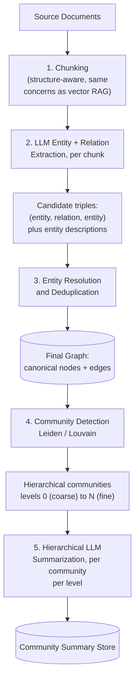
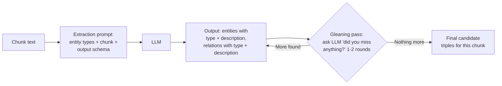
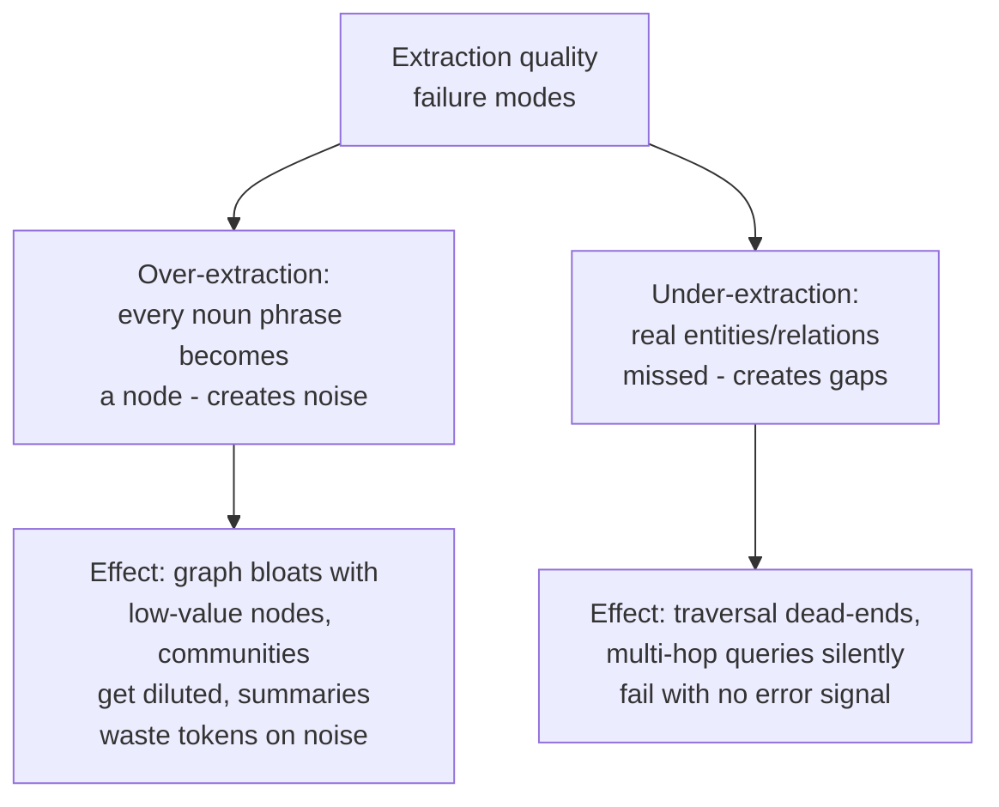
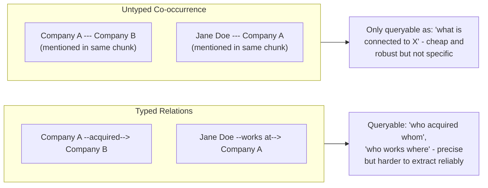
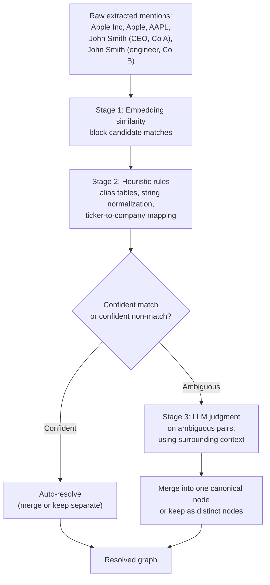
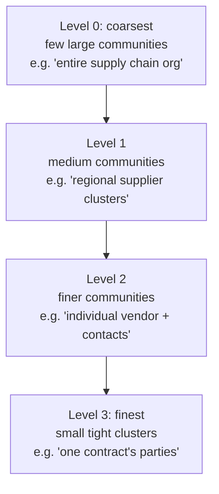
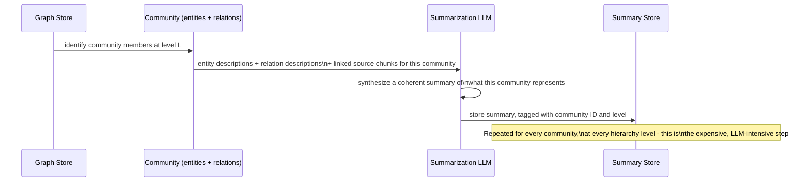
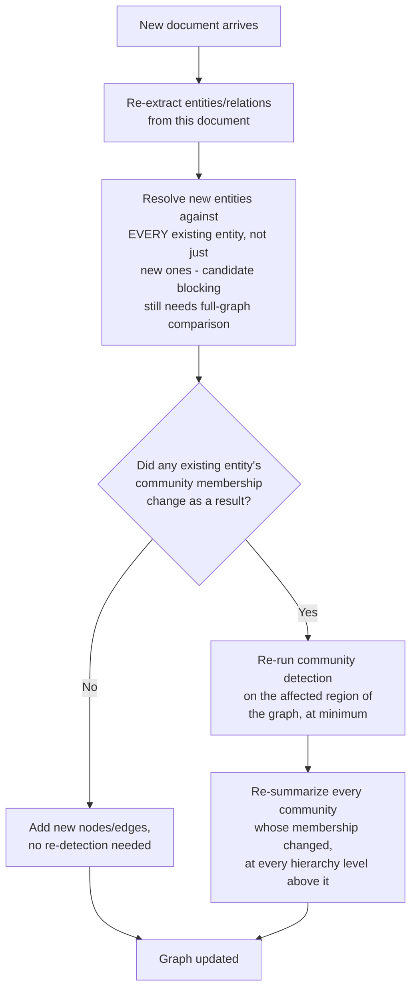
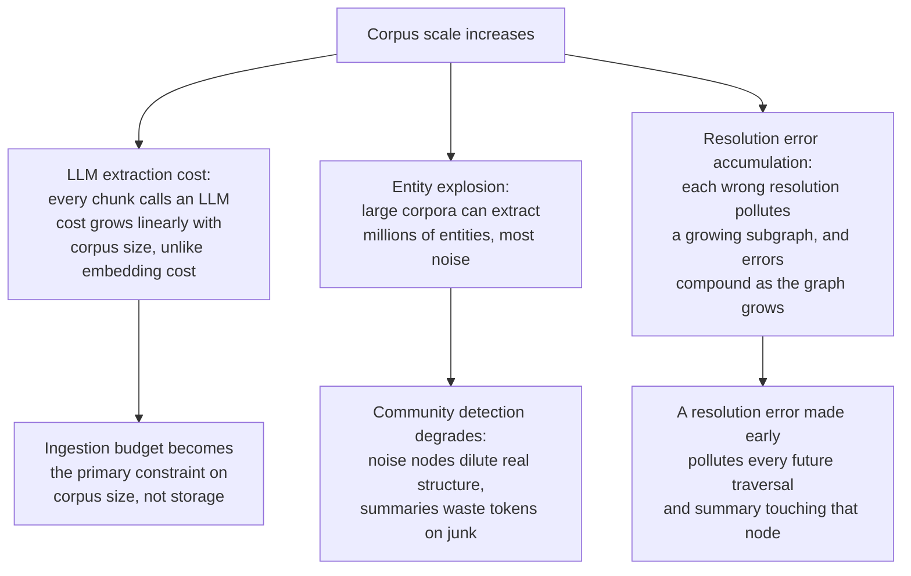
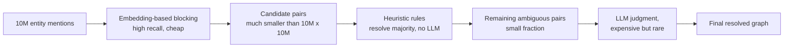

# Knowledge Graph Construction

## Overview

Knowledge graph construction is the offline pipeline that turns unstructured text into the entities, relations, and community summaries [GraphRAG Architecture](01-graphrag-architecture.md) queries against. It is the most complex and most failure-prone part of the entire GraphRAG stack — every downstream query, local or global, is only as good as the graph this pipeline produced, and unlike a vector index (where a bad embedding just retrieves poorly), a bad graph actively asserts wrong relationships as fact.

## The Extraction Pipeline

The pipeline runs in five stages, each with its own failure surface: chunk text, extract candidate entities and relations with an LLM, resolve duplicate mentions into canonical nodes, detect communities, and summarize each community hierarchically.

Every stage after chunking is LLM-intensive, and errors compound downstream: an over-extracted entity in stage 2 becomes a dangling low-value node in stage 3, pollutes a community's membership in stage 4, and gets baked into a summary in stage 5 that then serves every future global-search query touching that community. There is no stage where a quality problem stays local to that stage.

## Entity Extraction

### What to extract

The extraction target has to be decided deliberately, not left implicit, because it determines both the LLM prompt design and the resulting graph's shape:

- **Named entities** (people, organizations, products, locations) — the most common default; well-suited to structured domains like enterprise or legal corpora where the entities of interest are concrete, nameable things.
- **Domain-specific typed entities** — biomedical corpora extract genes, drugs, diseases; financial corpora extract companies, instruments, events; legal corpora extract parties, statutes, filings. Constraining extraction to a fixed type schema produces a cleaner, more queryable graph than open-ended extraction, at the cost of missing anything outside the schema.
- **Open-domain noun phrases / concepts** — Microsoft's original GraphRAG approach leans toward broader, less schema-constrained extraction (entities and claims), trading some precision for not missing entities that don't fit a predefined type list.

### Prompt patterns

Extraction prompts converge on a common shape regardless of domain: give the LLM the chunk text, a fixed (or open) list of entity types to look for, and an explicit output schema (JSON, or a delimited tuple format), and ask it to also emit a short description for each entity, since a bare name ("Apple") is not enough signal for later resolution or summarization — the description is what a resolution step and a community summarizer actually read.

A **gleaning pass** — re-prompting the model on the same chunk with "did you miss any entities or relations?" for one or two rounds — is a common, cheap way to recover extractions the first pass missed, at the cost of extra LLM calls per chunk; most implementations cap this at 1-2 rounds since returns diminish fast.

### Extraction quality sets the ceiling for the whole system

This is the single most important fact about GraphRAG construction: **no amount of clever local search, global search, or query routing compensates for a graph that extracted the wrong entities or missed the right relations.** Vector RAG has a similar ceiling (retrieval quality bounds generation quality), but GraphRAG's ceiling is set earlier and is harder to recover from, because a missing entity doesn't just mean one query misses one chunk — it means that entity is structurally absent from every future traversal, every community it should have belonged to, and every summary that should have mentioned it.

### Common extraction errors

- **Over-extraction** happens when the extraction prompt is too permissive (no type constraint, low bar for what counts as an "entity") — a chunk of prose can yield dozens of low-value nodes ("the company," "last year," "the report"), which bloats the graph, dilutes community structure (real clusters get connected through noise nodes that shouldn't be bridges), and wastes tokens when a community summarizer reads through them.
- **Under-extraction** happens when the prompt or model misses genuine entities or relations — often domain-specific terminology the model doesn't recognize as an entity type, or relations implied across sentences rather than stated in one. This creates silent gaps: a multi-hop query that should traverse through a missed relation simply finds no path, with no error to signal that the graph is incomplete rather than the query being unanswerable.

## Relation Extraction

### Typed relations vs. untyped co-occurrence

- **Typed relations** ("works at," "acquired by," "contradicts," "authored") make the graph precisely queryable — "show me every acquisition" is a graph query over edges of type `acquired`, not a text search. But typed extraction is harder to get reliably right: the model has to correctly classify the relation type, which is a strictly harder task than just noticing two entities co-occurred, and a fixed relation-type schema misses relation kinds nobody anticipated.
- **Untyped co-occurrence edges** (two entities appeared in the same chunk, therefore connected) are cheap and robust to extract — they degrade gracefully to "these things are related somehow" even when the LLM can't confidently classify *how*. But they support only the vaguest queries ("what's connected to X") and cannot answer anything that depends on the relation's specific meaning ("who acquired whom" is unanswerable from an untyped edge that just says "Company A and Company B co-occurred").
- **The tradeoff in practice**: most production systems extract typed relations where the LLM is confident, and fall back to an untyped or low-confidence-typed edge rather than dropping the relation entirely — an imprecise edge that says "these are related" is still useful for traversal even if it can't answer "how," whereas dropping it entirely creates the same silent traversal gap as under-extraction.

## Entity Resolution and Deduplication

This is where most production knowledge graph pipelines break. The same real-world entity is mentioned in dozens of different surface forms across a corpus — "Apple Inc.," "Apple," "AAPL," "the company" (in context) — and all of these must resolve to one canonical node. At the same time, superficially similar mentions that are *not* the same entity — "John Smith (CEO)" and "John Smith (engineer)" at a different company — must **not** be merged, or the graph asserts a false identity that then pollutes every relation either John Smith is connected to.

### Implementation approach

1. **Embedding similarity as a candidate-blocking step** — embed each entity's name plus description, and treat pairs above a similarity threshold as *candidates* for merging, not automatic merges. This is a recall step (cast a wide net) not a precision step; embedding similarity alone will happily suggest "John Smith (CEO)" and "John Smith (engineer)" as candidates, which is fine at this stage since nothing has been merged yet.
2. **Heuristic rules to resolve the easy cases cheaply** — exact-alias tables (a maintained "AAPL → Apple Inc." mapping), string normalization (case, punctuation, legal suffixes like "Inc."/"Corp."), and structural signals (same entity type, overlapping relations to the same third parties) resolve a large fraction of candidate pairs without needing an LLM call at all.
3. **LLM judgment for the ambiguous remainder** — for candidate pairs heuristics can't confidently resolve either way, an LLM call given both entities' full context (surrounding text, existing relations, descriptions) makes the final call. This is the most expensive step per-pair but is reserved for a small fraction of candidates by design, since stages 1-2 should have already resolved the unambiguous majority.

### Why this is where pipelines break

Resolution errors are asymmetric in a specific way: a **false merge** (incorrectly combining two distinct entities) is worse than a **false split** (failing to merge two mentions of the same entity), because a false merge actively corrupts the graph — every relation either of the two real entities had now appears to belong to one conflated node, polluting traversal results and community membership for both original entities going forward. A false split just means the graph has redundant nodes and slightly reduced recall, a strictly milder failure. Production resolution logic should be tuned to bias against merging when uncertain, accepting some redundant nodes as the safer failure mode.

## Community Detection

### Algorithms

- **Louvain** — a fast, widely-used modularity-optimization algorithm; greedily merges nodes into communities that maximize the density of within-community edges relative to between-community edges. Simple, well-understood, but can produce unstable results (different community assignments on re-runs) on graphs with many equally-good partitions.
- **Leiden** — an improvement on Louvain that fixes a known flaw (Louvain can produce internally disconnected "communities"); guarantees well-connected communities and is more stable across re-runs. This is the algorithm Microsoft's GraphRAG uses by default, and is the practical default for production use.
- **Connected components** — the simplest possible grouping (nodes reachable from each other via any path form one group); useful as a first-pass sanity check or for graphs too sparse for modularity-based clustering to find meaningful structure, but produces far coarser and less semantically meaningful groupings than Leiden/Louvain on any reasonably dense graph.

### What "community" means here

A community is a cluster of entities with denser mutual relations to each other than to the rest of the graph — not a manually-defined category, but an emergent structural property the algorithm discovers. In an enterprise knowledge graph, a community might turn out to be "everyone and everything connected to Project X" without anyone having tagged it that way; the algorithm finds it because those entities happen to be more densely interconnected with each other than with the rest of the graph.

### Hierarchical community structure

Communities are detected hierarchically (typically levels 0-3, coarse to fine), by recursively re-running detection within each already-found community. This gives global search a granularity dial: a broad "what are the major themes" question is answered from level-0 or level-1 summaries (fewer, larger communities, less detail each), while a more specific corpus-wide question ("what do different vendor clusters say about payment terms") is answered from level-2 or level-3 summaries (many, smaller communities, more specific detail each).

## Hierarchical Community Summarization

For each community at each level, an LLM reads all the text associated with that community's member entities (their descriptions, their relations, and often the source chunks those were extracted from) and writes a natural-language summary. This is the single step that makes global search possible at all — without it, "what are the corpus's themes" has no pre-built answer to read, only raw text that would need to be synthesized at query time.

### What happens when summaries are stale or wrong

A stale or wrong community summary degrades global search silently — there is no query-time error, just a subtly or badly wrong answer that looks as confident as a correct one. If a community's member entities have changed (new documents added, entities merged or split) since the summary was last built, the summary describes a version of that community that no longer exists, and every global-search query touching that community inherits the staleness with no signal that anything is wrong. This is the graph-construction analogue of the staleness failure mode in [RAG Failure Modes](../06-rag/03-rag-failure-modes.md#staleness-index-lag-vs-source-of-truth), and needs the same discipline: a freshness SLO per community (time since member entities changed vs. time since last summarized), not an assumption that "we rebuild periodically" is sufficient on its own.

## Incremental Updates vs. Full Rebuilds

Adding one new document to an already-built graph is deceptively expensive to do correctly, because it isn't a localized operation — it potentially touches every stage of the pipeline:

Every step in that chain is expensive relative to vector RAG's equivalent (re-embedding one new chunk is a single cheap API call). Resolution alone requires comparing new entities against the *entire* existing entity set, not just other new entities. Detecting whether community membership changed, and re-summarizing every affected community at every level above it in the hierarchy, is the most expensive part — a single new document that happens to bridge two previously-separate communities can trigger re-summarization cascading up multiple hierarchy levels.

### The practical shortcut

Because correct incremental updates are this expensive, the practical default in production is **batch-rebuild on a schedule (commonly nightly) and accept staleness within that window**, rather than attempting fully correct incremental updates on every document arrival. This mirrors the batch-vs-event-driven ingestion tradeoff in ordinary RAG, but the stakes are higher here because a stale *community summary* silently degrades every future global-search query touching it, not just answers about the one changed document.

- **When batch-rebuild is acceptable**: content that changes on a daily-or-slower cadence (policy documents, research corpora, most enterprise knowledge bases) where a within-day staleness window doesn't materially affect answer quality.
- **When it's not acceptable**: corpora with high-velocity, high-stakes updates — e.g., a live incident-response knowledge graph where "which systems does the compromised vendor also touch" needs to reflect an edge added an hour ago, not last night. For these, a narrower incremental path is worth the engineering cost: incrementally add nodes/edges immediately (cheap), but defer expensive re-summarization to a more frequent-but-still-batched cadence (e.g., hourly) rather than attempting fully synchronous re-summarization on every write.

## Scale Failure Modes

- **LLM extraction cost at corpus scale** — vector RAG's ingestion cost (embedding) is roughly linear in corpus size but cheap per unit; GraphRAG's ingestion cost (generative extraction) is also roughly linear but at a much higher per-unit cost, since every chunk requires a generative LLM call rather than a single embedding forward pass. At real corpus sizes (millions of chunks), this cost difference is the dominant practical constraint on how much of a corpus can be graph-ingested at all, and often forces a decision to graph-ingest only a curated subset of the corpus rather than everything.
- **Entity explosion** — a large corpus, especially with a permissive extraction prompt, can produce millions of entities, the overwhelming majority of which are low-value noise (over-extraction at scale). This degrades community detection (real clusters get bridged or diluted by noise nodes) and inflates summarization cost (summarizing communities that are mostly junk wastes both LLM spend and the eventual summary's usefulness).
- **Resolution error accumulation** — each incorrect resolution decision (a false merge or a missed merge) doesn't stay contained; it pollutes the subgraph around it, and as the graph grows, a small constant error rate per resolution decision compounds into a meaningfully corrupted graph region over millions of entities. This is why the false-merge-avoidance bias in resolution logic (see [Entity Resolution](#entity-resolution-and-deduplication)) matters more at scale than it might seem to at small-corpus prototype size.

## Evaluation

Knowledge graph quality is measured across three dimensions, each with its own practical challenge:

| Dimension | What it measures | Practical challenge |
|---|---|---|
| **Entity precision and recall** | Against a human-labeled set of entities that *should* have been extracted from a sample of documents | Ground-truth labeling for graphs is expensive and slow — labeling "every entity in this document" requires domain expertise and is far more labor-intensive than labeling "is this chunk relevant to this query" for vector RAG eval |
| **Relation accuracy** | Whether extracted relations are correct (both that the relation exists and that its type is correct) | Harder to label than entities alone — a labeler has to judge both "are these two entities actually related" and "is the extracted relation type the right one," compounding the labeling cost |
| **Community coherence** | Whether a detected community actually represents a meaningful, interpretable cluster rather than an algorithmic artifact | No ground truth exists at all for "correct" communities in most corpora — evaluation typically falls back to human spot-checking a sample of communities for interpretability, or proxy metrics like modularity score, neither of which directly measures whether the community is *useful* for answering real queries |

The overarching practical challenge is that **ground-truth labeling for graphs is expensive in a way vector RAG eval is not**: a vector RAG eval set needs (query, relevant chunk) pairs, which a domain expert can label reasonably quickly by reading a query and scanning a handful of candidate chunks. A graph eval set needs a labeler to read whole documents and enumerate every entity and relation that should have been extracted — an order of magnitude more labor per document. In practice, most production teams settle for a smaller, carefully-labeled sample (enough to catch systematic extraction problems, not exhaustive coverage) combined with LLM-as-judge scoring of extraction quality on a larger unlabeled sample, accepting that this is a weaker signal than the sample-based ground truth but far cheaper to run continuously.

## Production Best Practices

- Bias entity resolution against false merges — a redundant node is a milder failure than a corrupted one, and errors compound at scale.
- Cap gleaning passes (1-2 rounds) — returns diminish fast and cost grows linearly with every additional pass.
- Track community summary freshness as an explicit SLO per community, not an assumption that a nightly rebuild is automatically sufficient.
- Default to batch-rebuild on a schedule; only invest in true incremental updates when the corpus's update velocity and query stakes genuinely require it.
- Constrain extraction to a domain-relevant entity/relation type schema where possible — open-ended extraction trades precision for recall in a way that usually isn't worth it outside of exploratory/research use.
- Build a smaller, carefully human-labeled eval sample plus LLM-as-judge scoring at scale, rather than either skipping evaluation or attempting exhaustive ground-truth labeling.

## Interview Questions

### Beginner

**Q: What are the five stages of the knowledge graph construction pipeline, in order?**
Chunking, LLM entity and relation extraction, entity resolution/deduplication, community detection, and hierarchical community summarization. Each stage's output feeds the next, and a quality problem in an early stage (especially extraction and resolution) propagates through every later stage.

**Q: Why is entity resolution described as "where most production knowledge graph pipelines break"?**
Because the same real entity appears under many surface forms ("Apple Inc.," "Apple," "AAPL"), and correctly merging all of them into one node — while *not* merging genuinely distinct entities that happen to share a name — is a hard judgment call at scale. Getting it wrong in either direction pollutes the graph: a false merge corrupts every relation either original entity had, and it's the single hardest step to get fully automated and reliable.

### Intermediate

**Q: Why are typed relations more useful but harder to extract than untyped co-occurrence edges?**
Typed relations ("acquired," "works at") make the graph precisely queryable — you can ask "show me every acquisition" as a structured graph query. But correctly classifying the relation type is a strictly harder task for an LLM than just noticing two entities appeared together, and a fixed type schema will miss relation kinds nobody anticipated. Untyped co-occurrence edges are cheap and robust to extract but only support vague "what's connected to X" queries, not anything depending on the specific nature of the relationship.

**Q: Why is a false merge in entity resolution worse than a false split?**
A false split (failing to merge two mentions of the same entity) just leaves redundant nodes in the graph — a mild, recoverable inefficiency. A false merge (incorrectly combining two distinct entities into one node) actively corrupts the graph: every relation either of the two real entities had now appears to belong to one conflated node, polluting traversal results and community membership for both original entities going forward, and that corruption compounds as more relations get added to the wrongly-merged node.

### Senior

**Q: Design an entity resolution pipeline that balances accuracy against LLM cost at a corpus scale of 10 million extracted entity mentions.**
Use a three-stage funnel so the expensive step only runs on a small fraction of candidates. Stage 1: embed each entity mention's name plus description and use approximate nearest-neighbor search to generate candidate pairs above a similarity threshold — this is a cheap, high-recall blocking step, not a final decision. Stage 2: apply heuristic rules (exact alias tables, string normalization, legal-suffix stripping, structural signals like shared relations to the same third party) to auto-resolve the large fraction of candidate pairs that are unambiguous — this should dispose of the majority of candidates without any LLM call. Stage 3: send only the remaining ambiguous pairs (a small fraction of the original 10 million, ideally low single-digit percent) to an LLM with full context (surrounding text, existing relations) for a final judgment call. Bias the LLM's judgment prompt and the overall pipeline toward false splits over false merges given the asymmetric cost of each error. Track the auto-resolution rate and periodically sample-audit both auto-resolved and LLM-resolved pairs to catch systematic errors before they compound.

**Q: How would you decide whether a corpus needs true incremental graph updates or can rely on nightly batch rebuilds?**
Weigh update velocity against query stakes. If the corpus changes slowly (daily or slower) and queries tolerate answers reflecting yesterday's state, nightly batch rebuild is the correct engineering tradeoff — true incremental updates (re-resolve against the whole graph, detect membership changes, re-summarize cascading communities) are expensive enough that building them for a workload that doesn't need sub-day freshness is wasted engineering effort. If the corpus updates rapidly and high-stakes queries need current state (e.g., an active incident-response graph where a newly-added compromised-vendor edge must be traversable within the hour), invest in a narrower incremental path: add nodes/edges immediately since that part is cheap, but batch the expensive re-summarization step at a shorter-but-still-batched interval (hourly, not real-time) rather than attempting fully synchronous updates on every write, which would make every document ingestion pay the cost of potentially cascading re-summarization.

### Staff

**Q: You inherit a GraphRAG system where global search quality has been silently degrading for months. Diagnose the likely causes and design a monitoring system that would have caught this earlier.**
Silent global-search degradation almost always traces back to community summary staleness or upstream extraction/resolution drift, not a bug in the search algorithm itself, because global search just reads whatever summaries exist — it has no way to know they're wrong. Check, in order: (1) community summary freshness — compare each community's last-summarized timestamp against the last-modified timestamp of its member entities' source documents; a growing gap here is the most common root cause. (2) Entity/relation count trends — a flatlining extraction count on a growing document corpus suggests silent extraction failures (a broken connector, a prompt regression, a model deprecation on the extraction LLM); a spiking count suggests extraction noise creeping in. (3) Resolution auto-resolve rate — a rising rate of pairs falling through to expensive LLM-judgment (or being force-auto-resolved due to cost pressure) signals resolution quality drift. (4) Community detection stability — re-running detection and diffing community assignments against the previous run's assignments catches cases where the graph has drifted structurally in a way that's silently invalidating the hierarchy summaries were built against. The monitoring system this implies: a scheduled reconciliation job (analogous to vector RAG's index-freshness reconciliation) that computes and alerts on all four signals on a fixed cadence, rather than waiting for a user to notice a wrong or oddly incomplete corpus-wide answer — because unlike a vector RAG retrieval miss, a stale global-search answer looks exactly as confident and well-formed as a correct one, with zero query-time signal that anything is wrong.

## Google-Level Follow-Ups

- "Your extraction LLM provider silently updates their model and extraction quality drops 15% overnight with no error thrown. How do you detect this before a user does?" — probes for extraction-quality regression monitoring (tracking entity/relation counts, type distribution, and a small continuously-scored eval sample) as a first-class signal, not an assumption that model providers won't change behavior underneath a pinned API.
- "A single ambiguous entity resolution decision early in your pipeline's history turns out to have been a false merge. How do you find and fix everything downstream that was affected, six months later?" — probes whether the candidate has a story for provenance tracking (which relations, community memberships, and summaries trace back to the wrongly-merged node) versus treating the graph as an unauditable black box once built.
- "How would your answer to 'batch rebuild vs. incremental update' change if the corpus were multi-tenant, with different tenants updating at wildly different velocities?" — probes for per-tenant freshness SLOs and partitioned rebuild scheduling rather than a single global rebuild cadence that either over-serves slow tenants or under-serves fast ones.

## Common Mistakes

- **Using a permissive, unconstrained extraction prompt** — produces entity explosion and noisy communities; a domain-relevant type schema is almost always worth the recall tradeoff.
- **Treating entity resolution as a one-shot embedding-similarity threshold** — without a heuristic and LLM-judgment layer for ambiguous cases, this either merges too aggressively (false merges) or misses too much (redundant nodes), with no way to tune the two error types independently.
- **Attempting fully synchronous incremental updates by default** — the true cost of correct incremental updates (re-resolve against the whole graph, detect cascading community membership changes, re-summarize affected communities at every level) is usually not justified until a corpus's update velocity and query stakes actually demand it.
- **No freshness tracking on community summaries** — a stale summary degrades global search with no query-time error, unlike a vector RAG retrieval miss which at least sometimes surfaces as an obviously irrelevant chunk.
- **Skipping evaluation because ground-truth graph labeling is expensive** — a small, carefully labeled sample plus continuous LLM-as-judge scoring is far better than no signal at all, and catches systematic extraction regressions before they compound.
- **Ignoring the asymmetry between false merges and false splits in resolution** — tuning resolution logic to minimize total error count rather than biasing against the more damaging error type lets rare-but-corrupting false merges through.

## Key Takeaways

- Extraction quality sets a hard ceiling on the entire system — no downstream cleverness in local search, global search, or routing compensates for entities that were never extracted or relations that were missed.
- Entity resolution is the single most failure-prone stage, and the fix is a funnel (embedding-based blocking, then heuristic rules, then LLM judgment on the ambiguous remainder), not a single similarity threshold.
- False merges in resolution are structurally worse than false splits, because they actively corrupt the graph rather than merely reducing recall — bias resolution logic accordingly.
- Community detection (Leiden preferred over Louvain for stability) produces a hierarchy, not a flat clustering, and that hierarchy is what gives global search a granularity dial between broad and specific corpus-wide queries.
- Hierarchical community summarization is the step that makes global search possible at all, and it is also the step most vulnerable to silent staleness — track summary freshness as an explicit SLO, not an assumption.
- True incremental graph updates are expensive enough (re-resolve against the whole graph, detect cascading membership changes, re-summarize affected communities) that batch-rebuild-and-accept-staleness is the correct default for most corpora, reserved as a shortcut rather than a compromise, until update velocity and query stakes genuinely require otherwise.

---

*Part of [GraphRAG](index.md) in the [AI System Design Notes](../index.md). Tracked in [BACKLOG.md](https://github.com/GyanendraChaubey/AI-System-Design-Notes/blob/main/BACKLOG.md). See also [GraphRAG Architecture](01-graphrag-architecture.md), [Chunking Strategies](../05-retrieval-systems/05-chunking-strategies.md), and [When GraphRAG Beats Vector RAG](03-when-graphrag-beats-vector-rag.md).*
