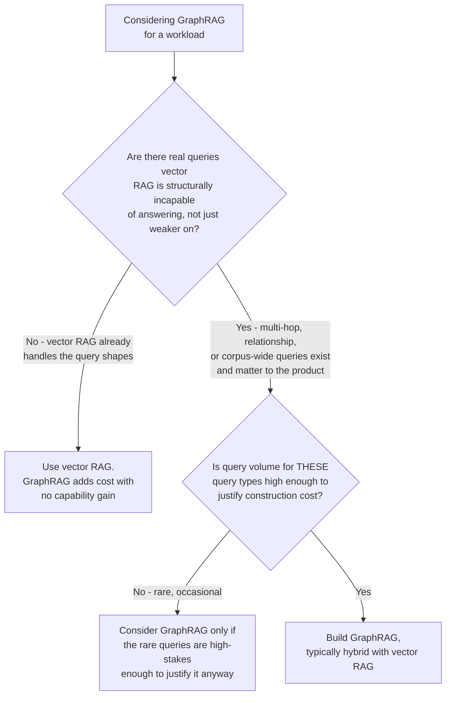
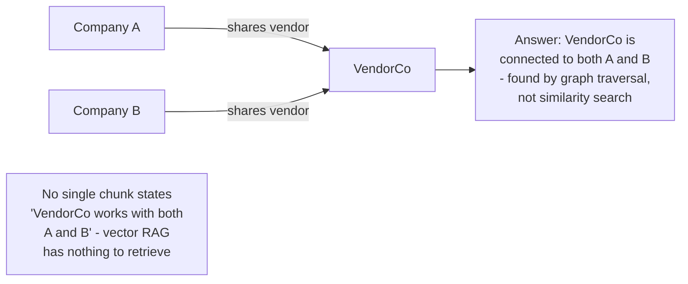
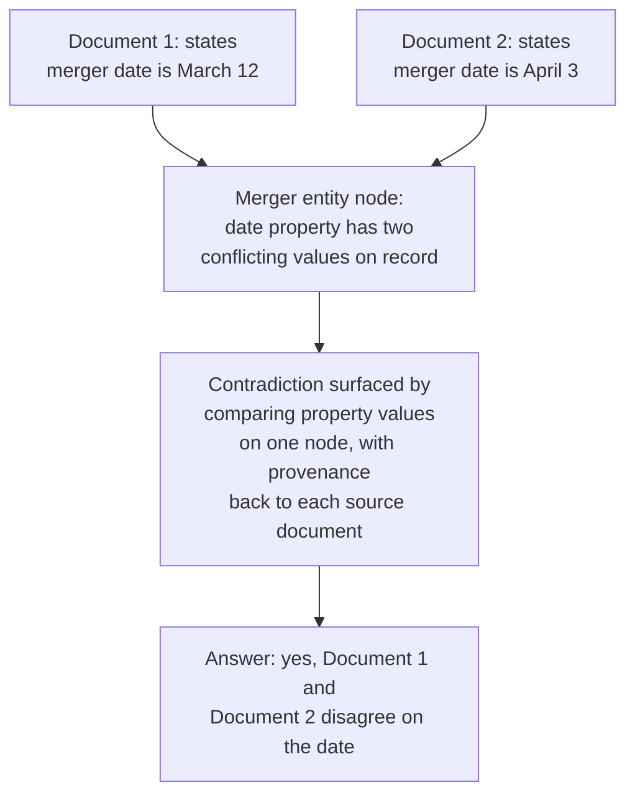
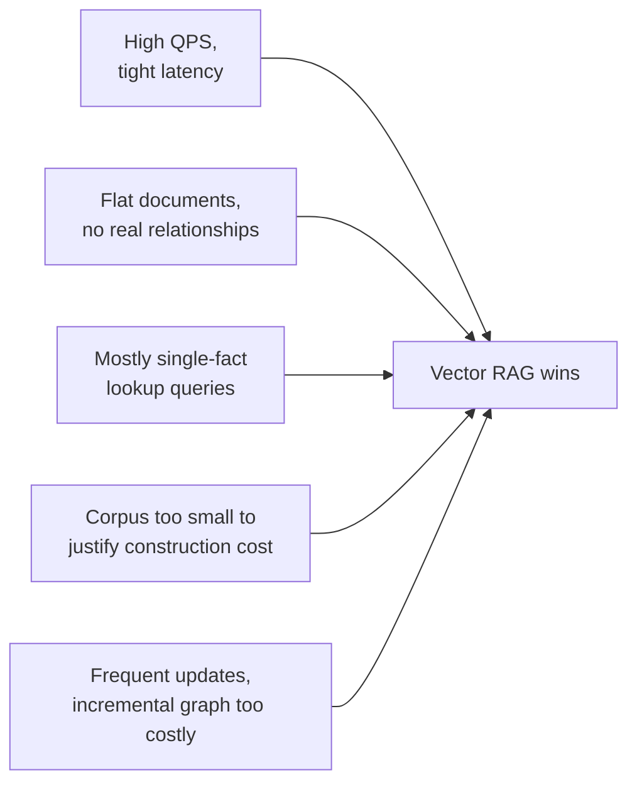
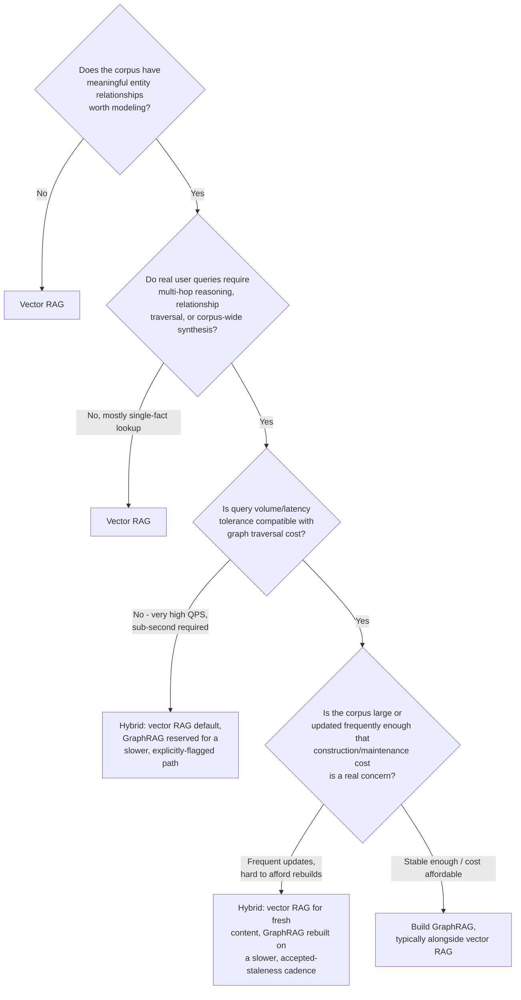
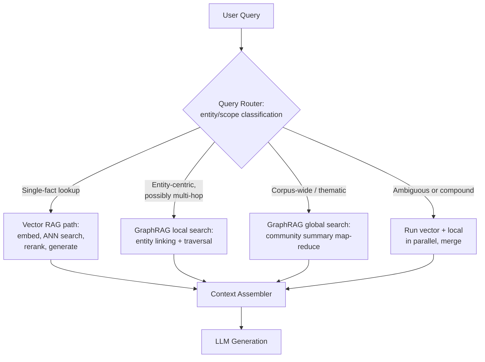
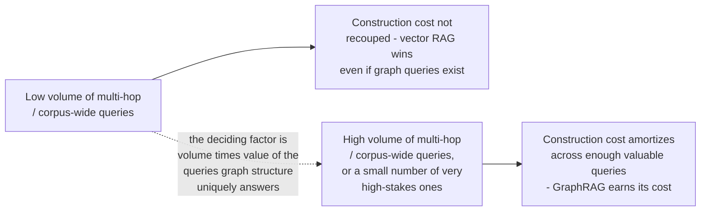
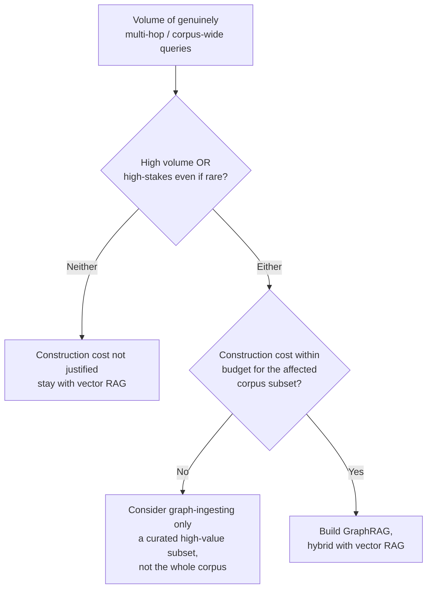

# When GraphRAG Beats Vector RAG

## Overview

GraphRAG requires significant extra construction cost — LLM-driven extraction on every chunk, entity resolution, hierarchical community summarization — and adds real operational complexity on top of an already-nontrivial vector RAG stack. This chapter is a decision framework: it exists to answer "should I build GraphRAG for this use case?" with a clear yes or no, not to make the case that GraphRAG is generally better.

## Definition

The decision between GraphRAG and vector RAG is not a quality contest — it is a question of whether a workload's query shape structurally requires graph traversal or corpus-wide synthesis that vector similarity search cannot produce at any amount of tuning, versus a workload where vector RAG already handles the query shape well and GraphRAG would only add cost and operational surface without a corresponding capability gain.

## The Core Question

Before considering GraphRAG, ask: **does this workload have queries that vector RAG is structurally incapable of answering, or does it have queries vector RAG merely answers less impressively than a graph would?** Only the former justifies GraphRAG's construction premium. It is easy to convince yourself a domain "has relationships" — most domains do, in some sense — but having relationships in the data is not the same as having *queries that require traversing them*. A support corpus about refund policies has entities (products, plan tiers) and implicit relationships (a plan tier has a refund rule), but if every real user query is a single-fact lookup ("what's the refund window for annual plans"), vector RAG answers it correctly and cheaply, and a graph adds nothing a well-tuned retriever wasn't already providing.

The majority of real-world RAG deployments are, and should remain, vector RAG — GraphRAG's use cases are specific and identifiable, not a strictly-better upgrade path every mature RAG system eventually needs.

## Where GraphRAG Uniquely Wins

These are cases where vector RAG is structurally incapable, not just qualitatively worse — no amount of chunking, reranking, or query rewriting closes the gap, because the failure is in what similarity search *is*, not how well it's tuned.

### Global / Thematic Queries

"What are the main research themes in this corpus?" or "summarize the key people and their relationships in this document set" ask about the corpus as a whole, not about a retrievable passage. There is no chunk that *is* the answer — the answer is an emergent property of many documents together. Vector RAG's only lever is stuffing more chunks into context, which runs into cost, latency, and lost-in-the-middle limits long before it approximates a genuine corpus-wide synthesis. GraphRAG answers this natively via global search over pre-built community summaries (see [GraphRAG Architecture](01-graphrag-architecture.md#global-search-community-summarization)).

### Multi-Hop Reasoning

"Who is connected to both Company A and Company B?" or "what drugs interact with both drug X and drug Y?" require following relationship chains — the answer is the entity (or entities) that sit at the intersection of two traversal paths, not a passage that mentions both facts together (which may not exist anywhere in the corpus as a single piece of text).

### Relationship Queries

"How does entity A relate to entity B?" is a graph traversal question — find the path (direct edge or short chain) connecting two named entities — not a similarity search question. Vector RAG can sometimes get lucky if a single chunk happens to state the relationship directly, but it has no mechanism to *find* a relationship that spans multiple documents or that must be inferred by walking a chain of shorter relationships.

### Contradiction Detection Across Documents

"Do any documents disagree about the merger date?" requires comparing claims from multiple documents that discuss the same entity (the merger) but were written independently and may not be similar enough to each other to be retrieved together by embedding similarity — two documents both about "the merger" can state contradictory dates while being topically close enough that a vector retriever returns them for the same query, but nothing in vector RAG's architecture is built to *compare* claims across the retrieved set for contradiction. GraphRAG's entity-anchored structure (all mentions of "the merger" and its associated date property, across every source document, attached to one node) makes this comparison mechanical rather than something the generator has to notice unprompted.

## Where Vector RAG Wins

Don't build GraphRAG for these — the construction premium buys nothing:

| Signal | Why vector RAG wins |
|---|---|
| **High query volume, tight latency** | Graph traversal (entity linking, multi-hop expansion) and community lookups are slower and costlier per query than ANN search at scale; vector RAG's query path is simpler and has a much lower latency floor |
| **Flat documents, no meaningful entity relationships** | If the corpus is genuinely just documents (FAQ pages, isolated articles) without cross-document entity relationships worth modeling, there's no graph structure to exploit — building one anyway is pure overhead |
| **Mostly single-fact lookups** | "What is our refund policy?" is answered better and more cheaply by a well-tuned vector retriever than by graph traversal, which adds latency and complexity for no accuracy gain on this query shape |
| **Corpus too small to justify construction cost** | Below some corpus size, the LLM extraction and summarization cost isn't recouped by enough query volume or query complexity to matter — a small corpus's relationships can often just be hardcoded or handled by a much simpler structured-metadata approach |
| **Frequent updates required** | Incremental vector indexing (re-embed one changed chunk) is far cheaper and simpler than incremental graph maintenance (re-resolve against the whole graph, detect community membership shifts, re-summarize cascading communities — see [Knowledge Graph Construction](02-knowledge-graph-construction.md#incremental-updates-vs-full-rebuilds)) |

## The Decision Framework

## Hybrid Architecture

The pattern used in Microsoft's own GraphRAG implementation, and the practical default for nearly every production deployment that adopts GraphRAG at all, is **not** graph-only — it's vector RAG for local factual lookup plus GraphRAG for global/multi-hop, with a router deciding which path (or combination) a given query needs.

This is the same conditional-routing principle that governs [Advanced RAG Patterns](../06-rag/04-advanced-rag-patterns.md#decision-framework-which-pattern-fixes-which-failure): pay for the more expensive capability only on the traffic that actually needs it. In a hybrid system, the vector path typically absorbs the large majority of query volume (single-fact lookups are the most common query shape in most real products), and the graph paths handle a smaller but higher-value slice of traffic where they're the only thing that produces a correct answer at all.

## Cost Comparison

### Construction cost

| Cost driver | Vector RAG | GraphRAG |
|---|---|---|
| Per-chunk ingestion | One embedding call — cheap, non-generative, roughly $0.02-0.13 per 1M tokens | One generative LLM extraction call per chunk — orders of magnitude more expensive per token processed than an embedding call |
| Per-community cost | N/A | One generative LLM summarization call per community, per hierarchy level — this cost has no vector RAG equivalent at all |
| Update cost | Re-embed the single changed chunk | Re-extract, re-resolve against the full existing entity set, potentially re-detect communities, potentially re-summarize cascading communities |

The practical rule of thumb: GraphRAG's construction cost per million tokens of corpus is substantially higher than vector indexing's, because every chunk requires a full generative LLM pass (extraction) rather than a single embedding forward pass, and communities require an additional generative summarization pass with no vector RAG equivalent at all.

### Query cost

| Query type | Vector RAG cost | GraphRAG cost |
|---|---|---|
| Single-fact lookup | Cheap: one embedding + ANN search + optional rerank | N/A structurally handled by vector path in hybrid systems, or comparable cost via local search if graph-only |
| Multi-hop / relationship | Cannot answer correctly, or only by luck | Moderate: entity linking (LLM) + graph traversal (fast) |
| Corpus-wide / thematic | Cannot answer at all without full-corpus stuffing (expensive, slow, unreliable) | Moderate-to-high: map-reduce over pre-built summaries, but no raw-text re-read — cheaper than it looks because the expensive work was pre-paid at ingestion |

### Break-even analysis

The break-even question is not "does GraphRAG produce better answers" (it usually does, on the query types it's suited for) — it's "does the volume and value of queries that specifically need multi-hop/relationship/corpus-wide reasoning justify the construction premium over vector RAG." A handful of occasional analyst queries against a small corpus rarely clears that bar; a compliance or biomedical research product where multi-hop relationship queries are the core value proposition usually does.

## Real-World Use Cases

| Domain | Why GraphRAG fits | Example query |
|---|---|---|
| **Biomedical literature** | Drug-disease-gene relationships are the actual object of study; multi-hop interaction queries are the primary query shape, not an edge case | "What drugs interact with both this gene target and this comorbid condition?" |
| **Enterprise knowledge** | Org charts, project relationships, and expertise graphs are inherently relational; "who knows about X and who do they report to" is a traversal question | "Who on the infra team has worked with the vendor that also supplies Project Y?" |
| **Legal discovery** | Who-knew-what-when across thousands of documents is fundamentally a multi-hop, entity-and-timeline question that a single-document retrieval can't answer | "Which custodians were copied on communications mentioning both the merger and the compliance review?" |
| **Financial analysis** | Company-person-event networks (who sits on which boards, which entities co-invested, who was involved in which event) are graph-shaped by nature | "Is there a shared board member between Company A and any of its recent acquisition targets?" |

These four domains share a pattern: the relationships between entities are not incidental to the data, they *are* the object of the analysis, and the queries that matter most are structurally multi-hop or corpus-wide — the exact conditions under which GraphRAG's construction premium is worth paying.

## Tradeoffs

| Advantages of GraphRAG | Disadvantages of GraphRAG |
|---|---|
| Answers multi-hop and relationship queries vector RAG structurally cannot | Construction cost is substantially higher — generative LLM calls per chunk and per community, not one cheap embedding call per chunk |
| Enables corpus-wide synthesis queries with no vector RAG equivalent at all | Incremental updates are expensive and complex; most systems fall back to batch rebuilds with accepted staleness |
| Entity-anchored structure makes contradiction detection and provenance tracing mechanical rather than something the generator has to infer unprompted | Query-time latency for graph paths (entity linking, traversal, map-reduce over summaries) is higher than a tuned vector ANN lookup |
| Hierarchical community summaries give a tunable granularity dial for corpus-wide questions | Adds a new operational surface: graph store, community detection jobs, summarization pipelines, all needing their own monitoring |
| Pairs naturally with vector RAG in a hybrid architecture, not an either/or choice | Extraction and resolution quality set a hard ceiling that's harder to recover from than a vector RAG retrieval miss (see [Knowledge Graph Construction](02-knowledge-graph-construction.md)) |

## Common Mistakes

- **Building GraphRAG because the domain "has relationships"** — nearly every domain has relationships in the data; the deciding factor is whether real queries require *traversing* them, not whether relationships exist.
- **Replacing vector RAG entirely instead of running hybrid** — the majority of real query volume in most products is single-fact lookup, which vector RAG answers better and cheaper; discarding it forces easy queries through a more expensive path.
- **Underestimating incremental update cost** — teams frequently plan for GraphRAG assuming updates work like re-embedding a changed chunk, then discover resolution, community re-detection, and re-summarization cascade far more expensively than expected.
- **Skipping the break-even analysis** — building GraphRAG for a small number of occasional multi-hop queries without weighing whether their volume and value justify the construction premium.
- **Ignoring query volume when choosing GraphRAG for a high-QPS, low-latency product** — graph traversal and community lookup costs don't disappear at scale; a hybrid path that reserves graph queries for a smaller, explicitly-routed slice of traffic is usually necessary.
- **Assuming GraphRAG is a strict upgrade path every mature RAG system eventually needs** — it is a targeted architecture for specific query shapes, not a maturity milestone; many well-built, mature RAG systems correctly never need it.

## Interview Questions

### Beginner

**Q: In one sentence, when should you choose GraphRAG over vector RAG?**
When real user queries require multi-hop reasoning across entities, explicit relationship traversal, or corpus-wide synthesis — query shapes vector similarity search is structurally incapable of answering, not just weaker at.

**Q: Give an example of a query vector RAG can answer well and one it cannot answer at all.**
"What is our refund policy for enterprise plans?" is a single-fact lookup vector RAG handles well. "What are the main themes across this 50,000-document research corpus?" has no single retrievable passage that answers it — vector RAG has nothing to retrieve that constitutes the answer, since the theme is an emergent property of the whole corpus.

### Intermediate

**Q: A team says "our corpus has lots of entities and relationships, so we should build GraphRAG." What follow-up question exposes whether this is the right call?**
Ask what the actual user queries look like, not what the data looks like — specifically, do real queries require *traversing* those relationships (multi-hop, "how does A relate to B," corpus-wide synthesis) or are they mostly single-fact lookups that happen to be about entities? Having relationships in the data is necessary but not sufficient; if every real query is answerable from a single chunk, the relationships in the data are irrelevant to what the system actually needs to do, and vector RAG already handles it.

**Q: Why does a hybrid architecture (vector RAG plus GraphRAG) outperform an all-graph approach in most production systems?**
Because most real query volume is single-fact lookup, which vector RAG answers faster and more cheaply than graph traversal — forcing all traffic through graph paths pays graph-level latency and cost on queries that never needed it. A hybrid router sends the majority of traffic through the cheap vector path and reserves the more expensive graph paths (local traversal, global community summarization) for the smaller slice of queries that structurally need them, which is both cheaper in aggregate and matches each query to the retrieval mechanism actually suited to it.

### Senior

**Q: Walk through the break-even analysis for deciding whether GraphRAG's construction cost is justified for a given corpus and query mix.**
Start from the two things that actually drive the decision: the volume of queries that are structurally multi-hop/relationship/corpus-wide (not just "could theoretically benefit," but genuinely unanswerable by vector RAG), and the value of getting those queries right — some domains have low volume of such queries but each one is high-stakes (e.g., a compliance "who else was connected to this event" query), which can still justify the cost even at low volume. Weigh that against construction cost: a generative LLM call per chunk for extraction plus a generative call per community per hierarchy level for summarization, which is substantially more expensive per token of corpus than vector RAG's single embedding call per chunk. If the corpus is large and queries needing graph structure are rare, the construction premium isn't recouped. If the corpus is any size and multi-hop/corpus-wide queries are either high-volume or high-stakes-even-if-rare, the premium is justified — and in nearly every real case, it's justified for a *subset* of the corpus or query mix, which argues for hybrid rather than graph-only.

**Q: A stakeholder asks why you didn't just increase context window size and stuff the whole corpus instead of building GraphRAG for corpus-wide queries. How do you respond?**
Long-context stuffing (see [RAG Architecture](../06-rag/01-rag-architecture.md#when-long-context-replaces-retrieval)) works when the corpus fits affordably in a context window and is stable — but a 50,000-document research corpus is nowhere close to fitting even a multi-million-token window at any reasonable cost, and stuffing everything into every corpus-wide query would mean re-paying that massive input-token cost on every single request. GraphRAG's community summarization does the expensive "read the whole corpus" work once, at ingestion time, and every future query reads cheap pre-built summaries instead of re-processing raw text — this is the same amortization principle that makes an index better than re-scanning a database on every query. Long-context stuffing and GraphRAG aren't really competing solutions to the same problem: stuffing is for a corpus small and stable enough to fit affordably; GraphRAG is for a corpus too large for that, where the "read everything" cost needs to be paid once and reused.

### Staff

**Q: Design a phased rollout plan for introducing GraphRAG into an existing, mature vector RAG product, minimizing risk to the existing system.**
Phase 1: instrument the existing vector RAG system's query logs to classify real production queries by shape (single-fact vs. multi-hop vs. corpus-wide/thematic) without building any graph infrastructure yet — this validates whether the volume/value of graph-needing queries is real before investing in construction, rather than building GraphRAG on a hypothesis. Phase 2: if the data justifies it, graph-ingest a curated, high-value subset of the corpus (not the whole thing) to bound construction cost and validate extraction/resolution quality on a manageable scale, with its own eval set per [Knowledge Graph Construction](02-knowledge-graph-construction.md#evaluation). Phase 3: add the query router as a new component in front of the existing vector RAG path, defaulting every query to the existing (proven) vector path and only routing the queries confidently classified as multi-hop/corpus-wide to the new graph paths — this means a bug in the new graph system degrades only a small, clearly-scoped slice of traffic, never the majority path that was already working. Phase 4: expand graph coverage incrementally (more of the corpus, more query types routed to it) only as monitoring (community freshness, extraction quality, resolution error rate) shows the new system is healthy at each stage, treating graph coverage expansion the same way a careful team treats a risky migration — incrementally, with rollback at every stage, never a single cutover.

## Google-Level Follow-Ups

- "Your GraphRAG construction cost estimate assumed extraction quality would stay constant as corpus size grew 10x. What actually changes, and how does it affect the break-even analysis?" — probes for understanding that entity explosion and resolution error accumulation (see [Knowledge Graph Construction](02-knowledge-graph-construction.md#scale-failure-modes)) degrade quality nonlinearly at scale, meaning the break-even analysis has to account for rising *marginal* cost per unit of quality, not just linear extraction cost scaling.
- "A competitor claims their product 'uses GraphRAG' but you suspect it's just vector RAG with extra metadata filters. What would you check to tell the difference?" — probes for understanding the specific capabilities that distinguish real graph-structured retrieval (genuine multi-hop traversal, pre-built community summaries answering corpus-wide questions) from metadata filtering dressed up in graph terminology, and whether the candidate can identify the query types that would expose the difference.
- "You've built a hybrid system, but the router's classification accuracy for 'does this query need graph search' is only 80%. What's the failure mode of the remaining 20%, and how do you bound its damage?" — probes for reasoning about asymmetric misrouting costs (sending a graph-needing query down the vector path silently produces an incomplete answer with no error; sending a simple query down the expensive graph path wastes cost but doesn't produce a wrong answer) and whether the candidate would bias the router's uncertain cases toward the safer failure mode.

## Key Takeaways

- GraphRAG is justified by query shape, not by data shape — having relationships in the corpus is not sufficient; real queries must require traversing them.
- The four query classes GraphRAG uniquely wins on are global/thematic synthesis, multi-hop reasoning, relationship traversal, and cross-document contradiction detection — all four are structurally unanswerable by similarity search, not just harder for it.
- Vector RAG remains the right choice for the majority of real-world workloads: high-volume single-fact lookup, flat corpora, tight latency budgets, small corpora, and frequently-updated content all favor it.
- The break-even decision weighs the volume and value of genuinely graph-needing queries against a substantially higher construction cost (generative LLM calls per chunk and per community, versus one cheap embedding call per chunk in vector RAG).
- Hybrid architecture — vector RAG for the bulk of single-fact traffic, GraphRAG for the smaller slice of multi-hop/corpus-wide queries, routed by query classification — is the practical default in nearly every real deployment, not an either/or choice.
- Biomedical literature, enterprise knowledge graphs, legal discovery, and financial analysis are the recurring real-world domains where relationships between entities *are* the object of the analysis, making GraphRAG's construction premium worth paying.

---

*Part of [GraphRAG](index.md) in the [AI System Design Notes](../index.md). Tracked in [BACKLOG.md](https://github.com/GyanendraChaubey/AI-System-Design-Notes/blob/main/BACKLOG.md). See also [GraphRAG Architecture](01-graphrag-architecture.md), [Knowledge Graph Construction](02-knowledge-graph-construction.md), [RAG Architecture](../06-rag/01-rag-architecture.md), and [Agentic RAG Architecture](../08-agentic-rag/01-agentic-rag-architecture.md).*
