# Iterative Retrieval & Self-Correction

## Overview

[Agentic RAG Architecture](01-agentic-rag-architecture.md) established that retrieval is a tool the model calls, and that the model decides when it has enough evidence to stop. This chapter is about the mechanics of that decision: how a system actually determines "enough," what happens when it decides evidence is insufficient, how it decides what to search for next, what it does when sources disagree, and — the production-critical part — how it guarantees the loop terminates at all. This is the decision logic underneath the architecture, not a restatement of it.

## Definition

Iterative retrieval and self-correction is the set of mechanisms by which an agentic RAG system evaluates the sufficiency of retrieved evidence before generating a final answer, reformulates its retrieval query when evidence is judged insufficient, reconciles retrieved content that conflicts across sources, and enforces stopping criteria that guarantee the retrieval loop terminates — with an honest, bounded degradation path — even when sufficient evidence is never found.

## Problem Statement

Giving a model the ability to retrieve again doesn't automatically make it good at knowing *when* to. Three concrete failure patterns show why the decision logic itself needs to be engineered, not assumed:

- **False confidence on incomplete evidence.** A model can read three chunks that are topically on point and confidently decide it has enough, when the question actually required a fourth fact none of the three chunks contain — the failure isn't that retrieval didn't run again, it's that the sufficiency check itself was wrong.
- **Reformulation that doesn't actually change anything.** A naive "try again" instruction often produces a paraphrase of the same query, which retrieves the same (insufficient) chunks again — burning an iteration with zero information gain, and repeating that pattern until a step budget is exhausted.
- **No natural stopping point on a genuine coverage gap.** If the answer truly isn't in the corpus, every reformulation will return something insufficient, and a system with no hard stopping criteria will iterate until a step or cost ceiling force-stops it — the question is whether that ceiling exists at all, and what the system says when it fires.

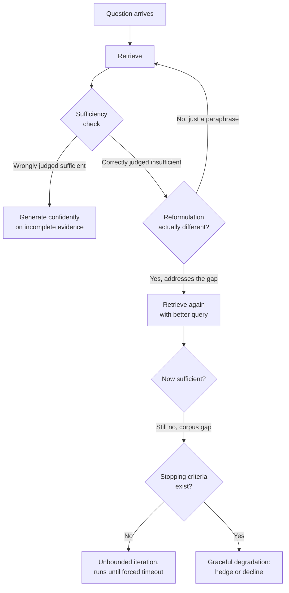

## Why This Architecture Exists

[Advanced RAG Patterns](../06-rag/04-advanced-rag-patterns.md) introduced Self-RAG and Corrective RAG at the level of "the model critiques its own evidence and re-retrieves if needed" — enough to motivate why the pattern exists, not enough to build it correctly. Two research efforts formalized the missing detail. Asai et al.'s **Self-RAG** (2023) made the sufficiency decision explicit and trainable rather than an ad-hoc prompt, via reflection tokens the model emits as part of generation. **Corrective RAG (CRAG)** took a narrower, more operational angle: treat the sufficiency check as a scored classifier decision with an explicit threshold, and give the system a concrete fallback (web search) rather than just "try again" when the internal corpus's evidence scores low.

Both are responses to the same underlying gap: "critique your own evidence" is not a specification, it's a slogan. Actually building it requires answering exactly the questions this chapter covers — what does sufficient mean operationally, how is the check implemented cheaply enough to run every iteration, what triggers a reformulation versus a source switch versus giving up, and what hard guarantees exist so the whole thing terminates. This chapter is the engineering answer to those questions.

## Core Concepts

- **Sufficiency check** — the evaluation, run before generation, of whether retrieved evidence is complete, non-contradictory, and relevant enough to answer the question.
- **Reflection tokens** — Self-RAG's mechanism for making retrieval and critique decisions explicit, structured outputs rather than implicit reasoning: `[Retrieve]`, `[IsRel]`, `[IsSup]`, `[IsUse]`.
- **Relevance threshold** — CRAG's scored cutoff for whether internally retrieved evidence is good enough to use as-is, trigger augmentation, or be discarded in favor of a web search fallback.
- **Reformulation trigger** — the specific signal (temporal mismatch, over-generality, missing entity) that determines *how* a query should change, not just that it should.
- **Multi-source reconciliation** — the logic applied when evidence from different sources or different retrieval iterations disagrees.
- **Stopping criteria** — the combination of iteration count, quality threshold, timeout, and convergence signals that guarantee loop termination.
- **Cheap sufficiency check** — a non-frontier-model or non-LLM classifier used to make the sufficiency decision affordable to run on every iteration.

## The Sufficiency Check

### What "sufficient" actually means

"Is this enough to answer the question" is really three separable judgments, and conflating them is why naive sufficiency checks underperform:

- **Completeness** — does the retrieved context contain every fact the question requires, not just some of them? A question asking for a comparison between two things needs both sides present; evidence for only one side is incomplete even if it's perfectly relevant.
- **Non-contradiction** — do the retrieved chunks agree with each other? Two chunks that are both relevant but state different numbers for the same fact (an old and a current pricing page) are not sufficient evidence even though both individually pass a relevance bar — the system has evidence, but not *resolved* evidence.
- **Relevance** — is the retrieved content actually about the question asked, as opposed to topically adjacent? This is the same failure mode as [retrieval distraction and query-context semantic mismatch](../06-rag/03-rag-failure-modes.md#retrieval-distraction-wrong-chunks-retrieved-right-chunk-crowded-out) from static RAG, but here it's being actively checked rather than silently passed through to generation.

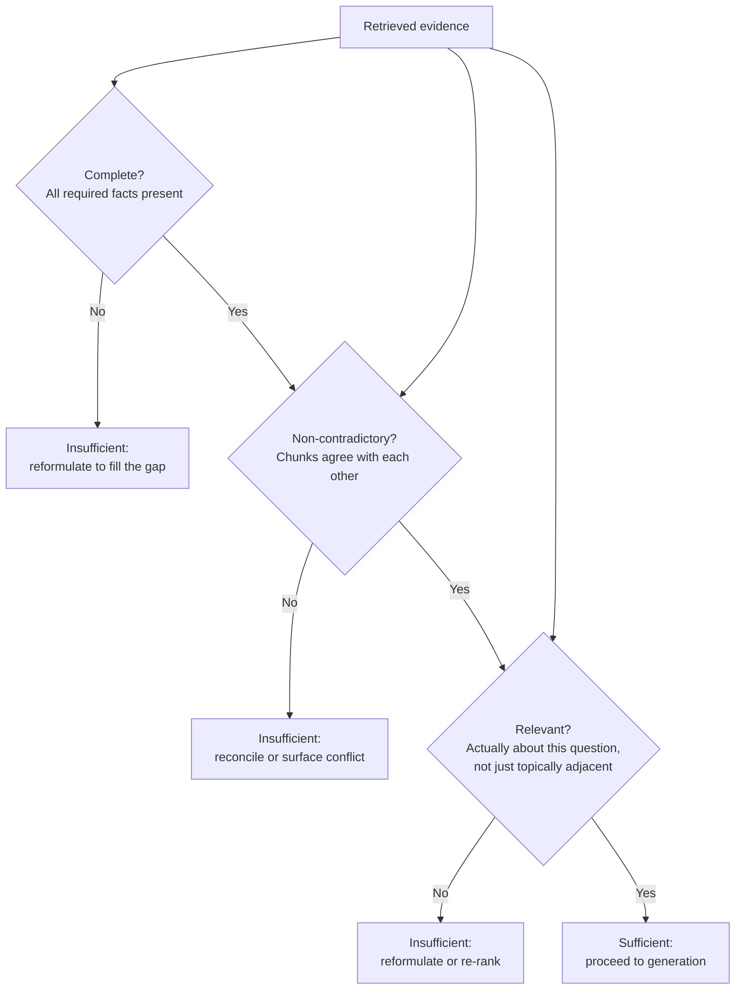

### How the check is implemented

Three implementation strategies, in increasing order of cost and decreasing order of speed:

- **Explicit LLM call.** A dedicated prompt — "Given this question and this retrieved context, is the context sufficient to answer completely and without contradiction? If not, state what's missing." — run as a separate step after retrieval and before generation. Most accurate, most expensive: it's a full extra model call per iteration.
- **Folded into chain-of-thought.** The same judgment made as part of the generating model's own reasoning trace before it commits to a final answer, rather than as a separate call — cheaper (no extra round trip) but harder to audit and easier for the model to skip under time/token pressure, since there's no forcing function requiring the judgment to actually happen.
- **A lightweight, non-LLM classifier.** A small trained model (or even a heuristic — retrieval score distribution, chunk-count-above-threshold, keyword overlap) that makes a coarse sufficient/insufficient call cheaply, escalating only ambiguous cases to a full LLM check. This is the production-favored approach at scale, covered further under Cost of Self-Correction below.

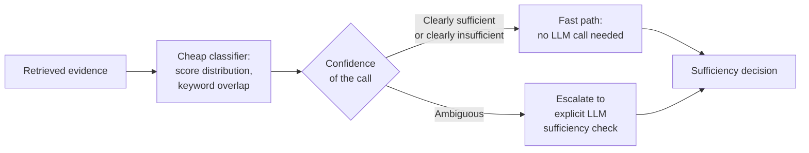

## Self-RAG in Detail

### The canonical formalization

Self-RAG (Asai et al., 2023) is the formal version of the "critique your own evidence" idea gestured at in [Advanced RAG Patterns](../06-rag/04-advanced-rag-patterns.md#self-rag-corrective-rag). Rather than relying on free-form prompted reasoning to decide whether to retrieve and whether the result is good, Self-RAG trains the model to emit explicit **reflection tokens** as structured output interleaved with generation — turning a judgment call into an inspectable, trainable signal.

Four reflection tokens, each answering one narrow question:

- **`[Retrieve]`** — should I retrieve at all for this input? (Same retrieve-or-not decision covered under [Agentic RAG Architecture](01-agentic-rag-architecture.md#core-concepts), but here emitted as an explicit token rather than inferred from free-form reasoning.)
- **`[IsRel]`** — is this specific retrieved passage relevant to the query? Evaluated per-passage, not once for the whole retrieved set — this is the mechanism that catches the query-context semantic mismatch failure mode at the passage level.
- **`[IsSup]`** — is the generated segment actually supported by the cited passage? Evaluated after a segment of the answer is drafted, checking groundedness the same way [faithfulness checking](../06-rag/03-rag-failure-modes.md#context-hallucination-the-model-generates-beyond-what-was-retrieved) does in static RAG, but as an integral, trained part of generation instead of a bolted-on post-hoc pass.
- **`[IsUse]`** — is the resulting answer actually useful to the user, independent of whether it's supported? A fully-supported but unhelpful answer (technically correct, doesn't address what was actually asked) still fails this check.

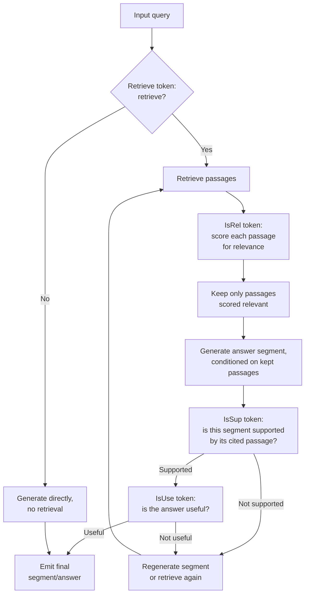

### Trained vs. prompted, and why it differs from ad-hoc checks

The critical engineering distinction: Self-RAG's original formulation **trains** a model (via a critic model generating labeled reflection-token data, then fine-tuning the target model to produce those tokens as part of its own output distribution) rather than relying on prompting a general-purpose model to "check if you have enough evidence" at inference time. This matters for three reasons:

- **Calibration.** A trained reflection token is a learned, calibrated signal correlated with actual downstream answer quality on held-out data. An ad-hoc prompted check ("is this sufficient? yes/no") has no such calibration guarantee — the model may say "sufficient" at a different accuracy rate than a trained classifier would, and that rate is unknown until measured.
- **Granularity.** `[IsRel]` is evaluated per-passage, and `[IsSup]` per-generated-segment — finer-grained than a single end-of-context "is this enough" judgment, which catches issues (one bad passage among five good ones, one unsupported sentence in an otherwise-grounded paragraph) that a single coarse check misses entirely.
- **Cost shape.** Because the tokens are part of the model's native output distribution rather than a separate call, a trained Self-RAG-style model produces its critique in the same forward pass as generation — no extra round-trip latency per check, unlike an explicit separate LLM sufficiency call.

The tradeoff is upfront cost and inflexibility: training reflection tokens into a model requires a labeled dataset and a fine-tuning run, and the resulting behavior is fixed to what was trained, unlike a prompted check that can be edited and iterated on in minutes. Most production agentic RAG systems use the **prompted, ad-hoc version** of this idea (an explicit "is this sufficient" LLM call, or reasoning folded into chain-of-thought) precisely because it's editable without a training run — Self-RAG's fully trained version is the more rigorous, better-calibrated, but higher-upfront-investment end of the same spectrum.

## Corrective RAG (CRAG)

### Adding a web-search fallback on low-confidence internal evidence

CRAG extends the sufficiency-check idea with a specific, concrete escape hatch: instead of only reformulating and re-querying the same internal corpus, it evaluates retrieved evidence with a scored relevance classifier and, when the score falls below a threshold, triggers a **web search** to supplement or replace the internal evidence before generation.

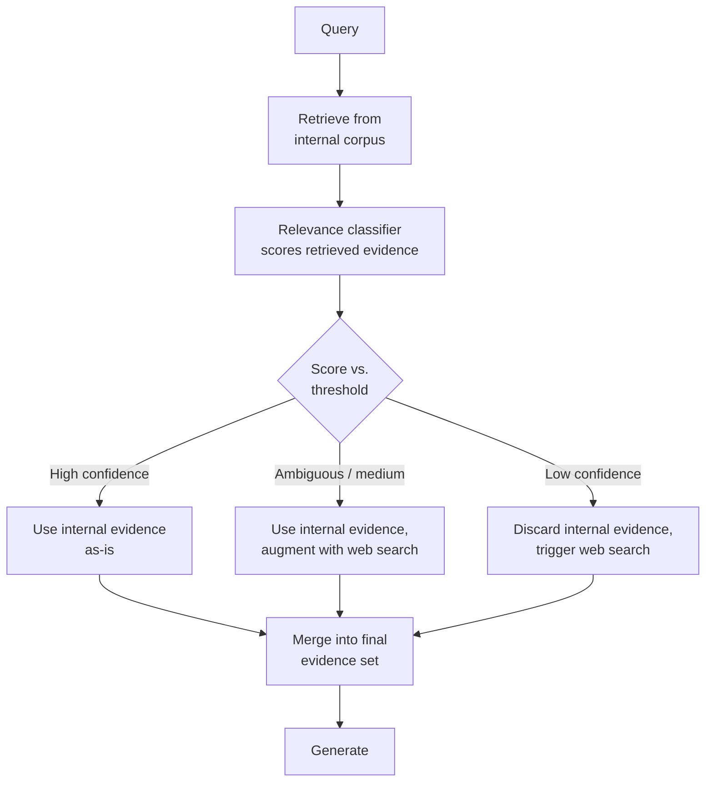

### The threshold-tuning problem

CRAG's design reduces to a single, consequential number: the relevance threshold. Getting it wrong in either direction has a distinct, measurable cost:

- **Threshold set too strict** (requiring very high relevance confidence to skip web search) → the system triggers web search far more often than actually necessary, adding 1-3+ seconds of latency per triggered fallback and pulling in external content that needs its own trust handling — excessive cost and latency on queries the internal corpus could have answered fine.
- **Threshold set too lenient** (accepting low-relevance internal evidence without triggering fallback) → the system proceeds to generation on evidence that's actually only weakly relevant, reintroducing the retrieval-distraction and semantic-mismatch failure modes CRAG exists to prevent — silently worse answers with no visible signal that anything went wrong.

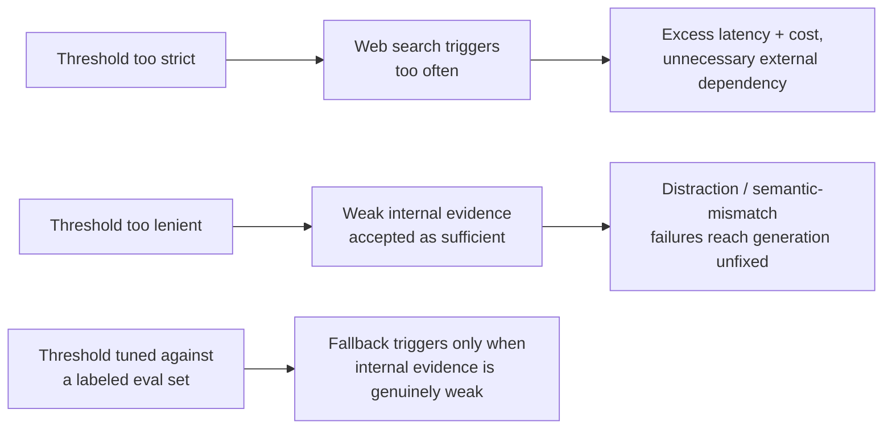

The threshold is not a constant to guess once — it should be tuned against a labeled eval set the same way any retrieval-quality parameter is (see [RAG evaluation](../06-rag/01-rag-architecture.md#monitoring)), and re-validated whenever the internal corpus, embedding model, or relevance classifier changes, since all three shift what "a good relevance score" actually looks like.

## Query Reformulation Triggers

### What signal drives what kind of reformulation

"Try a different query" is not one action — the right reformulation depends entirely on *why* the evidence was insufficient, and treating every insufficiency the same way (generic re-ask) is why naive re-retrieval loops often repeat the same mistake in different words.

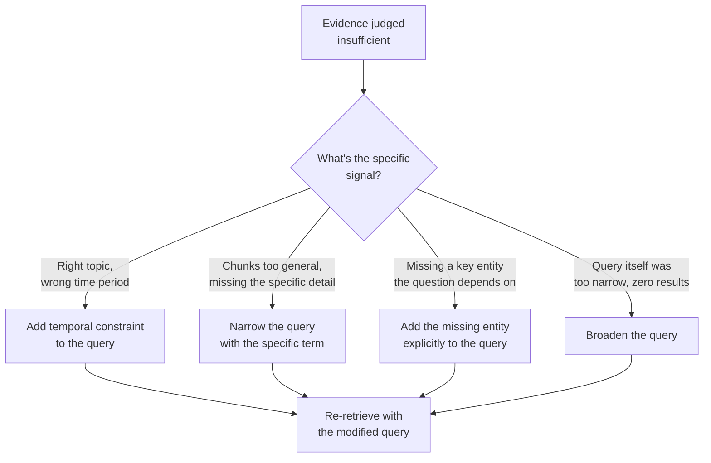

- **Right topic, wrong time period.** Retrieved chunks are clearly about the correct subject but describe an outdated or mismatched period (last year's pricing when the question is about current pricing) — the fix is adding an explicit temporal constraint to the query (a date range, "current," "as of [date]"), not a generic re-ask.
- **Too general.** Retrieved chunks describe the general topic but not the specific angle the question needs (a general overview chunk when the question needs a specific edge case or exception) — the fix narrows the query with the specific term the general chunks lack, mirroring the over-specific-vs-general tension from [step-back prompting](../06-rag/04-advanced-rag-patterns.md#step-back-prompting), applied in the opposite direction.
- **Missing a key entity.** The retrieved chunks are on-topic but don't mention an entity the question actually depends on (a specific product tier, a named individual, a specific clause) — the fix explicitly adds that entity to the query rather than rephrasing the whole thing.
- **Too narrow, zero or near-zero results.** The opposite failure — an overly specific query matched almost nothing — needs broadening, not narrowing.

### Avoiding reformulation loops

The practical risk with any reformulation step is producing a **paraphrase of the same query** rather than a genuinely different one — same intent, same missing signal, different words, same (insufficient) results. Concrete mitigations:

- **Require the reformulation step to name the specific gap it's addressing** (not just "try again," but "the previous query found general pricing info; this query adds the enterprise-tier qualifier that was missing") — forcing an explicit diagnosis makes a content-free paraphrase much harder to produce unnoticed.
- **Track query similarity across iterations** — if a new query's embedding or lexical overlap with a prior query in the same session is above a threshold, flag it as a likely non-productive reformulation and force a different strategy (switch retrieval tool, broaden instead of narrow, or terminate) rather than retrying.
- **Cap reformulation attempts per distinct gap type** — if temporal-constraint reformulation has already been tried and still returned insufficient evidence, trying it again with slightly different date phrasing rarely helps; escalate to a different mitigation strategy (multi-source reconciliation, or surfacing the gap directly) instead of repeating the same category of fix.

## Multi-Source Reconciliation

### When retrieved evidence disagrees

An agentic RAG system that retrieves from multiple sources (per [multi-tool retrieval](01-agentic-rag-architecture.md#multi-tool-retrieval)) will eventually retrieve genuinely conflicting facts — an internal doc says one thing, a web search says another, or two internal documents disagree because one is stale. This is a distinct problem from the non-contradiction check above (which detects that a conflict exists); reconciliation is about what to *do* once one is detected.

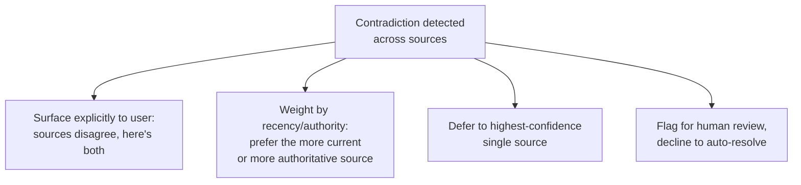

| Approach | How it works | Tradeoff |
|---|---|---|
| Surface the contradiction explicitly | Present both facts and their sources, let the user or downstream process judge | Most honest, but pushes resolution work onto the user — poor UX for a question expecting a single clean answer |
| Weight by recency or authority | Prefer the source with a newer timestamp, or a higher-trust tier (official policy doc over a forum post) | Fast and usually correct, but requires reliable metadata (timestamps, source-authority tiers) to actually work — garbage metadata makes this confidently wrong |
| Defer to highest-confidence source | Use the retrieval/relevance score itself to pick a winner | Simplest to implement, but conflates retrieval relevance (is this chunk about the question) with factual authority (is this chunk correct) — two different things a similarity score doesn't actually measure |
| Flag for human review | Decline to auto-resolve for high-stakes domains, route to a human | Highest cost and latency, appropriate only when an automatically-resolved wrong answer is more costly than a delay |

The production default for most systems: **weight by recency/authority when reliable metadata exists, surface explicitly when it doesn't** — silently picking a "highest similarity score" winner is the weakest option, because it resolves a factual conflict using a signal (topical similarity) that was never designed to measure factual correctness.

## Stopping Criteria

### The critical production problem

Everything above assumes the loop eventually converges. In production, it sometimes won't — the evidence genuinely isn't in any available source, and every reformulation still comes back insufficient. Without hard stopping criteria, this is not a theoretical edge case: it is a direct, unbounded cost and latency risk, identical in shape to the general [agent loop termination problem](../09-agents/01-agent-fundamentals-and-the-agent-loop.md#reliability) but specific to retrieval iteration.

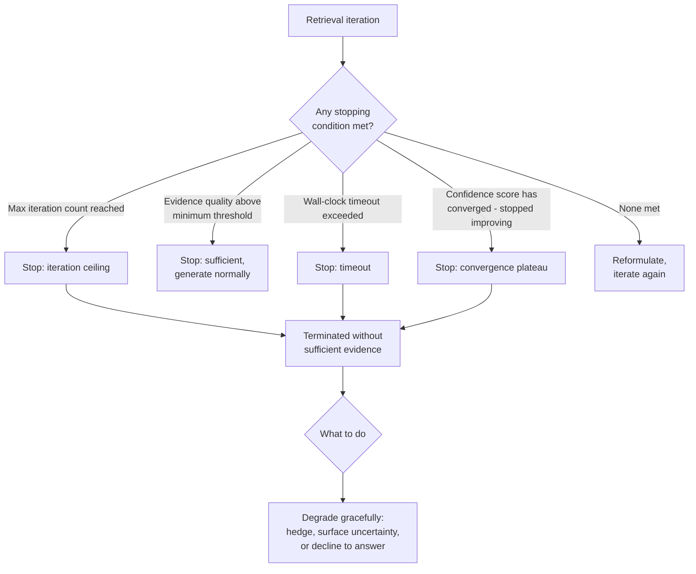

Four independent stopping conditions, all runtime-enforced, none dependent on the model volunteering to stop:

- **Maximum iteration count** — a hard cap (commonly 2-5, tuned per task class) on retrieval iterations, the direct analog of a [general agent loop's step budget](../09-agents/01-agent-fundamentals-and-the-agent-loop.md#components).
- **Minimum evidence quality threshold** — stop early (before the iteration cap) as soon as evidence clears the sufficiency bar, since more iterations beyond "already sufficient" only add cost with no quality benefit.
- **Timeout-based termination** — a wall-clock ceiling independent of iteration count, since some iterations (a slow web search fallback, a large graph traversal) can individually consume disproportionate time even within a low iteration count.
- **Confidence-score convergence** — if the sufficiency/relevance score across successive iterations stops improving (or gets worse), that's a signal the reformulation strategy has stopped helping and further iteration is unlikely to converge — a useful *earlier* stop than waiting for the hard iteration cap, since it can detect a stuck loop before it burns its full budget.

### What to do when the loop terminates without enough evidence

A terminated-without-sufficiency loop must not silently generate with the same confident tone as a fully-grounded answer. Concrete degradation options, in order of preference where product context allows:

- **Answer with explicit caveats** — state what is and isn't confirmed by the evidence gathered, rather than presenting a best-guess synthesis as settled fact.
- **Surface uncertainty directly** — "I found information about X but could not confirm Y" is more useful and more honest than a fluent answer that quietly guesses at Y.
- **Decline to answer** — for high-stakes domains (legal, medical, financial commitments), an explicit "I don't have enough verified information to answer this confidently" is the correct terminal state, not a fallback of last resort to be avoided.

## Cost of Self-Correction

### Every sufficiency check is an extra LLM call

A 5-iteration loop with an explicit sufficiency check at each step is not 5 LLM calls — it's closer to 10: one retrieval-decision-and-query-formulation call plus one sufficiency-check call per iteration, before even counting the final generation call. This compounds the [general iteration cost problem from Agentic RAG Architecture](01-agentic-rag-architecture.md#cost-and-latency-profile) with an additional, separate call per step specifically for the sufficiency judgment.

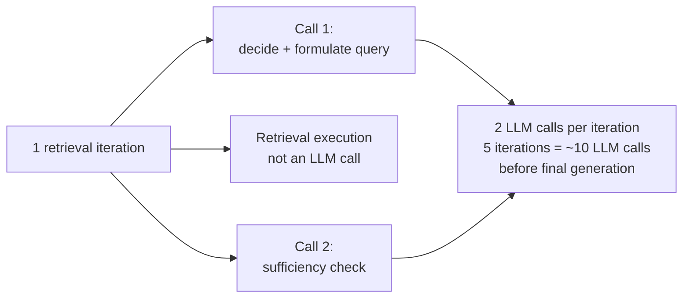

Making this tractable in production relies on the same three-tier strategy introduced under The Sufficiency Check, applied deliberately for cost rather than just latency:

- **Use a cheap or small model for the sufficiency check, not the frontier model.** The sufficiency judgment is a narrower, more constrained task (classify: sufficient or not, and why) than open-ended generation — a smaller, faster, far cheaper model is frequently accurate enough for this specific judgment, reserving the expensive model for final synthesis.
- **Batch multiple checks into one call where possible.** If several passages need an `[IsRel]`-style relevance judgment, scoring them together in one call (rather than one call per passage) amortizes the fixed per-call overhead across all of them.
- **Use a non-LLM classifier for the coarse pass, escalate only ambiguous cases.** As covered above, a trained lightweight classifier or even a heuristic (retrieval score distribution, keyword overlap) can resolve the clearly-sufficient and clearly-insufficient cases without any LLM call at all, sending only genuinely ambiguous cases to a full LLM check — this is the single highest-leverage cost lever, since most sufficiency decisions in practice aren't actually close calls.

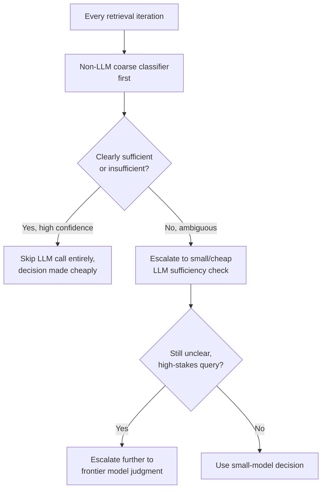

## Evaluation

Measuring whether self-correction is actually helping requires comparing against static RAG on the specific dimension it's meant to improve, not just "does the agentic system produce good answers":

- **Static vs. agentic answer quality on multi-hop questions specifically** — the comparison must use a multi-hop/compositional eval set (see [Agentic RAG Architecture's cost-vs-complexity framing](01-agentic-rag-architecture.md#cost-and-latency-profile)), since on single-hop questions the two architectures should perform similarly and that comparison proves nothing about self-correction's value.
- **Cost per correct answer, not just quality score.** A system that's 8% more accurate at 5x the cost may or may not be worth shipping depending on the product — track cost-per-correct-answer as a single combined metric so quality gains are never assessed in isolation from what they cost to achieve.
- **False-positive correction rate.** How often does the system re-retrieve when the first retrieval was already sufficient? Every unnecessary reformulation is pure added cost and latency with zero quality benefit — this rate is a direct measure of sufficiency-check precision, and a high one indicates the check itself is miscalibrated (too conservative), not that iteration is inherently expensive.

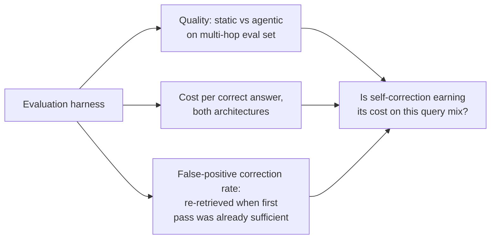

## Monitoring

- **Sufficiency-check outcome distribution** — sufficient-on-first-pass vs. required-reformulation vs. terminated-without-sufficiency, tracked over time; a rising terminated-without-sufficiency rate is a direct signal of corpus coverage gaps or a broken reformulation strategy.
- **Reformulation-loop detection rate** — how often the near-duplicate-query guard fires, the direct analog of general [agent loop-detection monitoring](../09-agents/01-agent-fundamentals-and-the-agent-loop.md#monitoring) applied to query similarity specifically.
- **CRAG threshold calibration drift** — periodically re-validate the relevance threshold against a labeled eval set, since embedding model updates, corpus changes, or classifier retraining can silently shift what a given score actually means.
- **Cost per sufficiency check, broken out from cost per iteration overall** — isolates whether cost growth comes from more iterations happening or the checks themselves getting more expensive.
- **False-positive and false-negative correction rates**, tracked as first-class metrics, not just inferred from aggregate cost — a false-negative (judged sufficient when it wasn't) is a silent quality failure that won't show up in cost metrics at all.

## Reliability

| Failure | Degradation strategy |
|---|---|
| Sufficiency check itself is wrong (false sufficient) | Sample production sessions for post-hoc faithfulness scoring; treat the check as a calibrated model requiring its own eval, not ground truth |
| Reformulation loop produces near-duplicate queries | Query-similarity guard forces a strategy change or termination rather than repeated retries |
| CRAG threshold miscalibrated | Scheduled re-validation against a labeled eval set whenever corpus, embedding model, or classifier changes |
| Multi-source conflict unresolved | Default to explicit surfacing when source metadata (recency, authority) is unreliable, rather than silently picking a similarity-score winner |
| Iteration ceiling hit with no sufficient evidence | Graceful degradation: hedge, surface uncertainty, or decline — never generate with unqualified confidence |
| Sufficiency-check cost balloons at scale | Coarse non-LLM classifier as the default path, LLM escalation only for ambiguous cases |

## Production Best Practices

- **Separate the sufficiency check from generation as its own auditable step**, whether that's an explicit call, a structured chain-of-thought segment, or a trained reflection token — an implicit, unlogged judgment inside free-form generation cannot be measured, calibrated, or debugged later.
- **Tune CRAG-style thresholds against a labeled eval set on a schedule**, not once at launch — corpus drift and embedding model updates silently shift what a given relevance score means.
- **Require reformulation to name the specific gap it addresses**, and enforce query-similarity checks across iterations, to prevent burning iteration budget on paraphrases that retrieve the same insufficient evidence again.
- **Default multi-source conflict resolution to explicit surfacing** unless recency/authority metadata is verified reliable — a silently-resolved wrong answer is worse than an honestly-surfaced disagreement.
- **Enforce every stopping criterion (iteration cap, timeout, quality threshold, convergence check) in the runtime**, and always pair a hit stopping criterion with a defined graceful-degradation response, never a bare failure.
- **Route sufficiency checks through a cheap classifier first**, escalating to an LLM only for ambiguous cases — this is the single highest-leverage lever for keeping self-correction's added cost from scaling linearly with iteration count.

## Real World Examples

- **Self-RAG's public release** (Asai et al.) demonstrated reflection-token training on open models, showing measurable gains on long-form QA and fact verification benchmarks specifically by making the retrieve/relevance/support/usefulness judgments explicit and trained rather than implicit — the reference implementation most production systems approximate with prompted equivalents.
- **Corrective RAG's web-search fallback pattern** is now a common production shape in enterprise assistants that combine an internal knowledge base with general web search — the internal-corpus-first, web-search-as-escape-hatch structure directly mirrors CRAG's threshold-triggered fallback.
- **Perplexity's and similar "deep research" products'** visible behavior of running several searches, sometimes explicitly stating "I found conflicting information" or refining a search after an initial one, is the externally observable signature of sufficiency-checking and reformulation loops operating in production at consumer scale.
- **Customer support and internal-knowledge assistants** that explicitly hedge ("I found information about X but couldn't confirm Y as of the most recent update") are exhibiting the graceful-degradation stopping-criteria pattern directly, rather than confidently guessing when evidence runs out.

## Interview Questions

### Beginner

**Q: What does "sufficient evidence" mean in an agentic RAG system, broken into its component parts?**
Three separate things have to be true: completeness (does the evidence contain every fact the question needs, not just some), non-contradiction (do the retrieved chunks agree with each other), and relevance (is the retrieved content actually about this specific question, not just topically similar). A sufficiency check that only looks at one of these — commonly just relevance — will miss incomplete or contradictory evidence that still looks "on topic."

**Q: Why can't a sufficiency check just be "ask the model if it has enough information"?**
Because that's an uncalibrated, ad-hoc judgment with no known accuracy rate — the model might say "sufficient" when it's actually missing a required fact, especially if the missing fact isn't salient in what was retrieved. Self-RAG's answer is to make this judgment an explicit, trained signal (the `[IsRel]`/`[IsSup]`/`[IsUse]` reflection tokens) rather than relying on unstructured self-assessment; the trained version has measurable calibration, the ad-hoc prompted version does not, until it's specifically evaluated.

### Intermediate

**Q: How does CRAG's web-search fallback decide when to trigger, and what happens if the threshold is wrong?**
CRAG scores retrieved internal evidence with a relevance classifier and compares the score to a threshold: above it, use the internal evidence as-is; in a middle band, use it but augment with a web search; below it, discard the internal evidence and rely on web search instead. If the threshold is too strict, the system triggers web search far more often than needed, adding real latency (seconds, not milliseconds) and an external-content trust dependency on queries the internal corpus could have handled. If it's too lenient, weakly relevant internal evidence gets accepted as sufficient, and the system proceeds to generation on evidence that's actually still distraction-prone — the exact failure CRAG exists to prevent, now happening silently.

**Q: A reformulation loop keeps retrieving the same insufficient chunks across three iterations even though the query text changes each time. What's likely going wrong, and how do you fix it?**
The reformulations are likely paraphrases carrying the same underlying retrieval signal rather than addressing a specific diagnosed gap — different words, same missing information. The fix is requiring each reformulation to name the specific insufficiency it's targeting (a missing entity, a temporal mismatch, over-generality) rather than issuing a generic "try again," and adding a query-similarity check across iterations that flags and blocks near-duplicate reformulations, forcing a genuinely different strategy (switch retrieval tool, broaden instead of narrow, or terminate) instead of another cosmetic rewording.

### Senior

**Q: Design the stopping criteria for a production iterative retrieval loop, and justify each one.**
Four independent, runtime-enforced conditions: a maximum iteration count as the hard ceiling regardless of anything else; a minimum evidence-quality threshold that stops early the moment evidence is judged sufficient, since continuing past that point only adds cost; a wall-clock timeout independent of iteration count, because some individual iterations (a slow fallback source) can consume disproportionate time even under a low iteration cap; and a confidence-score convergence check that detects when successive iterations have stopped improving evidence quality, allowing an earlier stop than the hard ceiling once the reformulation strategy is clearly not helping. None of these should depend on the model volunteering that it's done — that's a soft, un-calibrated signal — and every one of them, when it fires without evidence being judged sufficient, must route to a defined graceful-degradation response (hedge, surface uncertainty, or decline) rather than a bare timeout error.

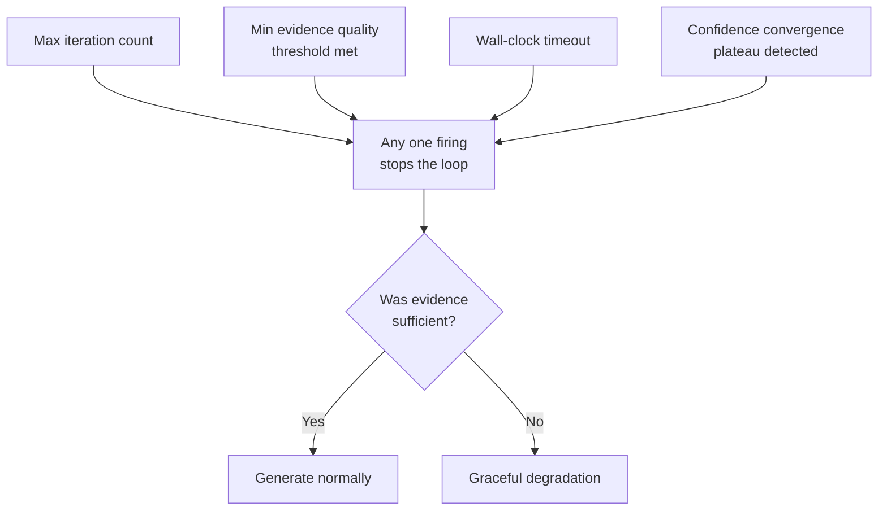

**Q: How would you distinguish, using only production telemetry, whether self-correction is genuinely improving answer quality versus just adding cost with placebo-level benefit?**
Track cost-per-correct-answer, not quality score alone, and compare it against a static RAG baseline specifically on a multi-hop/compositional eval set (not a generic one, since single-hop questions won't show a difference either way). Separately track the false-positive correction rate — how often the system re-retrieves when the first pass was already sufficient — because a high rate there means the sufficiency check is systematically too conservative, and the resulting extra iterations are pure overhead rather than genuine quality recovery. If quality on the multi-hop set is meaningfully higher and cost-per-correct-answer is still favorable after accounting for the false-positive rate, self-correction is earning its cost; if the quality delta is marginal but cost is multiplied, it's closer to a placebo that should be gated more conservatively (higher-confidence trigger threshold) rather than applied broadly.

## Google-Level Follow-Ups

- "Your sufficiency check has a 95% accuracy rate against a labeled eval set. Is that good enough to ship?" — probes whether the candidate considers the asymmetry of the two error types: a false-sufficient (judged enough when it wasn't) silently ships a wrong answer, while a false-insufficient (judged not-enough when it was) only costs an extra iteration —95% aggregate accuracy can hide a much worse false-sufficient rate specifically, which is the more dangerous error to under-measure.
- "How would you redesign the reformulation strategy if you discovered 80% of insufficiency cases were actually corpus coverage gaps, not bad queries?" — probes whether the candidate recognizes that no amount of query reformulation fixes a genuine coverage gap, and that the fix belongs upstream in ingestion monitoring (per [RAG Failure Modes](../06-rag/03-rag-failure-modes.md#coverage-gap-the-document-was-never-ingested)) rather than in ever-more-clever retrieval-loop logic — and whether they'd propose measuring this distinction directly rather than assuming reformulation is always the right lever.
- "Multi-source reconciliation defaults to 'weight by recency' in your design. What's the failure case for that default, and how do you catch it?" — probes for recognizing that recency is a proxy for correctness, not correctness itself — a newer document can be wrong (a bad edit, a draft that shouldn't have been indexed) while an older one is still accurate — and that catching this requires either authority-tier metadata beyond raw timestamps or sampled human review, not blind trust in "newest wins."

## Common Mistakes

- **Treating the sufficiency check as free** — it's a real LLM call (or trained-model inference) with its own cost and its own error rate; skipping calibration and evaluation of the check itself is the most common gap in production systems that "have Self-RAG" in name only.
- **Reformulating without diagnosing the specific gap** — generic "try again" instructions produce paraphrases that retrieve the same insufficient evidence, burning iteration budget with zero information gain.
- **Setting a CRAG-style threshold once and never revisiting it** — corpus changes, embedding model updates, and classifier retraining all shift what a given relevance score means; an untended threshold silently drifts out of calibration.
- **Resolving multi-source conflicts by trusting the highest similarity score** — similarity measures topical relevance, not factual correctness; using it to pick a winner in a factual disagreement conflates two different things.
- **No hard stopping criteria, relying on the model to know when to give up** — exactly the general agent-loop mistake of trusting a soft self-reported signal, applied to retrieval specifically, and just as capable of producing unbounded cost.
- **Generating with full confidence after a forced stop** — when the loop terminates without sufficient evidence, presenting the best-effort answer with the same tone as a fully-grounded one erases the one signal (uncertainty) that would let the user judge how much to trust it.

## Key Takeaways

- Sufficiency is three separable checks — completeness, non-contradiction, and relevance — not one; a check that only measures relevance will still pass incomplete or contradictory evidence.
- Self-RAG formalizes the critique step as explicit, trained reflection tokens (`[Retrieve]`, `[IsRel]`, `[IsSup]`, `[IsUse]`); most production systems use a prompted approximation of the same idea because it's editable without a training run, at the cost of weaker calibration guarantees.
- CRAG's web-search fallback reduces the sufficiency decision to a tunable threshold — a real, ongoing calibration problem, not a one-time setting, since the wrong threshold in either direction has a distinct, measurable failure mode.
- Effective reformulation requires diagnosing *why* evidence was insufficient (temporal mismatch, over-generality, missing entity) and targeting that specific gap — generic re-asking produces paraphrases that repeat the same failure.
- Multi-source contradictions should default to explicit surfacing or recency/authority weighting with verified metadata — never to picking a winner by similarity score alone, which was never designed to measure factual correctness.
- Hard, runtime-enforced stopping criteria (iteration cap, quality threshold, timeout, convergence check) are non-negotiable, and every one of them must pair with a defined graceful-degradation response — a loop that terminates without enough evidence should hedge or decline, never generate with unqualified confidence.

---

*Part of [Agentic RAG](index.md) in the [AI System Design Notes](../index.md). Tracked in [BACKLOG.md](https://github.com/GyanendraChaubey/AI-System-Design-Notes/blob/main/BACKLOG.md).*
