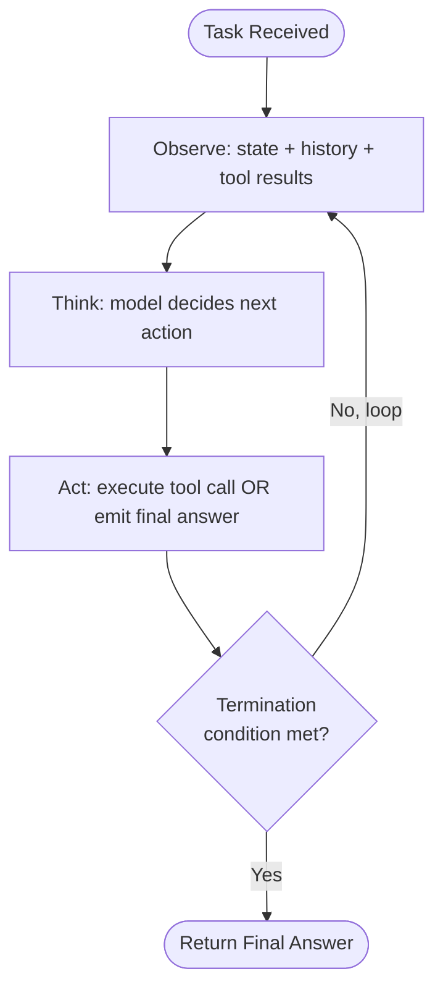
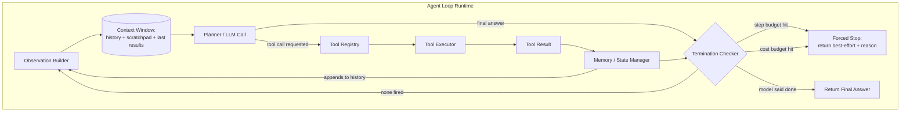
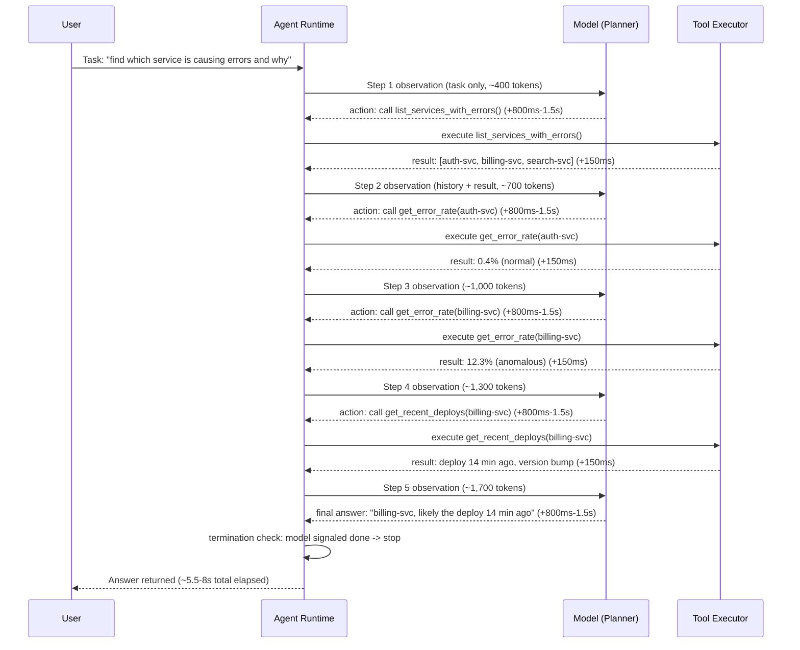
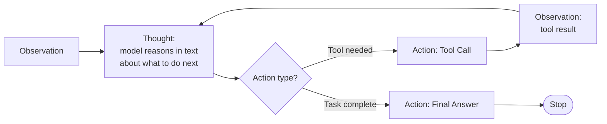
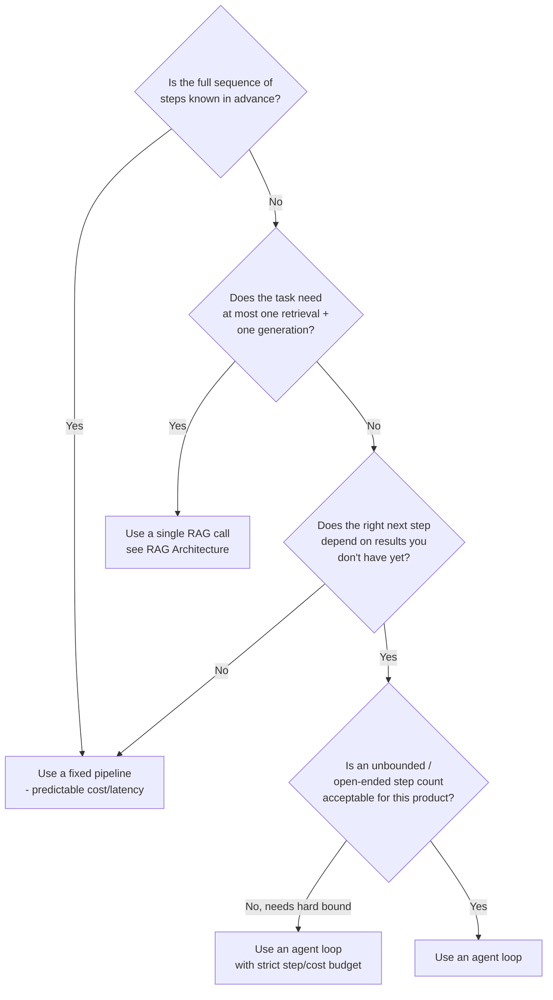

# Agent Fundamentals & the Agent Loop

## Overview

An AI agent is a system in which an LLM's output controls what the system does next — which tool to call, what to do with the result, whether to keep going or stop — across multiple iterations, rather than a fixed pipeline that calls the model once and returns. The defining mechanism is a loop: the model observes state, decides an action, the system executes that action, and the result feeds back into the next observation. This chapter defines that loop precisely, because almost every other chapter in this section (ReAct patterns, tool-use architecture, multi-agent systems, failure modes) is a refinement of the loop described here, not a different thing.

## Definition

An agent is a system where an LLM's output determines control flow — the choice of next action, including whether to continue or terminate — based on observations of the results of its own prior actions, repeated across multiple iterations until a termination condition fires. This is distinct from a single-shot LLM call, where a human or a fixed program decides the sequence of steps in advance and the model only fills in content at each predetermined step. The test is simple: if you can draw the full sequence of steps before running the system, it's a pipeline; if the sequence depends on what the model says at runtime, it's an agent loop.

## Problem Statement

A single LLM call cannot complete tasks whose solution path is not known in advance. Three concrete failure patterns show why:

- **Unknown step count.** "Find the open PRs blocking this release, check their CI status, and summarize what's blocking" requires a variable number of tool calls — the model doesn't know how many PRs exist until it queries. A fixed pipeline has to guess a step count or over-provision for the worst case.
- **Conditional branching on real-world results.** "Debug why this build is failing" requires reading an error, forming a hypothesis, checking a file, and revising the hypothesis if the file doesn't confirm it. A fixed pipeline cannot branch on content it hasn't seen yet at design time.
- **Error recovery mid-task.** A tool call returns a 404, an empty result set, or malformed data. A single-shot call has no opportunity to notice and retry with a different approach; the model produces its best-effort answer over information it never gets to correct.

Without a loop, all three cases force a human to manually chain together calls, inspect intermediate results, and decide the next step themselves — which is exactly the work an agent loop automates.

## Why This Architecture Exists

Early LLM products were single-shot: one prompt in, one completion out, full stop. This worked for self-contained generation tasks (summarize this, classify this, translate this) where the entire input already exists and no new information needs to be gathered or acted on mid-task. It broke down as soon as products needed the model to *do* something in the world — query a database, call an API, edit a file — and especially when the right sequence of actions depended on what earlier actions returned.

The first fix attempted was "function calling as a single step": let the model emit one structured tool call per response. This solved *parsing* (the system no longer regex-matches text for intent) but not *sequencing* — a task needing five dependent tool calls still required the application layer to manually orchestrate five separate model invocations, threading results between them by hand.

The agent loop architecture, popularized by the ReAct paper (Yao et al., 2022) and operationalized in tool-use APIs from OpenAI, Anthropic, and others, generalized this: instead of the *application* deciding when to call the model again, the *model's own output* — specifically, whether it requested another tool call or returned a final answer — drives the loop's continuation. This is the architectural shift that matters: control flow moved from application code into the model's reasoning, conditioned on real tool results, which is the only way to handle tasks whose step count and branching are not knowable ahead of time.

## Core Concepts

- **Observation** — everything the model is given before deciding the next action: the original task, full conversation history, all prior tool results, and any system-level instructions or scratchpad state.
- **Action** — the model's chosen next step: invoke a specific tool with specific arguments, or emit a final answer and stop.
- **Tool result (environment feedback)** — the output of an executed action, fed back into the next observation. This is what makes the loop a loop rather than a chain — the model reacts to *real* results, not to its own prediction of what a result would be.
- **Step / iteration** — one full cycle of observe → decide → act → get result. A "5-step agent" completed its task in five such cycles.
- **Termination condition** — the rule that ends the loop: the model emits a final answer with no further tool calls, a step or cost budget is exhausted, or an external stop signal (timeout, user cancellation, guardrail trip) fires.
- **Scratchpad / reasoning trace** — intermediate reasoning the model produces between actions, kept in context to inform later steps (formalized further in [ReAct & Reasoning Patterns](02-react-and-reasoning-patterns.md)).
- **Trajectory** — the full sequence of (observation, action, result) tuples for one completed task, used for debugging, evaluation, and sometimes training.

## The Agent Loop

At the highest level, an agent loop has exactly four stages, and the loop only exits through the termination check.

The detailed view exposes the parts a real implementation needs beyond the bare loop: a tool registry the model can choose from, a memory/state manager controlling what gets carried into the next observation, and an explicit termination checker evaluating multiple independent conditions rather than relying on the model alone to know when to stop.

The planner is a model call like any other — it has no special runtime privileges. What makes it "the agent's brain" is purely that its structured output (tool name + arguments, or final answer) is what the runtime reads to decide what happens next.

## Components

| Component | Responsibility | Does NOT own |
|---|---|---|
| Observation builder | Assemble the next prompt from history, scratchpad, and latest tool results | Deciding what action to take |
| Planner (LLM call) | Choose the next action given the observation | Executing the action, enforcing budgets |
| Tool registry | Define available tools, their schemas, and argument validation | Reasoning about which tool to pick |
| Tool executor | Run the chosen tool against a real system (API, filesystem, shell, search) and return a result or error | Deciding whether to retry or escalate on failure |
| Memory / state manager | Decide what's retained, summarized, or dropped from context across iterations | Generating new content |
| Termination checker | Evaluate step count, cost spent, elapsed time, and explicit stop signals independently of the model | Producing the final answer itself |
| Guardrail layer | Validate tool arguments and outputs against policy before execution/before return (see [Agent Failure Modes & Guardrails](05-agent-failure-modes-and-guardrails.md)) | Task planning |

The termination checker deserves emphasis: it is a separate, non-LLM piece of logic. Relying solely on the model to "know when to stop" is the single most common design mistake in naive agent implementations, covered in depth below.

## A Task Through the Agent Loop

The sequence below traces a concrete 5-step task — "find which of our three services is causing elevated error rates and tell me the likely cause" — through the loop, with an illustrative latency budget per hop.

Two details matter here. First, **every step resends the full accumulated history** — by step 5 the model is re-reading roughly 1,700 tokens of context that grew from the previous four steps, not just the newest tool result; this is the context-budget tension explored under Tradeoffs and in [What Is Context Engineering?](../04-context-engineering/01-what-is-context-engineering.md). Second, model call latency (800ms-1.5s per step here) dominates total wall-clock time far more than the tool execution itself (150ms here) — a 5-step loop spends roughly 4-7.5 seconds in model thinking time versus well under a second in tool execution, so step count is the primary latency lever, not tool speed.

## Loop Patterns: ReAct, Plan-Execute, Reflection

The most common loop-internals pattern is ReAct-style interleaving: the model is prompted to produce an explicit reasoning step ("Thought") before each action, rather than jumping straight to a tool call. This is covered fully in [ReAct & Reasoning Patterns](02-react-and-reasoning-patterns.md); the workflow shape is shown here because it's the canonical implementation of "think" inside the generic loop above.

Other patterns built on the same base loop:

1. **Plan-then-execute** — the model produces a full multi-step plan up front, then the loop executes each planned step, optionally replanning if a step's result invalidates the plan. Trades some flexibility for predictability and easier budget estimation, since the step count is roughly known before execution starts.
2. **ReAct (think-act-observe interleaved)** — shown above; the default for tasks where the right next step genuinely depends on the previous result and cannot be planned far in advance.
3. **Reflection / self-critique loops** — an extra step where the model reviews its own draft action or answer against the task before committing, at the cost of roughly doubling planner calls per useful action.
4. **Single agent vs. multiple coordinating loops** — everything in this chapter describes one loop, one model "driving." When a task is large enough to split across specialized roles (a planner loop delegating to a coding loop and a testing loop, for instance), you move into [Multi-Agent Architecture Patterns](../10-multi-agent-systems/01-multi-agent-architecture-patterns.md) — multiple instances of this exact loop, coordinating, rather than a different primitive.

## Tradeoffs

The decision of whether to use a loop at all — rather than a fixed pipeline or a single RAG-style call — should be made deliberately, not by default.

A single [RAG call](../06-rag/01-rag-architecture.md) is the right comparison point, not a strawman: RAG retrieves once, generates once, and returns — no loop, no branching on the retrieval's content beyond what's baked into one prompt. An agent loop is RAG's superset when the task might need to retrieve, evaluate what came back, and decide to retrieve again or take a different action — which is also exactly the on-ramp into [Agentic RAG](../08-agentic-rag/01-agentic-rag-architecture.md).

| Advantages | Disadvantages |
|---|---|
| Handles tasks with unknown step count or unknown branching ahead of time | Latency and cost scale with step count, and step count is not fully predictable upfront |
| Recovers from intermediate errors (bad tool result, empty query) by trying a different action | Full conversation history is typically resent every step, so token cost compounds across iterations |
| One mechanism generalizes across very different tasks (research, coding, ops) | Without a hard termination guarantee, loops can run far longer (and costlier) than intended |
| Naturally composes with tool use, search, and code execution | Harder to test exhaustively than a fixed pipeline — the path through the loop is data-dependent |
| Degrades gracefully via partial progress (return best-effort + budget-hit reason) rather than failing outright | Debugging requires inspecting a full trajectory, not just one input/output pair |

## Scalability

- **Step count is the dominant cost driver, not raw model throughput.** A task that needs 20 tool calls costs roughly 4x what a 5-step task costs, almost linearly, because both model-call count and resent-history size grow with steps.
- **Context resending compounds.** If each step adds ~300 tokens of new tool result and reasoning, a 10-step loop's final step resends on the order of 3,000+ tokens of pure history before even adding the new observation — at scale (thousands of concurrent agent sessions), this is the single largest driver of inference cost, ahead of output tokens.
- **Concurrency is bounded by tool backends, not the model.** A swarm of agent loops hitting the same downstream API (a ticketing system, a database) will rate-limit or degrade that backend long before the LLM provider becomes the bottleneck — tool-side rate limiting and backpressure need to be designed in, not assumed away.
- **Parallel tool calls reduce wall-clock time but not token cost.** Issuing 3 independent tool calls in one step (where the API supports it) cuts the 800ms-1.5s-per-round-trip planner latency by roughly 3x for that batch, but each result still gets appended to history and resent on every subsequent step — parallelism helps latency, not the compounding-context cost problem.
- **At high concurrency, the termination checker and budget enforcement must live outside the model**, because per-session step/cost limits are an operational SLA, not something each individual agent session can be trusted to self-regulate consistently.

## Reliability

| Failure | Degradation strategy |
|---|---|
| Model never signals "done" (loops indefinitely) | Hard step-count and wall-clock ceilings enforced by the runtime, independent of the model — see [Agent Failure Modes & Guardrails](05-agent-failure-modes-and-guardrails.md) |
| Tool call fails or times out | Surface the error as an observation (not a crash) so the model can try an alternate action; cap retries per tool call |
| Tool returns malformed/unexpected data | Validate against expected schema before feeding to the model; reject and re-prompt rather than passing garbage into reasoning |
| Cost budget exhausted mid-task | Force-stop and return best-effort partial answer with an explicit "budget exceeded" reason, never silently truncate |
| Model oscillates between two actions (loop-within-the-loop) | Detect repeated identical (action, argument) pairs across recent steps and force a stop or escalate to a different strategy |
| Context window overflow from accumulated history | Summarize or truncate older steps before they push out the original task (see [Context Compression & Summarization](../04-context-engineering/03-context-compression-and-summarization.md)) |

The blast radius of an agent loop failure is structurally larger than a single-shot call's: a single bad model output in a one-shot system produces one bad response; a bad decision early in an agent loop can compound across every subsequent step, since each step's observation includes the consequences of the earlier mistake. This is why termination conditions and per-step validation are not optional hardening — they are core to the architecture, not bolted-on safety.

## Security

The agent loop introduces a threat surface a single-shot call does not have: **the model's own output triggers real-world side effects** (API calls, file writes, shell commands), not just text generation. Three risks follow directly from that:

- **Tool-argument injection** — if any tool result the model observes contains attacker-controlled text (a scraped webpage, a file's contents, an email body), and that text is phrased to look like an instruction, the model may incorporate it into its next action's arguments. This is the agent-loop-specific form of indirect prompt injection: the loop gives the injected instruction an actual mechanism (the next tool call) to cause harm, not just a misleading answer.
- **Unbounded blast radius from looping side effects** — a single-shot system that misbehaves produces one bad output; an agent loop that misbehaves can execute the same harmful action repeatedly across iterations (delete files in a loop, send the same email N times) before a human notices, unless guardrails cap repeated or destructive actions specifically.
- **Privilege accumulation across steps** — a loop that's granted a broad tool registry "to be safe" exposes every one of those tools to influence from every observation in the loop, including untrusted ones; the practical mitigation is scoping the tool registry per task to the minimum needed, not granting the full registry by default.

Mitigations belong at the tool-executor boundary, not the planner: validate and sandbox every tool call regardless of how it was decided on, require explicit confirmation for irreversible or high-privilege actions, and treat every tool result as untrusted input to the next reasoning step. Full threat modeling for this surface lives in [Agent Failure Modes & Guardrails](05-agent-failure-modes-and-guardrails.md).

## Cost Optimization

- **Cap max steps per task type, not globally.** A lookup-style task rarely needs more than 3-5 steps; a multi-file coding task might legitimately need 20-30. A single global cap either starves complex tasks or leaves simple ones dangerously unbounded.
- **Summarize or drop stale tool results from history** rather than keeping every raw result verbatim forever — once a result has been "used" (its conclusion folded into the scratchpad), the raw payload is often dead weight being repaid every subsequent step.
- **Use a cheaper/smaller model for the planner on low-stakes steps** and reserve the strongest model for steps that need real reasoning (e.g., the final synthesis), if the loop framework allows per-step model selection.
- **Batch independent tool calls in a single step** when the tool API supports it — this primarily saves latency, but also reduces the number of full-history resends versus issuing them as separate sequential steps.
- **Set a hard cost ceiling per task, enforced by the runtime**, not just a step-count ceiling — a few very-large-tool-result steps can blow a cost budget well before a step-count cap would trigger.

**Illustrative cost shape:** take a 10-step agent loop on a mid-tier model priced around $3/1M input tokens and $15/1M output tokens, where each step adds ~250 tokens of new tool-result content. Step 1 sends roughly 500 input tokens; by step 10, accumulated history pushes the input side to roughly 500 + 9×250 ≈ 2,750 tokens for that single step alone. Summed across all 10 steps, the input-token total is on the order of 16,000-17,000 tokens for the task (a triangular sum, not 10×2,750), versus roughly 2,500 tokens if the same information had been deliverable in one shot. At the stated pricing, that's on the order of $0.05 for the looped task's input tokens alone versus under a cent for a single-shot equivalent — a real difference, but a bounded one *given a step cap*. Remove the cap and let a stuck loop run 100 steps instead of 10: the same arithmetic produces input totals over 1.3M tokens for that one task, or roughly $4 — which is why an unbounded loop is not just a UX problem but a direct, unbounded cost-multiplication risk per session.

## Monitoring

- **Steps-per-task distribution (p50/p95/p99)** — a creeping p95 step count is the earliest signal that a task category has started needing more iterations than it used to, often because of a tool or data change upstream.
- **Termination-reason breakdown** — what fraction of tasks end via "model signaled done" vs. "step budget hit" vs. "cost budget hit" vs. "error/timeout." A rising forced-stop rate means real tasks are exceeding your budgets, not that the budgets are too aggressive — investigate before raising the ceiling.
- **Tool error rate per tool**, broken out individually — a single flaky tool can silently inflate every loop that calls it.
- **Cost per completed task and cost per step**, tracked separately, so a regression in "more steps needed" is distinguishable from "each step got more expensive."
- **Loop-detection trigger rate** — how often the runtime catches a repeated-action oscillation; a non-zero, growing rate indicates a planning or prompt regression worth investigating directly.
- **End-to-end task success rate against a labeled eval set** (see [Agent Evaluation](04-agent-evaluation.md)) — step-count and cost metrics tell you the loop is *behaving*, not that it's *succeeding*; both are needed.

## Production Best Practices

- Enforce step and cost budgets **in the runtime, outside the model's control**, because a model instructed to "stop after 5 steps" is a strong suggestion, not a guarantee — treat it as defense-in-depth, not the actual control.
- Always return a **best-effort partial answer plus an explicit reason** when a budget is hit, instead of failing the request outright — a partial, honest answer is more useful to the caller than an opaque error.
- Log the **full trajectory** (every observation, action, and result) per task, not just final input/output — when something goes wrong, the trajectory is the only way to tell whether the planner reasoned badly or a tool returned bad data.
- Scope the **tool registry per task type to the minimum needed**, not the full available set "just in case" — every tool added to the registry is additional attack surface and additional opportunity for the model to pick the wrong one.
- Treat every tool result as **untrusted input to the next reasoning step**, the same way RAG treats retrieved chunks as untrusted — apply the same provenance and injection-awareness discipline described in [RAG Architecture](../06-rag/01-rag-architecture.md), since a tool result and a retrieved chunk are the same threat shape.
- Add **active loop-detection** (repeated identical action+argument pairs within a short window) as a forced-stop trigger independent of the step counter — pure step counting alone will let a degenerate oscillating loop burn its entire budget before anyone notices it was stuck, not progressing.

## Real World Examples

The patterns below are described as publicly observable product behavior — how each system visibly behaves when used — not as confirmed internal architecture, which none of these companies has published in implementation detail.

- **ChatGPT's tool-use and code-interpreter-style modes** visibly run a loop: when asked a question requiring computation or live information, the product shows intermediate steps (running code, reading output, sometimes running more code) before a final answer appears, consistent with an observe-think-act cycle rather than one fixed call.
- **Claude's tool-use loop and computer-use capability** follow the same publicly documented shape: the model can request a tool call, receive the result, and decide whether to call another tool or respond, repeated across turns; "computer use" extends the same action space to screen observations and UI actions (click, type, screenshot) as the tool results being observed each iteration.
- **Cursor's agent mode** visibly performs multi-file edits by what looks like iterating — reading a file, proposing an edit, checking the result (e.g., a lint or type error), and adjusting — across several steps for a single user request, rather than emitting one full diff blind.
- **GitHub Copilot's agent-style capabilities** similarly show multi-step behavior on larger tasks (implementing a feature across files, opening a PR) — visibly more than a single completion, consistent with a loop iterating over a codebase rather than one inference call producing a finished result.

The common thread across all four: when a product can visibly take more than one "turn" of action before answering, and the number of turns clearly varies by task rather than being fixed, that is the external signature of an agent loop, regardless of what's actually running underneath.

## Interview Questions

### Beginner

**Q: What makes something an "agent" instead of just an LLM call?**
The control flow. In a single LLM call, a human or a fixed program decides every step in advance — the model just fills in content. In an agent, the model's own output (which tool to call, whether to stop) determines what the system does next, repeated in a loop based on the model observing the results of its own prior actions. If you can fully draw the sequence of steps before running it, it's not an agent.

**Q: What are the four stages of the basic agent loop?**
Observe (gather current state: task, history, prior tool results), think (the model reasons and decides the next action), act (execute a tool call or produce a final answer), and check termination (has the model said it's done, or has a budget been hit) — if not terminated, go back to observe with the new result included.

### Intermediate

**Q: Why does conversation history typically get resent on every single step of an agent loop, and what does that cost?**
Most agent runtimes don't give the model persistent memory between calls — each model call is stateless, so the full accumulated history (original task, every prior action, every prior tool result) has to be included in the prompt every time so the model has the context to decide the next step. The cost compounds: a 10-step loop where each step adds ~250 tokens of new content sends a triangularly growing input-token total across the task — roughly 6-7x the tokens of an equivalent single-shot call by the time you sum every step, not just the final one.

**Q: How does an agent loop differ from a single RAG call?**
A single RAG call retrieves once and generates once — no loop, no decision point about whether to retrieve again or do something else based on what came back. An agent loop can retrieve, evaluate the result, and decide to retrieve differently, call a different tool, or stop, repeated until done. RAG is a strict subset of what an agent loop can do; an agent loop becomes overkill when the task genuinely only needs one retrieval and one generation.

### Senior

**Q: Design the termination logic for an agent loop. What conditions do you check, and which ones are non-negotiable?**
Check, independently: (1) did the model emit a final answer with no further tool call requested — the "happy path" signal; (2) has a max-step count been reached; (3) has a cost ceiling been exceeded; (4) has wall-clock time exceeded a timeout; (5) has loop-detection flagged a repeated identical action. Conditions 2-5 are non-negotiable and must be enforced by the runtime, not the model, because a model that's "supposed to know when to stop" is not a reliable control — it's a soft signal that should be treated as one input among several hard guarantees, not the only check.

**Q: A production agent's average cost per task has tripled over the past month with no model or prompt changes. How do you diagnose it?**
First isolate whether it's steps-per-task or cost-per-step that moved — if steps-per-task rose, suspect an upstream tool change (a previously-fast lookup tool now returning paginated/incomplete results, forcing more iterations) or a shift in the task mix toward inherently harder tasks. If cost-per-step rose with stable step counts, suspect context growth — tool results getting larger, or stale history not being trimmed/summarized as it used to be. Pull a sample of full trajectories before and after the regression and diff them directly rather than guessing from aggregate metrics alone.

### Staff

**Q: You're asked whether a new feature should be built as a fixed multi-step pipeline or an agent loop. Walk through your decision process.**
Start from the decision tree, not from "agents are more capable so default to agents": is the full sequence of steps actually knowable in advance for this task? If yes, a fixed pipeline gives predictable latency, predictable cost, and is far easier to test exhaustively — there is no reason to pay the agent loop's overhead and unpredictability for a task that doesn't need it. Only move to a loop when the right next step genuinely depends on a result you don't have until runtime, or the step count is inherently variable. Even then, prefer the most constrained version that solves the problem — a bounded plan-then-execute loop over a fully open-ended ReAct loop — if the task allows it, since constraint is easier to reason about, cheaper to budget, and easier to debug than unconstrained autonomy.

**Q: How would you bound the worst-case cost of an agent loop system serving thousands of concurrent sessions, formally?**
Worst-case cost per task is bounded by (max steps) × (max tokens per step, including full resent history at that step) × (price per token), so the actual lever is making max-steps and max-tokens-per-step both hard runtime-enforced ceilings, not soft guidance — and critically, the max-tokens-per-step bound must account for history growth, meaning you also need a context-trimming/summarization policy with its own enforced ceiling, otherwise a single long-running task can blow past the per-step token assumption the cost model was built on. At fleet scale, multiply the bounded per-task worst case by max concurrent sessions to get the fleet-level worst-case spend ceiling, and alert well before that ceiling, not at it.

## Google-Level Follow-Ups

- "Your agent loop has a max-step budget, and the model is told its remaining step count in the prompt. Does that change its behavior, and is that good or bad?" — probes whether the candidate has considered that visibility into the budget can cause the model to rush a low-confidence final answer near the limit rather than admitting it needs more steps, versus the alternative risk of not telling it anything and having it run out unexpectedly mid-reasoning; a strong answer discusses testing both framings against real task data rather than assuming one is obviously correct.
- "Two agent loops are both completing tasks successfully, but one costs 4x more. How do you find out why without staring at logs all day?" — probes for systematic trajectory-diffing instinct (compare steps-per-task distributions, token-per-step distributions, and tool-call patterns in aggregate first) over manual inspection, and whether the candidate would build that tooling proactively rather than reactively.
- "At what point does an agent loop become indistinguishable from a multi-agent system?" — probes whether the candidate understands that a single loop calling many tools and a set of loops calling each other as "tools" are architecturally continuous, not a hard binary — and that the practical dividing line is usually about specialization and isolated context per role, covered in [Multi-Agent Architecture Patterns](../10-multi-agent-systems/01-multi-agent-architecture-patterns.md), rather than a fixed rule like "more than N tools means multi-agent."
- "How do you know your termination conditions are actually correct, rather than just not having failed yet?" — probes for adversarial testing instinct: deliberately constructing tasks designed to make the model loop, oscillate, or never naturally terminate, and verifying the hard ceilings actually fire — versus relying on the absence of incidents in production as evidence of correctness.

## Common Mistakes

- **Trusting the model alone to know when to stop.** A prompt instruction like "stop once you've found the answer" is not a control mechanism — it's advice the model can ignore under distribution shift, ambiguous results, or a bad day. Hard step/cost/time ceilings must be enforced by the runtime.
- **Resending unbounded raw history forever.** Without summarization or trimming, a long-running loop's context grows every step until it either blows the context window or makes every subsequent step disproportionately expensive — design the memory/state manager from day one, not as a later fix.
- **Granting the full tool registry to every task "to be flexible."** This maximizes the model's chance of picking a wrong or unsafe tool and maximizes the injection attack surface; scope tools to what the task actually needs.
- **No loop-detection for oscillation.** A model that alternates between two actions without making progress will burn its entire step/cost budget looking identical to a healthy in-progress task on dashboards that only track step count, not action repetition.
- **Treating tool results as trusted input.** A tool result containing attacker-influenced content (a scraped page, a file someone else wrote) gets folded into the next reasoning step with the same trust as a system instruction unless explicitly treated as untrusted data — the same discipline RAG requires for retrieved chunks.
- **Using an agent loop where a fixed pipeline would do.** Reaching for an open-ended loop by default, for tasks whose steps are fully known ahead of time, trades away predictable latency and cost for no actual benefit — and makes the system harder to test.
- **Failing silently on budget exhaustion instead of returning partial progress.** Returning a bare error when a step cap is hit discards everything the loop already learned; returning the best-effort partial answer plus the reason is strictly more useful and costs nothing extra to implement.

## Key Takeaways

- An agent is defined by *who controls the next step*: the model's own output, based on observing its prior actions' real results — not a human or fixed program deciding the sequence in advance.
- The loop has four stages — observe, think, act, check termination — and the termination check must be partly enforced outside the model, never solely trusted to the model's self-reported "I'm done."
- Full conversation history is typically resent every step, which means token cost compounds across iterations roughly triangularly, not linearly — this is the central tension addressed in context engineering.
- A single RAG call is a strict subset of what an agent loop can do (no loop, one retrieval, one generation); reach for a loop only when the next step genuinely depends on a result not yet available.
- Without enforced step and cost budgets, an agent loop's worst-case cost is effectively unbounded — a stuck or oscillating loop can cost 10-100x a normal completion for the same task category.
- Every tool result is untrusted input to the next reasoning step, structurally identical to a retrieved RAG chunk from a security standpoint — treat it accordingly.
- Multi-agent systems are not a different primitive — they are multiple instances of this same loop, coordinating; understanding this loop is the prerequisite for understanding that one.
- Default to the most constrained architecture that solves the task — fixed pipeline, then single RAG call, then bounded plan-then-execute loop, then open-ended ReAct loop — rather than reaching for full agentic autonomy because it is the most capable option available.
