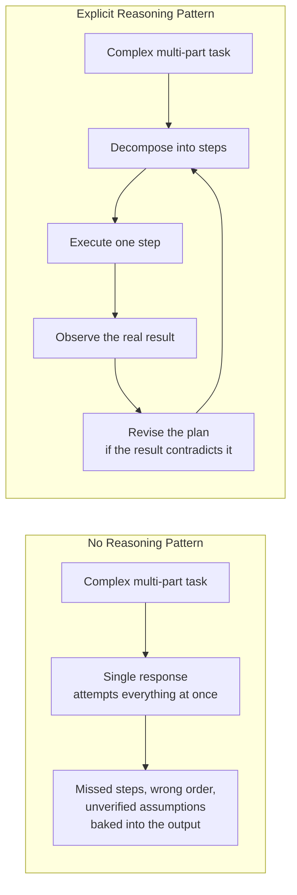
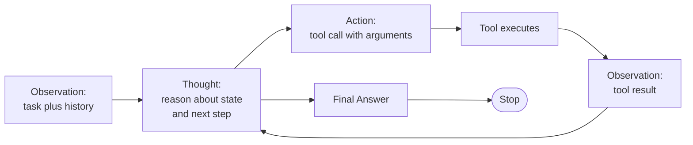
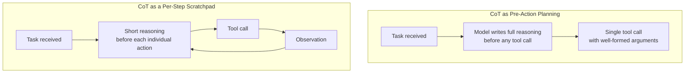
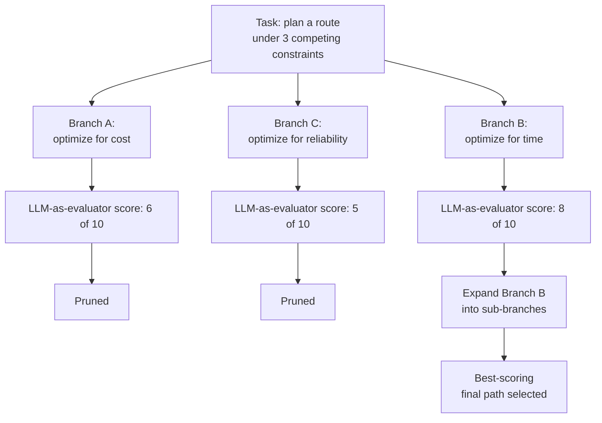
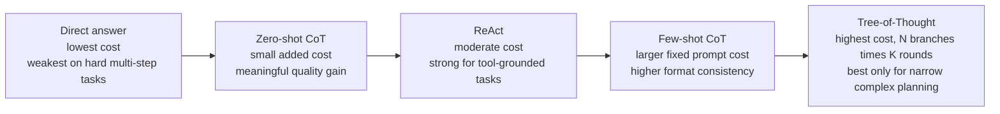
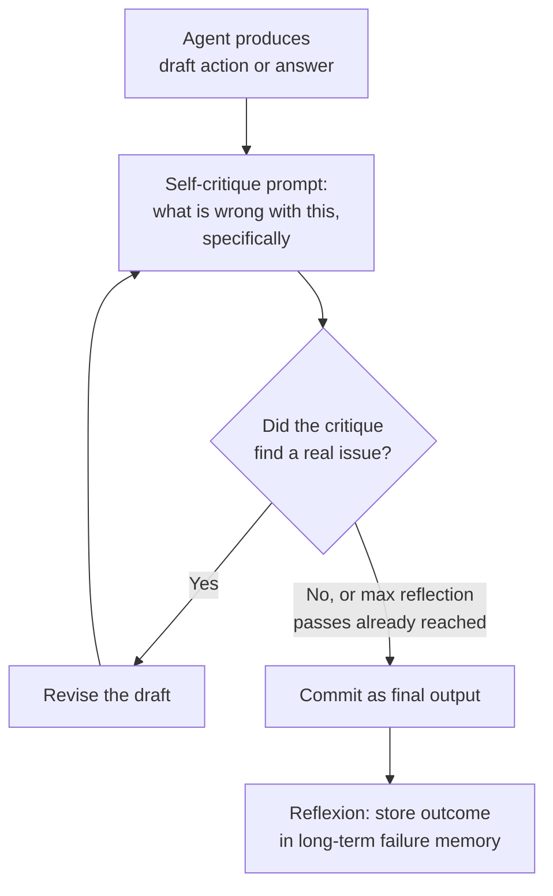
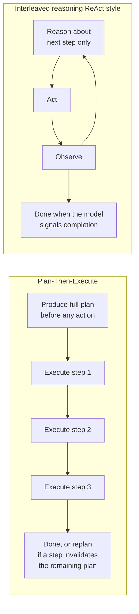
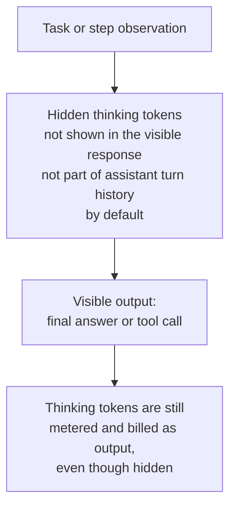
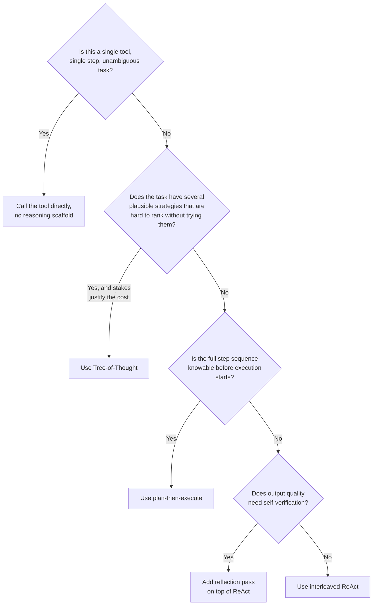
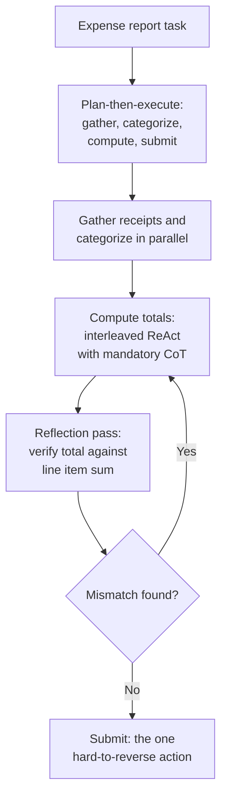

# ReAct & Reasoning Patterns

## Overview

The agent loop (see [Agent Fundamentals & the Agent Loop](01-agent-fundamentals-and-the-agent-loop.md)) defines *that* an agent observes, decides, acts, and repeats. It says nothing about *how* the model should think between those actions. This chapter is about that missing layer — the reasoning pattern running inside each iteration of the loop. It is the difference between a model that jumps straight from a task description to a tool call it hasn't thought through, and one that explicitly decomposes the task, commits to a next step, checks the result, and revises before continuing. Reasoning patterns are the "software" running on top of the loop's "hardware."

## Definition

A reasoning pattern is a structured prompting strategy that forces the model to produce explicit, inspectable intermediate reasoning — a plan, a rationale, a critique, or a branching exploration — before or between actions, rather than mapping a task description directly to a final action or answer in one uninterrupted generation. The pattern determines three things: how much reasoning happens, where it happens relative to acting (before every action, once up front, or after a draft), and whether it explores one path or several. Every pattern in this chapter — ReAct, chain-of-thought, tree-of-thought, reflection, plan-then-execute — is an answer to those three questions, not a fundamentally different mechanism.

## Why Reasoning Structure Matters

An LLM prompted with a complex, multi-part task and no reasoning scaffold will attempt to collapse it into a single response: it guesses at a plan, guesses at intermediate values it hasn't verified, and produces an answer with the errors of every skipped step baked in silently. This is not a capability limit — it's a structural one. Autoregressive generation commits to tokens left to right; without an explicit instruction to reason first, the model's "planning" is whatever surfaces in the first few tokens of the response, with no opportunity to revise once it discovers those early tokens were wrong.



This is the exact difference between a chatbot and an agent. A chatbot with no reasoning scaffold answers well when the answer is already latent in its training distribution and poorly the moment the task requires grounding in something it doesn't already know (a live tool result, a file it hasn't read, a number it has to compute). An agent's reasoning pattern is what forces the decompose-execute-observe-revise cycle instead of a single confident guess.

## ReAct: Reason + Act

ReAct (Yao et al., 2022) is the seminal pattern: at each step, the model produces a **Thought** (natural-language reasoning about the current situation and what to do next), an **Action** (a tool call with concrete arguments), and receives an **Observation** (the tool's real result, fed back into context). The cycle repeats until the model's Thought concludes the task is done and it emits a final answer instead of another action.



### The prompt template

ReAct is implemented purely through prompt structure and output parsing — there is no special model capability required, only a strict format the model is instructed to follow and the runtime is written to parse:

```text
You have access to the following tools:
{tool_schemas}

Answer the question using this exact format, repeating the
Thought/Action/Observation block as many times as needed:

Thought: reasoning about the current state and what to do next
Action: the tool name to call, must be one of [{tool_names}]
Action Input: a JSON object with the tool's arguments
Observation: the result of the action (filled in by the system)
... (this Thought/Action/Observation cycle can repeat)
Thought: I now have enough information to answer
Final Answer: the answer to the original question

Question: {task}
```

The runtime parses each model turn for `Action` and `Action Input`, executes the tool, and appends the result as the next `Observation` before calling the model again — this is the mechanism, described generically in the agent loop chapter, made concrete.

### Failure mode: skipping the Thought

The most common ReAct failure is the model emitting an `Action` directly, with no `Thought` line, especially on later steps once a few tool calls have already succeeded and the model "settles into" a rhythm of just acting. This matters because the Thought is not decorative — it is the mechanism that makes the model commit to *why* it's calling a tool before committing to *how* (the arguments), and skipping it correlates with argument-quality regressions (wrong parameters, wrong tool for the situation). Mitigations: few-shot examples in the prompt that always show the Thought line, output-format validation that rejects an Action with no preceding Thought and re-prompts, and, on some providers, a lower temperature specifically for the planning turn.

### Cost implication

Every Thought is generated output that consumes tokens and adds latency, and — because full history is resent each step in most agent runtimes — every prior Thought is also resent as input on every subsequent step. A 10-step ReAct trace where each Thought averages 60 tokens adds roughly 600 tokens of pure reasoning text to the accumulated context by the final step, on top of the tool results themselves. This is a deliberate trade: the Thought is what makes tool selection and argument construction reliable, but it is not free, and a system prompting for excessively long, discursive Thoughts pays for that verbosity on every single step, not once.

### When ReAct is overkill

A single-tool, single-step task — "what's the weather in Boston" resolved with one `get_weather` call — gains nothing from a Thought/Action/Observation scaffold and pays the token and latency cost of generating one anyway. The signal for whether ReAct is warranted is the same test used for whether an agent loop is warranted at all: is the right action, and are its arguments, obvious directly from the task, or does the model need to reason about ambiguous or multi-step context first? If the tool call is unambiguous, skip the reasoning scaffold and call the tool directly; reserve ReAct for tasks where the next action genuinely depends on reasoning the model hasn't already done in its first-token instinct.

## Chain-of-Thought in the Agent Context

Chain-of-thought (CoT) is the broader technique underneath ReAct's `Thought` field: prompting the model to produce intermediate reasoning steps in natural language before committing to an answer. In an agent, CoT shows up in two distinct roles that are easy to conflate.



**CoT as pre-action planning** happens once, before the first tool call: the model reasons through the whole task, produces a plan, and only then starts acting. This is the reasoning-only half of plan-then-execute, covered fully below. **CoT as a per-step scratchpad** is what ReAct's `Thought` field actually is: a short burst of reasoning repeated before every individual action, informed by the latest observation, not the original task alone.

**Zero-shot vs. few-shot CoT.** Zero-shot CoT is the well-known "let's think step by step" instruction with no worked examples — it reliably improves reasoning on tasks the model has *some* latent capability for, at the cost of a small number of extra output tokens. Few-shot CoT includes one or more complete worked exemplar traces in the prompt showing the exact reasoning style and format expected; it produces more consistent, more format-compliant reasoning at the cost of a much larger fixed prompt (every exemplar trace is resent on every single call, not just the first). In practice: use zero-shot CoT by default, and add few-shot exemplars specifically when the model's zero-shot reasoning format is inconsistent enough to break downstream parsing (e.g., it sometimes skips straight to an action, or produces reasoning in an unparseable structure).

**Why CoT before a tool call improves argument quality.** Tool arguments are structured data extracted from an unstructured task description — a date range, a user ID, a file path, a numeric threshold. Asking the model to reason about what the arguments should be, in natural language, before committing to the structured call, gives it a chance to catch an ambiguous reference ("last quarter" — which quarter, relative to what date?) or a unit mismatch (dollars vs. cents) that it would otherwise silently guess wrong inside a JSON blob with no visible reasoning to catch the error.

**The cost of CoT in a high-frequency agent.** An agent handling thousands of simple, well-defined requests per hour (a classification-and-route agent, for instance) pays CoT's token and latency tax on every single request, most of which don't need it. This is the same overkill judgment as ReAct above, applied specifically to the scratchpad: reserve mandatory CoT for steps where argument or tool-selection ambiguity is real, and skip it for steps where the action is mechanically obvious from the task.

## Tree-of-Thought

Tree-of-Thought (ToT) replaces a single linear reasoning chain with an explicit search over multiple candidate reasoning paths, evaluated and pruned, rather than committing to the first path the model generates.



### How ToT is implemented in practice

There is no single "ToT API" — it is an orchestration pattern built from repeated model calls: (1) generate N candidate next-reasoning-steps from the current state (a sampling-based branch generator, typically the same model at higher temperature, or several independent calls), (2) score each candidate, usually with a second LLM call acting as an evaluator ("rate this partial solution's likelihood of leading to a correct final answer"), (3) keep the top-K branches (a beam search over reasoning steps, not full text search) and discard the rest, and (4) repeat from the surviving branches until a branch reaches a complete solution. This is materially more orchestration code than ReAct or CoT — a naive linear generation loop cannot produce ToT's behavior without an explicit branch-and-score harness wrapped around the model calls.

### Cost vs. quality



ToT's cost scales with branch count times search depth times evaluator calls — a modest 3-branches-wide, 2-level-deep search with an evaluator call per branch is on the order of 10-20x the token cost of a single linear CoT pass for the same task, because every branch independently re-generates and re-evaluates reasoning that a linear chain would only produce once. The quality gain is real but narrow: ToT earns its cost on problems with genuinely multiple plausible strategies that are hard to rank without trying them (complex constraint-satisfaction planning, puzzle-style problems with dead ends, multi-objective optimization where the right tradeoff isn't obvious up front) and is wasted overhead on problems with one clear solution path, where a linear CoT or ReAct trace reaches the same answer at a fraction of the cost.

## Reflection and Self-Critique

Reflection adds a step after an action or draft answer is produced: the agent is prompted to critique its own output against the task, and revise if the critique surfaces real issues. Reflexion (Shinn et al., 2023) formalizes this further by giving the agent a persistent memory of past failures — verbal feedback from unsuccessful attempts, stored and re-injected into future attempts at similar tasks, functioning as a lightweight learning signal without any weight updates.



### The reflection prompt template

```text
Here is the task, your draft action, and its result:

Task: {task}
Draft Action: {action}
Result: {observation}

Critique this draft specifically against the task requirements.
Do not simply approve it. Identify:
1. Any requirement in the task the draft action does not satisfy
2. Any assumption the draft made that the result contradicts
3. Any tool argument that may be wrong, incomplete, or malformed

If you find no real issue after this specific check, say
"No issues found" and explain briefly why each of the three
checks above passed. Otherwise, propose a specific revision.
```

The explicit checklist matters: an open-ended "critique your answer" prompt reliably degenerates into "looks good" on every pass, because agreeing is the path of least resistance for the model and there is no structural pressure against it. Naming specific dimensions to check against — requirement coverage, contradicted assumptions, argument validity — gives the critique step concrete failure conditions to test for, rather than a vague quality vibe to rubber-stamp.

### Avoiding degenerate reflection

Beyond a structured checklist, three additional guards keep reflection from being theater: (1) run the critique with a different framing or even a different model than the one that produced the draft, since a model critiquing its own immediately-prior output is prone to confirming its own reasoning; (2) require the critique to cite a specific line or claim it takes issue with, not just an overall verdict, which makes a rubber-stamp "looks good" harder to produce plausibly; (3) track the pass/reject rate of the reflection step in production — a step that approves 100% of drafts is not adding signal and should be treated as a broken guardrail, not a quiet success.

### When to reflection-loop vs. terminate

Reflection should have its own bounded budget, separate from the outer agent loop's step budget: cap reflection passes (2-3 is typical) independent of how many tool-call steps remain, and terminate the reflection sub-loop either when a pass finds no issues or when the cap is hit — in the latter case, commit the best draft so far rather than looping indefinitely hunting for a critique-free version that may not exist. Reflection is worth the extra pass specifically on higher-stakes final outputs (a report going to a customer, a destructive tool call about to execute) and is usually not worth it on low-stakes intermediate steps (a routine lookup call), for the same cost-proportional-to-stakes reasoning used throughout this chapter.

## Plan-Then-Execute vs. Interleaved Reasoning

These are the two dominant architectural shapes for how reasoning relates to acting across an entire task, not just a single step.



**Plan-then-execute**: the model produces a complete task plan up front — an ordered list of sub-steps — before taking any action, then the runtime executes the plan step by step, optionally replanning if a step's result invalidates a later planned step. Because independent steps in the plan are known ahead of time, they can be dispatched in parallel where they don't depend on each other, and the overall step count is roughly predictable before execution starts, which makes cost and latency easier to budget in advance.

**Interleaved (ReAct-style)**: the model reasons and acts one step at a time, revising its understanding of the remaining task based on each observation, with no committed multi-step plan beyond the immediate next action. This is strictly more adaptive to real-world surprises (a tool returns something unexpected, a sub-task turns out to be unnecessary) because nothing has to be un-planned or replanned — there was no fixed plan to invalidate in the first place.

| Dimension | Plan-then-execute | Interleaved (ReAct-style) |
|---|---|---|
| Adaptability to surprising results | Weak — a wrong early assumption propagates through the whole plan until a replan is triggered | Strong — each step incorporates the latest real observation |
| Parallelizability | High — independent planned steps can run concurrently | Low — each step depends on seeing the prior result before deciding the next one |
| Predictability of cost/latency upfront | High — step count is roughly known before execution | Low — step count depends on what the task turns out to need |
| Brittleness to early-step failure | High — an early step failing can invalidate steps planned on top of it | Lower — failure is absorbed into the next reasoning step, not a fixed plan |
| Best fit | Tasks with well-understood structure and mostly-independent sub-steps (batch data pulls, multi-file refactors with a known file list) | Tasks where the right next step genuinely depends on results not yet available (debugging, open-ended research) |

The choice is not permanent or exclusive — many production agents use a hybrid: plan-then-execute for the outer shape of the task (a small number of major phases known in advance) with interleaved ReAct-style reasoning inside each phase (where the exact tool calls needed within that phase aren't knowable until the phase starts).

## Scratchpad and Extended Thinking

Modern reasoning models expose an extended-thinking or scratchpad mode: a hidden token stream where the model reasons before producing its visible response, distinct from an explicit CoT block written into the assistant's visible turn.



**How this differs from explicit CoT.** An explicit CoT `Thought` field is part of the assistant's visible turn: it gets stored in conversation history, resent on every subsequent step, and is inspectable in logs by default. Extended thinking tokens are generated in a separate internal stream that is not, by default, re-injected verbatim into the next turn's context in the same way — the model produces them, uses them to arrive at a better final output, and they are typically dropped or summarized before the next turn, which avoids the accumulating-context cost of resending every prior Thought verbatim.

**What it's useful for.** Extended thinking earns its cost on genuinely hard reasoning: multi-constraint planning, non-trivial math, code with subtle edge cases, and situations closer to ToT-style exploration than a single obvious next step — cases where forcing more inference-time reasoning compute measurably improves the answer. It is not free reasoning; it is reasoning compute traded for token spend, same as CoT, just delivered through a different mechanism with different context-accumulation behavior.

**The cost model.** Thinking tokens are billed as output tokens even though hidden from the visible response — a task that generates 2,000 tokens of hidden reasoning to produce a 200-token visible answer is billed for roughly 2,200 output tokens, not 200. This is the critical planning number: extended thinking budgets need their own explicit token cap, separate from the visible-response length cap, or a single hard reasoning problem can silently consume a large multiple of the expected cost for that step.

**When to turn it on vs. off.** Turn it on for steps the agent's own reasoning pattern has already identified as hard — a ToT branch evaluation, a reflection critique on a high-stakes action, a planning step with several competing constraints. Turn it off (or use a lower thinking-token budget) for routine steps where the action is close to mechanical — most individual ReAct tool-selection steps do not need extended thinking and paying for it there is close to pure overhead.

## Prompt Templates for Reasoning Patterns

The three templates below show the structural shape each pattern needs; production prompts embed the actual tool schemas and task-specific instructions in place of the placeholders.

**ReAct** (shown fully above) — the defining structural requirement is the strict `Thought / Action / Action Input / Observation` cycle with an explicit final-answer exit condition, and the tool schema block injected once, at the top, not repeated per step.

**Zero-shot CoT** (single reasoning pass, no tool calls needed):

```text
{task}

Think through this step by step before giving your final answer.
Show your reasoning, then conclude with:
Final Answer: <your answer>
```

**Reflection** (shown fully above) — the defining structural requirement is a checklist the critique step must address explicitly, and a hard cap on reflection passes so the loop cannot hunt indefinitely for a critique-free draft.

## Cost Optimization and Monitoring

- **Match reasoning depth to task ambiguity, not a fixed default.** The single biggest lever is not using the same reasoning pattern for every step of every task — mechanical steps get no scratchpad, ambiguous steps get CoT, high-stakes final outputs get a reflection pass, and only genuinely multi-path planning problems get ToT.
- **Cap reflection and ToT branch counts as hard budgets**, separate from the outer agent loop's step budget, since both patterns can silently multiply the cost of a single logical step by an order of magnitude if left unbounded.
- **Track Thought-skip rate** (the fraction of ReAct turns that emit an Action with no preceding Thought) as a leading indicator of argument-quality regressions before they show up as increased tool-error rates.
- **Track reflection approval rate**; a rate near 100% signals a rubber-stamp critique step providing no real signal, not a healthy system.
- **Track reasoning token share** (thinking/CoT tokens as a fraction of total tokens per task) over time — a creeping increase without a corresponding quality improvement in the eval suite (see [Agent Evaluation](04-agent-evaluation.md)) indicates verbosity drift, not better reasoning.
- **Prefer hidden extended thinking over verbose explicit CoT for hard steps** when the model supports it, specifically because it avoids the context-resend penalty of a long visible Thought accumulating in history across every subsequent step.

## Choosing a Reasoning Pattern



## Real-World Deployment Considerations

- **Format compliance is a production reliability problem, not a prompting nicety.** A ReAct parser that can't recover from a malformed `Action` line (missing JSON, extra prose before the tag) will break the agent loop at the runtime level, not just produce a worse answer — invest in lenient parsing and a re-prompt-on-parse-failure path before shipping.
- **Reasoning patterns compose, and production agents typically use more than one within a single task** — a plan-then-execute outer shape, interleaved ReAct within a phase, and a reflection pass before any irreversible action, rather than picking exactly one pattern for the whole system.
- **Extended thinking budgets need per-task-type tuning**, not a single global default, for the same reason step budgets do in the base agent loop — a classification step and a multi-constraint planning step have very different genuine reasoning needs.
- **Log the reasoning trace, not just the final action**, for every step in production — when a tool call turns out to have used a wrong argument, the Thought (or hidden reasoning summary) is frequently the only artifact that reveals whether the model misunderstood the task or a tool result was misleading.

## Interview Questions

### Beginner

**Q: What is the difference between chain-of-thought and ReAct?**
Chain-of-thought is reasoning in natural language before an answer — it doesn't require tools or acting on the world. ReAct is a specific structured loop that interleaves that reasoning (`Thought`) with real tool calls (`Action`) and their real results (`Observation`), repeated until the model has enough information to answer. CoT is the reasoning ingredient; ReAct is a recipe that uses CoT as one of its three components alongside acting and observing.

**Q: Why does an agent need an explicit reasoning step at all — why not just let the model call tools directly?**
Without an explicit reasoning step, the model maps the task description straight to a tool call in one uninterrupted generation, with no visible opportunity to catch an ambiguous argument, a wrong tool choice, or a misunderstood requirement before committing to the call. The reasoning step forces the model to state, in inspectable text, what it believes the current situation is and why it's choosing this action — which both improves the resulting call's quality and gives the system something to log and debug when it's wrong.

### Intermediate

**Q: When is ReAct overkill, and what do you do instead?**
ReAct is overkill for a single-tool, single-step task where the right action and its arguments are unambiguous directly from the task description — generating a Thought there adds tokens and latency without improving anything, because there was no real decision to reason through. Call the tool directly instead, and reserve the Thought/Action/Observation scaffold for steps where the next action genuinely depends on reasoning the model hasn't already resolved in its first-token instinct.

**Q: Your reflection step approves nearly every draft it reviews. Is this working correctly?**
No — a near-100% approval rate is the signature of degenerate reflection, where the critique step has collapsed into a rubber stamp because agreeing is the path of least resistance and there's no structural pressure against it. Fix it by requiring the critique to check specific, named dimensions (requirement coverage, contradicted assumptions, argument validity) rather than an open-ended "is this good" judgment, and by tracking the approval rate itself as a monitored signal — a rate that never drops indicates the guardrail isn't adding information, not that the agent is unusually good.

### Senior

**Q: Design the reasoning architecture for an agent that files multi-step expense reports, where speed matters but a wrong reimbursement amount is costly to correct after the fact.**
Use a hybrid shape: plan-then-execute for the outer structure, since the phases (gather receipts, categorize expenses, compute totals, submit) are known in advance and mostly independent, which lets phases like receipt-gathering and categorization run in parallel and gives a predictable step-count budget upfront. Within the totals-computation phase, use interleaved ReAct with a mandatory CoT scratchpad specifically because amount computation is exactly the kind of step where an unverified assumption (wrong currency, wrong date range) silently produces a wrong number with no visible reasoning to catch it. Before the final submission action — the one genuinely hard-to-reverse step — add a single bounded reflection pass that explicitly checks the computed total against the sum of the individual line items and flags a mismatch rather than approving by default. Skip reflection everywhere else in the flow; it isn't worth the cost on read-only or easily-reversible steps.



**Q: How would you detect that your production agent's reasoning quality is degrading over time, without a labeled eval set changing?**
Track leading indicators that don't require ground truth: the Thought-skip rate on ReAct turns, the reflection approval rate, the reasoning-token share per task over time, and the rate of tool calls that fail argument validation immediately after execution. A degrading reasoning layer typically shows up first as rising Thought-skips or rising post-hoc argument-validation failures, well before it shows up as a measurable drop in end-to-end task success, because task success is a lagging, noisy signal that needs many samples to move detectably — these structural signals move faster and point directly at which part of the reasoning pipeline regressed.

### Staff

**Q: A team wants to add Tree-of-Thought to every agent step "to improve quality across the board." How do you respond?**
Push back on the blanket application before evaluating the specific cost/benefit tradeoff. ToT's cost scales with branch count times search depth times evaluator calls, typically 10-20x a single linear reasoning pass for the same nominal task — applying it to every step, including the many mechanical, single-path steps most agents actually spend most of their time on, multiplies cost fleet-wide for close to zero quality gain on those steps, since there's no ambiguity or multiple plausible strategies to search over in the first place. The correct scope is narrow: identify the specific step types where multiple genuinely competing strategies exist and are hard to rank without trying them — complex constraint-satisfaction planning, multi-objective tradeoffs — and apply ToT only there, leaving the rest of the agent on ReAct or plain CoT. Frame this as a decision-tree exercise per step type, not a system-wide setting, and require an eval-set-measured quality delta before shipping the added cost anywhere.

## Google-Level Follow-Ups

- "You add a reflection pass and end-to-end task success goes up in eval, but production cost per task also rises sharply. How do you decide whether to keep it?" — probes for a value-of-information framing: compute the marginal cost per additional percentage point of success, compare it against the cost of the failure mode reflection is catching (a wrong irreversible action vs. a wrong sentence in a report), and decide per task-type rather than as a single global toggle.
- "Your ReAct agent's Thought field starts getting longer and longer over several weeks with no prompt change. What's your hypothesis, and how do you check it?" — probes whether the candidate connects this to model or provider updates, or to few-shot exemplars drifting out of sync with the model's current default verbosity, and whether they'd verify with a controlled trace diff rather than assuming a single cause.
- "How would you build automatic tooling to decide, per task type, whether plan-then-execute or interleaved ReAct produces better outcomes — without a human manually re-architecting each agent?" — probes for an experimentation-system mindset: shadow both patterns on the same task distribution, compare success rate, cost, and latency per task type, and route future tasks of that type to whichever pattern won, rather than a one-time manual architectural decision that goes stale as the task distribution shifts.

## Common Mistakes

- **Using the same reasoning pattern for every step regardless of the step's actual ambiguity.** Mechanical, unambiguous steps don't need a Thought or a reflection pass; forcing one on every step is pure overhead with no corresponding quality gain.
- **Open-ended reflection prompts that degenerate into a rubber stamp.** "Critique your answer" without specific, named dimensions to check reliably collapses into "looks good" — track approval rate and require explicit checks.
- **Applying Tree-of-Thought broadly "to be safe."** ToT's cost is an order of magnitude above linear reasoning; it earns that cost only on problems with multiple genuinely competing strategies, not as a general-purpose quality dial.
- **Treating extended thinking tokens as free because they're hidden.** They are billed as output tokens regardless of visibility, and an uncapped hard reasoning problem can silently consume a large multiple of the expected per-step cost.
- **Letting reflection or ToT loops run without their own bounded budget**, separate from the outer agent loop's step counter — both can multiply the cost of a single logical step without the outer loop's step-count guardrail ever noticing.
- **Not logging the reasoning trace.** When a tool call used a wrong argument, the Thought or reasoning summary is often the only artifact that reveals whether the model misread the task or a tool result misled it — discarding it after the step completes removes the primary debugging signal.

## Key Takeaways

- A reasoning pattern is what forces decomposition, execution, observation, and revision instead of collapsing a complex task into one uninterrupted, unverified response — this is the structural difference between a chatbot and an agent.
- ReAct interleaves Thought, Action, and Observation in a strict, parseable cycle; it is the default pattern for tasks where the next action genuinely depends on results not yet available, and overkill for unambiguous single-tool tasks.
- Chain-of-thought shows up either as one-time pre-action planning or as ReAct's per-step scratchpad; zero-shot CoT is the default, few-shot CoT earns its larger fixed prompt cost only when format consistency is a real problem.
- Tree-of-Thought trades an order-of-magnitude cost increase for quality on a narrow class of problems — multi-strategy, hard-to-rank-without-trying planning — and is wasted overhead everywhere else.
- Reflection only adds value if the critique step is structurally forced to check specific things; an open-ended "critique yourself" prompt reliably degenerates into rubber-stamp approval.
- Plan-then-execute and interleaved ReAct are not mutually exclusive — most production agents use a plan-then-execute outer shape with interleaved reasoning inside individual phases, matched to how much of the task structure is actually known in advance.
- Extended thinking tokens are billed output, hidden or not; give every reasoning-heavy pattern (reflection, ToT, extended thinking) its own explicit, bounded budget, separate from the outer agent loop's step and cost ceilings.

---

*Part of [Agents](index.md) in the [AI System Design Notes](../index.md). Tracked in [BACKLOG.md](https://github.com/GyanendraChaubey/AI-System-Design-Notes/blob/main/BACKLOG.md).*
