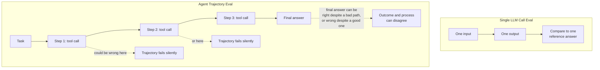
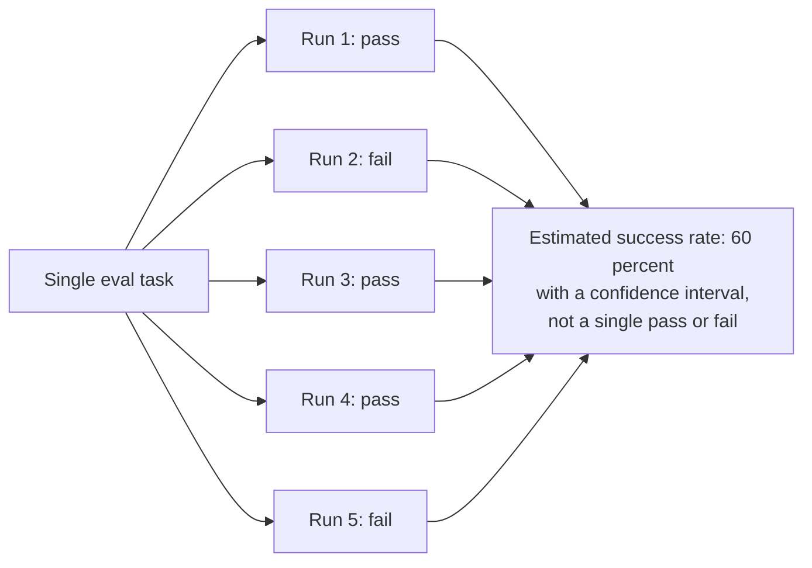
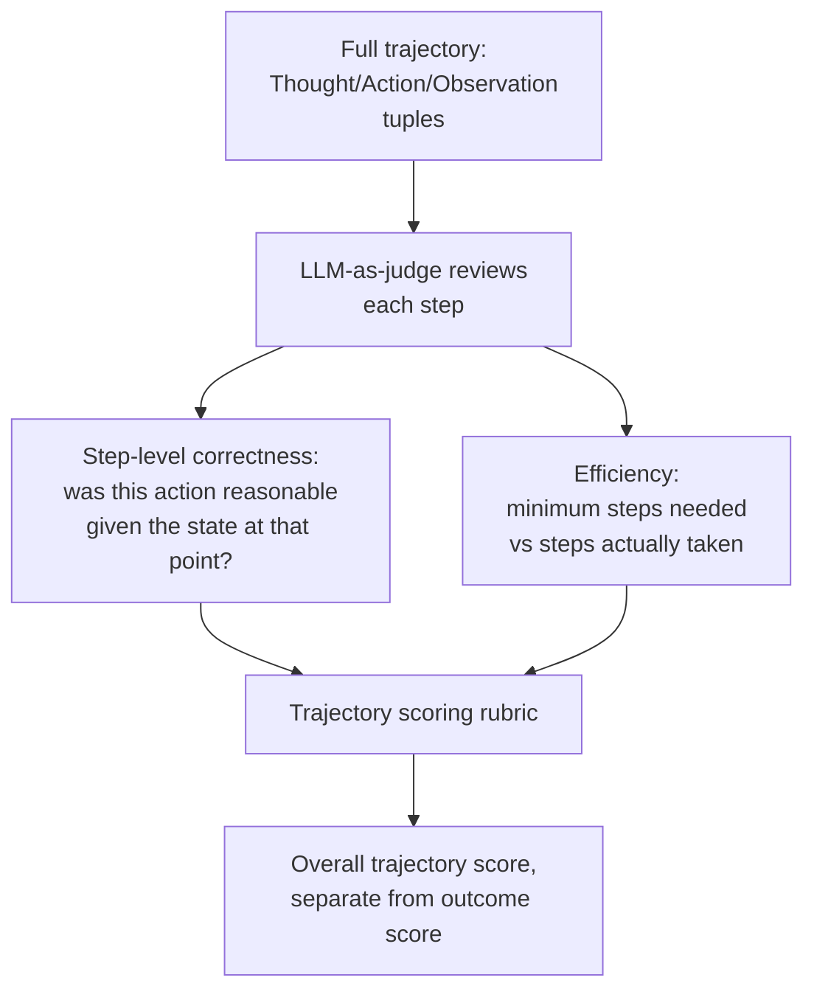
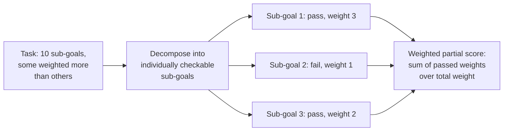
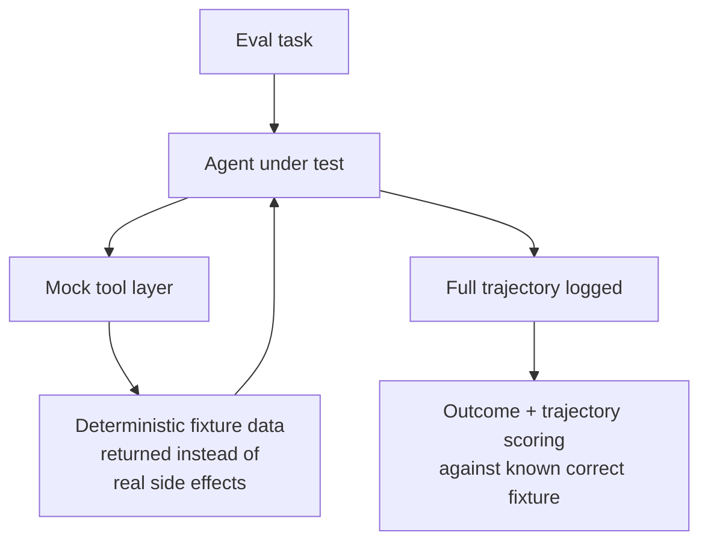
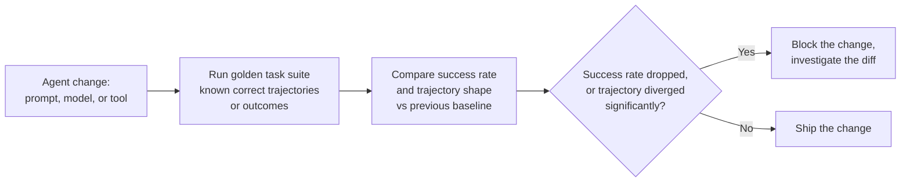
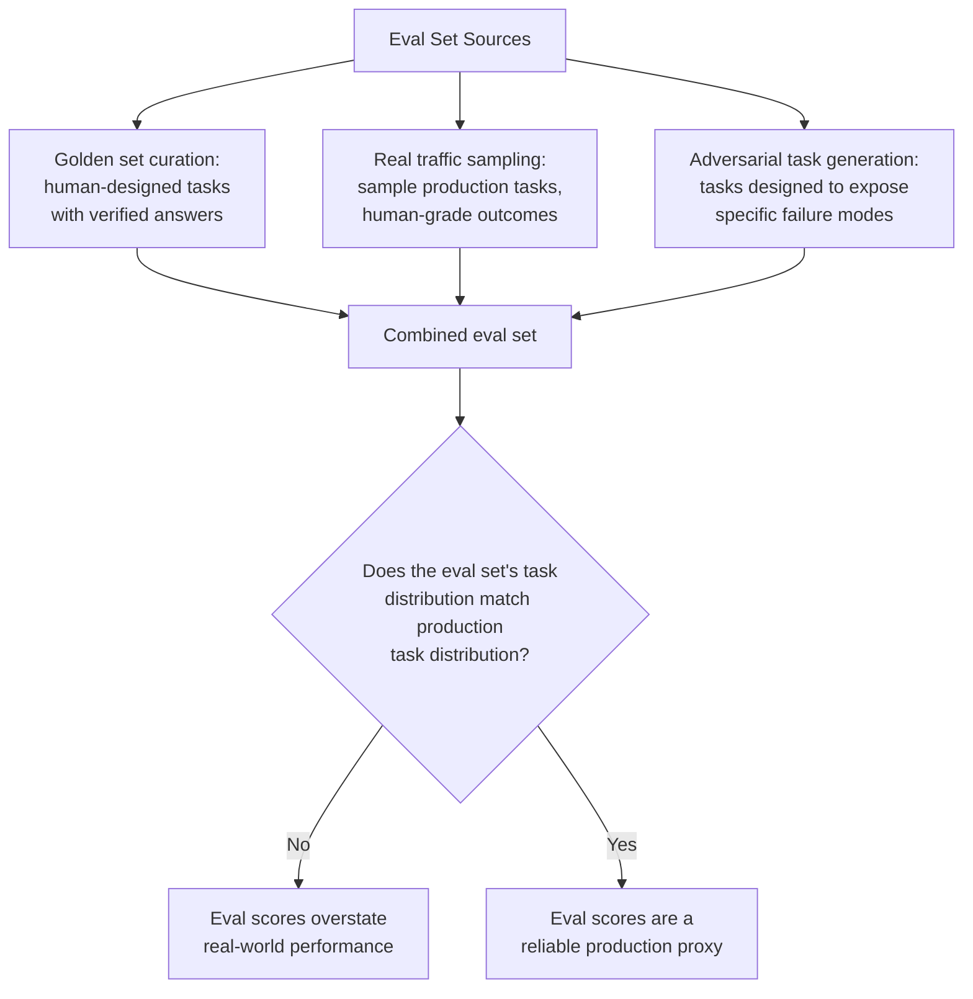
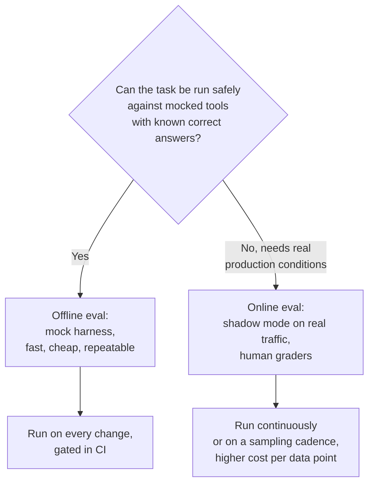
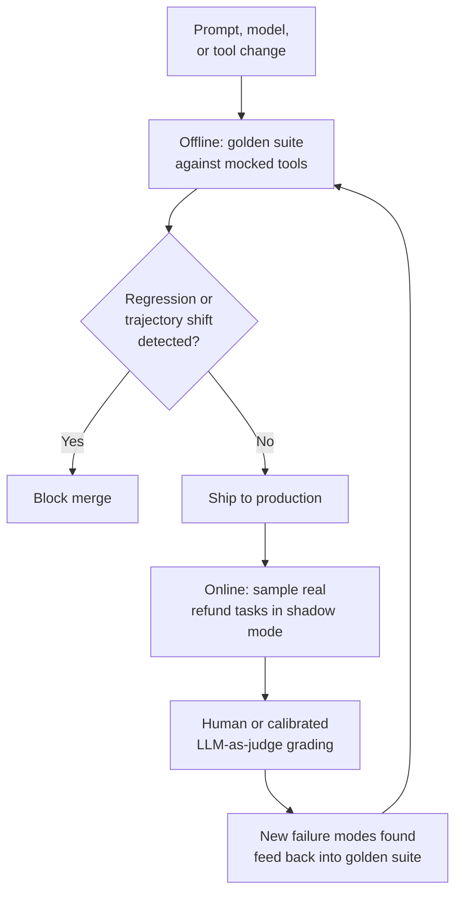

# Agent Evaluation

## Overview

Evaluating a single LLM call means checking one output against one expected answer. Evaluating an agent means checking a **trajectory** — a sequence of decisions, tool calls, and observations that may succeed or fail at any point along the way, and whose final answer can be right for the wrong reasons or wrong despite a mostly-correct process. This chapter is about why that difference makes agent evaluation structurally harder, and the specific metrics, harnesses, and workflows that make it tractable anyway.

## Definition

Agent evaluation is the practice of measuring whether an agent completes a task correctly (outcome), whether the sequence of steps it took to get there was sound and efficient (trajectory), and whether both hold consistently across repeated runs and over time as the agent, its tools, or its prompts change (regression). Unlike single-call LLM evaluation, agent evaluation cannot be reduced to comparing one output to one reference — the object being evaluated is a path through a decision space, not a single point.

## Why Agent Evaluation Is Harder

A single LLM call has one output to check. An agent has a trajectory: an ordered sequence of (observation, action, result) tuples, any one of which can be the point where things went wrong even if the final answer looks fine, or the point where things went right despite a worse final answer than expected.

**Trajectory vs. outcome.** The final answer being correct does not mean the path was sound — an agent might reach the right conclusion after calling an irrelevant tool, ignoring a contradicting result, or getting lucky on a guess. Conversely, a trajectory can be entirely reasonable — correct tool choices, sound intermediate reasoning — and still land on a wrong final answer because of one bad piece of data. Evaluating only the outcome misses process failures that will recur on the next task even when they happened not to matter this time; evaluating only the trajectory misses the fact that the user only ever sees the outcome.

**The combinatorial explosion.** Even a simple 3-step task with 5 plausible tool choices at each step has up to $5^3 = 125$ possible trajectories, most of which never get exercised by a single eval run — and real tasks have many more steps and much larger action spaces. You cannot enumerate "the correct trajectory" the way you can enumerate "the correct translation" for a single-call eval; there are frequently multiple valid paths to the same correct outcome, and no practical way to pre-specify all of them.

**Why BLEU/ROUGE don't apply.** Standard NLP text-similarity metrics compare generated text against a reference text — they have no concept of "did the agent call the right tool," "did it recover from an error," or "did it take an efficient path." An agent trajectory isn't a single string to compare; it's a structured sequence of decisions and their real-world effects, which needs metrics built for that structure (task success, trajectory scoring, LLM-as-judge) rather than text-overlap metrics designed for a different problem entirely.

## Task Success Rate

Task success rate — did the agent complete the task — is the primary, most legible metric, and also the hardest to define precisely for anything beyond narrow, checkable tasks.

**Defining completion.** For tasks with a verifiable end state (did the file get created, does the database record now have the correct value, does the code pass the test suite), binary pass/fail is well-defined and cheap to check automatically. For open-ended tasks ("write a report summarizing the incident"), there's no single correct output to check against — completion has to be judged against a rubric (did it cover the required sections, is the recommended action sound) rather than an exact-match criterion, which pushes the eval toward human judgment or LLM-as-judge scoring against that rubric.

**The variance problem.** Agents are stochastic — the same task run 10 times against the same agent can produce a different success/fail outcome on some runs, because sampling temperature, tool response timing, or minor prompt-context differences shift the trajectory. A single run's pass/fail is not a reliable success-rate estimate; you need enough repeated samples per task to estimate a rate with acceptable confidence, and this needs to be budgeted into eval cost deliberately, not treated as an afterthought.

**Human vs. automated evaluation of success.** Automated checks (exact match, unit tests, schema validation) are cheap and scale, but only cover tasks with a mechanically verifiable end state. Human evaluation covers open-ended tasks but is slow and expensive at scale — the practical pattern is automated checks wherever a mechanical verifier exists, and human or LLM-as-judge rubric scoring reserved for the genuinely open-ended remainder.

## Trajectory Evaluation

Trajectory evaluation scores the path, not just the destination — necessary because a trajectory with a subtle but recurring flaw (always ignoring a specific tool's warnings, consistently taking 3x more steps than needed) will keep costing you even on tasks where the final answer happened to come out right.

- **Step-level correctness.** For each (Thought, Action, Observation) triple, was the action reasonable given what the agent knew at that point — not judged against the final outcome, but against the immediate state. This catches actions that were defensible mistakes given available information (not a process failure) versus actions that were unreasonable regardless of how things turned out (a real process failure worth fixing).
- **Efficiency.** Did the agent reach the goal in close to the minimum number of steps, or did it loop, re-check the same fact repeatedly, or wander through irrelevant tool calls before finding the right path? Efficiency matters independently of success — a successful trajectory that took 4x the necessary steps is burning cost and latency that a well-designed agent wouldn't, even though it "worked."
- **LLM-as-judge for trajectories.** A second model reviews the full trajectory and scores it against a rubric (tool choice appropriateness, reasoning soundness, efficiency, error recovery quality) — this scales far better than human trajectory review, at the cost of needing its own calibration against human-labeled trajectories to confirm the judge model's scores actually track human judgment before trusting it as a primary metric.

## Partial-Credit Scoring

Binary pass/fail collapses a large amount of information for complex, multi-sub-goal tasks: an agent that completed 8 of 10 required sub-goals is meaningfully different from one that completed 0 of 10, but both score "fail" under strict binary scoring.

Sub-goal decomposition scoring breaks a complex task into independently checkable pieces before running the eval, then scores what fraction passed. Weighted scoring accounts for the fact that sub-goals are not equally important — completing the core requirement but missing a minor formatting preference should score far higher than the reverse. The practical value of partial credit is diagnostic: it distinguishes "the agent is almost there, small bug somewhere" from "the agent is fundamentally broken on this task type," which a binary score cannot, and which directly changes what you'd do next in either case.

## Simulated Environments and Tool Mocking

You cannot evaluate an agent that sends real emails, charges real credit cards, or runs real SQL against production by simply running it against the real thing repeatedly — eval needs a harness that's realistic enough to be meaningful and safe enough to run thousands of times.

- **Mock tool implementations** return controlled, fixed responses instead of hitting real systems — a mock `send_email` records that it would have sent an email with specific content, without actually sending anything, and a mock `charge_card` returns a deterministic success or failure without touching a real payment processor.
- **Deterministic replay environments** re-run the same fixture data on every eval pass, which is what makes trajectory comparison across agent versions meaningful — a real production database changes between runs, which would confound a comparison of two agent versions with a comparison of two different data states.
- **Sandboxed eval harnesses** run the agent with mocked or heavily rate-limited tools in an isolated environment so a bug in the agent (an infinite tool-call loop, a malformed destructive call) cannot cause real damage during the eval run itself.
- **Realism vs. safety tradeoff.** A fully mocked environment is safe but risks the agent overfitting to fixture quirks that don't reflect real tool behavior (real APIs are messier, slower, and fail in ways fixtures often don't capture); the practical answer is layering — heavy mocking for high-frequency regression eval, and periodic, carefully scoped runs against real (non-production or sandboxed-production) systems to catch realism gaps the mocks miss.

## Regression Testing Multi-Step Agent Behavior

An agent change — a new prompt, a new model version, a new or modified tool — can silently break tasks that previously worked. Regression testing catches this before it reaches production.

- **Golden task suite.** A curated set of tasks with known correct trajectories or outcomes, run against every candidate change before it ships — the agent equivalent of a unit test suite, except the "assertions" are success rate and trajectory shape rather than a single deterministic output.
- **Detecting regressions.** Compare success rate on the golden suite before and after the change; a statistically meaningful drop (accounting for the variance problem above — you need enough samples per task to distinguish a real regression from run-to-run noise) blocks the change.
- **Trajectory diff.** Even when the outcome is unchanged, the path the agent takes to get there can shift meaningfully after a change (a new model version suddenly prefers a different, less efficient tool) — diffing trajectories before and after a change surfaces this even when outcome-only comparison would show no regression at all.
- **CI integration.** Running the full golden suite (with enough repeated samples per task for variance) on every prompt, model, or tool change, gated before merge, is the only way to catch regressions systematically rather than relying on production incidents as the detection mechanism.

## Eval Set Construction

Where eval tasks come from determines whether the eval set actually represents production reality or a curated, too-easy subset of it.

- **Golden set curation** — human-designed tasks with verified correct answers or trajectories, precise but limited to what the designers thought to include, and prone to skewing toward the easy, well-understood cases the team already knows how to specify.
- **Real traffic sampling** — sample actual production tasks and have humans (or a calibrated LLM-as-judge) grade the outcomes; this captures the genuine production distribution, including the messy, ambiguous, and edge-case tasks a curated golden set is likely to miss.
- **Adversarial task generation** — deliberately construct tasks designed to expose specific known failure modes (a task that tempts the agent into an infinite retry loop, a task with a tool result containing injected instructions) rather than waiting to discover them in production.
- **The distribution shift problem.** An eval set built entirely from golden, hand-designed tasks systematically overstates real-world performance, because production traffic is messier than anything a designer thought to write down in advance — eval sets need continuous refresh from real traffic sampling, not a one-time curation effort treated as permanently sufficient.

## Online vs. Offline Evaluation

Offline evaluation runs the agent against a mock harness with known correct answers — fast, cheap, and repeatable enough to run on every single change in CI. Online evaluation runs the agent in shadow mode against real production traffic (not affecting real users, but seeing real tool responses and real task variety) with human grading of the outcomes — slower and more expensive per data point, but the only way to catch the distribution-shift and realism gaps that a mocked offline harness can miss. The right pattern uses both: offline eval as the fast regression gate before every change ships, online eval as the slower, ongoing check that the offline eval set still represents reality.

## Benchmarks

| Benchmark | What it measures | Key limitation |
|---|---|---|
| **GAIA** | Real-world assistant tasks requiring multi-step tool use (web browsing, file handling, reasoning) across varying difficulty tiers | Tasks are still a curated set; strong GAIA performance doesn't guarantee robustness to the long tail of real production task variety |
| **SWE-bench** | Software engineering agent tasks — resolve a real GitHub issue by producing a patch that passes the repository's test suite | Narrow to code-repair-style tasks; doesn't cover open-ended reasoning, multi-turn dialogue agents, or non-code tool use |
| **WebArena** | Web navigation tasks — completing realistic multi-step actions across simulated websites | Simulated sites don't fully capture the visual and structural chaos of real-world production websites |
| **AgentBench** | Broad multi-environment agent evaluation across several distinct task domains (OS, database, web, games) in one suite | Breadth trades off against depth per domain; strong aggregate score can hide weakness in any single domain |

The consistent limitation across all four: SOTA benchmark performance is a signal, not a guarantee, of production performance, because benchmarks are necessarily a fixed, finite sample of task space, curated with known-in-advance correct answers — exactly the property that makes them tractable to score, and exactly the property that makes them diverge from the messier, evolving distribution of real production tasks. Use benchmarks to compare models and architectures on a level playing field, and use your own golden set plus real-traffic sampling (above) as the actual production-readiness signal.

## Interview Questions

### Beginner

**Q: Why can't you evaluate an agent the same way you evaluate a single LLM call?**
A single LLM call has one output to check against one reference. An agent produces a trajectory — a sequence of decisions and tool calls — that can go wrong at any step even if the final answer looks right, or take an inefficient or unreasonable path while still landing on a correct outcome. You need to evaluate both the outcome and the trajectory, and neither one alone tells you the full picture.

**Q: What does "partial credit" mean in agent evaluation, and why does it matter?**
Instead of a binary pass/fail, a complex task is decomposed into sub-goals, each scored individually, and the overall score reflects the fraction (often weighted) of sub-goals completed. It matters because binary scoring can't distinguish an agent that completed 8 of 10 required sub-goals from one that completed 0 — both score "fail," but they need very different next steps to fix.

### Intermediate

**Q: Why do you need to run the same eval task multiple times rather than once?**
Agents are stochastic — the same task against the same agent can succeed on one run and fail on another due to sampling variance, tool response timing, or minor context differences. A single run's pass/fail is not a reliable estimate of the agent's true success rate on that task; you need enough repeated samples to estimate a rate with a usable confidence interval, and that sample count needs to be budgeted into eval cost.

**Q: What's the difference between trajectory efficiency and trajectory correctness, and why score them separately?**
Correctness asks whether each step was a reasonable decision given the state at that point; efficiency asks whether the agent reached the goal in close to the minimum necessary number of steps. A trajectory can be fully correct at every step but still highly inefficient (repeatedly re-verifying the same fact, taking a much longer valid path than necessary) — scoring them separately surfaces a cost/latency problem that a correctness-only score would completely miss.

### Senior

**Q: Design an eval pipeline for an agent that manages customer refunds, covering both regression testing and ongoing production monitoring.**
Offline: build a golden task suite of refund scenarios with known correct outcomes and acceptable trajectories, run against a fully mocked payment and CRM tool layer, gated in CI on every prompt or model change, with enough repeated samples per task to distinguish a real regression from sampling noise. Trajectory-diff the golden suite results specifically, not just outcome pass/fail, since a model update could shift which tool sequence the agent prefers even when the refund outcome stays correct. Online: sample a percentage of real production refund tasks into a shadow-mode review queue, human-graded (or LLM-as-judge, calibrated periodically against human grades) for both outcome correctness and trajectory soundness, feeding back into the golden suite whenever a real production failure mode is found that the golden suite didn't already cover — this closes the distribution-shift gap the offline harness alone can't catch.

**Q: Your agent scores well on your golden eval set but users are reporting frequent failures in production. How do you diagnose this?**
Suspect a distribution-shift problem first: the golden set was likely curated by people who wrote down the cases they thought to write down, and production traffic includes messier, more varied, or more adversarial tasks that were never represented there. Pull a sample of real failing production trajectories directly (not summaries — the actual Thought/Action/Observation traces) and check whether they resemble anything in the golden set at all; if they look categorically different, the fix is expanding the eval set with real-traffic-sampled tasks representing those failure patterns, not tuning further against a golden set that's already saturated and no longer discriminating.

### Staff

**Q: You're asked to justify a large investment in an agent eval infrastructure team, when engineers currently spot-check a handful of examples manually before shipping changes. Make the case, and describe what you'd build first.**
Manual spot-checking doesn't scale with agent stochasticity or with the combinatorial trajectory space — a handful of eyeballed examples cannot distinguish a real regression from run-to-run noise, cannot catch a trajectory-efficiency regression that leaves the outcome unchanged, and provides no systematic signal before a change reaches production users. The case is risk reduction plus velocity: without automated regression gating, every prompt or model change is a bet that manual spot-checks happened to sample the part of task space that would have broken. I'd build, in order: (1) a mocked tool harness plus a golden task suite covering the highest-traffic and highest-risk task types, wired into CI as a merge gate — this alone catches the majority of regressions before they ship; (2) trajectory-level scoring via a calibrated LLM-as-judge on top of outcome pass/fail, since outcome-only gating misses efficiency and process regressions; (3) a real-traffic sampling pipeline feeding human-graded (or judge-graded) production trajectories back into the golden suite on a regular cadence, closing the distribution-shift gap that a static golden set will otherwise develop within weeks of being built.

## Google-Level Follow-Ups

- "Your LLM-as-judge trajectory scorer disagrees with human graders 20% of the time. Do you trust it?" — probes for whether the candidate would calibrate the judge against a human-labeled sample before treating its scores as ground truth, and whether they understand that an uncalibrated judge is itself an unverified measurement instrument, not an automatic source of truth.
- "How would you tell the difference between 'the agent got worse' and 'the eval set got harder' after a data refresh?" — probes for the instinct to hold a fixed reference subset of the eval set constant across refreshes specifically to isolate agent-quality changes from eval-set composition changes, rather than conflating the two from a single aggregate score.
- "A task has multiple valid trajectories leading to the same correct outcome. How does your eval harness avoid penalizing a correct-but-unexpected path?" — probes for whether the candidate's trajectory scoring is rubric-based (was each step reasonable given the state) rather than exact-match against one canonical trajectory, since exact-match trajectory scoring systematically penalizes legitimate alternate solutions.

## Common Mistakes

- **Reducing agent eval to final-answer correctness alone.** This misses process failures (wrong tool, inefficient path, ignored contradicting evidence) that will recur on future tasks even when they didn't change today's outcome.
- **Running each eval task once and trusting the pass/fail.** Agent stochasticity means a single run is not a reliable success-rate estimate; budget for repeated samples per task.
- **Using BLEU/ROUGE or other text-similarity metrics on agent trajectories.** These metrics have no concept of tool correctness, efficiency, or process soundness — they measure the wrong thing entirely.
- **Building a golden eval set once and never refreshing it.** A static golden set drifts out of sync with the real production task distribution within weeks, and starts overstating real-world readiness.
- **Evaluating exclusively against mocked tools with no real-traffic sampling.** Mocked environments can hide realism gaps (real APIs failing in ways fixtures don't capture) that only show up once the agent meets actual production conditions.
- **Trusting an uncalibrated LLM-as-judge without checking it against human-labeled examples.** An automated judge that hasn't been validated against human agreement is an unverified measurement instrument, not ground truth.

## Key Takeaways

- Agent evaluation must score both the trajectory and the outcome — a correct final answer can hide a broken process, and a sound process can still land on a wrong answer from one bad piece of data.
- Task success rate needs repeated sampling per task to be a reliable estimate, because agents are stochastic and a single run's pass/fail is not a rate.
- Partial-credit, sub-goal-decomposed scoring distinguishes "almost there" from "completely broken" in a way binary pass/fail cannot, and should be the default for complex multi-part tasks.
- Mocked tool harnesses make regression testing fast, cheap, and safe, but need periodic real-traffic sampling to catch the realism and distribution-shift gaps that pure mocking will otherwise hide indefinitely.
- Regression testing needs both outcome comparison and trajectory diffing — a change can leave the outcome unchanged while quietly making the path to it less efficient or less robust.
- Benchmarks like GAIA, SWE-bench, WebArena, and AgentBench are useful for comparing architectures on a level playing field, but strong benchmark performance is a signal, not a guarantee, of production readiness.
- Eval sets need continuous refresh from real production traffic, not a one-time golden-set curation effort, because production task distributions shift and a static eval set silently stops representing reality.

---

*Part of [Agents](index.md) in the [AI System Design Notes](../index.md). Tracked in [BACKLOG.md](https://github.com/GyanendraChaubey/AI-System-Design-Notes/blob/main/BACKLOG.md).*
