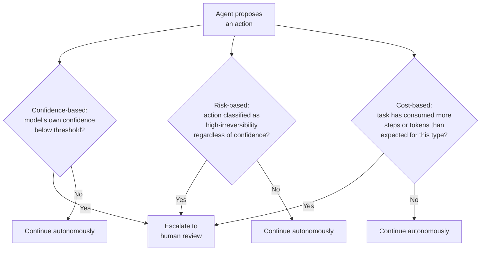
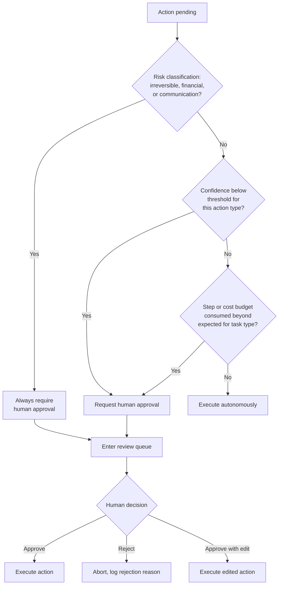
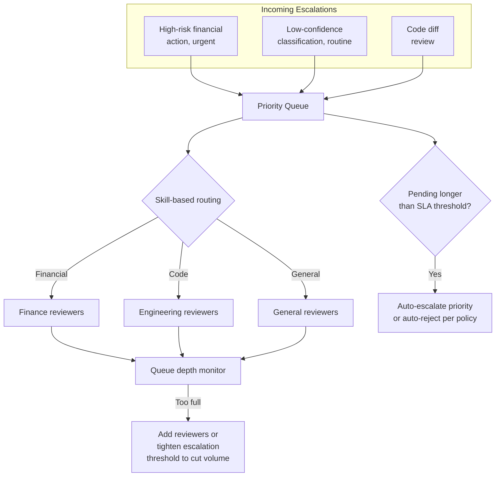
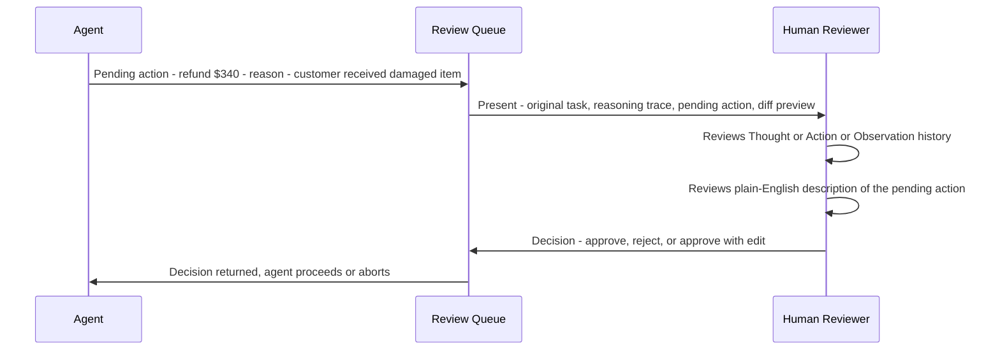
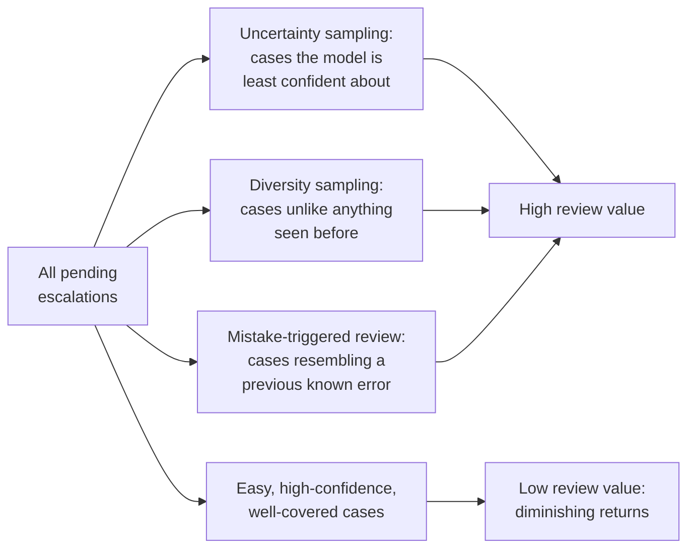
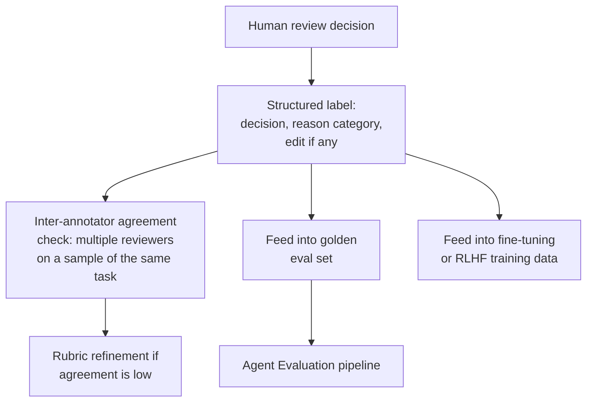
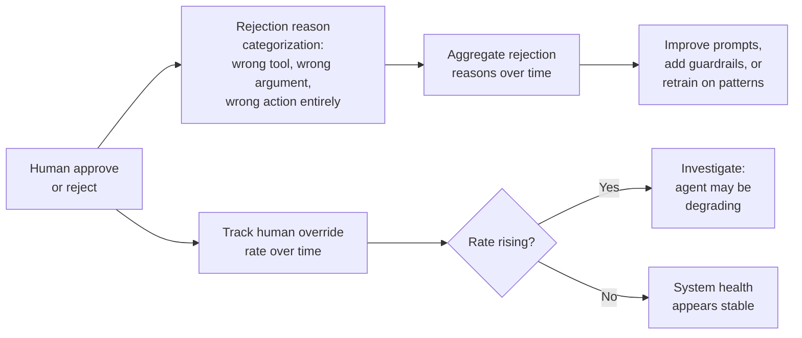
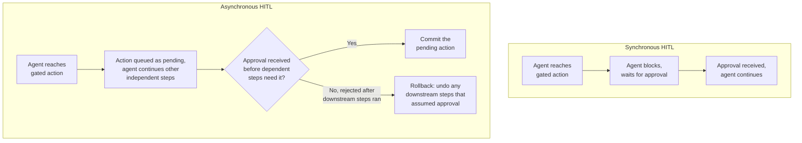
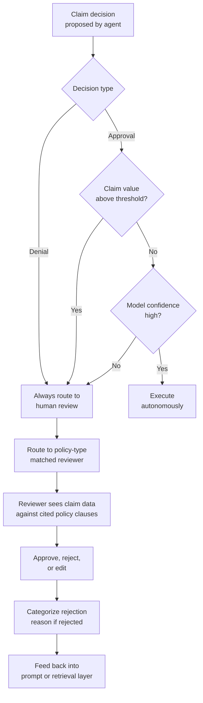

# Human-in-the-Loop Architecture

## Overview

Every guardrail in [Agent Failure Modes & Guardrails](05-agent-failure-modes-and-guardrails.md) eventually points to the same escape hatch: when the agent shouldn't act autonomously, a human decides instead. This chapter is about designing that escape hatch as a real system — when it triggers, how escalations are queued and routed, what the reviewer actually sees, and how their decisions flow back into making the agent better over time. Done well, human-in-the-loop (HITL) is the mechanism that lets an agent operate with real-world stakes at all. Done poorly, it's either a rubber stamp that provides no actual safety or a queue nobody clears that quietly stalls the product.

## Definition

Human-in-the-loop architecture is the systematic design of when an AI system escalates a decision or action to a human reviewer, how that escalation is queued, prioritized, and presented for review, and how the human's decision — approve, reject, or edit — both completes the immediate task and feeds back into improving the system over time. It is distinct from simply "having a human check things sometimes": a real HITL architecture has explicit, tunable triggers, a queue with defined service levels, a reviewer interface designed for fast and accurate decisions, and a closed feedback loop back into evaluation and model improvement.

## Why HITL Is an Architecture Decision, Not an Afterthought

A system with no HITL has no safety net for the agent's mistakes — every wrong decision executes with full real-world effect, with the guardrails from the previous chapter as the only backstop. But a system with poorly designed HITL is not meaningfully safer: a review queue that is always 100% full trains reviewers to approve quickly without real scrutiny (rubber-stamping under time pressure), a queue that reviewers routinely ignore provides no safety at all while still adding latency, and a queue that misroutes escalations to reviewers without the right context produces wrong decisions with high confidence. HITL design directly determines two things a business actually cares about: the system's real risk profile (not its nominal one) and its operational cost (headcount, latency, reviewer burnout) — which makes it an architecture decision with real tradeoffs, not a checkbox to add once and forget.

## Three Escalation Triggers

An action reaches a human through one or more of three distinct trigger types, each catching a different failure shape.

**Confidence-based**: the model's own output confidence (a self-reported score, or a proxy like output entropy or agreement across repeated samples) falls below a threshold. This catches cases where the model itself is signaling uncertainty, but has a real false-positive problem: models are frequently miscalibrated, either overconfident on genuinely wrong answers (providing no signal at all) or underconfident on correct ones (triggering unnecessary escalations). Confidence-based triggers should never be the only trigger for high-stakes actions, precisely because miscalibration means a confident-but-wrong action can slip through untouched.

**Risk-based**: the action is classified as high-irreversibility or high-stakes (see the action taxonomy in [Agent Failure Modes & Guardrails](05-agent-failure-modes-and-guardrails.md)) regardless of how confident the model is. This closes the exact gap confidence-based triggers leave open — a confidently wrong deletion is still gated, because the gate is on the action's classification, not the model's self-assessment.

**Cost-based**: the task has consumed noticeably more steps or tokens than expected for its type, suggesting it is harder or more ambiguous than anticipated, and may be heading toward a bad outcome even if no single step looked wrong. This is a weaker, noisier signal than the other two (a task can legitimately take longer for benign reasons) but catches a distinct failure shape neither of the others does: a task quietly going off the rails in a way no single step's risk classification or confidence score would flag.

**Combining triggers**: production systems typically OR these together — escalate if *any* trigger fires — with risk-based as the non-negotiable floor (always gates classified high-risk actions), and confidence- and cost-based triggers tuned as additional, adjustable sensitivity dials layered on top.

## The Escalation Decision Architecture

The inputs to this architecture — action type, risk classification, confidence score, current step count, current cost — are evaluated in a fixed order with risk classification checked first and treated as absolute: no confidence score, however high, should bypass a mandatory gate on an irreversible action. This ordering is deliberate, not incidental — it's the concrete expression of "risk-based escalation is the non-negotiable floor" from the section above.

## Review Queue Design

Escalations accumulate faster than they're reviewed unless the queue is deliberately engineered, not just a FIFO list.

- **Priority queuing**: high-risk or time-sensitive escalations jump ahead of routine ones — a pending financial transaction with a customer-facing deadline should not wait behind a batch of low-stakes classification reviews just because they arrived first.
- **SLA enforcement**: escalations pending beyond N minutes are auto-escalated (bumped in priority, routed to an on-call reviewer) or, for lower-stakes cases where a stale decision is genuinely equivalent to a safe default, auto-rejected per a defined policy — an escalation that sits forever provides the illusion of a safety net without the substance of one.
- **Skill-based routing**: a code-related escalation routed to an engineer produces a fast, accurate decision; the same escalation routed to a generalist reviewer either produces a slow decision (they have to learn context first) or a wrong one (they approve something they don't have the expertise to evaluate).
- **Queue depth monitoring**: if the queue is consistently over capacity, there are exactly two real levers — add reviewer capacity, or tighten the escalation thresholds to reduce volume (accepting a bit more autonomous risk) — and a growing backlog with neither lever pulled is a silent erosion of the safety net the queue exists to provide.

## The Review Interface

Reviewer UX is the difference between a 20-second review and a 5-minute one, multiplied across every escalation the system generates.

A good review interface shows, in one view: the **original task** (what was the user actually asking for), the **agent's reasoning trace** (the Thought/Action/Observation history that led here, so the reviewer isn't evaluating the pending action in a vacuum), the **specific pending action described in plain English** (not a raw API call payload), a **diff preview for write actions** (what will actually change, concretely, not a paraphrase of intent), **one-click approve/reject**, and an **"approve with edit" path** letting the reviewer correct a minor issue (a wrong amount, a wrong recipient) without rejecting the whole action and forcing the agent to redo the entire sub-task from scratch. Missing any one of these tends to slow reviewers down measurably: no reasoning trace forces the reviewer to reconstruct context from scratch each time; no diff preview forces them to trust a description instead of verifying an effect; no edit path means every small, easily-fixed mistake becomes a full reject-and-retry cycle.

## Active Learning: Which Examples Are Worth Reviewing

Not every escalation teaches the system something. Reviewing a case the model is already 99% reliable on is expensive and low-information; the review budget is better spent where it changes what you know.

- **Uncertainty sampling**: prioritize reviewing cases where the model's confidence is lowest — these are the cases most likely to reveal a real error, and most likely to be genuinely ambiguous enough to need a human judgment call in the first place.
- **Diversity sampling**: prioritize cases that look unlike anything well-represented in existing eval or training data — a model can be highly confident and still wrong on a genuinely novel input class it's never effectively seen, and confidence alone won't catch that.
- **Mistake-triggered review**: prioritize cases resembling a previously identified failure — if the model got a similar case wrong last month, similar new cases deserve continued scrutiny until there's evidence the underlying issue is actually fixed, not just that it hasn't recurred yet by chance.
- **Diminishing returns on easy cases**: if the model is already 99% correct on a well-covered case type, spending reviewer time there teaches almost nothing and crowds out capacity that could go toward the uncertain, diverse, or mistake-adjacent cases that actually move the needle.

## Annotation for Model Improvement

Every human review is also a labeled data point, and the annotation pipeline that captures it should be engineered like a data pipeline — with schema, validation, and versioning — not treated as a side effect of the review process.

- **Inter-annotator agreement**: have multiple reviewers independently label a sample of the same escalations, and measure disagreement — low agreement signals either an ambiguous rubric or an inherently hard-to-judge case type, and either way, needs addressing before treating any individual reviewer's label as ground truth.
- **Rubric design**: a precise, example-anchored rubric ("reject if the refund amount exceeds the order total by more than $5" beats "reject if the amount seems wrong") is what makes agreement measurable and improvable in the first place, rather than a vague standard every reviewer interprets slightly differently.
- **The feedback loop from labels to eval to training**: human labels feed directly into the golden eval sets described in [Agent Evaluation](04-agent-evaluation.md) (a rejected case becomes a new regression-test case), and at higher volume, into fine-tuning or RLHF training data — the annotation pipeline is the connective tissue between "a human caught this in production" and "the model doesn't make this mistake anymore."
- **Schema, validation, versioning**: treat annotation output as you would any other production data — a defined schema for what a label contains, validation that rejects malformed or incomplete labels, and versioning so a rubric change doesn't silently make old and new labels incomparable.

## Feedback Loop Design

Human decisions have to flow back into the system, not just resolve the immediate escalation.

**Rejection reason categorization**: don't just log "rejected" — categorize *why* (wrong tool selected, wrong argument value, right action but wrong timing, or the action was fundamentally the wrong thing to attempt). Aggregated over time, this categorization directly tells you where to invest: a spike in "wrong argument" rejections for one tool points at that tool's schema or description; a spike in "wrong action entirely" points at a reasoning or planning problem, not a tool problem.

**Human override rate as a system health metric**: track the fraction of agent actions that get rejected or edited over time. A rising override rate is a leading indicator that the agent is degrading (a model update, a prompt regression, a tool change) well before it would show up as a drop in end-to-end task success, because override rate is measured on every gated action, not sampled occasionally against a labeled eval set.

**Closing the loop**: the practical test of whether a feedback loop is real, not nominal, is whether a rejection reason category that spikes actually produces a traceable follow-up action (a prompt fix, a new guardrail, a schema update) within a reasonable time — a feedback loop that only produces dashboards nobody acts on is not actually closed.

## Async vs. Synchronous HITL

**Synchronous HITL** blocks the entire task on a single approval — safe (nothing proceeds on an unapproved assumption) but slow, since the whole task's latency now includes however long the review queue takes.

**Asynchronous HITL** queues the gated action for review, continues executing the rest of the task where later steps don't depend on this action's outcome, and only commits the pending action once approved — faster, since independent work isn't blocked, but architecturally more complex: it needs an explicit **pending-action state machine** (queued, approved, rejected, committed), and a **rollback path** for the case where downstream steps already executed on the assumption of eventual approval and the action is then rejected.

**When async is feasible**: specifically when task steps are genuinely independent of the gated action's outcome — a research task that continues gathering unrelated information while a single high-stakes write sits in review is a good async candidate; a task where every subsequent step depends on knowing whether the gated action succeeded is not, and should stay synchronous regardless of the latency cost.

**User experience**: async HITL needs to communicate partial completion honestly — "your request is mostly done; one step [the refund] is awaiting approval and will complete once reviewed" is a coherent, trustworthy state to show a user; silently completing everything except the gated step with no visible indication of what's still pending is not.

## HITL for Different Agent Types

| Agent type | Latency tolerance | HITL shape |
|---|---|---|
| Customer-facing chat agent | Very low — a slow review queue is directly felt by the end user | Favor confidence and risk thresholds tuned to minimize escalation volume; use async HITL for anything not immediately blocking the visible response |
| Back-office automation agent | High — the task runs unattended, nobody is watching in real time | Favor thorough, synchronous review for anything above a low-risk threshold; accuracy matters far more than latency here |
| Code agent | Moderate — a developer expects to review before merge, not before every keystroke | The human reviews a diff, not a natural-language action description — the review interface itself needs to be fundamentally different (a code diff viewer, not an approve/reject button on a sentence) |

Calibrating HITL to agent context means the *same* underlying escalation architecture (triggers, queue, feedback loop) is tuned very differently per surface — a customer-facing agent's tolerance for review latency is close to zero, which pushes toward tighter autonomous-execution thresholds and heavier reliance on async patterns, while a back-office agent with no live user waiting can afford much more conservative, synchronous gating without a perceptible cost.

## Monitoring

- **Human override rate** — the fraction of gated actions rejected or edited; a rising trend is a leading indicator of agent degradation, tracked continuously rather than only during periodic eval runs.
- **Queue depth** — sustained growth means either add reviewer capacity or tighten thresholds to reduce volume; a queue depth metric with no action taken on it is not actually being monitored.
- **SLA breach rate** — the fraction of escalations that blow past their pending-time threshold before a decision; a rising rate erodes the real safety value of the queue even if nominal review coverage stays the same.
- **Reviewer throughput** — decisions per reviewer per hour, tracked to catch both under-resourcing (throughput far below queue arrival rate) and interface problems (a sudden drop in throughput often means the review interface got harder to use, not that reviewers got slower).
- **Annotation agreement rate** — sustained low inter-annotator agreement on a case type signals a rubric or task-definition problem that needs fixing before those labels are trusted for eval or training.

## Interview Questions

### Beginner

**Q: What are the three main triggers for escalating an agent's action to a human?**
Confidence-based (the model's own confidence is below a threshold), risk-based (the action is classified as high-irreversibility or high-stakes regardless of confidence), and cost-based (the task has consumed more steps or tokens than expected, suggesting it's harder than anticipated). Risk-based is typically the non-negotiable floor, since confidence scores can be miscalibrated and a confidently wrong irreversible action still needs to be gated.

**Q: Why is a review queue that's always 100% full actually a safety problem, not just an operational inconvenience?**
A permanently full queue trains reviewers to approve quickly under time pressure rather than genuinely evaluating each case, which turns the review step into a rubber stamp — nominally present, but not actually catching anything. It's a safety problem specifically because the system's dashboards would still show "human review in place" while the real risk profile has quietly reverted to something close to fully autonomous.

### Intermediate

**Q: Why shouldn't confidence-based escalation be the only trigger for a high-stakes, irreversible action?**
Model confidence scores are frequently miscalibrated — a model can be confidently wrong on exactly the cases that matter most, which means a confidence threshold alone will let some genuinely bad irreversible actions through untouched simply because the model didn't signal uncertainty about them. Risk-based escalation, gating on the action's classification rather than the model's self-assessment, closes this gap by requiring review regardless of stated confidence.

**Q: What's the difference between synchronous and asynchronous HITL, and when is async actually worth the added complexity?**
Synchronous HITL blocks the whole task until a pending action is approved — safe but slow. Asynchronous HITL queues the gated action, continues with independent parts of the task, and commits the action once approved, with a rollback path if it's later rejected. Async is worth the complexity specifically when task steps are genuinely independent of the gated action's outcome; if every downstream step depends on knowing the gated action's result, async adds architectural complexity (state machine, rollback logic) without actually buying useful parallelism.

### Senior

**Q: Design the HITL architecture for an agent that can approve or deny insurance claims, where wrong denials generate regulatory risk and slow approvals hurt customer satisfaction.**
Use risk-based escalation as the mandatory floor: any denial is gated for human review by default, since a wrong denial carries asymmetric downside (regulatory exposure) that no confidence score should be trusted to waive. For approvals, use confidence-based escalation tuned to the claim's dollar value — low-value, high-confidence approvals can execute autonomously to protect the customer-facing latency, while high-value approvals route through review even at high model confidence, treating value as a proxy for stakes the same way irreversibility is used elsewhere. Route claims to skill-matched reviewers (a claims adjuster with the relevant policy-type expertise, not a generalist), and give the reviewer a diff-style view of the claim data against the specific policy clauses the agent's reasoning cited, not just a plain-English summary, since claims decisions hinge on exact clause language. Track rejection reasons by category (miscoded claim type, misapplied clause, missing documentation) and feed that categorization directly back into the agent's prompt or retrieval layer rather than treating each rejection as an isolated event.

**Q: Your human override rate has been climbing steadily for three weeks with no agent changes deployed. How do you investigate?**
Treat this the same way as any other leading-indicator regression: first check whether the review queue itself changed (new reviewers with different, possibly stricter standards, a rubric clarification that shifted what counts as a rejection) before assuming the agent degraded, since the override rate is a joint function of agent behavior and reviewer behavior, not agent behavior alone. If reviewer-side factors are ruled out, pull the categorized rejection reasons for the affected period and check whether they cluster around a specific action type or tool — a cluster usually points at an upstream dependency change (a tool's output format shifted, a data source started returning different values) that the agent doesn't know it needs to reason about differently, even though the agent's own prompt and model are unchanged.

### Staff

**Q: A product team wants to remove human review entirely for a category of actions because the override rate has been near zero for six months. How do you evaluate this request?**
A sustained near-zero override rate is necessary evidence but not sufficient justification on its own — it needs to be decomposed by exactly what's been reviewed: if review volume for that category has been consistently high and diverse (covering the real range of production inputs, not a narrow, easy subset), a near-zero override rate is genuine evidence of reliability. If volume has been low, or the category's inputs have been unusually homogeneous, near-zero override reflects an undertested category, not a proven-safe one. Separate the risk classification question from the reliability question: even with strong evidence of reliability, an action classified as irreversible or high-stakes may warrant keeping a lightweight review step (spot-check sampling rather than full review) specifically because the cost of the rare miss is asymmetric, not because the model is unreliable. The right answer is rarely a binary "remove entirely" — propose moving from full review to a sampled-review-plus-anomaly-detection posture, which preserves a safety net at much lower operational cost while still gathering evidence that a full removal, if ever warranted, would need.

## Google-Level Follow-Ups

- "Your reviewer throughput suddenly drops 40% with no change in queue composition. What do you check first?" — probes for treating the review interface itself as a piece of product surface with its own UX regressions (a recent interface change added friction, a data source the interface depends on got slower), rather than assuming reviewers themselves became less effective.
- "How would you tell whether uncertainty sampling for active learning is actually improving the model, versus just generating more labeled data that looks similar to what you already have?" — probes for measuring whether the newly reviewed cases produce measurable eval-set improvements or golden-set additions that cover previously-uncovered failure patterns, rather than treating labeled-data volume itself as the success metric.
- "Two reviewers disagree on 30% of a sample of escalations. Is this a rubric problem or a genuinely hard task category?" — probes for the instinct to examine the specific disagreements qualitatively (are they clustering around one ambiguous rule, or scattered across genuinely judgment-call cases) rather than treating the disagreement rate as a single number to just push down with more training, since the fix differs completely depending on which it is.

## Common Mistakes

- **Treating a permanently full review queue as an acceptable steady state.** It trains reviewers to rubber-stamp under time pressure, which quietly removes the safety value the queue was built to provide.
- **Using confidence-based escalation as the only gate on irreversible actions.** Miscalibrated confidence means some genuinely bad, confidently-wrong actions will slip through if risk classification isn't also enforced as an independent, non-negotiable trigger.
- **Routing escalations to generalist reviewers regardless of domain.** This produces either slow decisions (the reviewer has to build context from scratch) or wrong ones (approving something outside their expertise); skill-based routing is not a nice-to-have at any real volume.
- **Building a review interface with no reasoning trace or diff preview.** Forcing reviewers to evaluate a pending action from a plain-English description alone, with no visibility into how the agent got there or exactly what will change, slows every single review and increases the error rate of approvals.
- **Not categorizing rejection reasons.** Logging "approved" or "rejected" with no reason category throws away the most actionable signal the review process generates — you can't fix what you can't attribute.
- **Removing human review for a category based on a low override rate without checking review volume and diversity.** A near-zero override rate on a narrow, easy input distribution is not evidence the category is safe to fully automate on the real range of production inputs.

## Key Takeaways

- HITL is a risk-profile and operational-cost decision, not a safety-net afterthought; a poorly designed review queue can provide the appearance of safety with almost none of the substance.
- Three escalation triggers — confidence, risk, cost — catch different failure shapes; risk-based escalation on action classification is the non-negotiable floor because confidence scores are frequently miscalibrated.
- The escalation decision architecture should evaluate risk classification first and treat it as absolute — no confidence score should be allowed to bypass a mandatory gate on an irreversible action.
- Review queues need priority ordering, SLA enforcement, and skill-based routing; queue depth with no lever pulled (more reviewers or tighter thresholds) is a silently eroding safety net.
- A good review interface — original task, reasoning trace, plain-English action description, diff preview, one-click approve/reject/edit — is the difference between a 20-second review and a 5-minute one, multiplied across every escalation the system generates.
- Not every escalation is equally worth reviewing; uncertainty sampling, diversity sampling, and mistake-triggered review concentrate reviewer attention where it actually teaches the system something, while easy, well-covered cases have diminishing returns.
- Human override rate is a real-time system health metric that leads end-to-end eval regressions, since it's measured on every gated action rather than sampled occasionally — a rising rate deserves the same urgency as any other production regression signal.

---

*Part of [Agents](index.md) in the [AI System Design Notes](../index.md). Tracked in [BACKLOG.md](https://github.com/GyanendraChaubey/AI-System-Design-Notes/blob/main/BACKLOG.md).*
