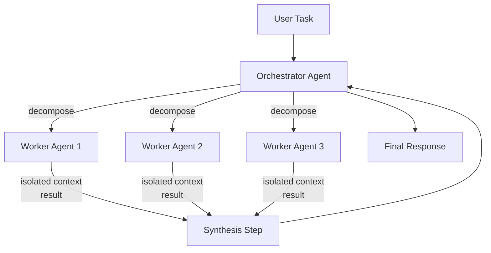
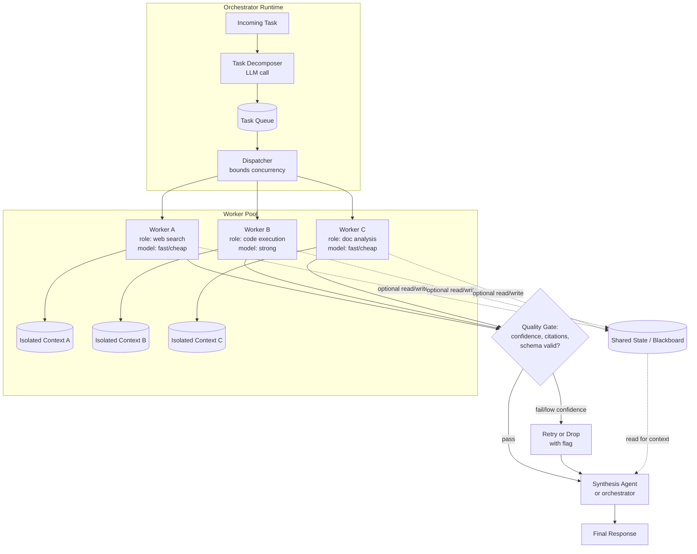
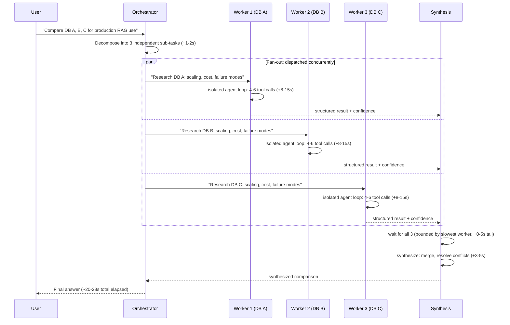
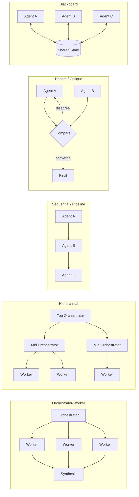
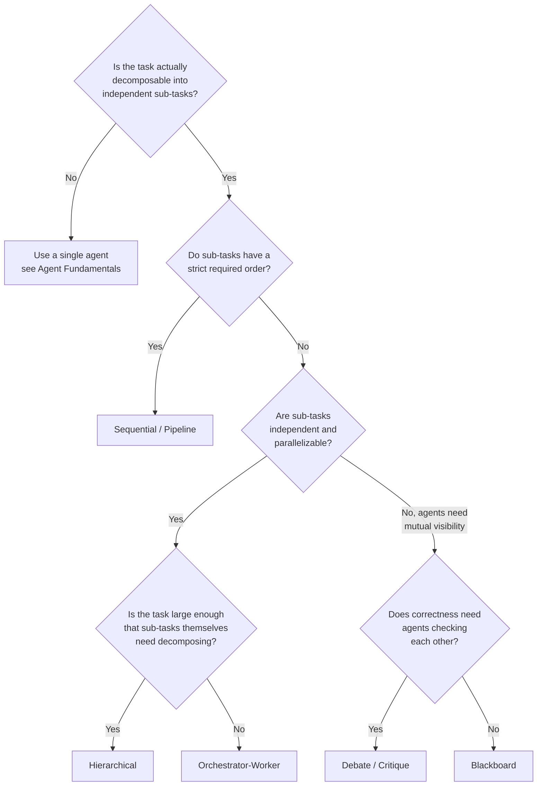

# Multi-Agent Architecture Patterns

## Overview

A multi-agent system runs more than one independent agent loop on the same task and coordinates them explicitly, instead of giving one agent a bigger toolset and a longer leash. Each sub-agent gets its own context window, often its own role, prompt, tools, or even model, and a separate coordination layer decides how work is split up and how results get merged back together. This chapter is about that coordination layer — what it buys you, what it costs, and the handful of patterns that cover almost everything seen in production.

## Definition

A multi-agent system is an architecture in which multiple independent agent loops — each maintaining its own context, and frequently its own role, tool registry, or model — collaborate on a single overall task under an explicit coordination mechanism that determines how the task is decomposed across agents and how their individual outputs are combined into a final result. The defining feature is the coordination mechanism itself: without it, you just have several unrelated agents running in parallel by accident, not a system. This is distinct from one agent with many tools, where a single context window and a single loop make every decision; in a multi-agent system, the decisions are distributed across multiple loops that do not share context by default.

## Problem Statement

A single agent loop (see [Agent Fundamentals & the Agent Loop](../09-agents/01-agent-fundamentals-and-the-agent-loop.md)) degrades in three specific ways as a task grows, and none of them are fixed by giving that one agent more tools or a bigger context window:

- **Context dilution.** A single agent researching five independent sub-questions accumulates all five sub-questions' worth of tool results in one context window. Past a few thousand tokens of accumulated, only-partially-relevant history, the model's attention to any one thread degrades — the same "lost in the middle" effect that limits long-context RAG also limits long-running single agents.
- **Forced serialization.** If five sub-questions are genuinely independent (no sub-question's answer depends on another's), a single agent loop still answers them one tool call at a time, in sequence, because one loop can only be "thinking" about one next action at a time. Wall-clock time scales with the sum of the sub-tasks, not the slowest one.
- **No specialization boundary.** A single agent's prompt, tool registry, and model choice are one global configuration. A task that benefits from one role using a code-execution tool and a cheap model, and another role using a web-search tool and a stronger model, has no clean way to express that inside one loop without the prompt becoming an unmanageable pile of conditional instructions.

Without an explicit multi-agent architecture, teams hit these limits by either accepting the degradation (slower, noisier single-agent answers) or by hand-rolling ad hoc orchestration scripts that are effectively an unstructured, undocumented version of the patterns this chapter names directly.

## Why This Architecture Exists

The first attempt at scaling agents past simple tasks was giving one agent a longer leash: bigger context windows, larger step budgets, bigger tool registries. It broke down for the same structural reason RAG broke down on "just put more in the prompt" — a bigger container does not fix attention degradation over irrelevant content, and it does nothing for serialization, since one model call still produces one next action regardless of how much context it can hold.

The second attempt was manual pipeline orchestration: a human-written script calling model A for step one, handing the result to model B for step two, and so on. This solved specialization (different prompts/models per step) but reintroduced the rigidity agent loops were invented to escape — a fixed sequence can't adapt when step two's right course of action depends on what step one actually returned, beyond a pre-coded branch.

Multi-agent architecture is the synthesis: keep each unit a full agent loop (so it still adapts mid-task and decides when it's done), but make decomposition and recombination across multiple such loops an explicit, first-class part of the system rather than cramming everything into one loop's context or hard-coding the handoffs. Anthropic's own public engineering writeup on its multi-agent research system frames this directly: the lead agent's job is decomposition and synthesis, and spinning up separate sub-agents gives each one a clean, focused context window instead of inheriting the lead's entire accumulated history.

## Core Concepts

- **Orchestrator (lead agent)** — the agent responsible for decomposing the overall task and synthesizing sub-agent outputs into a final result. It is itself a full agent loop, not a fixed script.
- **Worker (sub-agent)** — an agent assigned a bounded sub-task, with its own context window that typically starts clean (no inherited history from the orchestrator's trajectory) and returns a result rather than running indefinitely.
- **Context isolation** — a sub-agent's context contains only what it needs for its sub-task, not the orchestrator's full accumulated state — the primary mechanism by which multi-agent systems solve context dilution.
- **Coordination mechanism** — the explicit logic deciding task decomposition, agent assignment, and result aggregation; this is what separates a multi-agent *system* from several agents that merely happen to run near each other.
- **Synthesis step** — where the orchestrator (or a dedicated synthesizer role) combines multiple sub-agent outputs into one coherent result, resolving contradictions and discarding low-quality sub-results.
- **Shared state / blackboard** — an external store all participating agents can read from and write to, used when agents need visibility into each other's intermediate progress, not just final results.
- **Fan-out / fan-in** — dispatching a task to N parallel workers (fan-out) and collecting their N results back into one stream for synthesis (fan-in).
- **Agent-as-tool** — from the orchestrator's perspective, invoking a sub-agent looks like any other tool call: a request goes out, a result comes back, the loop continues. This is why "one agent with many tools" and "multi-agent" are a continuum, not a hard boundary, as raised at the end of [Agent Fundamentals & the Agent Loop](../09-agents/01-agent-fundamentals-and-the-agent-loop.md).

## The Orchestrator-Worker Shape

The canonical shape is orchestrator-worker: a lead agent decomposes the task, dispatches bounded sub-tasks to parallel workers, and synthesizes their results.

The detailed view exposes what production systems add around the bare fan-out/fan-in: a task queue that bounds concurrency, per-worker tool registries scoped to that worker's role, a shared state store for cases where workers need visibility into each other's progress, and an explicit quality gate before synthesis trusts a worker's result.

## Components

| Component | Responsibility | Does NOT own |
|---|---|---|
| Orchestrator | Decompose the task into sub-tasks, decide which worker(s) handle each, synthesize or trigger synthesis of results | Executing sub-tasks directly, holding every worker's full context |
| Task decomposer | Turn one task description into a set of bounded, ideally independent sub-task specs | Quality-checking returned results |
| Dispatcher | Bound concurrency, assign sub-tasks to available workers, enforce per-worker timeouts | Deciding *what* the sub-tasks are |
| Worker (sub-agent) | Run a full agent loop over a bounded sub-task in its own isolated context, return a result | Knowing about other workers' tasks or results unless explicitly given shared state |
| Shared state / blackboard | Persist intermediate state any agent can read or write, when workers need cross-visibility | Ranking or judging the quality of what's written to it |
| Quality gate | Validate a worker's result against a schema, confidence threshold, or citation requirement before it reaches synthesis | Generating new content or retrying the sub-task itself |
| Synthesis agent/step | Combine multiple worker results into one coherent output, resolving contradictions | Re-running failed sub-tasks (that's the dispatcher's retry logic) |

The orchestrator deliberately does not hold every worker's full trajectory — only their final results (and only the results that passed the quality gate) reach its context. This is the architectural choice that makes context isolation real rather than nominal; an orchestrator that quietly re-absorbs every worker's full reasoning trace has reproduced the context-dilution problem this pattern exists to avoid.

## A Research Task Across Three Parallel Agents

The sequence below traces a research task — "compare the production architecture tradeoffs of three vector databases" — through an orchestrator dispatching three parallel workers, with an illustrative latency budget per hop.

Two details matter here. First, **total wall-clock time is bounded by the slowest worker plus synthesis, not the sum of all workers** — this is the entire point of fan-out, and it is also exactly where multi-agent systems lose if workers are not actually independent or one worker stalls. Second, **the orchestrator's own context never grows by three workers' worth of tool-call history** — it grows by three structured results, which is what keeps the orchestrator's synthesis step tractable regardless of how much exploration each worker did internally.

## Multi-Agent Topology Patterns

The pattern families below cover most production multi-agent designs. They differ in topology (parallel vs. sequential), in how much agents see of each other, and in whether coordination happens through message-passing or shared state.

1. **Orchestrator-worker** — a lead agent decomposes the task, dispatches parallel workers with isolated context, and synthesizes results. The default when sub-tasks genuinely don't depend on each other; this is the shape Anthropic's published multi-agent research system uses.
2. **Hierarchical** — orchestrator-worker generalized to multiple levels, with mid-level orchestrators delegating to their own workers. Useful when sub-tasks are themselves complex enough to need their own decomposition, at the cost of compounding latency and cost at every added level.
3. **Sequential / pipeline** — agent A's output is agent B's input is agent C's input, strictly in order. The right choice when sub-tasks are *not* independent — drafting, then editing, then fact-checking is a pipeline, because each stage needs the previous stage's actual output, not just a slice of the original task.
4. **Debate / critique** — two or more agents review and challenge each other's output before a result is accepted, trading extra inference cost for an error-catching pass. Effective on checkable-answer tasks (does this code compile); weaker where neither agent has real grounds to know which answer is right.
5. **Blackboard** — all agents read and write one shared state store instead of passing results directly. Useful when the set of agents or the order they need each other's findings isn't known ahead of time, at the cost of conflict resolution for concurrent writes and losing the clean isolation orchestrator-worker provides by default.

## Durable Agent Workflows

Short agent tasks (under 60 seconds, under 20 steps) can run in-memory in a single process — if the process crashes, restarting from scratch is acceptable. **Long-horizon agent tasks** (research pipelines that run for hours, autonomous engineers that work overnight, document-processing pipelines over millions of files) cannot accept this: a crash 90 minutes into a 2-hour run is not acceptably handled by restarting from the beginning.

**The problem: agents are stateful processes that fail partway through.**

An agent loop is a stateful, asynchronous computation — each step depends on all previous steps' results. Standard web servers are stateless and scale horizontally; agent loops are inherently stateful and must be designed to survive process failure.

**Durable execution patterns:**

- **Checkpoint-and-resume.** After each completed step, the agent's full state (history, tool results, scratchpad, step index) is serialised to a durable store (database, object storage). On restart, the agent loads the last checkpoint and continues from there. This is the simplest approach and is sufficient for moderate failure rates, but requires the orchestration framework to correctly re-enter mid-loop.
- **Workflow orchestration engines (Temporal, Prefect, dbt-style DAGs).** For pipelines where agent steps map to discrete, individually retryable units of work, workflow engines provide durable execution semantics natively — each "activity" runs at-least-once with automatic retry, and the workflow's execution history is persisted by the engine. The agent loop becomes a workflow definition; individual tool calls become activities. Cost: operational overhead of running the workflow engine; benefit: all the durability, retry, and visibility tooling comes for free.
- **Event-sourced state.** Instead of checkpointing the full agent state, store the event log (every observation and action taken) and reconstruct state by replaying it. Useful when replay is cheap and the event log is the ground truth you want anyway (for audit, eval, or debugging).

**Why this matters for multi-agent systems specifically:**

Multi-agent pipelines are more, not less, vulnerable to partial failure — a 3-worker fan-out where one worker crashes 20 minutes in must either restart all 3 workers (losing 60 person-minutes of compute) or have a mechanism to resume just the failed worker while preserving the other two workers' completed results. This requires the orchestrator to track per-worker state independently, which standard in-memory orchestrators don't do.

**Practical threshold:** Build for durability when any of these are true: (a) the task regularly runs longer than 5 minutes, (b) partial results have real value even if the full task fails, (c) task restarts have a non-trivial cost (GPU time, API credits, human review), or (d) the system runs tasks on infrastructure with non-trivial spot-instance preemption rates.

## Tradeoffs

| Advantages | Disadvantages |
|---|---|
| Each agent's context stays focused, avoiding the dilution a single agent suffers on broad tasks | Token cost multiplies roughly linearly with agent count — see Cost Optimization below |
| Independent sub-tasks run concurrently, cutting wall-clock time to roughly the slowest sub-task instead of the sum | Coordination overhead: decomposition and synthesis are themselves extra LLM calls that add latency and cost |
| Different roles can use different prompts, tools, or models suited to their specific sub-task | A confidently wrong worker result can poison synthesis, since the orchestrator usually trusts structured worker output without re-deriving it |
| Failure of one worker doesn't necessarily kill the whole task if others succeed | New debugging surface: a bad outcome could be decomposition, any one worker, or synthesis — full-system trajectory inspection gets harder with each added agent |
| Scales naturally to tasks too broad for any one context window | Latency is bounded by the *slowest* worker, not the average — one stuck sub-agent stalls the whole fan-in |

This decision is exactly the subject of [Single-Agent vs Multi-Agent](../23-staff-level-architecture/05-single-agent-vs-multi-agent.md) — that chapter is the place to go for the full decision framework and checklist; this chapter assumes you've already decided multi-agent is justified and need to choose *which* pattern.

## Scalability

- **Worker count has diminishing and eventually negative returns.** Splitting a task into more workers helps until sub-tasks stop being meaningfully independent or small enough to justify their own context-and-call overhead; past that point, added workers mostly add synthesis complexity and cost without cutting latency further, since wall-clock time is bounded by the slowest worker, not the count.
- **Concurrency is bounded by downstream tool backends, same as single-agent loops**, but multiplied by however many workers are calling the same backend simultaneously — three workers each hitting the same search API at once can trigger rate limiting that one agent making the same calls sequentially would not.
- **Synthesis cost grows with the number and size of worker results being merged**, not just worker count — five workers each returning a 2,000-token finding push a meaningfully larger context into the synthesis step than five workers each returning a 200-token finding, independent of how much work each worker did internally to get there.
- **Hierarchical depth compounds overhead multiplicatively, not additively.** Each additional level of delegation adds its own decomposition and synthesis pass, so a two-level hierarchy with 3 mid-orchestrators each running 3 workers is closer to 9 workers' worth of token cost plus 4 orchestrators' worth of coordination overhead (1 top + 3 mid), not a free way to scale to more workers.
- **Shared-state (blackboard) designs hit write-contention limits before context limits.** As concurrent agent count rises, conflicting or stale reads/writes against shared state become the bottleneck well before any individual agent's context window does — this needs the same concurrency-control discipline as any shared-mutable-state system, not LLM-specific tooling.

## Reliability

| Failure | Degradation strategy |
|---|---|
| One worker times out or errors | Synthesize from the workers that did return, flag the missing piece explicitly rather than failing the whole task |
| A worker returns a confidently wrong result | Quality gate (schema validation, confidence threshold, cross-checking against other workers' findings) before synthesis trusts it — never let a worker's output reach synthesis unchecked |
| Decomposition step produces overlapping or contradictory sub-tasks | Detect overlap in the synthesis step (workers returning materially conflicting claims) and either re-dispatch a clarifying sub-task or surface the conflict to the user instead of silently picking one |
| Orchestrator itself fails mid-task | Treat the orchestrator like any agent loop: hard step/cost/time ceilings, and a best-effort partial response from whichever workers had already completed |
| Synthesis step receives too many/too-large worker results to fit its context | Pre-summarize each worker result to a bounded size before it reaches synthesis, rather than passing raw worker trajectories through |
| Cascading retries (a failed worker retried by a dispatcher that itself has no budget) | Cap retries per worker and per task overall — the same unbounded-loop risk from single-agent systems applies per-worker here, multiplied by worker count |

The blast radius of a multi-agent failure has a shape single-agent failures don't: a bad decomposition affects every downstream worker, while a bad single worker affects only its own slice — which means decomposition quality deserves more scrutiny and testing than any individual worker's prompt, since it's the one component whose failure isn't contained.

## Security

Multi-agent systems inherit every threat from single-agent loops (tool-argument injection, unbounded side effects, privilege accumulation — see [Agent Fundamentals & the Agent Loop](../09-agents/01-agent-fundamentals-and-the-agent-loop.md)) and add two of their own:

- **Cross-agent injection via synthesis.** A worker that retrieved attacker-controlled content (a malicious webpage, a poisoned document) can pass that content into its returned result, which the orchestrator's synthesis step then reads as trusted worker output rather than as the untrusted retrieved content it actually originated from. The mitigation is to treat every worker's result as untrusted input to the synthesis step, the same way a tool result is untrusted input to the next reasoning step in a single agent — not as a verified finding just because it came from "your own" sub-agent.
- **Privilege fan-out.** Granting a broad tool registry to a single agent exposes one context to that registry's risk; granting different broad registries to N parallel workers multiplies the number of independent contexts that registry's risk surface is exposed through, each with its own chance of being influenced by untrusted content during its own isolated loop. Scope each worker's tools tightly to its specific role, not to "whatever the task might need" across all workers.

Shared-state (blackboard) designs add a third risk: any agent with write access to shared state can plant content another agent later reads as ground truth, which is a more direct injection path than going through synthesis, since there's no orchestrator review step in between. Blackboard designs need the same data/instruction separation discipline RAG applies to retrieved chunks, applied to every blackboard write.

## Cost Optimization

- **Right-size worker count to genuinely independent sub-tasks**, not to "more parallelism is always better" — a 6-worker decomposition of a task with only 3 truly independent threads pays for 6 contexts' worth of duplicated background to do 3 workers' worth of real work.
- **Use cheaper/smaller models for narrow worker roles**, reserving the strongest model for decomposition and synthesis, where reasoning quality matters most and mistakes are least contained.
- **Trim what each worker is given, not just what it returns** — auditing shared background down to only what each sub-task needs avoids paying for the same boilerplate context N times over.
- **Bound worker output size with a schema** before it reaches synthesis; a length-capped structured result is cheaper to merge and less likely to dilute the synthesis step with irrelevant content.
- **Skip multi-agent decomposition entirely when the task doesn't need it** — per the decision tree above, the highest-leverage saving is often recognizing the task was answerable by one agent or one RAG call, before a single worker is ever dispatched (see [Single-Agent vs Multi-Agent](../23-staff-level-architecture/05-single-agent-vs-multi-agent.md)).

**Illustrative cost-multiplication example.** A research task a single agent completes sequentially in roughly 12 tool-call steps — using the per-step cost shape from [Agent Fundamentals & the Agent Loop](../09-agents/01-agent-fundamentals-and-the-agent-loop.md) — costs on the order of $0.06 in input tokens and takes roughly 60-90 seconds wall-clock (12 steps × 800ms-1.5s model latency plus tool time). Split across an orchestrator and 4 parallel workers each doing 3-4 of the original steps: token cost rises to roughly **1.6-2.2x** the single-agent total, because each worker re-establishes its own task framing from scratch on top of the orchestrator's decomposition call and the synthesis call that reads all 4 results — even though each worker individually does less work than the single agent did. Wall-clock time drops to roughly the slowest worker's 3-4 steps plus coordination overhead, **20-30 seconds instead of 60-90** — a real 2-3x latency win. The breakeven: multi-agent pays for itself when the latency saved is worth more than the ~2x token premium — true for an interactive query someone is waiting on, false for a cost-sensitive batch job where nobody is watching the clock.

## Monitoring

- **Cost and latency per agent role, not just per task.** An aggregate "task cost $0.40" hides whether the orchestrator, a specific worker role, or synthesis is the actual driver — break it down by role from day one.
- **Worker failure/timeout rate per role**, individually. A single chronically slow or unreliable worker role degrades every task that uses it, the same way a single flaky tool degrades every single-agent loop that calls it.
- **Decomposition quality**, sampled via human or LLM-as-judge review of whether sub-tasks were actually independent and non-overlapping — a rising rate of overlapping or contradictory sub-tasks is the earliest sign the decomposition prompt or model has regressed.
- **Synthesis disagreement rate** — how often worker results meaningfully conflict and synthesis has to resolve a contradiction rather than simply merge complementary findings; a rising trend often points to inconsistent worker prompting or upstream data drift, not synthesis itself.
- **Worker-count distribution per task** (p50/p95/p99) — a creeping worker count for the same task category usually means decomposition is over-splitting, not that tasks have genuinely gotten more complex.
- **Tail latency attribution**: which role is most often the slowest worker holding up fan-in, tracked separately from average per-role latency, since the slowest worker — not the average one — sets the user-visible wall-clock time.

## Production Best Practices

- Decompose into the **fewest workers that capture genuine independence**, not the most workers that technically could run in parallel, because every additional worker pays fixed context-duplication overhead regardless of how small its actual sub-task is.
- Pass workers **only the slice of context their sub-task needs**, never the orchestrator's full accumulated state, because re-inheriting full context per worker defeats the entire purpose of context isolation.
- Put a **quality gate between every worker and synthesis** — schema validation, a confidence threshold, or cross-worker consistency checks — because synthesis is the single point where one bad worker result can poison an otherwise-correct final answer.
- Cap **worker output size and shape with a schema**, not free-form text, so synthesis is merging structured, comparable results rather than parsing prose to figure out what each worker actually found.
- Treat the **orchestrator's own loop with the same step/cost/time ceilings** as any single agent — a multi-agent system's orchestrator going unbounded is strictly worse than a single agent going unbounded, since it can spawn unbounded workers underneath it.
- Default to **orchestrator-worker for independent sub-tasks and sequential pipelines for dependent ones**; reach for hierarchical, debate, or blackboard patterns only when the simpler two genuinely don't fit, since each adds coordination complexity that has to be debugged later.

## Real World Examples

The patterns below are described as publicly documented or observable system shapes, not as confirmed proprietary internals beyond what each company has published.

- **Anthropic's published multi-agent research system** is the most directly documented example of this chapter's orchestrator-worker pattern: a lead agent decomposes a research question, spins up parallel sub-agents each with isolated context and its own tool calls, and a synthesis step combines their findings into one report — publicly described as trading higher token cost for substantially better coverage on broad, parallelizable research questions than a single agent working the same question sequentially. The [Multi-Agent Research System](../25-case-studies/16-multi-agent-research-system.md) case study in these notes covers this shape in full system-design depth.
- **OpenAI's and Google's deep-research-style products** are publicly observable as multi-step, multi-source research tools that explore many sources and synthesize one structured report, consistent with some form of decomposition-and-synthesis under the hood — though neither company has published the internal orchestration architecture in implementation detail.
- **The [Deep Research Agent](../25-case-studies/07-deep-research-agent.md) case study in these notes** works through a from-scratch design for this product category end to end — query decomposition, parallel source gathering, report synthesis — as an applied instance of these patterns, illustrative rather than a claim about any specific shipped product's internals.
- **Coding agent products with planner/sub-task structure** show a related but distinct shape: a planning pass followed by execution against one shared codebase, which leans closer to sequential/pipeline coordination over a shared resource than to independent parallel fan-out, since file edits in a shared codebase are rarely as independent as research sub-questions.

## Interview Questions

### Beginner

**Q: What makes a system "multi-agent" instead of just one agent with a lot of tools?**
Multiple independent agent loops, each with its own context window, plus an explicit coordination mechanism deciding how work is divided and results combined. One agent calling many tools is still one loop making one decision at a time over one shared context; multi-agent means more than one loop, each reasoning independently, with something deciding how they fit together.

**Q: Why would you split a task across multiple agents instead of giving one agent more time?**
Three reasons: context isolation (each sub-agent gets a focused context instead of one diluted context), parallelism (independent sub-tasks run concurrently instead of one at a time), and specialization (different sub-tasks use different tools, prompts, or models suited to that sub-task).

### Intermediate

**Q: Walk through what happens when an orchestrator dispatches work to parallel workers and a quality gate matters.**
The orchestrator decomposes the task into independent sub-tasks and dispatches each to a worker running its own isolated agent loop. Each worker returns a structured result, and before that result reaches synthesis, a quality gate checks it against a schema, a confidence threshold, or consistency with other workers' findings — because synthesis generally trusts worker output without re-deriving it, a result that skips the gate can directly poison the final answer.

**Q: When would you use a sequential pipeline instead of orchestrator-worker fan-out?**
When sub-tasks have a strict dependency order — agent B genuinely needs agent A's output, not just a slice of the same original task. Forcing dependent sub-tasks into a parallel fan-out either produces wrong results (B started before A finished) or silently serializes anyway while still paying fan-out's coordination overhead.

### Senior

**Q: A 4-worker orchestrator task is taking longer than expected. How do you diagnose where the time is going?**
Break down latency per role — decomposition, each worker, synthesis — not just total elapsed time. Since wall-clock time is bounded by the slowest worker, find which specific worker is the tail; a single slow worker (a flaky tool, an overly broad sub-task, an unbounded retry) is the usual cause, not "the model is generally slow." Compare against the per-role latency distributions under Monitoring to tell a one-off incident from a real regression.

**Q: How do you prevent one confidently wrong worker from corrupting the final synthesized answer?**
Treat every worker result as untrusted input to synthesis, not a verified finding: require structured, schema-validated output per worker; attach a confidence signal synthesis can weigh; cross-check overlapping claims when sub-tasks overlap; and design synthesis to surface conflicts to the user or re-dispatch a clarifying sub-task rather than silently picking one version when results disagree.

### Staff

**Q: You're deciding between a single agent and a 5-worker orchestrator-worker design for the same task. Walk through your reasoning.**
Start from whether the task actually decomposes into independent sub-tasks — if not, multi-agent adds cost and coordination overhead for no benefit, and a single agent wins outright. If it does decompose, the real comparison is cost vs. latency: multi-agent roughly multiplies token cost with worker count from duplicated shared context, but caps wall-clock time near the slowest worker instead of the sum. Worth it when latency is the binding constraint (interactive, time-sensitive); not worth it when cost is binding (high-volume batch work nobody is watching synchronously) — the exact decision the [Single-Agent vs Multi-Agent](../23-staff-level-architecture/05-single-agent-vs-multi-agent.md) framework formalizes. "More agents are more capable" is not a valid justification on its own.

**Q: Design the failure-handling strategy for an orchestrator-worker system where any of the 5 workers might time out, error, or return low-confidence results.**
Each worker gets its own bounded retry budget, independent of the others, so one bad worker can't consume a shared retry pool meant for all five. Synthesis is designed to operate on a partial result set from the start, not as a bolted-on fallback — 4 successful workers and 1 timeout should still produce a useful answer with the gap explicitly flagged, not a failed task. A quality gate sits between every worker and synthesis to catch low-confidence results before they're treated as ground truth, and the orchestrator runs under the same step/cost/time ceilings as any single agent loop, since an unbounded orchestrator can spawn unbounded cost across every worker beneath it.

## Google-Level Follow-Ups

- "Your 5-worker orchestrator design costs 3x a single agent doing the same task, and the product team says the latency win isn't worth it. What do you change?" — probes whether the candidate's first instinct is to drop worker count or switch patterns entirely (sequential, or back to single-agent), rather than trying to "optimize" a design the cost-latency tradeoff doesn't justify for this use case.
- "Two of your five workers keep returning contradictory findings on overlapping sub-tasks. Decomposition bug or expected behavior?" — probes whether the candidate distinguishes deliberate overlap (redundancy for cross-checking, a legitimate debate-pattern choice) from accidental overlap (a decomposition bug producing sub-tasks that were supposed to be independent but aren't).
- "How would this design change if one worker's sub-task could, in rare cases, take 10x longer than the others?" — probes for understanding that fan-in tail latency is dominated by the single slowest worker; a strong answer covers timeout/partial-result strategies, possibly demoting that role to async/best-effort rather than just "add a timeout" with no fallback.
- "At what scale does hierarchical multi-agent stop paying for itself?" — probes whether the candidate recognizes each added delegation level compounds cost and latency multiplicatively, and that past some point another hierarchy level for "more parallelism" produces mostly coordination overhead with little added useful work underneath it.

## Common Mistakes

- **Defaulting to multi-agent because it sounds more capable.** Multi-agent is not strictly better than single-agent; for non-decomposable tasks, it adds cost and coordination overhead with no offsetting benefit. Run the decision tree before reaching for it.
- **Giving every worker the orchestrator's full context "to be safe."** This defeats context isolation, the primary reason multi-agent exists, and reproduces the exact dilution problem the architecture was supposed to solve.
- **Trusting worker output unchecked at synthesis.** A worker returning a confident, well-formatted, wrong answer is indistinguishable from a confident, well-formatted, correct one unless an explicit quality gate exists between worker and synthesis.
- **Over-splitting into more workers than there are genuinely independent sub-tasks.** Extra workers each pay fixed context-duplication overhead; past the point of real independence, more workers is pure cost with no latency benefit.
- **Treating wall-clock latency as the sum of workers instead of the max.** Designs and capacity plans built on summed-latency assumptions either over-provision unnecessarily or, worse, miss that one slow worker — not the average — sets the real user-facing latency.
- **No retry/timeout isolation per worker.** A shared retry budget across all workers lets one chronically failing role starve every other worker's retry allowance on the same task.
- **Letting the orchestrator run unbounded.** An orchestrator without its own step/cost/time ceilings can spawn unbounded downstream worker cost, which is strictly worse than a single unbounded agent loop, not just as bad.

## Key Takeaways

- A multi-agent system is defined by an explicit coordination mechanism dividing work and combining results across multiple independent agent loops — not by agent count alone.
- The three reasons multi-agent exists are context isolation, parallelism, and specialization; if a task needs none of the three, a single agent is the right default.
- Orchestrator-worker (parallel, independent sub-tasks), sequential/pipeline (dependent sub-tasks), hierarchical (multi-level delegation), debate/critique (mutual checking), and blackboard (shared state) cover nearly all production designs — pick based on dependency structure first.
- Token cost multiplies roughly linearly with worker count due to duplicated shared context; wall-clock latency is bounded by the slowest worker, not the sum — these two facts together define the entire tradeoff.
- A confidently wrong worker result is a distinct failure mode from single-agent failures: it can poison synthesis unless an explicit quality gate sits between every worker and the synthesis step.
- Multi-agent is not free parallelism — see [Single-Agent vs Multi-Agent](../23-staff-level-architecture/05-single-agent-vs-multi-agent.md) for the full decision framework on when the cost premium is actually worth the latency win.
- The orchestrator is itself a full agent loop and needs the same step/cost/time ceilings as any single agent — left unbounded, it can spawn unbounded cost across every worker beneath it.
- Anthropic's published multi-agent research system and the [Deep Research Agent](../25-case-studies/07-deep-research-agent.md) and [Multi-Agent Research System](../25-case-studies/16-multi-agent-research-system.md) case studies in these notes work through this exact orchestrator-worker shape at full implementation depth.
