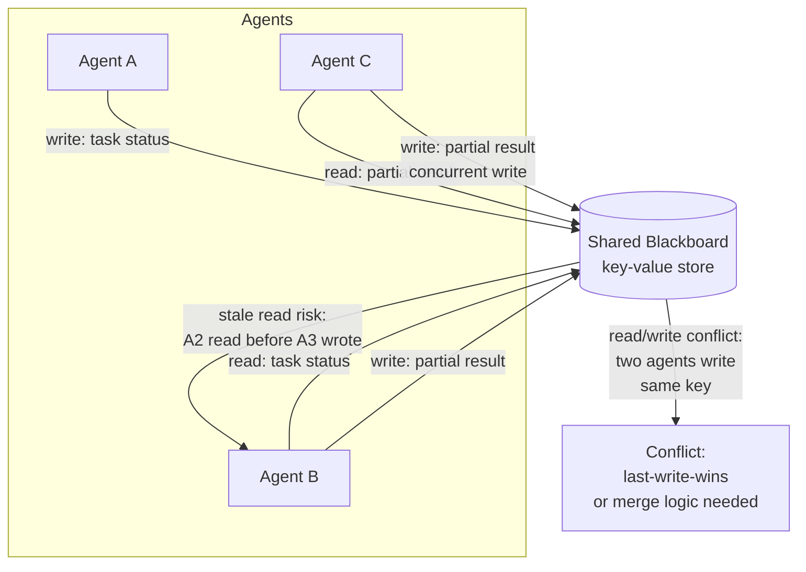
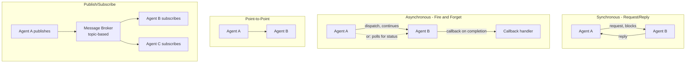
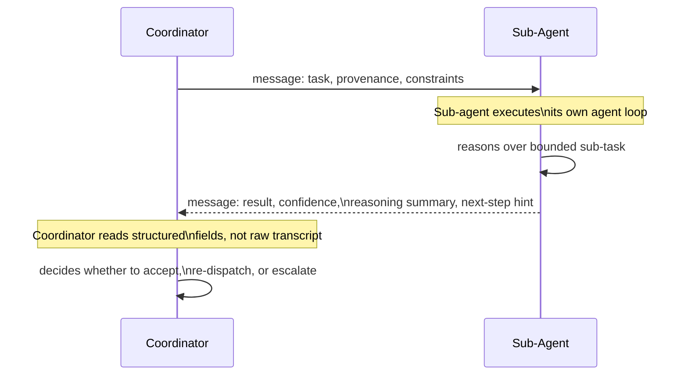
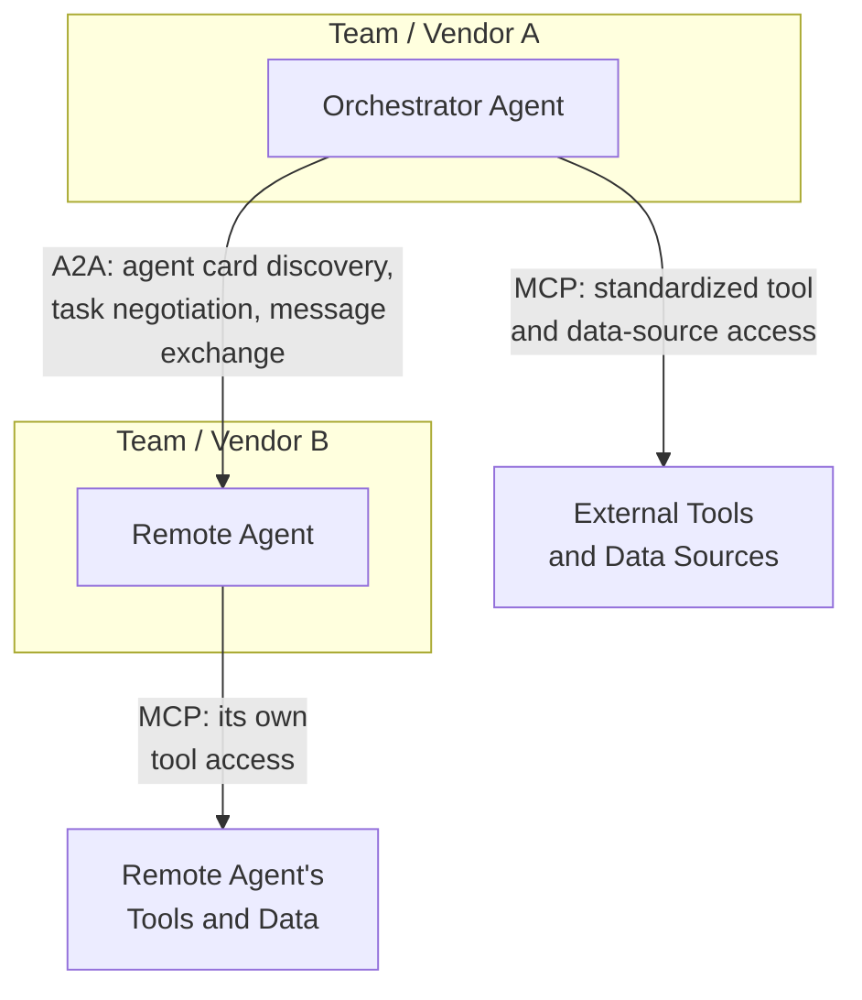
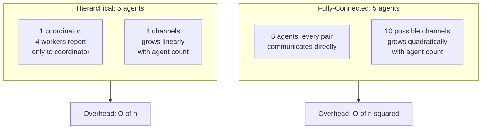
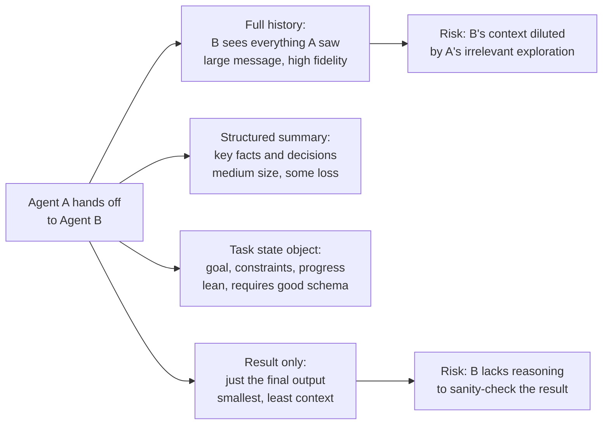
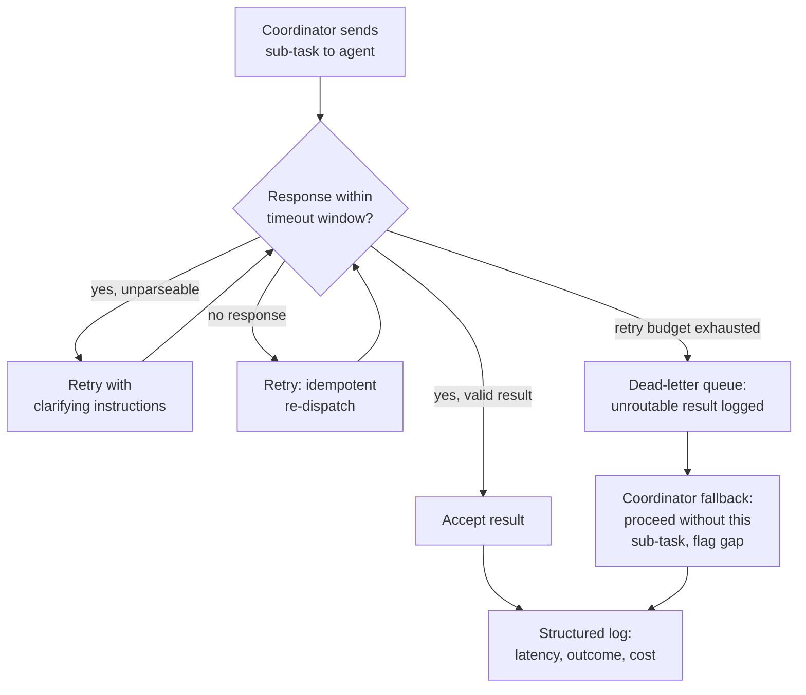
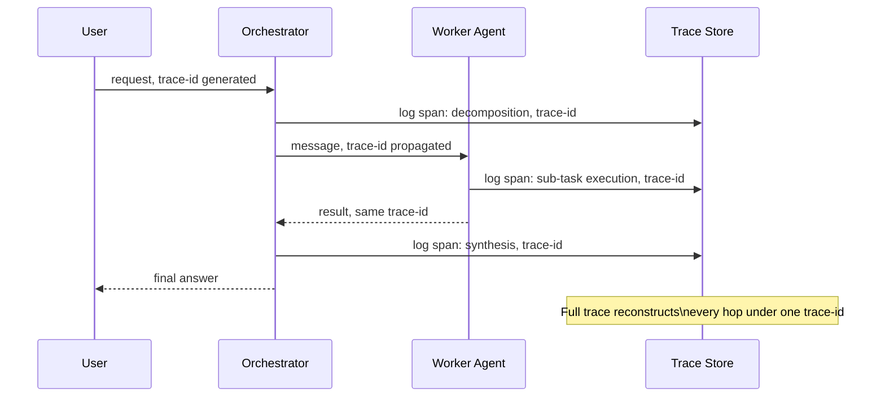
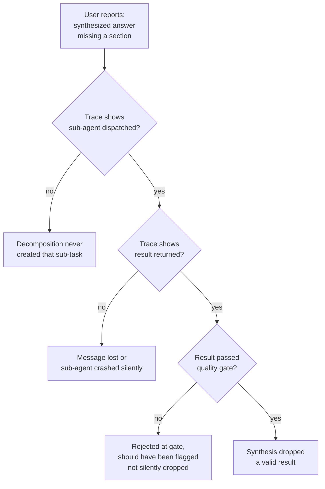
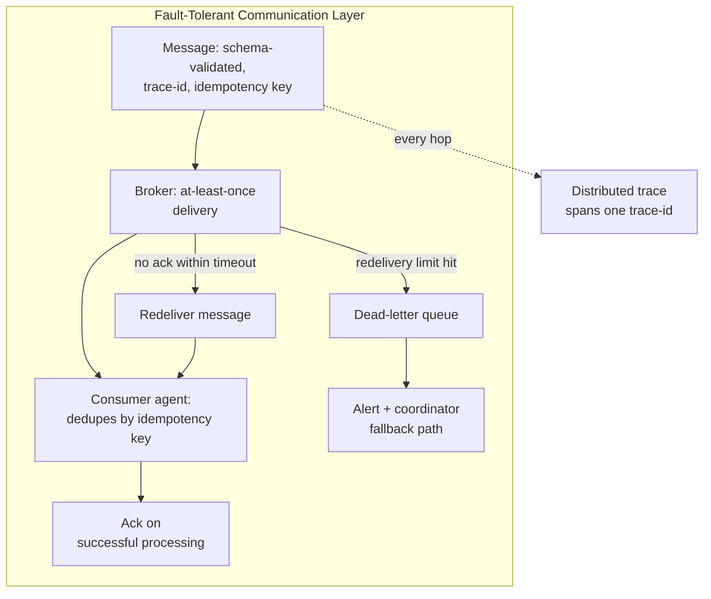

# Agent Communication Protocols

## Why Communication Design Is a First-Class Architecture Decision

In a [multi-agent system](01-multi-agent-architecture-patterns.md), agents do not share context by default. Each agent loop has its own context window, and unless something explicit moves information across that boundary, one agent has no idea what another is doing, found, or decided. Every piece of state one agent needs from another — a partial result, a constraint discovered mid-task, an error another agent hit — has to be deliberately packaged and transmitted. There is no shared memory in the way threads in one process share memory; there is only what gets sent.

This is why the communication mechanism is the connective tissue of a multi-agent system, not an implementation detail to bolt on after the orchestration pattern is chosen. The communication design determines what crosses agent boundaries, in what format, with what delivery guarantees — and that, in turn, determines how debuggable the system is (can you see what one agent told another?), how much latency and cost each handoff adds, and whether the system is correct when a message is delayed, dropped, or malformed. A well-chosen [orchestrator-worker topology](01-multi-agent-architecture-patterns.md#the-orchestrator-worker-shape) with a sloppy communication layer underneath it is still a brittle system: the topology says who talks to whom, but the communication layer decides whether what they say to each other is trustworthy, complete, and recoverable when something goes wrong.

Two broad approaches cover almost all production designs: agents can share a common store that everyone reads and writes (**shared memory / blackboard**), or agents can exchange discrete, addressed **messages** directly or through a broker. Most real systems use both — a blackboard for slow-changing shared state, explicit messages for task dispatch and results — but understanding them as distinct mechanisms with distinct failure modes is the foundation for everything else in this chapter.

## Shared Memory / Blackboard Model

A blackboard is a central store — a database, a key-value store, a shared scratchpad object — that all participating agents can read from and write to. Instead of Agent A explicitly telling Agent B "here is what I found," Agent A writes its finding to the blackboard and Agent B reads it whenever it needs it, without A and B ever having a direct exchange.



**What it buys you.** No agent needs to know in advance which other agent will need its output, or when — this is valuable when the set of consumers isn't known ahead of time, or when agents run on different schedules and can't coordinate a direct handoff. It also gives every agent visibility into overall task state without the orchestrator having to relay everything manually.

**What it costs you.**

- **Read/write conflict handling.** Two agents writing to the same key concurrently need an explicit resolution rule — last-write-wins silently discards one agent's work; a merge function needs to be written per data shape; optimistic locking needs retry logic. None of this is free, and skipping it means silent data loss under concurrency.
- **Stale reads.** An agent that reads the blackboard before another agent's relevant write has landed proceeds on outdated information, with no signal that anything was stale — the read succeeded, it just succeeded against the wrong version of the world.
- **Invisible coupling between agents.** Because no direct message was ever sent, the dependency between "Agent A writes key X" and "Agent B reads key X" exists only in the blackboard's schema and each agent's implementation — it is not visible in any single place, which makes tracing a bug ("why did B use stale data?") require reconstructing a write/read timeline after the fact rather than reading a message log.

**When this model is actually fine.** Blackboard designs work well for small teams of agents with genuinely non-overlapping write domains — each agent owns a distinct set of keys nobody else writes to, and reads are naturally tolerant of some staleness (status dashboards, progress indicators, non-critical shared context). It gets risky fast once two agents can write the same key, or once a downstream decision depends on reading the latest value at exactly the right moment.

## Explicit Message Passing

The alternative is agents communicating through structured messages sent directly to each other or routed through a broker — every exchange is an addressed, discrete event rather than a side effect of reading shared state.



**Synchronous (request/reply) vs. asynchronous (fire-and-forget).** Synchronous is simplest to reason about — the caller blocks until the callee responds — but ties up the caller for the callee's full duration, which is expensive when the callee is itself a multi-step agent loop that might take tens of seconds. Asynchronous dispatch lets the caller continue other work and either receive a callback when the result is ready or poll for status; this suits long-running sub-agent tasks, at the cost of more coordination logic (what does the caller do in the meantime, how does it know when to check back).

**Point-to-point vs. pub/sub.** Point-to-point (direct addressing) is the natural fit for orchestrator-worker dispatch, where the orchestrator knows exactly which worker should get which sub-task. Pub/sub decouples sender from receiver entirely — useful when multiple agents might care about the same event (a "document updated" event that several downstream agents should react to) without the publisher needing to know who's listening.

**Delivery failure handling: at-least-once vs. exactly-once, in an LLM context.** Exactly-once delivery is expensive to guarantee in any distributed system and is rarely worth it here — the standard default is at-least-once delivery with idempotent handling on the receiving agent. The LLM-specific wrinkle: a sub-agent that received the same task twice due to a redelivered message doesn't just re-run a deterministic function — it makes a fresh model call, which can produce a *different* (not just duplicate) result the second time, and burns tokens doing it. Idempotency for agent messages therefore needs an explicit idempotency key checked before the agent re-executes, not just at-least-once delivery at the transport layer and an assumption that reprocessing is harmless.

## Structured Message Schemas

The most common failure in early multi-agent implementations is treating inter-agent messages as free-form text — one agent's final answer string pasted into another agent's prompt. This works until the receiving agent needs to make a decision about the message (is this trustworthy? complete? does it need follow-up?) and has nothing but prose to parse that decision out of.

A well-designed inter-agent message is a typed structure, not a string. At minimum it should carry:

| Field | Purpose |
|---|---|
| `task` or `result` | What was asked, or what was produced — the substantive payload |
| `provenance` / `reasoning` | A short trace of how the result was derived — which tools were used, what sources were consulted — so the receiver can sanity-check rather than blindly trust |
| `confidence` | A signal the receiver can weigh — low confidence should change what the receiver does with the message, not just be decoration |
| `next_action_hint` | What the sender believes should happen next — retry, escalate, accept as final — a suggestion, not a command, but one the receiver doesn't have to re-derive from scratch |
| `status` | Explicit success / partial / failed, distinct from the content itself — a message can carry a "result" field and still be a failure |

Example schema, illustrative rather than any specific framework's wire format:

```json
{
  "message_id": "msg_7f2a",
  "trace_id": "trace_91cd",
  "from_agent": "worker.research.db_pricing",
  "to_agent": "orchestrator",
  "status": "success",
  "task": "Summarize DB-A pricing tiers for 10M rows/month",
  "result": {
    "summary": "DB-A charges per-node above 5M rows...",
    "structured_data": { "base_tier_usd": 400, "overage_per_million": 12 }
  },
  "provenance": ["fetched pricing page v3", "cross-checked with docs API"],
  "confidence": 0.82,
  "next_action_hint": "accept",
  "timestamp": "2026-07-02T10:14:00Z"
}
```



The value of this structure shows up exactly at the [quality gate](01-multi-agent-architecture-patterns.md#components) between a worker and synthesis: a gate can mechanically check `confidence` against a threshold and `status` for failure, something it cannot do against an unstructured paragraph without an extra LLM call just to extract those same fields back out.

## Emerging Interoperability Protocols — A2A and MCP

Bespoke point-to-point integrations don't scale once agents are built by different teams, on different frameworks, or by different vendors entirely. Two protocols are the current industry attempt at standardizing this: Google's **Agent-to-Agent (A2A)** protocol and Anthropic's **Model Context Protocol (MCP)**.



**MCP** standardizes the boundary between an agent and its *tools and data sources* — a common protocol for exposing a capability (a database, a search API, a file system) so any MCP-compliant agent can discover and call it without a bespoke integration per tool. It solves the *N agents × M tools* integration problem, not agent-to-agent coordination directly. See [Model Context Protocol](../13-tool-calling/02-model-context-protocol.md) for the full protocol depth — from a multi-agent standpoint, MCP matters because it's what lets a worker agent built by one team consume a tool built by another without custom glue code.

**A2A** standardizes the boundary between *agent and agent* — agent discovery (an "agent card" describing capabilities), task negotiation, and message exchange in a vendor-neutral format, so an orchestrator built by one team can dispatch work to a remote agent built by a different team or vendor without both sides agreeing on a bespoke API. It solves interoperability between independently-built agents, the problem this chapter's shared/message-passing discussion assumes is already solved *within* one team's system.

**Where they fall short today.** Both are early-stage relative to how long HTTP or gRPC have been battle-tested: semantics for partial results, long-running task cancellation, and complex multi-turn negotiation between agents are still evolving; tooling for debugging cross-vendor agent interactions (tracing a failure across an A2A boundary) is immature compared to what exists for in-process multi-agent debugging; and adoption is uneven enough that "standard" doesn't yet mean "assume the other side supports every optional feature."

**Whether to build on them in production.** For communication *within* a system your own team controls end to end, a lighter-weight, custom schema (like the one above) is usually less overhead than adopting a general-purpose interoperability protocol built for a broader problem than yours. A2A and MCP earn their cost specifically when you need to integrate with agents you don't control — a partner's agent, a vendor's tool-serving layer, or a broader ecosystem where standardization has real switching-cost payoff. Building on an evolving standard also means absorbing its breaking changes; teams adopting either protocol today should expect to track spec revisions actively, not treat version 1 as a stable target.

## Coordination Overhead as a Function of Agent Count

Every message has a cost: serialization/deserialization, network latency, and — specific to LLM-orchestrated systems — the LLM cost of a coordinator that has to read and reason over that message to decide what happens next. None of this is free, and it doesn't scale the way naive intuition suggests.



In a fully-connected topology, where every agent can message every other agent, the number of possible channels grows as $\binom{n}{2} = \frac{n(n-1)}{2}$ — quadratic in agent count. Ten fully-connected agents means 45 possible pairwise channels, each one a candidate for redundant messages, race conditions, and — if a coordinator has to read all of them — a context window that grows with the square of agent count rather than linearly.

Hierarchical topologies (the [hierarchical pattern](01-multi-agent-architecture-patterns.md#multi-agent-topology-patterns) from Chapter 01) sidestep this by construction: each agent talks only to its direct parent, so channel count grows linearly with agent count, not quadratically. This is the core argument for hierarchy at any non-trivial agent count — it isn't just about delegation depth, it's about keeping the communication graph tractable.

**The breakeven where more agents hurt throughput.** Every added agent contributes its own useful work, but also adds its own message overhead — serialization, transit, and (if routed through a coordinator) an LLM call to process it. Throughput improves as agent count rises only as long as the marginal useful work outpaces the marginal coordination cost; past that point, added agents mostly add message volume for a coordinator to process, without adding proportional task progress. In practice this shows up as the same diminishing-and-then-negative-returns curve described for worker count in [Scalability](01-multi-agent-architecture-patterns.md#scalability), driven specifically by the communication layer rather than by compute or model latency.

## Context Serialization Across Agent Boundaries

When Agent A hands off to Agent B, the question "what does B actually need?" has no single right answer — it's a tradeoff every handoff has to make explicitly.



- **Full history.** B inherits A's entire trajectory — every tool call, every intermediate thought. Highest fidelity, but it directly reproduces the context-dilution problem [Chapter 01](01-multi-agent-architecture-patterns.md#problem-statement) named as one of the core reasons multi-agent exists in the first place; if every handoff passes full history, isolated contexts stop being isolated.
- **Structured summary.** A compressed extraction of what matters — key facts, decisions made, open questions — trading some fidelity for a bounded size. This is the usual right default, and is the same tradeoff explored in depth in [Context Compression and Summarization](../04-context-engineering/03-context-compression-and-summarization.md): summarization is lossy, and the loss needs to be the *right* loss (dropping exploration noise, keeping decisions and constraints).
- **Task state object.** A structured, schema-defined object (goal, constraints, current progress, known blockers) rather than free-form summary text — leaner and more mechanically checkable than prose, at the cost of needing a well-designed schema that doesn't silently drop a field some future task actually needed.
- **Result only.** Just A's final output, nothing about how it got there. Smallest message, but B has no way to sanity-check whether the result reflects a well-reasoned process or a shaky one, and no way to resume if the result turns out to need revision.

The tradeoff is fidelity versus context-window economy: more context means B has A's full picture and less risk of inconsistency with A's reasoning, but a large message defeats the isolation that makes multi-agent systems tractable; less context keeps B lean, but B risks being inconsistent with A's actual reasoning path, or missing a caveat A discovered but didn't think to restate. There is no universally correct choice — the right answer depends on whether B's job is to *build on* A's reasoning (favor structured summary or task state) or simply to *consume* A's output as a black box (result only is fine).

## Failure Handling in Communication

A sub-agent can fail to return a usable message in three distinct ways, and each needs a different handling path: it returns an explicit **error**, it returns **nothing** (timeout, crash, message lost in transit), or it returns something **unparseable** (malformed JSON, a schema violation, a response that doesn't match what was asked).



- **Timeouts and retries with idempotency.** A retry has to be safe to issue without knowing whether the first attempt actually failed or just hasn't responded yet — this requires the same idempotency-key discipline discussed above, so a late-arriving first response and a retry's response don't both get treated as separate, valid results.
- **Dead-letter queues for unroutable results.** After a bounded retry budget is exhausted, a message that still can't be resolved into a usable result should land in a dead-letter queue — logged for inspection, not silently discarded and not endlessly retried against a per-worker budget that (per [Chapter 01](01-multi-agent-architecture-patterns.md#reliability)) exists precisely to prevent one bad worker from consuming shared retry capacity.
- **Coordinator fallback when a sub-agent fails.** The coordinator should be designed from the start to synthesize a useful partial answer from whatever did come back, with the missing piece explicitly flagged — not treat any single sub-agent failure as fatal to the whole task, mirroring the partial-result synthesis approach from Chapter 01's failure-handling design.
- **What gets logged.** Every failure path — error, timeout, or unparseable result — should log the full message context (trace ID, sender, receiver, payload, failure reason) at the point of failure, not just a boolean "sub-task failed," because after-the-fact debugging depends entirely on what was captured at the moment things went wrong.

## Observability for Inter-Agent Communication

A message that passes between two agents is invisible unless something explicitly makes it visible — there is no default place to look, the way there's a call stack for function calls within one process.



- **Distributed tracing.** Every message carries a trace ID generated at the start of the overall task and propagated unchanged through every hop — orchestrator to worker, worker to synthesis, worker to a nested sub-agent. Without this, reconstructing "what led to this final answer" across several agents means manually correlating timestamps and hoping nothing overlapped.
- **Full message payload logging at each hop.** Logging that a message was sent is much less useful than logging *what* was sent — the actual task, result, confidence, and provenance fields — because debugging a bad outcome usually means inspecting exactly what one agent told another, not just confirming that a message existed.
- **Cost attribution per agent.** Token cost and latency should be attributed to the specific agent and message that incurred them, not rolled into one task-level total — this is the same principle as per-role cost monitoring in [Chapter 01](01-multi-agent-architecture-patterns.md#monitoring), applied at the message level so a specific chatty or over-verbose agent is identifiable.
- **Why naively logging raw messages is expensive.** Full-fidelity payload logging at high message volume is a real cost and storage burden, especially once large context blobs (full history handoffs) are involved — sampling strategies (log full payloads for a percentage of traces, or for any trace that ends in a failure/anomaly) balance debuggability against the cost of logging everything, every time. See [AI Observability Architecture](../20-observability/01-ai-observability-architecture.md) for the general tracing and sampling architecture this specializes.

## Security

Inter-agent messages are a distinct attack surface from the single-agent tool-call risks covered in [Agent Fundamentals & the Agent Loop](../09-agents/01-agent-fundamentals-and-the-agent-loop.md):

- **Message content is untrusted input, even from "your own" agents.** A worker that retrieved attacker-controlled content can pass it forward in a structured message field, and a receiving agent that treats a message's `task` or `result` field as trusted just because it came from a sibling agent (rather than as untrusted content originating from whatever the sender actually touched) reproduces the cross-agent injection risk covered in [Chapter 01](01-multi-agent-architecture-patterns.md#security).
- **Schema validation at every hop, not just at the edges.** A message that passes a schema check when it enters the system but is trusted unchecked at every subsequent hop gives an attacker who compromises one mid-chain agent a way to inject malformed or malicious content into every agent downstream of it.
- **Broker-level access control.** In pub/sub or broker-mediated designs, any agent with publish access to a topic other agents subscribe to can inject messages those agents will treat as legitimate — topic-level authorization (which agents can publish vs. subscribe to which topics) is as important as authenticating the agents themselves.
- **A2A/MCP-specific surface.** Standardized interop protocols widen the blast radius of a single vulnerability — a flaw in how one agent validates an incoming A2A message affects every remote agent that can reach it, which is a materially larger exposure than a bug in one team's bespoke internal message format.

## Cost Optimization

- **Right-size message payloads to what the receiver actually needs.** Passing full history by default when a structured summary or task-state object would do pays for tokens the receiving agent never uses productively.
- **Batch messages where latency tolerates it.** A coordinator processing five separate single-field messages pays five parsing/reasoning passes; batching compatible messages into one structured payload can cut that to one, when the five don't need independent, immediate handling.
- **Prefer point-to-point over broadcast pub/sub when only one consumer exists.** Publishing to a topic every agent subscribes to, when only one agent actually needs the message, costs every subscriber a wasted read (and, if any subscriber is an LLM-driven filter, a wasted model call).
- **Cap retry cost explicitly.** Each retry of a failed sub-agent message is a fresh LLM call, not a free network resend — per-worker retry budgets (Chapter 01) double as a cost control here, not just a reliability one.
- **Sample trace payload logging rather than logging every message at full fidelity**, per the observability discussion above — full logging at scale is a real, ongoing storage and processing cost, not a one-time setup cost.

## Monitoring

- **Message volume and size per agent pair**, tracked over time — a creeping message size on a specific handoff path is often the first sign that "structured summary" has quietly regressed into "full history."
- **Delivery failure rate per channel** — timeouts, unparseable results, and dead-letter arrivals, broken out per sender/receiver pair, since a single unreliable path degrades every task that uses it.
- **Trace completeness** — the percentage of tasks where every expected hop has a corresponding logged span; a declining rate is the earliest sign of the [lost-task problem](03-coordination-failure-and-emergent-behavior.md#the-lost-task-problem) building up silently.
- **Cost and latency attributed per message type**, not just per agent — a specific message shape (e.g., full-history handoffs) driving disproportionate cost is a targeted optimization opportunity the per-agent view alone won't surface.
- **Schema validation failure rate** — a rising rate on a specific sender usually indicates a prompt or model regression on that agent, since the sender's own output is what's failing the receiver's schema check.

## Production Best Practices

- Default to **structured, schema-validated messages** for every inter-agent exchange — never a bare string the receiver has to parse meaning out of.
- Choose **blackboard for genuinely non-overlapping write domains and message passing for everything else** — the moment two agents can write the same key, message passing with explicit ownership is the safer default.
- Propagate a **trace ID through every hop from the very first message**, not added retroactively — instrumenting tracing after the fact on a live multi-agent system is materially harder than building it in from the start.
- Build **idempotency keys into every message that can trigger a retry**, since LLM-driven retries can produce different results, not just duplicate ones, if reprocessing isn't guarded.
- Treat **every message field as untrusted input** at the receiving agent, regardless of which internal agent sent it, and validate schema at every hop, not only at system entry.
- Reach for **A2A/MCP specifically for cross-team or cross-vendor boundaries**, and prefer a lighter custom schema for communication fully inside one team's system, where the standard's generality mostly adds overhead without a corresponding interoperability payoff.

## Real World Examples

- **LangGraph's typed state and message passing** between graph nodes is a directly observable production implementation of structured message schemas — state updates between nodes are typed, not free-form text, and the framework's checkpointing gives a built-in trace of state at each hop.
- **Anthropic's MCP** is the most concretely documented standardization effort at the tool-access layer; see [Model Context Protocol](../13-tool-calling/02-model-context-protocol.md) for the full spec-level treatment.
- **Google's A2A protocol** is publicly documented as an open standard for agent discovery and task exchange across vendor boundaries, aimed at the same interoperability problem HTTP solved for web services generally — early enough in adoption that production reliance today typically means integrating with a small number of partner agents, not an open ecosystem of arbitrary third-party agents.
- **Event-driven multi-agent architectures built on Kafka or similar brokers** are a common production pattern for the pub/sub side of this chapter — using the broker's own durability and replay guarantees to backstop delivery failure handling, rather than building at-least-once semantics from scratch per agent.

## Interview Questions

### Beginner

**Q: Why can't two agents just share a Python object or variable to communicate?**
Each agent loop typically runs as its own process, potentially on different infrastructure, sometimes built by different teams — there is no shared memory space the way two functions in one process share one. Any state one agent needs from another has to be explicitly serialized (into a message, or into a shared external store) and transmitted, which is exactly why the communication mechanism has to be designed rather than assumed away.

**Q: What's the tradeoff between a blackboard and explicit message passing?**
A blackboard lets any agent read state without the writer needing to know who's listening, which is convenient when consumers aren't known ahead of time, but it introduces stale reads and write conflicts, and makes the dependency between agents invisible outside the schema itself. Explicit message passing makes every exchange addressed and visible (good for tracing and debugging) but requires the sender to know who should receive it.

### Intermediate

**Q: Design a message schema for a coordinator dispatching a research sub-task to a worker agent.**
At minimum: the task description and any constraints, a trace ID for observability, a status field distinct from the result content, a confidence signal, provenance (what the worker actually consulted to produce the result), and a next-action hint. The schema should be typed and validated, not a free-form string — this is what lets a quality gate downstream mechanically check confidence and status without an extra LLM call just to extract them from prose.

**Q: When would you choose asynchronous message passing over synchronous request/reply between two agents?**
When the callee is itself a multi-step agent loop that might take significantly longer than the caller can afford to block for — a research sub-agent doing several tool calls, for instance. Synchronous request/reply is simpler to reason about but ties up the caller for the callee's entire duration; asynchronous dispatch with a callback or polling lets the caller do other useful work in the meantime, at the cost of more coordination logic to track in-flight requests.

### Senior

**Q: A synthesized answer is missing a section that should have come from one specific sub-agent. Walk through how you'd diagnose it using message traces.**
Start from the trace ID for that task and check whether the sub-task was ever actually dispatched — if not, it's a decomposition bug, not a communication failure. If it was dispatched, check whether a result was ever logged coming back — if not, the message was lost or the sub-agent crashed silently, which is the [lost-task problem](03-coordination-failure-and-emergent-behavior.md#the-lost-task-problem). If a result did come back, check whether it passed the quality gate — a result that failed validation should have been flagged, not silently dropped; if it passed the gate and synthesis still dropped it, the bug is in synthesis itself, not communication.



**Q: A coordinator's context is growing unmanageably as agent count increases. How does the communication design contribute to this, and how do you fix it?**
If the topology is fully-connected or the coordinator is directly absorbing every agent's full-history handoff, the coordinator's context grows with both the quadratic channel count and the size of each message — both trends compound against it. The fix is two-pronged: move to a hierarchical topology so channel count grows linearly, and change handoffs from full-history to structured summaries or task-state objects so each message the coordinator absorbs is bounded in size regardless of how much work the sending agent did internally.

### Staff

**Q: Design the communication layer for a multi-agent system that must tolerate dropped messages, duplicate deliveries, and slow consumers, at production scale.**
Every message carries a trace ID and an idempotency key from creation. The transport guarantees at-least-once delivery (a broker with redelivery on missing acknowledgment) rather than attempting exactly-once, which is expensive and unnecessary if the consumer-side idempotency check is solid. Consumers dedupe on idempotency key before doing any LLM work, so a redelivered message doesn't trigger a second, possibly different, model call. Unacknowledged messages redeliver up to a bounded retry limit, after which they land in a dead-letter queue with full payload and trace context, triggering both an alert and a coordinator fallback path that proceeds without that sub-task, gap explicitly flagged. Every hop's span (dispatch, processing, ack) logs against the same trace ID, so the dead-letter queue's contents are immediately traceable back to exactly where and why delivery failed, without needing to reconstruct a timeline from disconnected logs.



## Google-Level Follow-Ups

> "Your idempotency key prevents a duplicate task from being re-executed, but the two attempts still produced different LLM outputs before you deduped. Which one is correct?" — *probes whether the candidate understands that deduping has to happen before the second LLM call is made, not after — once both calls have run, there's no principled way to pick between two different non-deterministic outputs, so the dedup check belongs at message intake, not at result comparison.*

> "You switch from full-history handoffs to structured summaries between agents and task success rate drops slightly. What do you check before reverting?" — *probes whether the candidate identifies this as a lossy-summarization problem specifically — checking what the summary is dropping and whether it's exploration noise (fine) or an actual decision/constraint (a real regression) — rather than concluding structured summaries are simply worse.*

> "At what point does adopting A2A or MCP for an internal-only multi-agent system stop being worth it?" — *probes for recognizing that a standard's value is proportional to how many parties you need to interoperate with; a single-team system gains little from a general-purpose interoperability protocol and mostly inherits its complexity and evolving-spec risk instead.*

> "Your fully-connected 8-agent debate pattern is generating more coordination messages than useful reasoning. How do you fix it without abandoning the debate pattern's error-catching benefit?" — *probes whether the candidate proposes structural changes (bounding which agents can message which, introducing a moderator that reduces the graph to hub-and-spoke) rather than simply reducing agent count, since the debate pattern's value specifically depends on multiple independent perspectives.*

## Common Mistakes

- **Passing full conversation history on every handoff "to be safe."** This defeats context isolation and reproduces the exact dilution problem multi-agent architecture exists to avoid — see [Context Serialization Across Agent Boundaries](#context-serialization-across-agent-boundaries).
- **Treating inter-agent messages as free-form strings.** Without a typed schema, every downstream consumer — including quality gates — has to re-derive structure from prose, often with an extra LLM call that a structured field would have made unnecessary.
- **No idempotency key on retryable messages.** A redelivered or retried message can trigger a second, different LLM call rather than a harmless duplicate — treating agent retries like stateless HTTP retries ignores this.
- **Trusting a sibling agent's message content as inherently safe.** A message is untrusted input the moment its content originated from something the sender itself couldn't fully verify (a retrieved webpage, a user-supplied document) — see [Security](#security).
- **No trace ID propagation from the start.** Retrofitting distributed tracing onto a live multi-agent system after a failure is far harder than instrumenting it from the first message.
- **Defaulting to a fully-connected topology "so every agent has full visibility."** Channel count and coordinator context both grow quadratically with agent count under full connectivity — hierarchy exists specifically to avoid this.

## Key Takeaways

- Agents don't share context by default — every piece of cross-agent state has to be explicitly transmitted, which is why communication design is a first-class architecture decision, not an implementation detail.
- Blackboard (shared state) and explicit message passing are the two foundational mechanisms; most production systems combine both, chosen per interaction based on whether write domains overlap.
- A well-designed inter-agent message is a typed, schema-validated structure carrying task/result, provenance, confidence, and a next-action hint — never a bare string.
- A2A and MCP standardize different boundaries — agent-to-agent and agent-to-tool respectively — and earn their overhead specifically at cross-team or cross-vendor boundaries, not necessarily inside a single team's system.
- Coordination overhead grows quadratically with agent count in fully-connected topologies and linearly in hierarchical ones — this is the concrete, mechanical reason hierarchy scales better than full connectivity.
- Failure handling (timeouts, retries with idempotency, dead-letter queues, coordinator fallback) and observability (trace IDs, per-hop payload logging, per-message cost attribution) are what make a communication layer production-grade rather than a demo that only works when every message arrives on time and intact.

---

*Part of [Multi-Agent Systems](index.md) in the [AI System Design Notes](../index.md). Tracked in [BACKLOG.md](https://github.com/GyanendraChaubey/AI-System-Design-Notes/blob/main/BACKLOG.md).*
