# Coordination Failure & Emergent Behavior

## Why Multi-Agent Failures Are Different

A single agent loop fails in ways that trace back to one decision: a bad tool call, a misread instruction, an unbounded retry. Every failure has an owner — the one agent that made the wrong call. [Multi-agent systems](01-multi-agent-architecture-patterns.md) introduce an entirely different failure shape: **no individual agent made an obviously wrong decision, but the coordination between them produced a catastrophic outcome anyway.** Agent A did exactly what it was told. Agent B did exactly what it was told. The final result is still wrong, stuck, or absurdly expensive, because the bug lives in the interaction between them — a dependency neither agent knew about, a resource both agents assumed they owned, a feedback loop nobody designed on purpose.

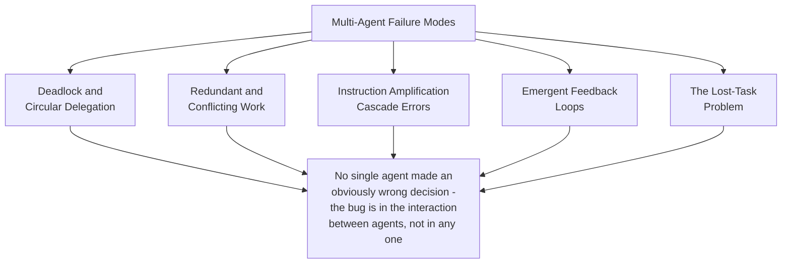

This is why debugging multi-agent systems needs a different lens than debugging a single agent's trajectory: reviewing any one agent's individual reasoning in isolation can look completely defensible, and still miss the failure entirely, because the failure only exists at the level of the system, not the individual. Each section below follows the same structure — what the failure is, how it arises, how to detect it, how to prevent or recover from it — the same shape used for the [RAG failure-mode catalog](../06-rag/03-rag-failure-modes.md), applied to coordination instead of retrieval.

## Deadlock and Circular Delegation

Agent A is waiting on Agent B's result before it can proceed. Agent B, it turns out, is waiting on Agent A's result before *it* can proceed. Neither agent is broken; each is correctly executing "wait for the dependency, then continue." The system simply never terminates.

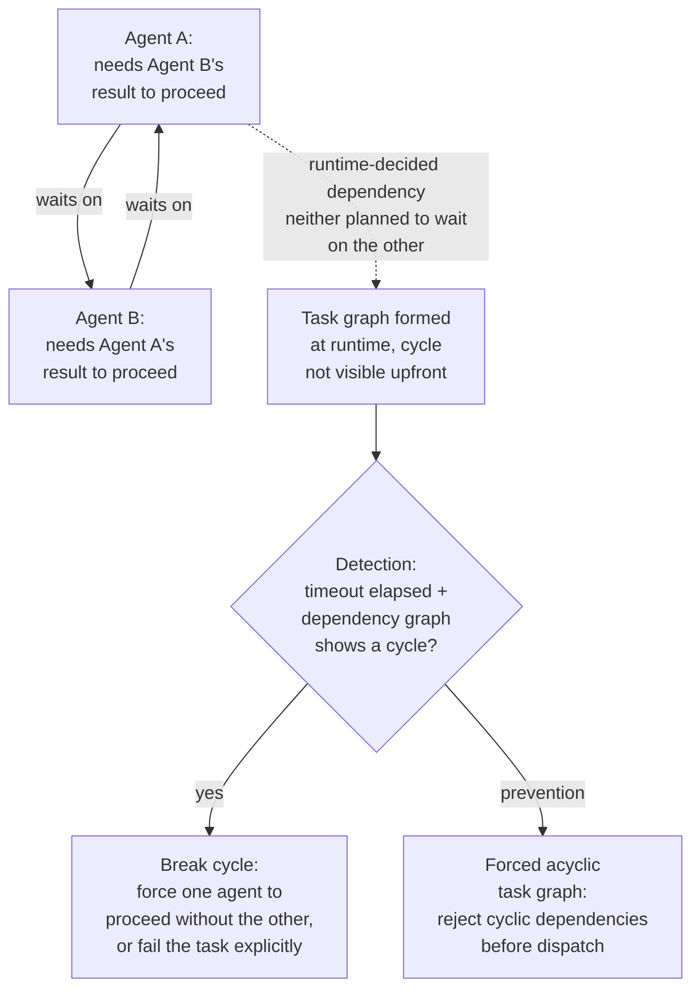

**How it arises.** Static pipelines don't have this problem — a human-authored DAG can't accidentally contain a cycle if nobody wrote one in. LLM-orchestrated systems are vulnerable specifically because task dependencies are frequently decided *at runtime*, by a model, not laid out in advance: a decomposition step might have Agent A's sub-task reference "whatever Agent B finds" and Agent B's sub-task reference "whatever Agent A finds" without either the decomposer or the two agents themselves recognizing that as a cycle until both are actually blocked.

**Detection.** A single stuck task looks identical to a slow one from the outside — the signal that distinguishes deadlock from ordinary latency is a timeout combined with dependency graph analysis: if agent A's wait is on B and B's wait resolves back to A, that's a structural cycle, not a slow response.

**Prevention.** The reliable fix is structural, not reactive: build the task graph so cycles are impossible by construction — a forced acyclic graph where the decomposition step validates that no sub-task's dependencies loop back to itself before any dispatch happens, rather than discovering the cycle only after both agents are already stuck.

**Recovery.** Once detected, the system needs an explicit tie-breaker: force one agent to proceed without the other's result (accepting a lower-confidence answer with the gap flagged) or fail the task outright with a clear "circular dependency detected" reason, rather than leaving both agents hung indefinitely consuming compute while producing nothing.

## Redundant and Conflicting Work

Two agents, each unaware of the other's activity, either duplicate effort (both independently retrieve the same information) or — more dangerously — attempt to modify the same resource in conflicting ways (both write to the same report section, both attempt to update the same record with different values).

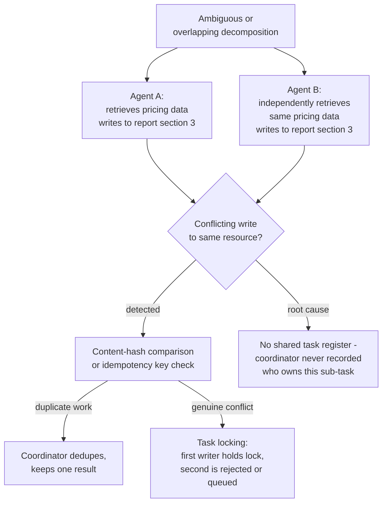

**Root cause.** This almost always traces back to the absence of a shared task register — nothing in the system records "Agent A already owns this piece of work," so a decomposition step (or a retry path) can hand the same or an overlapping sub-task to a second agent with no mechanism to notice the overlap before both agents have already spent tokens on it.

**Detection.** Content-hash comparison catches duplicated *retrieval* work — if two agents' outputs hash to substantially the same underlying content, that's redundant work rather than independent corroboration. Idempotency keys catch duplicated *action* work — if two write attempts carry different keys for what should be the same logical operation, the task register was never consulted before dispatch.

**Prevention.** Task locking — an agent claims a sub-task before starting it, and the coordinator refuses to dispatch the same or an overlapping sub-task to a second agent while the lock holds — combined with sub-task deduplication at the decomposition step itself, checking new sub-tasks against ones already in flight before dispatch, not after both have returned results.

**Recovery.** For redundant work, simply deduplicate at synthesis and discard the duplicate silently (it's wasted cost, not a correctness bug). For a genuine write conflict, the resource needs a real conflict-resolution rule — first-writer-wins with the second write rejected and re-queued, or an explicit merge step — the same discipline described for blackboard write conflicts in [Agent Communication Protocols](02-agent-communication-protocols.md#shared-memory-blackboard-model).

## Instruction Amplification / Cascade Errors

Agent A misunderstands its task and produces a subtly wrong result — not obviously broken, just off. Agent B, with no way to independently verify A's output, builds on it. Agent C builds on B. By the time the error surfaces, it has passed through multiple hops, each one adding its own reasonable-sounding elaboration on top of an already-wrong foundation.

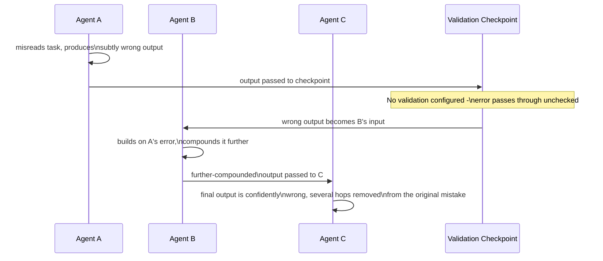

**Why errors compound faster here than in a single agent.** In a single agent loop, an early wrong inference is at least still visible in the same context the model is reasoning over at every subsequent step — see [Context Rot and Failure Modes](../04-context-engineering/05-context-rot-and-failure-modes.md) for how even that visibility degrades over a long session. In a multi-agent pipeline, downstream agents typically only receive B's *result*, not A's full reasoning — they have no way to notice the original mistake even if they'd have caught it with full visibility, because the context that would have exposed it was never passed along. Each hop is also a fresh model call with its own chance to add a further, independent error on top, so the error doesn't just persist — it compounds.

**Mitigations.**

- **Intermediate output validation checkpoints.** Insert an explicit check between hops — schema validation, a consistency check against known facts, or a lightweight LLM-as-judge pass — rather than assuming a plausible-looking result is a correct one, the same principle as the [quality gate](01-multi-agent-architecture-patterns.md#components) between worker and synthesis in orchestrator-worker designs.
- **Confidence thresholds.** Require each agent to emit a confidence signal (per the [structured message schema](02-agent-communication-protocols.md#structured-message-schemas)) and treat low-confidence results as a trigger for validation or human review before they propagate further, rather than passing them along at the same trust level as high-confidence results.
- **Human-in-the-loop at sub-task boundaries.** For pipelines where an error hitting hop 3 is expensive to unwind, a human checkpoint after the highest-risk hop — typically the first one, since it's the foundation everything else builds on — catches the error before it has a chance to compound at all.

## Emergent Behavior from Agent-to-Agent Feedback Loops

When agents can each influence the other's future inputs — most commonly through shared memory or a blackboard — feedback loops form that nobody explicitly designed. Not all of these are bad: some are the intended behavior. The failure mode is not having a way to tell the difference before it becomes expensive.

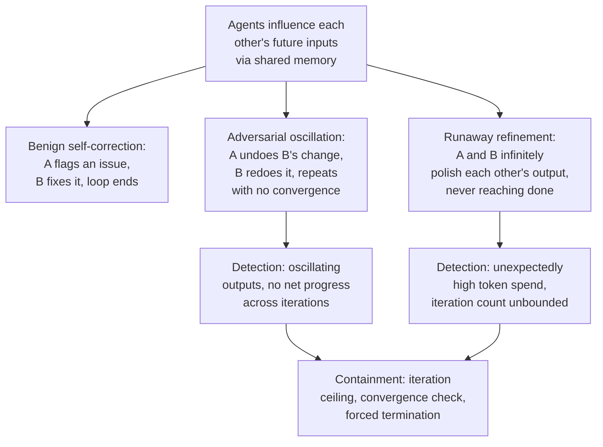

- **Benign self-correction.** Agent A flags an inconsistency in Agent B's output, B revises it, the loop naturally terminates once both agents converge. This is the [debate/critique pattern](01-multi-agent-architecture-patterns.md#multi-agent-topology-patterns) working as intended — the presence of a loop is not itself the failure.
- **Adversarial oscillation.** Agent A and Agent B each have a slightly different notion of "correct," and each one's fix undoes the other's — A reverts B's edit, B reapplies its version, repeating indefinitely with no net progress toward convergence. This is distinguishable from benign self-correction by the absence of *convergence*: the same change is being made and unmade repeatedly rather than the gap between the two agents' outputs shrinking over iterations.
- **Runaway refinement.** Both agents keep finding something to improve in the other's output — individually reasonable ("this could be slightly better") but collectively unbounded, since "slightly better" has no natural stopping point without an explicit one imposed from outside.

**Detection signals.** Oscillating outputs (the same content flipping between two states across iterations) and unexpectedly high token spend or iteration count relative to the task's expected complexity are the two clearest production signals — neither requires understanding *why* the loop formed, only that it has, which makes both cheap to monitor for even without deep task-specific instrumentation.

**Containment.** An explicit iteration ceiling (the same discipline as a step budget in a single agent loop, applied at the inter-agent level), a convergence check (is the delta between successive rounds shrinking, or not), and forced termination with a best-effort result when neither condition resolves the loop on its own.

## The Lost-Task Problem

A sub-task is assigned to an agent, dispatched, and then silently disappears from the system's awareness — the agent crashed mid-task, the response message was dropped in transit, or the orchestrator itself lost track of the fact that it was still waiting on that particular piece of work. The final answer gets assembled from whatever *did* come back, with the missing sub-task silently absent rather than explicitly flagged as missing.

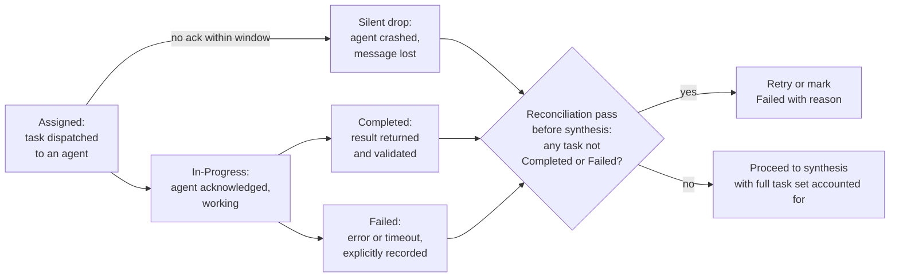

**Why this is worse than an explicit failure.** An agent that returns an explicit error is a handled case — the [failure-handling design](01-multi-agent-architecture-patterns.md#reliability) from Chapter 01 already covers synthesizing from partial results with the gap flagged. The lost-task problem is specifically about the case where nothing comes back at all *and nothing notices* — the orchestrator proceeds to synthesis as if the task set were complete, because from its perspective, it never explicitly learned otherwise.

**The fix is a task state machine, not a smarter retry.** Every dispatched sub-task needs an explicit state — assigned, in-progress, completed, or failed — tracked independently of whether a message ever arrives to update it. Before synthesis runs, a reconciliation pass checks every task against this state machine: anything still sitting in "assigned" or "in-progress" past its expected window is neither completed nor failed, and that gap is exactly what the silent-drop failure mode produces. Reconciliation converts an invisible silent absence into an explicit, actionable state — retry the task, or mark it failed with a reason — before synthesis ever runs, rather than discovering the gap only when a user notices the final answer is incomplete.

## Observability Requirements Unique to Multi-Agent Systems

Diagnosing every failure mode above requires visibility into the *interactions* between agents, not just what each agent individually produced — a fundamentally different observability shape than single-agent monitoring.

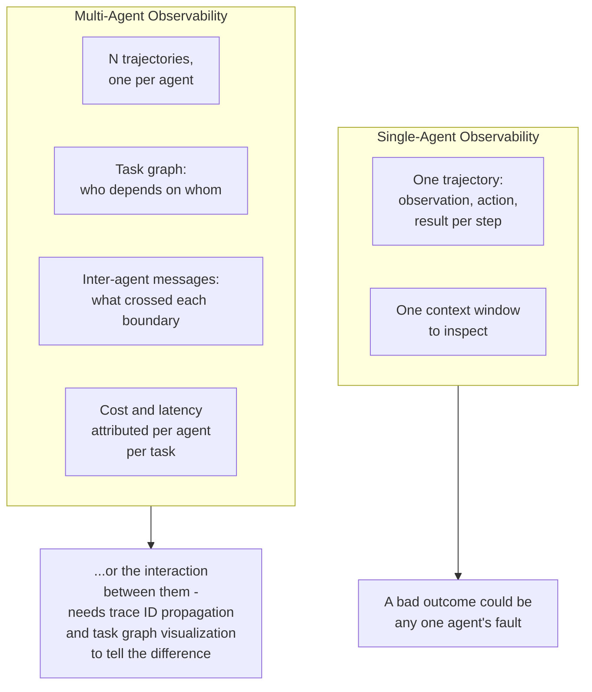

- **Distributed tracing with trace IDs propagating across hops** — the same mechanism described in [Agent Communication Protocols](02-agent-communication-protocols.md#observability-for-inter-agent-communication), essential here specifically because deadlock, cascade errors, and lost tasks are all diagnosed by reconstructing a cross-agent timeline, which is impossible without a consistent ID tying every hop of one logical task together.
- **Task graph visualization** — rendering the actual runtime dependency structure (which agent waited on which, in what order) after the fact is what makes a deadlock or a cascade visually obvious instead of requiring manual log correlation; this is the multi-agent-specific tool with no single-agent equivalent, since a single agent loop has no other agent to have a dependency on.
- **Structured intermediate output logging** — every hop's output logged in structured form (not just the final answer), which is what makes cascade-error root-causing possible: without it, "the final answer is wrong" gives no signal about *which* hop introduced the error first.
- **Cost attribution per agent per task** — contrasted with single-agent cost tracking (one number, one loop), multi-agent cost needs to be sliceable by agent and by task instance, because a runaway feedback loop or redundant work shows up specifically as one agent-pair's cost spiking, not as an aggregate anomaly.

Single-agent observability answers "what did the agent do, step by step." Multi-agent observability has to additionally answer "what did each agent tell every other agent, and when" — a strictly larger question, and one [AI Observability Architecture](../20-observability/01-ai-observability-architecture.md) covers at the general distributed-tracing-and-sampling level that this chapter's failure modes specialize.

## Testing Multi-Agent Systems

Unit testing each agent's prompt and tool behavior in isolation is necessary — it catches the single-agent-style bugs each agent can still have — but it says nothing about coordination failures, which by definition only appear when multiple agents interact.

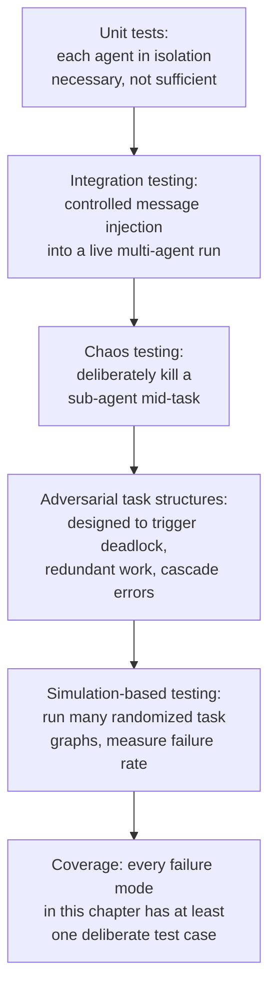

- **Integration testing with controlled message injection.** Inject a deliberately malformed, delayed, or contradictory message into a live multi-agent run and confirm the receiving agent and the coordinator handle it per the [failure-handling design](02-agent-communication-protocols.md#failure-handling-in-communication) rather than assuming happy-path messages in every test.
- **Chaos testing.** Deliberately kill a sub-agent mid-task — the direct way to verify the lost-task reconciliation pass actually catches a silent drop, rather than trusting it works because it was never triggered in normal testing.
- **Adversarial task structures.** Construct decompositions specifically designed to produce a dependency cycle, an overlapping write, or an oscillating feedback loop, and confirm the prevention/detection mechanisms for each failure mode in this chapter actually fire — testing the failure mode directly rather than hoping normal task variety happens to exercise it.
- **Simulation-based testing.** Run a large number of randomized task graphs through the system and measure the empirical rate of each failure mode — this is what turns "we have a deadlock-prevention mechanism" into a measured claim about its actual catch rate, rather than an untested assumption.

## Security Attack Surfaces Unique to Multi-Agent Systems

Beyond the injection and privilege risks single agents already carry (see [Agent Fundamentals & the Agent Loop](../09-agents/01-agent-fundamentals-and-the-agent-loop.md) and the [cross-agent injection and privilege fan-out risks](01-multi-agent-architecture-patterns.md#security) in Chapter 01), coordination itself opens attack surfaces that don't exist in a single-agent system.

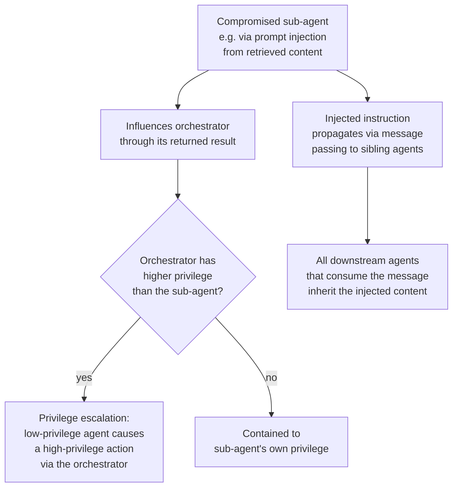

- **A compromised sub-agent influencing the orchestrator.** A sub-agent that ingested attacker-controlled content (a poisoned webpage, a malicious document) can return a result whose content is itself an injected instruction — if the orchestrator treats that content as trusted "one of my own agents said this" rather than as untrusted data, the injection reaches the orchestrator's own decision-making.
- **Prompt injection propagation via message passing.** Because sub-agents commonly pass structured results forward to sibling agents (not just back to the orchestrator), an injected instruction in one agent's context can propagate to every downstream consumer of that message, multiplying the blast radius of a single compromised agent across the whole task rather than containing it to one hop.
- **Privilege escalation through the orchestrator.** A low-privilege sub-agent (scoped to, say, read-only search) that successfully influences the orchestrator's own reasoning — via a convincingly-worded returned result — can cause the orchestrator to take a privileged action (a write, a purchase, an irreversible operation) that the sub-agent itself was never permitted to take directly. This is the multi-agent analogue of confused-deputy attacks, and the mitigation is the same principle as [Chapter 01's privilege fan-out guidance](01-multi-agent-architecture-patterns.md#security): every worker result is untrusted input to the orchestrator's next decision, regardless of which agent produced it, and the orchestrator's own privileged actions need their own guardrail checks independent of what any sub-agent's result claims should happen next.

## Reliability

| Failure | Degradation strategy |
|---|---|
| Deadlock / circular delegation | Timeout + dependency graph cycle detection; force acyclic task graphs at decomposition time |
| Redundant or conflicting work | Task locking and sub-task deduplication in the coordinator; content-hash comparison before accepting a second result on the same resource |
| Cascade error through multiple hops | Validation checkpoints and confidence thresholds at each hop; human-in-the-loop at the highest-risk boundary |
| Adversarial oscillation or runaway refinement | Iteration ceiling, convergence check, forced termination with best-effort result |
| Lost task (silent drop) | Explicit task state machine with mandatory reconciliation pass before synthesis |
| Compromised sub-agent influencing orchestrator | Treat every worker result as untrusted input regardless of source; guardrail checks on the orchestrator's own privileged actions independent of sub-agent claims |

## Monitoring

- **Cycle detection alerts** on the live task dependency graph — any detected cycle is worth alerting on immediately, since by definition it cannot resolve itself.
- **Task state distribution** — the proportion of dispatched tasks sitting in "assigned" or "in-progress" past their expected completion window, tracked continuously rather than only checked at synthesis time.
- **Duplicate/conflicting write rate** — how often the content-hash or task-locking layer catches an overlap, trended over time; a rising rate points at a decomposition regression producing more overlapping sub-tasks, not at the detection mechanism itself.
- **Iteration count and token spend per debate/feedback-loop task**, compared against expected task complexity — an unexpected upward trend is the earliest signal of adversarial oscillation or runaway refinement before it fully manifests as a stuck task.
- **Cascade error rate** — sampled or LLM-judged checks on whether an intermediate hop's output was already wrong before it reached the final hop, which is what actually localizes a cascade to its origin instead of just noticing the final answer was bad.
- **Reconciliation gap rate** — how often the pre-synthesis reconciliation pass finds a task that never reached a terminal state; a non-zero and rising rate means the lost-task problem is a live, ongoing risk, not a hypothetical one.

## Production Best Practices

- **Build the task graph to be acyclic by construction**, validating for cycles at decomposition time rather than discovering them only after two agents are already stuck waiting on each other.
- **Maintain an explicit shared task register** that every dispatch checks against, so overlapping or duplicate sub-tasks are caught before two agents redundantly spend tokens on the same work.
- **Put a validation checkpoint at every hop in a multi-hop pipeline**, not just before final synthesis — a cascade error caught at hop 2 is far cheaper to fix than one discovered in the final answer, several hops and dollars later.
- **Track every dispatched sub-task through an explicit state machine**, and run a mandatory reconciliation pass before synthesis — never assume the task set is complete just because synthesis was triggered.
- **Cap every agent-to-agent feedback loop with an iteration ceiling and a convergence check**, treating unbounded mutual refinement as a design flaw to contain, not a sign the agents are working hard.
- **Propagate trace IDs through every inter-agent message from day one**, since every failure mode in this chapter is diagnosed by reconstructing a cross-agent timeline that doesn't exist without it.

## Real World Examples

- **Long-running coding agent swarms working on a shared codebase** are a directly observable case of the redundant/conflicting work failure mode: two agents editing overlapping files without a shared lock or task register produce merge conflicts that are the software-engineering-specific instance of exactly this failure.
- **Multi-agent debate and self-refinement research systems** (published academic work on LLM debate patterns) document both the benign-self-correction and runaway-refinement ends of the emergent feedback loop spectrum, and are a useful reference for what convergence criteria and iteration caps look like in practice.
- **Distributed workflow orchestration failures in traditional (non-LLM) systems** — deadlocks in distributed transaction systems, lost-update problems in databases without proper locking — are the direct conceptual ancestors of the deadlock and redundant-work failure modes here; the LLM-specific novelty is that the dependency structure is decided by a model at runtime rather than fixed by a human-authored schema, which is what makes these failures harder to prevent by static analysis alone.
- **The [Multi-Agent Research System](../25-case-studies/16-multi-agent-research-system.md) case study** in these notes works through reconciliation, retry, and partial-synthesis design decisions in the context of a concrete, full system design, illustrating several of this chapter's recovery mechanisms end to end.

## Interview Questions

### Beginner

**Q: Why can a multi-agent system fail even when every individual agent behaved reasonably?**
Because the failure can live in the coordination between agents rather than in any one agent's decision — two agents each doing something individually sensible can still deadlock waiting on each other, duplicate work neither knew the other was doing, or feed each other into an endless refinement loop. Reviewing any single agent's trajectory in isolation can look completely fine and still miss the actual bug, because the bug only exists at the level of the interaction.

**Q: What is the "lost-task problem" and why is it dangerous?**
A sub-task is dispatched and then silently disappears — the agent crashed, the message was dropped, or the orchestrator lost track of it — and the final answer is assembled from whatever did come back, with the missing piece silently absent rather than flagged. It's dangerous specifically because nothing errors: the system produces a plausible-looking, incomplete answer with no visible sign that anything is missing, unless an explicit reconciliation step checks for it.

### Intermediate

**Q: How would you detect a deadlock between two LLM-orchestrated agents, given that task dependencies are decided at runtime rather than fixed in advance?**
A single stuck task looks identical to a slow one from the outside, so detection needs two signals together: a timeout indicating something has taken longer than expected, and dependency graph analysis confirming the two agents' waits form an actual cycle rather than one agent simply being slow. Since the dependency structure is only known at runtime, this graph has to be built and checked dynamically as the task executes, not validated once at design time the way a human-authored pipeline could be.

**Q: Two agents both retrieved the same pricing data and each wrote a slightly different version to the same report section. What's the root cause and the fix?**
The root cause is almost always a missing shared task register — nothing recorded that Agent A already owned that piece of work, so the decomposition or dispatch step handed an overlapping sub-task to Agent B with no mechanism to notice before both had already produced output. The fix is task locking (an agent claims a sub-task before starting, and the coordinator won't dispatch an overlapping one while the lock holds) plus content-hash comparison at the point where conflicting writes are detected, to distinguish genuine redundancy (safe to just discard one) from an actual data conflict (needs an explicit resolution rule).

### Senior

**Q: A multi-agent task took ten times longer than expected with no explicit error. Walk through how you'd narrow down which failure mode this is.**
Start with the task graph: if it shows a dependency cycle, it's deadlock, full stop. If not, check whether two agents produced overlapping or conflicting output — that points to redundant/conflicting work from a missing task register. If neither, check whether any task is stuck in "assigned" or "in-progress" with no terminal state — that's the lost-task problem, and the fix is in reconciliation logic, not the agents themselves. If every task did reach a terminal state but the loop still ran long, check iteration count and token spend trend on any feedback-loop component — an oscillating or ever-refining sub-loop is the remaining explanation.

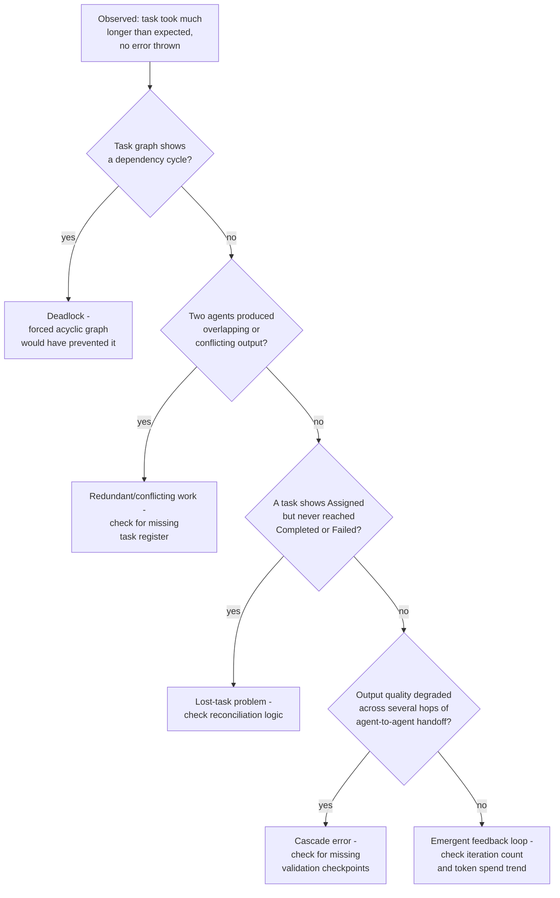

**Q: Design intermediate output validation for a 4-hop sequential pipeline where an early error would otherwise compound through every later hop.**
Put a checkpoint after every hop, weighted toward the earliest ones since they're the foundation everything downstream builds on — a schema/consistency check plus a confidence signal from the producing agent, and a lightweight LLM-as-judge pass specifically checking the new hop's output against the task's original intent, not just internal consistency with the prior hop (which a compounding error would also satisfy). Route low-confidence or failed-check outputs to either a retry of that specific hop or a human review, rather than letting them flow forward automatically — since by hop 4, an error caught this early is far cheaper to fix than one discovered only in the final synthesized answer.

### Staff

**Q: Design a detection and containment system for coordination failures across a fleet of concurrently running multi-agent tasks, without manual review of every task.**
Run each detection mechanism as its own always-on monitor rather than a one-off check: a task graph service continuously watching for cycles, a content-hash/idempotency registry flagging overlapping writes as they happen, a reconciliation job sweeping for tasks stuck without a terminal state on a fixed cadence, and an oscillation detector watching for repeated undo/redo patterns on shared-state keys. Each monitor emits a structured, classified alert — not a generic "something's wrong" signal — routed to whichever response is appropriate for that specific failure mode: breaking a cycle and failing the task explicitly, deduping or locking a conflicting resource, retrying or failing a lost task, or forcing termination and escalating an oscillating loop to human review. The key design choice is classification at detection time: an ops team drowning in undifferentiated "task anomaly" alerts can't act on them, but a "deadlock detected, task X" alert has an immediate, mechanical response.

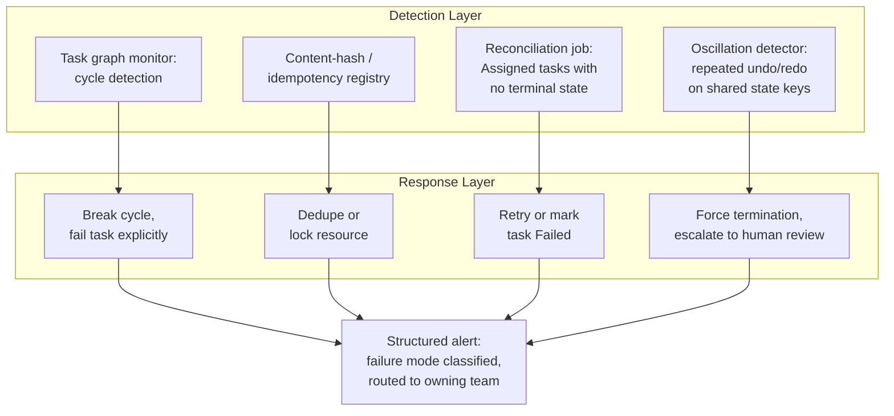

## Google-Level Follow-Ups

> "Your forced-acyclic-graph validation at decomposition time doesn't catch a cycle that only forms because two agents' *runtime* sub-decisions create a new dependency neither original sub-task declared. How do you handle this?" — *probes whether the candidate recognizes that static validation at decomposition time is necessary but not sufficient when agents can introduce new dependencies mid-execution, and proposes runtime cycle re-checking rather than assuming one-time validation is enough.*

> "You've deployed cascade-error validation checkpoints at every hop, but the checkpoint itself is an LLM call that can also be wrong. How do you avoid just adding a fifth point of failure?" — *probes whether the candidate treats the checkpoint's own error rate as a measurable, bounded quantity (via calibration against a labeled set) rather than assuming a validation step is infallible just because it exists, and considers cheaper non-LLM checks (schema, consistency rules) as a first line before an LLM-judge pass.*

> "How do you distinguish a legitimate, converging debate pattern from an adversarial oscillation, when both involve two agents repeatedly revising the same content?" — *probes for the specific distinguishing signal: convergence (the delta between successive rounds shrinking) versus non-convergence (the same states repeating), and whether the candidate would instrument for that signal directly rather than relying on a fixed iteration count alone, which can't tell the two apart.*

> "At what fleet scale does per-task reconciliation and cycle detection itself become a coordination-overhead bottleneck?" — *probes whether the candidate recognizes that the detection infrastructure is not free — a reconciliation job or graph monitor scanning every task adds its own load, and at high enough task volume needs its own scaling design (sampling, sharding by task, event-driven triggers instead of constant polling) rather than being assumed to scale for free just because it's a monitoring layer.*

## Common Mistakes

- **Assuming a stuck task is just slow rather than checking for a structural cycle.** Without dependency graph analysis alongside a timeout, deadlock and ordinary latency are indistinguishable, and teams often extend the timeout rather than diagnosing the actual cause.
- **No shared task register, so overlapping sub-tasks go undetected until two conflicting results collide at synthesis.** By then, both agents have already spent the tokens; the register needs to prevent the overlap before dispatch, not just catch it afterward.
- **Treating every hop's output in a pipeline as trustworthy by default.** Without a validation checkpoint at each hop, a subtly wrong result at hop 1 compounds silently through every later hop, and the bug is only visible in the final, several-hops-removed output.
- **Fixed iteration counts as the only defense against runaway feedback loops.** A fixed cap prevents infinite cost but doesn't distinguish a legitimately converging debate from an oscillating one — a convergence check catches the difference a raw iteration ceiling can't.
- **Assuming synthesis running means the task set is complete.** Without an explicit reconciliation pass against a task state machine, a silently lost task produces a plausible-looking but incomplete final answer with no visible sign anything is missing.
- **Trusting a sub-agent's returned result as safe because it came from "your own" system.** A compromised or injected sub-agent's result is untrusted input to the orchestrator regardless of its origin — the same discipline single-agent tool results require, applied across agent boundaries.

## Key Takeaways

- Multi-agent failures are defined by where the bug lives: not in any individual agent's decision, but in the coordination between agents — which is why single-agent-style trajectory review often misses them entirely.
- Deadlock and circular delegation arise specifically because LLM-orchestrated systems decide dependencies at runtime; prevention requires forcing the task graph to be acyclic by construction, not just catching cycles after agents are already stuck.
- Redundant and conflicting work traces back to a missing shared task register; task locking and sub-task deduplication at the coordinator are the structural fix, not after-the-fact reconciliation alone.
- Cascade errors compound faster in multi-agent pipelines than in a single agent because downstream agents typically see only a result, not the reasoning that produced it — validation checkpoints and confidence thresholds at each hop are the containment mechanism.
- Emergent feedback loops need a convergence check, not just an iteration cap, to distinguish legitimate self-correction from adversarial oscillation or runaway refinement.
- The lost-task problem — a sub-task silently dropped with no error — requires an explicit task state machine and a mandatory reconciliation pass before synthesis; without it, an incomplete answer looks identical to a complete one.

---

*Part of [Multi-Agent Systems](index.md) in the [AI System Design Notes](../index.md). Tracked in [BACKLOG.md](https://github.com/GyanendraChaubey/AI-System-Design-Notes/blob/main/BACKLOG.md).*
