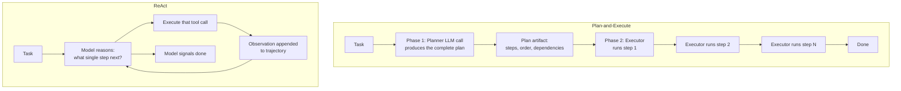
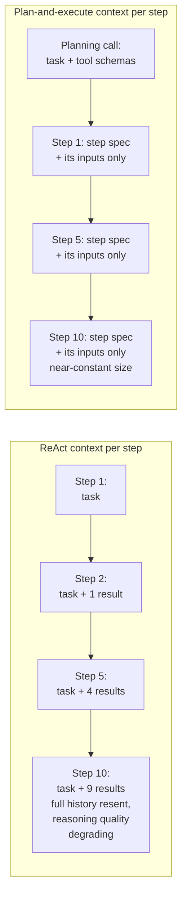
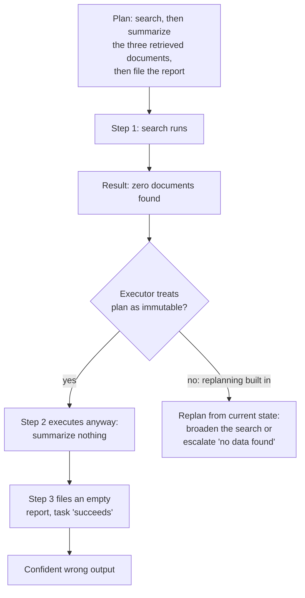
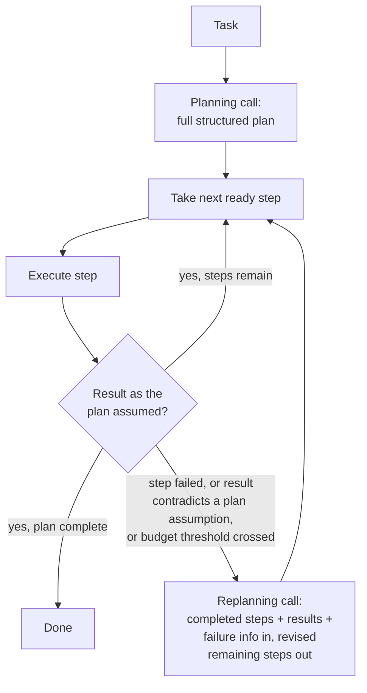
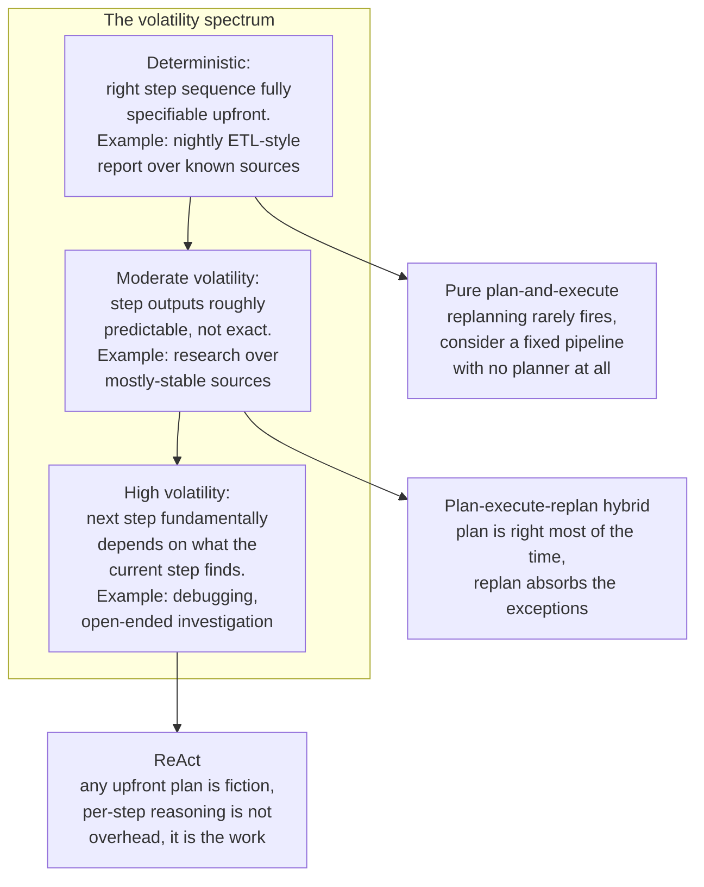
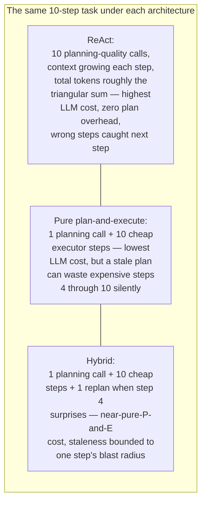
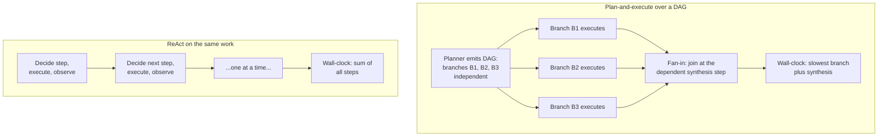
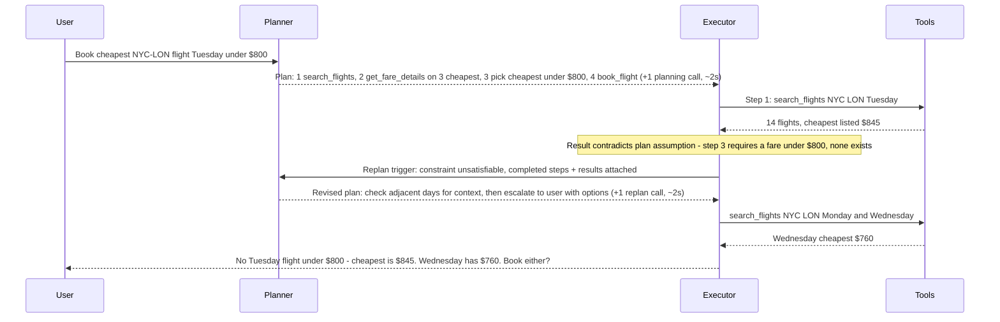
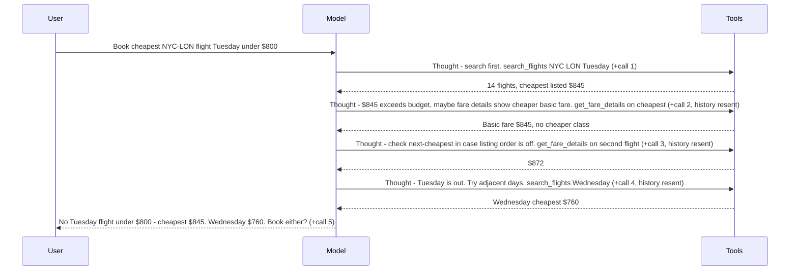
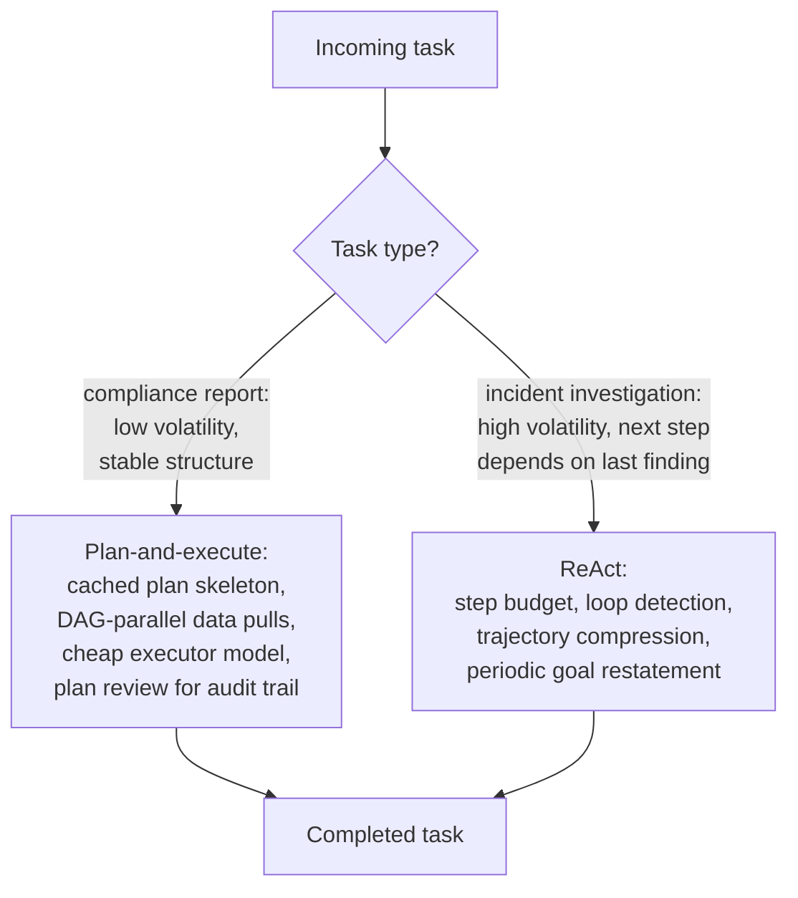

# Plan-and-Execute vs ReAct

## Overview

Every planning system faces one architectural fork before any other: commit to a full plan upfront and execute it, or decide one step at a time. This is not an implementation detail buried in a config flag — it determines how the system adapts to surprises, how its cost scales with task length, whether it can parallelize, whether a human can review its intentions before anything irreversible happens, and what its failure traces look like at 2 a.m. [Task Decomposition & Planning](01-task-decomposition-and-planning.md) covered how to decompose well; this chapter is about whether to decompose upfront at all, and the answer is a function of two measurable properties of the task — volatility and step cost — not of taste.

## The Fork, Stated Precisely

**Plan-and-execute** separates planning from execution into two distinct phases. Phase 1: a planner model produces a complete, structured plan — a list or DAG of steps — before any tool is called. Phase 2: an executor (which may use the same model, a cheaper one, or no model at all for mechanical steps) carries the plan out step-by-step, treating it as the authority on what happens next. The decision-making is front-loaded; the executor's job at each step is *how to perform this step*, not *what the task needs next*.

**ReAct** has no such separation. The model interleaves reasoning and acting — thought, action, observation, repeat — deciding each next action from the accumulated trajectory so far, with no pre-committed plan (the pattern in full: [ReAct & Reasoning Patterns](../09-agents/02-react-and-reasoning-patterns.md)). The decision-making is distributed across every step, and the "plan" only ever exists one step deep.

The structural difference to hold onto: in plan-and-execute, all the *what-next* decisions are made in one place, at one time, visible in one artifact. In ReAct, they are made at every step, each conditioned on everything observed so far. Everything else in this chapter — cost, adaptability, parallelism, debuggability — falls out of that one difference.

## Why Plan-and-Execute Exists

ReAct's per-step reasoning is adaptive, and it is expensive in a specific, compounding way. Each step is a full planning-quality LLM call, and because model calls are stateless, each call resends the entire accumulated trajectory — task, every prior thought, every prior tool result. Context grows roughly linearly with step count, so total input tokens across the task grow roughly quadratically (the triangular sum from [Agent Fundamentals & the Agent Loop](../09-agents/01-agent-fundamentals-and-the-agent-loop.md)). For long tasks this bites three times over: cost (a 20-step ReAct task pays for its history 20 times), latency (every step waits on a full reasoning call), and quality — reasoning degrades as the context fills with stale tool results, the "context rot" failure catalogued in [Context Rot and Failure Modes](../04-context-engineering/05-context-rot-and-failure-modes.md).

Plan-and-execute front-loads the reasoning into one call. The executor that follows doesn't re-derive the task at every step — it needs the current step's spec and its inputs, not the whole trajectory. That shrinks per-step context to near-constant size, allows a cheaper model (or plain code) to execute mechanical steps, and makes the task's cost roughly *plan + N × small* instead of *N × growing*.

## Why Plan-and-Execute Fails

A plan is a model of what the agent expects to happen — every step written before execution embeds predictions about what earlier steps will find. The real world declines to cooperate on a regular schedule: a planned step fails outright; a tool returns data that contradicts the assumption baked into step 4's formulation; a sub-task turns out to be impossible with the available tools; the plan's premise ("summarize the three retrieved documents") is invalidated by reality (the search found none).

A rigid executor — one that treats the plan as immutable — pushes forward anyway, executing steps whose preconditions no longer hold, and produces either a crash or, worse, a confident wrong answer assembled from hollow intermediate results. The brittleness is precisely the flip side of the strength: separated, explicit planning is only as good as the predictions it froze at planning time.

This is why pure plan-and-execute barely exists in production: a plan-and-execute system without replanning is a bet that nothing surprising will happen across N steps, and that bet loses often enough that recovery has to be designed in, not bolted on — the full treatment is [Replanning & Error Recovery](03-replanning-and-error-recovery.md).

## Why ReAct Fails

ReAct's failures are the mirror image: not staleness but the absence of any persistent, explicit plan to stay anchored to. Over long trajectories three degradations recur, all documented in [Agent Failure Modes & Guardrails](../09-agents/05-agent-failure-modes-and-guardrails.md):

- **Goal drift.** The original instruction sits at the top of a context that grows every step; by step 15 it is a small fraction of what the model is attending to, and the accumulated middle — tool results, partial conclusions, dead ends — increasingly defines what the model thinks the task is. The trajectory bends toward whatever the recent observations emphasized. This is the agent-loop expression of [context rot](../04-context-engineering/05-context-rot-and-failure-modes.md).
- **Loops.** With no plan to mark progress against, the model can call the same tool with the same arguments repeatedly — each time locally reasonable ("I should check the error log"), globally a treadmill. Nothing in the architecture says *you already did this*; only the (rotting) context does.
- **Locally reasonable, globally inconsistent decisions.** Step 5 contradicts an implicit assumption made at step 2 — a currency, a date range, an interpretation of an ambiguous term — and the model doesn't notice, because at step 5 it is reasoning about the present step, not auditing its own history for consistency. In plan-and-execute those assumptions were resolved once, at planning time, and every step inherited the same resolution; in ReAct each step re-derives them, and re-derivation is not guaranteed to be stable.

The pattern behind all three: ReAct's plan exists only implicitly, distributed across the trajectory. Anything that degrades the trajectory's usefulness as context — length, noise, stale results — degrades the plan itself.

## The Hybrid: Plan, Execute, Replan

The practical synthesis, and the shape of most production planning systems: generate an upfront plan (getting explicit, structured, reviewable thinking), execute it step-by-step, but treat the plan as a **mutable hypothesis** rather than an immutable authority. When reality diverges, a replanning pass revises the remaining steps.

The design decisions that make the hybrid work:

- **Replan triggers.** Three standard ones: a step fails (after its retry budget — not every transient error deserves a replan); a step succeeds but its result contradicts an assumption a future step depends on (search found nothing, the API returned a different schema, the price came back above the constraint); or elapsed cost/time for the current plan crosses a threshold, suggesting the plan's estimates were wrong even if no step has failed yet. Trigger classification is its own topic — [Replanning & Error Recovery](03-replanning-and-error-recovery.md) covers detection and the failure taxonomy in depth.
- **Partial replanning.** Revise only the remaining steps; completed steps' results are preserved and passed to the replanner as established facts. Regenerating the whole plan from scratch discards paid-for work and risks re-executing side-effectful steps.
- **The cost model.** Each replan event costs one additional planning-quality LLM call. That is the hybrid's entire premium over pure plan-and-execute, and it's paid only when reality diverges — a task where nothing surprising happens costs exactly one planning call, same as pure plan-and-execute. Compare against ReAct, which pays reasoning cost at *every* step as insurance against surprises that mostly don't happen.

The hybrid's dial is the replan sensitivity: trigger eagerly and it degenerates toward ReAct (re-deciding constantly, paying planning cost per step); trigger never and it degenerates to brittle pure plan-and-execute. Where to set the dial is exactly the volatility question.

## Selection Criterion 1: Task Volatility

The most important question when choosing an architecture: **how predictable is the task's execution environment?** Volatility here means the degree to which the right next step depends on information that doesn't exist until execution produces it.

At the deterministic end, upfront plans don't go stale because nothing surprising happens; if the task is deterministic *every* time, question whether you need a planner at all rather than a fixed pipeline. In the middle, plans are right most of the time and replanning absorbs the exceptions — the hybrid's home turf, and where most real production tasks live. At the volatile end, an upfront plan is a list of guesses that will be invalidated by step 2's result; you'd replan after every step, which *is* ReAct with extra machinery. Debugging is the canonical example: you cannot plan steps 3–7 of a debugging session because steps 3–7 are defined by what step 2's hypothesis test reveals.

The corollary that gets missed: volatility is a property of the *task type*, not the system. A platform running both report generation and incident debugging should route them to different architectures, not pick one global winner.

## Selection Criterion 2: Step Cost

The secondary criterion: **how expensive is each step?** Not in tokens — in whatever the step consumes: a slow third-party API, a GPU inference job, a human review checkpoint, an irreversible side effect.

When steps are expensive, executing a wrong step dominates every other cost. A plan that gets reviewed, validated, and revised before touching the expensive resources is worth its planning overhead many times over — and the cost of a replanning call mid-task is trivial relative to one wasted GPU-hour or one wrongly-sent email. Favor plan-and-execute with replanning, plus a pre-execution review gate.

When steps are cheap and fast, the calculus flips: the cost of an occasional wasted step is negligible, and ReAct's per-step reasoning — which buys maximum adaptability — is affordable insurance. Ten cheap web requests re-decided at every step cost less than the engineering effort of building plan validation for them.

Put the two criteria together and the decision collapses to a quadrant: volatile + cheap steps → ReAct; stable + expensive steps → plan-and-execute with review gates; stable + cheap → whichever is simpler to operate (often pure plan-and-execute, or no agent at all); volatile + expensive → the hard quadrant, where you want the hybrid with tight replan triggers, aggressive validation between steps, and human checkpoints — because you can afford neither a stale plan nor a drifting trajectory.

## Parallelism: What Only a Plan Can Buy

A plan represented as a DAG exposes which steps are independent — and independent steps can run concurrently. ReAct structurally cannot do this for its own actions: each next step is decided only after the previous one's observation lands, so a pure ReAct agent's actions are sequential by construction, no matter how independent the underlying work is.

The executor's scheduling algorithm is topological: maintain the set of steps whose dependencies are all satisfied (the ready set), dispatch everything in it up to a concurrency limit, recompute as steps complete — the same ready-queue mechanism detailed in [Task Decomposition & Planning](01-task-decomposition-and-planning.md). And the branches don't have to run on one machine or one agent: independent DAG branches are exactly the unit an orchestrator hands to parallel workers in the orchestrator-worker pattern from [Multi-Agent Architecture Patterns](../10-multi-agent-systems/01-multi-agent-architecture-patterns.md). The explicit plan is the decomposition artifact that multi-agent fan-out consumes; a system that wants fan-out has already chosen the plan-and-execute side of the fork, whether it noticed or not.

For a task with three independent 15-second branches, this is the difference between ~45 seconds sequential and ~15 seconds parallel — the single largest latency lever available, and it is available *only* to architectures that commit to a plan.

## Debuggability and the Pre-Execution Review

An explicit plan is inspectable **before** execution. That one property carries several operational consequences:

- **Human-in-the-loop review becomes cheap and meaningful.** "Here are the five steps I'm about to take, including step 4 which sends an email" shown *before* any irreversible call is a fundamentally stronger safety gate than approving actions one at a time as they stream by — the reviewer sees intent and structure, not a fait accompli in progress. This is the natural integration point with [Human-in-the-Loop Architecture](../09-agents/06-human-in-the-loop-architecture.md), and it's why approval-gated products (deep-research plan previews, coding-agent task lists) are all plan-first architectures.
- **ReAct's plan exists only in retrospect.** There is nothing to show upfront because nothing has been decided yet; the "plan" is the trajectory of actions already taken. The only reviewable unit is the individual next action, which forces per-action approval fatigue or no review at all.
- **Post-hoc debugging is structurally easier with a plan.** A plan-and-execute trace factors the failure question in two: *was the plan wrong* (look at one planning call and its inputs) *or did execution diverge from a good plan* (diff the trace against the plan, step by step)? A ReAct trace offers no such factoring — the decision and the execution are interleaved at every step, so diagnosing step 12 means re-reading the reasoning at steps 1 through 11 to reconstruct what the model believed at the time.
- **Regression testing gets a stable artifact.** Plans for templated tasks can be snapshot-tested: same task in, structurally-equivalent plan out. There is no equivalent for a ReAct trajectory, which legitimately varies with every tool result.

## Worked Example: The Same Task Through Both Architectures

Task: **"Book the cheapest available flight from NYC to London next Tuesday, under $800."** Tools: `search_flights`, `get_fare_details`, `book_flight`. The interesting wrinkle: it will turn out no flight is under $800 — a mid-task surprise both architectures must absorb.

**Plan-and-execute (hybrid):**

Three LLM calls total (plan, replan, and the escalation message), each with small bounded context. The constraint violation was caught by the executor checking the plan's assumption — deterministic code comparing $845 against $800 — not by a model call. Critically, `book_flight` (the irreversible step) was never reached on a stale premise, and the plan was reviewable before execution: a product could have shown the user all four steps, including the booking, for approval upfront.

**ReAct:**

Five full-context reasoning calls, history growing on each. ReAct absorbed the surprise *more naturally* — no replan machinery, the $845 observation simply informed the next thought — and its extra fare-details probing was adaptive behavior a fixed plan wouldn't have included. The risks it carried instead: nothing structural stopped it from calling `book_flight` on the $845 flight if its step-4 reasoning had drifted from the $800 constraint (a guardrail must be bolted on separately), there was no reviewable intent before execution, and cost/latency ran ~5 growing-context reasoning calls against the hybrid's ~3 bounded ones. On this task — moderate volatility, one expensive irreversible step — the hybrid wins. Make the task "figure out why my flight keeps getting rescheduled" (pure investigation, no irreversible step) and ReAct wins: any upfront plan would be fiction after the first surprising answer.

## Cost Optimization

- **Split model quality between phases.** The planner needs the strong model; executor steps are mostly mechanical and run fine on a cheap model or plain code. This split is plan-and-execute's biggest cost win after parallelism, and it has no ReAct equivalent — ReAct's every step is a planning-quality decision by construction.
- **Give the executor step-scoped context, not trajectory-scoped.** The executor of step 5 needs step 5's spec and inputs, not the full history; passing the whole trajectory to every executor call quietly rebuilds ReAct's cost curve inside a plan-and-execute skin.
- **Budget replans separately from steps.** A replan cap (2–3 per task) bounds the hybrid's worst case; a task that keeps triggering replans is either genuinely volatile (wrong architecture — route it to ReAct) or has a bad planner (fix the prompt), and the cap is what surfaces it instead of letting it burn budget quietly.
- **In ReAct, compress the trajectory.** Where ReAct is the right choice, its cost lever is context discipline — summarize stale observations, drop dead-end branches — per [Context Compression and Summarization](../04-context-engineering/03-context-compression-and-summarization.md).
- **Route by task type.** The largest saving is not optimizing either architecture but sending each task class to the right one; a volatility-and-step-cost routing decision made once per task type beats per-task cleverness.

## Monitoring

- **Replan rate per task type** — the single most informative hybrid metric. Near-zero: the environment is stable; consider whether the planner could be cheaper or cached. Rising: tool reliability or plan quality is degrading. Consistently high: this task type is high-volatility and mis-architected — it wants ReAct.
- **Plan adherence** — fraction of executed steps that came from the original plan vs. from replans; a drift downward means plans are increasingly fiction.
- **Steps-per-task distribution for ReAct routes** (p50/p95), plus loop-detection trigger rate — the drift-and-loop early warnings from [Agent Failure Modes & Guardrails](../09-agents/05-agent-failure-modes-and-guardrails.md).
- **Cost per completed task, split into planning, execution, and replanning spend** — the split is what tells you whether a cost regression is more steps, pricier steps, or more replans.
- **Parallel speedup realized** — for DAG execution, actual wall-clock vs. the sequential sum; a shrinking gap means plans have stopped finding real independence (decomposition regression) or one branch has become a chronic straggler.

## Real World Examples

- **Deep-research products (OpenAI, Google, Anthropic)** are visibly plan-first: they present a research plan or clarifying breakdown before the long retrieval phase, several allow editing it, and execution then fans out over sources — the plan-preview UX is exactly the pre-execution review benefit, and the fan-out is exactly the DAG-parallelism benefit.
- **Coding agents (Claude Code, Cursor, Copilot agent modes)** run the hybrid at two levels: an explicit task list upfront (visible, checked off as work proceeds, revised when a step surprises), with ReAct-style tool loops *inside* each task item — upfront structure where the task is predictable, per-step reasoning where it isn't. This mirrors the hybrid composition noted in [ReAct & Reasoning Patterns](../09-agents/02-react-and-reasoning-patterns.md): plan-then-execute outer shape, interleaved reasoning inside phases.
- **Anthropic's published multi-agent research system** is plan-and-execute at the architecture level by necessity: the lead agent's decomposition *is* the plan, and parallel sub-agent dispatch is only possible because that plan exists before execution — a pure-ReAct lead could never fan out.
- **LangGraph's plan-and-execute template and the original ReAct-agent pattern** are the two shapes packaged as off-the-shelf graphs in most agent frameworks — evidence that the fork is fundamental enough that tooling ships both as first-class primitives and asks the developer to choose.

## Interview Questions

### Beginner

**Q: What is the difference between plan-and-execute and ReAct?**
Plan-and-execute separates the work into two phases: a planner produces a complete structured plan before any tool is called, then an executor carries it out step-by-step, treating the plan as the authority. ReAct has no separation — the model interleaves reasoning and acting, deciding each next action from the accumulated observations, with no pre-committed plan. The practical consequence: plan-and-execute makes all its what-next decisions once, upfront, in an inspectable artifact; ReAct makes them at every step, conditioned on the freshest information but with nothing to review, validate, or parallelize upfront.

**Q: Why is ReAct more expensive than plan-and-execute for long tasks?**
Every ReAct step is a full planning-quality LLM call, and each call resends the entire accumulated trajectory because model calls are stateless — so context grows with every step and total input tokens grow roughly quadratically with step count. Plan-and-execute pays one planning call upfront, and each executor step needs only the current step's spec and inputs — near-constant context — often on a cheaper model, since executing a specified step is easier than deciding what the task needs next.

### Intermediate

**Q: What does "the plan is a mutable hypothesis" mean, and what triggers a revision?**
It's the hybrid's core stance: the upfront plan is the best available prediction, not a contract — execution follows it while reality matches and revises it when reality diverges. Three standard triggers: a step fails after exhausting its retry budget; a step succeeds but its result contradicts an assumption a future step depends on (the search returned nothing, the price exceeds the constraint); or elapsed cost/time crosses a threshold, meaning the plan's estimates were wrong even without a hard failure. A replan is one additional planning call that revises only the remaining steps, preserving completed results. The dial matters: replan on everything and you've rebuilt ReAct at higher complexity; replan on nothing and you've got brittle pure plan-and-execute.

**Q: Why can a plan-and-execute system parallelize where ReAct cannot?**
Parallelism requires knowing that two pieces of work are independent *before* running them — and that knowledge lives in the plan's dependency structure. A DAG plan states upfront that branches B1 and B2 share no edges, so the executor dispatches them concurrently and wall-clock time drops to the slowest branch. ReAct decides each action only after observing the previous one — its actions are sequential by construction, even when the underlying work is embarrassingly parallel. This is also the multi-agent connection: independent DAG branches are the unit an orchestrator hands to parallel workers, so fan-out architectures have implicitly chosen the plan side of the fork.

### Senior

**Q: You're designing an agent platform serving two workloads: templated compliance-report generation, and production-incident investigation. Which architecture for each, and why?**
Route them differently — the volatility criterion gives opposite answers. Compliance reports are low-volatility: sources are known, steps are stable across runs, outputs are structurally identical. That's plan-and-execute — arguably a cached plan skeleton with no per-task planning call at all — with a DAG to parallelize independent data pulls, a cheap executor model, and pre-execution plan review for the audit trail (which compliance contexts value in itself). Incident investigation is maximally volatile: the right third step is defined by what the second step's hypothesis test revealed, so any upfront plan is fiction and replanning would fire after every step — that's ReAct, with the discipline volatile trajectories require: step budgets, loop detection, trajectory compression, and goal-restatement to resist drift. The meta-answer matters as much as the routes: volatility is a property of the task type, so the platform routes per task type rather than standardizing on one architecture.

**Q: A hybrid system's replan rate for one task type has climbed from 5% to 40% over a month, with no deploys on your side. Diagnose.**
A replan fires for step failure, assumption contradiction, or budget breach — so first split the 40% by trigger type. Rising *step failures* point at tool-side regression: a flaky or changed upstream API failing steps the plan reasonably included; check per-tool error rates, fix or wrap the tool, no planner change needed. Rising *assumption contradictions* point at environment drift: the world the planner's prompt (and any few-shot examples or cached skeletons) describes no longer matches reality — a data source changed schema, a website restructured — so plans are born stale; the fix is updating the planner's context, and it's invisible to tool-error dashboards. Rising *budget breaches* with stable failures suggests steps got slower or costlier — a latency regression upstream. If all three rose together, the task mix itself likely shifted toward genuinely more volatile inputs, and the honest answer may be that this task type has migrated across the volatility spectrum and some share of it now belongs on ReAct. The one wrong move is treating 40% as a number to suppress by loosening triggers — the rate is a measurement, not the problem.

### Staff

**Q: Argue for and against standardizing your org on the hybrid (plan-execute-replan) for all agent workloads, then give your actual recommendation.**
For: the hybrid dominates each pure architecture at its own game in the limit — with replan triggers tuned tight it approximates ReAct's adaptability, tuned loose it collapses to pure plan-and-execute's cost profile, so one codebase with one tunable covers the spectrum; standardization buys shared tooling (plan validation, replan budgets, trace formats), one operational mental model, and plan-level features (review gates, parallelism, snapshot tests) available everywhere. Against: the hybrid carries irreducible machinery — plan schema, state reconciliation, replan orchestration — that is pure overhead for the two ends of the spectrum. A genuinely deterministic workload wants a fixed pipeline, not a planner (the constraint-first instinct from [Agent Fundamentals](../09-agents/01-agent-fundamentals-and-the-agent-loop.md)); a genuinely volatile workload tuned to replan-per-step is ReAct with extra moving parts, strictly worse than the real thing. And "one tunable" understates the operational reality: replan sensitivity, budgets, and state-passing conventions all need per-task-type tuning anyway, so the promised uniformity is thinner than it looks. Recommendation: standardize on the hybrid as the *default* for the moderate-volatility middle where most workloads live, but keep two sanctioned exits — fixed pipeline / pure plan-and-execute for provably stable task types, bounded ReAct for provably volatile ones — gated on measured evidence (sustained near-zero or sustained-high replan rate respectively), so the exits are earned by data rather than taken by taste.

## Google-Level Follow-Ups

- "Your hybrid replans when a result contradicts a plan assumption. How does the executor *know* what the plan's assumptions are?" — *probes whether the candidate realizes assumptions must be reified to be checkable: a plan that just lists steps has implicit assumptions no code can verify. A strong answer has the planner emit explicit, machine-checkable preconditions per step (expected result shape, constraint bounds like "fare under $800") so contradiction detection is deterministic code, with an LLM-based check only as a fallback for unstructured results.*
- "You showed the user a 5-step plan for approval, then a replan changed steps 3–5. Is the earlier approval still valid?" — *probes the interaction between mutable plans and human-in-the-loop guarantees: a strong answer scopes approval to the approved artifact and re-gates on material revision — with a materiality rule (revised steps touching irreversible or side-effectful actions re-require approval; benign reorderings don't) rather than either re-prompting the human for every replan or silently letting approval leak onto steps they never saw.*
- "ReAct absorbed your worked example's surprise 'more naturally' than the hybrid's replan machinery. Why not always prefer that?" — *probes whether the candidate can defend structure against flexibility: ReAct's absorption is implicit and unverifiable — nothing guarantees the $800 constraint survives into step 4's reasoning — while the hybrid's contradiction check is explicit code that cannot drift. A strong answer connects this to stakes: implicit absorption is fine when wrong steps are cheap, unacceptable when a constraint violation books a flight.*
- "How would you *measure* which architecture is better for a given task type, rather than reasoning about it?" — *probes experimentation instinct over architecture-by-argument: shadow-run both architectures on the same task sample, compare success rate, cost, latency, and constraint-violation rate per task type, and route on the measured winner — plus the follow-through that the routing decision goes stale as tools and task mix drift, so the comparison reruns periodically rather than being a one-time bake-off.*

## Common Mistakes

- **Choosing the architecture by ideology rather than volatility.** "Agents should be adaptive" (always ReAct) and "plans are professional" (always plan-and-execute) both lose to measuring how predictable the task's environment actually is.
- **Shipping pure plan-and-execute with no replanning.** A rigid executor pushing a stale plan forward produces confident wrong answers assembled from hollow intermediate results — the recovery path is part of the architecture, not an enhancement.
- **Rebuilding ReAct's cost curve inside plan-and-execute.** Passing the full trajectory to every executor call, or replanning on every minor deviation, quietly recreates per-step growing-context reasoning while keeping the hybrid's machinery overhead — worst of both.
- **Ignoring the parallelism dividend.** Running a DAG plan's independent branches sequentially forfeits the single biggest latency win the plan-side architecture offers; if nothing consumes the dependency structure, the DAG was decoration.
- **Letting ReAct run unanchored on long tasks.** No step budget, no loop detection, no goal restatement, no trajectory compression — the drift-and-loop failure modes are predictable properties of the architecture, and the guardrails are known; omitting them is negligence, not optimism.
- **Treating replan rate as a nuisance metric to suppress.** Loosening triggers to make the number go down hides exactly the signal — tool regression, environment drift, or a task type outgrowing its architecture — the metric exists to surface.

## Key Takeaways

- The fork is about where what-next decisions are made: plan-and-execute makes them once, upfront, in an inspectable artifact; ReAct makes them at every step with the freshest information and no artifact. Every other tradeoff — cost, adaptability, parallelism, reviewability — follows from that.
- Plan-and-execute exists because ReAct's per-step reasoning compounds: growing context resent every step means roughly quadratic token cost and degrading reasoning on long tasks; front-loading the reasoning makes per-step cost near-constant and lets cheap models execute.
- Each pure architecture fails at its strength's mirror image: plans go stale when reality diverges from the predictions they froze; plan-less trajectories drift, loop, and contradict themselves as context accumulates.
- The production answer is usually the hybrid — plan, execute, replan on failure, contradiction, or budget breach — whose entire premium over pure plan-and-execute is one planning call per replan event, paid only when reality actually diverges.
- Select by task volatility first (deterministic → plan/pipeline; moderate → hybrid; volatile → ReAct) and step cost second (expensive or irreversible steps favor explicit plans with review gates; cheap steps make ReAct's adaptability affordable) — and route per task type, since volatility belongs to the task, not the platform.
- Two capabilities are exclusive to the plan side of the fork: parallel execution of independent DAG branches (including multi-agent fan-out), and pre-execution human review of intent — if a product needs either, the architecture decision is already made.

---

*Part of [Planning Systems](index.md) in the [AI System Design Notes](../index.md). Tracked in [BACKLOG.md](https://github.com/GyanendraChaubey/AI-System-Design-Notes/blob/main/BACKLOG.md).*
