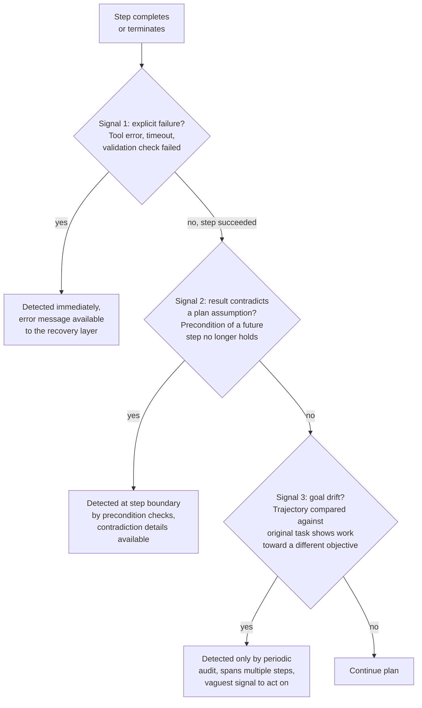
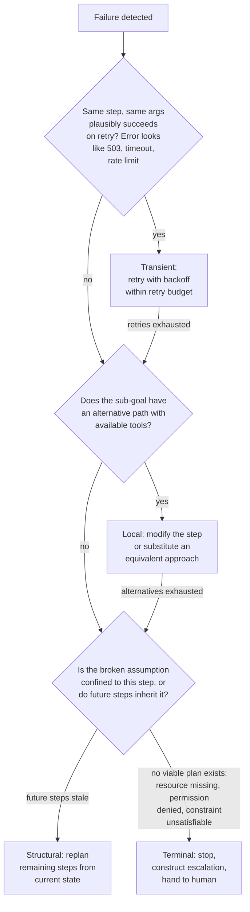
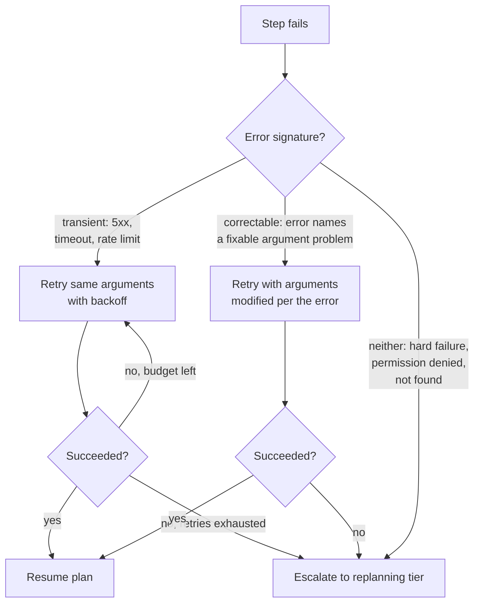
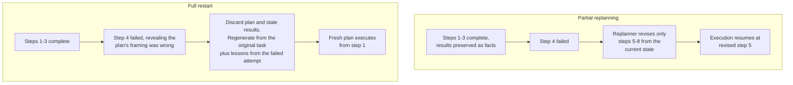
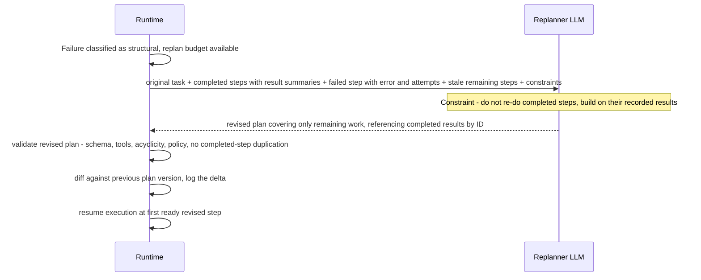
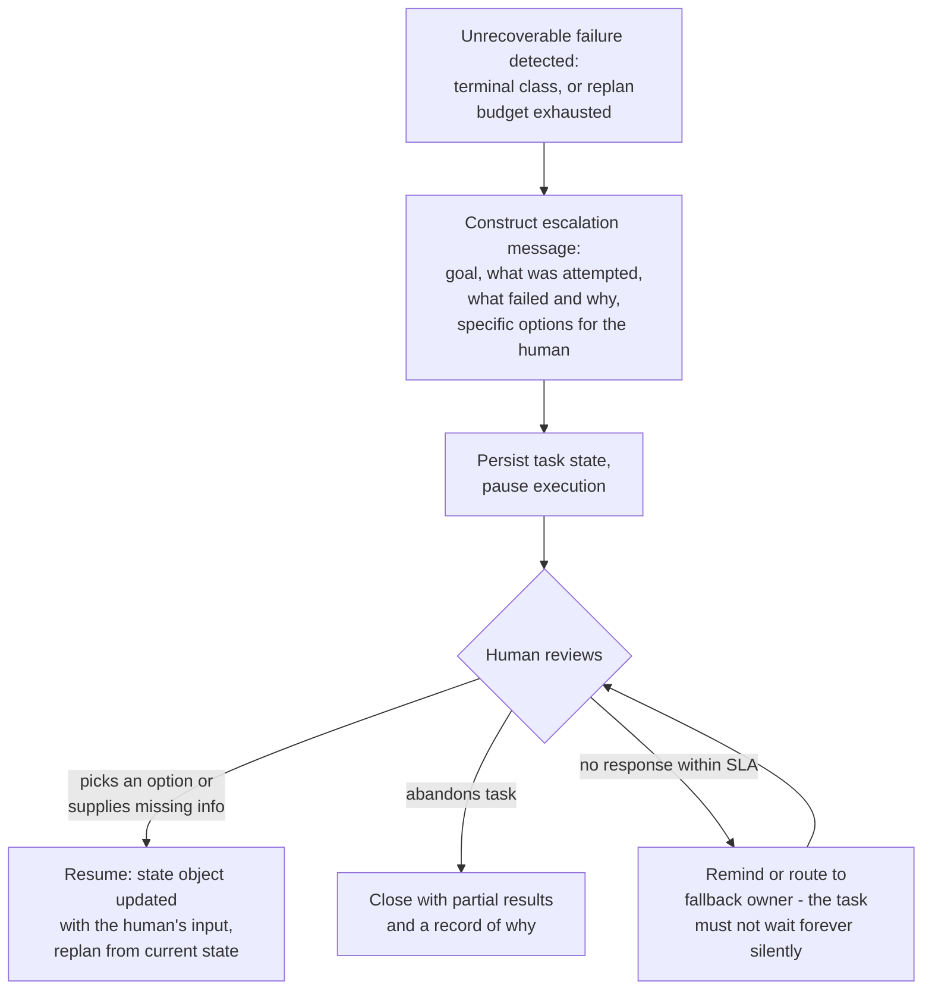
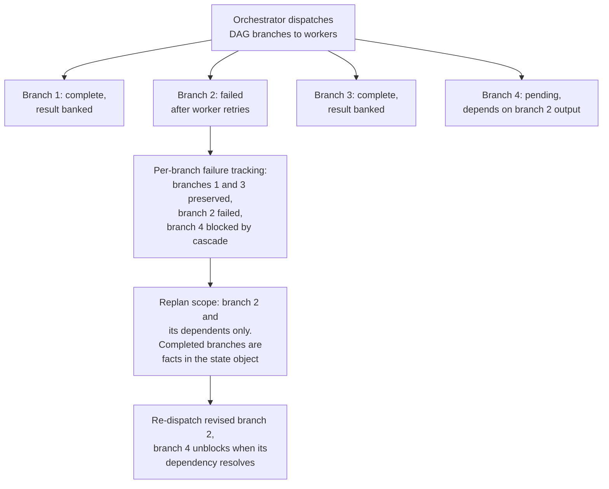
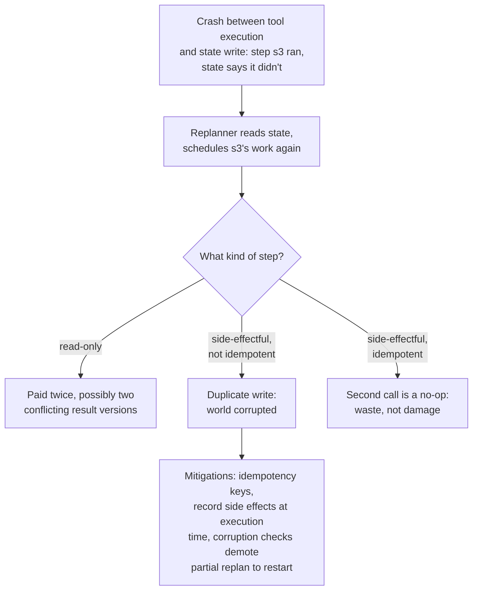
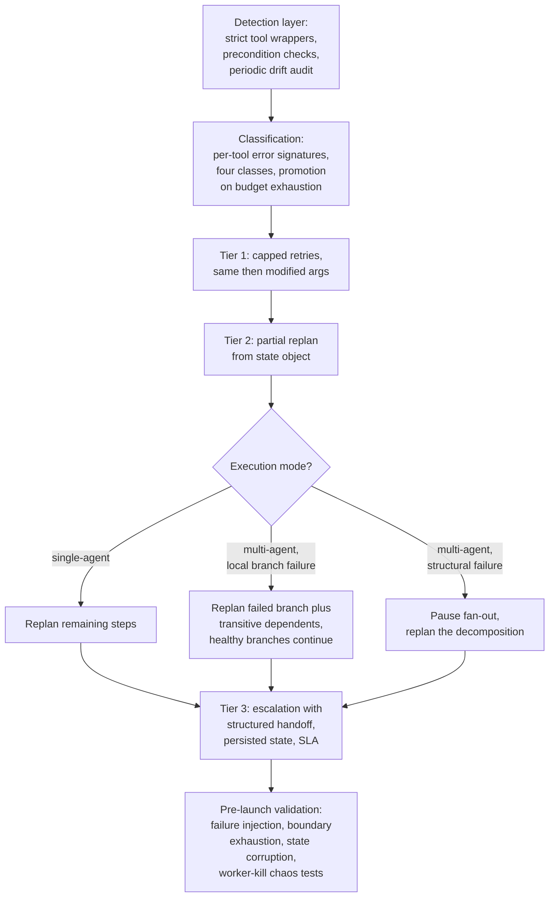

# Replanning & Error Recovery

## Overview

In long-horizon tasks, mid-plan failures are expected, not exceptional. A ten-step plan where each step independently succeeds 95% of the time completes cleanly only about 60% of the time — and that's before counting the failures that aren't step errors at all: results that quietly invalidate a downstream step's premise, trajectories that drift off-goal without any tool ever erroring. A planning system without a robust recovery strategy doesn't have a rare-edge-case gap; it fails whenever the real world deviates from the plan, which is routinely.

[Plan-and-Execute vs ReAct](02-plan-and-execute-vs-react.md) established that production planning systems treat the plan as a mutable hypothesis and replan when reality diverges. This chapter is the machinery behind that sentence, organized the way the runtime experiences it: **detect** that something broke, **classify** how broken it is, **recover** with the cheapest strategy that fits the classification, and **escalate** when no autonomous strategy fits.

## Detect: Failure Signals Mid-Plan

The system cannot replan what it hasn't noticed is broken. Three signal types, in increasing order of detection difficulty:



**Explicit step failure** — the tool returned an error, the sub-agent timed out, the output failed schema validation. Detection is immediate and free: the failure announces itself at the step boundary, and it arrives with the most actionable information recovery can get (an error message, a status code, the failed arguments). The only engineering required is making sure failures actually surface — a tool wrapper that swallows errors into empty results converts this cheapest signal into the expensive kind below.

**Result-contradicts-assumption** — the step *succeeded*, but its result implies an assumption baked into a future step is false. The search step returned zero documents, so "summarize the three retrieved documents" cannot proceed; the fare came back $845 against an $800 constraint; the API returned a schema the transform step doesn't expect. Detection requires the plan to carry **explicit, machine-checkable preconditions per step** — expected result shapes, constraint bounds, minimum counts — so that a deterministic check at each step boundary compares what happened against what the plan assumed. A plan that is just a list of steps has implicit assumptions nothing can verify; this is why [structured plan objects](01-task-decomposition-and-planning.md) matter for recovery, not just validation. Detection latency is one step boundary — fast, but strictly dependent on the planner having reified its assumptions.

**Goal drift** — no step failed, no assumption check fired, but the trajectory as a whole has bent toward a different objective than the original task (the failure mode from [Agent Failure Modes & Guardrails](../09-agents/05-agent-failure-modes-and-guardrails.md), fed by [context rot](../04-context-engineering/05-context-rot-and-failure-modes.md)). Detection requires a periodic audit — every K steps, or at phase boundaries, a check (LLM-as-judge or embedding similarity between recent actions and the original task) asks: *is this trajectory still serving the original goal?* It is the slowest signal (drift accumulates across steps before crossing any threshold) and the vaguest (it tells the replanner "you're off course," not which step went wrong), but it is the only one of the three that catches a plan failing *silently while succeeding locally*.

The engineering priority follows the ordering: maximize how many failures arrive as signal 1 (strict tool wrappers, schema validation on every result), reify assumptions so signal 2 is deterministic code, and run signal 3 audits at a frequency proportional to how expensive undetected drift is for the task type.

## Classify: The Failure Taxonomy

Not all failures cost the same to recover from, and the entire economics of recovery is matching strategy to severity. Four classes:

| Class | What it means | Example | Correct recovery |
|---|---|---|---|
| **Transient** | The step is fine; the world hiccupped | API returned 503, rate limit, network timeout | Retry the same step, same arguments |
| **Local** | The step as formulated is impossible, but the sub-goal has an alternative path | Scrape blocked by the site, but a data-vendor API covers the same content | Retry with modified approach, or replan just this step's neighborhood |
| **Structural** | A foundational assumption of the plan is wrong; multiple future steps are stale | The dataset the plan revolves around doesn't contain the needed field | Replan remaining steps from current state |
| **Terminal** | The task is impossible with available tools, permissions, or constraints | Resource doesn't exist, permission denied at the org level, constraint mathematically unsatisfiable | Stop and escalate to a human — more attempts are pure waste |



Two properties of this tree matter operationally. First, **classification is escalation-shaped**: a transient failure that survives its retries gets reclassified as local; a local failure whose alternatives are exhausted gets reclassified as structural or terminal. The system doesn't need perfect classification upfront — it needs cheap first guesses and honest promotion when the cheap strategy fails. Second, **misclassification costs are asymmetric**: treating a terminal failure as transient burns the entire retry and replan budget discovering what was knowable immediately (permission-denied errors do not fix themselves on attempt four); treating a transient failure as structural pays a planning-quality LLM call to route around a hiccup a $0 retry would have cleared. The error-message heuristics that separate them — status codes, error taxonomies per tool — are cheap deterministic code and worth writing per tool rather than letting an LLM guess from prose.

## Recover, Tier 1: Retries Before Replanning

The retry tier exists because most failures in production are transient, and a retry costs no LLM call at all. It sits *below* replanning and has two levels:

- **Same-arguments retry** for transient failures: exponential backoff, small cap (2–3 attempts). Applies when the error signature says "the world hiccupped" — 5xx, timeout, rate limit.
- **Modified-arguments retry** for correctable failures: the error message itself indicates the fix — a 400 naming a malformed date field, a "query too broad" from a search API, a pagination limit exceeded. One cheap LLM call (or a deterministic error-to-fix rule) revises the arguments; the step and the plan stay intact. This is still not replanning — the plan is untouched, only one call's arguments changed.



The budgets are the design decision. **Retry budget, replan budget, and total task budget are three separate ceilings**: a per-step retry cap (typically 2–3) bounds time wasted on one step; a per-task replan cap (typically 2–3) bounds planning spend; and the total task cost/time ceiling from [Agent Fundamentals](../09-agents/01-agent-fundamentals-and-the-agent-loop.md) bounds everything regardless of how the other two are consumed. The failure mode of collapsing them into one: unlimited retries on a non-transient failure burn the whole task budget without converging — a permission error retried thirty times with backoff is thirty delays purchasing nothing, and the dashboard shows a slow task rather than a blocked one. Retries must be *classified into*, not defaulted into.

## Recover, Tier 2: Partial Replanning vs Full Restart

When retries can't fix it — the failure is local-beyond-alternatives or structural — the choice is the defining tradeoff of recovery: preserve completed work and replan the remainder, or discard everything and start over informed by the failure.



**Partial replanning is correct when** the completed steps' results remain valid inputs to the goal and the failure is isolated ahead of the current position — the data gathered in steps 1–3 is still the data the report needs; only the path from step 4 onward needs rerouting. It is cheaper (completed work is preserved), faster (no re-execution), and safer around side effects (completed side-effectful steps aren't re-run).

**Partial replanning is wrong when** the failure reveals that completed results are themselves useless or misleading — the search that "succeeded" in step 2 was scoped by an assumption step 4 just falsified, so its results are answers to the wrong question. Replanning forward from that state carries a bad foundation into the revised plan: the replanner, told "steps 1–3 are done," will build on them rather than question them. This is the subtle failure of partial replanning — it treats *completed* as *correct*, and those are different claims. The tell: if the falsified assumption predates the failed step (it was baked in at planning time or an early step), completed work downstream of that assumption is suspect and restart-from-the-assumption is honest; if the assumption broke *at* the failed step, upstream work is clean and partial replanning is right.

**Full restart is correct when** the plan's framing was wrong from the start, when state tracking is too corrupted to trust (see reconciliation below), or when the remaining work is so cheap that a structured partial replan costs more than re-executing — with one non-negotiable: the restart prompt must carry forward *what was learned*, especially the failure. A restart that regenerates from the original task description alone will frequently regenerate the same plan and hit the same wall.

## State Reconciliation: What the Replanner Must Know

Partial replanning is only as good as the system's model of the current state. The replanner needs to know exactly what has been done, what results exist, and what side effects occurred — or it will re-do work, skip work, or build on phantom results. The state object is the contract:

```json
{
  "original_task": "Research competitor pricing and produce a summary report",
  "plan_version": 2,
  "completed": [
    {"id": "s1", "tool": "web_search", "result_summary": "3 competitors identified: A, B, C",
     "result_ref": "state://s1_output", "side_effects": []},
    {"id": "s3", "tool": "query_db", "result_summary": "internal pricing, 42 rows",
     "result_ref": "state://s3_output", "side_effects": []}
  ],
  "failed": [
    {"id": "s2", "tool": "fetch_page", "error": "403 blocked by anti-bot after 3 retries",
     "attempts": 3, "classification": "local"}
  ],
  "pending_stale": ["s4", "s5"],
  "budget": {"replans_used": 0, "replans_max": 2, "cost_spent_usd": 0.14, "cost_ceiling_usd": 1.00}
}
```

Design points that earn their keep:

- **Results by reference plus summary, not by value.** The replanner needs to know *that* s1 found three competitors and roughly what they are — it does not need the raw fetched pages in its context. Summaries keep the replanning call small; references let revised steps consume full results at execution time. When completed results are numerous or large, this is where [context compression](../04-context-engineering/03-context-compression-and-summarization.md) applies to planning state.
- **Side effects recorded explicitly.** "Sent the notification email" is state that exists nowhere in any tool result unless recorded — and it's precisely the thing a replanner must know not to schedule twice.
- **The failure mode of incomplete state tracking** is paying twice and conflicting results: the replanner doesn't know s3 ran, schedules it again, and now two versions of "internal pricing" exist — possibly different, if the underlying data moved between runs — with downstream steps consuming whichever they happen to reference. Duplicated queries cost money; duplicated *writes* corrupt the world.
- **Idempotency as the design principle that makes imperfect tracking survivable.** Tools designed so that calling twice produces the same result and the same world-state (idempotency keys on writes, upserts instead of inserts, "create-if-absent" semantics) convert the double-execution failure from corruption into mere waste. State tracking will occasionally be incomplete — a crash between a tool's execution and the state write guarantees it — so cheap-to-re-run beats never-re-run as the operating assumption.

## The Replanning Call

The replan itself is one LLM call with a precise contract:



**The input** is the state object above: the original task (verbatim — the replanner must re-anchor to the actual goal, not to a paraphrase that may have drifted), completed steps with result summaries, the failed step with its error and attempt history, and the now-stale remaining steps (useful as a signal of intent, clearly labeled as stale). **The output** is a revised plan covering only remaining work, in the same structured schema as the original — which means the entire [validation pipeline](01-task-decomposition-and-planning.md) from decomposition applies unchanged, plus one recovery-specific gate: reject a revised plan that re-schedules a completed step's work under a new name.

**Constraining the replanner not to re-do completed work** takes both prompt and validation: the prompt states that completed results are established facts to build on; the validator catches the violation (a revised step whose tool and arguments substantially duplicate a completed step's) because prompts are suggestions and the replanner, seeing a summary of s1's output rather than trusting it, will sometimes decide to "just re-verify."

**When the replan itself is bad** — and it will sometimes be, because the replanning call is subject to every decomposition failure mode from [chapter 01](01-task-decomposition-and-planning.md) — the error is structurally different from the first plan's error: the replanner operates with *more* context (real results, a real failure) but *worse* framing risk (it's anchored on a broken plan's remains and a possibly-misclassified failure). A second replan triggered shortly after the first, for the same region of the plan, is the signature of this: the first replan didn't fix the actual problem, usually because the failure was misclassified (a structural break treated as local) or the state object was wrong. This is why the replan budget is small — two consecutive failed replans is strong evidence the system doesn't understand what's wrong, and the honest next move is escalation, not a third guess.

## The Economics: When Replanning Is Worth It

Replanning is an additional planning-quality LLM call — often the most expensive call type in the system. Whether to pay it is a value comparison the runtime can make mechanically:

**Replan when** `value of remaining work − cost of replan > value of best alternative` — where the alternatives are full restart (cheaper per-call? no: same planning call, plus re-execution cost, minus stale-foundation risk) and abandonment-with-escalation (costs a human's attention). In practice the comparison reduces to a few legible rules: replan when substantial completed work would otherwise be discarded (partial replan preserves paid-for value), when remaining steps are expensive (a wrong path forward costs more than the call that avoids it), or when side effects make re-execution dangerous. Skip the structured replan and just restart when the task is short and cheap — three fast read-only steps in, restarting costs less than composing and validating a replan — because a restart of a cheap task is a simpler code path with fewer ways to be wrong. Escalate when the replan budget is exhausted or the failure classifies as terminal.

The anti-patterns are the two constant policies. *Always-replan* pays planning-priced calls to route around failures on tasks so cheap that restart was free, and keeps paying on consecutive replans that aren't converging. *Never-replan* (restart everything) discards completed work proportional to how far tasks get before failing — fine at three steps, ruinous at thirty. The budget structure above is what makes the automatic policy safe: per-step retries, per-task replan cap, total ceiling, each enforced by the runtime.

## Escalate: The Human as a Recovery Strategy

Terminal failures — and non-terminal ones that exhaust their budgets — end at a human. Escalation done well is not an error message; it is a **structured handoff that makes the human's decision cheap**. The path, integrating with [Human-in-the-Loop Architecture](../09-agents/06-human-in-the-loop-architecture.md):



The format of a good escalation message is the difference between a five-second human decision and a twenty-minute archaeology session. Not *"Step 4 failed. Task aborted."* but:

> *"I'm building the competitor pricing report. I identified competitors A, B, C and pulled our internal pricing (done, preserved). I could not get competitor pricing: the sites block automated access (tried 3 times), and the FinData connector returns no pricing data for these companies. Two options: (1) I proceed using only the analyst-report excerpts I can access — coverage will be partial and dated; (2) someone grants me access to the PricingIntel subscription, and I complete the full report. Which do you want?"*

The structure is mechanical: **what I'm doing, what's done and safe, what I tried and why each attempt failed, and 2–3 concrete options with their consequences** — ideally as selectable actions, not free text. Everything the system needs to compose this already exists in the state object; escalation quality is a serialization problem, not an intelligence problem. Two design details: the paused task must persist its full state so the human's answer can resume it days later without re-execution (the durable-execution patterns from [Multi-Agent Architecture Patterns](../10-multi-agent-systems/01-multi-agent-architecture-patterns.md)), and unanswered escalations need an SLA with reminders or fallback routing — a task silently parked on an unread notification is a failure mode of its own.

## Recovery in Multi-Agent Plans

When a plan's independent branches execute on parallel workers, recovery gains a dimension: branches fail *individually*, while the plan fails *collectively*.



The principles carry over with three amendments:

- **Per-branch state tracking is mandatory, not optional.** The orchestrator's state object tracks each branch's status independently — completed branches' results are banked facts, and a replan scopes to failed branches plus their dependents. Restarting all N workers because one failed multiplies the waste by N; this is the partial-replanning argument with a worker-count coefficient.
- **Cascading failure is the new class.** A failed branch whose output feeds a pending branch blocks that branch too — one failure, propagated along dependency edges. The replanner must receive the *transitive* stale set (branch 2 and everything downstream of it), not just the failed node, or it revises branch 2 while branch 4 waits on an output shape that no longer matches. Dependency edges are exactly what makes the cascade computable — another return on the [explicit dependency graphs](01-task-decomposition-and-planning.md) investment.
- **Coordination overhead multiplies during recovery.** While a branch replans, do the healthy in-flight branches keep running? Usually yes for independent branches (their results remain valid regardless), but a *structural* failure — one that invalidates the decomposition itself — means in-flight work on sibling branches may be wasted, and pausing them is cheaper than letting them finish work a re-decomposition will discard. The failure class determines the blast radius: local failure → replan the branch; structural failure → pause the fan-out, replan the decomposition. Multi-agent coordination pathologies beyond single-branch failure — deadlocks, emergent divergence between branches — are the subject of [Coordination Failure & Emergent Behavior](../10-multi-agent-systems/03-coordination-failure-and-emergent-behavior.md).

## Testing Recovery Paths

Recovery logic has a testing pathology: it is exercised only when things break, things break rarely and unreproducibly in development, and so the recovery path ships with the least testing of any code in the system — then runs for the first time in production, during an incident, which is the worst possible integration test. The countermeasure is making failures cheap to manufacture:

- **Failure injection.** Mock tools that return errors on demand — 503s, timeouts, permission-denied, schema-violating payloads, empty result sets — wired into the eval suite so every failure class in the taxonomy has a test that triggers it and asserts the correct recovery tier fires. The zero-results search (a *success* that should trip an assumption check) belongs here as much as the 500 does; testing only thrown errors leaves signal 2 detection untested.
- **Boundary exhaustion.** What happens when *every* retry fails? When the replan budget is exhausted? When the replan itself returns an invalid plan twice? Each budget boundary should have a test asserting the system escalates cleanly — structured message, persisted state — rather than looping, crashing, or silently abandoning the task.
- **State corruption.** Hand the replanner a state object with a completed step missing, a side effect unrecorded, a result reference dangling. The assertions: no double-execution of side-effectful steps (idempotency holding), no phantom-result references in the revised plan, and detectable-corruption cases refusing to partial-replan (falling back to restart) rather than building on state they can't trust.
- **Chaos testing for multi-agent plans.** Kill a worker mid-branch and verify: per-branch tracking marks it failed (not hung forever), completed sibling branches survive untouched, the cascade to dependent branches is computed correctly, and the re-dispatched branch resumes from banked state rather than from scratch. The kill-during-state-write case — worker dies between executing a side effect and recording it — is the single most valuable chaos test in a planning system, because it is exactly the case idempotency exists for.

## Monitoring

- **Replan rate per task type** — the headline signal, same as in [chapter 02](02-plan-and-execute-vs-react.md): rising means tool reliability or plan quality is deteriorating; split it by trigger type (step failure vs. assumption contradiction vs. budget) to tell which.
- **Failure classification distribution** — the transient/local/structural/terminal mix per task type. A stable mix is a fingerprint; shifts localize the problem (transient spike → infrastructure; local spike → a specific tool degrading; structural spike → planner assumptions drifting from reality; terminal spike → users asking for things the toolset can't do, which is product signal).
- **Recovery success rate** — of replan attempts, what fraction lead to task completion without further replans? This is the metric that validates the whole machinery: a low rate means replans aren't fixing what's actually wrong (misclassification, bad state objects), and the system is paying planning-priced calls for theater.
- **Recovery cost overhead** — replanning and retry spend as a fraction of total task cost. Healthy systems run single-digit percentages; growth means either more failures (see classification distribution) or recovery thrash (see consecutive-replan count).
- **Consecutive-replan count per task** — the converging-vs-thrashing detector; tasks hitting two replans in the same plan region should be rare and reviewed.
- **Escalation rate, human response time, and post-escalation completion rate** — whether the human tier is being overused (autonomy too timid or failures too common), left waiting (SLA problem), and whether escalations actually unblock tasks (message-quality problem if humans read them and can't act).

## Production Best Practices

- **Reify plan assumptions as machine-checkable preconditions** at planning time — contradiction detection is only as good as what the plan bothered to state, and deterministic precondition checks are the difference between catching staleness at the next step boundary and shipping a hollow result.
- **Classify before retrying.** Error-signature heuristics per tool (status codes, error taxonomies) are cheap code that prevents the two expensive misclassifications: retrying the unfixable and replanning around a hiccup.
- **Keep three separate budgets** — per-step retries, per-task replans, total task cost/time — each enforced by the runtime, so no single failure mode can consume the whole task's resources through one channel.
- **Make tools idempotent wherever possible**, and record side effects in the state object at execution time — together these make the inevitable state-tracking gaps survivable instead of corrupting.
- **Validate revised plans with the full pipeline plus a no-duplication gate**, and log the plan diff on every replan — the diff history is the primary artifact for debugging recovery behavior later.
- **Write the escalation message for a human who has ten seconds**: what's done, what failed and why, concrete options — and give escalations an SLA with fallback routing so paused tasks can't wait forever silently.
- **Test the unhappy paths deliberately** — failure injection for every taxonomy class, budget-exhaustion boundaries, corrupted state, and (for multi-agent) mid-branch worker kills; recovery code that has never run before production will run wrong there.

## Real World Examples

- **Coding agents (Claude Code, Cursor, Copilot agent modes)** exercise this loop visibly on every non-trivial task: a build or test failure after an edit is signal 1; the agent retries with a fix (tier 1), revises its remaining task list when the approach proves wrong (tier 2 partial replan), and asks the user when blocked on something it can't resolve — an escalation with options, not an error dump.
- **Anthropic's published multi-agent research system** documents recovery-shaped lessons directly: sub-agents that failed or returned poor results required the lead agent to detect the gap and re-dispatch, and the published writeup emphasizes durable execution and resumability — long-running multi-branch tasks losing everything to one failure was unacceptable, which is per-branch state tracking in production form.
- **Workflow engines (Temporal, Airflow, Prefect)** are the pre-LLM embodiment of the retry tier and state reconciliation: per-activity retry policies with backoff, durable execution history, and resume-from-last-completed-step semantics. LLM planning systems add the tiers those engines lack — replanning (revising the *definition* of remaining work, not just re-running it) and semantic failure detection (a step that "succeeded" with results that invalidate the plan).
- **Deep-research products** visibly absorb mid-task surprises: a source that returns nothing redirects the research plan rather than producing a report with an empty section — assumption-contradiction detection and partial replanning presented as product smoothness.

## Interview Questions

### Beginner

**Q: What are the three ways a system can detect that a plan has gone wrong mid-execution?**
Explicit step failure — a tool errors, times out, or fails validation; detected immediately and carrying the most actionable information. Result-contradicts-assumption — a step *succeeds*, but its result falsifies something a future step depends on (a search finds zero documents when a later step summarizes "the three retrieved documents"); detected by checking machine-readable preconditions at step boundaries, which requires the plan to state its assumptions explicitly. Goal drift — no step failed, but the trajectory as a whole has bent away from the original task; detected only by periodic audits comparing recent actions against the original goal, making it the slowest and vaguest signal but the only one that catches a plan failing silently while succeeding locally.

**Q: Why do retries come before replanning, and what limits should they have?**
Because most production failures are transient — a 503, a timeout, a rate limit — and a retry costs zero LLM calls while a replan costs a planning-quality call. So the cheap strategy runs first: retry same-arguments with backoff for transient signatures, retry with modified arguments when the error message names a fixable problem. The limits: a small per-step retry cap (2–3), separate from the per-task replan cap, separate from the total task budget. Without the cap and the classification, unlimited retries on a non-transient failure (a permission error doesn't fix itself on attempt four) burn the task's entire budget without converging.

### Intermediate

**Q: When is partial replanning the wrong choice even though completed steps all succeeded?**
When the failure reveals that completed results are answers to the wrong question. Completed ≠ correct: if step 4's failure falsifies an assumption that was baked in *before* steps 1–3 ran — the search scope, the interpretation of the goal, the choice of data source — then those steps' results are clean executions of a wrong specification. A partial replan told "steps 1–3 are done" will build forward on that bad foundation, because it treats banked results as facts. The tell is where the falsified assumption originated: if it predates the completed work, restart from the assumption point; if it broke at the failed step, upstream results are genuinely still valid and partial replanning is right — cheaper, faster, and safer around already-executed side effects.

**Q: What goes into the replanning call, and how do you stop it from re-doing completed work?**
Input: the original task verbatim (to re-anchor on the actual goal), completed steps with result *summaries* and references (not raw payloads — keep the call small), the failed step with its error and attempt history, the now-stale remaining steps labeled as such, and the budget state. Output: a revised plan covering only remaining work, in the same schema as the original, so the full validation pipeline applies. Preventing re-work takes two layers: the prompt declares completed results established facts to build on, and a validation gate rejects revised steps that substantially duplicate a completed step's tool-and-arguments — the second layer exists because the replanner, shown a summary instead of the work, will sometimes decide to "re-verify."

### Senior

**Q: Design the state object that makes partial replanning safe, and explain what happens when it's wrong.**
The state object records, per step: status (completed/failed/pending-stale), the tool called, a result summary plus a reference to the full result, recorded side effects, and for failures the error, attempt count, and classification — plus plan version and budget counters at the task level. Results go by summary-plus-reference so the replanning call stays small while revised steps can consume full outputs at execution time; side effects are recorded explicitly because "the email was sent" exists in no tool result unless written down. When the object is wrong — a completed step missing after a crash between execution and the state write — the replanner schedules that work again: for a read, that's paying twice and risking two conflicting versions of the same data; for a write, it's corruption. Two mitigations, in order: idempotent tool design (idempotency keys, upserts, create-if-absent) converts double-execution from corruption into waste, and detectable-corruption checks (dangling references, gaps in the step sequence) should demote the recovery from partial replan to full restart, because building on state you can't trust is worse than re-paying for execution you can.



**Q: Your recovery success rate is 45% — over half of replans lead to another replan or an escalation. Where do you look?**
A failing replan means the revision didn't address what was actually wrong, and there are three usual suspects, checkable in order of likelihood. First, misclassification: pull the failed-recovery traces and check whether structural failures are being classified as local — a replan that reroutes one step around a broken foundational assumption will fail again one step later, which shows up as consecutive replans in the same plan region. Second, state-object quality: if the replanner is fed summaries that omit what mattered (the *reason* a result was thin, an unrecorded side effect), its revisions are built on fiction — audit a sample of state objects against the raw trajectories. Third, the failure information itself: if error messages passed to the replanner are generic ("step failed") rather than specific ("403 after 3 attempts, site blocks automation"), the replanner can't route around what it can't see. Notably *not* on the list as a first move: swapping in a stronger replanner model — if classification or state is broken, a better model revises the wrong problem more eloquently.

### Staff

**Q: Design the full recovery architecture for a planning system running both single-agent and multi-agent (parallel-branch) tasks, including budgets, escalation, and how you'd validate it before launch.**
One recovery spine, parameterized by execution mode. Detection: strict tool wrappers so failures surface as explicit errors; machine-checkable preconditions emitted by the planner and checked at every step boundary; drift audits every K steps, K set per task type by the cost of undetected drift. Classification: per-tool error-signature rules producing transient/local/structural/terminal, with escalation-shaped promotion when a tier's budget exhausts. Recovery tiers: capped retries (same-args, then modified-args), then partial replan from a state object that tracks per-step — and in multi-agent mode per-branch — status, result references, and side effects; structural failures in multi-agent mode pause the fan-out before replanning the decomposition, since sibling work may be invalidated, while local branch failures replan only the branch plus its transitive dependents, computed from the dependency graph. Budgets: three independent runtime-enforced ceilings (per-step retries, per-task replans, total cost/time), with multi-agent adding per-branch retry isolation so one bad branch can't starve the others. Escalation: terminal classifications and exhausted budgets produce a structured handoff — done/tried/failed-why/options — with persisted state for resumption and an SLA with fallback routing. Validation before launch: failure injection covering every taxonomy class including the succeeded-but-empty case, budget-boundary exhaustion tests asserting clean escalation, state-corruption tests asserting idempotency holds and corrupted state demotes to restart, and chaos tests killing workers mid-branch — with the kill placed between a side effect and its state write, because that's the case the whole design is built to survive. The launch gate is a measured recovery success rate on injected failures, not the absence of failures in a happy-path suite.



## Google-Level Follow-Ups

- "Your assumption-contradiction detection depends on the planner emitting preconditions. What catches the assumptions the planner didn't think to state?" — *probes whether the candidate sees the recursion: reified preconditions only cover known unknowns. A strong answer layers defenses — output-shape validation on every step regardless of stated preconditions, the periodic drift audit as the backstop for unstated assumptions, and feeding post-incident analysis back into the planner prompt so each missed assumption becomes a stated one next time.*
- "A replan is triggered while two other branches of the same plan are mid-flight. Walk through the race conditions." — *probes concurrent-systems thinking applied to planning: the in-flight branches may complete and write state while the replanner is composing against a snapshot, so the revised plan can be stale on arrival. A strong answer versions the state object, detects the write-after-snapshot conflict, and either re-validates the revised plan against current state or briefly quiesces the fan-out during replanning — and knows which is right by how expensive pausing the branches is.*
- "Escalation rate is 2%, and post-escalation completion is 95%. Your PM wants escalation driven to zero. Argue." — *probes whether the candidate treats escalation as a failure or as a designed tier: a 95% post-escalation completion rate means escalations are working — humans unblock tasks the system correctly identified as beyond its authority or information. Driving to zero means the system either guesses at terminal failures (wrong answers instead of questions) or burns budget on unwinnable recovery. The right target is escalation precision — every escalation genuinely needed a human — not escalation volume.*
- "How does your recovery design change when steps are irreversible — sent emails, executed trades — versus when everything is read-only?" — *probes whether the candidate connects recovery strategy to reversibility: read-only tasks can restart freely, so recovery machinery can be minimal; irreversible steps make full restart dangerous (double-send) and make partial replanning with rigorous side-effect tracking mandatory, push confirmation gates before the irreversible step rather than recovery after it, and shift the design goal from "recover well" to "never need recovery past the point of no return" — sequencing irreversible steps as late in the plan as dependencies allow.*

## Common Mistakes

- **Building recovery only for thrown errors.** The step that *succeeds* with a result that invalidates the plan — zero search results, an unexpected schema — is the failure mode that produces confident wrong answers, and it's invisible to try/catch; it requires preconditions checked at step boundaries.
- **One shared budget for retries, replans, and the task.** Collapsed budgets let a single pathology consume everything through one channel — thirty backoff retries on a permission error is a blocked task masquerading as a slow one.
- **Treating completed as correct in partial replans.** Banked results are facts about what *executed*, not about what's *true*; when the falsified assumption predates the completed work, replanning forward carries the bad foundation into the revised plan.
- **Feeding the replanner raw trajectories or empty summaries.** Raw payloads blow up the replanning call's cost and drown the signal; over-compressed state omits the detail (the *why* of a failure, a side effect) the revision hinges on. The state object is a designed artifact, not a log dump.
- **Ignoring side effects in state tracking.** Re-running a read costs money; re-running an unrecorded write corrupts the world — side effects must be recorded at execution time, and tools made idempotent so the inevitable tracking gap is waste rather than damage.
- **Shipping recovery paths that have never executed.** Recovery code is structurally the least-tested code in the system unless failures are injected deliberately; the first production incident is the wrong place for its integration test.

## Key Takeaways

- Mid-plan failure is the expected case in long-horizon tasks — at 95% per-step reliability, a ten-step plan completes cleanly barely 60% of the time — so recovery is core architecture, not exception handling.
- Detection comes in three signals of increasing difficulty: explicit step failures (free, immediate), assumption contradictions (requires the plan to reify its assumptions as machine-checkable preconditions), and goal drift (requires periodic audits, and is the only signal that catches plans failing silently while succeeding locally).
- Classify before recovering: transient → retry, local → modify or substitute the step, structural → replan remaining work, terminal → escalate. Classification is escalation-shaped — cheap first guesses promoted honestly when they fail — and misclassification costs are asymmetric in both directions.
- Partial replanning preserves paid-for work and is usually right, but it treats completed as correct; when the falsified assumption predates the completed steps, those results are clean executions of a wrong specification, and restart-from-the-assumption is the honest move.
- The state object is the contract that makes recovery safe: per-step status, result summaries with references, explicitly recorded side effects — and idempotent tool design is what makes the inevitable tracking gaps survivable rather than corrupting.
- Escalation is a designed tier, not a failure: a structured handoff (done, tried, failed-why, options) with persisted state turns a blocked task into a cheap human decision — and the target metric is escalation precision, not zero escalations.

---

*Part of [Planning Systems](index.md) in the [AI System Design Notes](../index.md). Tracked in [BACKLOG.md](https://github.com/GyanendraChaubey/AI-System-Design-Notes/blob/main/BACKLOG.md).*
