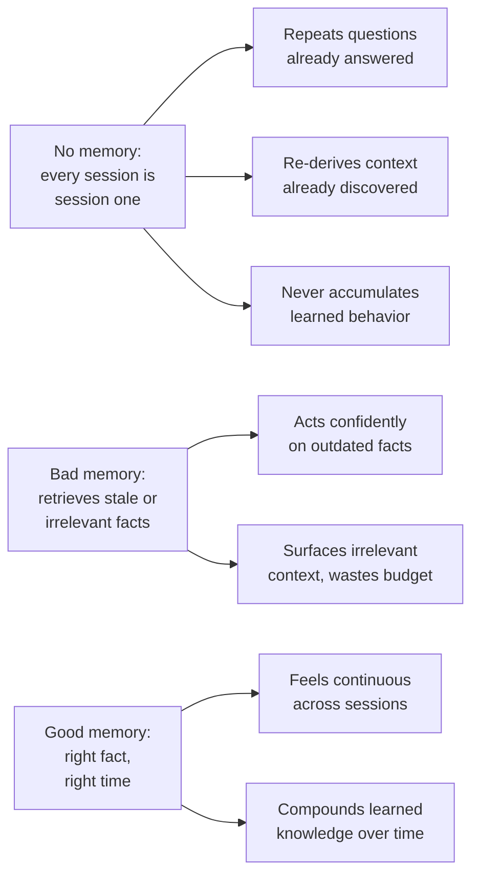
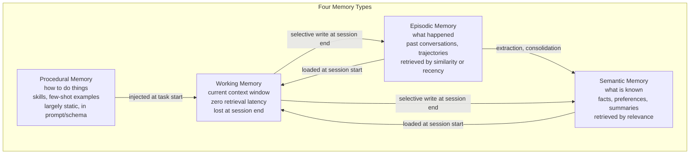
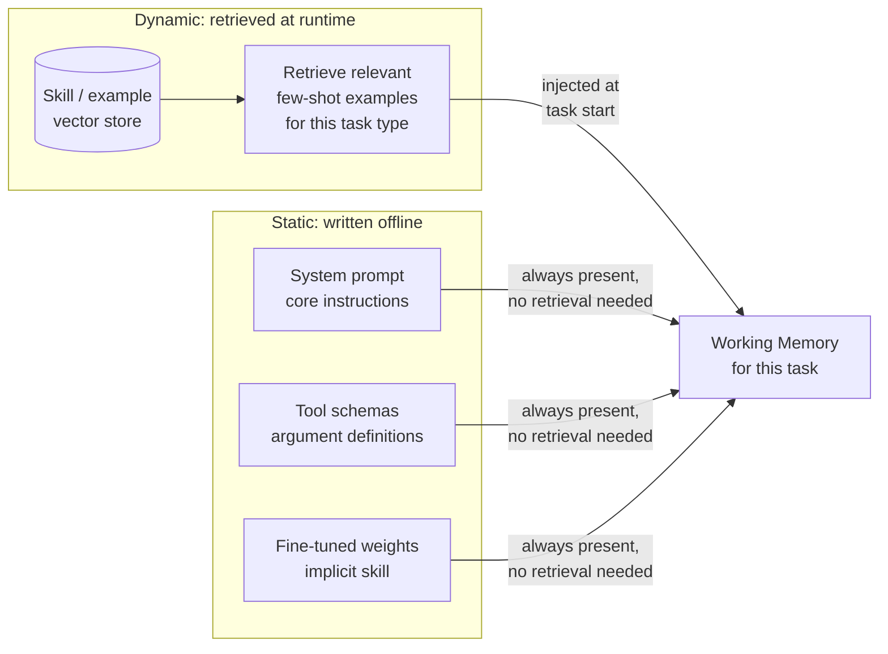
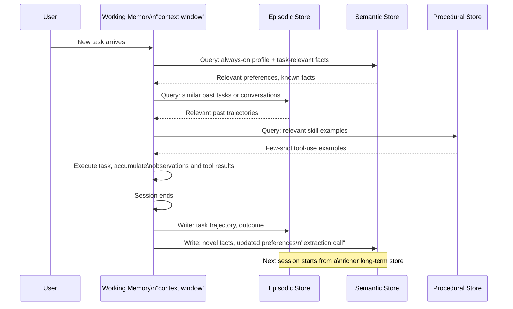
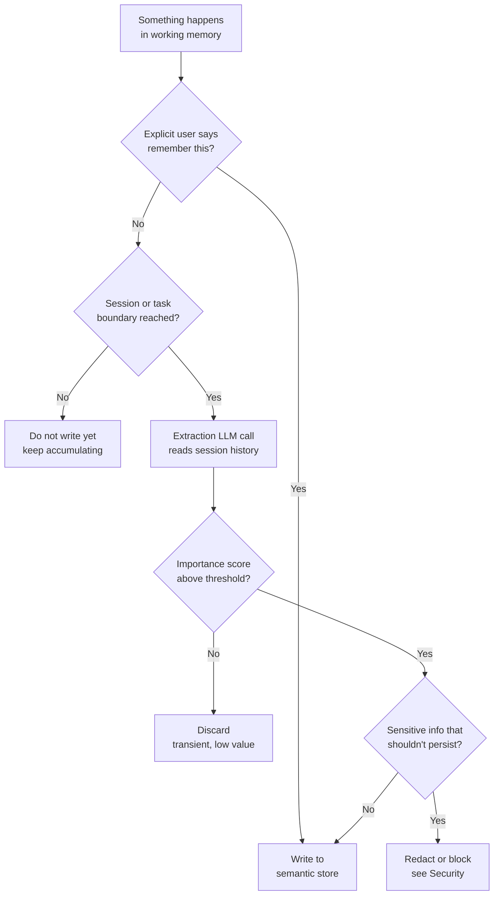
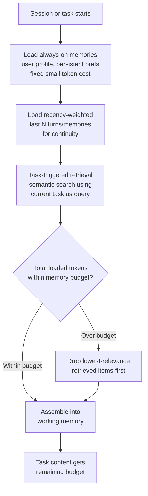
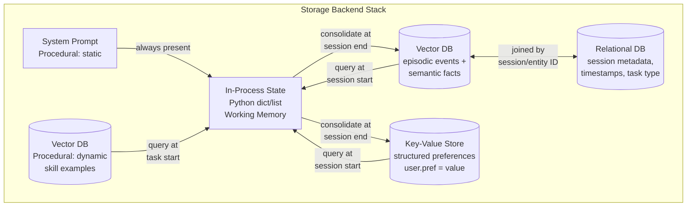
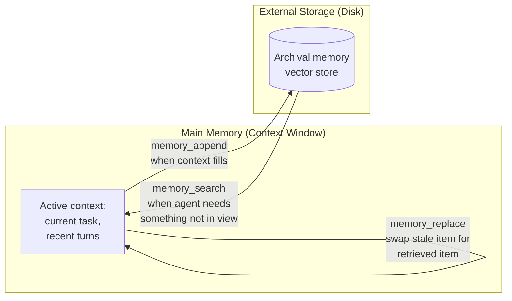

# Memory Architecture for Agents

## Overview

An agent with no persistent memory is stateless: every conversation is the first conversation, every task is a fresh start, and every fact the user has already provided must be provided again. An agent with poorly designed memory is worse than stateless — it retrieves stale or irrelevant facts and acts on them with the same confidence as if they were current, actively misleading the user instead of merely lacking context. Memory architecture is the set of design decisions — what to remember, where to store it, how to retrieve it, and when to forget it — that determines which of these three an agent actually is.

## Definition

Agent memory is the set of mechanisms by which information persists and is retrieved across the boundary of a single model call, spanning both the current session (the active context window) and prior sessions (external, durable storage). A memory architecture assigns each piece of information to one of four types — working, episodic, semantic, procedural — based on how it is written, how it decays, and how it is retrieved, and defines the read/write policies that move information between the model's context and durable storage.

## Problem Statement

The context window is finite, expensive, and ephemeral. It can hold only what fits within a fixed token ceiling; every token held costs money on every subsequent call because most agent runtimes resend history in full (see [Agent Fundamentals and the Agent Loop](../09-agents/01-agent-fundamentals-and-the-agent-loop.md)); and its contents vanish the moment the session ends unless something explicitly copies them elsewhere. Three concrete failures follow directly:

- **Cross-session amnesia.** A customer support agent that doesn't remember what a user told it three conversations ago asks the same qualifying questions every time, forcing the user to repeat themselves and signaling — correctly — that "the system doesn't actually know me."
- **Re-derivation cost.** A coding agent that doesn't remember a project's architecture re-reads the codebase and re-derives module relationships on every single task, paying the same discovery cost repeatedly instead of once.
- **No accumulation of learned behavior.** An agent that fixed a subtle bug last week, or learned that a particular API endpoint is flaky, has no way to carry that lesson forward unless the lesson is written somewhere durable and retrieved the next time it's relevant.

Memory architecture is what makes an agent feel like it knows you and your work, rather than like a fresh, amnesiac instance spun up for every request.

## The Four Memory Types

Production agent memory is not one system — it is four distinct types, each with a different lifecycle, storage location, and retrieval mechanism. Treating them as a single undifferentiated "memory" is the most common architectural mistake in this space; each type exists because it solves a problem the others don't.

### Working memory

Working memory is the current context window — everything the agent can "see" right now: the active conversation, the current task description, and the tool results accumulated during this session. It has three defining properties. First, it is bounded by the context window limit; there is a hard ceiling on how much it can hold, and that ceiling is a real engineering constraint, covered in depth in [Context Window Budgeting](../04-context-engineering/02-context-window-budgeting.md). Second, it has zero retrieval latency — nothing needs to be fetched, because it is already sitting in the prompt the model reads. Third, it is entirely ephemeral: everything in working memory is lost when the session ends unless something explicitly copies it into a durable store before that happens.

The agent loop described in [Agent Fundamentals and the Agent Loop](../09-agents/01-agent-fundamentals-and-the-agent-loop.md) operates entirely within working memory — every observation the planner reasons over, every tool result it reacts to, lives here. Every other memory type described below exists for one purpose: to feed the right information into working memory at the right time, and to capture the right information out of working memory before it disappears.

### Episodic memory

Episodic memory is a record of what happened: past conversations, past task trajectories, past tool-call results, stored externally in a vector database, a key-value store, or a relational database, and retrieved later by semantic similarity or recency. It answers questions like "what did we discuss last Tuesday?" and "what did this agent do the last time it faced this kind of task?"

The defining characteristic of an episodic memory is that it records an *event*, tied to a specific time and context: "the user said their team has 12 engineers, on March 3rd, during a discussion about hiring." It is a log entry, not a distilled fact. Episodic memories are the raw material that semantic memory is built from — but not every episodic memory becomes a semantic one, and the two are queried very differently at retrieval time.

### Semantic memory

Semantic memory is a store of what is known: facts, user preferences, domain knowledge, learned rules, and summaries of long documents, also stored externally. The distinction from episodic memory is precise and worth stating twice, because it is the one architectural distinction most implementations get wrong: **episodic memory records events, semantic memory records extracted knowledge.** "The user said X on March 3rd" is episodic. "The user prefers Python over JavaScript" is semantic — it is a conclusion drawn from (possibly several) episodes, stripped of the specific time and conversational context that produced it.

Both memory types are populated by processing what happens during a session, but they are queried differently — episodic memory is searched when the question is "what happened," semantic memory is searched when the question is "what's true" — and they decay at different rates: episodic memories are individually low-value and safe to prune aggressively once their content has been distilled into semantic form, while semantic memories (a durable user preference, a hard-won architectural fact) are worth retaining much longer, because deleting one erases a conclusion rather than one instance of evidence for it.

### Procedural memory

Procedural memory is how to do things: skills, step-by-step procedures, and few-shot examples of successful tool use. In practice, this lives in the system prompt and tool schemas rather than in a runtime memory store — it is the agent's "muscle memory."

This is architecturally different from the other three types in one crucial way: it is largely **static**. Working, episodic, and semantic memory are all written to at runtime, as a normal part of operating the agent. Procedural memory is updated through prompt engineering or fine-tuning — a deliberate, offline change to how the agent behaves — not through a runtime write during a session. An agent does not typically decide mid-task to permanently alter its own system prompt.

That said, procedural memory can be injected *dynamically* without being runtime-*written*: a system can retrieve relevant few-shot examples of successful tool use for the current task type from a vector store and inject them into context at task start, giving the appearance of "the agent remembering how to do this" without any change to the underlying static prompt. This is the same read mechanism episodic and semantic memory use — retrieval into working memory — applied to a memory type whose write path is offline.

## How the Four Types Interact in a Full Agent Session

The memory architecture is not four independent stores — it is a cycle. A new task arrives; the agent reads relevant episodic and semantic memories from long-term storage into working memory; the agent executes the task, accumulating new observations in working memory; at session end, working memory content is selectively consolidated back into episodic and semantic stores; the next session starts from a richer long-term store than the last one did. This cycle, repeated over the agent's lifetime, is the entire point of building a memory architecture at all — without it, every session starts from the same empty state regardless of how many sessions came before.

## Memory Write Policy

Not everything that happens in a session deserves to be persisted. A memory store that captures everything is not more capable than one that captures the right things — it is noisier, more expensive to query, and slower to retrieve from correctly (covered further in [Memory Retrieval & Forgetting](03-memory-retrieval-and-forgetting.md)).

**What to write:** novel facts the agent has not seen before, user preferences (explicit or inferred), task outcomes (what was attempted and whether it succeeded), and errors along with how they were resolved — this last category is disproportionately valuable, because it is exactly the kind of thing that saves real re-work the next time a similar error occurs.

**What not to write:** transient observations that have no value outside the step that produced them (an intermediate tool result already folded into a conclusion), intermediate tool results that are not reusable (a one-off API response with no lasting relevance), and sensitive information that should not persist at all (covered further under Security below and in [Memory Retrieval & Forgetting](03-memory-retrieval-and-forgetting.md)).

**How to decide:** three mechanisms, usually combined. Importance scoring — an LLM call that rates a candidate memory's significance, discussed in depth in [Memory Retrieval & Forgetting](03-memory-retrieval-and-forgetting.md) as part of the Generative Agents scoring function. Recency/heuristic triggers — write at natural boundaries (end of session, end of task, a fixed number of turns elapsed) rather than continuously. Explicit "remember this" triggers — a user says "remember that I prefer concise answers," or an automated extraction step flags a statement as preference-bearing language.

**Who decides:** this can be the agent itself (deciding mid-task, via an explicit memory-write tool call, in the MemGPT style below), a separate memory-management LLM call run at session end (an extraction pass distinct from the task-performing model call), a rule-based filter (regex or heuristic matching on "remember," "always," "never," "I prefer"), or — in most production systems — a combination: rule-based triggers catch explicit requests cheaply, and a periodic extraction call catches everything else.

## Memory Read Policy

At the start of a session or task, which memories get loaded into working memory is a budget decision as much as a relevance decision — every loaded memory competes with task content for the same finite context window (see [Context Window Budgeting](../04-context-engineering/02-context-window-budgeting.md)).

Four loading strategies, typically combined:

- **Always-on memories** — user profile and persistent preferences that are loaded on every session regardless of task, because they're cheap (small, stable) and near-universally relevant.
- **Task-triggered retrieval** — semantic search over episodic and semantic stores using the current task as the query, pulling in only what's relevant to what's being asked right now.
- **Recency-weighted loading** — the most recent N memories loaded regardless of relevance, for conversational continuity ("what did we just talk about," independent of topical relevance).
- **The context budget tradeoff** — loading too many memories consumes working-memory budget that would otherwise go to the actual task content. A memory-loading policy that pulls in 20 marginally-relevant facts "just in case" is trading task-completion quality for a false sense of thoroughness.

## Storage Backends for Each Memory Type

The choice of backend is not arbitrary — different memory types have fundamentally different access patterns, and picking the wrong backend for a given type either underperforms (using a relational DB for semantic-similarity lookups) or overcomplicates (standing up a vector database for something that's really just an in-process list).

| Memory type | Primary backend | Secondary backend | Access pattern |
|---|---|---|---|
| Working memory | In-process (Python dict / list), lives in the LLM's context | None needed | Direct, no query — already in context |
| Episodic memory | Vector database (semantic search over past events) | Relational DB for structured metadata (timestamp, session ID, task type) | Similarity search + metadata filter |
| Semantic memory | Vector database (facts retrieved by relevance) | Key-value store for structured preferences (`user.preferred_language = "Python"`) | Similarity search for facts, direct lookup for structured prefs |
| Procedural memory | System prompt (static) | Vector database (dynamic skill retrieval), fine-tuned weights (implicit) | Always-loaded static text, or similarity search for examples |

Read the diagram as a data-flow map: working memory is the hub every other backend feeds into and drains from, never a peer store in its own right — nothing queries working memory from the outside, because it only exists for the duration of one session.

## MemGPT's OS-Inspired Approach

The MemGPT paper (Packer et al., 2023) reframes agent memory management as an operating-systems problem: the context window is "main memory" (RAM) — fast, directly addressable, but small — and external storage is "disk" — slow to access, but effectively unbounded. The core insight is that **agents should manage memory the way an OS manages RAM**: paging content out to disk when RAM fills up, and paging it back in when it's needed again, rather than relying on an external, opaque system to make that decision for it.

The implementation gives the agent explicit memory tool calls it can invoke as part of its own reasoning — `memory_append` (write a new item to external storage), `memory_search` (query external storage for relevant items), and `memory_replace` (overwrite a stale item in working memory with something more relevant retrieved from disk). The agent decides, at runtime, when its own context is getting full or when it needs something it doesn't currently have in view, and issues the appropriate memory call — the same way a task decides it needs a tool and calls one.

The tradeoff is direct: this is more flexible than static memory loading at session start, because the agent can page memory in and out *during* a task as its needs change, not just once at the beginning. It costs additional tool calls for every memory read or write, though — each `memory_search` is a real round trip (embedding + vector search latency, plus a planner turn to decide to issue it), so a MemGPT-style agent trades some latency and inference cost for adaptive, in-task memory management. This tradeoff is worth it for long-running, open-ended tasks where the right memory to load genuinely isn't knowable until partway through the task; it's overkill for short, well-scoped tasks where a single upfront retrieval (the read policy described above) covers the need.

## Generative Agents' Memory Stream

The Generative Agents paper (Park et al., 2023) introduced a different, complementary idea: the **memory stream** — a single append-only log of every observation the agent makes, with no attempt to structure it into separate episodic/semantic stores at write time. Structure is imposed at *retrieval* time instead, via a scoring function that combines three signals — recency, relevance, and importance — to decide which stream entries are worth surfacing for the current context. The full scoring mechanics (the weighting formula, tuning the weights, and reflection — a periodic synthesis step that distills raw stream entries into higher-order insights) are covered in depth in [Memory Retrieval & Forgetting](03-memory-retrieval-and-forgetting.md), since they are fundamentally a retrieval-and-forgetting design, not a storage-architecture one.

The architectural takeaway relevant to this chapter: a memory stream is a valid alternative to MemGPT's explicit paging model. Instead of the agent deciding when to page memory in and out, every observation is written unconditionally, and a scoring function at read time does the work of surfacing the right subset. This trades write-time discipline (deciding what's worth keeping) for read-time discipline (deciding what's worth surfacing) — and it means the write-policy questions above (what to write, what not to write) become less about gatekeeping the write path and more about tuning the retrieval score so a noisy, everything-goes-in stream still surfaces good results.

## Security

Memories persist sensitive information — PII, credentials, confidential business data — across sessions in ways that are harder to audit than conversation logs, because a conversation log is typically scoped to one interaction while a memory store accumulates and cross-references information across many interactions, often for many users.

- **Memory access control.** Which agents, and which requests, can read which user's memories must be enforced at the storage layer via namespace or tenant isolation, not left to the model to "just not mention" another user's data — the same lesson multi-tenant RAG systems already learned the hard way (see [RAG Architecture](../06-rag/01-rag-architecture.md)).
- **Retention policies.** How long do episodic memories persist by default? A support conversation's episodic detail is rarely useful a year later, but the semantic facts distilled from it might still matter — retention policy should be set per memory type, not as one blanket TTL across the whole store.
- **The right to delete.** A user must be able to erase their memories from the store — not just have them hidden from future retrieval, but genuinely removed, with an auditable trail that the deletion happened. This is covered in full, including implementation patterns (soft delete with tombstones vs. hard delete), in [Memory Retrieval & Forgetting](03-memory-retrieval-and-forgetting.md).

## Cost

Every memory retrieved consumes input tokens on every subsequent model call in the session, and every memory write consumes at least one LLM inference call (for extraction or importance scoring) plus a storage write.

At a representative scale — 1M sessions/month, an average of 6 memories loaded per session at ~150 tokens each (900 tokens of loaded memory per session), and a session-end extraction call averaging 500 input / 150 output tokens to decide what's worth writing — the read-side cost is roughly 900M tokens/month of pure memory-loading overhead before any task content is considered, and the write-side cost is roughly 1M extraction calls/month, each a small but nonzero inference cost that scales linearly with session volume regardless of whether anything novel was actually said. The two levers that matter most for controlling this at scale: keeping the always-on memory set small (every session pays for it, whether or not it helps that session) and gating extraction calls behind a cheap heuristic (only run the extraction LLM call when a session plausibly contains something new, rather than on every session unconditionally).

## Interview Questions

### Beginner

**Q: What's the difference between working memory and long-term memory in an agent?**
Working memory is the current context window — everything the model can currently see, with zero retrieval cost but a hard size limit, and it disappears when the session ends. Long-term memory is anything stored externally (vector DB, key-value store) that survives beyond the session and must be explicitly retrieved back into working memory to be used.

**Q: Why is episodic memory different from semantic memory?**
Episodic memory records events — "the user said X on March 3rd." Semantic memory records extracted, durable knowledge — "the user prefers Python." Semantic facts are usually distilled from one or more episodic memories, but the two answer different kinds of queries and are worth retaining for different lengths of time.

### Intermediate

**Q: Why is procedural memory usually implemented as a static system prompt rather than a runtime-writable store?**
Because procedural memory captures skills and behavior patterns that should be stable across a session and ideally across many sessions — an agent deciding mid-task to permanently rewrite its own instructions is both unnecessary for most use cases and a real safety concern (it removes a human-reviewed control point). Where dynamic behavior *is* wanted, the pattern is to retrieve relevant few-shot examples from a vector store and inject them at task start, which changes what's in context without changing the underlying static prompt itself.

**Q: An agent's memory-loading policy pulls in every semantically related memory it can find. What goes wrong?**
It burns context budget on marginally relevant results, leaving less room for actual task content, and it risks surfacing memories that are topically related but not actually useful for the current task, diluting the signal in working memory. The fix is a budget ceiling on loaded memories plus a relevance threshold, not "retrieve everything that scores above zero similarity."

### Senior

**Q: Design the memory write path for a customer support agent handling millions of sessions per month. What gets written, and what triggers a write?**
Write task outcomes (resolved/escalated, and why), explicit or clearly inferred preferences, and any error-and-resolution pairs, since these directly reduce future work. Don't write raw transcript text as episodic memory at full fidelity for every session — that scales storage and retrieval-noise linearly with session volume for a large fraction of sessions that contain nothing novel. Instead, gate an extraction LLM call behind a cheap pre-filter (a session that resulted in escalation, contained an explicit correction, or ran unusually long is worth the extraction call; a routine, fully-resolved session in three turns often isn't), and only persist what the extraction call scores above an importance threshold.

**Q: A coding agent's memory store has grown for a year and retrieval quality is degrading. Where do you look first?**
First check whether episodic memory (raw session logs) is being retained indefinitely instead of being distilled into semantic memory and pruned — a store that never distills episodic detail into durable facts accumulates noise linearly with usage, and every retrieval query now competes against a much larger, mostly-redundant candidate set. Second, check whether the store separates project-level architectural facts (rarely stale) from task-specific details (stale quickly) — if both are queried the same way with the same importance/recency weighting, task-specific noise from a year ago will still surface. This is the forgetting-policy problem covered in [Memory Retrieval & Forgetting](03-memory-retrieval-and-forgetting.md).

### Staff

**Q: You're designing memory architecture for a multi-agent system where several specialized agents share a workspace. How do you decide what's shared memory versus per-agent memory?**
Split along the same episodic/semantic line already established, but scope it per agent role rather than per agent instance: procedural memory (skills, tool-use patterns) is almost always per-role, since a coding-focused agent and a planning-focused agent need genuinely different few-shot examples. Semantic memory about the shared task or project (architecture facts, user preferences) should be shared across agents working the same workspace — duplicating it per agent guarantees drift the moment one agent learns something the others don't. Episodic memory (what a specific agent instance did on a specific step) is usually per-agent, because "what did the planner agent do three steps ago" and "what did the coding agent do three steps ago" are different questions with different consumers. The general principle: share memory at the level where duplication would cause inconsistency, keep it separate at the level where sharing would cause noise.

## Google-Level Follow-Ups

- "Your agent's always-on memory set has grown to 3,000 tokens per session over a year of feature additions, and nobody remembers why each fact is there." — probes whether the candidate would audit each always-on entry against actual usage data (does removing it measurably hurt task success?) rather than assuming more context is safely additive; tests awareness that always-on memory is a recurring cost paid by every session regardless of relevance.
- "How would you detect that your write policy is systematically missing something important?" — probes for an evaluation methodology (sampling sessions where the agent later needed information it didn't have, tracing back to whether that information was ever candidate for a write and got filtered out) rather than "we'd notice when users complain."
- "Two memory types disagree — episodic memory shows the user asked for something recently, semantic memory has an older, contradicting preference. Which wins, and how do you know your answer generalizes?" — probes for structured conflict-resolution reasoning (recency vs. importance tradeoffs, covered fully in [Memory Retrieval & Forgetting](03-memory-retrieval-and-forgetting.md)) instead of an ad hoc single-case answer.
- "If you could only build one of the four memory types for a brand-new agent product, which would you build first, and why?" — probes for prioritization reasoning grounded in the product's actual failure mode (a support agent's biggest complaint is usually repetition, which semantic memory of preferences fixes fastest; a coding agent's biggest cost is re-derivation, which favors episodic/semantic project facts) rather than a generic "start with everything."

## Common Mistakes

- **Treating memory as one undifferentiated store.** Dumping episodic, semantic, and procedural content into the same table with the same retrieval mechanism loses the different decay rates and query patterns each type actually needs.
- **Writing everything to long-term memory "to be safe."** A store that never filters accumulates noise that degrades every future retrieval, and costs more to query and maintain than a disciplined write policy.
- **No budget ceiling on loaded memories.** Pulling in every semantically-related memory at session start competes with task content for the same context window and often lowers task quality rather than raising it.
- **Confusing procedural memory's staticness for irrelevance.** Because procedural memory is largely fixed doesn't mean it's not worth engineering carefully — a poorly-written system prompt or a stale set of tool-use examples is a memory bug, not just a prompt bug.
- **No plan for consolidating working memory before it's lost.** An agent that never writes anything from working memory to a durable store at session end has, by definition, no long-term memory at all, regardless of how sophisticated its retrieval logic looks on paper.
- **Ignoring access control across memory types uniformly.** Teams sometimes carefully scope episodic memory to a tenant but forget that a shared semantic or procedural store can leak cross-tenant information just as easily.

## Key Takeaways

- Working memory is the context window: bounded, instant, and lost at session end unless explicitly persisted — every other memory type exists to feed it or drain from it.
- Episodic memory records what happened; semantic memory records what's known. Both come from processing sessions, but they're queried differently and decay at different rates.
- Procedural memory is architecturally different because it's largely static — updated via prompt engineering or fine-tuning, not runtime writes — though dynamic skill retrieval can inject it into context without changing the underlying prompt.
- The full memory cycle — read into working memory, execute, selectively consolidate back out — is what makes each session start richer than the last; skipping consolidation makes the other three memory types pointless.
- Write policy and read policy are both budget decisions as much as relevance decisions: what gets persisted costs storage and future retrieval noise; what gets loaded costs context window space that competes with task content.
- MemGPT's explicit agent-driven paging and Generative Agents' append-everything-then-score-at-retrieval are two valid, opposite philosophies for the same underlying problem — choose based on whether the task benefits more from in-task adaptive retrieval or from retrieval-time scoring sophistication.

---

*Part of [Memory Systems](index.md) in the [AI System Design Notes](../index.md). Tracked in [BACKLOG.md](https://github.com/GyanendraChaubey/AI-System-Design-Notes/blob/main/BACKLOG.md).*
