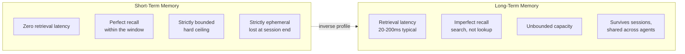
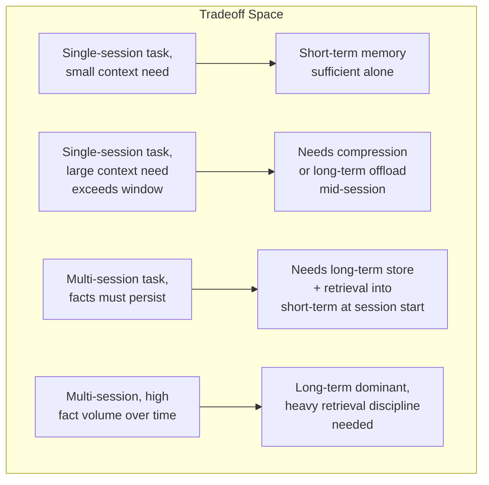
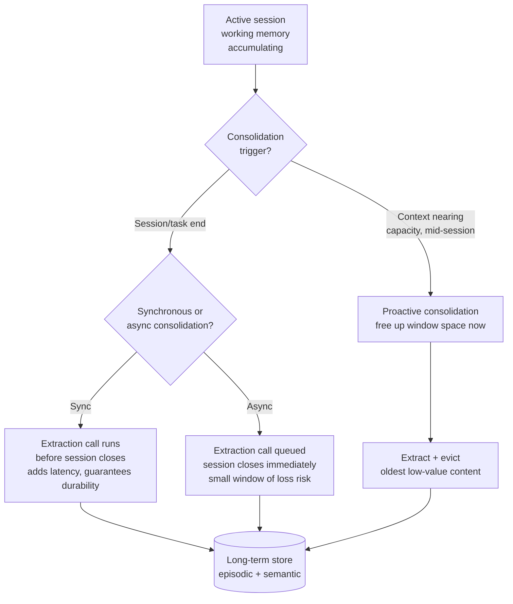
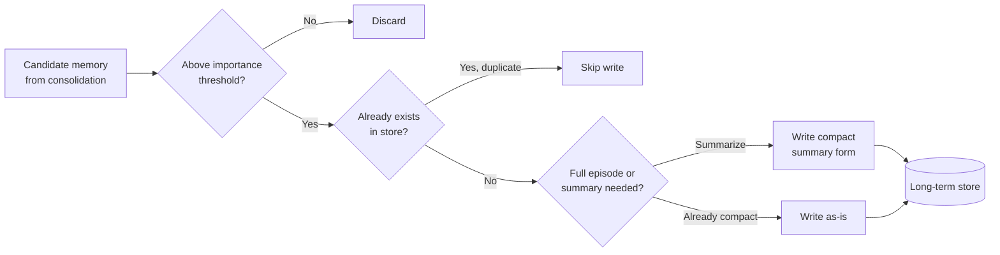
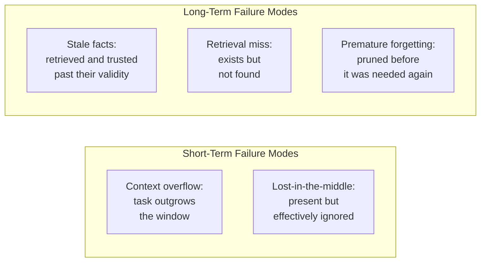
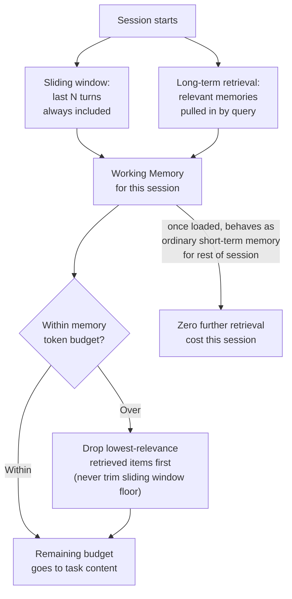
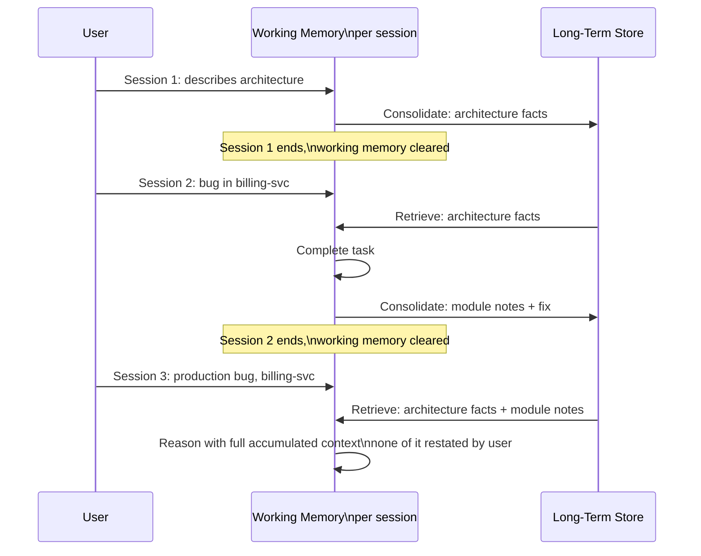
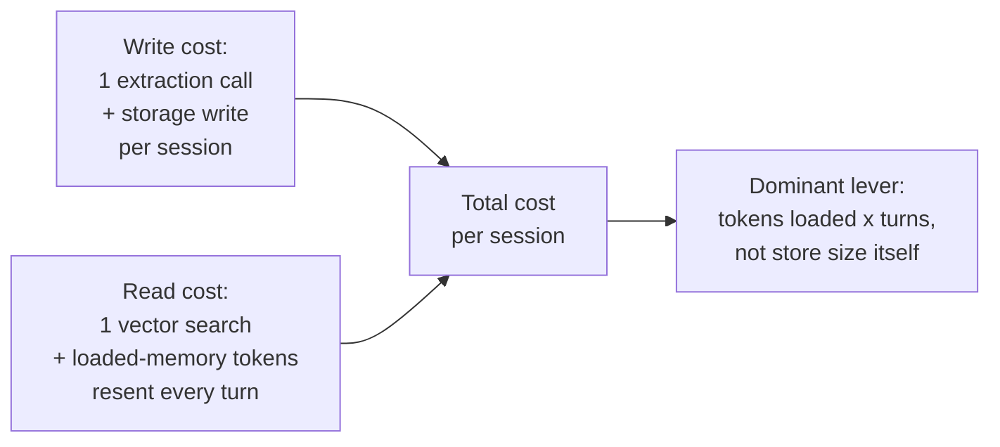

# Short-Term vs Long-Term Memory

## Overview

Every agent has short-term memory by definition — it has a context window, and whatever's in it is what the model sees. The engineering decision is not whether to have short-term memory, but what goes into it, what gets evicted as it fills, and when information should be promoted out of it into a persistent store that survives beyond the current session. This chapter is about that tradeoff: short-term memory is free and instant but bounded and ephemeral; long-term memory is unbounded and durable but costs retrieval latency and comes with no retrieval guarantee. Production systems blend both, and the blending policy — not the choice of one over the other — is where the real engineering work sits.

## Definition: Short-Term Memory

Short-term memory is the current context window. It has four properties worth stating precisely because each has a direct engineering consequence:

- **Zero retrieval latency** — nothing is fetched; it's already sitting in the prompt.
- **Perfect recall, in principle** — if a fact is in the window, the model has literal access to every token of it (though attention degrades over distance — see Failure Modes below).
- **Strictly bounded** — the context window limit is a hard ceiling, not a soft guideline; there is no "just a bit more" once it's full.
- **Strictly ephemeral** — the session ends, the context is gone, unless something explicitly copies its contents elsewhere before that happens.

Every agent has short-term memory. The design question is only what occupies it and what gets evicted as it fills — covered in depth in [Context Window Budgeting](../04-context-engineering/02-context-window-budgeting.md), which this chapter treats as a given mechanism rather than re-deriving.

## Definition: Long-Term Memory

Long-term memory is any external, persistent store — a vector database, a relational database, a key-value store, a document store — that survives beyond the current session. It has the inverse profile:

- **Unbounded capacity** — a long-term store can grow to billions of entries; there is no architectural ceiling analogous to the context window.
- **Survives sessions, accessible across agents** — the same store can serve the next session, or a different agent instance entirely, working the same task or the same user.
- **Retrieval has latency** — a vector search typically takes 20–200ms, plus embedding time for the query; this is not instant the way reading from the context window is.
- **Retrieval is imperfect** — the right memory may not be retrieved if the query is poorly formed, because retrieval is a search problem, not a lookup, and search has a recall ceiling below 100% in practice.
- **Requires an explicit write path** — information must be deliberately extracted and written to a long-term store; unlike short-term memory, where the agent accumulates observations automatically just by operating, nothing lands in long-term storage unless something puts it there.

## The Fundamental Tension

Short-term memory is cheap and (within the window) perfect, but bounded. Long-term memory is unbounded, but costly and imperfect. An agent that relies only on short-term memory forgets everything between sessions and runs out of room on long single-session tasks. An agent that over-relies on long-term memory pays retrieval latency on every turn and can fail to retrieve critical information simply because the semantic search didn't surface it — a working memory item is never "not found," but a long-term memory item can be.

Reading the tradeoff space as two axes — context window size needed on one, task horizon (single session vs. multi-session) on the other — the diagonal from "small need, single session" to "large need, many sessions" is exactly the line along which systems move from short-term-only toward long-term-dominant designs, and no real production agent sits at either pure extreme once it's used for more than a handful of sessions.

## Consolidation: Promoting Short-Term to Long-Term

At some point during or after a session, information sitting in the context window must be deliberately written to long-term storage, or it is lost the moment the session ends. This is consolidation, and it is the single mechanism that connects the two memory types.

**When to consolidate:**

- **End of session** — the simplest and most common trigger; when the conversation or task concludes, run a consolidation pass over what happened.
- **End of task** — for agents handling multiple tasks within one long session, consolidating per-task rather than per-session captures discrete units of work before they blur together.
- **Context window approaching capacity** — a proactive trigger: rather than waiting for the session to naturally end, consolidate and evict older content once the window crosses a fill threshold, freeing room for the rest of the task.
- **Explicit agent decision** — the agent itself decides mid-task that something is worth keeping (the MemGPT `memory_append` pattern described in [Memory Architecture for Agents](01-memory-architecture-for-agents.md)) and writes it immediately rather than waiting for a session boundary.

**What to consolidate:** novel facts, user preferences, task outcomes, and error/recovery pairs — the same write-what-matters list from [Memory Architecture for Agents](01-memory-architecture-for-agents.md). Explicitly *not* raw tool results that were only useful for the one step that consumed them; writing those to long-term storage adds noise without adding future value.

**How to consolidate:** either an extraction LLM call that reads the session history and writes structured facts to the long-term store, or the agent writing to memory directly via tool calls as it goes (no separate extraction pass needed, at the cost of extra tool-call overhead spread across the session instead of concentrated at the end).

**Consolidation latency:** synchronous consolidation (before the session formally closes) guarantees the write completes before anything can be lost, at the cost of adding the extraction call's latency to the user-facing end of the session. Asynchronous consolidation (queued and processed in the background after the session ends) removes that latency from the user's critical path, at the cost of a small window where a crash or interruption between session end and background processing could lose the consolidation entirely — acceptable for most products, not acceptable for a task where compliance requires the write to be durable before the session is considered closed.

## The Write-What-Matters Problem

An agent that writes everything to long-term memory fills its store with noise — intermediate reasoning, transient observations, tool results that were only relevant for one specific step. Over time, a noisy memory store degrades retrieval quality: every query returns some genuinely relevant memories mixed with many irrelevant ones, and the model has to do the work of sorting signal from noise that the memory system should have done at write time.

- **Importance scoring at write time** — only persist facts above an importance threshold, rather than everything unconditionally (mechanics detailed in [Memory Retrieval & Forgetting](03-memory-retrieval-and-forgetting.md)).
- **Deduplication** — don't write a fact that's already in the store; a naive consolidation pass that re-extracts "the user prefers Python" every session produces N nearly-identical entries instead of one, all of which surface together at retrieval time and add nothing but redundant tokens.
- **Memory compression** — write a summary of an episode rather than the full transcript; the summary captures what matters at a fraction of the storage and future retrieval cost.
- **The failure mode of a never-pruned store** — a store that only ever grows, with no deduplication or importance filtering, eventually reaches a point where the marginal value of any single new memory approaches zero while the marginal retrieval cost of searching a larger index keeps rising — a strictly bad trade with no offsetting benefit, and it happens silently unless the store is monitored.

## Failure Modes Specific to Each Type

### Short-term: context overflow

The task is long enough that the context window fills before the task completes. The agent must either summarize-and-compress earlier content (losing some detail in exchange for continuing) or fail outright. See [Context Compression and Summarization](../04-context-engineering/03-context-compression-and-summarization.md) for the compression mechanics themselves; the relevant point here is that overflow is a short-term-memory-specific failure with no long-term-memory analog — long-term storage doesn't "fill up" in any way that blocks the current task the way an exhausted context window does.

### Short-term: lost-in-the-middle

Information from earlier in the session is nominally in context — it hasn't been evicted, the tokens are literally present in the prompt — but is effectively ignored because the model's attention degrades on items far from the current position. This is a subtler failure than overflow: nothing looks wrong from a token-count perspective, but the agent behaves as if it forgot something it technically still "has." See [Context Rot and Failure Modes](../04-context-engineering/05-context-rot-and-failure-modes.md) for the full mechanics.

### Long-term: stale facts

A fact was correct when written but is now outdated, and the agent retrieves it and acts on it as if it were current — the "worse than stateless" failure mode described in [Memory Architecture for Agents](01-memory-architecture-for-agents.md). Cover three angles: **staleness detection** (a last-written timestamp or an explicit TTL on volatile facts — a fact like "user's current project" should expire much faster than "user's preferred programming language"); **active invalidation** (when a new fact contradicts an existing one, the old one should be updated or flagged superseded, not left to coexist silently); and the failure mode where **staleness is never detected** because the agent never checks for contradictions — it simply retrieves whatever scores highest and uses it, with no step that asks "is this still true?"

### Long-term: retrieval miss

A relevant memory exists in the store, but the semantic search doesn't find it, because the current query's embedding doesn't match the memory's embedding closely enough. This is a probabilistic failure, not a bug — even a well-tuned retrieval system has a nonzero miss rate. Mitigations: hybrid retrieval (semantic + keyword, catching exact-match cases embeddings miss), retrieval expansion (querying the store with multiple phrasings of the same underlying question), and — the harder organizational lesson — accepting that long-term retrieval is probabilistic, not guaranteed, and designing the product experience so a miss degrades gracefully rather than producing a confidently wrong answer.

### Long-term: premature forgetting via over-aggressive pruning

The consolidation or pruning policy is too selective, and information that turns out to be needed later gets discarded before that need materializes. This is the mirror-image failure of a never-pruned store: pruning is necessary, but pruning too aggressively means the agent re-learns things it already knew, which is close to as bad as never having learned them in the first place. Forgetting policy design is covered fully in [Memory Retrieval & Forgetting](03-memory-retrieval-and-forgetting.md).

## How Production Systems Blend Both

A static split — "short-term for within-session, long-term for cross-session" — is too rigid for anything beyond a toy implementation. Production systems blend the two along three dimensions:

- **Dynamic memory loading** — at session start, pull the most relevant long-term memories into the context window, where they behave exactly like short-term memory for the rest of the session (zero further retrieval cost, perfect recall within that session). This is the mechanism described as the "read policy" in [Memory Architecture for Agents](01-memory-architecture-for-agents.md); the point worth reinforcing here is that once loaded, a long-term memory *becomes* short-term memory for the duration of the session — the distinction is about where information originates and persists, not a permanent tag on the content itself.
- **Sliding window** — keep the last N conversation turns in context always, regardless of relevance, as a continuity floor that doesn't depend on retrieval succeeding. This protects against the retrieval-miss failure mode for the most immediately relevant content (what just happened), while long-term retrieval handles everything further back.
- **The memory budget** — how many tokens of working memory to allocate to loaded long-term memories versus current task content is the same budgeting problem as any other context source (see [Context Window Budgeting](../04-context-engineering/02-context-window-budgeting.md)); memory competes for space with the task itself, and over-loading memory starves the task of room to work.

## Worked Example: Three Sessions with a Coding Assistant

Trace a coding assistant across three sessions to see exactly what lives where at each point.

**Session 1** — the user describes their project's architecture (a monorepo, three services, a shared auth library). The agent takes notes during the conversation; at session end, consolidation extracts these as semantic facts ("project uses monorepo with `auth-svc`, `billing-svc`, `search-svc`; shared auth library at `libs/auth`") and writes them to the long-term store. Nothing about this session persists in working memory once it ends — only what consolidation wrote to long-term storage survives.

**Session 2** — the user asks for help with a bug in `billing-svc`. At session start, the agent's read policy queries the long-term store using the task as context, retrieves the Session 1 architecture facts, and loads them into working memory. The agent now has the project's architecture *as if it had always been in context*, without the user re-explaining it. The agent completes the task, and at session end, consolidation writes new semantic facts specific to the `billing-svc` module (its internal structure, the bug's root cause and fix) alongside the Session 1 architecture facts, which remain unchanged and equally retrievable.

**Session 3** — the user reports a new bug, this time in production, possibly related to the `billing-svc` fix. At session start, the agent retrieves *both* the Session 1 architecture facts and the Session 2 module-specific notes, since both are relevant to reasoning about a `billing-svc` production issue. Working memory for Session 3 contains: the current bug report, the architecture facts from Session 1, and the module notes from Session 2 — none of which the user had to restate, all of which came from long-term storage retrieved fresh at this session's start.

## Cost

Three cost components, tracked separately because they scale differently:

- **Write cost** — an LLM call for extraction at consolidation time, plus the storage write itself. This scales with number of sessions, not with store size.
- **Read cost** — a vector search (cheap, milliseconds, negligible marginal compute cost) plus the token cost of whatever gets loaded into working memory (which scales with every subsequent model call in that session, not just the first one — loaded memory sits in context and gets resent every turn the same way conversation history does, per [Agent Fundamentals and the Agent Loop](../09-agents/01-agent-fundamentals-and-the-agent-loop.md)).
- **Total cost per session as a function of store size** — vector search latency and infrastructure cost grow slowly (roughly logarithmically for a well-indexed store) with store size, so the dominant cost driver at scale is not store size itself but how many tokens of retrieved memory get loaded per session and how many turns that session runs, since loaded memory is repaid on every turn.

Illustrative shape: at 1M sessions/month, an average of 5 turns per session, and 600 tokens of loaded long-term memory per session, that memory is resent roughly 5 times per session (once per turn, per the full-history-resend pattern) — 3,000 token-turns of memory-driven cost per session, or 3B token-turns/month, before any task content is counted. Cutting loaded memory from 600 to 300 tokens through tighter relevance filtering roughly halves this specific cost component — the same lever context budgeting always comes back to: load less, load better, rather than load everything the search returns.

## Tradeoffs

| Approach | Advantage | Disadvantage |
|---|---|---|
| Short-term memory only | Zero retrieval latency, no infrastructure, perfect within-session recall | No cross-session continuity; hard ceiling on task length |
| Long-term memory only, nothing kept in active window | Unbounded capacity, survives sessions | Retrieval latency on every turn if not cached into working memory; retrieval is imperfect |
| Dynamic loading (long-term retrieved into short-term at session start) | Combines unbounded storage with in-session zero-cost recall | Requires a working read policy and a budget; retrieval miss still possible at load time |
| Sliding window + retrieval hybrid | Protects immediate continuity even when retrieval misses | Sliding window content competes with retrieved content for the same budget |

## Monitoring

- **Consolidation success rate** — what fraction of sessions that should trigger a write actually complete one; a silent failure here means long-term memory quietly stops accumulating.
- **Context overflow rate** — how often sessions hit the window ceiling before completing, an early signal that either tasks are growing or compression isn't triggering early enough.
- **Retrieval hit rate at session start** — of the memories the read policy expected to be relevant, what fraction were actually retrieved; a declining rate suggests query formulation or embedding quality is drifting from how memories are written.
- **Loaded-memory token share** — what fraction of the working-memory budget is consumed by loaded long-term memories versus task content, tracked over time as the store grows.
- **Staleness rate** — of memories retrieved and used, what fraction were later found to be outdated (detailed further in [Memory Retrieval & Forgetting](03-memory-retrieval-and-forgetting.md)).

## Interview Questions

### Beginner

**Q: What are the two defining constraints of short-term memory versus long-term memory?**
Short-term memory (the context window) has zero retrieval latency and near-perfect recall within it, but is strictly bounded in size and disappears when the session ends. Long-term memory (an external store) is unbounded and survives across sessions, but retrieval takes real latency and is not guaranteed to succeed.

**Q: Why can't an agent just rely on a very large context window instead of building long-term memory?**
Even a very large window is still finite, and it's still ephemeral — it doesn't survive across sessions no matter how big it is. A window big enough to hold everything from every past session ever, resent every turn, would also be enormously expensive and slow, since most agent runtimes resend the full context on every model call.

### Intermediate

**Q: What is consolidation, and why does it have to happen deliberately rather than automatically?**
Consolidation is the process of writing information from working memory into a long-term store before the session ends and that information is lost. It has to be deliberate because nothing in working memory is automatically durable — unlike accumulating observations in-session, which happens for free as the agent operates, a long-term write requires an explicit extraction step and a storage call, and if nothing triggers that step, nothing persists.

**Q: Give an example of a short-term-memory failure and a long-term-memory failure that look similar to a user but have different root causes.**
Both can look like "the agent doesn't remember something." A short-term failure (lost-in-the-middle) means the information is technically still in context but the model's attention didn't weight it properly. A long-term failure (retrieval miss) means the information was never even loaded into context this session because the search didn't find it. The fix for the first is compression/reordering within the current context; the fix for the second is improving retrieval (hybrid search, query expansion) at session start.

### Senior

**Q: Design the consolidation pipeline for an agent product going from a single-session prototype to a multi-session production system. What has to change?**
The prototype has no long-term store at all — everything lives and dies with the session. Moving to production requires: an extraction step (LLM call or agent tool calls) that runs at a defined trigger (session end is simplest to start), a schema for what gets written (facts, preferences, outcomes — not raw transcripts), a long-term store (vector DB plus structured metadata), and a read policy at the start of the next session that queries this store and loads results back into working memory within a token budget. The riskiest part to get wrong is the extraction step's judgment on what's worth keeping — under-extract and long-term memory never accumulates anything useful; over-extract and it fills with noise that degrades future retrieval.

**Q: Your production agent's per-session cost has grown steadily even though the model and prompt haven't changed. Long-term memory is enabled. How do you check whether memory is the cause?**
Break down input tokens per session by source (see [Context Window Budgeting](../04-context-engineering/02-context-window-budgeting.md)): if the loaded-memory token share has grown over time while task-content tokens are stable, the long-term store's retrieval is either returning more items per session (a budget-ceiling regression) or the average size of retrieved items has grown (memories aren't being compressed/summarized as tightly as they used to be). Cross-check against store size and session count growth to confirm it's the retrieval policy loading more, not simply more sessions running.

### Staff

**Q: A product team wants to load the user's entire interaction history into context at the start of every session "so the agent remembers everything." How do you respond?**
This conflates "the agent should have long-term memory" with "the agent should keep all of it always in short-term memory," which defeats the purpose of having two memory types with different cost profiles in the first place. Push back with the actual tradeoff: unbounded loading grows unboundedly with usage, both in token cost (paid every turn of every session, forever) and in retrieval-noise risk (a large loaded set dilutes relevance the same way an unfiltered vector index does). The better design keeps a small always-on summary (durable, high-level facts) plus targeted, budget-capped retrieval for what's relevant to the *current* task — the same read-policy discipline from [Memory Architecture for Agents](01-memory-architecture-for-agents.md) — and validate with an eval that task quality with targeted retrieval is at least as good as with everything loaded, at a fraction of the cost.

## Google-Level Follow-Ups

- "Consolidation is running asynchronously in the background after each session closes. What happens if the process crashes between session end and consolidation completing?" — probes for durability reasoning: does the candidate propose a queue with at-least-once delivery and idempotent writes, or does the design silently lose sessions on crash?
- "Your sliding window keeps the last 10 turns always in context, and your retrieval pulls in long-term memories on top of that. How do you decide the split when both compete for the same token budget?" — probes for budget-allocation reasoning grounded in what each mechanism protects against (sliding window protects immediate continuity independent of retrieval succeeding; retrieval protects relevance beyond the immediate window) rather than an arbitrary fixed split.
- "How would you detect, in production, that your long-term memory store contains stale facts that are actively hurting task quality, as opposed to just being unused?" — probes for the distinction between "unused but harmless" and "retrieved and actively wrong," and whether the candidate proposes contradiction-checking or behavioral evaluation rather than assuming staleness self-reveals.
- "If your product had to work with a hard 8K-token context window — no modern large window available — how would short-term/long-term blending change?" — probes whether the candidate over-indexes on "just make the window bigger" as a general solution and can reason about aggressive summarization and much tighter retrieval budgets as the actual lever when the window itself can't grow.

## Common Mistakes

- **Treating "long-term memory" and "loaded into context" as mutually exclusive states.** Once retrieved into working memory for a session, a long-term memory behaves exactly like short-term memory for the rest of that session — the distinction is about origin and durability, not a permanent property of the content.
- **No consolidation trigger at all.** A system that accumulates rich working-memory context every session but never writes any of it to a durable store has, functionally, no long-term memory regardless of what infrastructure exists.
- **Loading every semantically related long-term memory with no budget ceiling.** This starves task-content budget and reintroduces the exact cost problem long-term memory retrieval is supposed to solve efficiently.
- **No staleness handling on long-term facts.** A fact written once and never re-checked or invalidated will eventually be wrong, and an agent that retrieves and trusts it blindly is worse than one that never had the fact at all.
- **Writing raw transcripts instead of extracted, compressed facts.** This inflates storage and retrieval-noise linearly with session count, when a distilled summary would carry nearly all of the future value at a fraction of the cost.
- **Assuming synchronous consolidation is always correct because it's "safer."** For most products the added latency on every session's close is a worse tradeoff than a small, well-managed async failure window — treat this as a product decision, not a default.

## Key Takeaways

- Every agent has short-term memory by definition (the context window); the design question is what occupies it and what gets evicted, not whether it exists.
- Long-term memory is unbounded and durable but never free: retrieval costs latency, and retrieval is a probabilistic search, not a guaranteed lookup.
- Consolidation is the deliberate act of writing working memory to long-term storage before a session ends — without it, long-term memory silently never accumulates anything, no matter how much infrastructure exists behind it.
- A long-term memory, once retrieved into working memory for a session, behaves exactly like short-term memory for the rest of that session — the distinction between the two types is about origin and durability, not a permanent property of the content itself.
- Short-term failures (overflow, lost-in-the-middle) and long-term failures (staleness, retrieval miss, premature forgetting) look similar to an end user but have different root causes and different fixes — diagnose which type before reaching for a solution.
- Production systems blend both continuously: a sliding window for guaranteed recent continuity, budgeted retrieval for relevant older content, and an explicit token budget so memory never silently starves the task it's supposed to be supporting.

---

*Part of [Memory Systems](index.md) in the [AI System Design Notes](../index.md). Tracked in [BACKLOG.md](https://github.com/GyanendraChaubey/AI-System-Design-Notes/blob/main/BACKLOG.md).*

