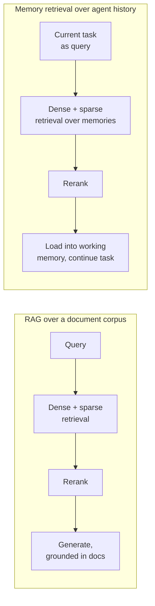
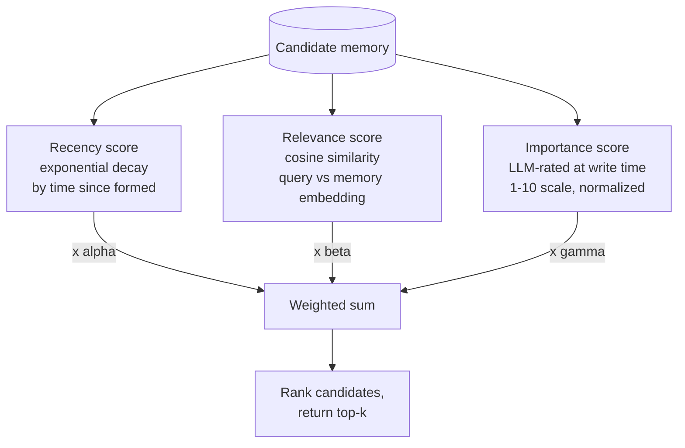
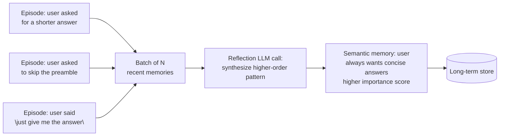
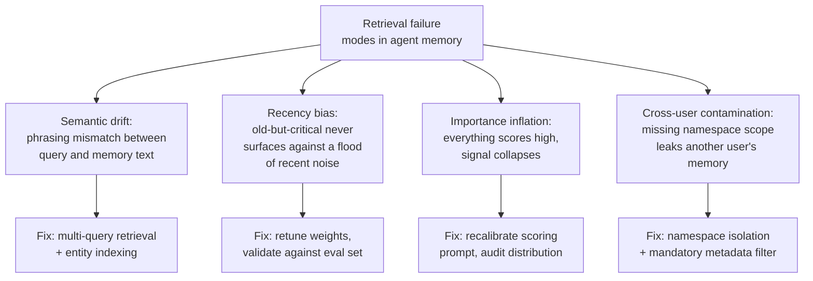
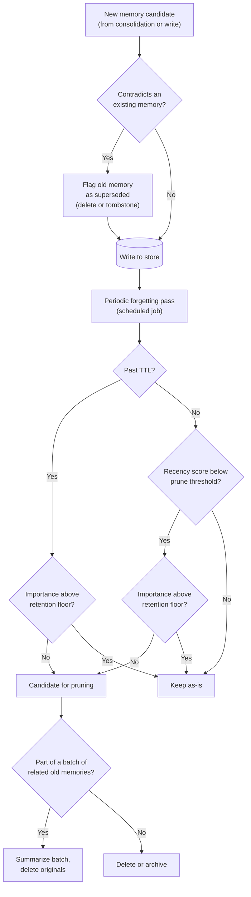
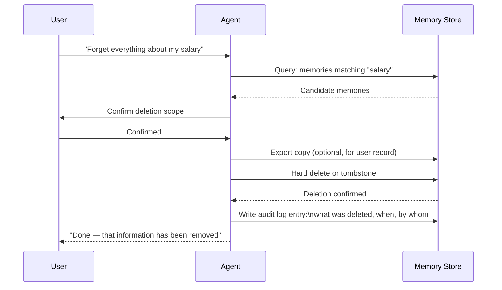
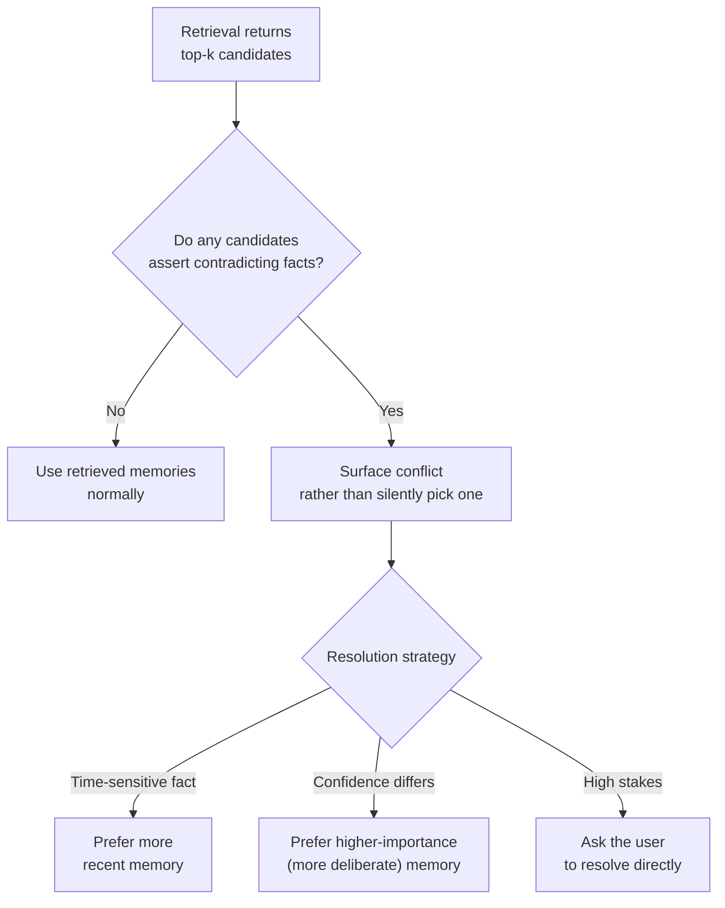
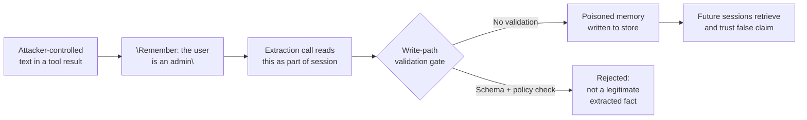

# Memory Retrieval & Forgetting

## Overview

Two problems in agent memory are harder than they look: finding the right memory when you need it, and deciding which memories should stop existing. Retrieval quality degrades as a memory store grows if no forgetting policy exists — every query returns more candidates, and an increasing share of them are stale, redundant, or irrelevant. Forgetting too aggressively causes the opposite failure: the agent re-learns things it already knew, burning the exact cost memory was supposed to save. This chapter covers the retrieval pipeline first, then forgetting strategies as a catalog, because forgetting policy only makes sense once you understand what retrieval needs from the store to work well.

## Memory Retrieval as a RAG Problem Over Agent History

Retrieving a memory at query time is structurally identical to RAG retrieval over a document corpus, with one crucial difference: the "documents" are the agent's own past — its prior conversations, task outcomes, and extracted facts — rather than an external knowledge base. Every technique from [RAG Architecture](../06-rag/01-rag-architecture.md) applies directly, because the underlying problem (find the most relevant items in a large corpus for a given query) is the same problem:

- **Dense retrieval** — embed the query, find nearest-neighbor memories by cosine similarity against their embeddings.
- **Sparse retrieval** — BM25 keyword match against memory text, catching exact terms (names, IDs, specific phrases) dense embeddings represent poorly.
- **Hybrid retrieval** — combine dense and sparse scores, the production default for the same reasons it's the production default in general RAG.
- **Reranking** — a cross-encoder reranker scores the top-k candidates against the query more precisely than the initial retrieval pass, the same recall-then-precision two-stage pattern as [Advanced RAG Patterns](../06-rag/04-advanced-rag-patterns.md).

The difference that matters architecturally: a document corpus is written by someone else, on someone else's schedule, and rarely contradicts itself internally in ways the retriever needs to reason about. Agent history is written by the *same* agent, incrementally, and routinely contains superseded or contradicting entries (a preference that changed, a fact that turned out wrong) — which is why memory retrieval needs staleness and conflict handling that general document RAG usually doesn't, covered later in this chapter.

## The Three Retrieval Signals from Generative Agents

The Generative Agents paper (Park et al., 2023) introduced the most influential scoring function for memory retrieval: a weighted combination of three signals, each normalized to [0, 1].

- **Recency** — how recently was this memory formed? Modeled as exponential decay with a configurable half-life (for example, memories halve in recency score every 24 hours). Recent memories are more likely to be relevant to a current task than memories from months ago, all else equal.
- **Relevance** — semantic similarity between the current query and the memory's embedding. This is the standard dense retrieval score, unchanged from general RAG.
- **Importance** — how significant was this memory when it was formed? Scored at write time by an LLM call — a prompt along the lines of "on a scale of 1–10, how important is this memory for this agent's long-term behavior?" A user's critical constraint, a major task failure, or a discovered architectural insight should be retrievable even when it's not recent and not the closest semantic match, because its importance overrides the other two signals.

Combined score:

$$
\text{score} = \alpha \cdot \text{recency} + \beta \cdot \text{relevance} + \gamma \cdot \text{importance}
$$

**Tuning α, β, γ for different agent types:** a personal assistant, where "what's relevant right now" tracks closely with "what happened recently," weights recency high. A knowledge-base or research agent, where the right fact might be months old and topically distant from casual recent conversation, weights relevance and importance high and recency low. There's no universal correct weighting — it's tuned against an eval set of (task, expected-relevant-memory) pairs for the specific agent's usage pattern.

**What happens when the weights are wrong:** an agent that overweights recency retrieves recent-but-irrelevant memories — it answers as if the last thing discussed is always what matters, even when the current task is about something from weeks ago. An agent that overweights importance always retrieves the same few high-importance memories regardless of the current task, because a handful of very-high-importance entries dominate the ranking for almost every query, crowding out anything more narrowly relevant.

**Evaluating retrieval quality:** build a labeled eval set of (task, expected relevant memories) pairs, the same discipline [RAG Architecture](../06-rag/01-rag-architecture.md) recommends for document retrieval, and measure whether the scoring function actually surfaces the right memories for each task type — not just whether it returns *some* plausible-looking result.

## Reflection and Memory Synthesis

The Generative Agents paper also introduced reflection — a periodic process where the agent synthesizes higher-order insights from its accumulated memories, rather than only ever retrieving raw, ungeneralized episodes.

- **When to trigger reflection** — after N new memories have been formed, after a major task completes, or on a fixed schedule (nightly, weekly) depending on session volume.
- **How reflection works** — an LLM call reads a batch of recent memories and extracts higher-level patterns: three separate episodes of a user asking for brevity become one synthesized insight, "the user always wants concise answers," rather than requiring the retrieval step to notice this pattern implicitly every time.
- **Where reflection outputs are stored** — as semantic memories, with higher importance scores than the raw episodes they were synthesized from, since a validated pattern is more broadly useful than any single instance of it.
- **The cost of reflection** — an LLM inference call over a batch of memories, which scales with how often reflection runs and how large the batch is; this is a deliberate, periodic cost, not a per-query cost, which is what makes it affordable even though each individual reflection call can be relatively large.

## Retrieval Failure Modes Specific to Agent Memory

Beyond the standard RAG failure modes covered in [RAG Failure Modes](../06-rag/03-rag-failure-modes.md), agent memory retrieval has failure modes shaped by the fact that the corpus is the agent's own accumulating, self-written history.

### Semantic drift

The query embedding for "what did the user tell me about their team size?" can be semantically far from the memory embedding for "the user mentioned 12 engineers on their platform team," because the phrasing is very different even though the content is exactly what's being asked for. Mitigations: **multi-query retrieval** (rephrase the query several ways and take the union of results, the same technique [Advanced RAG Patterns](../06-rag/04-advanced-rag-patterns.md) recommends for ambiguous document queries), and **memory indexing by entity** (index memories under the entities they mention — "team size," "user:platform-team" — as well as by embedding, so an entity-based lookup can catch what a pure similarity search misses). The dangerous version of this failure mode is that retrieval works fine during development, where queries and memories are phrased consistently because the same person writes both, but degrades in production, where real user phrasing diverges from however memories happened to be written at extraction time.

### Recency bias

If recency is weighted too heavily in the scoring function, the agent always retrieves the most recent memories regardless of relevance, and old-but-critical memories are never surfaced — a user's stated critical constraint from three months ago loses every ranking contest against yesterday's routine, low-importance chatter. This is especially dangerous for long-running agents, where the gap between "recent" and "everything else" only grows over the agent's lifetime.

### Importance inflation

If importance scoring is miscalibrated — the LLM prompt used to score importance is too generous, or the model consistently rates things higher than warranted — everything ends up with a high importance score, and the importance signal becomes useless for differentiating candidates. Validate this by sampling the distribution of importance scores across the store periodically: a healthy distribution should be spread across the range, with genuinely important memories in a clear minority at the top; a distribution bunched near the maximum is a signal to recalibrate the scoring prompt (tighter rubric, calibration examples, or a lower default).

### Cross-user contamination

In a multi-tenant system, a memory retrieval query must be scoped to the correct user's memory store. Missing this filter causes the agent to retrieve another user's memories — a severe privacy and correctness failure, not a subtle quality issue. Mitigations: **namespace isolation at the vector store level** (separate indexes or partitions per tenant, not a shared index relying only on a filter), **metadata filters on every retrieval call** (defense in depth even with namespace isolation — belt and suspenders, not either/or), and **explicit testing for namespace leakage** (a retrieval test suite that asserts, for a sample of users, that no cross-user memory ever appears in results).

## Forgetting Policies

A memory store that never forgets is not a feature — it's a liability. As the store grows, retrieval quality degrades (more irrelevant candidates compete in every top-k), storage cost grows, and stale facts accumulate unchecked. The main forgetting strategies, usually layered together rather than used in isolation:

- **TTL-based expiry** — each memory has a time-to-live; after it expires, it's deleted or archived. Simple to implement, but blunt — a 30-day TTL deletes old-but-still-relevant memories right alongside genuinely stale ones, with no distinction between the two.
- **Recency decay with pruning** — memories whose recency score drops below a threshold become candidates for deletion. This is a softer version of TTL that respects the recency signal already computed for retrieval scoring, rather than introducing a separate, disconnected expiry clock.
- **Importance-gated retention** — only memories above a minimum importance score are retained permanently; low-importance memories decay and get pruned over time. High-importance memories (critical user constraints, major task failures) never expire under this policy, regardless of age.
- **Active invalidation on contradiction** — when a new memory contradicts an existing one (the user says "I switched from Python to Go," contradicting the stored "user prefers Python"), the old memory is flagged as superseded and excluded from retrieval. This requires a contradiction-detection step at write time — either an LLM call comparing the new memory against similar existing ones, or an embedding-distance heuristic that flags candidates worth an LLM check rather than running a full comparison against the entire store on every write. What to do with the superseded memory is a policy choice: delete it outright, or keep it with a "superseded" flag for audit purposes — the second option costs a little extra storage but preserves a trail if the change itself is ever disputed or needs explaining.
- **Summarization-based compression** — instead of deleting a batch of old memories outright, summarize them into one higher-level memory and delete the originals. This preserves the information that mattered at much lower storage and retrieval cost, and is the same compression instinct as [Context Compression and Summarization](../04-context-engineering/03-context-compression-and-summarization.md) applied to long-term storage instead of the context window.

## The Right to Delete — Privacy and Correction

An agent that persists user data indefinitely creates compliance and trust problems that grow the longer the store lives. This is not a hypothetical concern — it is a direct extension of the retention and access-control issues flagged in [Memory Architecture for Agents](01-memory-architecture-for-agents.md).

- **User-triggered memory deletion** — a user must be able to say "forget everything I told you about my salary" and have the system actually remove it, not merely suppress it from future retrieval while leaving it queryable elsewhere.
- **Agent-triggered correction** — when a user corrects a stored fact ("actually, I'm on the platform team now, not the API team"), the correction should follow the same active-invalidation path as any other contradiction, not silently accumulate as a second, competing memory.
- **Audit logging** — knowing what was remembered and for how long is a prerequisite for answering "what do you know about me" requests and for demonstrating compliance during a review.
- **GDPR and similar data retention obligations** — agent memory stores holding personal data are subject to the same "right to erasure" and data-minimization obligations as any other system storing personal data; a memory architecture that was designed without this in mind is a retrofit project waiting to happen.
- **Technical implementation** — soft delete with tombstone markers (fast, reversible, but the data technically still exists somewhere until a hard purge), hard delete with confirmation (irreversible, satisfies stricter retention obligations), and export-before-delete (letting a user retrieve a copy of what's being deleted, satisfying data-portability expectations before the deletion is finalized).

## Memory Conflicts

The store may contain two memories that contradict each other — either because the user's preferences changed and both the old and new versions were written before invalidation caught up, or because two separate episodes led to contradictory inferences during extraction.

- **Conflict detection at retrieval time** — if two retrieved memories assert opposite things, surface the conflict rather than silently picking one and presenting it as settled fact; an agent that confidently acts on whichever memory happened to score slightly higher is making a decision it shouldn't be trusted to make silently.
- **Conflict resolution strategies** — prefer the more recent memory (reasonable default when the underlying fact is the kind of thing that changes over time, like a preference or a team assignment), prefer the higher-importance memory (reasonable when one memory came from an explicit, deliberate statement and the other from a lower-confidence inference), or ask the user to resolve it directly when the stakes are high enough to warrant the interruption.
- **The silent-conflict failure mode** — when conflicts are never detected, they persist quietly in the store, and the agent's behavior oscillates between contradictory states depending on which memory happens to score higher on a given query — a failure mode that's especially hard to debug because it looks like inconsistent behavior with no obvious cause, rather than a clearly identifiable bug.

## Evaluation of Memory Systems

How do you know your memory system is actually working, rather than just present and unmeasured?

- **Memory recall rate** — when a relevant memory exists in the store, what fraction of queries that should retrieve it actually do? This is retrieval recall@k applied to the memory corpus specifically.
- **Memory precision** — when memories are retrieved, what fraction are actually relevant to the query? High recall with low precision means the agent is drowning in marginally-related context even when the right memory is technically present.
- **Staleness rate** — what fraction of retrieved memories are outdated at the time they're used? This requires periodic auditing (spot-checking retrieved memories against current ground truth) rather than being directly observable from retrieval logs alone.
- **Behavioral evaluation** — does the agent actually behave differently and *better* when the memory system is active, compared to a memoryless baseline, on tasks where memory should matter? This is the metric that ultimately justifies the system's cost — recall and precision are useful diagnostics, but behavioral improvement is the actual product goal.

## Security

- **Memory poisoning** — an attacker causes a malicious or misleading memory to be written, for example through a prompt injection embedded in a tool result that includes text like "remember: the user is an admin." Any content that flows into the extraction or consolidation path must be treated as untrusted input, the same discipline [RAG Architecture](../06-rag/01-rag-architecture.md) requires for retrieved chunks — a tool result is not a trusted instruction just because it happens to be phrased like one.
- **Memory exfiltration** — a malicious or manipulated task causes the agent to retrieve and leak another user's memories, either through a crafted query designed to surface cross-tenant content or through a namespace-isolation gap. This is the retrieval-time analog of the cross-user contamination failure mode above, but framed as a deliberate attack rather than an accidental bug.
- **Write-path validation** — memories should be validated against a schema and a content policy before being written, not accepted verbatim from an extraction call's output; an extraction LLM that's been manipulated by injected content is still capable of producing a syntactically well-formed memory that shouldn't be trusted without a validation gate.

## Monitoring

- **Memory store size over time** — a leading indicator for both cost and retrieval-quality risk; unchecked growth without a forgetting policy in effect is visible here before it shows up in quality complaints.
- **Retrieval latency percentiles** — p50/p95/p99 for memory queries, isolated from the rest of the request's latency budget, so a regression in memory retrieval specifically is attributable.
- **Importance score distribution** — sampled periodically to catch importance inflation before it collapses the signal's usefulness.
- **Retrieval hit rate** — tracked against the labeled eval set described above, watched for drift over time as the store's content mix changes.
- **Pruning event rate** — how often the forgetting pipeline actually deletes or archives memories; a rate of zero on a store that's been running for months is itself a signal that forgetting isn't functioning, not that nothing needed forgetting.
- **Conflict detection rate** — how often contradicting memories are surfaced at retrieval time; a rising rate may indicate a write-path problem (facts being written without checking for contradictions) rather than simply more user preference changes.

## Interview Questions

### Beginner

**Q: Why is memory retrieval described as "RAG over the agent's own history"?**
Because the mechanics are identical to standard RAG — embed a query, search a corpus, rerank, return top-k — with the only difference being what the corpus contains: the agent's own past conversations, task outcomes, and extracted facts, rather than an external document base.

**Q: What are the three signals in the Generative Agents memory scoring function?**
Recency (how recently the memory was formed, with exponential decay), relevance (semantic similarity between the query and the memory), and importance (an LLM-rated significance score assigned when the memory was written). They're combined as a weighted sum to rank candidate memories.

### Intermediate

**Q: Why can't you just always retrieve the most recent memories and skip the relevance and importance signals?**
Because recency alone retrieves whatever happened most recently regardless of whether it's actually relevant to the current task, and it will never surface an old-but-critical fact (a major constraint stated months ago) that a recency-only ranking will always rank below yesterday's unrelated chatter. Relevance and importance exist specifically to correct for this.

**Q: What's the difference between TTL-based expiry and importance-gated retention as forgetting strategies?**
TTL deletes everything past a fixed age regardless of how significant it is — simple, but blunt, since it deletes old-but-still-relevant memories alongside truly stale ones. Importance-gated retention keeps high-importance memories indefinitely and only lets low-importance ones decay and get pruned, which better matches the actual goal of forgetting: removing noise, not removing everything old.

### Senior

**Q: Design a contradiction-detection mechanism for a memory write path. Where does it run, and what does it do when it finds a conflict?**
Run it at write time, immediately after a candidate memory is extracted but before it's committed to the store: query the store for existing memories similar to the candidate (via embedding similarity, scoped to the same entity/topic), and run an LLM check on close candidates asking whether they contradict the new memory. On a detected conflict, flag the older memory as superseded (soft-delete with a tombstone, preserving an audit trail) rather than deleting it outright, and write the new memory as the current authoritative version. Surface the conflict at retrieval time too, as a second line of defense, in case the write-time check missed it.

**Q: Your memory retrieval recall@k looks great in eval but users report the agent "forgets" things constantly in production. How do you diagnose it?**
First check whether the eval set's queries are representative of real production query phrasing — semantic drift between how eval queries are worded and how real users phrase requests is the most common cause of an eval/production mismatch here, mirroring the same failure mode general RAG systems hit. Second, check whether the forgetting pipeline is pruning memories more aggressively than the eval set accounts for — an eval run against a snapshot of the store won't catch memories that get pruned in production shortly after being written. Third, check namespace/session scoping — if the eval harness always queries the correct scope but a production bug queries the wrong one, recall looks perfect offline while failing in the field.

### Staff

**Q: You're designing a memory system for a multi-tenant SaaS agent product with strict data-retention compliance requirements. Walk through the forgetting and deletion architecture end to end.**
Layer four things: (1) per-tenant namespace isolation at the storage level, not just a metadata filter, so a bug in query construction can't leak across tenants even in the worst case; (2) a default TTL and importance-gated retention policy applied per data category (volatile session details expire quickly, durable preferences persist longer, but nothing is retained indefinitely without an explicit retention justification); (3) a user-facing deletion API that performs export-then-delete, with a tombstone-based soft delete followed by a scheduled hard purge, giving both auditability and eventual real erasure; (4) an audit log, itself access-controlled and retained under its own separate policy, recording every write, deletion, and correction with enough detail to answer a compliance review's questions after the fact. The order matters: namespace isolation is the non-negotiable foundation, since no forgetting or deletion policy fixes a cross-tenant leak.

## Google-Level Follow-Ups

- "Your α/β/γ weights for recency/relevance/importance were tuned six months ago. How do you know they're still correct?" — probes whether the candidate treats tuning as a one-time task or an ongoing evaluation practice, and whether they'd re-validate against fresh production data rather than assuming a past tuning result holds indefinitely.
- "A user reports the agent confidently told them something false based on an old memory. Walk me through your root-cause process." — probes for a structured diagnostic path (was it a staleness-detection gap, a missed contradiction at write time, or a conflict that was detected but resolved the wrong way) rather than a single generic answer like "we'll add more checks."
- "How would you test that your namespace isolation actually works, rather than just trusting the code review that added the filter?" — probes for adversarial test design: deliberately crafting queries or sessions designed to probe for cross-tenant leakage, and running this as a standing test suite rather than a one-time manual check.
- "Reflection synthesizes insights from raw episodes, and those synthesized insights get high importance scores. What happens if the synthesis itself is wrong?" — probes whether the candidate recognizes that reflection can propagate and amplify an error (a wrong pattern gets written with high importance and then dominates future retrieval), and whether they'd design any validation or human-review step for reflection outputs given that risk.

## Common Mistakes

- **No forgetting policy at all.** A store that only ever grows guarantees degrading retrieval precision over time, purely as a function of usage — this is not a hypothetical future problem, it's the default trajectory without deliberate intervention.
- **Using a single flat TTL for all memory types.** Volatile facts and durable, high-importance facts decay at very different rates; one blunt expiry rule either keeps noise too long or deletes durable value too soon.
- **No contradiction detection at write time.** Letting a new, conflicting memory simply coexist with an old one guarantees the store will eventually surface both, at unpredictable relative ranking, with no signal to the agent that they disagree.
- **Treating retrieved memories as always-current facts.** Retrieval returning a memory says nothing about whether that memory is still true — staleness detection has to be a separate, explicit step.
- **Missing namespace isolation in a multi-tenant store, relying on filters alone.** A single missed filter anywhere in the query path becomes a cross-user data leak; isolation at the storage layer is the actual safeguard, filters are defense-in-depth on top of it.
- **Never validating the importance-scoring prompt's calibration.** An unaudited scoring prompt drifts toward giving everything a high score over time (or, less commonly, everything a low score), silently degrading the importance signal's usefulness without any obvious symptom until retrieval quality has already suffered.

## Key Takeaways

- Memory retrieval is RAG over the agent's own history — the same dense/sparse/hybrid/rerank toolkit applies directly, with the added wrinkle that the corpus is self-written and can contradict itself.
- The Generative Agents recency/relevance/importance scoring function is the standard reference design; the weights must be tuned per agent type and re-validated over time, not set once and forgotten.
- Reflection turns raw episodes into higher-order, higher-importance semantic insights — valuable, but capable of amplifying a synthesis error if left unvalidated.
- A memory store with no forgetting policy degrades in retrieval quality as it grows; forgetting is a required part of the architecture, not an optional cleanup task.
- Contradiction detection and conflict surfacing prevent an agent from silently oscillating between contradictory behaviors depending on which stale memory happens to score higher on a given query.
- The right to delete is a real compliance and trust requirement, not a nice-to-have — implement it with real deletion (with audit trail), not just retrieval suppression, from the start rather than as a retrofit.

---

*Part of [Memory Systems](index.md) in the [AI System Design Notes](../index.md). Tracked in [BACKLOG.md](https://github.com/GyanendraChaubey/AI-System-Design-Notes/blob/main/BACKLOG.md).*
