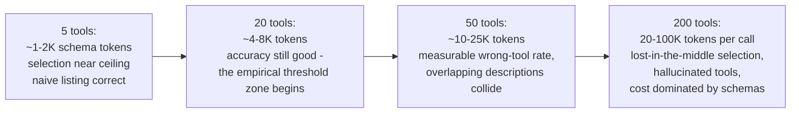
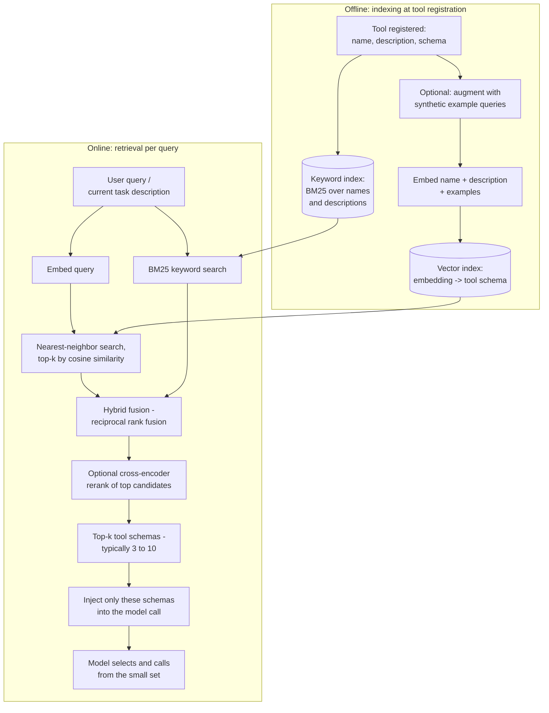
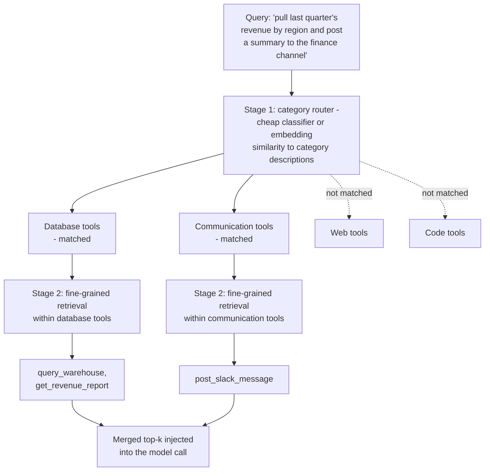
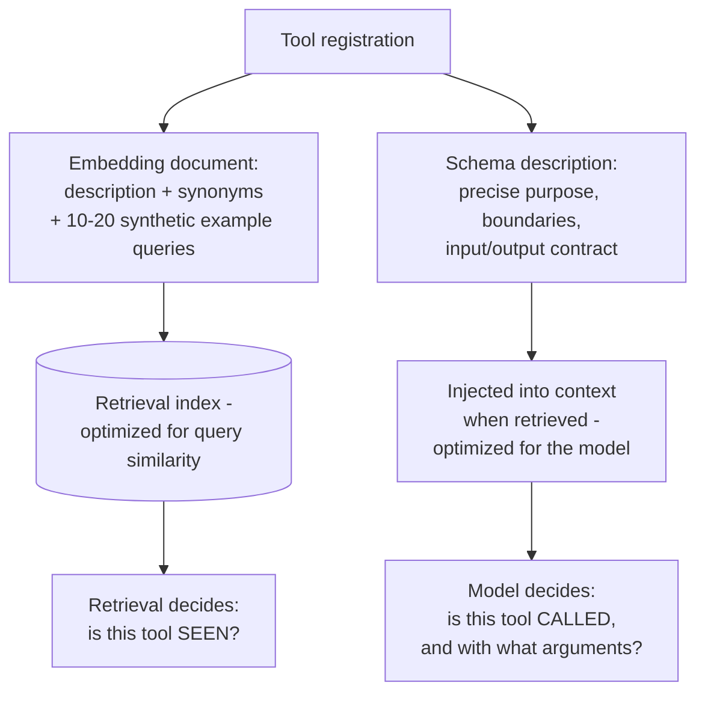
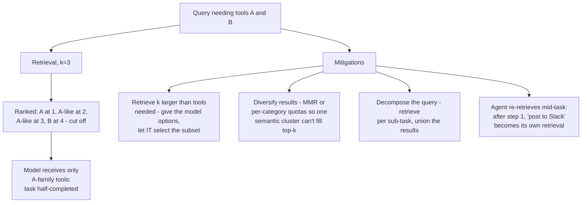
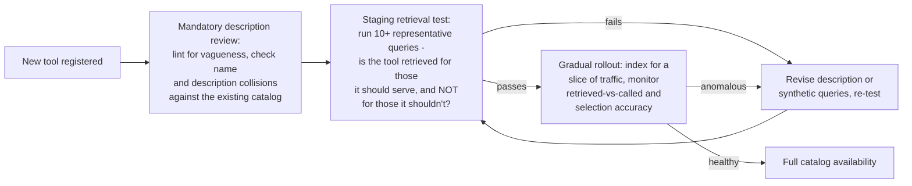
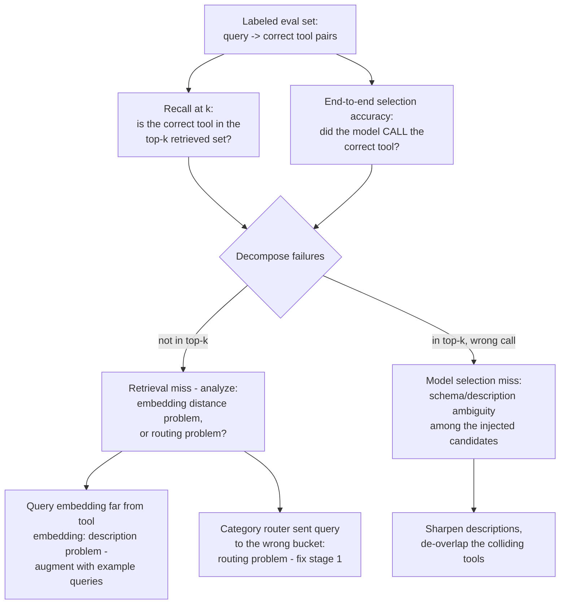
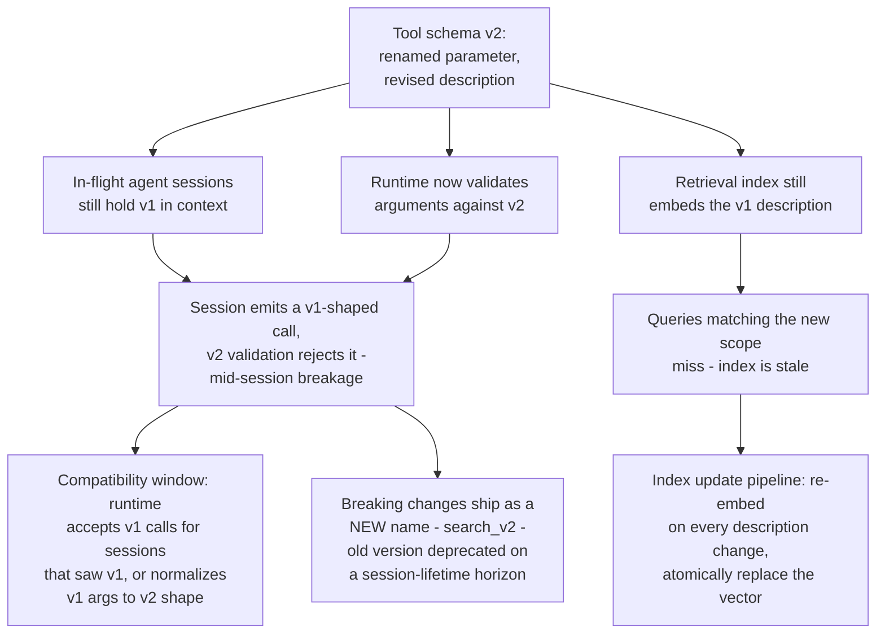
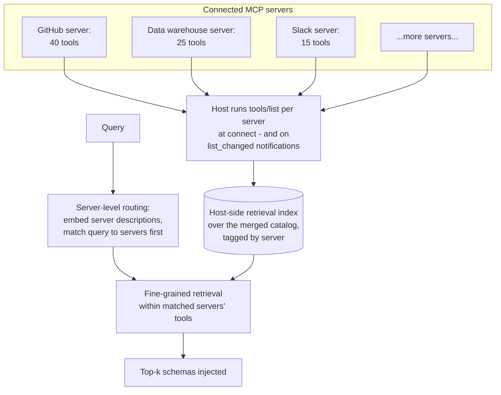

# Tool Selection at Scale

## Overview

A system with 5 tools lists them all in the prompt and the model picks correctly almost every time. A production platform with 200 tools — a company's full internal API surface, or a product exposing hundreds of integrations — cannot do that: the schemas alone would consume tens of thousands of tokens per call, selection accuracy degrades long before the context window fills, and the model starts calling tools that don't exist. The fix is to stop treating the tool list as a prompt constant and start treating it as a **corpus**: index tool descriptions offline, retrieve the few tools relevant to each query at runtime, and inject only those. This is structurally identical to [RAG](../06-rag/01-rag-architecture.md) — same embedding pipeline, same hybrid search, same reranking, same recall metrics — with tool schemas as the documents and "which tool does the model need" as the retrieval task. And like RAG, the retrieval layer imports RAG's failure modes: the right tool can now be *in the catalog but not retrieved*, description quality becomes retrieval quality, and you need metrics to know which is failing.

This chapter covers the scaling problem precisely, the retrieval architecture that solves it, and the quality and measurement work that keeps it solved. It builds directly on [Function Calling Architecture](01-function-calling-architecture.md) (the per-call schema cost this chapter amortizes) and connects to [MCP](02-model-context-protocol.md) (which gives you large catalogs via dynamic discovery — and thereby hands you this exact problem).

## Why Tool-List-in-Context Breaks Down

Injecting every tool schema into the system prompt is the default, and for small tool sets it is correct — simple, cacheable, no moving parts. As the count grows, three independent failure modes compound:

**Context cost.** Each schema — name, description, parameter definitions — runs 100–500 tokens. At 200 tools that is 20,000–100,000 tokens of schema on *every* call, before the user's query or one turn of history. In a 20-step agent session the schemas are resent every step; even with prompt caching absorbing much of the raw price, the schemas occupy context the conversation needs, and at current API pricing the uncached case is a dominant per-call line item. This is the fixed tax from [Chapter 1's cost model](01-function-calling-architecture.md), scaled to where it dominates the [context budget](../04-context-engineering/02-context-window-budgeting.md).

**Selection accuracy degradation.** Models are not equally good at choosing among 200 options as among 5. The "lost in the middle" effect applies to tool schemas exactly as it applies to retrieved documents: schemas near the beginning and end of the tool list are selected more reliably than schemas buried in the middle, so a tool's *position in the list* becomes a hidden variable in system behavior. Worse, large catalogs inevitably contain near-duplicates — three teams' `search_*` tools with overlapping descriptions — and disambiguating among semantically close options is precisely what degrades first as the option count grows.

**Hallucinated tools.** Confronted with a very long tool list, models sometimes emit calls to tools that are not in it — blending a tool remembered from training data (`web_search`, `run_python`) or from a *previous session's* tool set with the current list, or mutating a real name into a plausible sibling (`get_user_info` when the list has `get_user_profile`). Every hallucinated call costs a full round-trip through the [validation feedback loop](01-function-calling-architecture.md) before the model can correct itself, and the rate rises with list length.

The empirical threshold: naive listing starts degrading noticeably somewhere around **20–50 tools**, varying by model, by schema verbosity, and by how semantically distinct the tools are (50 clearly-distinct tools outperform 25 overlapping ones). The practical rule is not "never list more than N" but "beyond a few dozen, measure selection accuracy — and when it dips, move to retrieval."

## Tool Retrieval: RAG Over the Tool Catalog

The solution is to stop injecting all tools and instead retrieve, per query, the small subset most likely to be needed. The architecture is document RAG with the corpus swapped:

**Offline indexing.** At tool registration time, embed the tool's name plus description (and, as covered below, optionally example queries it should handle) with an embedding model, and store the vector in a vector database alongside the tool's full schema. The index updates on the tool lifecycle — register, update, retire — not per query, so it's cheap: even a thousand-tool catalog is a trivially small corpus by RAG standards.

**Online retrieval.** At query time, embed the user's query (or, in an agent, the current task description — which is often a better retrieval key than the raw user message, because it names the *action* needed), run nearest-neighbor search against the tool index, and take the top-k by cosine similarity. Inject only those k schemas into the model call. k is a tuning parameter with a clear tradeoff: larger k costs tokens and re-dilutes selection; smaller k risks excluding the needed tool. Production systems typically land between 3 and 10 — small enough that the model's in-context selection is back in its high-accuracy regime.

**Hybrid retrieval.** Pure embedding search has the same known weakness here as in document RAG: exact identifiers. A query mentioning "BigQuery" should strongly prefer the tool whose name contains `bigquery`, and dense embeddings can rank a semantically-adjacent generic database tool above it. Combine semantic search with keyword search (BM25 over tool names and descriptions) and fuse the rankings — reciprocal rank fusion is the standard merge. This is the identical hybrid pattern from [Advanced RAG Patterns](../06-rag/04-advanced-rag-patterns.md), and it matters *more* for tools than for prose, because tool names are exactly the kind of rare exact-match token dense retrieval fumbles.

**Reranking.** Optionally pass the fused top candidates (say, 20) through a cross-encoder reranker that scores query–tool pairs jointly, and keep the top k. Worth it when the catalog has many near-neighbors — five overlapping search tools — where bi-encoder similarity can't discriminate; skippable when tools are semantically well-separated. The tool corpus is small, so reranking latency (one forward pass per candidate over short texts) is modest; the budget question below still applies.

**One cache note.** Naive per-query retrieval swaps the tool set on every request, which invalidates the prompt cache prefix on every request — potentially giving back much of the token saving. Mitigations: pin a small stable core of always-useful tools (cacheable), append retrieved tools after the stable prefix, and prefer append-only tool discovery within a session over swap-per-turn. Provider-native tool search (deferred tool loading plus a search tool the model calls) is designed around exactly this — discovered schemas are *appended*, preserving the cache.

## Hierarchical Tool Routing

For very large catalogs — hundreds to thousands of tools — flat vector search alone starts to strain: it may return too many plausible candidates, and it misses structured, categorical distinctions that the organization already knows ("this is a *database* question, so nothing in the communications category is relevant"). Hierarchical routing narrows first, then retrieves.

**Category-first routing.** Organize the catalog into categories (database, web, communication, code, HR, deploy…), each with its own description. The query is first classified into one or more categories, and retrieval runs only within the matched ones. Note the query above matches *two* categories — routers must support multi-label matching, or multi-tool queries break at stage 1.

**The two-stage architecture.** Stage 1 is fast and cheap — embedding similarity between the query and category descriptions, or a small classifier model — and its only job is to cut the candidate space by an order of magnitude. Stage 2 is the full retrieval pipeline from the previous section, scoped to the surviving categories. The design mirrors retrieval-then-rerank: a cheap high-recall filter feeding an expensive high-precision stage. The failure mode it introduces is also familiar: a stage-1 misroute is unrecoverable — no stage-2 search inside the wrong category finds the right tool — so the router must be tuned for recall (route to *every* plausible category) and monitored separately from retrieval.

**Hardcoded routing for known patterns.** Some query types are deterministic: any query containing an order-ID pattern goes to the order-lookup tool; anything from the billing-support entry point gets the billing tool set. For high-frequency, high-certainty patterns, a regex or rule beats running retrieval — zero latency, zero retrieval-miss risk, perfectly predictable. The boundary discipline: hardcoded routes are appropriate when the trigger is *syntactically* recognizable (ID formats, source channels, explicit commands) and the mapping is genuinely one-to-one; they become a maintenance burden when they try to capture *semantic* patterns in accumulating rule piles — fifty regexes approximating "sounds like a refund question" is a worse, unmaintained retrieval system. Rules for syntax, retrieval for semantics, and every hardcoded route gets an owner and a hit-rate metric so dead rules are visible.

## The Tool Description Quality Problem

Retrieval accuracy is bounded by description quality, absolutely. A tool described as "does stuff with databases" will not be retrieved for the queries it should handle — not because the embedding model failed, but because the description genuinely contains no signal about when the tool is needed. In Chapter 1 the description had one reader (the model, deciding how to call); with retrieval it acquires a second (the embedding model, deciding whether the tool is even seen). These audiences want different things.

**What a high-quality description contains** — now serving both readers: what the tool does; when to use it *and when not to* ("read-only revenue metrics; not for raw event queries — use `query_events`"); what inputs and outputs look like; and two or three example queries it would handle. The examples are dual-purpose: they teach the model the calling pattern *and* they put query-shaped text into the embedded document, which is exactly what query-to-description retrieval needs.

**The description-as-retrieval-document problem.** The embedding side benefits from keyword density, name-dropping of systems and synonyms, and example queries — text that *sounds like queries*. The LLM side benefits from precise natural-language statements of purpose, constraints, and boundaries — text that *reads like documentation*. These goals are not always aligned: stuffing retrieval keywords bloats the token cost every time the tool is injected and can muddy the model's understanding of boundaries; a crisp minimal description underperforms in retrieval. The clean resolution is to stop forcing one string to do both jobs: index an *embedding document* (description + synonyms + example queries) for retrieval, and inject the *clean schema description* for the model. The two are linked at registration and updated together.

**Synthetic query augmentation.** For each tool, generate 10–20 example queries that should route to it — an LLM does this well from the description plus the schema — review them, and embed them alongside (or instead of) the description. Retrieval now matches query-to-query rather than query-to-documentation, which substantially improves recall for tools with short or jargon-heavy technical descriptions, whose doc-style text lives far from user phrasing in embedding space. (This is the tool-catalog version of HyDE-style query/document space bridging from [Advanced RAG Patterns](../06-rag/04-advanced-rag-patterns.md), applied at index time.) Refresh the synthetic set when the tool's scope changes, and — better — fold in *real* queries that correctly routed to the tool once production data accumulates.

**Monitoring description quality.** Two production signals identify bad descriptions without anyone reading them:

- **Retrieved-but-never-called:** the tool keeps appearing in top-k, but the model — seeing the actual schema — never picks it. The embedding document over-promises relative to the tool's real capability; it's attracting queries it can't serve (and burning injection tokens every time). Tighten the embedding document.
- **Relevant-but-never-retrieved:** eval queries (or user complaints) show tasks the tool should handle where it never surfaced in top-k. The description under-sells; it lacks the vocabulary of its own use cases. Augment with example queries.

Both metrics come free from logging (query, retrieved set, called tool) — the same telemetry the measurement section below formalizes.

## Handling Multi-Tool Queries

A single query may need several tools — "pull the revenue numbers *and* post them to Slack" needs a database tool and a messaging tool. Retrieval tuned for single-tool queries fails here in a specific way: the database tool dominates the similarity ranking (most of the query is about revenue), and the messaging tool — needed, in the catalog, correctly described — lands just below the top-k cutoff. The agent then completes half the task, or improvises badly.

The mitigations stack. First, **over-retrieve deliberately**: k should exceed the number of tools you expect any query to need — retrieval's job is a good *candidate set*, and final selection belongs to the model, which sees full schemas and the whole query. Second, **diversify**: maximal marginal relevance or per-category quotas prevent one semantic cluster (three near-identical database tools) from occupying the entire top-k while the second *category* of need goes unrepresented. Third, **decompose**: split the query into sub-tasks (an LLM call, or the agent's own plan), retrieve per sub-task, and union — the direct analog of multi-query RAG-fusion. Fourth — and most robust in agentic systems — **let retrieval re-run mid-task**: after the agent finishes the revenue query, its next-step description ("post this summary to the finance channel") is a clean single-tool retrieval on its own. In an [agent loop](../09-agents/01-agent-fundamentals-and-the-agent-loop.md), tool retrieval doesn't have to be a one-shot decision at turn one; append-only re-retrieval per step both fixes multi-tool coverage and preserves the prompt cache.

## The Cold Start Problem for New Tools

A newly registered tool has no production history: no real queries to validate its description against, no called/retrieved telemetry, nothing but the author's claims. Shipping it straight into the retrieval index means discovering its description problems through user-facing failures.

Three gates. **Mandatory review** before the tool is retrievable in production: a human (or a linter plus a human) checks the description against the quality bar, and — critically — against the *existing catalog* for collisions: a new tool whose description overlaps an incumbent's will split retrieval traffic between them, degrading both. This mirrors the [MCP-side registration review](02-model-context-protocol.md), which checks the same artifact for security; here it's checked for retrievability. **Staging retrieval test:** run a small suite of representative queries — the tool's own synthetic queries plus a sample of the general query distribution — and verify the new tool is retrieved for what it should serve and, just as important, *doesn't* newly hijack queries that belong to existing tools (a regression test for the catalog, not just the newcomer). **Gradual rollout:** expose the tool to a traffic slice first, watch the retrieved-but-never-called signal (the fastest indicator of an over-broad description) and overall selection accuracy, then open it to full traffic. The whole pipeline is cheap — minutes of compute — and converts description problems from production incidents into registration-time feedback.

## Measuring Tool Selection Accuracy

Adding retrieval adds a new way to fail — *the right tool existed but wasn't retrieved* — and that failure is silent: no error, no exception, just an agent doing worse. Without measurement, you cannot distinguish it from model failure, and you cannot tune k, the embedding model, or descriptions with any confidence.

**Recall@k** is the primary retrieval metric: over a labeled eval set of (query, correct tool) pairs, the fraction of queries whose correct tool appears in the top-k retrieved set. This bounds everything downstream — the model cannot call a tool it never saw — so it plays exactly the role retrieval recall plays in RAG evaluation. Track it per k (recall@3 vs @5 vs @10 tells you where to set the cutoff) and per tool (aggregate recall hides the three tools whose descriptions are broken). Multi-tool queries need the set version: all required tools in top-k.

**Selection accuracy** is the end-to-end metric: the fraction of queries where the model actually *called* the correct tool. It compounds retrieval accuracy with the model's in-context choice, and the gap between it and recall@k is diagnostic — high recall with low selection accuracy means retrieval is delivering the right tool but the model can't distinguish it from the co-retrieved near-neighbors: a schema-ambiguity problem, not a retrieval problem.

**Retrieval miss analysis.** When recall@k fails, split the cause: was the correct tool's embedding simply far from the query's (a description problem — fix with synthetic query augmentation), or, in hierarchical setups, did the category router send the query to the wrong bucket entirely (a routing problem — no amount of description work inside the wrong category helps)? Logging the stage-1 decision separately from stage-2 rankings makes this a query, not an investigation.

**Latency budget.** Retrieval adds 20–200ms per tool-selection event — embedding call, ANN search, optional rerank. Against an LLM turn of 800ms–several seconds this is usually acceptable, but profile it and set an explicit budget: the reranker is the usual overage (as in document RAG, it's the first thing to make conditional or distill), and hierarchical stage-1 should be near-free. The structural consolation: replacing 20–100K tokens of schema with 2–5K shortens prefill, so retrieval often *pays back* wall-clock time at large catalog sizes.

## Tool Versioning and Schema Evolution

Tool schemas change — a field added, a parameter renamed, a description sharpened. In a retrieval architecture a schema change lands in three places, and each has its own consistency problem:

**Don't break in-flight sessions.** An agent session that received `search` v1's schema at step 3 will emit v1-shaped calls at step 15; if the runtime meanwhile validates against v2, the session breaks through no fault of the model's. Two disciplines: for *compatible* changes (new optional field, description edit), the runtime accepts both shapes during a window and normalizes; for *breaking* changes (renamed or newly-required parameters, changed semantics), ship a new tool name — `search_v2` — and deprecate the old one on a horizon longer than any session lifetime, exactly the version-the-name discipline from [Tool Use Architecture](../09-agents/03-tool-use-architecture.md)'s registry design. The retrieval layer adds a subtlety: while both versions exist, both are retrievable — either suppress v1 from retrieval for *new* sessions immediately (old sessions already hold it) or the two versions will split ranking mass and confuse selection.

**Keep the index in lockstep.** Every description change must trigger re-embedding and an atomic vector replacement, driven by the registry as the single source of truth (an event or hook on tool-update, not a nightly batch — a stale index silently misroutes for hours otherwise). Re-run the staging retrieval test on description changes, too: a "clarified" description that tanks the tool's recall is a regression the diff review won't catch but ten queries will. And when the *embedding model* itself changes, the whole catalog re-embeds — small corpus, cheap operation, but it must be atomic (blue/green the index) because mixed-model vectors in one index produce garbage rankings.

## Integration with MCP at Scale

[MCP](02-model-context-protocol.md) and tool retrieval meet naturally: MCP's `tools/list` gives you dynamic discovery of what tools exist — which is precisely how a host ends up with a 300-tool catalog it can't inject wholesale. MCP gives you the catalog; you still need retrieval when the catalog is large. The protocol standardizes *supply*; selection remains the host's problem.

Three specifics of the MCP-flavored version:

**Indexing the discovered catalog.** The host embeds and indexes tool definitions as they arrive from `tools/list`, tagged by origin server, and — because MCP tools can change mid-lifecycle via `list_changed` — the index update pipeline from the previous section triggers on those notifications, not just on first connect. The description-quality problem gets *harder* here: descriptions are written by server authors you don't control, so the synthetic-query augmentation technique becomes the host's main lever — you can't rewrite the server's description, but you can build a better embedding document around it.

**Server-level routing.** MCP servers are natural categories — the GitHub server's 40 tools are all GitHub-shaped — so hierarchical routing falls out for free: stage 1 matches the query against *server* descriptions, stage 2 retrieves within the matched servers' tools. This also composes with security scoping: a query routed only to the data-warehouse server never has communications tools in context at all, which shrinks both the token bill and the cross-server [confused-deputy surface](02-model-context-protocol.md).

**Initialization latency.** Listing tools from every connected server at session start is serial startup cost — one slow server delays first useful token for the whole session. Mitigations: parallelize connect-and-list across servers, cache each server's tool list keyed by the definition hash (which the rug-pull pinning already computes — cache hit means skip the list call), and lazily connect servers the session's first retrieval doesn't implicate. Monitor per-server list latency as a first-class metric; it is the MCP-specific cold-start cost.

## Interview Questions

### Beginner

**Q: Why can't a system with 200 tools just put all their schemas in the system prompt?**
Three compounding reasons. Cost: at 100–500 tokens per schema, 200 tools is 20,000–100,000 tokens on every call — resent every step of an agent session — before any actual conversation. Accuracy: models select less reliably among 200 options than among 5; the lost-in-the-middle effect means tools buried mid-list get under-selected, and near-duplicate tools become indistinguishable. Hallucination: shown a very long list, models more often call tools that aren't on it — remembered from training or mutated from real names — each costing a wasted correction round-trip. Degradation becomes noticeable around 20–50 tools depending on model and schema verbosity, which is why large catalogs move to retrieval.

**Q: Describe the tool retrieval architecture at a high level. What existing pattern is it?**
It's RAG with tool schemas as the corpus. Offline, at registration: embed each tool's name and description (plus example queries) and store the vectors in an index alongside the schemas. Online, per query: embed the query, run nearest-neighbor search (ideally hybrid — dense plus BM25 keyword — fused), optionally rerank, take the top-k tools, and inject only those k schemas into the model call. The model then selects among 3–10 candidates instead of 200, back in its high-accuracy regime, and the per-call schema cost drops by an order of magnitude.

### Intermediate

**Q: A tool is in the catalog and correctly implemented, but users' queries that need it never trigger it. Walk through your diagnosis.**
Split the pipeline: was the tool *retrieved* and not called, or *never retrieved*? Logs of (query, top-k set, called tool) answer this immediately. If it's retrieved but not called, the failure is in-context selection — the model sees the schema and picks a competitor — so look for overlapping descriptions among co-retrieved tools and sharpen boundaries ("use X for...; do not use for..., use Y"). If it's never retrieved, it's a recall failure: check whether the query embedding is simply far from the tool's embedding document — typical for terse, jargon-heavy descriptions that don't resemble user phrasing — and fix with synthetic query augmentation (embed 10–20 queries the tool should handle, so matching becomes query-to-query). In a hierarchical setup, also check stage 1: if the category router sent the query to the wrong bucket, no description work inside the right tool will help — that's a routing fix. The general principle: recall@k and selection accuracy are separate metrics, and the gap between them tells you which layer to fix.

**Q: The query "get last month's signups and email the growth team a summary" keeps resulting in the agent only doing the first half. Why, and what do you change?**
Classic multi-tool retrieval failure: the query's mass is about signups/data, so the analytics tools dominate similarity ranking and the email tool falls below the top-k cutoff — it's in the catalog, correctly described, and invisible. Fixes stack: raise k beyond the expected tools-per-query so the candidate set has room (the model does final selection anyway); diversify the top-k (MMR or per-category quotas) so one semantic cluster can't fill every slot; decompose the query and retrieve per sub-task, unioning results; and — most robust in an agent — re-run retrieval per step, so after the data step completes, "email the growth team" becomes its own clean single-tool retrieval. Also add this query shape to the eval set with the *set* version of recall@k (all required tools present), so the regression is measurable.

### Senior

**Q: Design the metrics and eval infrastructure for a 300-tool retrieval system. What do you track, and what does each metric decision drive?**
Foundation: a labeled eval set of (query → correct tool, or correct tool *set*) pairs, sourced from real traffic labeling plus each tool's reviewed synthetic queries, refreshed as the query mix drifts. Retrieval layer: recall@k over that set — per k (drives where to set the cutoff), per tool (aggregate recall hides the handful of broken descriptions), and set-recall for multi-tool queries. End-to-end: selection accuracy — did the model call the right tool — whose gap versus recall@k localizes failures to retrieval (not in top-k) or in-context selection (in top-k, wrong call), which drive completely different fixes (description/embedding work vs. de-overlapping schemas). Production signals requiring no labels: retrieved-but-never-called rate per tool (over-broad description attracting queries it can't serve) and never-retrieved rate for live tools (under-sold description) — these run continuously and feed the description-review queue. Operational: retrieval latency p50/p99 against an explicit budget (rerank is the usual overage), stage-1 routing accuracy tracked separately in hierarchical setups (a stage-1 miss is unrecoverable downstream), and index freshness lag from tool-update to re-embedded vector. Gate every registration and every description change on the staging retrieval test, so the eval set is a release check, not just a dashboard.

**Q: You need to rename a required parameter on a heavily-used tool. Walk through shipping this without breaking anything.**
This is a breaking change, so it ships as a new tool version, not an edit. Register `search_v2` with the new schema; run it through the cold-start pipeline (description review, staging retrieval test — including checking it doesn't cannibalize queries belonging to *other* tools). Suppress v1 from retrieval for *new* sessions at cutover — in-flight sessions that already hold v1's schema in context keep working, because the runtime keeps accepting and executing v1-shaped calls for the deprecation window, sized longer than the maximum session lifetime. Two versions must not be simultaneously retrievable for new traffic, or they split ranking mass and the model faces a confusing near-duplicate pair. The index update is event-driven off the registry: v2's embedding document goes live atomically; v1's vector is removed from the new-session index immediately even though its runtime handler survives the window. Monitor v1 call volume to confirm drain before deleting the handler, and watch v2's retrieved-vs-called and recall on the eval set through the rollout. The renamed field also needs the [validation error path](01-function-calling-architecture.md) to be helpful: a model that emits the old field name against v2 should get "unknown field `q`; did you mean `query`" — cheap insurance during the transition.

### Staff

**Q: You're the architect for an agent platform where 30 teams contribute tools — currently 400 and growing — consumed by agents across multiple products, with some tools arriving via MCP servers. Design the end-to-end tool selection architecture and the governance around it.**
Architecture in layers. *Supply:* a single registry as source of truth — first-party tools registered directly, MCP-supplied tools ingested via `tools/list` with definitions hashed and pinned (security review per the [MCP trust model](02-model-context-protocol.md), retrievability review per this chapter — same artifact, two checklists). *Selection:* hierarchical routing with team/domain (and MCP server) as the natural category layer — stage 1 routes the query to domains, stage 2 runs hybrid retrieval (dense + BM25, fused, with diversity) within them; hardcoded routes only for syntactic triggers (ID patterns, source channels), each with an owner and hit-rate metric. Separate embedding documents (description + synthetic queries, host-augmentable for MCP tools whose descriptions we don't control) from injected schema descriptions. Per-session, retrieval is append-only across steps to preserve prompt cache, with a small pinned core tool set. *Lifecycle:* mandatory registration gates — description lint, catalog-collision check against all 400 incumbents, staging retrieval test, canary rollout — plus event-driven re-embedding and the versioning discipline (breaking changes are new names; retrieval cutover is atomic; runtime compatibility windows outlive sessions). *Measurement:* the full metric stack (recall@k per tool, selection accuracy, retrieved-vs-called, stage-1 routing accuracy, latency budget), with per-*team* rollups so description-quality problems route to the owning team, not the platform. *Governance is the actual answer:* the platform owns the pipeline, the gates, and the metrics; teams own their tools' descriptions and are accountable to their selection metrics — because at 30 teams the failure mode isn't technical, it's the tragedy of the commons where every team's mediocre description degrades every other team's selection accuracy. The collision check and per-team metrics are what convert that from an invisible externality into a visible, owned cost.

## Google-Level Follow-Ups

- "Your recall@5 is 96% on the eval set but users report the agent 'doesn't know about' tools it definitely has. What's the gap?" — probes eval/production mismatch instincts transplanted from RAG: the eval set's query distribution has drifted from production (new user segments phrase tasks differently), the eval queries were sourced from the same synthetic generators that built the embedding documents (self-fulfilling recall — the eval must include independently-sourced real queries), multi-tool queries may be scored with single-tool recall, and in agent settings the retrieval key is often the model's *task description*, not the user's message — if the eval embeds user phrasing but production embeds model phrasing, the metric measures the wrong pipeline. Strong answers propose logging production (query-as-embedded, top-k, called) tuples and replaying them against labels.
- "Retrieval swaps the tool set per request, which destroys your prompt cache. Reconcile the two savings." — probes whether the candidate sees the token economics whole: schema retrieval saves uncached schema tokens but per-turn swapping invalidates the cached prefix, and at high cache-hit rates a *stable* large-ish tool list served at ~10% cache-read price can beat a churning small one; resolutions include a pinned stable core plus appended retrieved tools, per-*session* (not per-turn) retrieval, append-only discovery mid-session, and provider-native deferred-loading tool search designed to append rather than swap. The strong answer says "measure both configurations' actual token bills" rather than assuming retrieval always wins.
- "At what catalog size does the *embedding model* become your bottleneck rather than the architecture?" — probes for recognizing that it mostly doesn't: even 5,000 tools is a trivially small ANN corpus, so scale pressure lands elsewhere — on *discrimination* (hundreds of near-duplicate tools that no bi-encoder separates, pushing you to rerankers, catalog de-duplication, and governance that prevents redundant tools from registering at all) and on *routing* (categorical structure carrying more signal than embedding geometry). The insight being tested: tool selection at scale is eventually a catalog-curation problem wearing a retrieval costume — the best-performing intervention at 1,000 tools is often deleting 300 of them.
- "How does this whole architecture change when the 'tools' are other agents?" — probes composition with [multi-agent patterns](../10-multi-agent-systems/01-multi-agent-architecture-patterns.md): the agent-as-tool pattern means the catalog entries are sub-agents (possibly exposed as MCP servers), descriptions become capability contracts ("what can this agent be delegated"), retrieval becomes delegation routing, and the failure modes sharpen — a mis-retrieved tool wastes a round-trip, a mis-routed delegation wastes an entire sub-agent trajectory, so recall errors are an order of magnitude costlier and confirmation/planning steps before delegation become worth their latency. Selection accuracy metrics now need trajectory-level ground truth, not call-level.

## Common Mistakes

- **Scaling the tool list past ~50 with naive injection and debugging the wrong layer.** Teams see wrong-tool calls and tune prompts or swap models when the actual problem is 40K tokens of schemas with the needed tool lost in the middle. Measure selection accuracy against tool count before anything else.
- **One string serving two readers.** Optimizing the description for the embedding model (keyword-stuffed) degrades the model's calling behavior; optimizing for the model (terse, precise) degrades recall. Separate the embedding document from the injected schema description.
- **No recall@k measurement.** Without it, "tool in catalog but never retrieved" is indistinguishable from model failure, and every fix is a guess. The eval set of (query → correct tool) pairs is the prerequisite for tuning anything — k, embeddings, descriptions, routing.
- **Dense-only retrieval over tool names.** Tool names and system identifiers are exactly the rare exact-match tokens embeddings fumble; a query naming "BigQuery" must beat semantic neighbors. Hybrid dense+BM25 is the default here even more than in document RAG.
- **Retrieval tuned for single-tool queries.** Top-k filled by one semantic cluster silently drops the second tool a compound task needs, and the agent half-completes tasks. Over-retrieve, diversify, and re-retrieve per agent step.
- **Shipping new or edited tools straight into the index.** No description review, no staging retrieval test, no canary — description problems then surface as production incidents, and an edited description that tanks recall passes code review because nothing in the diff looks wrong. Gate the index, not just the code.

## Key Takeaways

- Naive tool-list-in-context fails on three axes as the catalog grows — token cost (20–100K tokens at 200 tools, per call), selection accuracy (lost-in-the-middle over tool lists), and hallucinated tools — with degradation typically starting around 20–50 tools.
- The solution is RAG over the tool catalog: embed descriptions offline, retrieve top-k per query with hybrid dense+BM25 search (plus optional reranking), and inject only those schemas — restoring both the token budget and the model's high-accuracy small-set selection regime.
- For very large catalogs, route hierarchically: a cheap category (or MCP-server) classifier narrows the space, fine-grained retrieval runs within it — tuned for recall at stage 1, because a misroute there is unrecoverable — with hardcoded rules reserved for syntactic triggers.
- Descriptions now serve two readers with conflicting needs: split the retrieval-side embedding document (keywords, synonyms, 10–20 synthetic example queries) from the model-side schema description (precise purpose and boundaries), and monitor both via retrieved-but-never-called and relevant-but-never-retrieved signals.
- Measure in layers: recall@k bounds everything (per tool, per k, set-version for multi-tool queries); selection accuracy is end-to-end; the gap between them localizes the fix to retrieval versus in-context ambiguity; and retrieval latency gets an explicit 20–200ms budget.
- The catalog is a living system: new tools pass review, staging retrieval tests, and canary rollout; breaking schema changes ship as new names with atomic retrieval cutover and runtime compatibility windows for in-flight sessions; and MCP supplies the catalog dynamically — but selection, curation, and quality remain the host's job at every scale.

---

*Part of [Tool Calling](index.md) in the [AI System Design Notes](../index.md). Tracked in [BACKLOG.md](https://github.com/GyanendraChaubey/AI-System-Design-Notes/blob/main/BACKLOG.md).*
