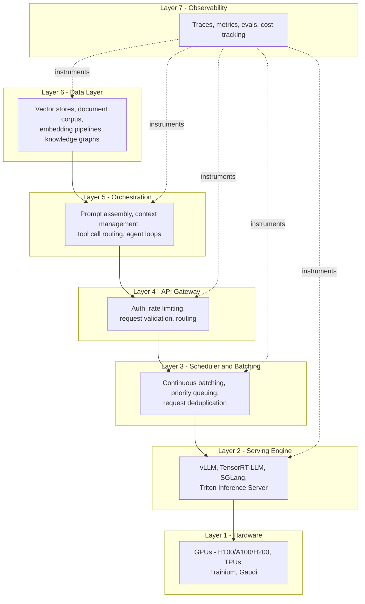
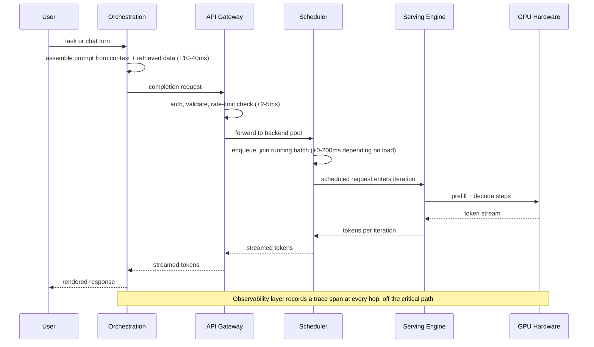
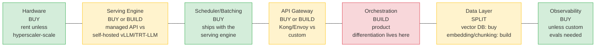
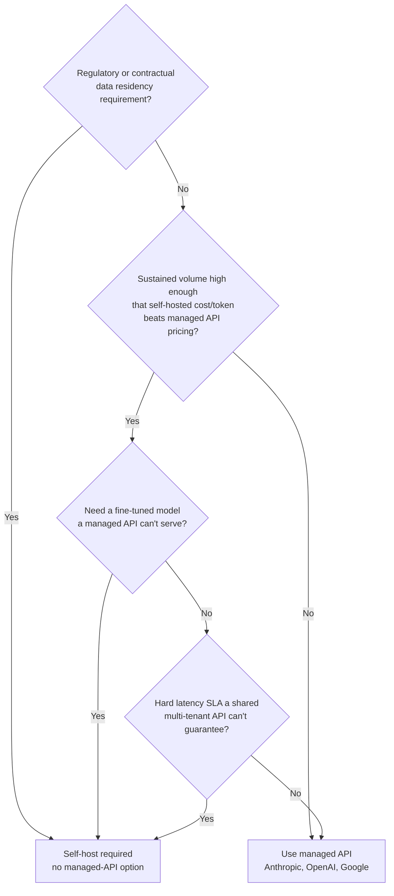
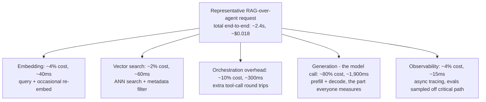
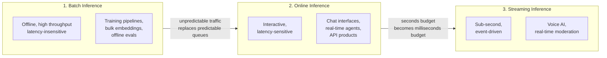
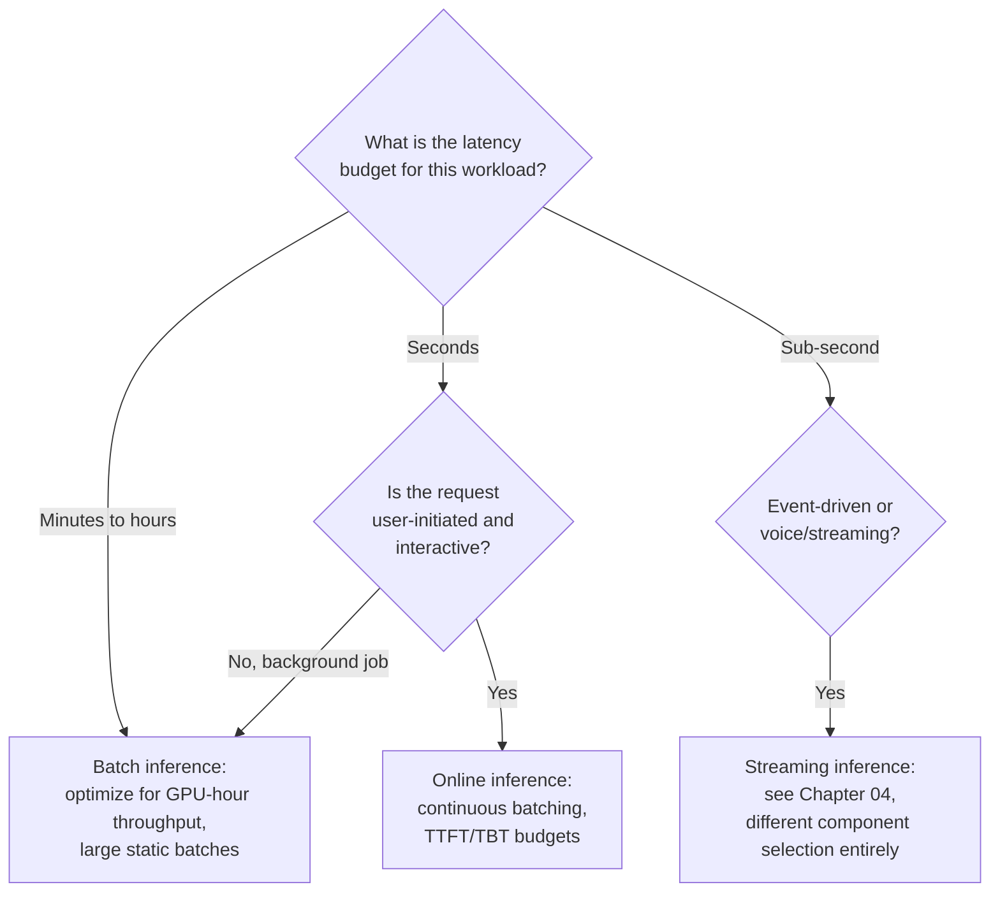
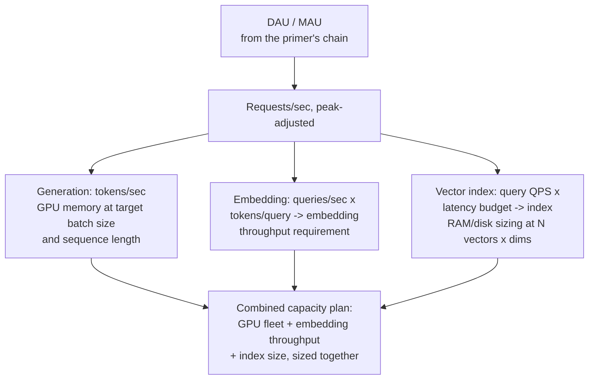
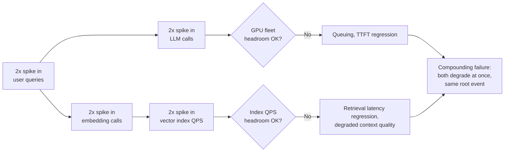

# AI Infrastructure Overview

## Overview

An AI product is not one system — it's a stack of seven layers, each with its own scaling curve, cost model, and failure mode, sitting between a GPU and a user's screen. Most engineers can name the top layer (the chat UI) and the bottom layer (the model), but the five layers in between — batching, gateway, orchestration, data, and observability — are where most production incidents, cost overruns, and latency regressions actually originate. This chapter is the map: what each layer does, which team should own building it versus buying it, where cost and latency really accumulate, and which of the following four chapters and three later sections goes deep on each layer.

## The Full AI Infrastructure Stack

Every layer below exists because the layer above it needs a guarantee the layer below can't provide directly. The product surface needs "answer this user's question." The orchestration layer needs "assemble the right context and call the right tools." The gateway needs "route this to a healthy backend without leaking another tenant's data." The scheduler needs "keep the GPU busy without starving any one request." The serving engine needs "turn weights and a KV cache into tokens." None of these is optional at production scale — a system that skips the scheduler layer by calling the serving engine directly per-request works in a demo and falls over at real concurrency.

Request flow runs top-to-bottom-and-back: a product calls the orchestration layer, which calls the gateway, which routes into the scheduler, which hands work to the serving engine, which executes on hardware — and the response climbs back up through the same layers, with observability watching every hop rather than sitting only at the edges.

### Layer-by-layer map: what it does, and where the depth lives

| Layer | Responsibility | Deep-dive chapter |
|---|---|---|
| 7. Observability | Traces, metrics, evals, cost tracking across every other layer | [AI Observability Architecture](../20-observability/01-ai-observability-architecture.md) |
| 6. Data layer | Vector stores, document corpus, embedding pipelines, knowledge graphs | [AI Data Pipelines](03-ai-data-pipelines.md) (this section); [RAG Architecture](../06-rag/01-rag-architecture.md) |
| 5. Orchestration | Prompt assembly, context management, tool call routing, agent loops | [Agent Fundamentals and the Agent Loop](../09-agents/01-agent-fundamentals-and-the-agent-loop.md), [Tool Use Architecture](../09-agents/03-tool-use-architecture.md) |
| 4. API gateway | Auth, rate limiting, request validation, routing | [AI API Design](05-ai-api-design.md) (this section); [The Inference Stack](02-the-inference-stack.md) |
| 3. Scheduler and batching | Continuous batching, priority queuing, request deduplication | [The Inference Stack](02-the-inference-stack.md) (this section); [Batching and Continuous Batching](../15-model-serving/02-batching-and-continuous-batching.md) |
| 2. Serving engine | Runs the model — vLLM, TensorRT-LLM, SGLang, Triton | [Model Serving Architecture](../15-model-serving/01-model-serving-architecture.md), [Distributed Inference](../17-distributed-inference/index.md) |
| 1. Hardware | GPUs, TPUs, custom silicon | [GPU Fundamentals for AI Systems](../16-gpu-systems/01-gpu-fundamentals-for-ai-systems.md), [GPU Sizing and Capacity Planning](../16-gpu-systems/02-gpu-sizing-and-capacity-planning.md) |

Section 14 (this one) is the connective tissue: Chapter 02 goes one level deeper than this chapter into layers 1-4 (the inference stack specifically); Chapter 03 is entirely about layer 6 (data); Chapter 04 covers architectural variants that cut across layers 1-5 when the latency budget is sub-second; Chapter 05 covers layer 4 in full API-design depth. [Model Serving](../15-model-serving/index.md) then takes layer 2 to much greater depth than this section attempts, alongside [GPU Systems](../16-gpu-systems/index.md) and [Distributed Inference](../17-distributed-inference/index.md) for layers 1 and 3, and [LLMOps](../18-llmops/index.md) owns the lifecycle — deployment, monitoring, rollback — of the whole stack once it's built.

## Build vs Buy at Each Layer

The most consequential infrastructure decision most teams make is not "which GPU" or "which vector database" — it's which of these seven layers to build in-house versus buy as a managed service. Get this wrong in either direction and you either burn a year building commodity infrastructure that a vendor sells for $500/month, or you outsource the one layer that's supposed to be your product's actual differentiation.

**Hardware — almost always rent.** Cloud GPU instances (AWS, GCP, Azure, CoreWeave, Lambda) or managed inference APIs cover the overwhelming majority of teams. Owning H100s only pays off at sustained high utilization — the break-even for owning versus renting is roughly **18-24 months of near-continuous use** once you account for depreciation, power, cooling, and the opportunity cost of capital tied up in hardware that's obsolete in three to four years. Below hyperscaler scale or outside frontier-model training, renting wins on flexibility alone: you can right-size instance types weekly; owned hardware is a multi-year commitment made once.

**Serving engine — decision depends on four factors.** Managed APIs (Anthropic, OpenAI, Google) require no serving infrastructure at all, but hand over data residency and cost predictability. Self-hosting open-weight models on vLLM or TensorRT-LLM buys data privacy, no per-token markup at volume, and the ability to fine-tune — at the cost of owning GPU capacity planning, serving-engine upgrades, and on-call for a new production system. The decision factors, in the order they usually break ties: data privacy/compliance requirements (often forces self-hosting outright), cost at your real volume (compute the crossover using the [Capacity Planning Primer](../01-fundamentals/04-capacity-planning-primer.md)'s API-vs-self-hosted fork), whether you need a fine-tuned model a managed API can't serve, and hard latency requirements a shared multi-tenant API can't guarantee.

**Orchestration — almost always build.** LangChain, LlamaIndex, or a similar framework is a reasonable starting scaffold, but production systems consistently graduate to custom orchestration code, because this layer — prompt assembly, context management, tool routing, agent loop control — is where the actual product behavior lives. Buying this layer means buying your competitors' product behavior too.

**Data layer — split down the middle.** The vector database itself (Pinecone, Weaviate, Qdrant, pgvector) is a commodity capability with mature managed options; buying it is rarely wrong. The embedding pipeline and chunking strategy sitting on top of it are not commodity — they encode exactly how your domain's documents should be split, filtered, and represented, which is domain-specific product logic, not infrastructure. Chapter 03 of this section is entirely about that build side.

**Observability — buy, unless your evals are the product.** LangSmith, Langfuse, Weights & Biases, and Datadog cover tracing, cost tracking, and general dashboards well. Build only the eval pipelines that encode your specific quality bar — a generic observability vendor cannot know what "a good answer" means for your product.

| Layer | Default | When the default flips |
|---|---|---|
| Hardware | Rent | Sustained utilization past ~18-24 months payback, or frontier-scale training |
| Serving engine | Buy (managed API) | Data privacy requirements, cost at scale, need for a fine-tuned model, or hard latency SLAs a shared API can't meet |
| Scheduler/batching | Buy (ships with engine) | Rare — only at extreme custom-scheduling requirements (e.g., novel priority classes) |
| API gateway | Buy the shell (Kong, Envoy, Apigee), build the AI-specific policy | Never fully build from scratch; never fully buy the AI-specific rate-limiting logic either |
| Orchestration | Build | Never — this is where product differentiation lives |
| Data layer: vector DB | Buy | Extreme scale/cost pressure justifying a self-hosted cluster |
| Data layer: embedding/chunking | Build | Never — this encodes domain knowledge |
| Observability | Buy | Custom eval pipelines specific to your quality bar |

The serving-engine decision is the one most teams get wrong in both directions — self-hosting too early when volume doesn't justify it, or staying on a managed API long past the point where self-hosting would be cheaper and more controllable.

## How Inference Cost and Latency Distribute Across the Stack

Ask an engineer where an AI product's cost and latency go, and the answer is almost always "the model API call." That's true for a bare chat completion — it's badly wrong for a RAG-over-agent system, where the model call is one of five or six cost- and latency-contributing hops.

- **Embedding cost** scales with document count (ingestion) and query volume (retrieval), and in a heavy RAG setup — thousands of queries/day each embedding a rewritten query, plus continuous corpus re-embedding — this can approach or exceed the marginal cost of generation itself, particularly if a large embedding model is used unnecessarily (see [RAG Architecture](../06-rag/01-rag-architecture.md#cost-optimization)).
- **Vector search cost** is fast per-query (single-digit to double-digit milliseconds) but stops being negligible at scale: millions of queries/day against a large index adds real, metered infrastructure cost and a latency tail that shows up at p99 even when p50 looks fine.
- **Orchestration overhead** compounds in agentic pipelines — each additional LLM call in a tool-calling loop adds its own queuing, prefill, and decode time on top of the "visible" final generation, often doubling or tripling end-to-end latency versus a single-call estimate (see [Agent Fundamentals and the Agent Loop](../09-agents/01-agent-fundamentals-and-the-agent-loop.md#operating-the-loop-in-production)).
- **Observability overhead** is usually small but not free — synchronously tracing every token as it streams, rather than batching trace writes asynchronously, can add measurable per-token latency at high throughput.

The generation call is still the largest single line item — that part of the intuition is correct — but treating it as the *only* line item is how teams get surprised by a monthly bill that's 20-30% higher than the "cost per generation call" spreadsheet predicted, and by a p99 latency that's meaningfully worse than the model provider's advertised numbers alone would suggest.

## The Three Infrastructure Eras

Production AI systems run workloads with fundamentally different latency tolerances, and conflating them is a common design mistake: infrastructure tuned for one era actively fails the requirements of another.

- **Batch inference** optimizes purely for throughput: maximize tokens processed per GPU-hour, accept minutes-to-hours of latency, and run at full, predictable batch sizes. A nightly job re-embedding ten million documents or scoring an eval suite belongs here — the infrastructure choice is "biggest batch the GPU memory allows," not "fastest first token."
- **Online inference** optimizes for interactive responsiveness under unpredictable, bursty traffic: this is continuous batching, KV cache management, and TTFT budgets — the entire subject of Chapter 02.
- **Streaming inference** pushes the budget down another order of magnitude, into sub-second, often event-driven territory: voice AI, live content moderation, fraud scoring on a transaction before it authorizes. This is the subject of Chapter 04.

The common failure mode is applying batch-era thinking to an online or streaming product: a pipeline optimized for maximum GPU utilization via large static batches adds exactly the queuing latency an interactive chat product can't tolerate. The inverse failure — running an offline embedding job through infrastructure tuned for low single-request latency — wastes GPU-hours that large-batch throughput tuning would have used far more efficiently. Most production systems need all three eras running simultaneously against the same underlying model family, which is why the serving engine and scheduler layers (Chapter 02) need to support configurable batching behavior rather than one fixed policy.

## Capacity Planning Across the Stack

The [Capacity Planning Primer](../01-fundamentals/04-capacity-planning-primer.md) established a four-link chain — DAU/MAU → requests/sec → tokens/sec → provisioned capacity — for a single model endpoint. A full AI stack needs that chain run **once per layer**, because each layer has a different unit of capacity and a different way of running out of it.

Four planning questions extend the primer's chain to this stack specifically:

- **Token throughput planning.** How many tokens/second does the application need, summed across embedding (query-side and any live re-embedding) and generation (input context plus output)? A RAG-heavy agentic workflow can easily need more embedding throughput than a simple chat product needs generation throughput, which is exactly the kind of workload-tiering the primer warns against blending into one average.
- **GPU memory planning.** How much VRAM does the model need at the target batch size and sequence length? Model weights are close to fixed (a 70B model in FP16 is roughly 140GB); KV cache grows with concurrent requests and context length, and is the part of memory planning that's easiest to underestimate — covered in full in Chapter 02's KV cache section and in [GPU Sizing and Capacity Planning](../16-gpu-systems/02-gpu-sizing-and-capacity-planning.md).
- **Vector index sizing.** Number of vectors × dimensions × bytes-per-dimension gives the raw storage floor (e.g., 50M vectors × 1024 dimensions × 4 bytes ≈ 200GB before index overhead); HNSW-style indexes typically add 1.2-1.5x on top of raw vector storage for graph structure, and the whole thing ideally lives in RAM for latency, not disk.
- **The compounding capacity problem.** A 2x spike in user queries doesn't cause one 2x spike — it causes a *simultaneous* 2x spike in LLM calls, a 2x spike in embedding calls (each query needs re-embedding), and a 2x spike in vector index load, all hitting at once. Layers sized independently, each with its own comfortable headroom, can still fail together at the same traffic event if that headroom wasn't sized against the same peak assumption.

The mitigation is planning headroom against one shared peak-factor assumption across every layer, not layer-by-layer in isolation — if the generation layer is provisioned for a 4x peak factor but the vector index is only provisioned for 2x, the index becomes the bottleneck exactly at the moment the rest of the stack was built to survive.

## Google-Level Follow-Ups

- "If a team can only instrument one layer of this stack for cost attribution first, which should it be, and why?" — probes whether the candidate defaults to "the model API, because that's the obvious cost" versus recognizing that orchestration overhead (extra LLM round-trips) is the layer most likely to be invisible and compounding, and therefore the highest-leverage first instrumentation target in agentic systems specifically.
- "You're told to cut infrastructure cost 30% without changing product behavior. Walk the stack layer by layer and name where you'd look first." — probes systematic layer-by-layer reasoning (right-sizing embedding models, trimming context, batching more aggressively, tiering models) over jumping straight to "use a cheaper model," which ignores five of the seven layers.
- "A team wants to build their own vector database instead of using Pinecone or Qdrant. When, if ever, is that the right call?" — probes whether the candidate has internalized the build/buy default (vector DB is a commodity layer) and can articulate the narrow, extreme-scale conditions (cost at billions of vectors, unusual filtering requirements no managed product supports) under which the default should flip, rather than treating "build everything" or "buy everything" as a fixed rule.
- "Which layer in this stack is most likely to become the bottleneck first as a product scales from 10K to 10M daily users, and why?" — probes whether the candidate recognizes that different layers bottleneck at different scale thresholds (embedding and vector search bottleneck earlier than most engineers expect, well before the GPU fleet for generation does, in retrieval-heavy products) rather than assuming the model-serving layer is always first to break.

## Common Mistakes

- **Attributing all cost and latency to the model API call.** In any RAG or agentic system, embedding, vector search, orchestration round-trips, and even observability tracing meaningfully contribute — sizing and cost models that ignore them are reliably wrong by 20-30% or more.
- **Applying batch-era infrastructure choices to an online product.** A large static batch size tuned for throughput adds exactly the queuing latency an interactive chat surface can't absorb.
- **Building the orchestration layer on a vendor's roadmap instead of your own.** Since product differentiation lives in orchestration, outsourcing it to a framework's opinionated abstractions can quietly cap what your product can do.
- **Buying vector database infrastructure but skipping investment in chunking and embedding strategy.** The database is commodity; the pipeline feeding it is not, and a great vector DB on top of bad chunking still returns bad retrieval.
- **Sizing each layer's headroom independently against different peak-factor assumptions.** A 2x traffic spike compounds across embedding, generation, and vector search simultaneously — headroom must be planned against one shared peak assumption, not layer-by-layer optimism.
- **Treating "we call a managed API" as "no capacity planning needed."** Rate-limit tiers and cost budgets still need the same DAU-to-tokens/sec chain as a self-hosted fleet — the primer's chain doesn't disappear just because the hardware layer was bought instead of built.

## Key Takeaways

- The AI infrastructure stack has seven layers — hardware, serving engine, scheduler/batching, API gateway, orchestration, data, observability — and each later chapter and section in these notes lives at a specific layer; this chapter's job is making those mappings explicit.
- Build versus buy varies sharply by layer: hardware and observability default to buy, orchestration defaults to build (because that's where product differentiation lives), and the data layer splits — vector DB bought, embedding/chunking built.
- Cost and latency are commonly mis-attributed entirely to the model API call; in RAG and agentic systems, embedding, vector search, orchestration overhead, and tracing all contribute meaningfully and should be measured, not assumed away.
- Production systems typically need all three infrastructure eras — batch, online, streaming — simultaneously, and infrastructure tuned for one era actively fails the requirements of another.
- Capacity planning must extend the DAU-to-tokens/sec chain to every layer with its own capacity unit — GPU memory, embedding throughput, vector index size — not just the generation endpoint.
- A traffic spike compounds across layers simultaneously; headroom sized independently per layer, against different peak assumptions, still fails together at the same event.
- The hardware-owning break-even is roughly 18-24 months of sustained utilization — below that, renting wins on flexibility and avoids a multi-year capital commitment to hardware that's obsolete within a few years.

## Interview Questions

### Beginner

**Q: Name the seven layers of the AI infrastructure stack, bottom to top.**
Hardware (GPUs/TPUs/custom silicon), serving engine (vLLM, TensorRT-LLM, SGLang, Triton), scheduler and batching (continuous batching, priority queuing), API gateway (auth, rate limiting, routing), orchestration (prompt assembly, tool routing, agent loops), data layer (vector stores, embedding pipelines), and observability (traces, metrics, evals, cost tracking) sitting across all of them.

**Q: Why is hardware almost always rented rather than owned for most AI products?**
Owning GPUs only pays off with roughly 18-24 months of sustained, high utilization once depreciation, power, cooling, and capital opportunity cost are accounted for. Most teams' traffic is bursty rather than sustained-peak, and cloud rental lets them right-size instance types continuously rather than committing capital to hardware that's technologically obsolete within a few years.

### Intermediate

**Q: Why does the orchestration layer almost always get built in-house rather than bought, when the vector database next to it is usually bought?**
The vector database is a commodity capability — approximate nearest-neighbor search over embeddings is a solved, well-productized problem, so buying it (Pinecone, Weaviate, Qdrant) captures nearly all the value at much lower engineering cost than reimplementing it. Orchestration — prompt assembly, context management, tool call routing, agent loop control — is where a product's actual behavior and differentiation live; buying that layer wholesale from a framework means buying a competitor's product behavior, not your own.

**Q: A team's monthly bill for their RAG-over-agent product is 25% higher than their "cost per generation call" spreadsheet predicted. What's the most likely explanation?**
The spreadsheet almost certainly only modeled the model API call and missed the other cost-contributing layers: embedding cost scaling with query volume and corpus re-embedding, vector search cost at scale, and — the most commonly missed one in agentic systems — orchestration overhead from extra LLM round-trips in a tool-calling loop, each of which is its own billed generation call layered on top of the "visible" final answer.

### Senior

**Q: Walk through how you'd decide whether to self-host an open-weight model versus keep calling a managed API, for a product currently spending $40K/month on a third-party API.**
Start from the four decision factors in order of how often they force the decision outright: data privacy/compliance requirements (if regulatory constraints forbid sending data to a third party, self-hosting isn't optional); then cost at real volume, computed via the capacity planning chain's API-vs-self-hosted fork — model the token/sec demand, the achievable throughput per GPU at your target model and quantization, and compare the resulting GPU fleet's amortized cost against the $40K/month blended API rate at the same volume; then whether the product needs a fine-tuned model a managed API can't serve; then hard latency requirements a shared multi-tenant API can't guarantee. Only after those are answered does the crossover math actually settle the decision — a team that jumps to "self-host, it'll be cheaper" without running the chain routinely underestimates the ops burden (on-call, serving-engine upgrades, capacity planning) that comes bundled with owning the layer.

**Q: A product's p99 latency degraded from 2.5s to 4.5s over the last month with no model or prompt changes. Which layers would you check, in order, and why?**
Start with the layer most likely to silently regress without a corresponding alert firing: vector search and embedding, since a growing index or corpus can push ANN search latency up gradually without crossing any single obvious threshold. Next check orchestration — has the agent loop's average step count crept up, adding extra round-trips per request? Then check the scheduler/batching layer for queuing regressions from a traffic mix shift (more long-context requests monopolizing batches). Only after ruling out the other five layers would I suspect the serving engine or hardware layer itself, since those are the layers most likely to have paging alerts already in place if something there had actually changed.

### Staff

**Q: You're the infrastructure lead for a new AI product line. Walk through how you'd sequence build-vs-buy decisions across all seven layers for a team of eight engineers launching in three months.**
Sequence by how reversible each decision is and how much it blocks everything downstream. Start with hardware and serving engine (buy: managed API to start, since self-hosting a serving engine three months before launch with a small team is a needless early commitment — this can flip later once volume justifies it, using the capacity planning chain to know when). Buy the API gateway shell (Kong, Envoy) rather than writing one from scratch, but budget real engineering time for the AI-specific policy on top of it (token-based rate limiting, model routing) since that part isn't a commodity the gateway vendor solves for you. Buy the vector database and observability platform outright — these are the lowest-differentiation, most mature-vendor-served layers, and building either from scratch with a three-month runway is pure opportunity cost. Reserve the team's actual engineering effort for the two layers that can't be bought: orchestration (where the product's behavior lives) and the embedding/chunking pipeline (where domain knowledge gets encoded) — these are the layers a small team should spend the majority of its three months on, because everything else on this list has a mature vendor able to ship it faster and more reliably than an eight-person team could in the same window.

---

*Part of [AI Infrastructure](index.md) in the [AI System Design Notes](../index.md). Tracked in [BACKLOG.md](https://github.com/GyanendraChaubey/AI-System-Design-Notes/blob/main/BACKLOG.md).*
