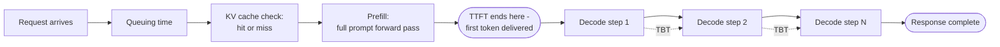
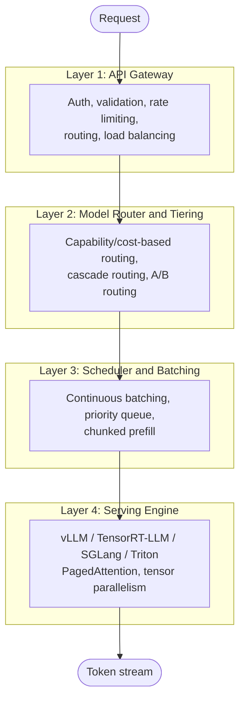
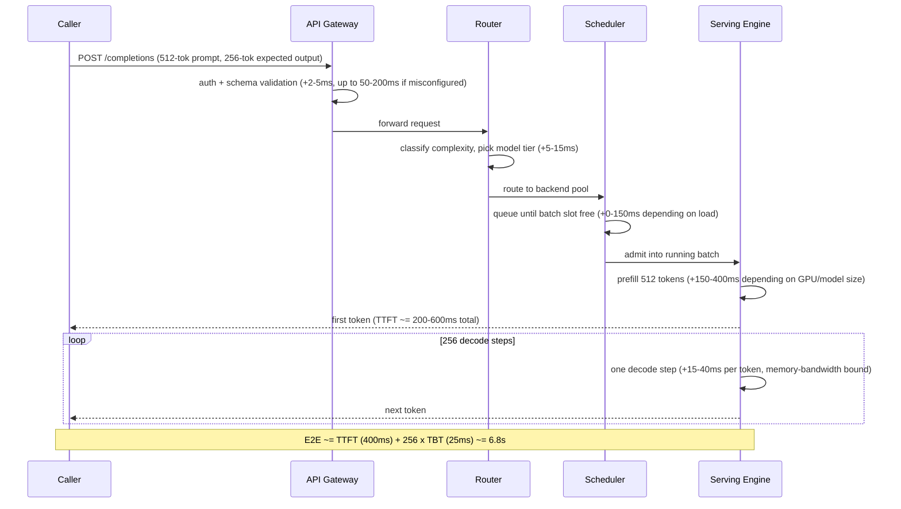
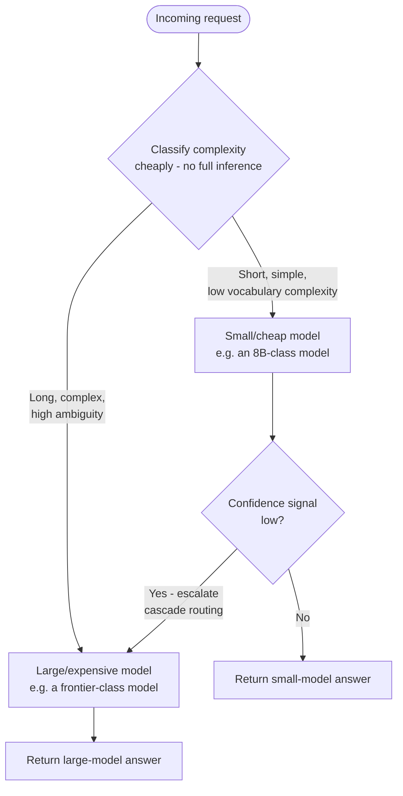
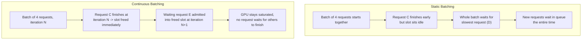
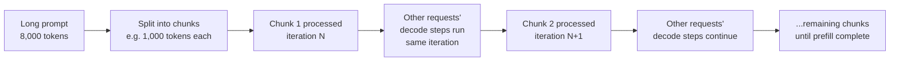
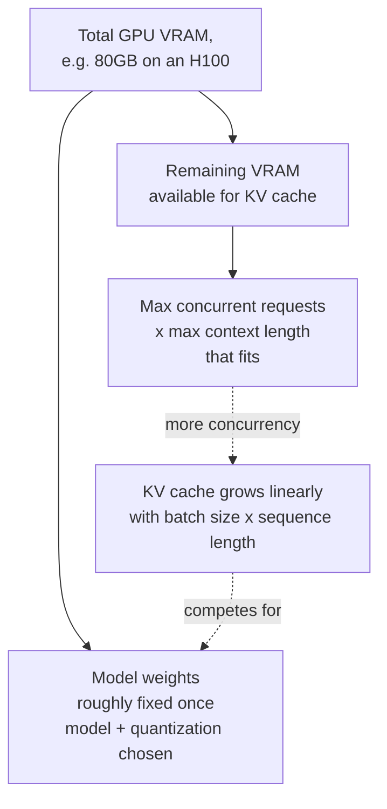
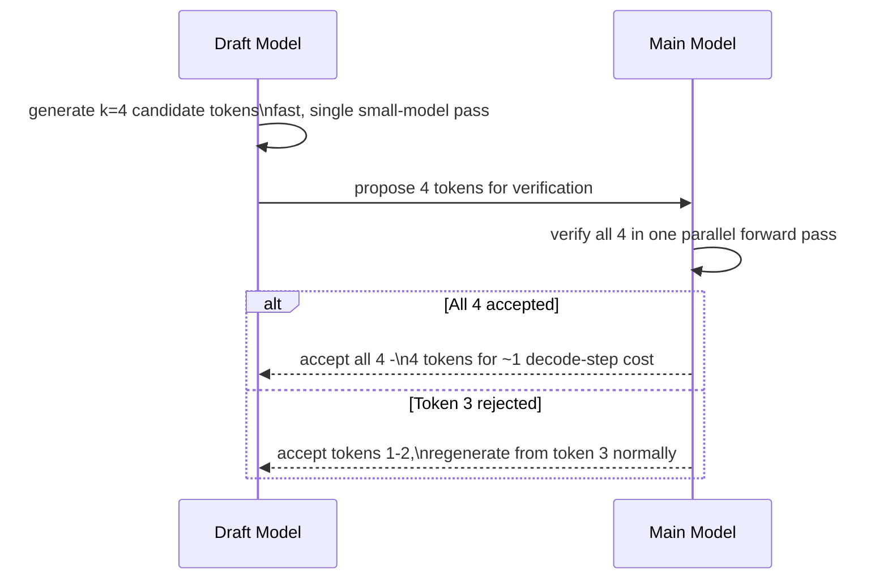

# The Inference Stack

## Overview

Between "the API received a request" and "the first token appeared on screen" sits four layers of software, each adding its own latency and each with its own failure modes: a gateway, a router, a scheduler, and a serving engine sitting on top of hardware. Engineers who can't name where time goes in this stack end up tuning the wrong layer when latency regresses — adding GPUs when the real problem is scheduler queuing, or switching serving engines when the real problem is an unbatched gateway validation step. This chapter walks the stack top to bottom, latency-first.

## The Two Critical Latency Metrics

Every layer below affects these two numbers differently, so they need to be defined precisely before anything else makes sense.

**TTFT (Time to First Token)** is the time from request received to the first output token delivered to the caller. It is dominated by request queuing time (how long the request waits before a scheduler slot is free), KV cache miss (the prompt's prefix wasn't cached, so the full prompt must be re-prefilled from scratch), prefill computation (processing the entire input context in one forward pass), and network round-trip time. TTFT is what the user experiences as "the model is thinking" — it is a one-time cost paid once per request, independent of how long the response ends up being.

**TBT / ITL (Time Between Tokens / Inter-Token Latency)** is the time between successive output tokens during generation. It is dominated by decode step computation (one forward pass per output token), memory bandwidth (loading the KV cache and model weights fresh on every decode step, since decode is memory-bound rather than compute-bound), and output streaming latency (buffering and network flush behavior). TBT is what the user experiences as "the model is typing" — paid repeatedly, once per output token.

$$\text{E2E latency} = \text{TTFT} + (\text{output\_tokens} \times \text{TBT})$$

A system can be well-tuned on one metric and poor on the other: fast TTFT with slow TBT looks like a snappy start that then crawls; slow TTFT with fast TBT looks like a long pause followed by a burst of fast text. Which one matters depends on the application — voice AI is almost entirely TTFT-critical (the user is waiting in silence until the first token arrives, then TTS can start streaming immediately), while long-document generation cares more about sustained TBT, since a 2,000-token report pays TBT 2,000 times but TTFT only once.

## The Four-Layer Stack, With a Latency Waterfall

A representative request — a 512-token prompt, 256-token output, moderate load — passes through all four layers before the first token appears, and continues through the scheduler and serving engine for every subsequent token.

The waterfall makes the common surprise sources visible: a **KV cache miss on a long system prompt** that was evicted under memory pressure re-pays the full prefill cost that a cache hit would have skipped; a **bursty traffic spike** inflates the scheduler-queuing term well past its steady-state value; and **network overhead between gateway and serving engine** — often modeled as zero in architecture diagrams — is a real, non-zero hop, especially when the gateway and engine sit in different availability zones.

## Layer 1: API Gateway

The gateway is the entry point for every request and should consume as little of the latency budget as possible — a well-implemented gateway costs under 5ms; a misconfigured content-validation step (e.g., synchronously calling an external moderation API before admitting the request) can silently add 50-200ms to every single call.

- **Authentication and authorization** — API key validation, JWT verification, OAuth token introspection. Should be a fast, local check (cached key lookup) rather than a network call per request wherever possible.
- **Request validation** — schema validation (are required fields present, are types correct) and content policy pre-screening (is this request obviously disallowed before it ever reaches the model). Cheap structural checks belong here; expensive checks belong later or async.
- **Rate limiting** — per-user, per-tenant, and per-model-tier limits, typically implemented with token-bucket or leaky-bucket algorithms so short bursts are tolerated without letting sustained abuse through.
- **Request routing and load balancing** — deciding which backend model version and which specific instance handles this request, spreading load across healthy replicas and pulling unhealthy ones out of rotation.

## Layer 2: Model Router and Tiering

Not every request deserves the most expensive model. A router sits between the gateway and the scheduler and decides which model tier actually handles a given request.

- **Capability-based routing** sends simple queries to small/cheap models and complex queries to large/expensive ones, using a classifier upstream of full inference.
- **Cost-based routing** picks the cheapest model that still meets a quality bar for the request type, rather than the most capable model available.
- **Cascade routing** tries a small model first; if its own confidence signal (log-probability spread, a lightweight self-reported confidence score, or a verifier model) is low, the request escalates to a larger model — paying the large model's cost only for the fraction of requests that actually need it.
- **A/B routing** splits traffic between model versions for live evaluation before a full rollout.

Classifying complexity *without* paying for a full inference pass to do it is the practical constraint: production routers lean on embedding-based classifiers (cheap, a single small forward pass) or pure heuristics (input token length, vocabulary rarity, presence of code/math markers) rather than asking the large model itself "is this simple?" — which would defeat the entire purpose of routing.

## Layer 3: Scheduler and Batching

GPUs reach their best tokens-per-second-per-dollar when processing many requests at once — an idle GPU waiting on a single request's next token is wasting the majority of its available compute, since decode is memory-bandwidth-bound and batching hides that bandwidth cost across many requests' worth of useful work per fetch.

**Static batching** waits until N requests have accumulated, then processes the whole batch together, request-synchronously — nobody's slot frees until every request in the batch finishes. Simple to implement, but two problems compound: queuing latency proportional to how long it takes to fill a batch, and wasted GPU cycles whenever one request in the batch finishes early and the engine still waits on the slowest one before admitting new work.

**Continuous batching (iteration-level scheduling)** — the seminal vLLM innovation — fixes both problems by scheduling at the level of individual decode iterations rather than whole requests. At every iteration, the engine looks at which requests in the current batch still need a token, drops any that just finished, and immediately admits new waiting requests into the freed slots — all within the same decode step, not waiting for the whole batch to complete first.

This dramatically improves GPU utilization without adding queuing latency, because a request never waits for unrelated requests in its batch to finish — it only waits for a free slot, and slots free continuously rather than in synchronized bursts.

**Priority queuing** lets some requests — premium tier, real-time voice — preempt standard-tier work. Because continuous batching schedules per-iteration rather than per-batch, a high-priority request can be interleaved into the very next iteration ahead of waiting standard-priority requests, rather than waiting for an entire batch to drain first, which is the mechanism that makes priority queuing actually effective under continuous batching instead of merely nominal.

**Chunked prefill** addresses a specific pathology: a very long prompt's prefill computation is a large, uninterruptible chunk of GPU work that — without chunking — stalls decode progress for every other request in the batch until it finishes. Chunked prefill breaks a long prompt into smaller pieces processed across multiple iterations, interleaved with other requests' decode steps, so one long-context request doesn't monopolize the GPU and inflate TBT for everyone else sharing the batch. It's needed whenever prompt lengths are highly variable and long-context requests are common enough to matter; the cost is added scheduling complexity and, for the long request itself, a slightly longer prefill wall-clock time than an uninterrupted prefill would take.

## Layer 4: Serving Engine

The serving engine is the software that actually executes the model against hardware.

| Engine | Core mechanism | Best for |
|---|---|---|
| **vLLM** | PagedAttention + continuous batching + tensor parallelism | Broadest model support, easiest setup, the dominant open-source default |
| **TensorRT-LLM** | NVIDIA-specific kernel fusion and compilation | Peak performance on NVIDIA hardware — often 20-40% faster than vLLM in production, at the cost of more complex setup |
| **SGLang** | RadixAttention (prefix-sharing KV cache) | Structured generation and multi-call programs; excels when many requests share a common prefix (e.g., identical system prompts) |
| **Triton Inference Server** | General-purpose model serving shell | Not LLM-specific — often wraps TensorRT-LLM or vLLM as a backend inside a broader multi-model serving deployment |

**vLLM's PagedAttention** treats KV cache memory the way an OS treats virtual memory: instead of allocating one large contiguous block of memory per request (which fragments badly as requests of different lengths come and go), it allocates KV cache in fixed-size pages that can be scattered across physical memory and mapped through a page table. This eliminates the fragmentation that plagued earlier serving engines and is the single mechanism that made high-batch-size continuous batching practical at scale.

**TensorRT-LLM** compiles the model graph ahead of time into highly optimized, hardware-specific kernels. This upfront compilation cost buys real throughput and latency wins on NVIDIA GPUs specifically, at the cost of a more involved build/deploy pipeline and less flexibility for rapidly swapping model architectures compared to vLLM's more dynamic execution.

**SGLang's RadixAttention** generalizes KV cache sharing beyond a single request: it maintains a radix tree of previously computed KV cache entries so that any new request sharing a prefix with a prior request — most commonly, an identical system prompt repeated across thousands of requests — can reuse that prefix's cache instead of recomputing it. This is a direct win on prefill cost and TTFT for any workload with a large shared, static prefix.

**Triton Inference Server** is not itself an LLM-optimized engine — it's a general model-serving shell that handles model lifecycle, versioning, and multi-framework serving, and is commonly used to host TensorRT-LLM or vLLM as the actual execution backend underneath, particularly in deployments that also serve non-LLM models (classifiers, embedding models) from the same infrastructure.

**Choosing between them**: default to vLLM for broadest compatibility and fastest time-to-production; move to TensorRT-LLM once you've settled on a stable model and NVIDIA hardware and need the extra 20-40%; reach for SGLang specifically when the workload has heavy prefix reuse (shared system prompts, structured multi-call programs) that RadixAttention can exploit; use Triton when you need one serving shell across multiple model types, not just LLMs.

## KV Cache: The Central Resource

Autoregressive decoding is sequential — generating token N+1 needs the attention keys and values for every prior token. Without caching, every new token would require recomputing attention over the *entire* prior context from scratch, which is quadratically wasteful. The KV cache stores those keys and values computed during prefill (and each subsequent decode step) so each new token only computes attention against the cache, not against a full re-derivation of the past.

KV cache size follows directly from the model's shape:

$$\text{KV cache size} = \text{layers} \times \text{heads} \times \text{head\_dim} \times \text{sequence\_length} \times 2 \times \text{dtype\_bytes}$$

The factor of 2 accounts for storing both keys and values. For a 70B-class model (80 layers, 64 heads, 128 head_dim) at a 4,096-token sequence length in FP16 (2 bytes): 80 × 64 × 128 × 4,096 × 2 × 2 bytes ≈ **10.7GB per sequence** — and that's *per concurrent request*, not a one-time cost.

This makes KV cache the primary constraint on maximum batch size, not model weights. VRAM splits between model weights (roughly fixed once a model and quantization are chosen) and KV cache (which scales linearly with concurrent requests × context length). More concurrent requests directly means more KV cache, which means less room left for model weights at a given VRAM budget — and quantizing the weights down doesn't help the KV cache itself unless the cache is also quantized, which is a separate, more delicate optimization (KV cache quantization affects attention numerical stability more directly than weight quantization does).

**PagedAttention's page-table approach** (see above) is what makes this budget usable efficiently in practice: without it, KV cache for variable-length requests fragments memory the same way naive heap allocation fragments RAM, wasting a meaningful fraction of the KV budget on unusable gaps between allocations — paging that memory into fixed-size, freely-relocatable blocks recovers that wasted fraction directly into usable batch capacity.

## Speculative Decoding

Speculative decoding uses a small, fast **draft model** to generate k candidate tokens in a single forward pass, which the main model then verifies *in parallel* in one additional forward pass rather than generating them one at a time. If the main model accepts all k draft tokens, it has effectively produced k tokens for roughly the cost of one decode step plus one verification pass — a direct win on TBT, since verification of already-generated candidates is cheaper than sequentially generating each one.

Speculative decoding helps most on long, fairly predictable output sequences — boilerplate code, structured JSON, formulaic prose — where the draft model's guesses are frequently correct. It helps little or not at all on short outputs (the fixed overhead of running two models isn't amortized) or high-entropy outputs (creative writing, genuinely novel reasoning) where the draft model's guesses are rejected often enough that the verification overhead isn't recovered. The setup cost is real: it requires a draft model architecturally compatible with the main model (usually a smaller model from the same family) and adds a second model to operate, version, and keep in sync.

## Quantization and Its Effect on the Stack

Quantization reduces the numerical precision of model weights (and sometimes activations and KV cache), trading some output quality for smaller memory footprint and higher throughput.

| Precision | Memory for a 70B model | Typical quality impact | Production-proven methods |
|---|---|---|---|
| FP16 (baseline) | ~140GB | None (reference) | — |
| FP8 | ~70GB | Minimal, often within noise | Native on H100/H200 |
| INT8 | ~70GB | Small, measurable perplexity increase | AWQ, GPTQ |
| INT4 | ~35GB | Noticeable on some tasks, acceptable on many | AWQ, GPTQ |

Cutting a 70B model from FP16 (~140GB) to 4-bit (~35GB) is the difference between needing multiple high-end GPUs and fitting comfortably on one, which directly changes the [build-vs-buy hardware math](01-ai-infrastructure-overview.md#build-vs-buy-at-each-layer). Throughput gains come from two effects pulling in different directions: lower memory footprint means more KV cache room (larger batches, more throughput) and less data to move per decode step (decode is memory-bandwidth-bound, so smaller weights move faster) — but dequantization itself adds a small compute overhead per forward pass, so the net win depends on whether the workload is memory-bound (usual case — quantization wins clearly) or compute-bound (rarer — the dequantization overhead can eat into the gain).

Quality degradation shows up as increased perplexity and measurable drops on task-specific evals, growing roughly with how aggressive the quantization is — FP8 is frequently indistinguishable from FP16 in practice; INT4 needs task-specific eval validation before shipping, not just a perplexity spot-check, because perplexity and downstream task accuracy don't always degrade in lockstep. AWQ and GPTQ are the production-proven INT4/INT8 methods (both preserve accuracy substantially better than naive rounding by protecting a small set of high-impact weight channels); FP8 is increasingly the default choice on H100-class hardware specifically because it's natively supported in the tensor cores with minimal extra tooling.

## Where Latency Actually Accumulates

Beyond the steady-state waterfall shown earlier, three specific sources of *unexpected* latency show up repeatedly in production:

- **KV cache eviction** — a request with a long, expensive-to-recompute system prompt gets its cache evicted under memory pressure (to make room for other requests' KV cache), and the next request reusing that same prompt pays a full prefill again instead of a cache hit, producing a TTFT spike that looks random unless cache hit/miss rate is actually being tracked.
- **Scheduler queuing under bursty load** — a traffic spike fills every batch slot; new requests queue, and TTFT balloons across the board even though per-request processing time hasn't changed at all — the queuing term dominates, not the compute term.
- **Network overhead between gateway and serving engine** — often assumed to be near-zero in architecture diagrams, but a real, measurable hop, especially across availability zones or when the gateway does its own buffering before forwarding — commonly neglected in latency budgets until a postmortem finds it.

## Google-Level Follow-Ups

- "Your TTFT is fine at p50 but has a fat tail at p99. Walk through what you'd check, layer by layer." — probes whether the candidate systematically checks KV cache hit rate, scheduler queue depth under burst, and chunked-prefill configuration rather than jumping straight to "add more GPUs," which fixes throughput but not necessarily tail latency caused by cache eviction or queuing.
- "When would speculative decoding make TBT *worse*, not better?" — probes understanding that high-entropy or very short outputs make verification overhead a net loss, testing whether the candidate understands the mechanism rather than treating speculative decoding as a universal win.
- "A team wants to switch from vLLM to TensorRT-LLM purely for a 30% throughput gain. What do you ask before agreeing?" — probes for engineering judgment about setup/maintenance cost, model architecture compatibility, and whether that 30% actually matters at their current bottleneck layer, versus taking a benchmark number at face value.
- "Explain why KV cache, not model weights, is usually the actual ceiling on batch size — and when that's not true." — probes deep understanding of the VRAM budget split, and whether the candidate recognizes the exception (very small models or very short contexts, where weights can dominate the budget instead).

## Common Mistakes

- **Tuning for throughput when the actual complaint is TTFT, or vice versa.** These are different metrics with different dominant causes; a fix aimed at the wrong one won't move the number users are actually unhappy about.
- **Assuming continuous batching alone fixes tail latency.** It fixes GPU utilization and average queuing; a long-prompt request without chunked prefill can still stall the whole batch's decode progress and spike TBT for everyone sharing it.
- **Ignoring KV cache size when choosing a quantization scheme.** Quantizing weights to fit a bigger model doesn't automatically leave room for the KV cache a larger batch size needs — the two budgets have to be planned together.
- **Adopting speculative decoding for workloads with short or highly creative outputs.** The setup and maintenance cost of a second draft model isn't recovered when acceptance rates are low.
- **Treating gateway-to-engine network hops as zero-cost in latency budgets.** They're a real, measurable contributor, especially across availability zones, and get discovered the hard way during an incident review rather than planned for upfront.
- **Switching serving engines chasing a throughput benchmark without checking where your actual bottleneck is.** A 20-40% engine-level throughput gain doesn't help if your real bottleneck is scheduler queuing or gateway validation latency.

## Key Takeaways

- TTFT and TBT are different metrics with different dominant causes — queuing, cache misses, and prefill drive TTFT; decode compute and memory bandwidth drive TBT — and tuning requires knowing which one actually matters for the application.
- Continuous batching (the vLLM innovation) schedules at the iteration level, not the batch level, which is why it improves GPU utilization without adding the queuing latency static batching incurs.
- Chunked prefill exists specifically to stop long prompts from stalling other requests' decode progress inside a shared batch.
- KV cache — not model weights — is usually the real ceiling on achievable batch size, and its size is a direct, computable function of layers, heads, head dimension, sequence length, and dtype.
- PagedAttention's page-table approach to KV cache is what makes large-batch continuous batching practical, by eliminating the fragmentation naive contiguous allocation would otherwise waste.
- Speculative decoding helps most on long, predictable outputs and can actively hurt on short or high-entropy ones — it is not a universal win, and requires a compatible draft model to set up.
- Quantization's throughput win depends on whether the workload is memory-bound (the common case, where it wins clearly) or compute-bound (where dequantization overhead can offset the gain) — always validate task-specific quality, not just perplexity, before shipping an aggressive quantization scheme.

## Interview Questions

### Beginner

**Q: What's the difference between TTFT and TBT?**
TTFT is the one-time delay from request received to the first output token — dominated by queuing, cache misses, and prefill. TBT is the recurring delay between each subsequent token during generation — dominated by decode compute and memory bandwidth. E2E latency is TTFT plus output tokens times TBT.

**Q: What problem does continuous batching solve that static batching doesn't?**
Static batching waits for a whole batch of requests to fill, then processes them together and doesn't admit new requests until the entire batch finishes — wasting GPU time whenever a request in the batch finishes early. Continuous batching schedules per decode iteration: a finished request's slot is freed and given to a waiting request immediately, keeping the GPU saturated without extra queuing delay.

### Intermediate

**Q: Why is KV cache usually the real constraint on batch size, not model weights?**
Model weight memory is roughly fixed once a model and quantization scheme are chosen. KV cache memory scales linearly with concurrent requests times sequence length, and it's computed per-request on top of the fixed weight footprint — so as concurrency grows, KV cache eats into the remaining VRAM budget directly, making it the variable that actually limits how many requests can run at once.

**Q: When does chunked prefill matter, and what does it cost?**
It matters whenever prompt lengths vary widely and long prompts are common enough to matter — without it, one long prompt's prefill can monopolize the GPU and stall decode progress (and inflate TBT) for every other request sharing that batch. The cost is added scheduling complexity and a slightly longer wall-clock prefill time for the long request itself, since its prefill work is now interleaved with other requests instead of running uninterrupted.

### Senior

**Q: A production system's TTFT p99 doubled after a marketing push increased traffic 3x, with no code changes. Diagnose it.**
This is very unlikely to be a compute problem — per-request prefill and decode cost don't change with traffic volume. The far more likely cause is scheduler queuing: at 3x traffic, batch slots fill faster than they free, and new requests wait longer before being admitted, which shows up entirely as increased TTFT (queuing time) with steady-state TBT unaffected. Confirm by checking queue depth and time-in-queue metrics directly rather than assuming a serving-engine regression, then decide between adding capacity, tiering by priority, or shedding load, based on which is actually the exhausted resource.

**Q: Design the KV cache and batch-size budget for serving a 70B model on a single 80GB GPU with FP8 weights, and explain your reasoning.**
FP8 weights for a 70B model are roughly 70GB, leaving very little headroom for KV cache on an 80GB GPU — this configuration is memory-constrained enough that it likely needs either a smaller effective batch size or a lower quantization for weights (INT4, ~35GB) to leave real room for KV cache, or a multi-GPU tensor-parallel setup instead of fitting everything on one card. The right move is to compute both budgets together — target concurrency and max context length translate directly to a KV cache size via the layers x heads x head_dim x seq_len x 2 x dtype_bytes formula — and check that number against actual remaining VRAM after weights, rather than picking a quantization scheme for weights alone and hoping KV cache fits afterward.

### Staff

**Q: You're asked to cut median end-to-end latency by 40% for a chat product without changing the model. Walk through your approach across this whole stack.**
Start by splitting the current E2E number into TTFT and TBT contributions, since the right lever is different depending on which dominates. If TTFT dominates: check KV cache hit rate (is a shared system prompt getting evicted and re-prefilled repeatedly — a fix as cheap as pinning that prefix in cache, or adopting RadixAttention-style prefix sharing, can be a large win with zero model change), check scheduler queue depth under real peak load (undersized capacity shows up here first), and check gateway validation latency (a synchronous content-policy call in the hot path is a common, fixable offender). If TBT dominates: evaluate speculative decoding if outputs are long and reasonably predictable, and check whether a quantization upgrade (FP16 to FP8, if not already there) frees enough memory bandwidth to matter — decode is memory-bound, so smaller weights genuinely move faster per step. Validate every change against task-specific quality evals, not just a latency number, since several of these levers (aggressive quantization, prefix caching with a shared prompt) have real, if usually small, quality tradeoffs that need to be confirmed acceptable before rolling out broadly.

---

*Part of [AI Infrastructure](index.md) in the [AI System Design Notes](../index.md). Tracked in [BACKLOG.md](https://github.com/GyanendraChaubey/AI-System-Design-Notes/blob/main/BACKLOG.md).*
