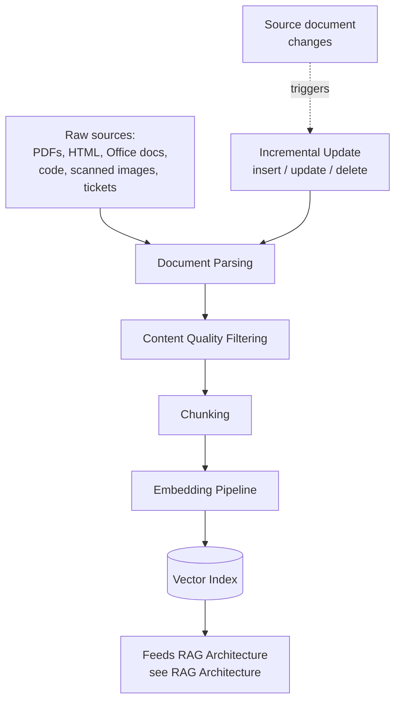
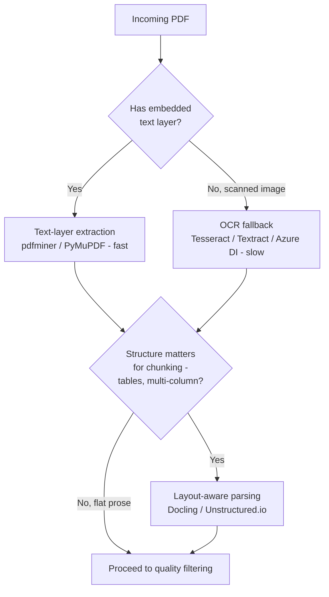
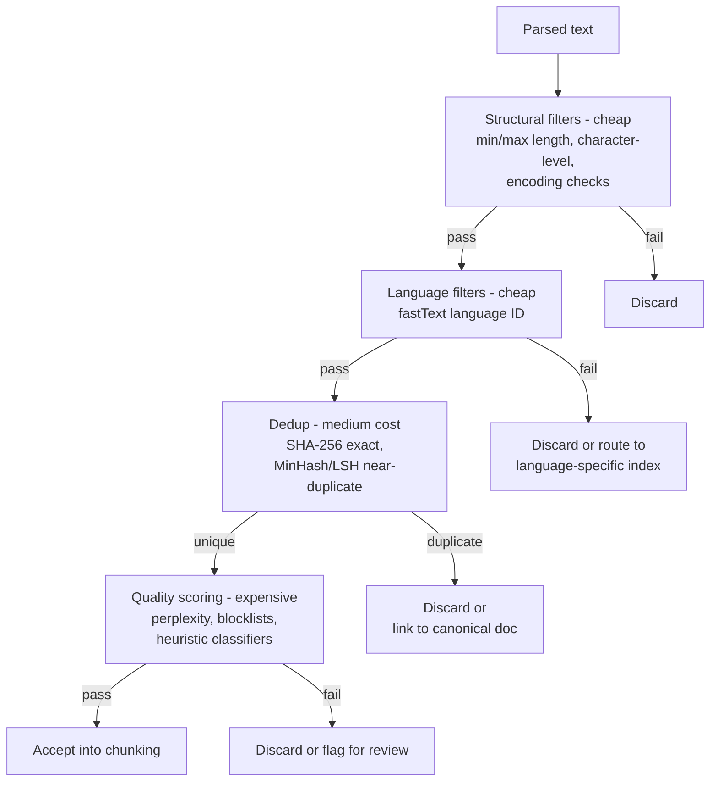
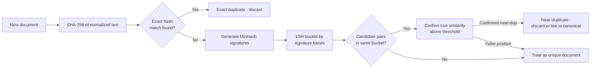
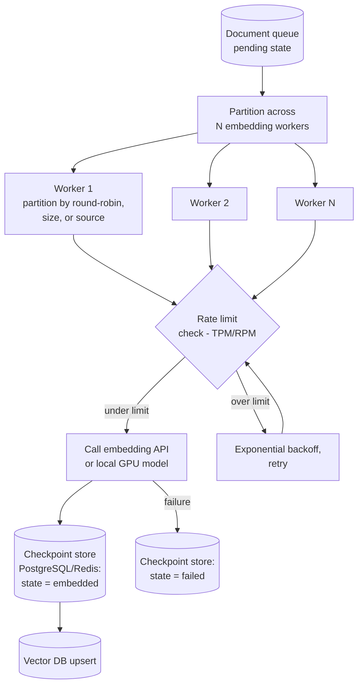
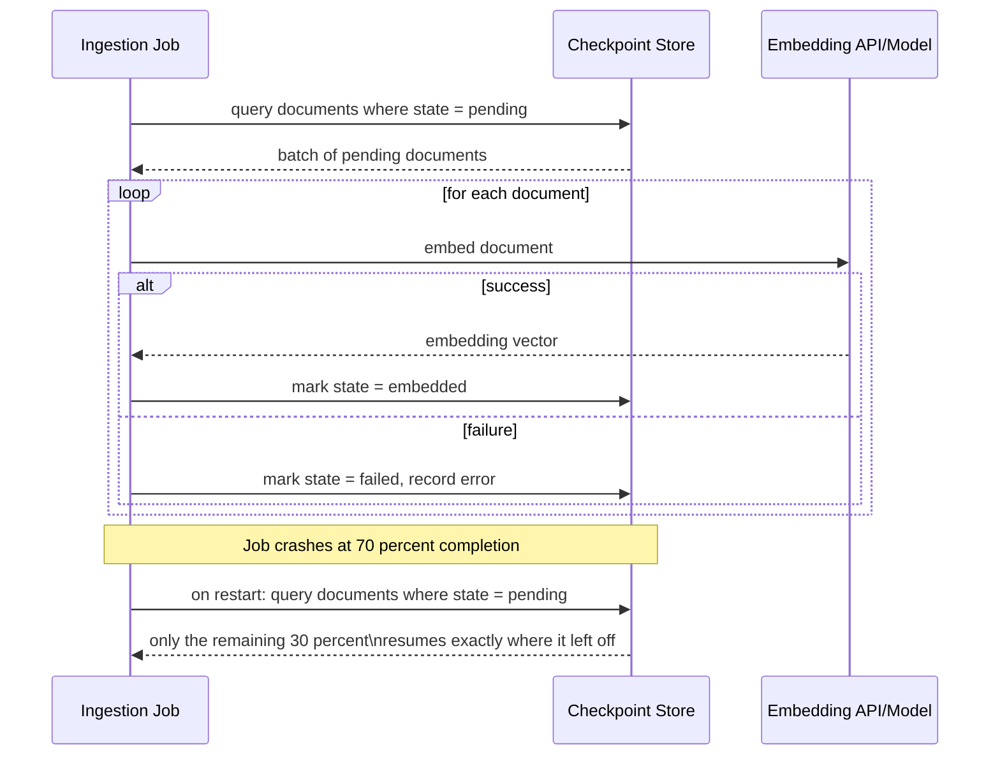
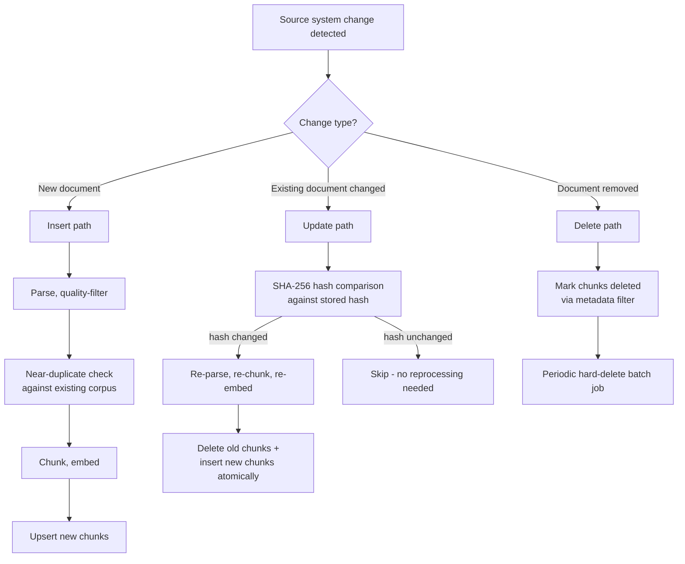
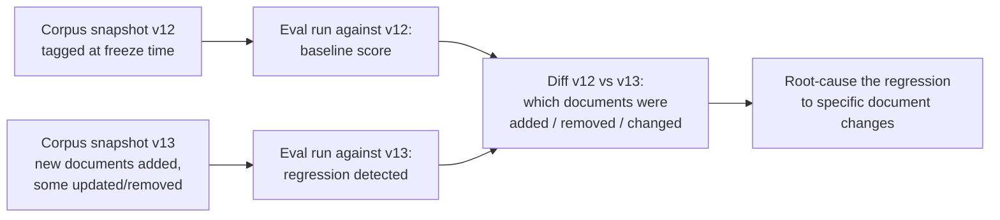

# AI Data Pipelines: Ingestion, Quality, and Freshness

## Overview

Every RAG system's answer quality has a hard ceiling set by what's actually sitting in the vector index, and what's sitting in the vector index is entirely a function of an unglamorous, easy-to-underinvest-in pipeline: parsing raw documents, filtering out garbage, chunking what's left, embedding it, and keeping the whole thing current as source documents change. A brilliant retrieval and generation architecture on top of a poorly ingested corpus performs worse than a mediocre architecture on top of a clean one — this pipeline is determinative, not auxiliary.

This chapter walks that pipeline stage by stage: parsing, quality filtering, chunking as a pipeline concern, embedding orchestration at scale, incremental updates, and the versioning discipline that makes eval regressions traceable. It is the data-engineering layer feeding [RAG Architecture](../06-rag/01-rag-architecture.md); the algorithmic chunking tradeoffs live there, while the pipeline-engineering concerns — re-chunking on update, atomic replacement, fan-out embedding — live here.

## Document Parsing at Scale

Raw documents are not text. They are page-description languages, markup with boilerplate, binary office formats, source code, and scanned images — each requiring a different extraction strategy before an embedding model can process them meaningfully.

### PDFs: the hardest format

A PDF is a page-description language, not a document format — there is no guaranteed semantic structure connecting what looks like a heading to an actual heading tag. Four strategies apply, in increasing cost and decreasing reliability of what's cheap:

- **Text-layer extraction** (pdfminer, PyMuPDF) — fast, and works well when the PDF has an embedded, machine-readable text layer, which most digitally-produced PDFs do. This should always be attempted first.
- **OCR fallback** (Tesseract, AWS Textract, Azure Document Intelligence) — required when the PDF is a scanned image with no text layer at all. Slower and less accurate than text-layer extraction, but the only option available for scanned content.
- **Layout-aware parsing** (Docling, Unstructured.io) — attempts to reconstruct document structure (headings, tables, figures) from the spatial layout of text on the page, rather than just extracting a flat text stream. Necessary when downstream chunking needs to respect document structure rather than treating the PDF as one undifferentiated blob of text.
- **Table extraction** — tables are especially lossy in PDFs, since a table's meaning depends on row/column alignment that a naive text extraction flattens into an unreadable sequence. Layout-aware tools do meaningfully better here, but accuracy still degrades on complex nested or merged-cell tables.
- **Multi-column detection** — a two-column academic paper read naively left-to-right across the full page width interleaves unrelated sentences from both columns into nonsense; layout-aware parsing that detects column boundaries and reads each column top-to-bottom before moving to the next is required for any multi-column source.

### HTML

Raw HTML needs stripping of navigation, ads, boilerplate, and script/style content before what remains is useful. Trafilatura and Readability.js are the standard main-content extractors, both trained to identify the actual article body versus surrounding chrome. JavaScript-rendered pages need a real browser (Playwright, Puppeteer) to execute the page before extraction, since a naive HTTP fetch only sees the pre-render HTML skeleton. A separate, harder problem is quality, not extraction: the web contains enormous volumes of thin, auto-generated, or SEO-farmed content that will degrade a corpus's average quality if it's not filtered before ingestion, regardless of how cleanly it was extracted.

### Office formats (DOCX, XLSX, PPTX)

python-docx, openpyxl, and python-pptx handle direct parsing of these formats' XML-based internals. Three details matter beyond the plain text: embedded images (charts, diagrams) often carry information that has no text-layer equivalent and are silently dropped by naive parsers; revision history/tracked changes should generally be excluded rather than ingested as if they were final content; and comment threads are a judgment call — sometimes genuinely useful context, sometimes noise, and worth a deliberate include/exclude decision rather than a default.

### Code

Code should be treated as a structured text format, not free prose. Chunk at function or class boundaries using tree-sitter or language-specific parsers, rather than at a fixed character count that can split a function mid-body. Preserve imports and type signatures alongside the function body in the chunk's context, since the information needed to understand a function correctly is frequently not contained within the function itself. Docstrings are often worth indexing as a separate retrieval target from the code body, since a docstring-to-query match and a code-body-to-query match serve different retrieval intents (intent-level search versus implementation-level search).

### Scanned documents / image-heavy PDFs

These require the full OCR-plus-layout-detection pipeline described above, and carry a real accuracy ceiling: even the best production OCR systems run 1-5% character error rates on degraded scans. Those errors propagate directly into embedding quality — a misrecognized digit in a contract or a garbled proper noun changes what the embedding represents, and there is no downstream fix for an OCR error once it's baked into the chunk text; the mitigation is measuring OCR confidence scores at ingestion and flagging low-confidence documents for review rather than silently trusting every OCR output equally.

## Content Quality Filtering

Parsing produces text. Quality filtering decides which of that text is actually worth embedding — run as a cascade, cheapest filters first, so expensive filters only run on documents that already survived the cheap ones.

**Structural filters (cheap, run first):** minimum length (discard ten-word "documents" that are almost certainly parsing artifacts, not real content), maximum length (flag suspiciously long single documents for splitting review, since a single 500,000-word "document" is often several concatenated files that failed to split correctly upstream), character-level filters (discard documents where more than roughly half the characters are non-alphabetic, a strong signal of a parsing artifact rather than real prose), and encoding filters (detect garbled encoding, such as Latin-1 bytes misinterpreted as UTF-8, which produces recognizable mojibake patterns).

**Language filters:** fastText-based language identification keeps a corpus's language mix intentional rather than accidental. Multilingual corpora need a deliberate choice — separate indexes per language, or a single multilingual embedding model — the same choice covered for the query side in [RAG Architecture's cross-lingual retrieval](../06-rag/01-rag-architecture.md#cross-lingual-retrieval). Watch for a specific failure mode: very short documents are disproportionately misclassified by language ID models, since there's too little signal for the classifier to be confident, so short-document language classification needs either a lower confidence threshold or a fallback rule rather than blind trust in the classifier's top prediction.

**Duplicate and near-duplicate detection (medium cost):** exact duplicates are caught cheaply via a SHA-256 hash of the normalized document text — an O(1) lookup against previously seen hashes. Near-duplicates (a slightly reformatted, re-exported, or lightly edited copy of the same underlying document) need MinHash combined with locality-sensitive hashing (LSH): generate multiple MinHash signatures per document, bucket documents whose signatures collide into candidate pairs, then confirm true near-duplicates within each bucket. The MinHash parameter tradeoff is direct — more hash functions produce a more accurate similarity estimate at proportionally more compute; the LSH band/row split trades recall (more bands, more candidate pairs caught) against precision (more false-positive candidate pairs to confirm). Near-duplicate detection matters more than it looks: several near-identical versions of the same source document inflate the index with redundant chunks and, worse, cause a query to return three near-identical chunks in its top-k instead of three genuinely different, useful ones — actively worse for RAG quality than having just the one clean version indexed.

**Content quality scoring (expensive, run last, sometimes async):** perplexity-based filtering flags documents that read as very high-perplexity under a language model — frequently machine-generated garbage, residual parsing artifacts, or low-effort content-farm output. Keyword-based blocklists catch spam, adult content, and known low-quality domains directly. Heuristic classifiers (paragraph length distribution, punctuation density, HTML-artifact density surviving extraction) add a cheaper approximation of the same signal perplexity filtering provides. Because this tier is the most expensive, many pipelines run structural, language, and duplicate filtering synchronously in-line at ingestion, and defer full quality scoring to an asynchronous pass that can re-score and retroactively prune the corpus without blocking new documents from becoming searchable.

## Chunking as a Pipeline Step

The algorithmic tradeoffs of chunk sizing and strategy belong to [RAG Architecture](../06-rag/01-rag-architecture.md); the pipeline concern here is different: chunking is not a one-shot operation performed once per document and forgotten. A document that gets updated must be re-chunked, and the resulting new chunks must atomically replace the old ones — never leaving a half-updated set of chunks (some from the old version, some from the new) live in the index simultaneously.

Two mechanics make this tractable:

- **Deterministic chunk ID generation** — a chunk's ID is a deterministic hash of the parent document's ID plus the chunk's index within that document. Re-ingesting the same document unchanged produces the exact same chunk IDs, which means an unchanged chunk can be recognized as unchanged (and skipped for re-embedding) rather than treated as a brand-new insert every time the parent document is re-processed.
- **Parent-document ID in chunk metadata** — every chunk stores the ID of the document it was derived from, which is what makes atomic replace-on-update possible (delete all chunks with this parent ID, insert the new set) and what enables parent-document retrieval strategies where a small chunk is used for matching but a larger parent context is delivered to the generator.

## Embedding Pipeline Orchestration

Embedding a corpus of millions of documents is a batch job with its own distinct engineering challenges — parallelism, rate limiting, and fault tolerance — separate from the parsing and filtering concerns above.

- **Fan-out for parallelism:** partition the corpus across N embedding workers that each process their partition independently. Partitioning strategy matters — round-robin is simplest, partitioning by document size balances compute across workers more evenly than round-robin alone (a worker that draws several huge documents in a row otherwise lags), and partitioning by source system is the simplest to reason about operationally even if it balances load less evenly. A coordination layer (Celery, Temporal, Prefect) manages worker assignment, tracks progress, and collects results back into a single completion signal. Where the embedding pipeline also needs to produce lexical/sparse representations alongside dense vectors for hybrid retrieval, that fan-out step is where it belongs — see [Advanced RAG Patterns](../06-rag/04-advanced-rag-patterns.md) for the retrieval-side tradeoffs hybrid search is solving for.

**Rate limiting against embedding APIs:** cloud embedding APIs (OpenAI `text-embedding-3`, Cohere) enforce hard requests-per-minute and tokens-per-minute ceilings. A client-side token-bucket limiter that paces requests under the ceiling, combined with exponential backoff specifically on 429 responses, avoids both under-utilizing the available rate and getting the whole job throttled by bursting past it. The batch API pattern — sending many texts in a single request rather than one text per call — reduces per-call overhead and is almost always the better default for bulk ingestion versus one-document-at-a-time calls.

**Checkpoint and resume:** a ten-million-document corpus can take hours to embed, and a job that fails at 70% completion must resume from that point, not restart from zero. This requires durable, per-document ingestion state (pending / embedded / failed) stored in PostgreSQL or Redis, with the resume operation being a simple query — select documents where state equals pending — rather than a full re-scan of the corpus to figure out what's already done.

**Self-hosted embedding models:** for privacy or cost reasons, many production systems run embedding locally (sentence-transformers on GPU) rather than calling a cloud API. Throughput scales with batching within a single GPU call — sending 64 texts in one batched forward pass rather than 64 separate calls is dramatically more efficient — and a single A100 can embed on the order of **50,000 documents/hour** at roughly 512 tokens each, depending on model size. Model version pinning matters here specifically: re-embedding the entire corpus is required whenever the embedding model changes, since old and new embeddings are not comparable in the same vector space, making an embedding-model upgrade a deliberate, versioned, corpus-wide event rather than a casual model swap.

## Incremental Corpus Updates

The corpus is never static — documents are created, updated, and deleted continuously, and each of the three operations has a different failure mode.

**Insert:** new document → parse → filter → chunk → embed → upsert. Straightforward in principle, with one real trap: a "new" document arriving from the source system might actually be a near-duplicate of something already indexed (a reformatted export, a copy posted to a second location), so the near-duplicate filter needs to run against the *existing corpus*, not just within the current ingestion batch, before treating it as a genuine insert.

**Update:** an existing document is modified. Detecting that it changed is a SHA-256 hash comparison against the previously stored hash for that document ID — if the hash matches, skip re-processing entirely; if it differs, re-parse, re-chunk, and re-embed. The genuinely hard part is atomicity: replacing the old chunk set with the new one without a window where the index has neither the complete old set nor the complete new set. Two practical approaches: use a transaction if the vector database supports one (rare, but some do), or perform a delete-then-insert where the document is briefly invisible in the gap between the two operations — an acceptable tradeoff for most products, since a brief invisibility window is a much smaller quality problem than serving stale-and-inconsistent mixed chunks would be.

**Delete:** a document removed from the source system needs every chunk with its document ID removed from the vector index — surprisingly hard at scale, since most vector databases are not optimized for efficient filtered delete-by-metadata operations at high volume. Three workable strategies: soft delete (mark chunks as deleted via a metadata flag and filter them out of every query, without physically removing them from the index immediately), periodic hard-delete batches (physically remove soft-deleted chunks in a scheduled maintenance job rather than synchronously per delete event), or a dedicated delete index (track pending deletions separately and reconcile against the main index on a schedule).

**Change detection:** the pipeline needs to know a source document changed at all before any of the above can run. Webhook-based change notification from the source system is the ideal (near-instant, no wasted polling), polling with hash comparison is the workable fallback when no webhook exists, and event-stream-based detection (Kafka CDC from a database via Debezium) suits sources that are themselves databases rather than document stores. The [Model Context Protocol](../13-tool-calling/02-model-context-protocol.md) is an increasingly common connector layer for these sources too — an MCP server exposing a wiki or ticketing system's resources gives the ingestion pipeline a standard way to pull documents and change signals without a bespoke connector per source. See [Real-Time and Streaming AI Architecture](04-real-time-and-streaming-ai.md) for the deeper treatment of streaming ingestion once change events arrive fast enough that batch reconciliation isn't good enough.

## Data Versioning for Reproducibility

When an eval regression appears, the first question is almost always "did the corpus change?" — which is unanswerable unless corpus versions are tracked as deliberately as code versions are.

Tag each index snapshot with a version ID at corpus-freeze time — this is the anchor everything else hangs off. If the vector database supports point-in-time queries, use them directly to reproduce exactly what a query would have returned at a past version. The eval regression workflow then becomes mechanical: diff two corpus versions to enumerate exactly which documents were added, removed, or changed between the last-known-good version and the regressed one, and root-cause against that specific, bounded diff rather than re-auditing the entire corpus from scratch.

## Monitoring

- **Pipeline throughput** (documents/hour) — the primary leading indicator that ingestion is keeping pace with the source systems feeding it.
- **Embedding error rate** — a rising rate often points to a source-format regression (a new document type the parser doesn't handle) rather than an embedding-API problem.
- **Near-duplicate rate per source** — a source suddenly producing a high near-duplicate rate usually indicates a change in how that source exports content (e.g., a CMS migration re-exporting previously-indexed pages under new IDs).
- **Corpus freshness lag** — how old is the newest embedded document from each source, measured against that source's actual latest update; this is the metric that catches a silently broken ingestion connector before users notice stale answers.
- **Index size over time** — a useful sanity check against expected growth; an unexpected jump often means duplicate detection quietly regressed.

## Google-Level Follow-Ups

- "Your near-duplicate detection rate suddenly spiked for one source system. What do you check first, and why?" — probes whether the candidate suspects an upstream export/format change at the source (a CMS re-exporting existing content under new document IDs) before assuming the MinHash/LSH parameters themselves regressed.
- "How would you redesign the delete path if a vector database migration removed support for efficient filtered delete entirely?" — probes for the soft-delete-plus-scheduled-hard-delete-batch pattern as a database-agnostic fallback, and whether the candidate can reason about the tradeoff (brief serving of soft-deleted chunks until the batch runs) rather than assuming a delete is always instantaneous.
- "A document's chunk count changed from 12 to 9 after an update. How do you guarantee no user ever sees a mix of 3 stale chunks and 9 new ones?" — probes for the atomic-replace discipline (delete-then-insert with an accepted invisibility gap, or a real transaction) versus a naive insert-then-delete that briefly serves an inconsistent mixed set.
- "Your embedding model provider deprecates the model version you've built your entire index on, with 90 days notice. Walk through your response plan." — probes for recognizing this as a full corpus re-embedding event requiring the fan-out architecture at scale, cost estimation against the corpus size, and a versioned cutover plan (index the new embeddings under a new version tag, validate against eval, then cut over) rather than an in-place, ungoverned swap.

## Common Mistakes

- **Treating PDF text extraction as reliable for all PDFs.** A PDF with no embedded text layer silently produces empty or garbage text unless the pipeline explicitly falls back to OCR — a gap that surfaces as mysteriously empty documents in the index, not an obvious error.
- **Chunking without deterministic, stable chunk IDs.** Re-ingesting an unchanged document as if every chunk were brand new wastes embedding cost and, worse, can create duplicate chunks in the index if the old ones aren't correctly identified and replaced.
- **Running expensive quality-scoring filters (perplexity, classifiers) synchronously in the critical ingestion path.** This needlessly slows down ingestion of documents that would have passed cheaper filters anyway; run cheap filters inline and expensive scoring asynchronously.
- **Skipping near-duplicate detection against the existing corpus, checking only within the current ingestion batch.** A near-duplicate of a document ingested weeks ago slips straight through if the check doesn't look at the full corpus, not just the current batch.
- **Deleting documents without a plan for filtered delete at scale.** Discovering that your vector database can't efficiently delete-by-metadata only after you need to purge a large batch of removed documents is an entirely avoidable, foreseeable gap.
- **No corpus versioning, so eval regressions can't be traced to specific document changes.** Without a tagged snapshot to diff against, every regression investigation starts from a blank slate instead of a bounded set of candidate causes.

## Key Takeaways

- The ingestion pipeline is a data-engineering system with its own on-call story, not a one-time setup script — a great RAG architecture on top of a poorly ingested corpus underperforms a mediocre architecture on a clean one.
- Document parsing needs a per-format strategy — text-layer extraction first, OCR fallback for scans, layout-aware parsing when structure (tables, multi-column) matters — and no single tool covers every format well.
- Quality filtering runs cheapest-first: structural and language filters inline, duplicate detection at medium cost, and perplexity/classifier-based scoring reserved for expensive, often asynchronous passes.
- Chunking is not one-shot — deterministic chunk IDs and parent-document metadata are what make re-chunking on update and atomic chunk replacement possible.
- Embedding orchestration at scale needs fan-out parallelism, client-side rate limiting against API ceilings, and durable checkpoint/resume state, since multi-hour jobs over millions of documents will fail partway through eventually.
- Insert, update, and delete each have a distinct hard part — insert needs corpus-wide (not batch-local) duplicate checking, update needs atomic chunk replacement, delete needs a strategy for vector databases that don't support efficient filtered delete.
- Corpus versioning — tagged snapshots and point-in-time queries where supported — is what turns an eval regression investigation from a full corpus audit into a bounded diff between two known versions.

## Interview Questions

### Beginner

**Q: Why is PDF parsing considered the hardest document format to handle in an ingestion pipeline?**
PDFs are a page-description language, not a structured document format — there's no guaranteed connection between what looks like a heading visually and any underlying semantic tag. Some PDFs have an embedded text layer that's fast and reliable to extract; scanned PDFs have no text layer at all and need OCR, which is slower and introduces character-level errors; and structural elements like tables and multi-column layouts require layout-aware parsing to avoid producing nonsensical flattened text.

**Q: What's the difference between exact duplicate detection and near-duplicate detection, and why do you need both?**
Exact duplicate detection (SHA-256 hash comparison) catches byte-for-byte identical documents cheaply. Near-duplicate detection (MinHash/LSH) catches documents that are substantially similar but not identical — a reformatted export or lightly edited copy — which exact hashing would miss entirely since even a single-character difference produces a completely different hash. Both matter because near-duplicates inflate a RAG index with redundant chunks just as much as exact duplicates do, just less obviously.

### Intermediate

**Q: Walk through what happens when a document already in the corpus gets updated at the source.**
Change detection (webhook, polling with hash comparison, or CDC) flags that the document changed. The pipeline computes a SHA-256 hash of the new content and compares it against the stored hash — if it matches, nothing changed and no reprocessing happens; if it differs, the document is re-parsed, re-filtered, re-chunked, and re-embedded, and the old chunk set for that document ID is atomically replaced with the new set, typically via a delete-then-insert operation, accepting a brief window where the document is invisible rather than risk serving a mixed old-and-new chunk set.

**Q: Why can't a ten-million-document embedding job just restart from the beginning if it fails at 70% completion?**
Because embedding a corpus that size takes hours, and restarting from zero would re-embed the 70% that already succeeded, wasting most of the job's compute and, if using a paid API, most of its cost. The fix is durable per-document state (pending/embedded/failed) in a store like PostgreSQL or Redis, so the resume operation is a simple query for documents still in the pending state rather than a full re-run.

### Senior

**Q: Your team's embedding model provider is deprecating the model version your entire corpus is built on. Design the migration.**
This is a full corpus re-embedding event, not an in-place swap, since old and new embeddings live in incompatible vector spaces. Estimate the cost and time using the fan-out embedding architecture (partition the corpus across N workers, respecting the new model's rate limits), and index the new embeddings under a new, separately tagged corpus version rather than overwriting the existing index in place. Validate the new version against the eval suite before cutover, and keep the old version queryable until the new one is confirmed healthy, so a regression can roll back to a known-good snapshot rather than being stuck mid-migration with a semi-updated index.

**Q: A vector database used in production doesn't support efficient filtered delete-by-metadata at scale. How do you design the delete path anyway?**
Use soft delete as the primary mechanism: mark chunks as deleted via a metadata flag at delete-event time (cheap, immediate) and filter deleted chunks out of every query path. Run a periodic hard-delete batch job (nightly or similar cadence) that physically removes soft-deleted chunks in bulk, which the database can typically do efficiently as a batch operation even if it can't do targeted filtered deletes efficiently one at a time. The tradeoff to make explicit: a deleted document's chunks are excluded from query results immediately (via the soft-delete filter) even though they're not physically purged from storage until the next batch run, which is an acceptable gap for correctness as long as the query-time filter is applied consistently everywhere.

### Staff

**Q: Design the full incremental-update pipeline for a 50-million-document enterprise corpus spanning wikis, tickets, and code repositories, each with different change-detection capabilities.**
Treat change detection as source-specific rather than uniform: wikis and ticket systems that support webhooks get near-instant change notification; code repositories can use Git's native commit history as a change feed (a commit touching a file is a deterministic, ready-made change event); any source with no webhook support falls back to scheduled polling with hash comparison, accepting a longer freshness lag for that source specifically and surfacing that lag as a per-source SLO rather than pretending all sources are equally fresh. Feed all three into the same downstream insert/update/delete state machine so the pipeline's core logic doesn't need to know which source triggered it. Instrument freshness lag per source separately from the start, since a 50M-document, multi-source corpus will have very different real-world freshness across sources, and a single blended freshness metric would hide whichever source is lagging worst — the same tiering discipline the [Capacity Planning Primer](../01-fundamentals/04-capacity-planning-primer.md) applies to workload types applies here to ingestion sources.

---

*Part of [AI Infrastructure](index.md) in the [AI System Design Notes](../index.md). Tracked in [BACKLOG.md](https://github.com/GyanendraChaubey/AI-System-Design-Notes/blob/main/BACKLOG.md).*
