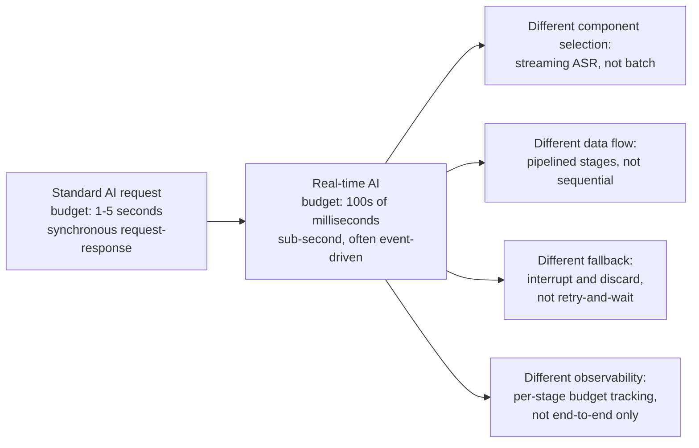
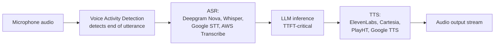
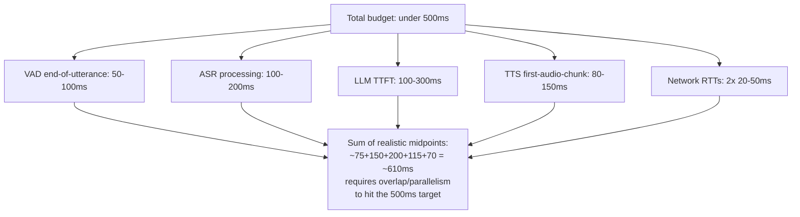
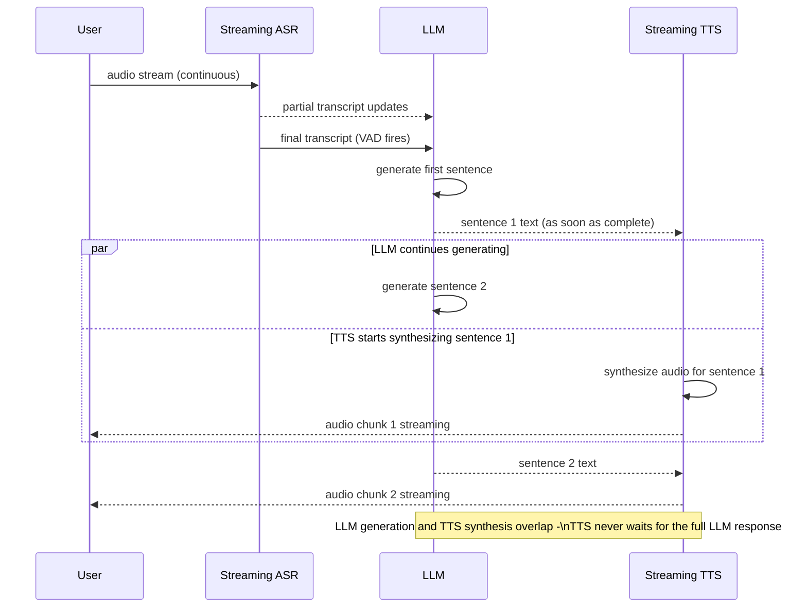
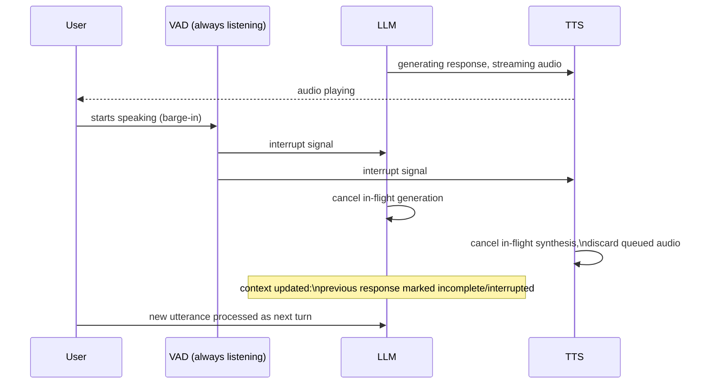
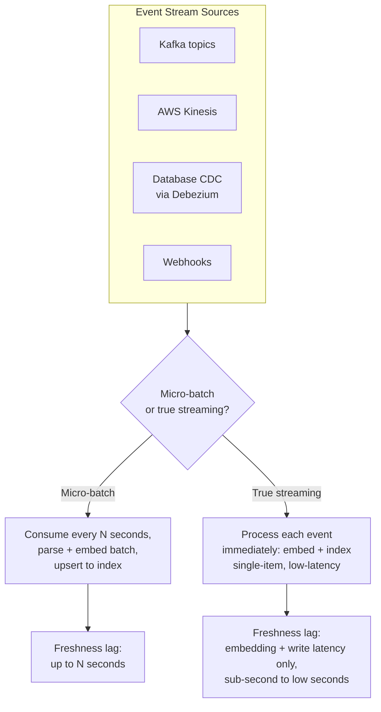
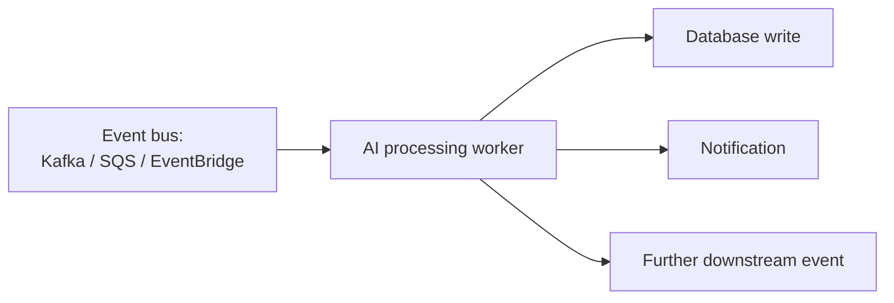
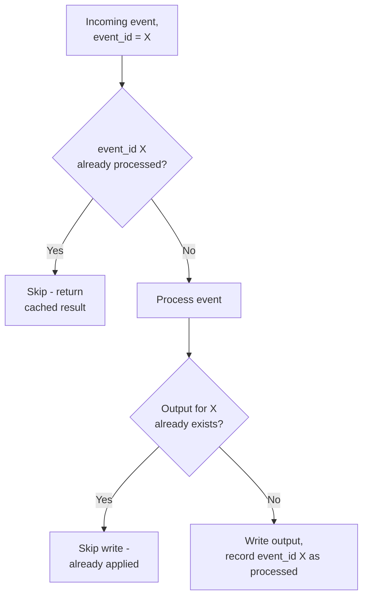
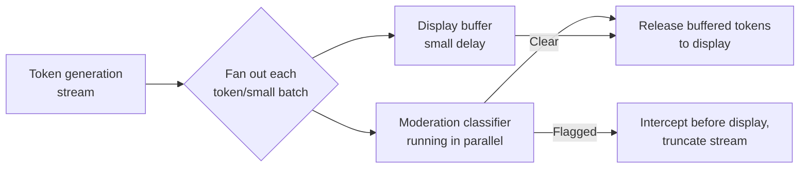

# Real-Time and Streaming AI Architecture

## Overview

The standard AI request lifecycle — user sends a prompt, server runs inference, server returns a result — has a latency budget measured in seconds. A voice assistant must respond within 500ms of the user finishing speaking. A live content moderation system must classify a comment before it's published. A fraud detector must score a transaction before it authorizes. These aren't the same problem with a tighter deadline — they require different component selection, different data flow, different fallback strategies, and different observability, not just faster versions of the same architecture.

This chapter covers the four system types where this distinction matters most: the voice AI pipeline (the most latency-constrained production AI architecture in wide deployment), streaming data ingestion for corpora that must stay live-fresh, event-driven AI triggered by system events rather than user requests, and real-time token-by-token content moderation.

## Voice AI Pipeline: The Canonical Real-Time AI System

Voice AI is the sharpest version of this problem: every millisecond between the user finishing a sentence and hearing a response is directly perceptible, and the pipeline has three distinct model stages — ASR, LLM, TTS — each contributing its own latency slice.

**ASR (Automatic Speech Recognition)** turns microphone audio into text. Deepgram Nova is the fastest production streaming option (roughly 200ms), OpenAI Whisper trades latency for higher accuracy, and Google Speech-to-Text and AWS Transcribe round out the common production choices. Streaming ASR emits partial transcripts continuously as the user speaks, rather than waiting for the entire utterance to finish the way batch ASR does — streaming is a hard requirement for any pipeline with a sub-second budget, since waiting for batch transcription before starting anything else burns the budget before the LLM stage even begins. Voice activity detection (VAD) determines when the user has actually finished speaking, and confidence scores on end-of-utterance detection matter directly: a VAD that fires too early cuts the user off mid-sentence, and one that fires too late adds pure dead time to every single turn.

**LLM inference** takes the transcript and generates a response. TTFT is the dominant constraint here — the user is waiting in silence — while TBT matters comparatively less, since TTS can begin streaming audio as soon as the first few tokens of text arrive, hiding most of the generation tail behind audio the user is already hearing. Techniques to minimize TTFT specifically: small-model tiering for simple conversational turns, prefix caching on the (typically static, repeated) system prompt, and KV cache warm-up so the first request of a session doesn't pay a cold-start penalty. Multi-turn voice conversations accumulate history turn over turn, which means TTFT tends to creep upward across a long conversation unless context is actively managed — see [Context Window Budgeting](../04-context-engineering/02-context-window-budgeting.md).

**TTS (Text-to-Speech)** converts LLM output tokens into an audio stream. ElevenLabs leads on quality at somewhat higher latency; Cartesia is tuned specifically for low latency at good quality; PlayHT and Google TTS are common alternatives. Sentence-level streaming TTS is the critical technique: begin synthesizing audio for the first complete sentence as soon as it's available, rather than waiting for the LLM's entire response to finish generating. This requires chunking LLM output at sentence boundaries (using punctuation and basic clause detection), not at arbitrary token boundaries, since a TTS engine fed a mid-sentence fragment produces unnatural prosody. Voice cloning and speaker consistency across a session are a further production concern once a specific voice identity is part of the product.

### The end-to-end latency budget

Summed sequentially, realistic midpoint numbers for each stage exceed the 500ms target — which is exactly why a naive sequential pipeline (wait for ASR to fully finish, then start the LLM call, then wait for the full LLM response, then start TTS) cannot hit voice-AI latency targets. Hitting the target requires overlapping stages, not just optimizing each one in isolation.

### Streaming architecture: overlap, buffering, and back-pressure

The overlap between LLM generation and TTS synthesis is what actually closes the gap between the sequential sum above and the 500ms target — TTS for sentence one runs concurrently with LLM generation of sentence two, rather than the two stages running back to back. Buffering points exist at each stage boundary (partial-transcript buffer, sentence-boundary buffer before TTS), and back-pressure matters specifically if TTS synthesis falls behind LLM generation — the pipeline needs a bounded queue of pending sentences rather than unbounded buffering, so a slow TTS stage doesn't silently accumulate unplayed audio that then floods out of sync with what the user expects.

### Barge-in and interruption handling

The user starts speaking while the AI is still talking. The system must stop immediately, discard whatever audio is currently queued or playing, and process the interruption as a new input — a scenario naive turn-based architectures don't handle at all.

VAD must run continuously on the user's microphone even while the AI's own audio is playing — not just at the start of each turn — since barge-in is by definition an interruption mid-response. The interruption signal must cancel both the in-flight LLM generation and the in-flight TTS synthesis, and discard already-generated but unplayed audio rather than let it play out after the interruption. The state-management challenge that's easy to miss: the model's conversation history must reflect that its previous response was cut off incomplete, not silently pretend the full (never-delivered) response was said in full — feeding a false completed-turn back into context corrupts every subsequent turn's reasoning about what's actually been said.

## Streaming Data Ingestion: Keeping a RAG Corpus Fresh From Live Event Streams

Some RAG corpora must reflect live data — a financial news system indexing breaking news within seconds, a support system reflecting ticket updates in real time. This is architecturally distinct from the batch and incremental-update ingestion covered in [AI Data Pipelines](03-ai-data-pipelines.md#incremental-corpus-updates): the requirement here is seconds of freshness lag, not the hours or minutes acceptable for most corpora.

**Event stream sources** carry different guarantees: Kafka topics and Kinesis streams typically preserve ordering per-partition and support at-least-once or exactly-once semantics depending on configuration; database CDC via Debezium captures row-level changes directly from the source database's write-ahead log, giving a change feed without requiring the source application to emit events itself; webhooks are simplest to integrate but carry the weakest delivery guarantees of the four and need the receiver to handle retries and deduplication independently.

**Micro-batch ingestion** consumes events in small time windows (every five seconds, for instance), then parses, embeds, and upserts the batch together. This is simpler to operate than true per-event streaming and amortizes embedding-API overhead across a batch, at the cost of adding up to one micro-batch interval of latency to every event.

**True streaming ingestion** processes each event as it arrives — embed and index immediately, with no batching window. This demands that both the embedding model and the vector database support efficient low-latency individual inserts, not just bulk/batch operations, which not every vector database is tuned for. The throughput ceiling here is set by whichever is more restrictive: the embedding API's per-request rate limit, or the vector database's individual-write throughput limit — a system pushed past either ceiling needs to fall back toward micro-batching under load rather than fail outright.

**Freshness lag monitoring** measures the gap between an event occurring in the source system and its corresponding vector becoming queryable — computed as the difference between the event's source timestamp and the vector index's ingestion timestamp for that same content. Alert thresholds should be set per corpus based on the product's actual freshness requirement (seconds for breaking news, minutes for ticket systems), and root causes of freshness lag spikes typically trace back to embedding API rate limiting, a backed-up consumer group lagging behind its stream's write rate, or a vector database write-throughput ceiling being hit under a burst of source events.

## Event-Driven AI: AI Triggered by Events Rather Than User Requests

Many production AI systems aren't chat interfaces at all — they're pipelines that activate when something happens: a document is uploaded, a database record changes, a monitoring alert fires.

This contrasts with request-response in two ways at once: there's no user waiting synchronously, so per-event latency requirements are looser — but throughput requirements can be far higher, since the system may need to process thousands of events per minute rather than serve one request at a time.

**Idempotency** is a hard requirement, not an optimization, because event-driven systems universally operate under at-least-once delivery — any event can be redelivered, and the AI processor must produce the same result on a re-delivery, not a duplicate output. The standard mechanism is an idempotency key: deduplicate incoming events by their event ID before processing (skip if already processed), and check whether an output already exists before writing a new one, so a redelivered event that got interrupted mid-processing doesn't produce a second, duplicate database write or notification.

**Fan-out processing** occurs when one incoming event triggers multiple independent AI tasks — classify a document, summarize it, and extract entities from it, all from the same upload event. A task queue handles the parallel dispatch, a result aggregation step collects the independent outputs back together, and partial-failure handling needs an explicit policy: does a failed entity-extraction task block the classification and summary results from being delivered, or are the three tasks independent enough to succeed or fail on their own?

**Backpressure and queue depth** are the primary health signal for event-driven AI — not latency, since there's no user waiting on a clock. If events arrive faster than the AI processor consumes them, the queue grows, and queue depth is what should trigger auto-scaling of AI workers, not a latency SLO that doesn't really apply here. The cost of a backlog is a real freshness violation even in a system with no per-event latency requirement: events processed minutes after they arrived can violate a downstream freshness expectation (a support ticket update that should have appeared in an agent's queue within a minute, appearing ten minutes late instead) even though no individual request ever technically "timed out."

## Real-Time Token-by-Token Moderation

Some moderation systems must classify content as it's generated, not after — intercepting harmful output in a streaming chat interface before it's ever displayed, rather than moderating a completed response after the fact.

Streaming moderation runs as a parallel process alongside the main token stream: each token or small token batch is sent to a classifier at the same time it's being prepared for display, rather than after the full response completes. The latency budget requirement is that moderation must complete before the display layer actually shows the token, which means introducing a small, deliberate buffer delay — display a token only after the classifier has cleared the tokens up to that point, not the instant it's generated. This buffer is the direct cost of the safety guarantee: a larger buffer gives the classifier more context and more time, at the cost of a less instantaneous-feeling stream to the user.

The core tradeoff is false-positive rate versus false-negative rate: aggressive moderation blocks legitimate content and frustrates users; permissive moderation lets harmful content through. Tuning this is a product decision informed by the specific harm being screened for, not a purely technical one. The state-management challenge compounds the difficulty: a token can be entirely benign in isolation but harmful in the context of what preceded it (a single word completing a harmful phrase started several tokens earlier), so the moderation model needs the accumulated context of the response so far, not just the current token or a small fixed window — which means the classifier's own cost grows with the length of the response being moderated, not just the arrival rate of new tokens.

## Google-Level Follow-Ups

- "Your voice AI pipeline hits its 500ms target at p50 but blows past 1.2s at p95. Where do you look first, and why?" — probes whether the candidate reasons about which stage has the fattest tail (LLM TTFT under context growth across a long conversation is the most common culprit) rather than assuming every stage degrades uniformly, and whether they'd instrument each stage's own p95 rather than relying on an aggregate end-to-end number alone.
- "A user barges in exactly as the TTS engine finishes synthesizing the last sentence of a response. What's the correct behavior, and what could go wrong?" — probes for the edge case where the interruption arrives after audio has already finished generating but the conversation-history update hasn't committed yet — a race condition between "response completed" and "interrupted" that a naive implementation can get wrong in either direction.
- "Your event-driven AI pipeline's queue depth is growing steadily, but average processing time per event hasn't changed. What are the possible causes?" — probes whether the candidate distinguishes an arrival-rate increase (more events per minute than before) from a genuine per-event slowdown, since queue depth growth with stable per-event latency points squarely at the former, and the fix (scale workers) is different from the fix for a real latency regression.
- "How would you design token-by-token moderation for a response where harm only becomes apparent from a pattern across dozens of tokens, not any single token?" — probes for recognizing that the classifier needs a sliding or growing context window rather than per-token independence, and for reasoning about the resulting cost/latency tradeoff of re-scoring accumulated context on every increment rather than a fixed per-token cost.

## Common Mistakes

- **Building a sequential (not overlapping) voice AI pipeline and expecting to hit sub-second latency.** Summing realistic per-stage latencies sequentially exceeds most real-time budgets; overlap between LLM generation and TTS synthesis is required, not optional.
- **Running VAD only at turn boundaries instead of continuously.** This makes barge-in impossible to detect, since the system isn't listening for interruption while its own audio is playing.
- **Forgetting to update conversation history after a barge-in.** Leaving the model's context showing a full response that was actually cut off mid-sentence corrupts every subsequent turn's reasoning about what was actually communicated.
- **Choosing micro-batch ingestion for a use case that genuinely needs seconds-level freshness.** A five-second batching window is invisible for most corpora but can be a real product failure for breaking-news or live-alerting use cases.
- **Treating event-driven AI processors as naturally idempotent without explicit dedup logic.** At-least-once delivery is the default assumption for event buses; skipping idempotency keys produces duplicate side effects (duplicate notifications, duplicate writes) on redelivery.
- **Monitoring only end-to-end latency for event-driven pipelines instead of queue depth.** Latency isn't the right health signal when there's no user waiting synchronously — a growing backlog is invisible to a latency dashboard until freshness violations are already well underway.

## Key Takeaways

- Real-time AI systems require different component selection, data flow, and fallback strategy than standard request-response AI — not just faster versions of the same architecture.
- The voice AI pipeline (ASR → LLM → TTS) cannot hit sub-second targets through sequential per-stage optimization alone; overlapping stages (TTS starting on sentence one while the LLM generates sentence two) is what closes the gap.
- TTFT dominates the voice AI latency budget because the user is waiting in silence; TBT matters less once TTS is already streaming audio from earlier tokens.
- Barge-in requires continuously running VAD, immediate cancellation of in-flight LLM and TTS work, and an explicit conversation-history update marking the interrupted response as incomplete.
- Streaming corpus ingestion trades simplicity (micro-batch, higher lag) against true low-latency freshness (per-event streaming, harder throughput ceiling), and the right choice depends on the product's actual freshness requirement, not a default.
- Event-driven AI systems are governed by queue depth as the primary health metric, not latency, and require idempotency by design since event buses operate at-least-once.
- Token-by-token moderation needs a deliberate small display buffer and growing context awareness, since harm can emerge from a pattern across tokens that no single token reveals in isolation.

## Interview Questions

### Beginner

**Q: Why can't a voice AI pipeline just run ASR, then LLM, then TTS sequentially and still hit a 500ms response target?**
Summing realistic latencies for each stage — VAD end-of-utterance detection, ASR processing, LLM time-to-first-token, and TTS first-audio-chunk generation — exceeds 500ms even at optimistic per-stage numbers. Hitting the target requires overlapping stages, most importantly starting TTS synthesis on the first completed sentence while the LLM is still generating later sentences, rather than waiting for each stage to fully finish before the next one starts.

**Q: What's the difference between micro-batch and true streaming ingestion for keeping a RAG corpus fresh?**
Micro-batch ingestion consumes events in small time windows (e.g., every five seconds), then processes and indexes them together — simpler to build, but adds up to one batch-interval of latency to every event. True streaming processes and indexes each event individually as it arrives, achieving much lower freshness lag, but requires both the embedding step and the vector database to support efficient low-latency single-item operations, not just bulk ones.

### Intermediate

**Q: Explain barge-in handling in a voice AI system, and what has to happen when it occurs.**
The system's VAD must run continuously on the user's microphone, even while the AI's own response audio is playing. When the user starts speaking mid-response, the VAD fires an interrupt signal that cancels the in-flight LLM generation and TTS synthesis and discards any already-generated but unplayed audio. The conversation history must then be updated to reflect that the previous AI response was incomplete/interrupted, not silently treated as if it had been delivered in full — otherwise every later turn reasons from a false premise about what was actually said.

**Q: Why is queue depth, not latency, the primary health metric for event-driven AI systems?**
There's no user waiting synchronously for a response, so a per-event latency SLO doesn't map cleanly onto user experience the way it does in request-response systems. A growing queue depth is the direct signal that events are arriving faster than the processor can consume them, which is what actually causes freshness violations (events processed minutes late) — a metric a pure end-to-end latency dashboard wouldn't surface until the backlog was already severe.

### Senior

**Q: Design the token-by-token moderation system for a chat product, including how you'd tune the false-positive/false-negative tradeoff.**
Run the moderation classifier in parallel with the main generation stream, feeding it accumulated context (not just the newest token, since harm can emerge from a pattern across several tokens) and gating the display layer behind it with a small, deliberate buffer — tokens are shown only once the classifier has cleared everything up to that point. Tune the false-positive/false-negative tradeoff against the specific harm categories being screened for and the product's tolerance for each: a customer support bot might tolerate a stricter, more false-positive-prone filter than a creative writing tool would, and this is a product decision that should be revisited against real flagged-content review, not fixed once at launch.

**Q: A live event-stream ingestion pipeline's freshness lag has been steadily climbing over the past week with no obvious outage. How do you diagnose it?**
Check whether the source event rate has actually increased (more documents/updates flowing in than before) versus the pipeline's processing rate degrading independently — the two have different fixes. If arrival rate is up, check the consumer group's lag against the stream (Kafka/Kinesis offset lag is a direct, measurable signal) and whether the embedding step or vector database write throughput is now the bottleneck at the higher volume. If arrival rate is flat, suspect a slow degradation in the embedding API's effective throughput (rate-limit tier not scaled with growth) or a vector database write-latency regression, and confirm with per-stage timing rather than assuming the whole pipeline degraded uniformly.

### Staff

**Q: You're asked to add a real-time fraud-scoring model to an existing payment authorization flow that currently completes in 150ms. The model adds 80ms of inference time. Walk through your design.**
First determine whether 80ms fits inside the existing 150ms budget or extends it, and whether the business is willing to extend the authorization latency at all — this is as much a product/risk decision as a technical one. If the budget must stay fixed, the model has to run in parallel with other authorization checks already in the flow rather than added serially, and if the model can't return in time, the system needs an explicit fallback policy (approve with a lower confidence threshold, hold for manual review, or decline) rather than an undefined hang — the same forced-choice found in the voice AI barge-in design and the event-driven backpressure design: real-time systems need an explicit fallback for the "not fast enough" case, not just a target-latency-under-normal-conditions design. Second, treat the model's own latency distribution, not just its average, as the design input — an 80ms average inference time with a fat p99 tail is a materially different design problem than a tight, low-variance 80ms, and the fallback policy needs to trigger against the tail, not the average.

---

*Part of [AI Infrastructure](index.md) in the [AI System Design Notes](../index.md). Tracked in [BACKLOG.md](https://github.com/GyanendraChaubey/AI-System-Design-Notes/blob/main/BACKLOG.md).*
