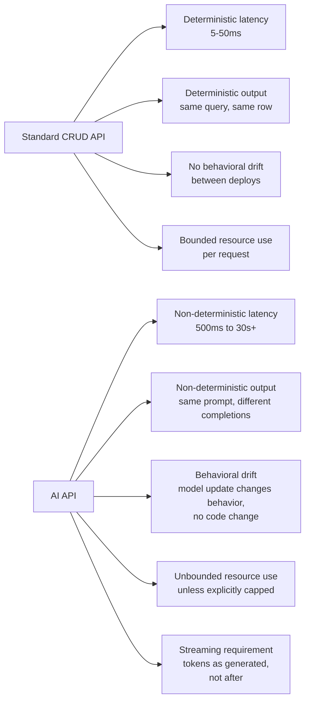
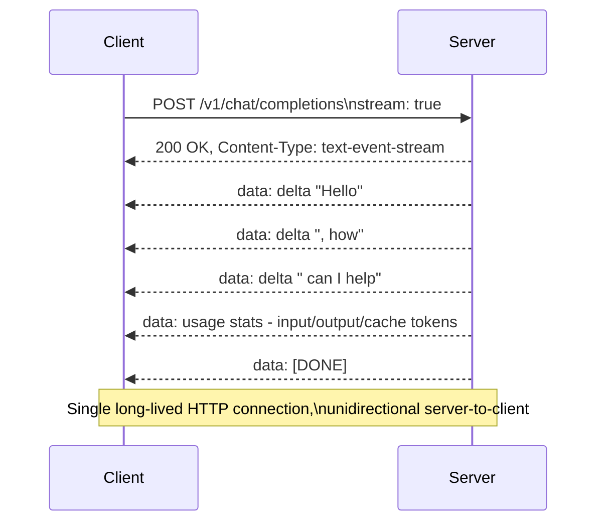
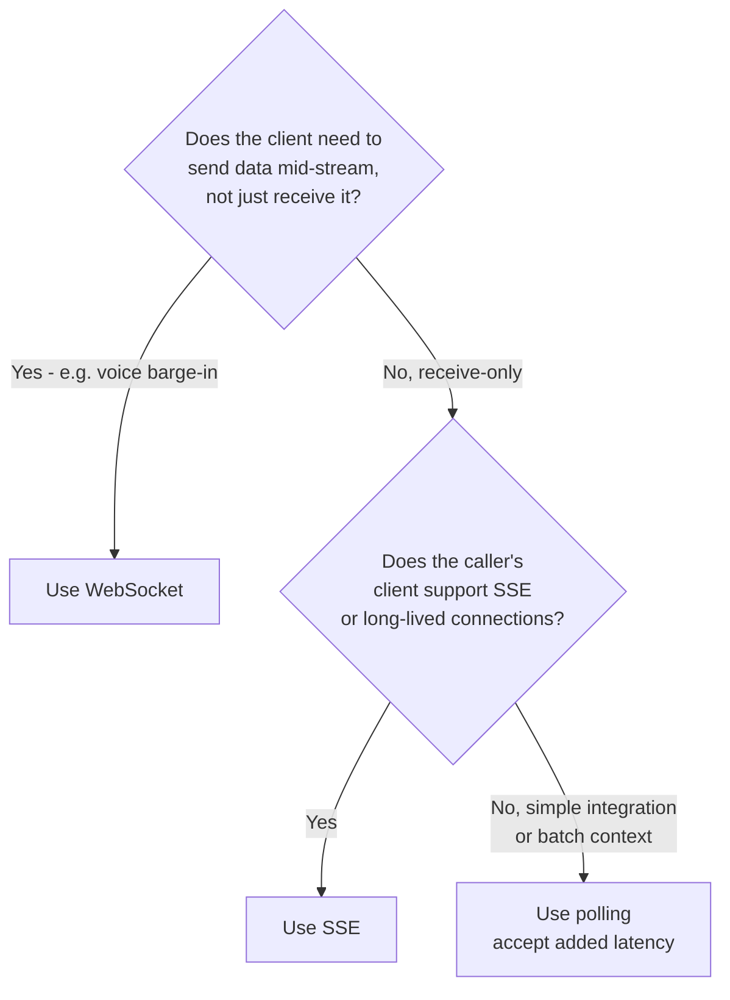
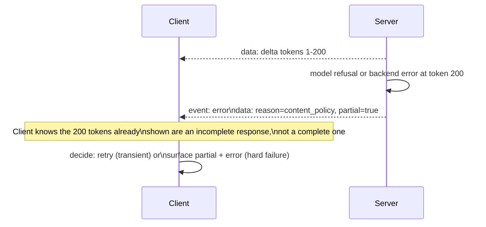
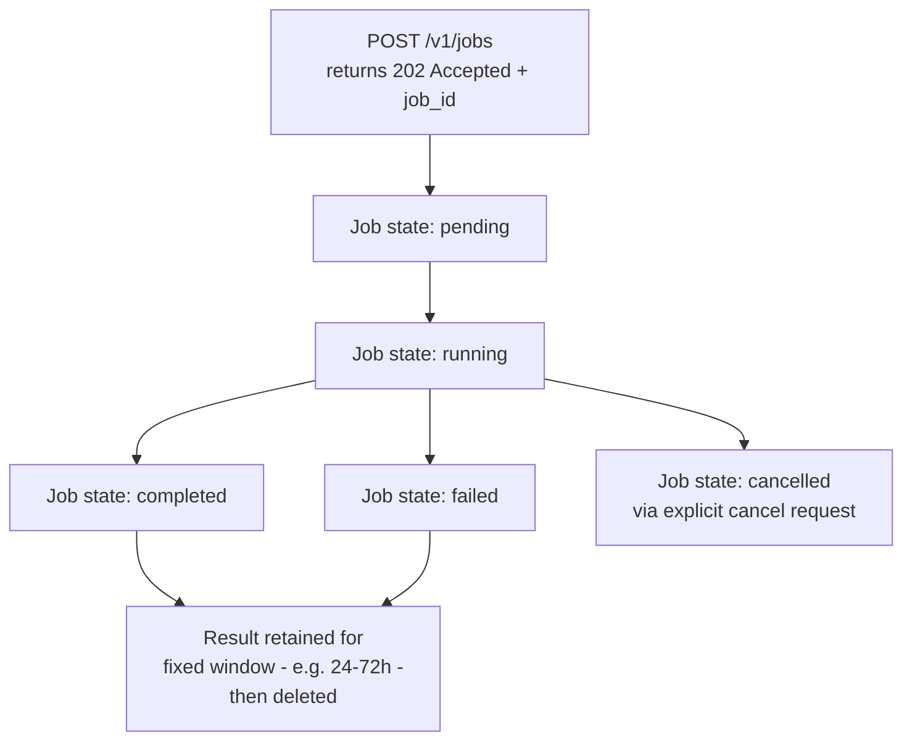
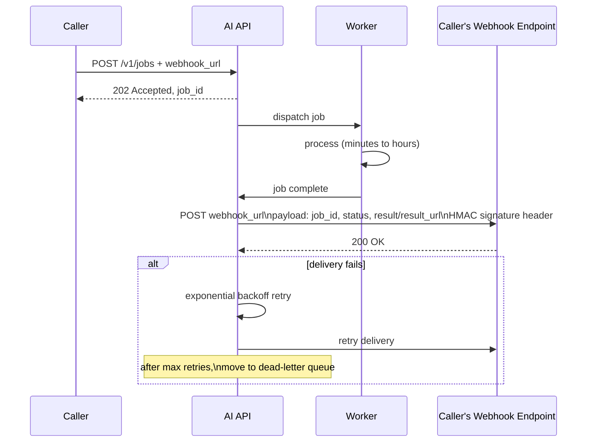
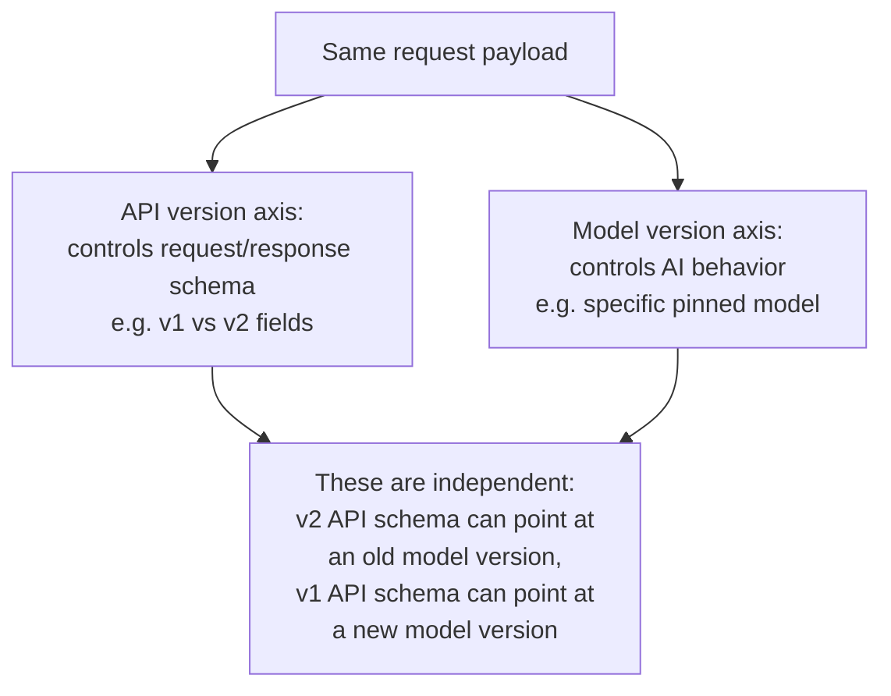
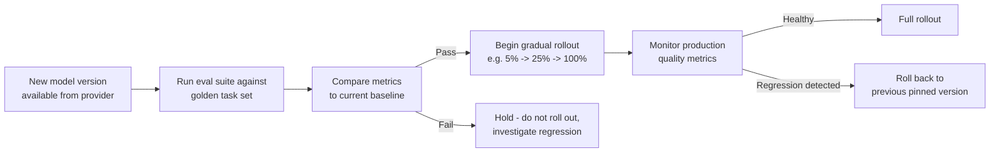
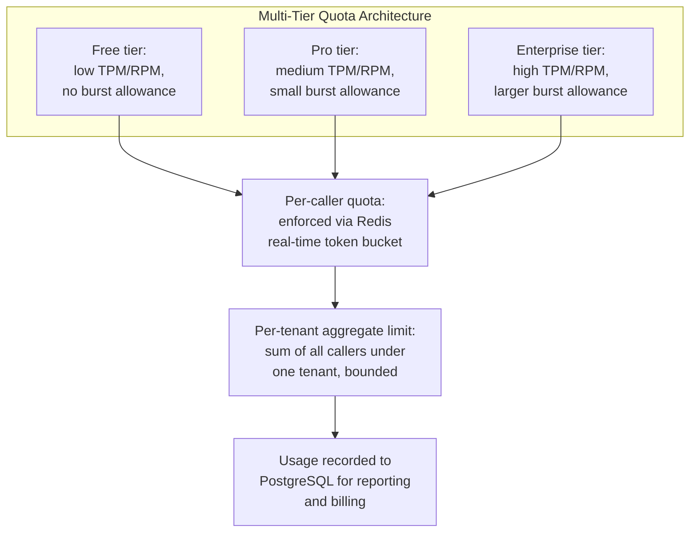

# AI API Design

## Overview

A CRUD API has deterministic latency, deterministic output, and no behavioral drift — the same request returns the same shape of response in the same rough timeframe, indefinitely, until someone changes the code. An AI API has none of those guarantees: a completion can take 500ms or 30 seconds, the same prompt returns different text every time, and updating the underlying model changes behavior with no code change at all. Designing the public surface of an AI product means designing around properties that standard REST API design has no precedent for.

This chapter covers the design patterns that exist specifically to handle these properties: streaming token delivery, async/webhook patterns for long-running tasks, versioning when a model update is itself a breaking change, and rate limiting built around tokens rather than requests.

## Streaming Token API Design

Any AI API with a chat or completion endpoint needs a streaming design, because callers want tokens as they're generated, not as a single blocking response after 10-30 seconds of silence.

### Server-Sent Events (SSE)

SSE is the dominant streaming format for AI APIs: the server sends a stream of `data:` lines over a single long-lived HTTP connection, and the client reads them as they arrive.

SSE is preferred over WebSocket for most AI APIs for three concrete reasons: it's unidirectional and stateless from the server's perspective (no bidirectional handshake or connection-state machine to manage), it works cleanly through HTTP/2 multiplexing and standard HTTP infrastructure (proxies, load balancers, CDNs already understand it), and it requires no special handshake beyond a normal HTTP request. On the server, this means `Content-Type: text/event-stream` with chunked transfer encoding; on the client, browsers get this for free through the native `EventSource` API, while server-side clients implement it as manual HTTP chunked-response reading.

### WebSocket

WebSocket is bidirectional and stateful, which is overkill for a plain completion endpoint but required whenever the client needs to send data mid-stream — the canonical case being voice AI, where the user may start talking (a barge-in signal, see [Real-Time and Streaming AI Architecture](04-real-time-and-streaming-ai.md#barge-in-and-interruption-handling)) while the server is still streaming a response. The cost is real: WebSocket connections are long-lived and stateful, which means connection-count scaling (sticky routing, connection-count limits per instance) becomes its own infrastructure concern in a way a stateless SSE connection doesn't.

### Polling for streaming results

Polling — create a job, poll a status endpoint, retrieve the result on completion — is a simpler fallback for callers that can't handle SSE. It's usually wrong for token-level streaming specifically, since each poll adds 100-500ms of round-trip latency on top of however long the underlying generation takes, and a caller polling at any reasonable interval either wastes requests or adds meaningful lag. It's acceptable where streaming isn't actually needed — batch jobs, or simple integrations where the caller only wants the final result and doesn't care about per-token delivery.

### Streaming error handling

An error mid-stream — a model refusal or a backend failure at token 200 of an expected 500-token response — needs explicit handling, not a silently closed connection. The server should send an explicit error event in the SSE stream rather than dropping the connection, so the caller can distinguish "the stream ended because generation completed" from "the stream ended because something broke."

Partial-response handling matters on the client side: the caller may have already displayed 200 tokens to a user, and the error event needs to carry enough information (a clear "this response is incomplete" signal) for the client to visually mark it as such, rather than leaving a truncated response looking like a complete, if short, answer. Client-side recovery should distinguish transient errors (worth a retry, ideally with backoff) from hard failures (content policy, invalid request) that a retry won't fix.

## Async and Webhook Patterns for Long-Running Tasks

Tasks that run for minutes or hours — a deep research agent, a document analysis pipeline, a fine-tuning job — cannot use synchronous request-response at all; the connection would need to stay open far longer than any reasonable HTTP timeout allows.

### The async job pattern

A POST creates the job and returns immediately (202 Accepted) with a job ID; a GET on the job resource returns current status and, once complete, the result. The job state machine — pending → running → completed / failed / cancelled — needs to be explicit in the API contract, not just an internal implementation detail, so callers can build correct logic around each terminal and non-terminal state. Callers should not poll at a fixed high frequency for ten minutes straight; the API should document a recommended polling interval with exponential backoff, and result retention needs an explicit, communicated policy (how long after completion is the result available before it's deleted) so callers don't design around an assumption that results live forever.

### Webhook delivery

Instead of polling, the server pushes a POST to a caller-provided URL when the job completes.

Webhook payload design should carry the job ID, status, and either the result inline or a URL to fetch it (inline for small results, a URL for large ones). Delivery is at-least-once, never exactly-once, so the receiver must deduplicate by job ID on their end — the same idempotency discipline covered for event-driven AI in [Real-Time and Streaming AI Architecture](04-real-time-and-streaming-ai.md#event-driven-ai-ai-triggered-by-events-rather-than-user-requests). Failed deliveries need exponential backoff with a bounded number of retries, after which the event moves to a dead-letter queue rather than being silently dropped. Every webhook payload should carry an HMAC signature so the receiver can verify it genuinely came from the API provider and wasn't spoofed by a third party who guessed or intercepted the webhook URL. Webhook testing infrastructure — a public URL tunneling to a local development server (ngrok and similar tools) — is a real, non-optional part of the developer experience for any API that supports this pattern. This exact pattern — job created, work happens asynchronously, a webhook delivers the outcome — is also how a long-running agent task waiting on human approval typically resumes; see [Human-in-the-Loop Architecture](../09-agents/06-human-in-the-loop-architecture.md) for the agent-side half of the same webhook contract.

### SSE for job status streaming

A third pattern sits between polling and webhooks: the caller opens an SSE connection directly to a job-status endpoint and receives progress events (job started, step 1 complete, step 2 complete, job done) as they happen, without needing a publicly reachable webhook URL of their own. This gives better UX than polling for long-running tasks where the caller wants live progress feedback but can't or doesn't want to run a webhook receiver.

### Cancellation

Callers need the ability to cancel a running job, and cancellation needs to actually propagate, not just flip a status flag while the underlying work keeps running. The API must signal the running worker to stop, and that signal must propagate to any sub-tasks the job has already spawned (a fan-out research task with five parallel sub-queries needs all five cancelled, not just the parent). Cancelling an already-completed job should return a clear, distinct status rather than a generic error, since that's a normal race condition (the cancel request and the completion happened close together), not a caller mistake. For tasks that produce genuinely incremental results, decide explicitly whether partial results remain available after cancellation — this is a real product decision, not an obvious default either way.

## API Versioning for Behavioral AI Changes

A model update is a behavioral change with no code change at all — the same request to the same endpoint before and after a model update can produce meaningfully different output, which has no equivalent in traditional API versioning.

**Model pinning** — specifying an exact model version (`claude-sonnet-4-6`, not `claude-latest`) — is the primary mechanism for behavioral stability. Callers pin to a specific version and upgrade only intentionally, not automatically on the provider's schedule. A pinned version needs a guaranteed availability window (commonly measured in months) before deprecation, and the upgrade workflow should be explicit: test the new version in staging, validate eval metrics against a golden task set, then migrate deliberately.

**API version vs. model version** are genuinely independent axes and conflating them is a common design mistake. The API version controls the request/response *schema* — what fields exist, what shape the response takes. The model version controls the AI's *behavior*. A caller can be on API v2 (new request fields available) while still pointed at an older, stable model version, or on API v1 while pointed at a newer model — communicating both dimensions clearly to callers (separate headers or fields for each) avoids the confusion of a single conflated "version" number that secretly changes two unrelated things at once.

**Behavioral deprecation notices** are needed whenever a model's behavior is changing in a non-backward-compatible way — for instance, a model that will stop producing XML-formatted output by default. This calls for the same deprecation discipline as a schema change: deprecation headers in API responses ahead of the change, changelog notifications, and a grace period before the old behavior actually disappears, rather than a silent behavioral cutover that only shows up as a downstream regression.

**Eval-gated model upgrades** put a quality gate between "new model available" and "callers see it."

## Rate Limiting and Quota Design for Multi-Tenant AI APIs

AI APIs have two resource constraints standard APIs don't need to distinguish: tokens (a measure of compute consumed, proportional to input plus output length) and requests (a measure of call frequency) — and a request-count-only rate limit badly under- or over-constrains actual resource usage, since a 100-token request and a 10,000-token request cost wildly different amounts of compute despite counting identically against a plain requests-per-minute limit.

**Token-based rate limiting** expresses limits in tokens-per-minute (TPM) rather than (or in addition to) requests-per-minute (RPM). Enforcing this requires counting tokens before the request is even sent to the model — an approximate count using the same tokenizer the model uses is standard practice, accepting that it's an estimate until the actual usage is known. A weighted token-bucket approach avoids rejecting short requests just to protect budget headroom for occasional long ones, and response headers (`X-Tokens-Consumed`, `X-Tokens-Remaining`) let callers self-monitor their own consumption against the limit in real time rather than discovering it only via a 429.

**Multi-tier quotas** give different caller tiers (free, pro, enterprise) different TPM and RPM ceilings.

Per-caller quotas (each API key has its own bucket) are the baseline; per-tenant aggregate limits matter in multi-tenant SaaS specifically, where the sum of many individual callers under one paying tenant needs its own ceiling independent of any single caller's limit. Burst allowance — permitting a short spike above the sustained rate — absorbs realistic, non-abusive traffic patterns without needing to size the sustained rate itself for worst-case bursts. The quota database split is deliberate: Redis for real-time enforcement (fast, in-memory counters), PostgreSQL for quota configuration and historical usage reporting (durable, queryable, not on the hot path of every request).

**Cost attribution and billing** requires tracking cost per request (input tokens × input price plus output tokens × output price), rolling that up per tenant, and feeding the rollup into a metered billing system (Stripe Metered Billing or equivalent). This is the same per-request cost tracking that underlies the [Capacity Planning Primer](../01-fundamentals/04-capacity-planning-primer.md)'s API-based cost branch, applied at the level of an individual paying customer rather than the whole product.

**Graceful degradation under load** determines which requests get shed when the system is overloaded — priority-based shedding drops background/batch work before interactive requests, and caller-tier-based shedding sheds free-tier callers before paying ones. A `Retry-After` header should tell the caller exactly how long to wait, computed from when their quota will actually next be available, rather than returning a bare 429 with no information the caller can act on.

## Request and Response Schema Design for AI APIs

Several schema patterns exist specifically because AI APIs need them and standard CRUD API design has no equivalent need for:

- **System prompt as a first-class field** versus embedded in the messages array — a first-class field makes it explicit which part of the request is developer-controlled instructions versus user-controlled conversation, which matters for both clarity and for [prompt-injection-resilient design](../03-prompt-architecture/04-prompt-injection-resilient-design.md).
- **Conversation history format** — a messages array with role and content fields (system, user, assistant, tool) is the near-universal convention across providers.
- **Streaming response schema** — whether each SSE event carries a delta (just the new text since the last event) or the full accumulated content so far; deltas are more bandwidth-efficient but require the client to accumulate state correctly.
- **Tool/function schema embedding** — how tool definitions and tool call results are represented in the request/response, covered in depth in [Function Calling Architecture](../13-tool-calling/01-function-calling-architecture.md).
- **Stop sequences and stop reasons** — the response should always carry why generation stopped (natural completion, stop sequence hit, max tokens reached, content policy) as a distinct field, not something the caller has to infer.
- **Usage statistics in the response** — input tokens, output tokens, and cache read tokens (for providers supporting prompt caching) should be returned on every response, since callers need this for their own cost tracking and quota self-monitoring.
- **Error taxonomy** — a model error, a content policy rejection, a rate limit, and a malformed request are four different problems that need four distinct, documented error codes, not a blanket 400 or 500 that forces the caller to parse an error message string to figure out what actually happened.

## Google-Level Follow-Ups

- "A caller complains that identical requests to your API sometimes cost noticeably different amounts. Is that a bug?" — probes whether the candidate understands that output length (and therefore cost) is inherently non-deterministic for the same prompt, and can articulate that this is expected behavior requiring cost transparency (usage stats in every response) rather than a bug to "fix."
- "Design the API contract for cancelling a job that has already spawned five parallel sub-tasks, two of which have already completed." — probes for reasoning about cancellation propagation to sub-tasks and an explicit decision on whether the two completed sub-tasks' partial results are retained or discarded, rather than treating cancellation as an atomic all-or-nothing operation without considering what's already been produced.
- "Your API's rate limiter counts requests, not tokens. What's the concrete failure mode, and how would you migrate without breaking existing callers?" — probes for the ability to describe the actual failure (long-context requests silently starving the fair-use budget while looking identical to short ones under a request-count limit) and a migration plan that avoids breaking existing integrations overnight (dual-counting during a transition window, clear deprecation communication).
- "How do you decide when a model behavior change is significant enough to require a deprecation notice versus being silently absorbed as normal model improvement?" — probes for a defensible line (behavior changes that break a caller's existing parsing/prompting assumptions, like format changes, need notice; general quality improvements that don't change response shape or expected structure don't), rather than either notifying on every model update or never notifying at all.

## Common Mistakes

- **Rate limiting purely on request count, ignoring token count.** A caller sending many small requests and a caller sending few enormous ones can look identical under a request-count limit despite wildly different real resource consumption.
- **Closing the connection silently on a mid-stream error instead of sending an explicit error event.** The caller can't distinguish "generation finished normally" from "something broke," and any partial response already shown to a user looks falsely complete.
- **Conflating API version and model version into a single version number.** This forces callers into an all-or-nothing choice when they might want new schema fields without a model behavior change, or vice versa.
- **Polling a job-status endpoint at a fixed, aggressive interval with no backoff guidance from the API.** Wastes requests, adds load to the API, and is worse UX than either webhooks or SSE-based status streaming for genuinely long-running tasks.
- **Shipping a model upgrade without an eval gate.** A model swap that isn't validated against a golden task set before rollout risks a silent quality regression that only shows up once it's already affecting every caller.
- **Returning a bare 429 with no `Retry-After` information.** Forces the caller to guess at a retry interval instead of being told exactly when their quota will next be available.

## Key Takeaways

- AI APIs differ from standard CRUD APIs on five axes at once — non-deterministic latency, non-deterministic output, behavioral drift from model updates, unbounded resource consumption, and a hard streaming requirement — and each needs its own design pattern, not a generic REST convention.
- SSE is the default streaming transport for AI completions because it's unidirectional, stateless server-side, and needs no special handshake; WebSocket is reserved for cases needing genuine bidirectional mid-stream communication, like voice barge-in.
- Long-running tasks need an explicit job state machine plus either webhook delivery (HMAC-signed, retried with backoff, deduplicated by the receiver) or SSE-based status streaming — polling is the fallback, not the default.
- Model version and API version are independent axes: one controls behavior, the other controls request/response schema, and conflating them into a single version number confuses callers about what actually changed.
- Model upgrades should be eval-gated against a golden task set and rolled out gradually with production monitoring, never swapped in place without validation.
- Token-based rate limiting, not request-count limiting, is the correct primitive for AI APIs, because token count — not request count — is what actually tracks compute consumption.
- Every response needs usage statistics and an explicit stop reason; every error needs a distinct, documented code rather than a generic 400/500 the caller has to parse to understand.

## Interview Questions

### Beginner

**Q: Why is SSE preferred over WebSocket for most AI chat completion APIs?**
SSE is unidirectional and stateless from the server's perspective — the client just reads a stream of text as it arrives over a normal, single HTTP connection, with no bidirectional handshake or connection-state machine to manage. It works cleanly through existing HTTP infrastructure like proxies and load balancers. WebSocket is only needed when the client must send data back mid-stream, such as a voice AI barge-in signal — for a standard one-way token stream, WebSocket adds connection-management overhead with no corresponding benefit.

**Q: What does it mean for an AI API to have "non-deterministic latency," and why does that matter for API design?**
The same request can take 500ms or 30 seconds depending on output length and system load, unlike a CRUD API's roughly constant latency. This matters because it forces streaming as a first-class design requirement (callers can't just wait synchronously for a response the way they would for a database read) and because timeout and retry logic on both client and server need to account for a much wider expected latency range than standard API design assumes.

### Intermediate

**Q: Design the API contract for a long-running document analysis job. What are the key pieces?**
A POST endpoint creates the job and returns 202 Accepted with a job ID immediately, rather than blocking. A GET endpoint on that job ID returns the current state (pending, running, completed, failed, cancelled) and, once complete, the result or a URL to fetch it. The API should document a recommended polling interval with backoff if polling is supported, offer webhook delivery as an alternative (with HMAC signing and retry-with-backoff on delivery failure), and specify a clear result-retention window so callers know how long after completion the result remains available.

**Q: Why does token-based rate limiting need to estimate token count before the request is sent, and what's the practical implication?**
Because the whole point of a token-based limit is to reject or admit a request based on how much compute it'll actually consume, and that has to be checked before the request is admitted, not after — checking afterward defeats the purpose of a limit. The practical implication is that the pre-flight count is necessarily an estimate (using the same tokenizer the model uses, but before the model has actually run), and the real usage figure returned in the response's usage stats may differ slightly, which the accounting and quota-deduction logic needs to reconcile against, not just trust the estimate as final.

### Senior

**Q: A model provider is deprecating the model version your API has pinned callers to, with 60 days notice. Design the migration process for your API's callers.**
Run the new model version through the eval suite against your golden task set well before the deprecation date, and treat any regression found there as a blocker to recommending the migration, not just an FYI. Communicate the deprecation to callers immediately with the full 60-day window, including a clear behavioral-change summary if the eval surfaced any meaningful differences, and provide a way for callers to test the new version against their own use case before the cutover (a staging pin, or a percentage-based gradual rollout they can opt into early). On the day the old version actually stops being served, callers who haven't migrated need a defined fallback behavior (auto-migrate to the new pinned version, or a hard failure with a clear error) rather than an undefined failure mode — and that decision should be made and communicated well before the deadline arrives, not decided reactively on the day itself.

**Q: Design token-based multi-tier rate limiting for a SaaS product with free, pro, and enterprise tiers, where enterprise customers can have many individual API keys under one account.**
Enforce two nested limits: a per-API-key TPM/RPM bucket (in Redis, for real-time enforcement) sized according to that key's tier, and a per-tenant aggregate TPM/RPM ceiling that sums usage across every API key under the same enterprise account, since an enterprise customer with fifty keys each individually under their per-key limit could otherwise blow far past what the tenant actually pays for in aggregate. Give each tier a burst allowance sized to that tier's realistic usage pattern rather than a single global burst percentage, and expose per-key and per-tenant usage via response headers and a usage-reporting endpoint so enterprise admins can see where their aggregate budget is actually going, not just get throttled with no visibility into which key is consuming the shared ceiling.

### Staff

**Q: Your company's AI API currently returns a generic 500 for every failure — model error, content policy rejection, rate limit, and malformed request all look identical to callers. Walk through redesigning the error taxonomy without breaking every existing integration overnight.**
Start by introducing the new, specific error codes alongside the existing generic 500/400 responses rather than replacing them outright — add a structured error body (a distinct `error.type` field: `model_error`, `content_policy`, `rate_limit`, `invalid_request`) while keeping the existing HTTP status codes stable during a transition window, since existing callers' retry logic is likely keyed off status codes already and changing those wholesale would be the actual breaking change, not adding more detail to the body. Document the new taxonomy clearly, give callers a deprecation timeline for when the *old*, underspecified error shape stops being guaranteed, and treat this the same as any other behavioral-versioning problem in this chapter — communicate the change, give a grace period, and validate that major SDK/client libraries have adopted the new shape before considering the migration complete, rather than flipping the contract for every caller simultaneously.

---

*Part of [AI Infrastructure](index.md) in the [AI System Design Notes](../index.md). Tracked in [BACKLOG.md](https://github.com/GyanendraChaubey/AI-System-Design-Notes/blob/main/BACKLOG.md).*
